# Google OAuth2 Authentication: Complete Implementation Guide

## Table of Contents
1. [Overview & Big Picture](#overview--big-picture)
2. [Complete Authentication Flow](#complete-authentication-flow)
3. [Frontend Implementation](#frontend-implementation)
4. [Backend Token Exchange](#backend-token-exchange)
5. [User Management](#user-management)
6. [Session Management](#session-management)
7. [Security Best Practices](#security-best-practices)
8. [Error Handling](#error-handling)
9. [Implementation Examples](#implementation-examples)
10. [Database Schema](#database-schema)
11. [Quick Reference](#quick-reference)

---

## Overview & Big Picture

Google OAuth2 allows users to sign into your application using their Google account without sharing their password with your app. This guide covers the complete flow from frontend initiation to backend session management.

### Key Components
- **Frontend (Web App)**: Initiates OAuth flow, handles redirects
- **Google OAuth**: Provides authentication and authorization
- **Backend (API)**: Exchanges tokens, manages sessions
- **Database**: Stores user data and sessions

---

## Complete Authentication Flow

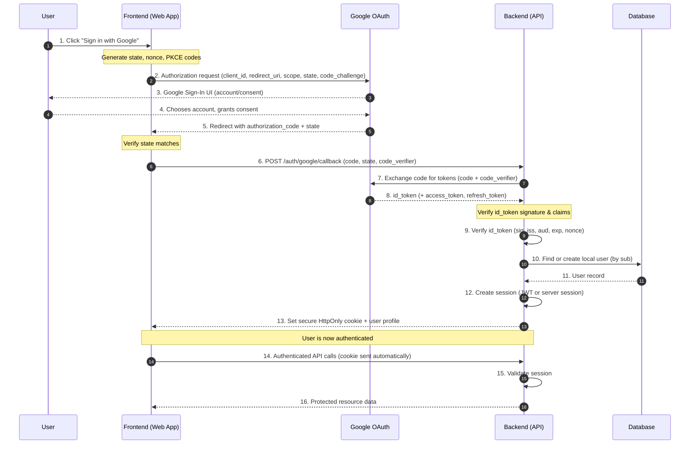

### Step-by-Step Breakdown

**Steps 1-2: Initiation**
- User clicks "Sign in with Google" button
- Frontend generates security tokens (state, nonce, PKCE)
- Frontend redirects user to Google's authorization endpoint

**Steps 3-5: User Consent**
- Google shows account picker and consent screen
- User selects account and grants permissions
- Google redirects back with authorization code

**Steps 6-8: Token Exchange**
- Frontend sends authorization code to backend
- Backend exchanges code for Google tokens
- Google returns ID token (and optionally access/refresh tokens)

**Steps 9-13: User Session Creation**
- Backend verifies Google ID token
- Backend finds or creates user in local database
- Backend creates local session
- Backend sends session cookie to frontend

**Steps 14-16: Authenticated Requests**
- Frontend makes API calls with session cookie
- Backend validates session for each request
- Backend returns protected data

---

## Frontend Implementation

### 1. OAuth Flow Initiation

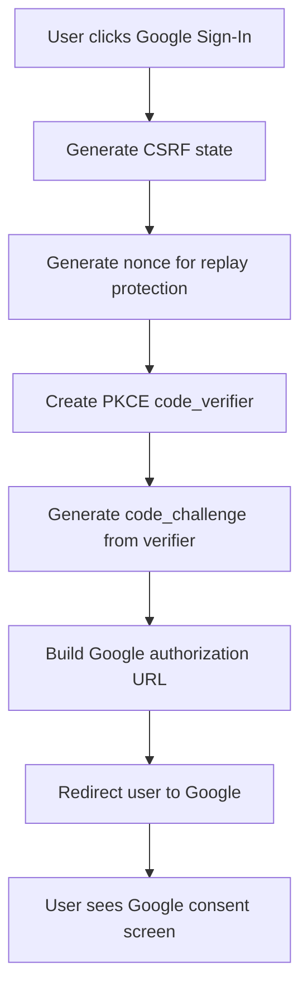

#### What Happens in Detail:

1. **State Generation**: Creates a random string to prevent CSRF attacks
2. **Nonce Generation**: Creates a unique value to prevent replay attacks
3. **PKCE Setup**: 
   - `code_verifier`: Random string (43-128 characters)
   - `code_challenge`: SHA256 hash of code_verifier, base64url encoded
4. **Authorization URL**: Constructs Google OAuth URL with all parameters

#### Frontend Code Example:

```javascript
// Generate security tokens
function generateOAuthTokens() {
    const state = generateRandomString(32);
    const nonce = generateRandomString(32);
    const codeVerifier = generateRandomString(128);
    const codeChallenge = base64URLEncode(sha256(codeVerifier));
    
    // Store in sessionStorage for callback verification
    sessionStorage.setItem('oauth_state', state);
    sessionStorage.setItem('oauth_nonce', nonce);
    sessionStorage.setItem('code_verifier', codeVerifier);
    
    return { state, nonce, codeVerifier, codeChallenge };
}

// Initiate Google OAuth
function initiateGoogleAuth() {
    const { state, nonce, codeChallenge } = generateOAuthTokens();
    
    const params = new URLSearchParams({
        client_id: 'YOUR_GOOGLE_CLIENT_ID',
        redirect_uri: 'https://yourapp.com/auth/callback',
        response_type: 'code',
        scope: 'openid email profile',
        state: state,
        nonce: nonce,
        code_challenge: codeChallenge,
        code_challenge_method: 'S256'
    });
    
    window.location.href = `https://accounts.google.com/o/oauth2/v2/auth?${params}`;
}
```

### 2. Handling the Callback

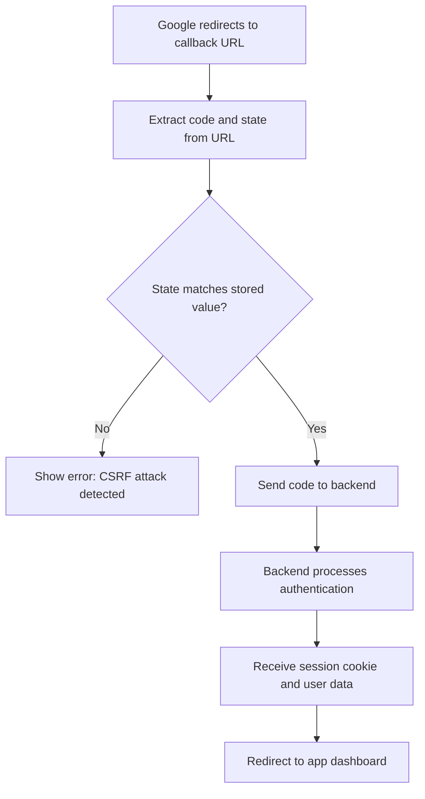

#### Callback Handler:

```javascript
// Handle OAuth callback
function handleOAuthCallback() {
    const urlParams = new URLSearchParams(window.location.search);
    const code = urlParams.get('code');
    const state = urlParams.get('state');
    const storedState = sessionStorage.getItem('oauth_state');
    const codeVerifier = sessionStorage.getItem('code_verifier');
    
    // Verify state to prevent CSRF
    if (state !== storedState) {
        throw new Error('Invalid state parameter - possible CSRF attack');
    }
    
    // Send to backend for token exchange
    fetch('/auth/google/callback', {
        method: 'POST',
        headers: { 'Content-Type': 'application/json' },
        credentials: 'include', // Include cookies
        body: JSON.stringify({
            code: code,
            state: state,
            code_verifier: codeVerifier,
            redirect_uri: 'https://yourapp.com/auth/callback'
        })
    })
    .then(response => response.json())
    .then(data => {
        if (data.success) {
            // Clear temporary storage
            sessionStorage.removeItem('oauth_state');
            sessionStorage.removeItem('oauth_nonce');
            sessionStorage.removeItem('code_verifier');
            
            // Redirect to app
            window.location.href = '/dashboard';
        }
    });
}
```

---

## Backend Token Exchange

### Token Exchange Process

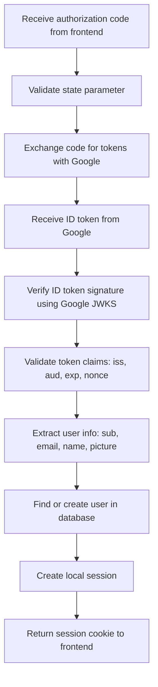

### Detailed Token Verification

#### 1. Exchange Authorization Code

```javascript
// Backend: Exchange code for tokens
async function exchangeCodeForTokens(code, codeVerifier, redirectUri) {
    const tokenEndpoint = 'https://oauth2.googleapis.com/token';
    
    const params = new URLSearchParams({
        client_id: process.env.GOOGLE_CLIENT_ID,
        client_secret: process.env.GOOGLE_CLIENT_SECRET,
        code: code,
        grant_type: 'authorization_code',
        redirect_uri: redirectUri,
        code_verifier: codeVerifier
    });
    
    const response = await fetch(tokenEndpoint, {
        method: 'POST',
        headers: { 'Content-Type': 'application/x-www-form-urlencoded' },
        body: params
    });
    
    if (!response.ok) {
        throw new Error('Token exchange failed');
    }
    
    return await response.json();
    // Returns: { id_token, access_token, refresh_token, expires_in, token_type }
}
```

#### 2. Verify ID Token

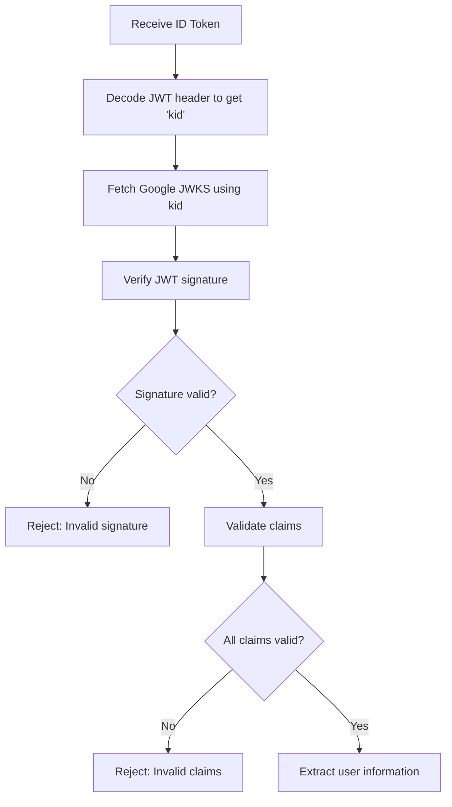

#### Token Verification Checklist:

```javascript
async function verifyGoogleIdToken(idToken, expectedNonce) {
    // 1. Decode token without verification to get header
    const header = JSON.parse(base64Decode(idToken.split('.')[0]));
    const payload = JSON.parse(base64Decode(idToken.split('.')[1]));
    
    // 2. Get Google's public keys
    const jwks = await getGoogleJWKS(header.kid);
    
    // 3. Verify signature
    const isValidSignature = await verifyJWTSignature(idToken, jwks);
    if (!isValidSignature) {
        throw new Error('Invalid token signature');
    }
    
    // 4. Validate claims
    const now = Math.floor(Date.now() / 1000);
    
    // Check issuer
    if (!['https://accounts.google.com', 'accounts.google.com'].includes(payload.iss)) {
        throw new Error('Invalid issuer');
    }
    
    // Check audience (your client ID)
    if (payload.aud !== process.env.GOOGLE_CLIENT_ID) {
        throw new Error('Invalid audience');
    }
    
    // Check expiration (allow 5 minute skew)
    if (payload.exp < (now - 300)) {
        throw new Error('Token expired');
    }
    
    // Check issued at time
    if (payload.iat > (now + 300)) {
        throw new Error('Token issued in future');
    }
    
    // Check nonce if provided
    if (expectedNonce && payload.nonce !== expectedNonce) {
        throw new Error('Invalid nonce');
    }
    
    // Prefer verified emails
    if (payload.email && !payload.email_verified) {
        console.warn('Email not verified by Google');
    }
    
    return payload;
}
```

---

## User Management

### Database User Lookup/Creation

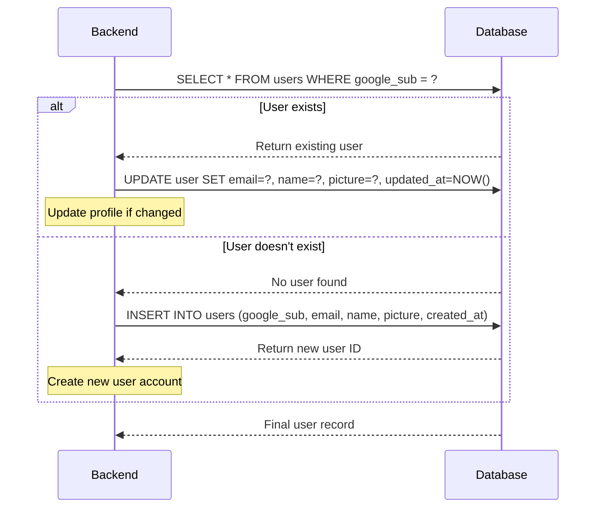

### User Management Implementation:

```javascript
async function findOrCreateUser(googlePayload) {
    const { sub, email, name, picture, email_verified } = googlePayload;
    
    // Try to find existing user by Google sub (stable identifier)
    let user = await db.query(
        'SELECT * FROM users WHERE google_sub = ?', 
        [sub]
    );
    
    if (user.length > 0) {
        // Update existing user profile
        user = user[0];
        await db.query(`
            UPDATE users 
            SET email = ?, name = ?, picture_url = ?, 
                email_verified = ?, updated_at = NOW()
            WHERE id = ?
        `, [email, name, picture, email_verified, user.id]);
        
        return { ...user, email, name, picture_url: picture };
    } else {
        // Create new user
        const result = await db.query(`
            INSERT INTO users (google_sub, email, name, picture_url, 
                             email_verified, created_at, updated_at)
            VALUES (?, ?, ?, ?, ?, NOW(), NOW())
        `, [sub, email, name, picture, email_verified]);
        
        return {
            id: result.insertId,
            google_sub: sub,
            email,
            name,
            picture_url: picture,
            email_verified,
            created_at: new Date(),
            updated_at: new Date()
        };
    }
}
```

### Key Points:
- **Use `sub` as primary identifier**: Google's `sub` claim is stable and unique
- **Update profile data**: Refresh email, name, picture on each login
- **Handle email verification**: Check `email_verified` claim
- **Audit trail**: Keep `created_at` and `updated_at` timestamps

---

## Session Management

### Two Session Approaches

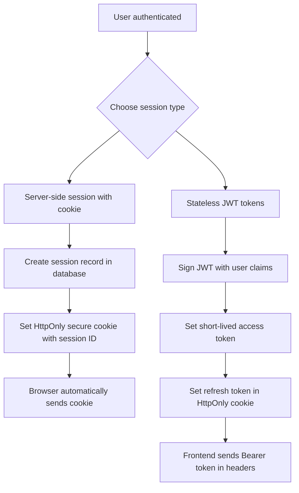

### Option A: Server-Side Sessions (Recommended)

#### Session Creation:
```javascript
async function createSession(userId, userAgent, ipAddress) {
    const sessionId = generateSecureRandomString(32);
    const expiresAt = new Date(Date.now() + (24 * 60 * 60 * 1000)); // 24 hours
    
    await db.query(`
        INSERT INTO sessions (id, user_id, expires_at, user_agent, ip_hash, created_at)
        VALUES (?, ?, ?, ?, ?, NOW())
    `, [sessionId, userId, expiresAt, userAgent, hashIP(ipAddress)]);
    
    return sessionId;
}

// Set secure cookie
function setSessionCookie(res, sessionId) {
    res.cookie('session_id', sessionId, {
        httpOnly: true,      // Not accessible via JavaScript
        secure: true,        // HTTPS only
        sameSite: 'strict',  // CSRF protection
        maxAge: 24 * 60 * 60 * 1000, // 24 hours
        path: '/'
    });
}
```

#### Session Validation:
```javascript
async function validateSession(sessionId) {
    const session = await db.query(`
        SELECT s.*, u.* FROM sessions s
        JOIN users u ON s.user_id = u.id
        WHERE s.id = ? AND s.expires_at > NOW() AND s.revoked = false
    `, [sessionId]);
    
    if (session.length === 0) {
        return null;
    }
    
    // Optional: Update last_accessed timestamp
    await db.query(
        'UPDATE sessions SET last_accessed = NOW() WHERE id = ?',
        [sessionId]
    );
    
    return session[0];
}
```

### Option B: JWT Tokens (Stateless)

#### JWT Creation:
```javascript
function createJWTTokens(user) {
    const accessTokenPayload = {
        sub: user.id,
        email: user.email,
        name: user.name,
        iat: Math.floor(Date.now() / 1000),
        exp: Math.floor(Date.now() / 1000) + (15 * 60), // 15 minutes
        iss: 'yourapp.com',
        aud: 'yourapp.com'
    };
    
    const refreshTokenPayload = {
        sub: user.id,
        type: 'refresh',
        iat: Math.floor(Date.now() / 1000),
        exp: Math.floor(Date.now() / 1000) + (7 * 24 * 60 * 60), // 7 days
        jti: generateSecureRandomString(16) // Unique token ID
    };
    
    const accessToken = jwt.sign(accessTokenPayload, process.env.JWT_SECRET);
    const refreshToken = jwt.sign(refreshTokenPayload, process.env.JWT_SECRET);
    
    // Store refresh token hash for revocation capability
    storeRefreshTokenHash(refreshTokenPayload.jti, hashToken(refreshToken));
    
    return { accessToken, refreshToken };
}
```

---

## Security Best Practices

### Frontend Security

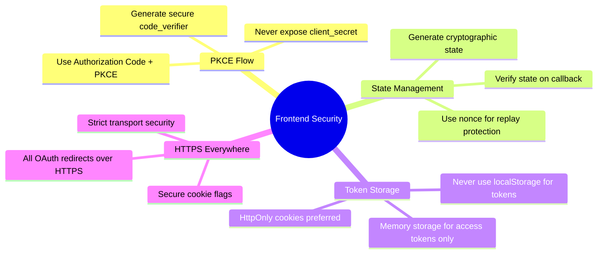

### Backend Security

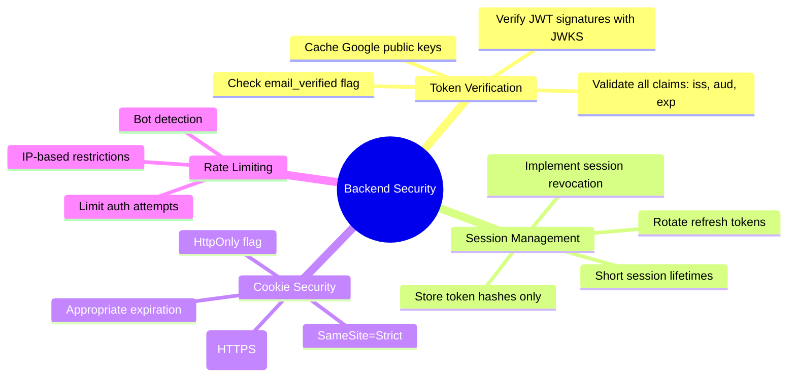

### Security Checklist:

#### ✅ Do:
- Use Authorization Code + PKCE flow for SPAs
- Verify Google ID tokens locally with JWKS
- Set HttpOnly, Secure, SameSite cookies
- Use short session lifetimes with refresh rotation
- Validate iss, aud, exp, and nonce claims
- Use `sub` as the primary identity key
- Implement structured error codes
- Log security events (without secrets)

#### ❌ Don't:
- Store tokens in localStorage/sessionStorage
- Skip state/nonce validation
- Trust email without `email_verified`
- Ignore key rotation or clock skew
- Return raw tokens in logs or errors
- Use long-lived access tokens
- Expose client secrets in frontend

---

## Error Handling

### Error Flow Diagram

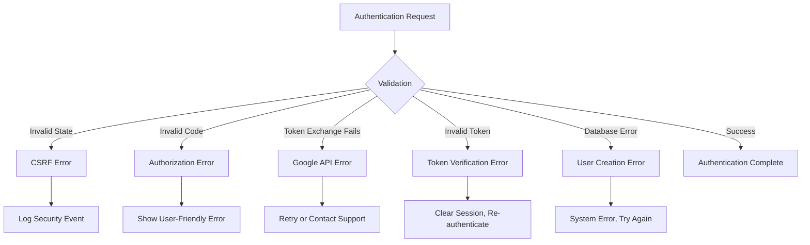

### Error Types and Handling:

```javascript
class AuthError extends Error {
    constructor(code, message, userMessage) {
        super(message);
        this.code = code;
        this.userMessage = userMessage;
    }
}

// Error handling middleware
function handleAuthError(error, req, res, next) {
    const errorResponses = {
        'INVALID_STATE': {
            status: 400,
            code: 'INVALID_STATE',
            message: 'Invalid state parameter - possible CSRF attack',
            userMessage: 'Security error. Please try signing in again.'
        },
        'TOKEN_EXCHANGE_FAILED': {
            status: 400,
            code: 'TOKEN_EXCHANGE_FAILED',
            message: 'Failed to exchange authorization code',
            userMessage: 'Authentication failed. Please try again.'
        },
        'INVALID_TOKEN': {
            status: 401,
            code: 'INVALID_TOKEN',
            message: 'Invalid or expired token',
            userMessage: 'Your session has expired. Please sign in again.'
        },
        'EMAIL_NOT_VERIFIED': {
            status: 403,
            code: 'EMAIL_NOT_VERIFIED',
            message: 'Email not verified by Google',
            userMessage: 'Please verify your email with Google first.'
        }
    };
    
    const errorResponse = errorResponses[error.code] || {
        status: 500,
        code: 'INTERNAL_ERROR',
        message: 'Internal server error',
        userMessage: 'Something went wrong. Please try again later.'
    };
    
    // Log error (without sensitive data)
    console.error('Auth Error:', {
        code: error.code,
        message: error.message,
        userId: req.user?.id,
        ip: req.ip,
        userAgent: req.get('User-Agent')
    });
    
    res.status(errorResponse.status).json({
        error: errorResponse.code,
        message: errorResponse.userMessage
    });
}
```

---

## Implementation Examples

### Complete Backend Route Example:

```javascript
// POST /auth/google/callback
app.post('/auth/google/callback', async (req, res) => {
    try {
        const { code, state, code_verifier, redirect_uri } = req.body;
        
        // 1. Validate state (implement your state storage/validation)
        if (!validateState(state)) {
            throw new AuthError('INVALID_STATE', 'Invalid state parameter');
        }
        
        // 2. Exchange code for tokens
        const tokens = await exchangeCodeForTokens(code, code_verifier, redirect_uri);
        
        // 3. Verify ID token
        const googleUser = await verifyGoogleIdToken(tokens.id_token);
        
        // 4. Find or create user
        const user = await findOrCreateUser(googleUser);
        
        // 5. Create session
        const sessionId = await createSession(
            user.id, 
            req.get('User-Agent'), 
            req.ip
        );
        
        // 6. Set session cookie
        setSessionCookie(res, sessionId);
        
        // 7. Return success response
        res.json({
            success: true,
            user: {
                id: user.id,
                email: user.email,
                name: user.name,
                picture: user.picture_url
            }
        });
        
    } catch (error) {
        handleAuthError(error, req, res);
    }
});

// Authentication middleware
async function requireAuth(req, res, next) {
    try {
        const sessionId = req.cookies.session_id;
        
        if (!sessionId) {
            return res.status(401).json({ error: 'No session found' });
        }
        
        const session = await validateSession(sessionId);
        
        if (!session) {
            return res.status(401).json({ error: 'Invalid session' });
        }
        
        req.user = session;
        next();
        
    } catch (error) {
        res.status(500).json({ error: 'Authentication error' });
    }
}

// Protected route example
app.get('/api/profile', requireAuth, (req, res) => {
    res.json({
        user: {
            id: req.user.id,
            email: req.user.email,
            name: req.user.name,
            picture: req.user.picture_url
        }
    });
});
```

---

## Database Schema

### Recommended Database Structure:

```sql
-- Users table
CREATE TABLE users (
    id UUID PRIMARY KEY DEFAULT gen_random_uuid(),
    google_sub VARCHAR(255) UNIQUE NOT NULL,
    email VARCHAR(255),
    email_verified BOOLEAN DEFAULT false,
    name VARCHAR(255),
    picture_url TEXT,
    created_at TIMESTAMPTZ DEFAULT NOW(),
    updated_at TIMESTAMPTZ DEFAULT NOW()
);

-- Sessions table (for server-side sessions)
CREATE TABLE sessions (
    id VARCHAR(64) PRIMARY KEY,
    user_id UUID NOT NULL REFERENCES users(id) ON DELETE CASCADE,
    expires_at TIMESTAMPTZ NOT NULL,
    created_at TIMESTAMPTZ DEFAULT NOW(),
    last_accessed TIMESTAMPTZ DEFAULT NOW(),
    user_agent TEXT,
    ip_hash VARCHAR(64),
    revoked BOOLEAN DEFAULT false
);

-- Refresh tokens table (for JWT approach)
CREATE TABLE refresh_tokens (
    id UUID PRIMARY KEY DEFAULT gen_random_uuid(),
    user_id UUID NOT NULL REFERENCES users(id) ON DELETE CASCADE,
    token_hash VARCHAR(64) UNIQUE NOT NULL,
    expires_at TIMESTAMPTZ NOT NULL,
    created_at TIMESTAMPTZ DEFAULT NOW(),
    revoked BOOLEAN DEFAULT false
);

-- Indexes for performance
CREATE INDEX idx_users_google_sub ON users(google_sub);
CREATE INDEX idx_sessions_user_id ON sessions(user_id);
CREATE INDEX idx_sessions_expires_at ON sessions(expires_at);
CREATE INDEX idx_refresh_tokens_user_id ON refresh_tokens(user_id);
CREATE INDEX idx_refresh_tokens_hash ON refresh_tokens(token_hash);
```

### Entity Relationship Diagram:

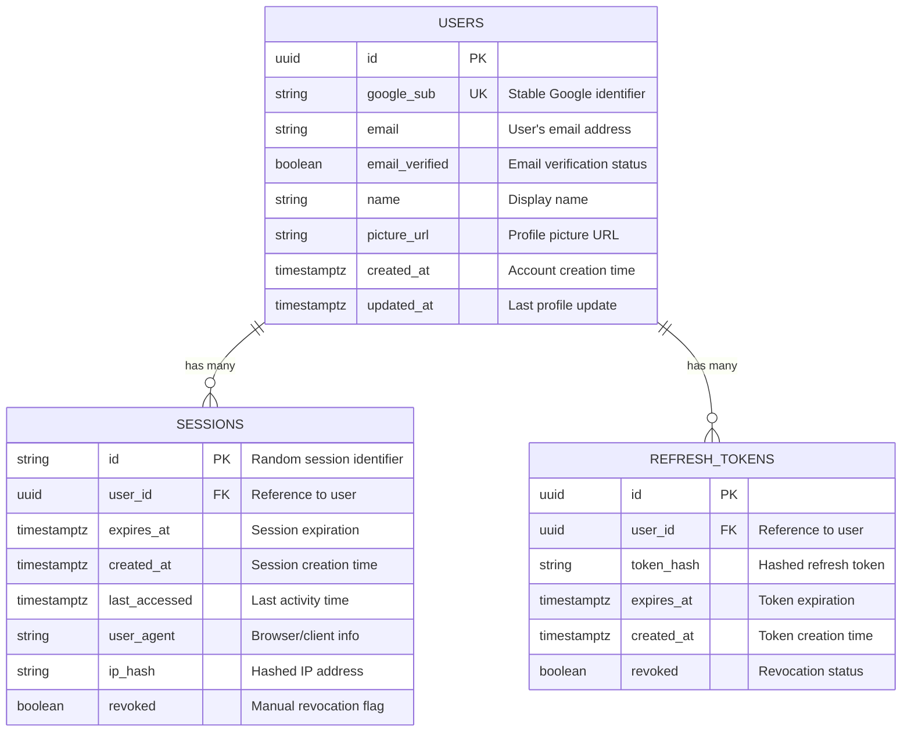

---

## Quick Reference

### Essential URLs:
- **Google Authorization**: `https://accounts.google.com/o/oauth2/v2/auth`
- **Token Exchange**: `https://oauth2.googleapis.com/token`
- **Google JWKS**: `https://www.googleapis.com/oauth2/v3/certs`
- **User Info**: `https://www.googleapis.com/oauth2/v2/userinfo`

### Required Scopes:
- `openid`: Required for ID token
- `email`: Access to email address
- `profile`: Access to basic profile info

### Key Security Parameters:
- **state**: CSRF protection (required)
- **nonce**: Replay protection (recommended)
- **code_challenge**: PKCE protection (required for SPAs)
- **redirect_uri**: Must match registered URI exactly

### Session Lifetimes:
- **Access Token**: 15-60 minutes
- **Refresh Token**: 7-30 days
- **Server Session**: 1-24 hours
- **ID Token**: Verify immediately, don't store

### Cookie Settings:
```javascript
{
    httpOnly: true,        // Prevent XSS
    secure: true,          // HTTPS only
    sameSite: 'strict',    // CSRF protection
    maxAge: 24 * 60 * 60 * 1000  // 24 hours
}
```

---

## Troubleshooting Common Issues

### 1. "Invalid State Parameter"
- **Cause**: State mismatch between request and callback
- **Solution**: Ensure state is properly stored and retrieved
- **Prevention**: Use secure random generation and proper storage

### 2. "Token Signature Verification Failed"
- **Cause**: Using wrong public key or expired JWKS cache
- **Solution**: Refresh Google JWKS cache, verify kid parameter
- **Prevention**: Implement proper JWKS caching with TTL

### 3. "Invalid Audience"
- **Cause**: Token aud claim doesn't match your client_id
- **Solution**: Verify GOOGLE_CLIENT_ID environment variable
- **Prevention**: Double-check OAuth app configuration

### 4. "Email Not Verified"
- **Cause**: User's Google email is not verified
- **Solution**: Handle unverified emails gracefully or require verification
- **Prevention**: Check email_verified claim before trusting email

### 5. "CORS Errors"
- **Cause**: Incorrect CORS configuration for OAuth endpoints
- **Solution**: Configure CORS to allow your frontend domain
- **Prevention**: Set up proper CORS policies for auth routes

---

This guide provides a comprehensive, reusable reference for implementing Google OAuth2 authentication. Bookmark this document and refer back to it whenever you need to implement or troubleshoot Google authentication in your applications.
