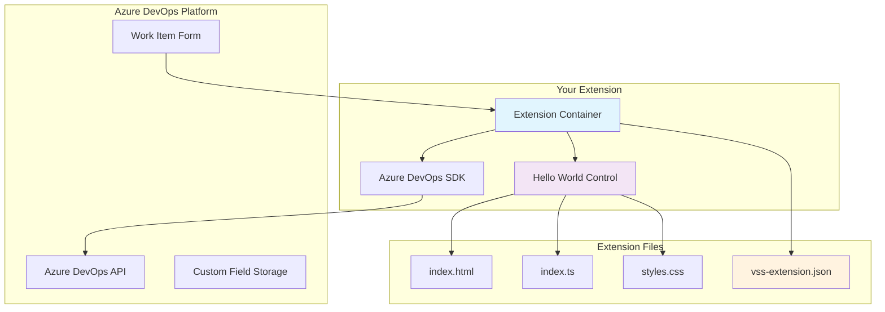
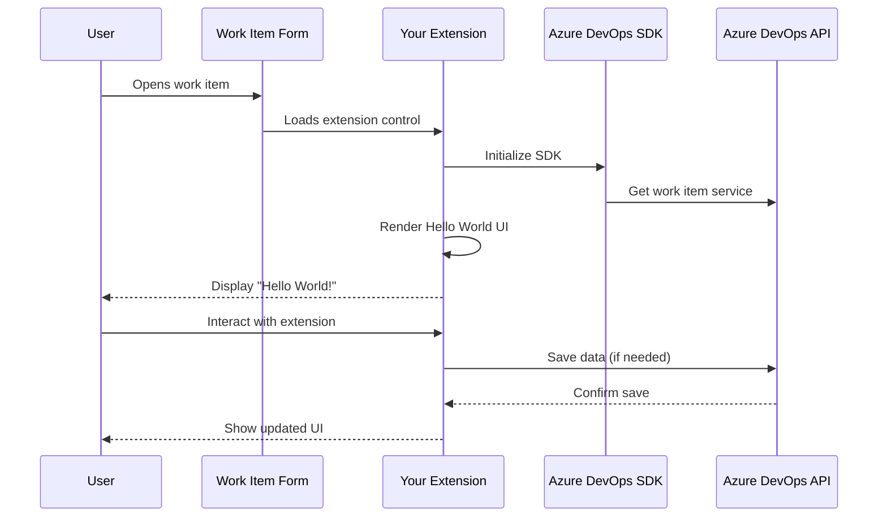
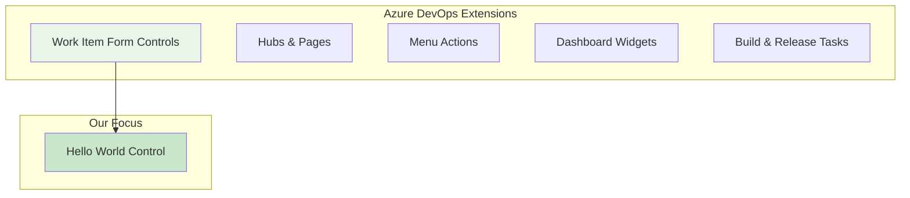
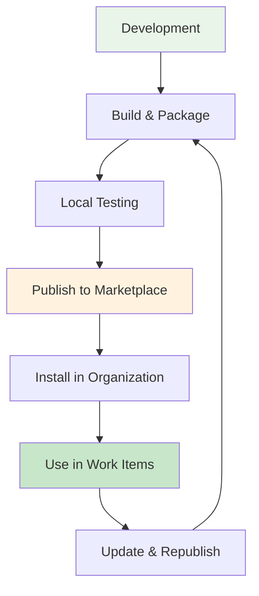
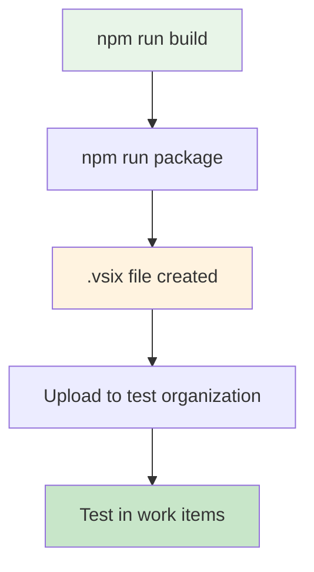
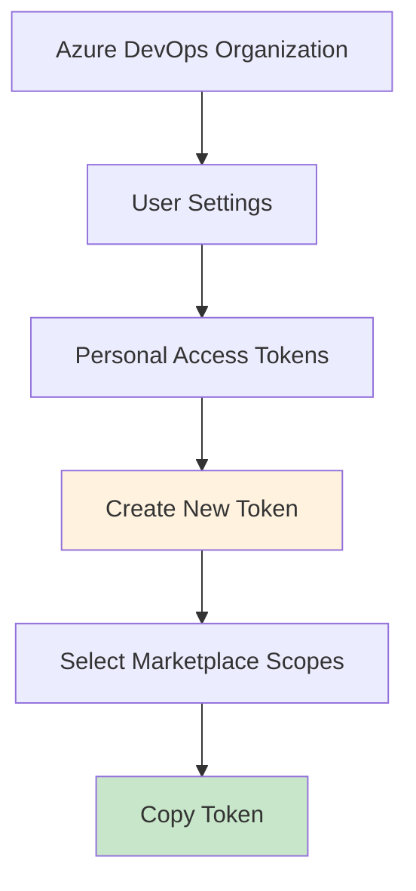
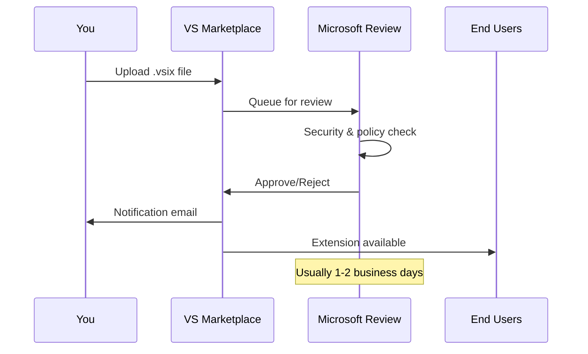
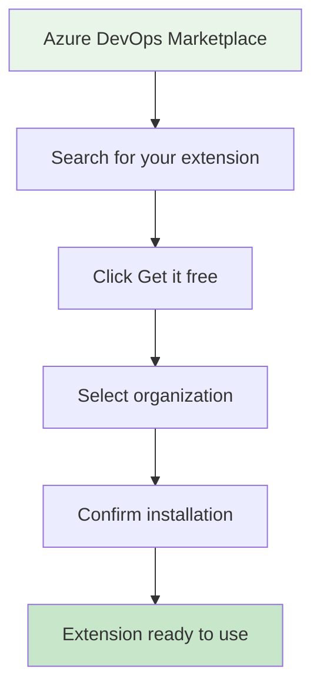
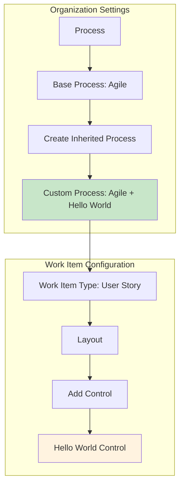

# 🌟 Complete Hello World Guide: Azure DevOps Extension Development

## 📚 Table of Contents

1. [Introduction & Overview](#introduction--overview)
2. [Prerequisites & Environment Setup](#prerequisites--environment-setup)
3. [Understanding Azure DevOps Extensions](#understanding-azure-devops-extensions)
4. [Project Structure & Architecture](#project-structure--architecture)
5. [Step-by-Step Hello World Creation](#step-by-step-hello-world-creation)
6. [Building & Testing Locally](#building--testing-locally)
7. [Publishing to Marketplace](#publishing-to-marketplace)
8. [Installing & Using Your Extension](#installing--using-your-extension)
9. [Troubleshooting & Common Issues](#troubleshooting--common-issues)
10. [Next Steps & Advanced Features](#next-steps--advanced-features)

---

## 🎯 Introduction & Overview

### What You'll Build

By the end of this guide, you'll have created and published a **Hello World Azure DevOps Extension** that:

- ✅ Displays a simple "Hello World" message in work item forms
- ✅ Integrates seamlessly with Azure DevOps
- ✅ Is published to the Azure DevOps Marketplace
- ✅ Can be installed and used by any organization

### Extension Architecture Overview



### How Extensions Work



---

## 🛠️ Prerequisites & Environment Setup

### Required Software

#### 1. Node.js (v16 or higher)
```bash
# Check if Node.js is installed
node --version  # Should be v16+
npm --version   # Should be 8+
```

**Download:** [https://nodejs.org/](https://nodejs.org/)

#### 2. Visual Studio Code (Recommended)
**Download:** [https://code.visualstudio.com/](https://code.visualstudio.com/)

#### 3. Git
```bash
# Check if Git is installed
git --version
```

**Download:** [https://git-scm.com/](https://git-scm.com/)

#### 4. Azure DevOps Account
- **Organization:** You need an Azure DevOps organization
- **Project:** At least one project in your organization
- **Permissions:** Organization administrator or project collection administrator

### Development Tools Setup

#### Install TypeScript Globally
```bash
npm install -g typescript
```

#### Install TFS Cross Platform Command Line Interface
```bash
npm install -g tfx-cli
```

#### Verify Installation
```bash
# Check TypeScript
tsc --version  # Should be 5.0+

# Check TFX CLI
tfx --version  # Should be latest
```

---

## 🏗️ Understanding Azure DevOps Extensions

### Extension Types



### Extension Lifecycle



---

## 📁 Project Structure & Architecture

### Complete Project Structure

```
hello-world-extension/
├── src/                          # Source code
│   ├── index.html               # Main HTML template
│   ├── index.ts                 # TypeScript entry point
│   └── styles.css               # Styling
├── images/                       # Extension icons
│   └── extension-icon.png       # 128x128 icon
├── dist/                        # Built files (generated)
│   ├── index.html
│   ├── index.js
│   └── styles bundled
├── node_modules/                # Dependencies (generated)
├── package.json                 # Project configuration
├── tsconfig.json               # TypeScript configuration
├── webpack.config.js           # Build configuration
├── vss-extension.json          # Extension manifest
├── overview.md                 # Marketplace documentation
└── README.md                   # Development documentation
```

### Key Files Explained

| File | Purpose | Required |
|------|---------|----------|
| `vss-extension.json` | Extension manifest - defines what your extension does | ✅ Yes |
| `package.json` | Node.js project configuration and dependencies | ✅ Yes |
| `src/index.ts` | Main TypeScript code - your extension logic | ✅ Yes |
| `src/index.html` | HTML template for your extension UI | ✅ Yes |
| `src/styles.css` | CSS styling for your extension | ✅ Yes |
| `webpack.config.js` | Build system configuration | ✅ Yes |
| `tsconfig.json` | TypeScript compiler configuration | ✅ Yes |
| `overview.md` | Marketplace documentation - shown in extension details | ✅ Yes |

---

## 🚀 Step-by-Step Hello World Creation

### Step 1: Create Project Directory

```bash
# Create and navigate to project directory
mkdir hello-world-extension
cd hello-world-extension
```

### Step 2: Initialize Node.js Project

```bash
# Initialize package.json
npm init -y
```

### Step 3: Install Dependencies

```bash
# Install Azure DevOps SDK and API
npm install azure-devops-extension-sdk azure-devops-extension-api

# Install development dependencies
npm install --save-dev typescript webpack webpack-cli ts-loader html-webpack-plugin style-loader css-loader
```

### Step 4: Create Package.json Configuration

Create or update `package.json`:

```json
{
  "name": "hello-world-extension",
  "version": "1.0.0",
  "description": "A simple Hello World extension for Azure DevOps",
  "main": "index.js",
  "scripts": {
    "build": "webpack --mode production",
    "dev": "webpack --mode development --watch",
    "package": "npm run build && npx tfx-cli extension create --manifest-globs vss-extension.json --rev-version",
    "publish": "npm run build && npx tfx-cli extension publish --manifest-globs vss-extension.json --rev-version"
  },
  "author": "Your Name",
  "license": "MIT",
  "dependencies": {
    "azure-devops-extension-api": "^4.259.0",
    "azure-devops-extension-sdk": "^4.0.2"
  },
  "devDependencies": {
    "@types/node": "^20.0.0",
    "css-loader": "^7.1.2",
    "html-webpack-plugin": "^5.6.4",
    "style-loader": "^4.0.0",
    "ts-loader": "^9.5.4",
    "typescript": "^5.9.2",
    "webpack": "^5.101.3",
    "webpack-cli": "^6.0.1"
  }
}
```

### Step 5: Create TypeScript Configuration

Create `tsconfig.json`:

```json
{
  "compilerOptions": {
    "target": "ES2019",
    "module": "ESNext",
    "moduleResolution": "Node",
    "lib": ["ES2020", "DOM"],
    "strict": true,
    "noEmitOnError": true,
    "esModuleInterop": true,
    "skipLibCheck": true,
    "sourceMap": true,
    "typeRoots": ["./node_modules/@types"]
  },
  "include": ["src/**/*"]
}
```

### Step 6: Create Webpack Configuration

Create `webpack.config.js`:

```javascript
const path = require("path");
const HtmlWebpackPlugin = require("html-webpack-plugin");

module.exports = {
  entry: { index: "./src/index.ts" },
  output: { 
    path: path.resolve(__dirname, "dist"), 
    filename: "[name].js", 
    clean: true 
  },
  mode: "production",
  devtool: "inline-source-map",
  resolve: { 
    extensions: [".ts", ".js"] 
  },
  module: {
    rules: [
      { 
        test: /\.ts$/, 
        use: "ts-loader", 
        exclude: /node_modules/ 
      },
      { 
        test: /\.css$/, 
        use: ["style-loader", "css-loader"] 
      }
    ]
  },
  plugins: [
    new HtmlWebpackPlugin({ 
      template: "src/index.html", 
      chunks: ["index"] 
    })
  ]
};
```

### Step 7: Create Extension Manifest

Create `vss-extension.json`:

```json
{
  "manifestVersion": 1,
  
  "id": "hello-world-extension-shakz",
  "publisher": "your-publisher-name",
  "version": "1.0.0",
  
  "name": "Hello World Extension",
  "description": "A simple Hello World extension for Azure DevOps work items",
  "public": false,
  "categories": ["Azure Boards"],
  
  "targets": [{ "id": "Microsoft.VisualStudio.Services" }],
  "icons": { "default": "images/extension-icon.png" },
  "scopes": ["vso.work"],
  "content": { "details": { "path": "overview.md" } },
  
  "contributions": [
    {
      "id": "hello-world-control",
      "type": "ms.vss-work-web.work-item-form-control",
      "targets": ["ms.vss-work-web.work-item-form"],
      "description": "Displays a Hello World message in work item forms",
      "properties": {
        "name": "Hello World Control",
        "uri": "dist/index.html",
        "height": 200,
        "inputs": [
          {
            "id": "Message",
            "name": "Custom Message",
            "description": "Enter a custom message to display",
            "type": "string",
            "defaultValue": "Hello World!",
            "validation": { 
              "dataType": "String", 
              "isRequired": false 
            }
          }
        ]
      }
    }
  ],
  
  "files": [
    { "path": "dist", "addressable": true },
    { "path": "images", "addressable": true },
    { "path": "overview.md", "addressable": true }
  ]
}
```

**Important Notes:**
- **Extension ID:** `hello-world-extension-shakz` - This must be unique across the entire Azure DevOps Marketplace. Choose a unique identifier that includes your name or organization.
- **Overview File:** The `content` section and `overview.md` file in the `files` array are required for marketplace listings.

### Step 8: Create Source Directory

```bash
mkdir src
mkdir images
```

### Step 9: Create HTML Template

Create `src/index.html`:

```html
<!DOCTYPE html>
<html lang="en">
<head>
    <meta charset="utf-8" />
    <title>Hello World Extension</title>
    <meta name="viewport" content="width=device-width, initial-scale=1" />
</head>
<body>
    <div id="app" class="hello-world-container">
        <div class="hello-world-header">
            <h2 class="hello-world-title">🌟 Hello World Extension</h2>
        </div>
        
        <div class="hello-world-content">
            <div class="message-display">
                <p id="helloMessage" class="hello-message">Loading...</p>
            </div>
            
            <div class="info-section">
                <div class="info-item">
                    <span class="info-label">Extension Version:</span>
                    <span id="extensionVersion" class="info-value">1.0.0</span>
                </div>
                
                <div class="info-item">
                    <span class="info-label">Work Item ID:</span>
                    <span id="workItemId" class="info-value">Loading...</span>
                </div>
                
                <div class="info-item">
                    <span class="info-label">Current User:</span>
                    <span id="currentUser" class="info-value">Loading...</span>
                </div>
            </div>
            
            <div class="actions-section">
                <button id="refreshBtn" class="hello-btn hello-btn-primary">
                    🔄 Refresh
                </button>
                <button id="alertBtn" class="hello-btn hello-btn-secondary">
                    🎉 Show Alert
                </button>
            </div>
        </div>
        
        <div class="hello-world-footer">
            <p class="footer-text">
                💡 <strong>Tip:</strong> This is your first Azure DevOps extension! 
                You can customize the message in the control configuration.
            </p>
        </div>
    </div>
</body>
</html>
```

### Step 10: Create TypeScript Logic

Create `src/index.ts`:

```typescript
import * as SDK from "azure-devops-extension-sdk";
import {
  IWorkItemFormService,
  WorkItemTrackingServiceIds,
} from "azure-devops-extension-api/WorkItemTracking";
import "./styles.css";

// Extension version
const VERSION = "1.0.0";

// Global variables
let workItemService: IWorkItemFormService;
let customMessage: string = "Hello World!";

/**
 * Get the custom message from extension configuration
 */
function getCustomMessage(): string {
  const config = SDK.getConfiguration() as any;
  const message = config?.witInputs?.Message?.trim?.();
  return message || "Hello World!";
}

/**
 * Update the display with current information
 */
async function updateDisplay(): Promise<void> {
  try {
    // Update version
    const versionElement = document.getElementById("extensionVersion");
    if (versionElement) {
      versionElement.textContent = VERSION;
    }

    // Update custom message
    const messageElement = document.getElementById("helloMessage");
    if (messageElement) {
      messageElement.textContent = customMessage;
    }

    // Get work item information
    if (workItemService) {
      const workItemId = await workItemService.getId();
      const workItemIdElement = document.getElementById("workItemId");
      if (workItemIdElement) {
        workItemIdElement.textContent = workItemId?.toString() || "Unknown";
      }
    }

    // Get current user (from SDK context)
    const user = SDK.getUser();
    const userElement = document.getElementById("currentUser");
    if (userElement) {
      userElement.textContent = user.displayName || user.name || "Unknown User";
    }

  } catch (error) {
    console.error("Error updating display:", error);
  }
}

/**
 * Show a simple alert
 */
function showAlert(): void {
  alert(`🎉 ${customMessage}\n\nThis alert was triggered from your Azure DevOps extension!`);
}

/**
 * Wire up button event handlers
 */
function setupEventHandlers(): void {
  const refreshBtn = document.getElementById("refreshBtn");
  const alertBtn = document.getElementById("alertBtn");

  if (refreshBtn) {
    refreshBtn.addEventListener("click", () => {
      console.log("Refresh button clicked");
      updateDisplay();
    });
  }

  if (alertBtn) {
    alertBtn.addEventListener("click", () => {
      console.log("Alert button clicked");
      showAlert();
    });
  }
}

/**
 * Extension provider - defines the lifecycle of the extension
 */
const provider = () => ({
  /**
   * Called when the extension is loaded
   */
  onLoaded: async () => {
    try {
      console.log("Hello World Extension loading...");

      // Get custom message from configuration
      customMessage = getCustomMessage();
      console.log("Custom message:", customMessage);

      // Get work item service
      workItemService = await SDK.getService<IWorkItemFormService>(
        WorkItemTrackingServiceIds.WorkItemFormService
      );

      // Setup event handlers
      setupEventHandlers();

      // Update the display
      await updateDisplay();

      console.log("Hello World Extension loaded successfully!");

    } catch (error) {
      console.error("Error loading Hello World Extension:", error);
      
      // Show error in UI
      const messageElement = document.getElementById("helloMessage");
      if (messageElement) {
        messageElement.textContent = "❌ Error loading extension";
        messageElement.style.color = "#c50f1f";
      }
    }
  },

  /**
   * Called when work item fields change
   */
  onFieldChanged: async (args: any) => {
    console.log("Field changed:", args);
    // You can react to field changes here if needed
  },

  /**
   * Called when work item is saved
   */
  onSaved: async () => {
    console.log("Work item saved");
    // You can react to save events here if needed
  },

  /**
   * Called when extension is unloaded
   */
  onUnloaded: () => {
    console.log("Hello World Extension unloaded");
  },
});

// Initialize the extension
console.log("Initializing Hello World Extension...");

SDK.init();
SDK.ready().then(() => {
  console.log("SDK ready, registering extension...");
  SDK.register(SDK.getContributionId(), provider);
});
```

### Step 11: Create Styles

Create `src/styles.css`:

```css
/* Azure DevOps Theme Variables */
:root {
  --az-font: system-ui, -apple-system, Segoe UI, Roboto, Arial, sans-serif;
  --az-font-size: 13px;
  --az-radius: 4px;

  /* Light theme colors */
  --az-bg: #ffffff;
  --az-surface: #ffffff;
  --az-text: #242424;
  --az-muted: #616161;
  --az-border: #e1e1e1;
  --az-hover: #f3f2f1;
  --az-primary: #0078d4;
  --az-primary-hover: #106ebe;
  --az-secondary: #6c757d;
  --az-secondary-hover: #5a6268;
  --az-success: #28a745;
  --az-danger: #c50f1f;
}

/* Dark theme support */
@media (prefers-color-scheme: dark) {
  :root {
    --az-bg: #1f1f1f;
    --az-surface: #2b2b2b;
    --az-text: #f3f3f3;
    --az-muted: #b5b5b5;
    --az-border: #3a3a3a;
    --az-hover: #313131;
    --az-primary: #3aa0ff;
    --az-primary-hover: #2895ff;
    --az-secondary: #6c757d;
    --az-secondary-hover: #7a8288;
  }
}

/* Base styles */
html, body {
  background: transparent;
  margin: 0;
  padding: 0;
}

.hello-world-container {
  font-family: var(--az-font);
  font-size: var(--az-font-size);
  color: var(--az-text);
  background: var(--az-surface);
  border: 1px solid var(--az-border);
  border-radius: var(--az-radius);
  padding: 16px;
  max-width: 100%;
  box-sizing: border-box;
}

/* Header */
.hello-world-header {
  margin-bottom: 16px;
  padding-bottom: 12px;
  border-bottom: 1px solid var(--az-border);
}

.hello-world-title {
  margin: 0;
  font-size: 18px;
  font-weight: 600;
  color: var(--az-primary);
}

/* Content */
.hello-world-content {
  margin-bottom: 16px;
}

.message-display {
  background: var(--az-hover);
  border: 1px solid var(--az-border);
  border-radius: var(--az-radius);
  padding: 16px;
  margin-bottom: 16px;
  text-align: center;
}

.hello-message {
  margin: 0;
  font-size: 16px;
  font-weight: 500;
  color: var(--az-primary);
}

/* Info section */
.info-section {
  margin-bottom: 16px;
}

.info-item {
  display: flex;
  justify-content: space-between;
  align-items: center;
  padding: 8px 0;
  border-bottom: 1px solid var(--az-border);
}

.info-item:last-child {
  border-bottom: none;
}

.info-label {
  font-weight: 500;
  color: var(--az-text);
}

.info-value {
  color: var(--az-muted);
  font-family: ui-monospace, SFMono-Regular, Menlo, Consolas, "Liberation Mono", monospace;
}

/* Actions section */
.actions-section {
  display: flex;
  gap: 8px;
  justify-content: center;
  flex-wrap: wrap;
}

/* Buttons */
.hello-btn {
  display: inline-flex;
  align-items: center;
  gap: 6px;
  height: 32px;
  padding: 0 16px;
  border: 1px solid var(--az-border);
  border-radius: var(--az-radius);
  background: var(--az-bg);
  color: var(--az-text);
  font-size: 13px;
  font-family: var(--az-font);
  cursor: pointer;
  transition: all 0.2s ease;
  text-decoration: none;
}

.hello-btn:hover {
  background: var(--az-hover);
  transform: translateY(-1px);
}

.hello-btn:focus {
  outline: 2px solid var(--az-primary);
  outline-offset: 1px;
}

.hello-btn:active {
  transform: translateY(0);
}

.hello-btn-primary {
  background: var(--az-primary);
  border-color: var(--az-primary);
  color: #fff;
}

.hello-btn-primary:hover {
  background: var(--az-primary-hover);
  border-color: var(--az-primary-hover);
}

.hello-btn-secondary {
  background: var(--az-secondary);
  border-color: var(--az-secondary);
  color: #fff;
}

.hello-btn-secondary:hover {
  background: var(--az-secondary-hover);
  border-color: var(--az-secondary-hover);
}

/* Footer */
.hello-world-footer {
  padding-top: 12px;
  border-top: 1px solid var(--az-border);
}

.footer-text {
  margin: 0;
  color: var(--az-muted);
  font-size: 12px;
  text-align: center;
}

/* Responsive design */
@media (max-width: 480px) {
  .hello-world-container {
    padding: 12px;
  }
  
  .actions-section {
    flex-direction: column;
  }
  
  .hello-btn {
    width: 100%;
    justify-content: center;
  }
  
  .info-item {
    flex-direction: column;
    align-items: flex-start;
    gap: 4px;
  }
}

/* Animation for loading states */
@keyframes pulse {
  0% { opacity: 1; }
  50% { opacity: 0.5; }
  100% { opacity: 1; }
}

.loading {
  animation: pulse 1.5s ease-in-out infinite;
}
```

### Step 12: Create Overview Documentation

Create `overview.md` in the root directory:

```markdown
# Hello World Extension

## Overview

The Hello World Extension is a simple demonstration of how to create custom work item form controls for Azure DevOps. This extension displays a customizable "Hello World" message along with work item information and interactive buttons.

## Features

- 🌟 **Customizable Message**: Configure your own "Hello World" message through the control settings
- 📊 **Work Item Information**: Displays the current work item ID and user information
- 🔄 **Interactive Controls**: Refresh button and alert functionality
- 🎨 **Azure DevOps Theming**: Matches the native Azure DevOps look and feel
- 📱 **Responsive Design**: Works on desktop and mobile devices
- 🌙 **Dark Mode Support**: Automatically adapts to light and dark themes

## Getting Started

### Installation

1. Install the extension from the Azure DevOps Marketplace
2. Create an inherited process in your organization
3. Add the "Hello World Control" to your work item types
4. Configure the custom message in the control settings

### Configuration

When adding the control to a work item form, you can configure:

- **Custom Message**: Enter any message you want to display (default: "Hello World!")

## Usage

Once installed and configured:

1. Open any work item in your project
2. The Hello World control will appear in the work item form
3. Click "Refresh" to update the information
4. Click "Show Alert" to display a popup message

## Technical Details

- **Extension Type**: Work Item Form Control
- **Target Platform**: Azure DevOps Services
- **Required Permissions**: Work item read/write access
- **Browser Support**: All modern browsers

## Support

For issues, questions, or feature requests, please contact the extension publisher.

## Version History

- **v1.0.0**: Initial release with basic Hello World functionality
```

### Step 13: Create Extension Icon

Create a 128x128 pixel PNG image and save it as `images/extension-icon.png`. You can use any image editor or create a simple colored square for testing.

**Quick option:** Download a free icon from [https://icons8.com/](https://icons8.com/) or create a simple colored square in any image editor.

---

## 🔨 Building & Testing Locally

### Build the Extension

```bash
# Install dependencies
npm install

# Build the extension
npm run build
```

This will create a `dist/` folder with your compiled extension files.

### Package the Extension

```bash
# Create .vsix package
npm run package
```

This creates a `.vsix` file (like `hello-world-extension-1.0.0.vsix`) that you can install.

### Local Testing Setup



---

## 📦 Publishing to Marketplace

### Step 1: Create Publisher Account

1. Go to [Visual Studio Marketplace](https://marketplace.visualstudio.com/manage)
2. Sign in with your Microsoft account
3. Create a new publisher:
   - **Publisher ID:** `your-publisher-name` (must match `vss-extension.json`)
   - **Display Name:** Your display name
   - **Description:** Brief description of your publisher

**Important:** Your extension ID must be unique across the entire Azure DevOps Marketplace. The example uses `hello-world-extension-shakz` - make sure to choose a unique identifier that includes your name, organization, or a unique suffix.

### Step 2: Get Personal Access Token



1. Go to your Azure DevOps organization
2. Click on your profile → **User settings** → **Personal access tokens**
3. Click **New Token**
4. Configure:
   - **Name:** `Marketplace Publishing`
   - **Expiration:** Choose appropriate duration
   - **Scopes:** Select **Marketplace** → **Manage**
5. **Copy the token** (you won't see it again!)

### Step 3: Configure Publishing

Update your `package.json` scripts section:

```json
{
  "scripts": {
    "build": "webpack --mode production",
    "dev": "webpack --mode development --watch",
    "package": "npm run build && npx tfx-cli extension create --manifest-globs vss-extension.json --rev-version",
    "publish": "npm run build && npx tfx-cli extension publish --manifest-globs vss-extension.json --rev-version --token YOUR_PERSONAL_ACCESS_TOKEN"
  }
}
```

**⚠️ Security Note:** Never commit your personal access token to source control!

### Step 4: Publish Extension

```bash
# Method 1: Using npm script (replace YOUR_TOKEN)
npm run publish

# Method 2: Using tfx-cli directly
npx tfx-cli extension publish --manifest-globs vss-extension.json --token YOUR_TOKEN
```

### Step 5: Marketplace Review Process



**Review Process:**
- **Time:** Usually 1-2 business days
- **Checks:** Security scanning, policy compliance, functionality
- **Result:** Email notification with approval or feedback

---

## 🎯 Installing & Using Your Extension

### Installation Process



### Step 1: Install from Marketplace

1. Go to [Azure DevOps Marketplace](https://marketplace.visualstudio.com/azuredevops)
2. Search for your extension name
3. Click **"Get it free"**
4. Select your organization
5. Click **"Install"**

### Step 2: Create Custom Process



1. **Organization Settings** → **Process**
2. Find your base process (e.g., "Agile")
3. Click **"..."** → **"Create inherited process"**
4. Name it (e.g., "Agile + Hello World")

### Step 3: Add Control to Work Item

1. Open your custom process
2. Select a work item type (e.g., "User Story")
3. Click **"Layout"**
4. Click **"Add control"**
5. Select **"Hello World Control"**
6. Configure:
   - **Label:** "Hello World"
   - **Custom Message:** "Welcome to my extension!"
7. **Save**

### Step 4: Apply Process to Project

1. **Project Settings** → **Project configuration**
2. Change process to your custom process
3. **Save**

### Step 5: Test Your Extension

1. Open any work item in your project
2. You should see your "Hello World" control
3. Test the buttons and functionality

---

## 🔧 Troubleshooting & Common Issues

### Build Issues

#### Problem: TypeScript compilation errors
```bash
# Solution: Check TypeScript configuration
npx tsc --noEmit

# Fix common issues:
# 1. Update tsconfig.json target
# 2. Install missing type definitions
npm install --save-dev @types/node
```

#### Problem: Webpack build fails
```bash
# Solution: Check webpack configuration
npm run build -- --verbose

# Common fixes:
# 1. Verify file paths in webpack.config.js
# 2. Check for missing dependencies
npm install
```

### Extension Loading Issues

#### Problem: Extension doesn't load in work item
**Symptoms:** Blank space where extension should be

**Solutions:**
1. Check browser console for errors (F12)
2. Verify `vss-extension.json` manifest:
   ```json
   {
     "contributions": [{
       "properties": {
         "uri": "dist/index.html"  // Must match build output
       }
     }]
   }
   ```
3. Ensure files are properly built in `dist/` folder

#### Problem: SDK initialization fails
**Symptoms:** Console error "SDK not ready"

**Solution:**
```typescript
// Ensure proper SDK initialization
SDK.init();
SDK.ready().then(() => {
  console.log("SDK is ready");
  SDK.register(SDK.getContributionId(), provider);
});
```

### Publishing Issues

#### Problem: Authentication failed
**Symptoms:** "401 Unauthorized" when publishing

**Solutions:**
1. Verify personal access token has **Marketplace (Manage)** scope
2. Check token hasn't expired
3. Ensure publisher name matches `vss-extension.json`

#### Problem: Extension rejected by marketplace
**Common reasons:**
- Missing or invalid icon
- Inappropriate content
- Security vulnerabilities
- Broken functionality

**Solutions:**
1. Review marketplace policies
2. Test thoroughly before publishing
3. Use appropriate icon (128x128 PNG)
4. Follow security best practices

### Runtime Issues

#### Problem: Work item service not available
**Solution:**
```typescript
try {
  const workItemService = await SDK.getService<IWorkItemFormService>(
    WorkItemTrackingServiceIds.WorkItemFormService
  );
  
  if (!workItemService) {
    throw new Error("Work item service not available");
  }
  
  // Use service...
} catch (error) {
  console.error("Service error:", error);
  // Handle gracefully
}
```

#### Problem: Configuration not loading
**Solution:**
```typescript
function getConfiguration() {
  try {
    const config = SDK.getConfiguration() as any;
    return config?.witInputs || {};
  } catch (error) {
    console.error("Configuration error:", error);
    return {};
  }
}
```

### Debug Mode

Enable detailed logging:

```typescript
const DEBUG = true; // Set to true for development

function log(...args: any[]) {
  if (DEBUG) {
    console.log("[HelloWorld]", ...args);
  }
}

// Use throughout your code
log("Extension loading...");
log("Configuration:", getConfiguration());
```

---

## 🚀 Next Steps & Advanced Features

### Enhance Your Hello World Extension

#### 1. Add Data Persistence
```typescript
// Save data to work item field
async function saveData(data: any) {
  const fieldName = "Custom.HelloWorldData";
  await workItemService.setFieldValue(fieldName, JSON.stringify(data));
}

// Load data from work item field
async function loadData(): Promise<any> {
  const fieldName = "Custom.HelloWorldData";
  const value = await workItemService.getFieldValue(fieldName);
  return value ? JSON.parse(value as string) : {};
}
```

#### 2. Add Form Validation
```typescript
// Validate required fields
async function validateForm(): Promise<boolean> {
  const errors: string[] = [];
  
  // Check required fields
  const title = await workItemService.getFieldValue("System.Title");
  if (!title) {
    errors.push("Title is required");
  }
  
  if (errors.length > 0) {
    alert("Validation errors:\n" + errors.join("\n"));
    return false;
  }
  
  return true;
}
```

#### 3. Add Rich UI Components
```html
<!-- Add to index.html -->
<div class="rich-editor">
  <textarea id="richText" placeholder="Enter rich text..."></textarea>
  <div class="editor-toolbar">
    <button class="format-btn" data-format="bold">B</button>
    <button class="format-btn" data-format="italic">I</button>
    <button class="format-btn" data-format="underline">U</button>
  </div>
</div>
```

### Extension Architecture Patterns

#### 1. Model-View-Controller (MVC)
```typescript
// Model
class HelloWorldModel {
  private data: any = {};
  
  async load() {
    this.data = await loadData();
  }
  
  async save() {
    await saveData(this.data);
  }
}

// View
class HelloWorldView {
  render(data: any) {
    // Update UI
  }
}

// Controller
class HelloWorldController {
  constructor(
    private model: HelloWorldModel,
    private view: HelloWorldView
  ) {}
  
  async initialize() {
    await this.model.load();
    this.view.render(this.model.data);
  }
}
```

#### 2. Event-Driven Architecture
```typescript
class EventEmitter {
  private events: { [key: string]: Function[] } = {};
  
  on(event: string, callback: Function) {
    if (!this.events[event]) {
      this.events[event] = [];
    }
    this.events[event].push(callback);
  }
  
  emit(event: string, ...args: any[]) {
    if (this.events[event]) {
      this.events[event].forEach(callback => callback(...args));
    }
  }
}

// Usage
const eventBus = new EventEmitter();

eventBus.on('dataChanged', (newData) => {
  // Update UI
  updateDisplay(newData);
});

eventBus.emit('dataChanged', { message: "Hello World!" });
```

### Advanced Extension Types

#### 1. Dashboard Widgets
```json
{
  "contributions": [{
    "id": "hello-world-widget",
    "type": "ms.vss-dashboards-web.widget",
    "targets": ["ms.vss-dashboards-web.widget-catalog"],
    "properties": {
      "name": "Hello World Widget",
      "description": "Displays hello world on dashboard",
      "uri": "dist/widget.html",
      "supportedSizes": [
        { "rowSpan": 1, "columnSpan": 2 }
      ]
    }
  }]
}
```

#### 2. Build/Release Tasks
```json
{
  "contributions": [{
    "id": "hello-world-task",
    "type": "ms.vss-distributed-task.task",
    "targets": ["ms.vss-distributed-task.tasks"],
    "properties": {
      "name": "tasks/HelloWorldTask"
    }
  }]
}
```

#### 3. Menu Actions
```json
{
  "contributions": [{
    "id": "hello-world-menu",
    "type": "ms.vss-web.action",
    "targets": ["ms.vss-work-web.work-item-context-menu"],
    "properties": {
      "text": "Say Hello",
      "uri": "dist/action.html"
    }
  }]
}
```

### Performance Optimization

#### 1. Lazy Loading
```typescript
// Load heavy dependencies only when needed
async function loadHeavyLibrary() {
  const { default: HeavyLib } = await import('./heavy-library');
  return new HeavyLib();
}
```

#### 2. Debouncing
```typescript
function debounce(func: Function, wait: number) {
  let timeout: NodeJS.Timeout;
  return function executedFunction(...args: any[]) {
    const later = () => {
      clearTimeout(timeout);
      func(...args);
    };
    clearTimeout(timeout);
    timeout = setTimeout(later, wait);
  };
}

// Usage
const debouncedSave = debounce(saveData, 1000);
```

#### 3. Caching
```typescript
class Cache {
  private cache = new Map<string, any>();
  
  get(key: string) {
    return this.cache.get(key);
  }
  
  set(key: string, value: any, ttl: number = 300000) { // 5 minutes
    this.cache.set(key, value);
    setTimeout(() => this.cache.delete(key), ttl);
  }
}
```

### Testing Strategies

#### 1. Unit Testing
```typescript
// Install Jest
npm install --save-dev jest @types/jest ts-jest

// Create test file: src/__tests__/index.test.ts
import { getCustomMessage } from '../index';

describe('Hello World Extension', () => {
  test('should return default message', () => {
    const message = getCustomMessage();
    expect(message).toBe('Hello World!');
  });
});
```

#### 2. Integration Testing
```typescript
// Mock Azure DevOps SDK
jest.mock('azure-devops-extension-sdk', () => ({
  init: jest.fn(),
  ready: jest.fn().mockResolvedValue(true),
  register: jest.fn(),
  getConfiguration: jest.fn().mockReturnValue({
    witInputs: { Message: 'Test Message' }
  })
}));
```

### Deployment Strategies

#### 1. Continuous Integration
```yaml
# .github/workflows/ci.yml
name: CI/CD Pipeline

on:
  push:
    branches: [ main ]
  pull_request:
    branches: [ main ]

jobs:
  build:
    runs-on: ubuntu-latest
    
    steps:
    - uses: actions/checkout@v2
    
    - name: Setup Node.js
      uses: actions/setup-node@v2
      with:
        node-version: '18'
        
    - name: Install dependencies
      run: npm ci
      
    - name: Build
      run: npm run build
      
    - name: Test
      run: npm test
      
    - name: Package
      run: npm run package
      
    - name: Upload artifact
      uses: actions/upload-artifact@v2
      with:
        name: extension-package
        path: '*.vsix'
```

#### 2. Automated Publishing
```yaml
# Only on releases
- name: Publish to Marketplace
  if: github.event_name == 'release'
  run: |
    npx tfx-cli extension publish \
      --manifest-globs vss-extension.json \
      --token ${{ secrets.MARKETPLACE_TOKEN }}
```

### Security Best Practices

#### 1. Input Validation
```typescript
function sanitizeInput(input: string): string {
  return input
    .replace(/[<>]/g, '') // Remove HTML tags
    .trim()
    .substring(0, 1000); // Limit length
}
```

#### 2. Content Security Policy
```html
<!-- Add to index.html -->
<meta http-equiv="Content-Security-Policy" 
      content="default-src 'self'; script-src 'self' 'unsafe-inline'; style-src 'self' 'unsafe-inline';">
```

#### 3. Secure Data Handling
```typescript
// Never log sensitive data
function logSafely(data: any) {
  const safe = { ...data };
  delete safe.password;
  delete safe.token;
  console.log(safe);
}
```

---

## 🎉 Congratulations!

You've successfully created, built, and published your first Azure DevOps extension! 

### What You've Accomplished

✅ **Created** a complete Azure DevOps extension from scratch  
✅ **Built** and packaged the extension using modern web technologies  
✅ **Published** to the Azure DevOps Marketplace  
✅ **Installed** and configured the extension in a work item form  
✅ **Tested** the extension in a real Azure DevOps environment  

### Your Extension Features

- 🌟 Custom "Hello World" message display
- 📊 Work item information display
- 👤 Current user information
- 🔄 Interactive buttons with functionality
- 🎨 Azure DevOps-themed styling
- 📱 Responsive design
- 🌙 Dark mode support

### Next Steps

1. **Enhance functionality** - Add data persistence, validation, rich UI
2. **Explore other extension types** - Widgets, build tasks, menu actions
3. **Implement testing** - Unit tests, integration tests, E2E tests
4. **Set up CI/CD** - Automated building, testing, and publishing
5. **Join the community** - Share your extension, get feedback, help others

### Resources for Continued Learning

- **Azure DevOps Extension Documentation:** [https://docs.microsoft.com/en-us/azure/devops/extend/](https://docs.microsoft.com/en-us/azure/devops/extend/)
- **Extension Samples:** [https://github.com/Microsoft/azure-devops-extension-sample](https://github.com/Microsoft/azure-devops-extension-sample)
- **Marketplace:** [https://marketplace.visualstudio.com/azuredevops](https://marketplace.visualstudio.com/azuredevops)
- **Community:** [https://developercommunity.visualstudio.com/](https://developercommunity.visualstudio.com/)

**Happy coding! 🚀**


