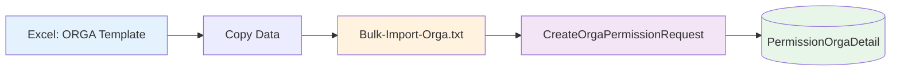
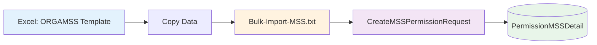

# Bulk Import Scripts - ORGA vs MSS Comparison

## Quick Reference

This document provides a side-by-side comparison of the ORGA and MSS bulk import scripts to help you understand the differences and use the correct one for your needs.

---

## When to Use Which Script

| Use Case | Script to Use | Key Identifier |
|----------|---------------|----------------|
| Service Line permissions (with or without Cost Centers) | **Bulk-Import-Orga.txt** | RequestType = '0', '2', or '3' |
| Account-specific permissions | **Bulk-Import-Orga.txt** | RequestType = '3', has AccountCode |
| Cost Center/Unit permissions | **Bulk-Import-Orga.txt** | RequestType = '2', has CostCenterCode |
| Market Service Solutions (MSS) permissions | **Bulk-Import-MSS.txt** | RequestType = '7', has MSSCode |

---

## Parameter Comparison

### Common Parameters (Both Scripts)

Both scripts share these header-level parameters:

```sql
RequestedFor        -- Email of user receiving permission
RequestedBy         -- Email of user making the request
RequestReason       -- Justification text (min 10 chars)
Approvers           -- Semicolon-separated approver emails
RequestType         -- Type identifier (differs between scripts)
ApplicationLoVId    -- Must be 9 for Sakura
ParentBatchCode     -- Optional batch grouping (usually empty)
EntityLevel         -- Global/Region/Cluster/Market/Entity
EntityCode          -- Entity identifier
```

### ORGA-Specific Parameters

```sql
ServiceLineCode     -- Required: Service line identifier (e.g., 'TotalPA', 'CXM')
AccountCode         -- Optional: Account code (default '-ALL-')
ProfitCenterCode    -- Optional: Profit center (default '-ALL-')
CostCenterLevel     -- Optional: 'All', 'Single Cost Center', 'BPC Rollup', 'Business Unit'
CostCenterCode      -- Optional: Cost center identifier (default '-ALL-')
```

### MSS-Specific Parameters

```sql
MSSCode             -- Required: Market Service Solution code (e.g., 'CXM', 'SEO')
```

---

## Side-by-Side Code Comparison

### Example Data Row

#### ORGA Script
```sql
SELECT 
    'Nadine.Foy@dentsu.com' AS [RequestedFor],
    'cecily.john@dentsu.com' AS [RequestedBy],
    'RCOE BULK:Global Utilisation Dashboard for PROD' AS [RequestReason],
    'lee.mann@dentsu.com' AS [Approvers], 
    '0' AS [RequestType],
    '9' AS [ApplicationLoVId],
    '' AS [ParentBatchCode],
    'Market' AS [EntityLevel],
    'New Zealand' AS [EntityCode],
    'TotalPA' AS [ServiceLineCode],
    'All' AS [CostCenterLevel],
    '-ALL-' AS [CostCenterCode]
```

#### MSS Script
```sql
SELECT 
    'aida.zaklan@dentsu.com' AS [RequestedFor],
    'onur.ozturk@dentsu.com' AS [RequestedBy],
    'RCOE BULK:MSS Access for CXM Analysis' AS [RequestReason],
    'marc.weberk@dentsu.com' AS [Approvers], 
    '7' AS [RequestType],
    '9' AS [ApplicationLoVId],
    '' AS [ParentBatchCode],
    'Entity' AS [EntityLevel],
    'DACH - Germany, Austria, Switzerland' AS [EntityCode],
    'CXM' AS [MSSCode]
```

### Variable Declarations

#### ORGA Script
```sql
DECLARE @EntityLevel NVARCHAR(50)=N'Global',
        @EntityCode NVARCHAR(50),
        @ServiceLineCode NVARCHAR(50),
        @AccountCode NVARCHAR(50)=N'-ALL-',
        @ProfitCenterCode NVARCHAR(50)=N'-ALL-',
        @CostCenterLevel NVARCHAR(50)=N'-ALL-',
        @CostCenterCode NVARCHAR(50)=N'-ALL-',
```

#### MSS Script
```sql
DECLARE @EntityLevel NVARCHAR(50)=N'Global',
        @EntityCode NVARCHAR(50),
        @MSSCode NVARCHAR(50),
```

### Variable Assignment

#### ORGA Script
```sql
SELECT 
    @EntityLevel = EntityLevel,
    @EntityCode = EntityCode,
    @ServiceLineCode=ServiceLineCode,
    @CostCenterLevel = CostCenterLevel,
    @CostCenterCode = CostCenterCode
FROM #ImportList 
WHERE LineNumber=@CurrentRow
```

#### MSS Script
```sql
SELECT 
    @EntityLevel = EntityLevel,
    @EntityCode = EntityCode,
    @MSSCode = MSSCode
FROM #ImportList 
WHERE LineNumber=@CurrentRow
```

### Stored Procedure Call

#### ORGA Script
```sql
EXEC [dbo].[CreateOrgaPermissionRequest] 
    @RequestedFor,
    @RequestedBy,
    @RequestReason,
    @Approvers,
    @RequestType,
    @ApplicationLoVId,
    @ParentBatchCode,
    @EntityLevel,
    @EntityCode,
    @ServiceLineCode,
    @AccountCode,
    @ProfitCenterCode,
    @CostCenterLevel,
    @CostCenterCode, 
    @ResultValue = @ResultValue OUTPUT, 
    @ResultMessage=@ResultMessage OUTPUT
```

#### MSS Script
```sql
EXEC [dbo].[CreateMSSPermissionRequest] 
    @RequestedFor,
    @RequestedBy,
    @RequestReason,
    @Approvers,
    @RequestType,
    @ApplicationLoVId,
    @ParentBatchCode,
    @EntityLevel,
    @EntityCode,
    @MSSCode,
    @ResultValue = @ResultValue OUTPUT, 
    @ResultMessage=@ResultMessage OUTPUT
```

### Append Approvers Section

#### ORGA Script
```sql
IF @AppendApprovers=1
BEGIN
    -- References: SAKURA.ApproversOrga
    -- Matches on: ApplicationLoVId, EntityCode, CostCenterCode, ServiceLineCode
END
```

#### MSS Script
```sql
IF @AppendApprovers=1
BEGIN
    -- References: SAKURA.ApproversMSS
    -- Matches on: ApplicationLoVId, EntityCode, MSSCode
END
```

---

## Request Type Reference

### ORGA Request Types
| Type | Name | Description | Required Fields |
|------|------|-------------|-----------------|
| 0 | All | Entity + Service Line access | EntityCode, ServiceLineCode |
| 2 | CC/Unit | Cost Center specific access | EntityCode, ServiceLineCode, CostCenterLevel, CostCenterCode |
| 3 | Account | Account specific access | EntityCode, ServiceLineCode, AccountCode |

### MSS Request Type
| Type | Name | Description | Required Fields |
|------|------|-------------|-----------------|
| 7 | MSS | Market Service Solutions access | EntityCode, MSSCode |

---

## Excel Template Mapping

### ORGA Template Columns
```
| RequestedFor | RequestedBy | RequestReason | Approvers | RequestType | ApplicationLoVId | 
| ParentBatchCode | EntityLevel | EntityCode | ServiceLineCode | CostCenterLevel | 
| CostCenterCode | AccountCode | ProfitCenterCode |
```

### MSS Template Columns
```
| RequestedFor | RequestedBy | RequestReason | Approvers | RequestType | ApplicationLoVId | 
| ParentBatchCode | EntityLevel | EntityCode | MSSCode |
```

---

## Migration Guide: Converting ORGA to MSS

If you need to convert an ORGA bulk import to MSS:

1. **Change RequestType**: `'0'` → `'7'`
2. **Replace ServiceLine fields**: Remove `ServiceLineCode`, `AccountCode`, `ProfitCenterCode`, `CostCenterLevel`, `CostCenterCode`
3. **Add MSS field**: Add `MSSCode` with appropriate value (e.g., 'CXM', 'SEO')
4. **Update stored procedure call**: `CreateOrgaPermissionRequest` → `CreateMSSPermissionRequest`
5. **Update approvers table reference** (if using AppendApprovers): `SAKURA.ApproversOrga` → `SAKURA.ApproversMSS`

---

## Example: Full Workflow Comparison

### ORGA Workflow



### MSS Workflow



---

## Common Mistakes to Avoid

| ❌ Wrong | ✅ Correct | Issue |
|----------|-----------|-------|
| Using ORGA script with RequestType='7' | Use MSS script for MSS requests | Wrong stored procedure called |
| Using MSS script with RequestType='0' | Use ORGA script for service line requests | Missing required parameters |
| Mixing ServiceLineCode and MSSCode | Use only the appropriate field | Parameter mismatch |
| Wrong approvers table in AppendApprovers | Match table to script type | Data inconsistency |
| ApplicationLoVId != 9 | Always use 9 for Sakura | Script will reject |

---

## Testing Checklist

Before running in production, verify:

### ORGA Script
- [ ] RequestType is '0', '2', or '3'
- [ ] ServiceLineCode is populated
- [ ] If RequestType='2', CostCenterCode is populated
- [ ] If RequestType='3', AccountCode is populated
- [ ] ApplicationLoVId = 9
- [ ] Email queue is stopped

### MSS Script
- [ ] RequestType is '7'
- [ ] MSSCode is populated
- [ ] No ServiceLineCode, AccountCode, etc. in data
- [ ] ApplicationLoVId = 9
- [ ] Email queue is stopped

---

## Performance Considerations

Both scripts have identical performance characteristics:

- **Batch Size**: Can handle hundreds of rows efficiently
- **Transaction Control**: All operations in single transaction (commented by default)
- **Error Handling**: Continues processing even if individual rows fail
- **Email Suppression**: Prevents notification spam during bulk operations

**Recommendation**: Test with 5-10 rows first, then scale up to full batch.

---

## Summary

| Aspect | ORGA | MSS |
|--------|------|-----|
| **Complexity** | High (7 parameters) | Low (3 parameters) |
| **Use Cases** | Service Lines, Cost Centers, Accounts | Market Service Solutions only |
| **RequestType** | 0, 2, 3 | 7 |
| **Excel Template** | ORGA-20251023.xlsx | ORGAMSS-23102025.xlsx |
| **Stored Procedure** | CreateOrgaPermissionRequest | CreateMSSPermissionRequest |
| **Detail Table** | PermissionOrgaDetail | PermissionMSSDetail |
| **Learning Curve** | Moderate | Easy |

Choose the script that matches your permission type. When in doubt:
- **Organizational hierarchy** (service lines, cost centers) → Use ORGA
- **Market service solutions** (CXM, SEO, etc.) → Use MSS

