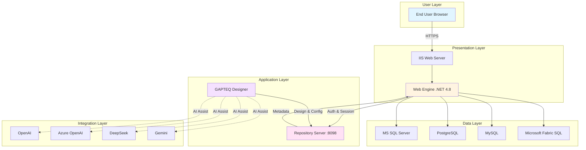
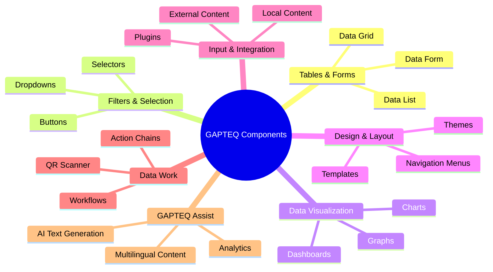
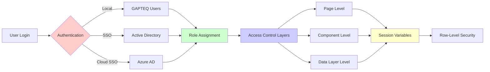
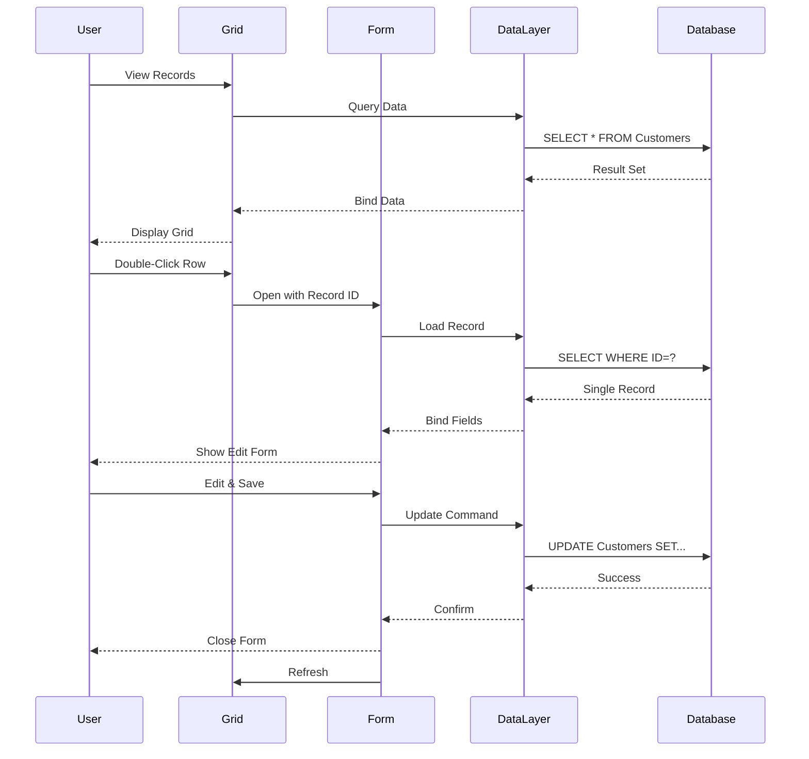
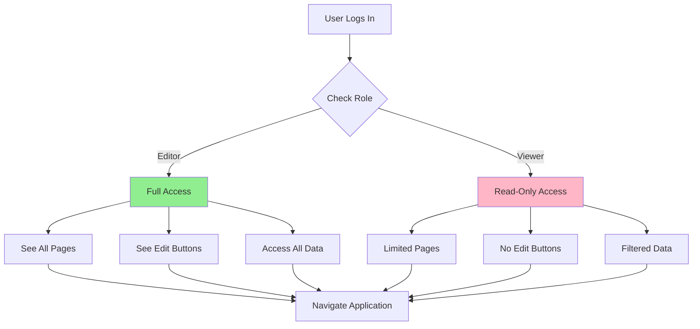
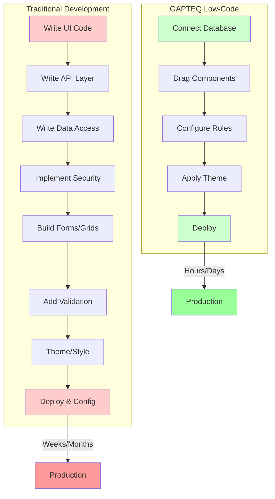

# GAPTEQ Platform Overview
## Presentation for Vishal

---

## 📋 Executive Summary

**GAPTEQ** is a **low-code platform** for building data-driven web applications directly on SQL databases. 

### Core Value Proposition
- **Visual Development** - Drag-and-drop components instead of coding
- **Direct Database Integration** - Connect to MS SQL, PostgreSQL, MySQL, Microsoft Fabric SQL
- **Enterprise Security** - Built-in AD/Azure AD SSO, role-based access control
- **Rapid Deployment** - Build internal tools in hours, not weeks

---

## 🏗️ Architecture Overview

---

## 🧩 Core Components

### 1. **GAPTEQ Designer**
The visual development environment where you build everything.

**Key Features:**
- Drag-and-drop page builder
- Visual data layer configuration
- User & role management
- Database connection setup
- Branding & theming

### 2. **Repository Server**
The central storage and admin hub.

**Key Features:**
- Stores all project metadata
- User/group management
- Automated backups
- Runs on port 8098 (HTTP)

### 3. **Web Engine**
Renders your applications in the browser.

**Key Features:**
- Runs on IIS with .NET 4.8
- Enforces authentication & authorization
- Executes server-side logic
- Session management

---

## 🎨 Component Library

---

## 🔐 Security Model

### Security Layers

1. **Authentication**
   - Local GAPTEQ users
   - Active Directory (on-premises)
   - Azure AD (cloud)

2. **Authorization Levels**
   - **Page Level** - Control who sees which pages
   - **Component Level** - Hide/show buttons, grids, forms per role
   - **Data Layer Level** - Filter data based on user context

3. **Row-Level Security**
   - Session variables set at logon
   - Server-side logon scripts
   - Filter data by department, region, etc.

---

## 🚀 Live Demo Flow

### What We'll Build: "Vishal Sandbox"

A complete CRUD application with security in **3 hours**.

```mermaid
gantt
    title 3-Hour Demo Timeline
    dateFormat HH:mm
    axisFormat %H:%M
    
    section Setup
    Installation & Access          :00:00, 10m
    Architecture Overview          :00:10, 10m
    
    section Foundation
    Create Repository              :00:20, 20m
    Connect to Database            :00:40, 25m
    
    section Development
    Build Data Grid                :01:05, 15m
    Create Edit Form               :01:20, 15m
    Wire Events & Actions          :01:35, 15m
    
    section Security
    Create Roles & Users           :01:50, 15m
    Configure Access Rights        :02:05, 10m
    
    section Polish
    Apply Themes & Templates       :02:15, 15m
    Add Navigation Menu            :02:30, 10m
    
    section Operations
    Backup & Restore Setup         :02:40, 10m
    Admin Console Demo             :02:50, 5m
    
    section Wrap-up
    Q&A & Next Steps              :02:55, 10m
```

---

## 📊 Demo Module Breakdown

### Module 1: Setup & First Page (30-45 min)

**What We'll Do:**
1. ✅ Access GAPTEQ Designer
2. ✅ Create "vishal-sandbox" repository
3. ✅ Create home page and set as start page
4. ✅ Launch in browser

**Key Concepts:**
- Repository = Project container
- Pages are directly URL-addressable
- Start page = Entry point for users

---

### Module 2: Database & CRUD (45-60 min)

**What We'll Do:**
1. ✅ Create database connection (SQL Server/PostgreSQL/MySQL)
2. ✅ Create Data Layer pointing to a table (e.g., Customers)
3. ✅ Add Data Grid with search, sort, paging
4. ✅ Add Data Form for editing
5. ✅ Wire grid row-click to open form
6. ✅ Add Save action to form

**Key Concepts:**
- Data Layer = Reusable data definition
- Components bind to Data Layers
- Events/Actions wire components together
- No code required for CRUD operations

---

### Module 3: Security & UX (30-45 min)

**What We'll Do:**
1. ✅ Create roles: "editor", "viewer"
2. ✅ Create users: "vishal" (editor), "john" (viewer)
3. ✅ Configure page access rights
4. ✅ Configure component access (hide edit buttons from viewers)
5. ✅ Configure data layer filters (show only user's department)
6. ✅ Apply design theme
7. ✅ Add navigation template

**Key Concepts:**
- Roles define permissions
- Users assigned to roles
- Granular control at page/component/data levels
- Session variables enable row-level security

---

### Module 4: Deployment & Operations (20-30 min)

**What We'll Do:**
1. ✅ Test application with different users
2. ✅ Configure automated backup schedule
3. ✅ Perform manual backup
4. ✅ Show System Administrator console
5. ✅ Discuss Cloud instance on Azure

**Key Concepts:**
- Built-in backup/restore
- Online admin without Designer
- Cloud hosting option available

---

## 💡 Real-World Use Cases

### Internal Enterprise Tools
- **Approval Workflows** - Replace SharePoint lists
- **Ticketing Systems** - Custom helpdesk tools
- **CRM Lite** - Customer tracking for small teams
- **Master Data Maintenance** - Product catalogs, vendor lists
- **Time & Expense** - Replace Excel spreadsheets

### Operational Dashboards
- **KPI Dashboards** - Real-time metrics with drill-through
- **Sales Analytics** - Charts + detailed grids
- **Inventory Monitoring** - Stock levels with alerts

### Data Entry Systems
- **Validated Forms** - Business rule enforcement
- **Multi-step Workflows** - Action chains for complex processes
- **Mobile-ready Input** - QR scanner integration

### AI-Assisted Applications
- **Multilingual Content** - Auto-translate using AI
- **Data Insights** - Natural language analytics
- **Text Generation** - Automated report writing

---

## ✅ Why GAPTEQ Saves Time

### Key Productivity Gains

| Task | Traditional | GAPTEQ | Time Saved |
|------|-------------|---------|------------|
| CRUD Forms | 8-16 hours | 30 minutes | **95%** |
| Role-based Security | 16-24 hours | 1-2 hours | **90%** |
| Data Grid with Search/Sort/Filter | 4-8 hours | 15 minutes | **95%** |
| Responsive UI Theme | 8-16 hours | 15 minutes | **95%** |
| Database Integration | 4-8 hours | 30 minutes | **90%** |
| User Management | 16-24 hours | 1-2 hours | **90%** |

**Overall:** Build in **hours** what traditionally takes **weeks**.

---

## 🎯 Advantages

✅ **Rapid Delivery** - Visual assembly of SQL-backed tools  
✅ **Built-in Security** - Granular RBAC at multiple levels  
✅ **Enterprise SSO** - AD/Azure AD integration  
✅ **Multi-Database** - SQL Server, PostgreSQL, MySQL, Fabric SQL  
✅ **Cloud Ready** - Azure instance available  
✅ **No Vendor Lock-in** - Standard .NET/IIS stack  
✅ **AI Integration** - GAPTEQ Assist for intelligent features  

---

## ⚠️ Considerations

⚠️ **Windows Hosting** - Requires Windows Server, .NET 4.8, IIS  
⚠️ **MySQL Limitation** - Output parameters not supported by provider  
⚠️ **Custom UI** - Complex customizations may require plugins  
⚠️ **Learning Curve** - Best practices needed for scalable design  

---

## 📚 Recommended Approach

### Phase 1: Foundation (Week 1)
1. Install GAPTEQ Designer, Repository Server, Web Engine
2. Create test repository
3. Connect to development database
4. Build one simple page with grid + form

### Phase 2: Core Features (Week 2-3)
1. Create production repository
2. Build main data entry pages
3. Configure user roles and access rights
4. Apply branding theme

### Phase 3: Advanced Features (Week 4)
1. Add workflows and action chains
2. Integrate AI Assist (if needed)
3. Create dashboards and reports
4. Set up navigation structure

### Phase 4: Production (Week 5)
1. Configure AD/Azure AD authentication
2. Set up automated backups
3. Deploy to production IIS
4. Train end users

---

## 🗄️ Database Support Matrix

| Database | Version | Output Parameters | Notes |
|----------|---------|-------------------|-------|
| **MS SQL Server** | 2012+ | ✅ Yes | Full support, recommended |
| **PostgreSQL** | 12+ | ✅ Yes | Added in v4.0 |
| **MySQL** | 5.6+ | ❌ No | Provider limitation |
| **Microsoft Fabric SQL** | Latest | ✅ Yes | Added in v4.3 |

**Recommendation:** Use **SQL Server** or **PostgreSQL** for complex stored procedures.

---

## 🔧 System Requirements

### Server Requirements
- **OS:** Windows 10 or Windows Server 2019+
- **.NET:** Framework 4.8
- **Web Server:** IIS with HTTPS enabled
- **Port:** 8098 (Repository Server)

### Database Requirements
- One of: MS SQL Server, PostgreSQL, MySQL, Fabric SQL
- Network connectivity from GAPTEQ server

### Client Requirements
- Modern web browser (Chrome, Edge, Firefox, Safari)
- HTTPS connection for Azure AD

---

## 🎓 Best Practices

### Naming Conventions
✅ Use URL-safe names (no spaces/special characters)  
✅ Repository names appear in URLs  
✅ Consistent naming helps navigation  

### Data Layer Design
✅ One Data Layer per entity  
✅ Reuse Data Layers across pages  
✅ Centralize filters and access rights in Data Layer  

### Security Strategy
✅ Define roles early  
✅ Use data-layer access rights for cross-page consistency  
✅ Leverage session variables for row-level security  

### UI/UX Design
✅ Apply themes/templates early in development  
✅ Use standard navigation templates  
✅ Consistent layout across pages  

### Operations
✅ Schedule automated daily backups  
✅ Test restore process regularly  
✅ Use System Administrator console for online user management  
✅ Enforce SSL for Azure AD SSO  

---

## 📖 Essential Documentation

### Getting Started
1. **Product Components Overview** - Browse all components
2. **Tutorial 1-4** - Step-by-step repository creation
3. **System Requirements** - Plan hosting and database

### Security & Access
1. **Access Rights Guide** - Component/page/data-layer strategies
2. **Authentication Setup** - AD/Azure AD configuration

### Operations
1. **Backup/Restore Guide** - Automated backup configuration
2. **System Administrator Online** - User management without Designer

### Design
1. **Design & Themes** - Brand-consistent UI
2. **Navigation Templates** - Menu structures

---

## 🤔 Q&A Topics

### Integration Questions
**Q: Can GAPTEQ connect to REST APIs?**  
A: Yes, via Input/Integration components for external content

**Q: Can we use existing corporate databases?**  
A: Yes, direct connection to SQL Server/PostgreSQL/MySQL/Fabric SQL

**Q: Does it support SSO with our Active Directory?**  
A: Yes, both on-premises AD and Azure AD

### Scalability Questions
**Q: How many users can it support?**  
A: Depends on IIS/database capacity; standard .NET scaling applies

**Q: Can we deploy multiple apps?**  
A: Yes, each repository is a separate application

### Customization Questions
**Q: Can we add custom code?**  
A: Yes, via plugins and custom integrations

**Q: Can we customize the look and feel?**  
A: Yes, themes, templates, and CSS customization available

---

## 🚦 Next Steps After Demo

### Immediate (This Week)
1. ✅ Set up development environment
2. ✅ Create proof-of-concept repository
3. ✅ Connect to test database
4. ✅ Build sample page

### Short-term (This Month)
1. ✅ Identify first use case
2. ✅ Design data model
3. ✅ Create production repository
4. ✅ Build core pages

### Medium-term (Next Quarter)
1. ✅ Deploy to production
2. ✅ Train users
3. ✅ Gather feedback
4. ✅ Iterate and expand

---

## 📞 Support & Resources

### Official Resources
- **Product Page:** [gapteq.com](https://www.gapteq.com)
- **Knowledge Base:** Complete documentation
- **Sample Apps:** Ready-made examples
- **Live Demo:** Interactive component showcase

### Support Options
- Technical documentation
- Tutorial videos
- Sample repositories
- Community forums

---

## 🎬 Demo Preparation Checklist

### Before the Demo
- [ ] GAPTEQ Designer installed and tested
- [ ] Repository Server running on port 8098
- [ ] Web Engine configured on IIS
- [ ] Test database with sample data ready
- [ ] Network/firewall rules configured
- [ ] Demo user accounts created
- [ ] Backup of clean state

### During the Demo
- [ ] Show live component demo first (excitement!)
- [ ] Build incrementally (don't skip steps)
- [ ] Test as you go (don't save testing for the end)
- [ ] Show both designer and end-user views
- [ ] Demonstrate security with different logins

### After the Demo
- [ ] Share demo repository
- [ ] Provide documentation links
- [ ] Schedule follow-up session
- [ ] Collect feedback and questions

---

## 🎯 Success Metrics

### Immediate (Day 1)
✅ Repository created  
✅ Database connected  
✅ First page deployed  

### Week 1
✅ CRUD operations working  
✅ Users and roles configured  
✅ Theme applied  

### Month 1
✅ Production application deployed  
✅ Users actively using the app  
✅ Positive feedback from stakeholders  

### Quarter 1
✅ Multiple applications in production  
✅ Reduced development time by 80%+  
✅ Team proficient with GAPTEQ  

---

## 🏁 Conclusion

**GAPTEQ enables you to:**
- Build enterprise-grade web applications **visually**
- Deliver in **hours** what traditionally takes **weeks**
- Maintain **security and governance** without custom code
- Scale from simple forms to complex workflows
- Integrate with your existing IT infrastructure

**Perfect for:**
- Internal business tools
- Data entry applications  
- Operational dashboards
- Workflow automation
- Replacing Excel/Access applications

**Let's build the "Vishal Sandbox" together!** 🚀

---

*Document Version: 1.0*  
*Based on: GAPTEQ Knowledge Base & Product Documentation*  
*Prepared for: Vishal Demo Session*

