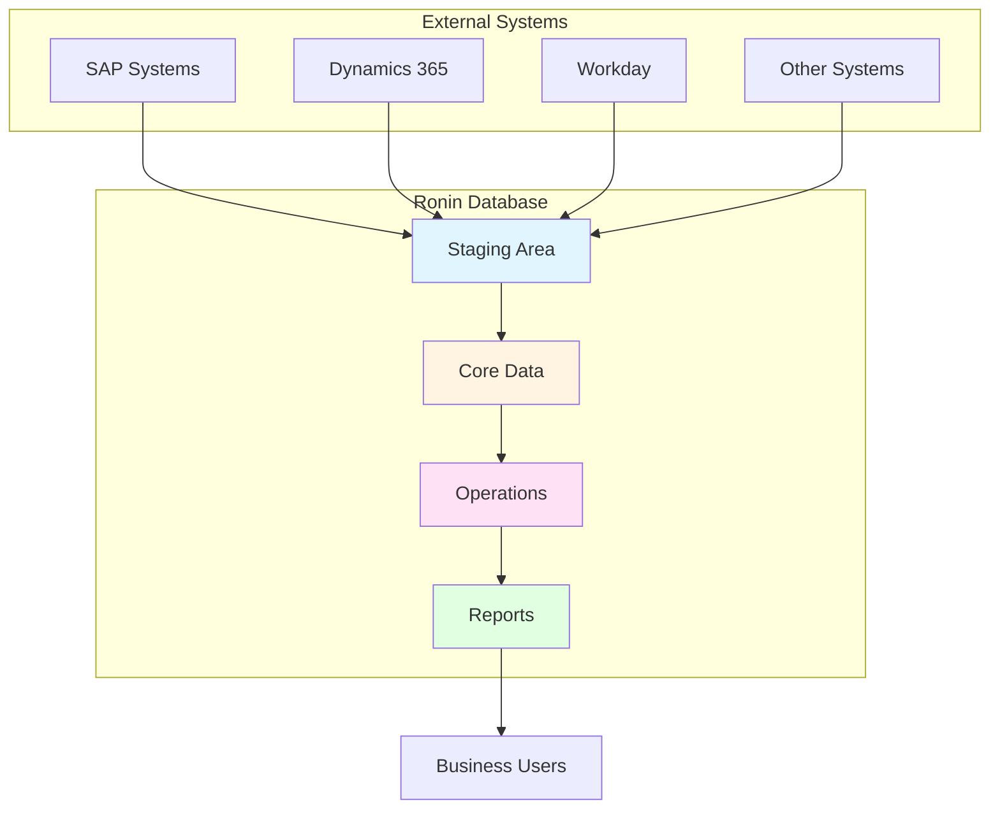
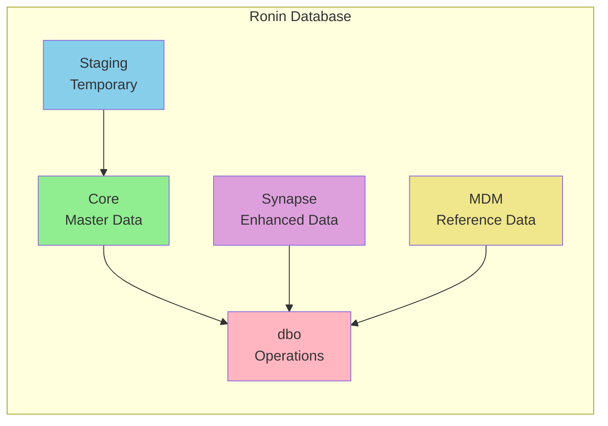
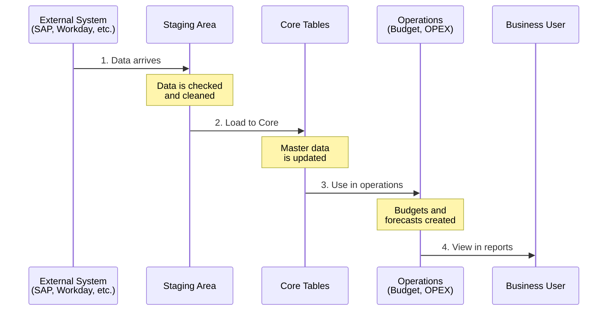
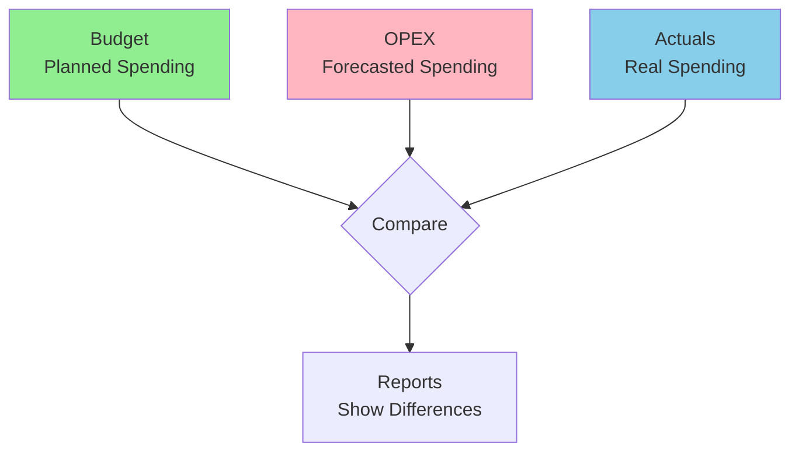
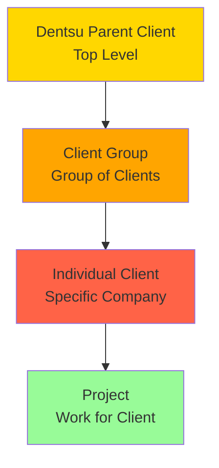
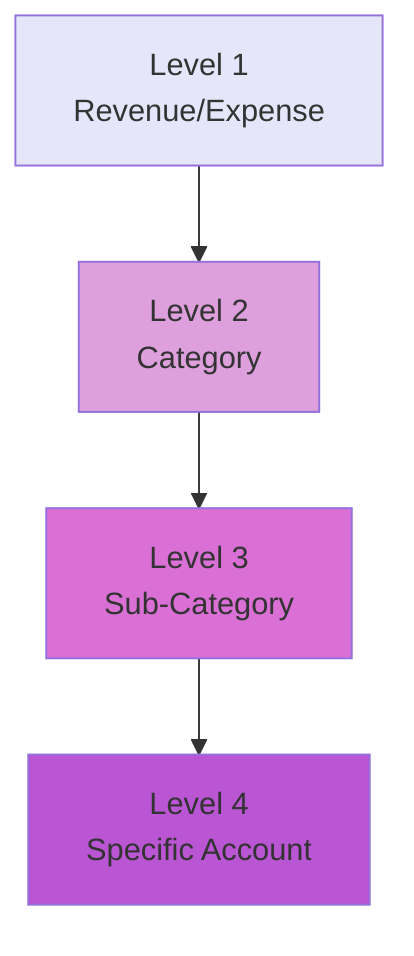
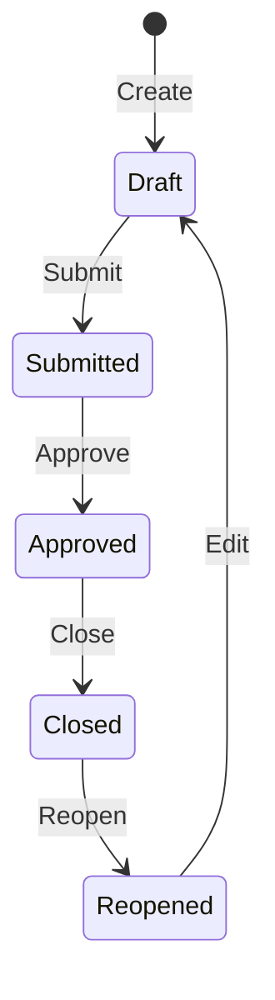
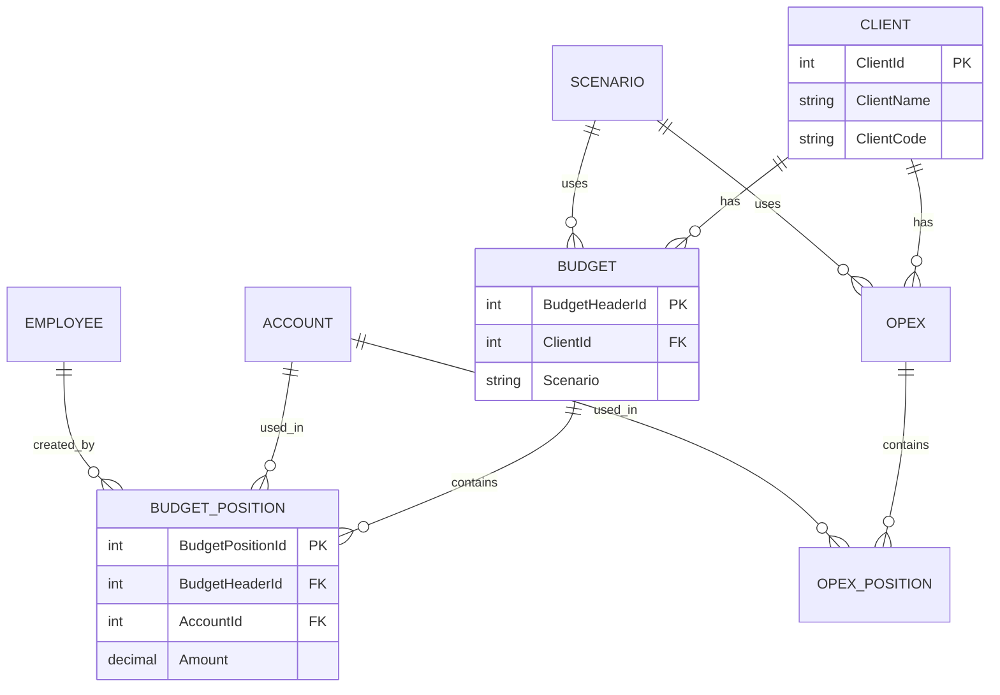

# Ronin Application - Beginner Guide

## 🎯 What is Ronin?

**Ronin** is a financial planning system used by Dentsu (an advertising agency) to:
- Plan budgets and track spending (OPEX)
- Forecast future financial performance
- Plan media campaigns
- Manage client information
- Integrate data from multiple business systems

Think of it as a **central hub** that collects financial data from many different systems and helps people plan and track money.

---

## 📊 System Overview Diagram

---

## 🗂️ Database Structure (Simple View)

The Ronin database is organized into **schemas** (like folders). Here's what each one does:

### Schema Purposes

| Schema | Purpose | Simple Explanation |
|--------|---------|-------------------|
| **Core** | Master data | The "source of truth" - client names, account codes, employee info |
| **Core_Staging** | Temporary storage | Where new data lands before being processed |
| **dbo** | Operations | Where budgets, forecasts, and actual spending are stored |
| **Synapse** | Enhanced data | Data from other systems (like Workday, SAP) that's been cleaned up |
| **mdm** | Reference data | Lists and codes used throughout the system |

---

## 🔄 How Data Flows (Simple)

### Step-by-Step Process

1. **Data Arrives**: External systems (like SAP or Workday) send data to Ronin
2. **Staging**: Data goes to a "staging area" where it's temporarily stored
3. **Processing**: Special programs (stored procedures) clean and organize the data
4. **Core Storage**: Clean data moves to "Core" tables (the main storage)
5. **Operations**: People use this data to create budgets and forecasts
6. **Reporting**: Data appears in reports and dashboards

---

## 📋 Key Concepts

### 1. Budget vs. OPEX vs. Actuals

- **Budget**: How much money we **plan** to spend
- **OPEX**: How much we **forecast** we'll spend (updated regularly)
- **Actuals**: How much we **actually** spent (from accounting systems)

### 2. Client Hierarchy

- **Dentsu Parent Client**: The big company (e.g., "Coca-Cola Global")
- **Client Group**: A group of related clients
- **Client**: A specific company we work for
- **Project**: Specific work we do for that client

### 3. Account Structure

Accounts are organized in 4 levels:
- **Level 1**: Big categories (Revenue, Expenses)
- **Level 2**: Smaller categories (Marketing, Operations)
- **Level 3**: More specific (Digital Marketing, Print)
- **Level 4**: Very specific account codes

---

## 🎯 Common Tasks

### Finding Client Information

**Where to look**: `Core.T_Client` table

**What you'll find**:
- Client name
- Client code
- Which client group they belong to
- Location information

### Finding Budget Information

**Where to look**: `dbo.T_BudgetHeader` and `dbo.T_BudgetPosition`

**What you'll find**:
- Budget headers (the overall budget)
- Budget positions (individual line items)
- Who created it and when

### Finding Employee Information

**Where to look**: `Core.T_Employee`

**What you'll find**:
- Employee name
- Employee code
- Email address
- Which cost center they belong to

---

## 🔍 Where Things Are Located

### Master Data (The "Source of Truth")

| What | Where | Example |
|------|-------|---------|
| Clients | `Core.T_Client` | Client names, codes |
| Accounts | `Core.T_Account` | Account codes, descriptions |
| Employees | `Core.T_Employee` | Employee names, emails |
| Companies | `Core.T_Entity` | Company names, codes |
| Cost Centers | `Core.T_CostCenter` | Cost center codes |

### Operational Data (Budgets, Forecasts)

| What | Where | Example |
|------|-------|---------|
| Budgets | `dbo.T_BudgetHeader` | Budget headers |
| Budget Items | `dbo.T_BudgetPosition` | Individual budget lines |
| OPEX | `dbo.T_OpexHeader` | OPEX headers |
| OPEX Items | `dbo.T_OpexPosition` | Individual OPEX lines |
| Actuals | `dbo.T_ActualAmountDetail` | Real spending data |

### Reference Data (Lists and Codes)

| What | Where | Example |
|------|-------|---------|
| List of Values | `dbo.LoV` | Dropdown lists |
| Scenarios | `dbo.T_Scenario` | Budget, Forecast, Actual |
| Years | `dbo.T_Year` | Fiscal years |

---

## 🚦 Understanding Status and States

### Scenario States

Budgets and OPEX go through these states:
- **Draft**: Being created, can be edited
- **Submitted**: Sent for approval
- **Approved**: Approved, can be viewed
- **Closed**: Finalized, cannot be changed
- **Reopened**: Closed budgets that were reopened for changes

---

## 📊 Simple Data Relationships

---

## 🎓 Learning Path

### Week 1: Basics
1. Understand what Ronin does
2. Learn the main schemas
3. Find common tables

### Week 2: Data Flow
1. Understand how data moves through the system
2. Learn about staging vs. core
3. See how budgets are created

### Week 3: Common Tasks
1. Query client information
2. Find budget data
3. Understand relationships between tables

### Week 4: Practice
1. Write simple queries
2. Explore the database
3. Ask questions!

---

## ❓ Frequently Asked Questions

### Q: What's the difference between Core and dbo?
**A**: Core has master data (clients, accounts, employees). dbo has operational data (budgets, forecasts, actuals).

### Q: Why is there a Staging schema?
**A**: Staging is a temporary area where data is checked and cleaned before being moved to Core. It's like a "waiting room" for data.

### Q: What is OPEX?
**A**: OPEX stands for "Operating Expenditure" - it's forecasted spending that gets updated regularly, unlike budgets which are set once.

### Q: How do I find a specific client's budget?
**A**: 
1. Find the client in `Core.T_Client` (get ClientId)
2. Find budgets in `dbo.T_BudgetHeader` where ClientId matches
3. Find budget details in `dbo.T_BudgetPosition` where BudgetHeaderId matches

---

## 🔗 Next Steps

Once you understand the basics:
- → Move to [Mid-Level Guide](./02_MID_LEVEL_GUIDE.md) for more details
- → Learn about ETL processes
- → Understand stored procedures
- → Explore integration patterns

---

**Remember**: Don't be afraid to explore! The best way to learn is by looking at the data and trying queries.
