# Ronin Application - Mid-Level Guide

## 🎯 Overview

This guide provides detailed technical information for developers, data engineers, and system analysts working with Ronin.

---

## 🏗️ System Architecture

### Complete Schema Architecture

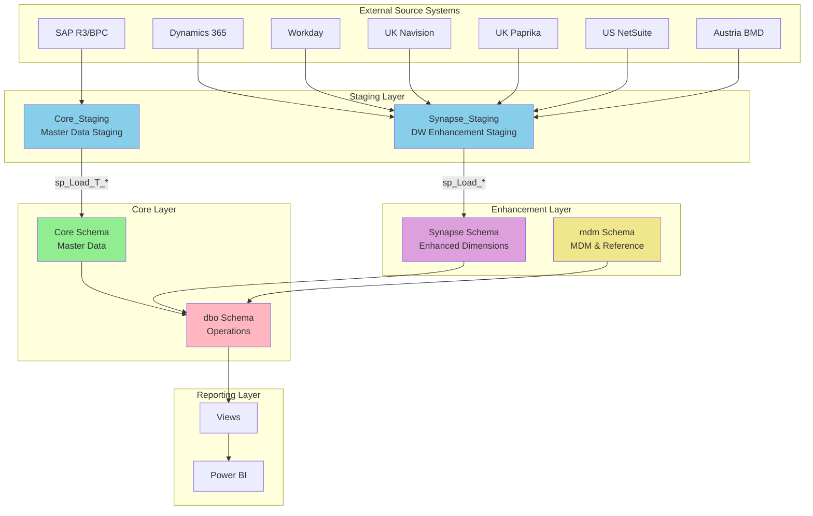

---

## 🔄 Data Flow Patterns

### ETL Pattern (Extract, Transform, Load)

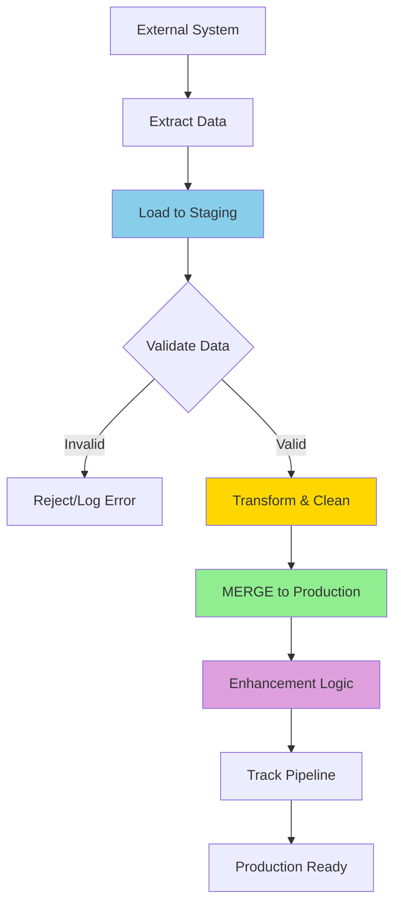

### Detailed ETL Process

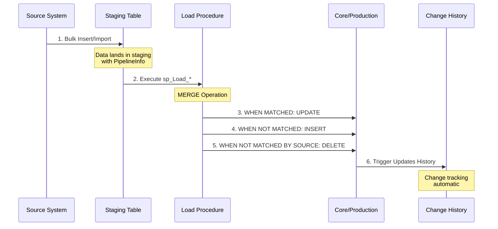

---

## 📊 Schema Details

### Core Schema Structure

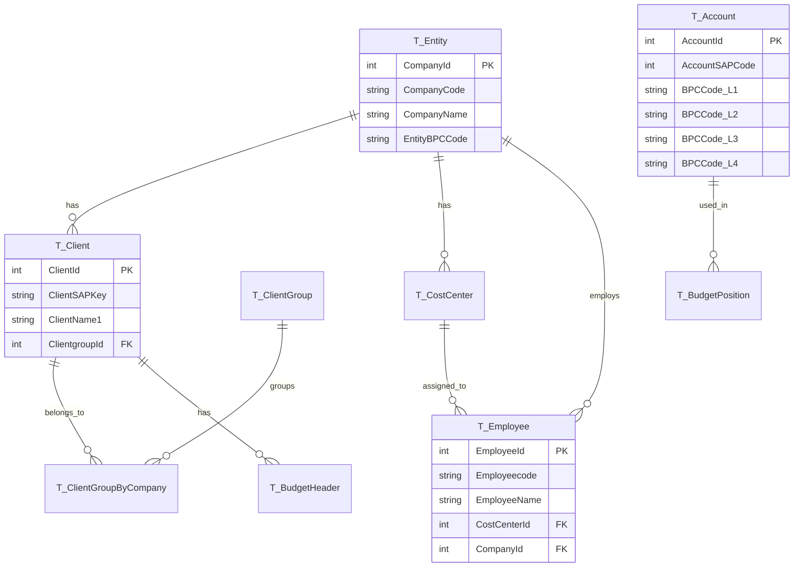

### Operational Schema (dbo) Structure

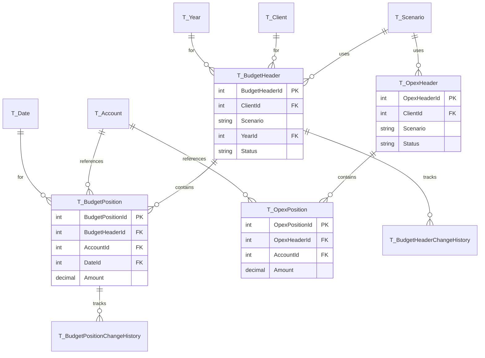

---

## 🔧 Stored Procedures

### Load Procedures Pattern

All load procedures follow this pattern:

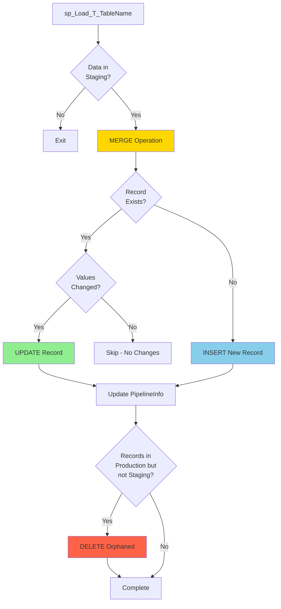

### Key Stored Procedures

#### Budget & OPEX Procedures

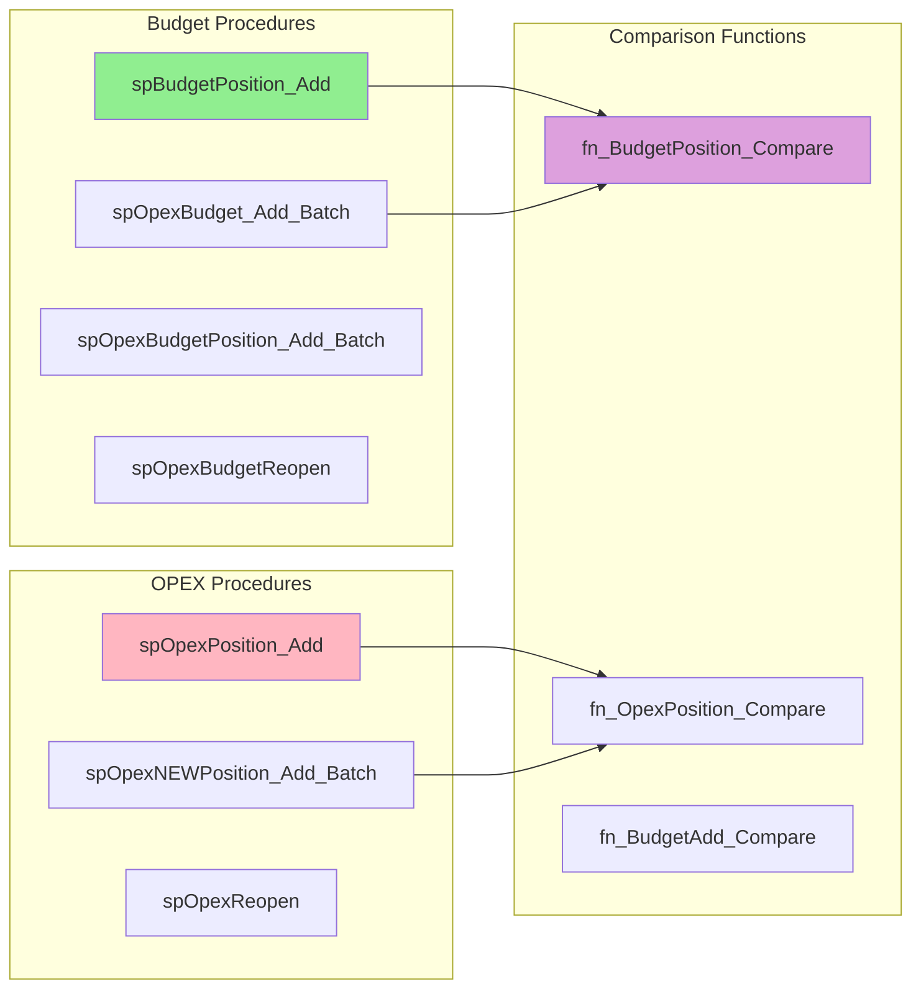

#### MDM Procedures

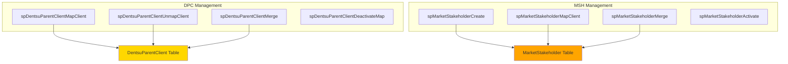

---

## 🔐 Security Model

### Security Architecture

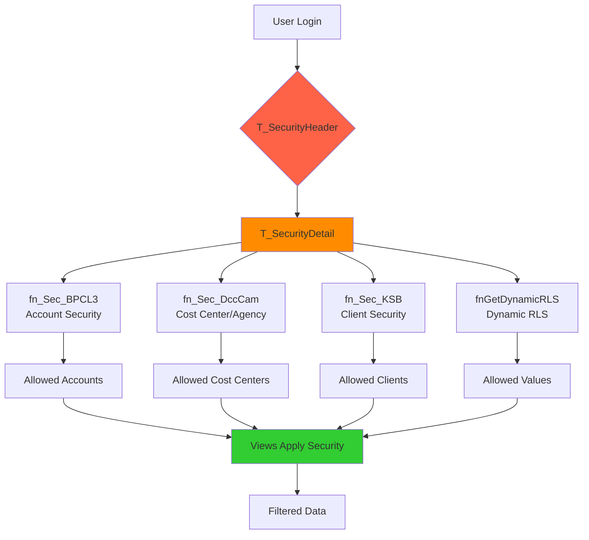

### Security Flow

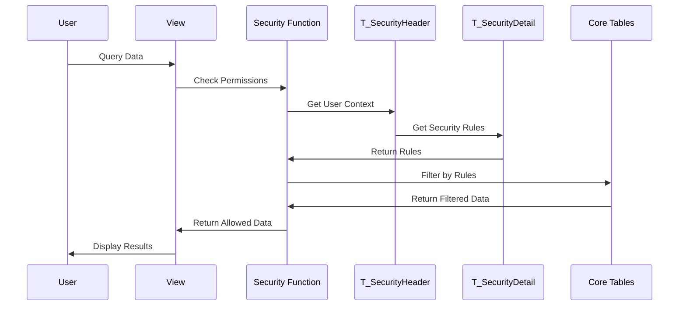

---

## 🔄 Integration Patterns

### Source System Integration Flow

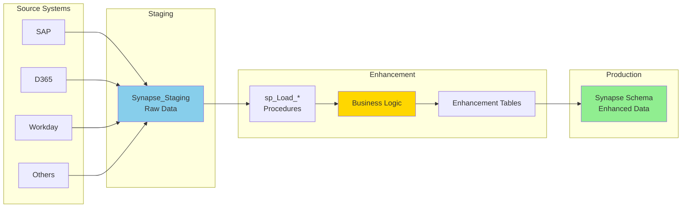

### Enhancement Pattern Example (Workday)

```mermaid
sequenceDiagram
    participant WD as Workday System
    participant SS as Synapse_Staging.WD_Employee
    participant SP as sp_Load_WD_EmployeeEnhancements
    participant SE as Synapse.WD_EmployeeEnhancements
    participant Core as Core.T_Employee
    
    WD->>SS: 1. Export Employee Data
    Note over SS: Raw Workday data<br/>with all fields
    
    SS->>SP: 2. Execute Load Procedure
    Note over SP: Apply business rules<br/>Map to Core entities<br/>Add calculated fields
    
    SP->>SE: 3. MERGE to Enhancement
    Note over SE: Enhanced with<br/>- Cost Center mapping<br/>- Entity mapping<br/>- Status flags
    
    SE->>Core: 4. Reference in Operations
    Note over Core: Used in budgets<br/>and forecasts
    
    style SS fill:#87CEEB
    style SP fill:#FFD700
    style SE fill:#90EE90
```

---

## 📈 Change Tracking

### Change History Pattern

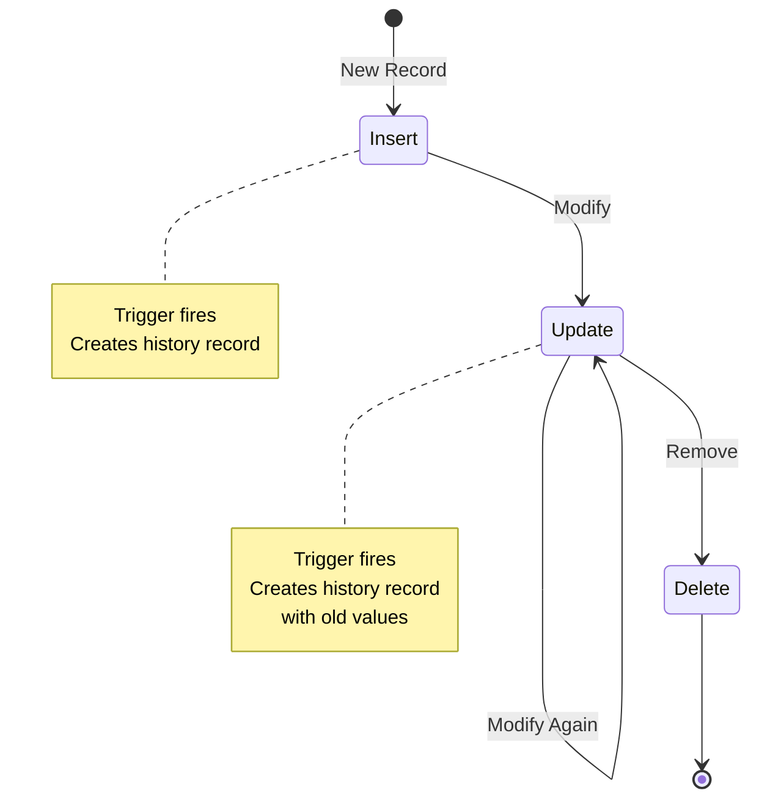

### Trigger Pattern

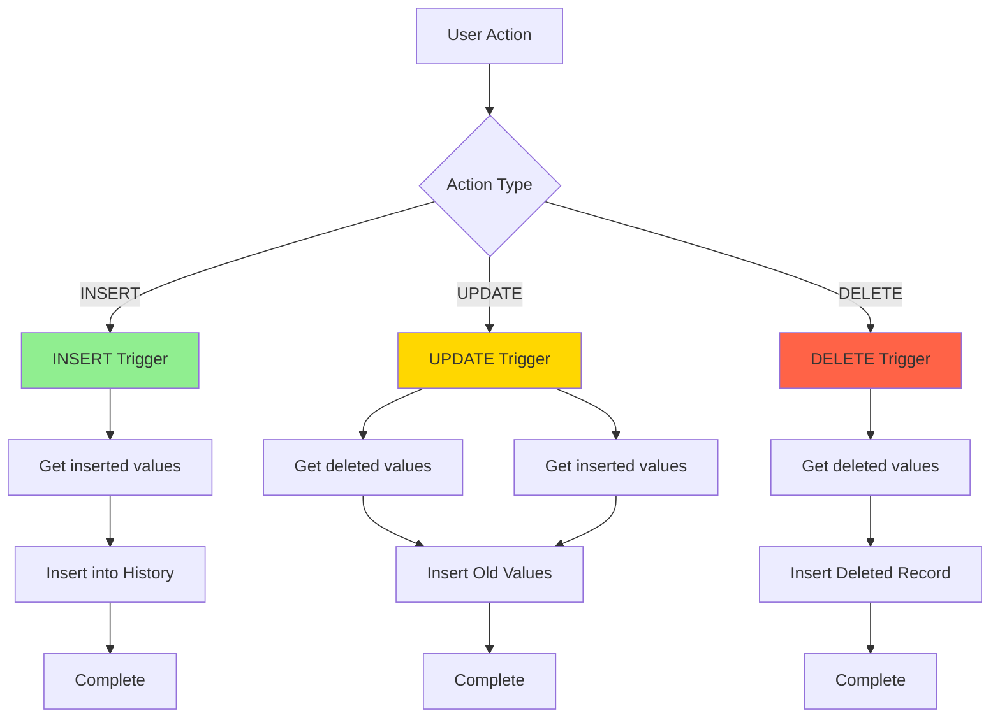

---

## 🎯 Business Process Flows

### Budget Creation Process

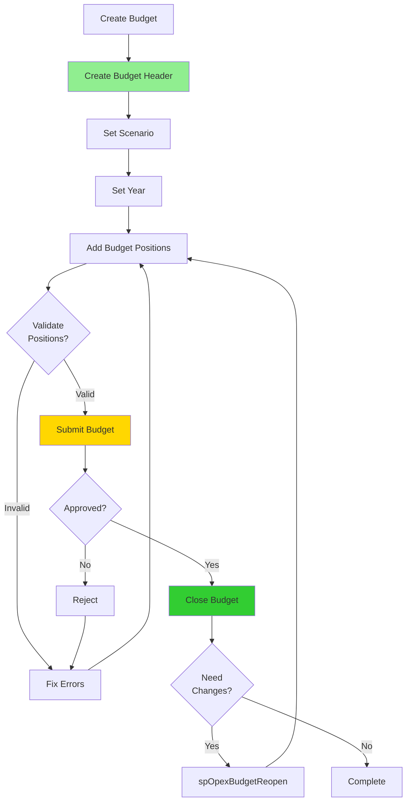

### OPEX Forecasting Process

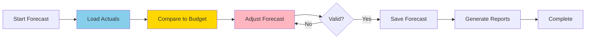

---

## 🔍 Views and Reporting

### View Hierarchy

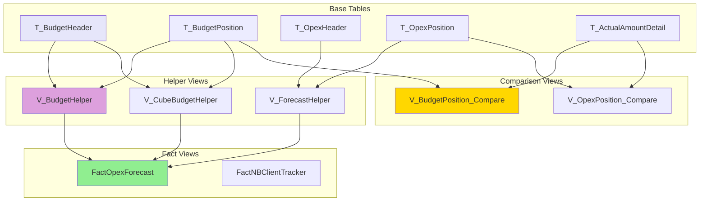

---

## 🛠️ Troubleshooting Guide

### Common Issues and Solutions

#### Issue: Data not appearing in Core after staging load

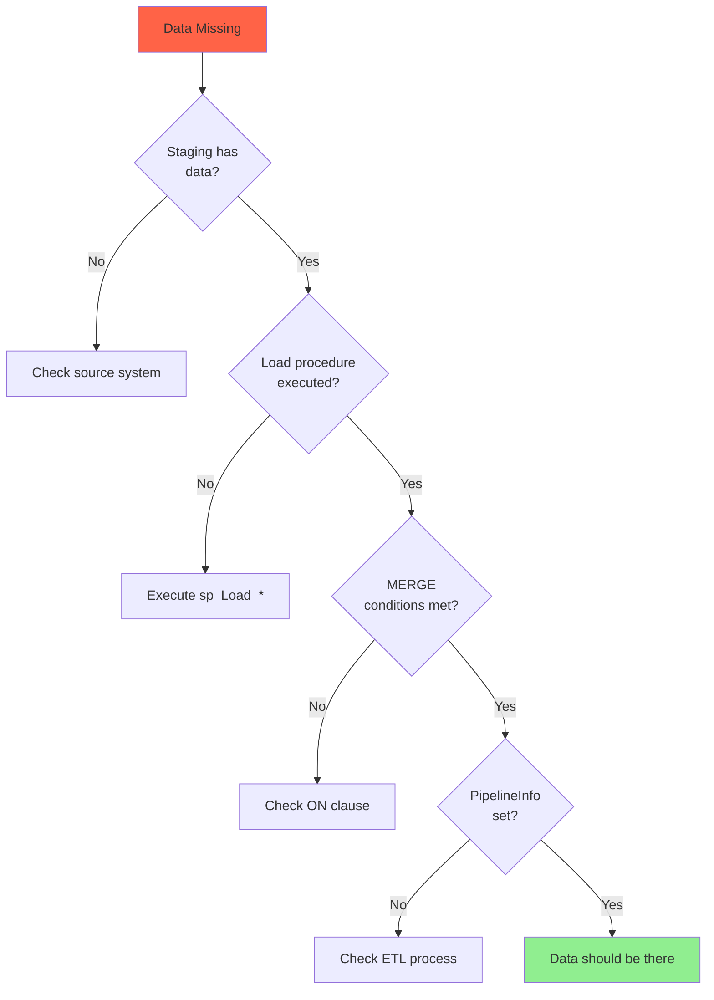

#### Issue: Budget comparison showing wrong values

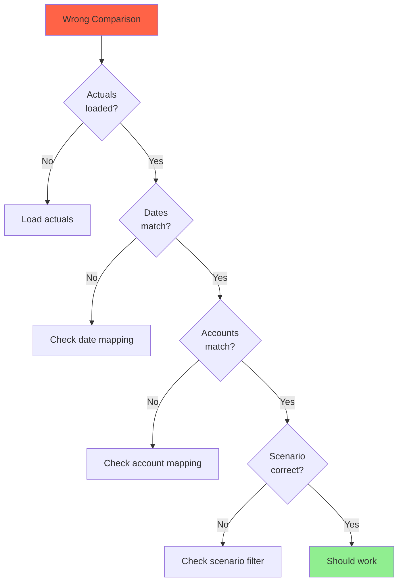

---

## 📝 Best Practices

### 1. Querying Data

```sql
-- ✅ Good: Use views when available
SELECT * FROM dbo.V_BudgetHelper WHERE YearId = 2024

-- ❌ Bad: Direct table access without understanding relationships
SELECT * FROM dbo.T_BudgetPosition
```

### 2. Understanding Dependencies

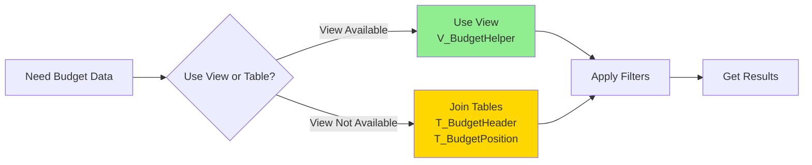

### 3. ETL Development

- Always use staging tables first
- Implement proper error handling
- Track pipeline execution (PipelineInfo, PipelineRunId)
- Use MERGE for idempotent operations
- Test with small datasets first

---

## 🔗 Next Steps

- → See [Senior Guide](./03_SENIOR_GUIDE.md) for architecture deep dive
- → Learn about performance optimization
- → Understand advanced security patterns
- → Explore system dependencies

---

**Key Takeaways**:
- Ronin uses a staging → core → operations pattern
- All ETL follows consistent MERGE patterns
- Security is function-based and applied in views
- Change tracking is automatic via triggers
- Views provide abstraction over complex joins
