# Ronin Application - Senior Engineer Guide

## 🎯 Overview

This guide provides comprehensive architectural and technical details for senior engineers, architects, and technical leads working with Ronin.

---

## 🏛️ Complete System Architecture

### Enterprise Architecture Diagram

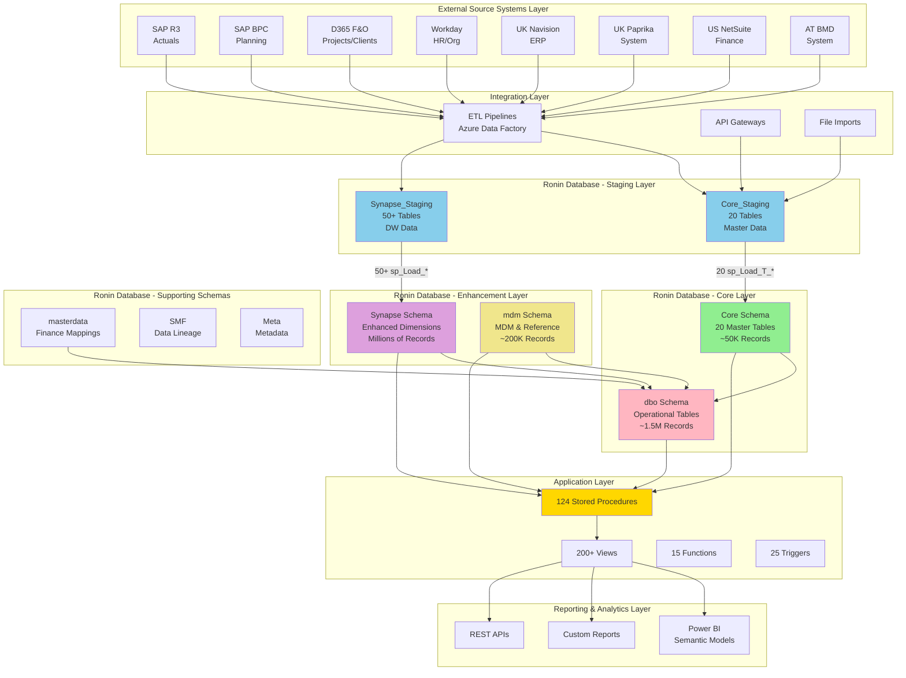
```mermaid
graph TB
    subgraph "External Source Systems Layer"
        direction LR
        SAP[SAP R3<br/>Actuals]
        BPC[SAP BPC<br/>Planning]
        D365[D365 F&O<br/>Projects/Clients]
        WD[Workday<br/>HR/Org]
        UK1[UK Navision<br/>ERP]
        UK2[UK Paprika<br/>System]
        US[US NetSuite<br/>Finance]
        AT[AT BMD<br/>System]
    end
    
    subgraph "Integration Layer"
        direction TB
        ETL1[ETL Pipelines<br/>Azure Data Factory]
        API1[API Gateways]
        FILE1[File Imports]
    end
    
    subgraph "Ronin Database - Staging Layer"
        direction LR
        CS[Core_Staging<br/>20 Tables<br/>Master Data]
        SS[Synapse_Staging<br/>50+ Tables<br/>DW Data]
    end
    
    subgraph "Ronin Database - Core Layer"
        direction TB
        Core[Core Schema<br/>20 Master Tables<br/>~50K Records]
        dbo[dbo Schema<br/>Operational Tables<br/>~1.5M Records]
    end
    
    subgraph "Ronin Database - Enhancement Layer"
        direction LR
        Synapse[Synapse Schema<br/>Enhanced Dimensions<br/>Millions of Records]
        MDM[mdm Schema<br/>MDM & Reference<br/>~200K Records]
    end
    
    subgraph "Ronin Database - Supporting Schemas"
        direction LR
        MD[masterdata<br/>Finance Mappings]
        SMF[SMF<br/>Data Lineage]
        Meta[Meta<br/>Metadata]
    end
    
    subgraph "Application Layer"
        direction TB
        SP[124 Stored Procedures]
        Views[200+ Views]
        Func[15 Functions]
        Triggers[25 Triggers]
    end
    
    subgraph "Reporting & Analytics Layer"
        direction LR
        PBI[Power BI<br/>Semantic Models]
        Reports[Custom Reports]
        API2[REST APIs]
    end
    
    SAP --> ETL1
    BPC --> ETL1
    D365 --> ETL1
    WD --> ETL1
    UK1 --> ETL1
    UK2 --> ETL1
    US --> ETL1
    AT --> ETL1
    
    ETL1 --> CS
    ETL1 --> SS
    API1 --> CS
    FILE1 --> CS
    
    CS -->|20 sp_Load_T_*| Core
    SS -->|50+ sp_Load_*| Synapse
    
    Core --> dbo
    Synapse --> dbo
    MDM --> dbo
    MD --> dbo
    
    dbo --> SP
    Core --> SP
    Synapse --> SP
    MDM --> SP
    
    SP --> Views
    Views --> PBI
    Views --> Reports
    Views --> API2
    
    style CS fill:#87CEEB
    style SS fill:#87CEEB
    style Core fill:#90EE90
    style dbo fill:#FFB6C1
    style Synapse fill:#DDA0DD
    style MDM fill:#F0E68C
    style SP fill:#FFD700
```

---

## 🔄 Advanced ETL Architecture

### Complete ETL Flow with Error Handling

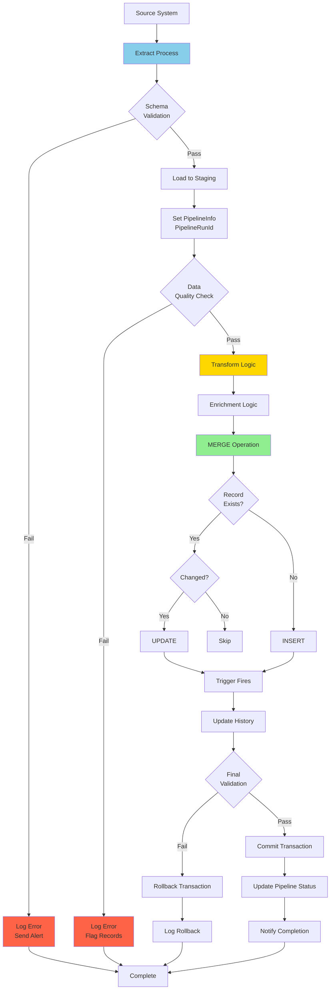
```mermaid
flowchart TD
    Start[Source System] --> Extract[Extract Process]
    Extract --> Validate1{Schema<br/>Validation}
    Validate1 -->|Fail| Error1[Log Error<br/>Send Alert]
    Validate1 -->|Pass| Stage[Load to Staging]
    
    Stage --> Track1[Set PipelineInfo<br/>PipelineRunId]
    Track1 --> Validate2{Data<br/>Quality Check}
    Validate2 -->|Fail| Error2[Log Error<br/>Flag Records]
    Validate2 -->|Pass| Transform[Transform Logic]
    
    Transform --> Enrich[Enrichment Logic]
    Enrich --> Merge[MERGE Operation]
    
    Merge --> Match{Record<br/>Exists?}
    Match -->|Yes| Compare{Changed?}
    Match -->|No| Insert[INSERT]
    
    Compare -->|Yes| Update[UPDATE]
    Compare -->|No| Skip[Skip]
    
    Update --> Trigger[Trigger Fires]
    Insert --> Trigger
    Trigger --> History[Update History]
    
    History --> Validate3{Final<br/>Validation}
    Validate3 -->|Fail| Rollback[Rollback Transaction]
    Validate3 -->|Pass| Commit[Commit Transaction]
    
    Commit --> Track2[Update Pipeline Status]
    Track2 --> Notify[Notify Completion]
    Notify --> End[Complete]
    
    Error1 --> End
    Error2 --> End
    Rollback --> Error3[Log Rollback]
    Error3 --> End
    
    style Extract fill:#87CEEB
    style Transform fill:#FFD700
    style Merge fill:#90EE90
    style Error1 fill:#FF6347
    style Error2 fill:#FF6347
```

### MERGE Pattern Deep Dive

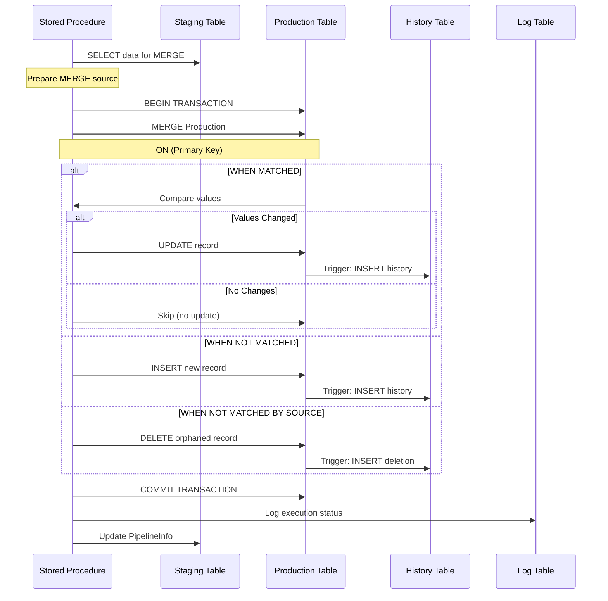
```mermaid
sequenceDiagram
    participant SP as Stored Procedure
    participant Stage as Staging Table
    participant Prod as Production Table
    participant Hist as History Table
    participant Log as Log Table
    
    SP->>Stage: SELECT data for MERGE
    Note over SP: Prepare MERGE source
    
    SP->>Prod: BEGIN TRANSACTION
    
    SP->>Prod: MERGE Production
    Note over SP,Prod: ON (Primary Key)
    
    alt WHEN MATCHED
        Prod->>SP: Compare values
        alt Values Changed
            SP->>Prod: UPDATE record
            Prod->>Hist: Trigger: INSERT history
        else No Changes
            SP->>Prod: Skip (no update)
        end
    else WHEN NOT MATCHED
        SP->>Prod: INSERT new record
        Prod->>Hist: Trigger: INSERT history
    else WHEN NOT MATCHED BY SOURCE
        SP->>Prod: DELETE orphaned record
        Prod->>Hist: Trigger: INSERT deletion
    end
    
    SP->>Prod: COMMIT TRANSACTION
    SP->>Log: Log execution status
    SP->>Stage: Update PipelineInfo
```

---

## 🏗️ Data Model Architecture

### Complete Entity Relationship Model

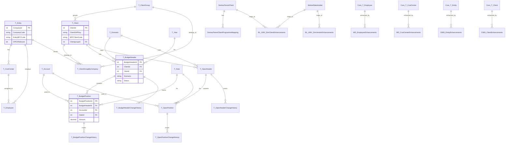
```mermaid
erDiagram
    %% Core Master Data
    T_Entity ||--o{ T_CostCenter : "has"
    T_Entity ||--o{ T_Employee : "employs"
    T_Entity ||--o{ T_ClientGroupByCompany : "serves"
    T_CostCenter ||--o{ T_Employee : "assigned_to"
    T_ClientGroup ||--o{ T_Client : "groups"
    T_ClientGroup ||--o{ T_ClientGroupByCompany : "belongs_to"
    T_Client ||--o{ T_ClientGroupByCompany : "belongs_to"
    T_Account ||--o{ T_BudgetPosition : "used_in"
    T_Account ||--o{ T_OpexPosition : "used_in"
    
    %% Operational Data
    T_Scenario ||--o{ T_BudgetHeader : "uses"
    T_Scenario ||--o{ T_OpexHeader : "uses"
    T_Year ||--o{ T_BudgetHeader : "for"
    T_Client ||--o{ T_BudgetHeader : "has"
    T_Client ||--o{ T_OpexHeader : "has"
    T_BudgetHeader ||--o{ T_BudgetPosition : "contains"
    T_OpexHeader ||--o{ T_OpexPosition : "contains"
    T_Date ||--o{ T_BudgetPosition : "for"
    T_Date ||--o{ T_OpexPosition : "for"
    
    %% Change History
    T_BudgetHeader ||--o{ T_BudgetHeaderChangeHistory : "tracks"
    T_BudgetPosition ||--o{ T_BudgetPositionChangeHistory : "tracks"
    T_OpexHeader ||--o{ T_OpexHeaderChangeHistory : "tracks"
    T_OpexPosition ||--o{ T_OpexPositionChangeHistory : "tracks"
    
    %% MDM Relationships
    DentsuParentClient ||--o{ DentsuParentClientProgrammeMapping : "has"
    DentsuParentClient ||--o{ BL_UMV_DimClientEnhancements : "maps_to"
    MarketStakeholder ||--o{ BL_UMV_DimClientEnhancements : "maps_to"
    MarketStakeholder ||--o{ BL_UMV_DimVendorEnhancements : "maps_to"
    
    %% Enhancement Relationships
    Core_T_Employee ||--o{ WD_EmployeeEnhancements : "enhanced_by"
    Core_T_CostCenter ||--o{ WD_CostCenterEnhancements : "enhanced_by"
    Core_T_Entity ||--o{ D365_EntityEnhancements : "enhanced_by"
    Core_T_Client ||--o{ D365_ClientEnhancements : "enhanced_by"
    
    T_Entity {
        int CompanyId PK
        string CompanyCode
        string EntityBPCCode
        bit OPEXRelevant
    }
    T_Client {
        int ClientId PK
        string ClientSAPKey
        string BPCClientCode
        int ClientgroupId FK
    }
    T_BudgetHeader {
        int BudgetHeaderId PK
        int ClientId FK
        int YearId FK
        string Scenario
        string Status
    }
    T_BudgetPosition {
        int BudgetPositionId PK
        int BudgetHeaderId FK
        int AccountId FK
        int DateId FK
        decimal Amount
    }
```

---

## 🔐 Advanced Security Architecture

### Multi-Layer Security Model

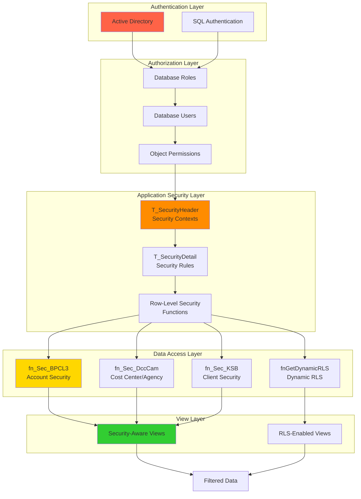
```mermaid
graph TB
    subgraph "Authentication Layer"
        AD[Active Directory]
        SQL[SQL Authentication]
    end
    
    subgraph "Authorization Layer"
        Roles[Database Roles]
        Users[Database Users]
        Perms[Object Permissions]
    end
    
    subgraph "Application Security Layer"
        Header[T_SecurityHeader<br/>Security Contexts]
        Detail[T_SecurityDetail<br/>Security Rules]
        RLS[Row-Level Security<br/>Functions]
    end
    
    subgraph "Data Access Layer"
        Func1[fn_Sec_BPCL3<br/>Account Security]
        Func2[fn_Sec_DccCam<br/>Cost Center/Agency]
        Func3[fn_Sec_KSB<br/>Client Security]
        Func4[fnGetDynamicRLS<br/>Dynamic RLS]
    end
    
    subgraph "View Layer"
        SecViews[Security-Aware Views]
        RLSViews[RLS-Enabled Views]
    end
    
    AD --> Roles
    SQL --> Roles
    Roles --> Users
    Users --> Perms
    
    Perms --> Header
    Header --> Detail
    Detail --> RLS
    
    RLS --> Func1
    RLS --> Func2
    RLS --> Func3
    RLS --> Func4
    
    Func1 --> SecViews
    Func2 --> SecViews
    Func3 --> SecViews
    Func4 --> RLSViews
    
    SecViews --> Data[Filtered Data]
    RLSViews --> Data
    
    style AD fill:#FF6347
    style Header fill:#FF8C00
    style Func1 fill:#FFD700
    style SecViews fill:#32CD32
```

### Security Function Flow

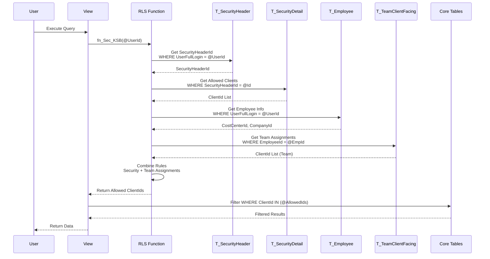
```mermaid
sequenceDiagram
    participant User
    participant View
    participant RLS as RLS Function
    participant Header as T_SecurityHeader
    participant Detail as T_SecurityDetail
    participant Emp as T_Employee
    participant Team as T_TeamClientFacing
    participant Data as Core Tables
    
    User->>View: Execute Query
    View->>RLS: fn_Sec_KSB(@UserId)
    
    RLS->>Header: Get SecurityHeaderId<br/>WHERE UserFullLogin = @UserId
    Header-->>RLS: SecurityHeaderId
    
    RLS->>Detail: Get Allowed Clients<br/>WHERE SecurityHeaderId = @Id
    Detail-->>RLS: ClientId List
    
    RLS->>Emp: Get Employee Info<br/>WHERE UserFullLogin = @UserId
    Emp-->>RLS: CostCenterId, CompanyId
    
    RLS->>Team: Get Team Assignments<br/>WHERE EmployeeId = @EmpId
    Team-->>RLS: ClientId List (Team)
    
    RLS->>RLS: Combine Rules<br/>Security + Team Assignments
    RLS-->>View: Return Allowed ClientIds
    
    View->>Data: Filter WHERE ClientId IN (@AllowedIds)
    Data-->>View: Filtered Results
    View-->>User: Return Data
```

### Dynamic RLS Implementation

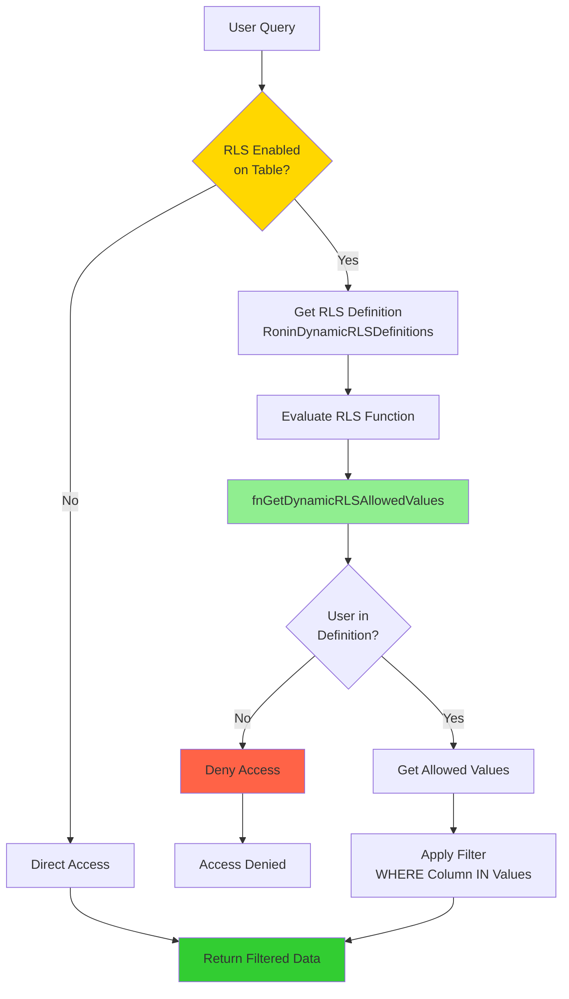
```mermaid
flowchart TD
    Start[User Query] --> Check{RLS Enabled<br/>on Table?}
    Check -->|No| Direct[Direct Access]
    Check -->|Yes| GetDef[Get RLS Definition<br/>RoninDynamicRLSDefinitions]
    
    GetDef --> Eval[Evaluate RLS Function]
    Eval --> Func[fnGetDynamicRLSAllowedValues]
    
    Func --> CheckUser{User in<br/>Definition?}
    CheckUser -->|No| Deny[Deny Access]
    CheckUser -->|Yes| GetValues[Get Allowed Values]
    
    GetValues --> Apply[Apply Filter<br/>WHERE Column IN Values]
    Apply --> Return[Return Filtered Data]
    
    Direct --> Return
    Deny --> Error[Access Denied]
    
    style Check fill:#FFD700
    style Func fill:#90EE90
    style Deny fill:#FF6347
    style Return fill:#32CD32
```

---

## 🔄 Integration Architecture

### Source System Integration Matrix

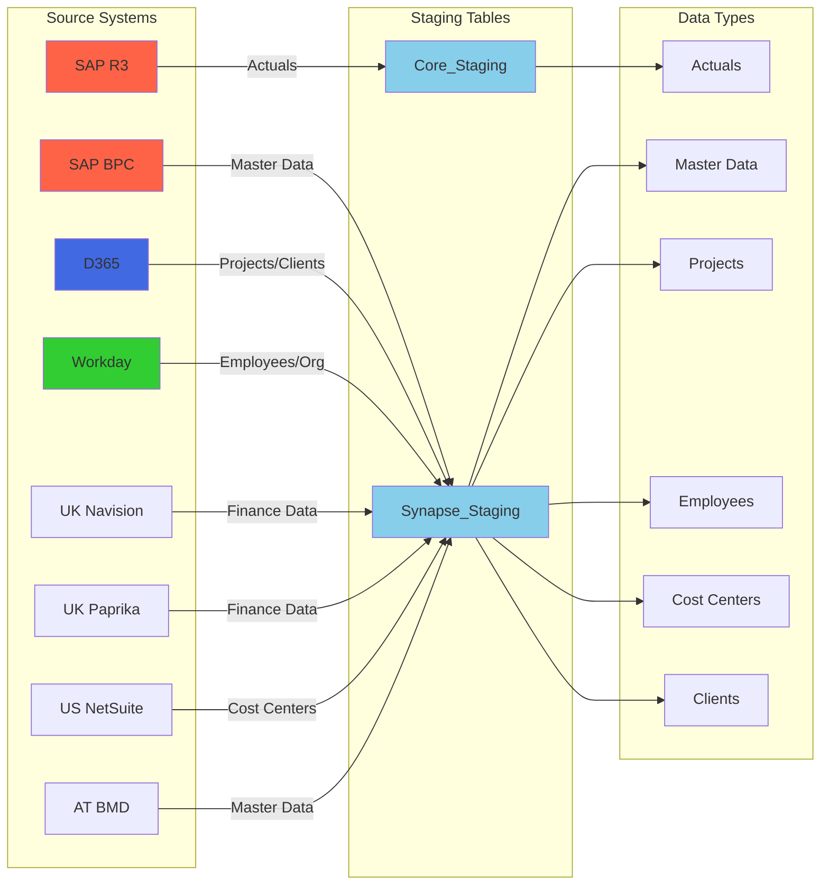
```mermaid
graph LR
    subgraph "Source Systems"
        S1[SAP R3]
        S2[SAP BPC]
        S3[D365]
        S4[Workday]
        S5[UK Navision]
        S6[UK Paprika]
        S7[US NetSuite]
        S8[AT BMD]
    end
    
    subgraph "Data Types"
        D1[Actuals]
        D2[Master Data]
        D3[Projects]
        D4[Employees]
        D5[Cost Centers]
        D6[Clients]
    end
    
    subgraph "Staging Tables"
        ST1[Core_Staging]
        ST2[Synapse_Staging]
    end
    
    S1 -->|Actuals| ST1
    S2 -->|Master Data| ST2
    S3 -->|Projects/Clients| ST2
    S4 -->|Employees/Org| ST2
    S5 -->|Finance Data| ST2
    S6 -->|Finance Data| ST2
    S7 -->|Cost Centers| ST2
    S8 -->|Master Data| ST2
    
    ST1 --> D1
    ST2 --> D2
    ST2 --> D3
    ST2 --> D4
    ST2 --> D5
    ST2 --> D6
    
    style S1 fill:#FF6347
    style S2 fill:#FF6347
    style S3 fill:#4169E1
    style S4 fill:#32CD32
    style ST1 fill:#87CEEB
    style ST2 fill:#87CEEB
```

### Enhancement Pattern Architecture

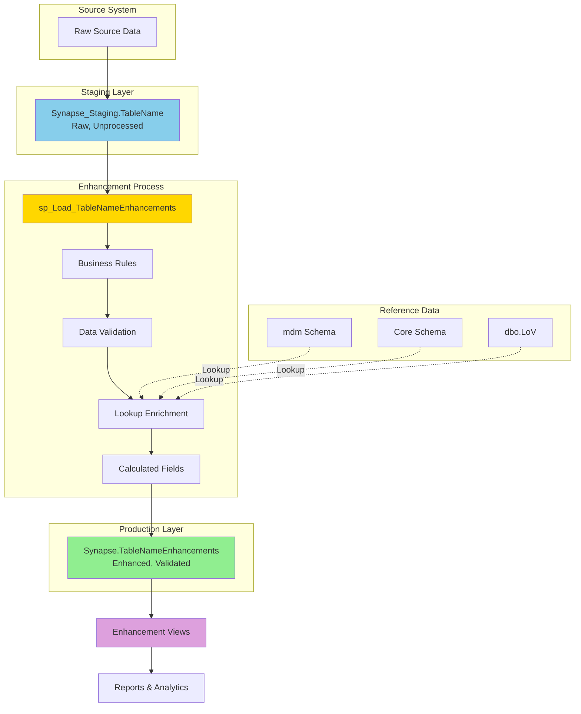
```mermaid
flowchart TB
    subgraph "Source System"
        Source[Raw Source Data]
    end
    
    subgraph "Staging Layer"
        Stage[Synapse_Staging.TableName<br/>Raw, Unprocessed]
    end
    
    subgraph "Enhancement Process"
        SP[sp_Load_TableNameEnhancements]
        Logic1[Business Rules]
        Logic2[Data Validation]
        Logic3[Lookup Enrichment]
        Logic4[Calculated Fields]
    end
    
    subgraph "Production Layer"
        Prod[Synapse.TableNameEnhancements<br/>Enhanced, Validated]
    end
    
    subgraph "Reference Data"
        MDM[mdm Schema]
        Core[Core Schema]
        LoV[dbo.LoV]
    end
    
    Source --> Stage
    Stage --> SP
    SP --> Logic1
    Logic1 --> Logic2
    Logic2 --> Logic3
    Logic3 --> Logic4
    
    MDM -.->|Lookup| Logic3
    Core -.->|Lookup| Logic3
    LoV -.->|Lookup| Logic3
    
    Logic4 --> Prod
    Prod --> Views[Enhancement Views]
    Views --> Reports[Reports & Analytics]
    
    style Stage fill:#87CEEB
    style SP fill:#FFD700
    style Prod fill:#90EE90
    style Views fill:#DDA0DD
```

---

## 📊 Performance Architecture

### Query Optimization Strategy

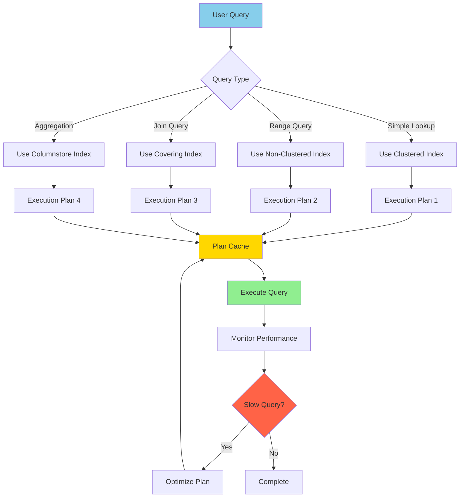
```mermaid
graph TD
    Query[User Query] --> Analyze{Query Type}
    
    Analyze -->|Simple Lookup| Index1[Use Clustered Index]
    Analyze -->|Range Query| Index2[Use Non-Clustered Index]
    Analyze -->|Join Query| Index3[Use Covering Index]
    Analyze -->|Aggregation| Index4[Use Columnstore Index]
    
    Index1 --> Plan1[Execution Plan 1]
    Index2 --> Plan2[Execution Plan 2]
    Index3 --> Plan3[Execution Plan 3]
    Index4 --> Plan4[Execution Plan 4]
    
    Plan1 --> Cache[Plan Cache]
    Plan2 --> Cache
    Plan3 --> Cache
    Plan4 --> Cache
    
    Cache --> Execute[Execute Query]
    Execute --> Monitor[Monitor Performance]
    
    Monitor --> Slow{Slow Query?}
    Slow -->|Yes| Optimize[Optimize Plan]
    Slow -->|No| Complete[Complete]
    Optimize --> Cache
    
    style Query fill:#87CEEB
    style Cache fill:#FFD700
    style Execute fill:#90EE90
    style Slow fill:#FF6347
```

### Index Strategy

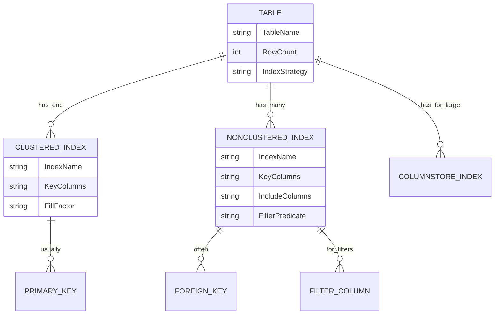
```mermaid
erDiagram
    TABLE ||--o{ CLUSTERED_INDEX : "has_one"
    TABLE ||--o{ NONCLUSTERED_INDEX : "has_many"
    TABLE ||--o{ COLUMNSTORE_INDEX : "has_for_large"
    
    CLUSTERED_INDEX ||--o{ PRIMARY_KEY : "usually"
    NONCLUSTERED_INDEX ||--o{ FOREIGN_KEY : "often"
    NONCLUSTERED_INDEX ||--o{ FILTER_COLUMN : "for_filters"
    
    TABLE {
        string TableName
        int RowCount
        string IndexStrategy
    }
    CLUSTERED_INDEX {
        string IndexName
        string KeyColumns
        string FillFactor
    }
    NONCLUSTERED_INDEX {
        string IndexName
        string KeyColumns
        string IncludeColumns
        string FilterPredicate
    }
```

### Partitioning Strategy

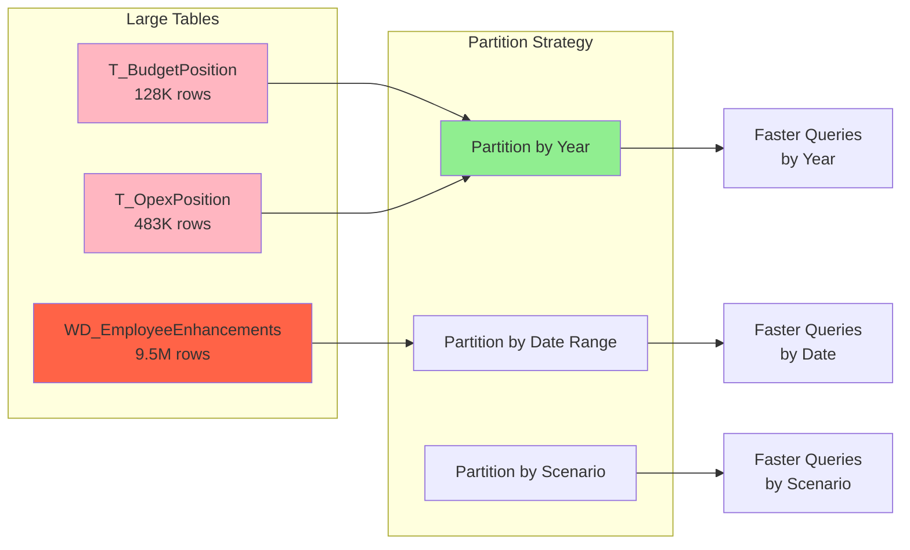
```mermaid
graph LR
    subgraph "Large Tables"
        T1[T_BudgetPosition<br/>128K rows]
        T2[T_OpexPosition<br/>483K rows]
        T3[WD_EmployeeEnhancements<br/>9.5M rows]
    end
    
    subgraph "Partition Strategy"
        P1[Partition by Year]
        P2[Partition by Scenario]
        P3[Partition by Date Range]
    end
    
    T1 --> P1
    T2 --> P1
    T3 --> P3
    
    P1 --> Benefit1[Faster Queries<br/>by Year]
    P2 --> Benefit2[Faster Queries<br/>by Scenario]
    P3 --> Benefit3[Faster Queries<br/>by Date]
    
    style T1 fill:#FFB6C1
    style T2 fill:#FFB6C1
    style T3 fill:#FF6347
    style P1 fill:#90EE90
```

---

## 🔗 System Dependencies

### Dependency Graph

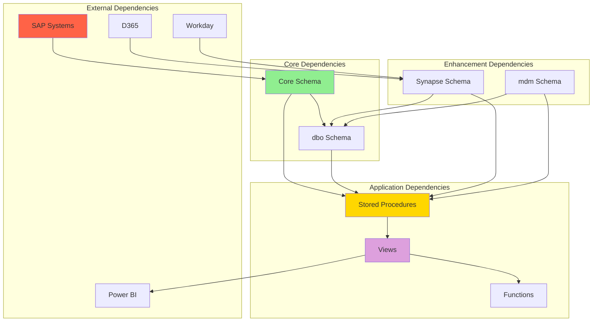
```mermaid
graph TB
    subgraph "External Dependencies"
        SAP[SAP Systems]
        D365[D365]
        WD[Workday]
        PBI[Power BI]
    end
    
    subgraph "Core Dependencies"
        Core[Core Schema]
        dbo[dbo Schema]
    end
    
    subgraph "Enhancement Dependencies"
        Synapse[Synapse Schema]
        MDM[mdm Schema]
    end
    
    subgraph "Application Dependencies"
        SP[Stored Procedures]
        Views[Views]
        Func[Functions]
    end
    
    SAP --> Core
    D365 --> Synapse
    WD --> Synapse
    
    Core --> dbo
    Synapse --> dbo
    MDM --> dbo
    
    Core --> SP
    dbo --> SP
    Synapse --> SP
    MDM --> SP
    
    SP --> Views
    Views --> Func
    Views --> PBI
    
    style SAP fill:#FF6347
    style Core fill:#90EE90
    style SP fill:#FFD700
    style Views fill:#DDA0DD
```

### Critical Path Analysis

```mermaid
gantt
    title Critical Data Flow Dependencies
    dateFormat X
    axisFormat %s
    
    section Source Systems
    SAP Extract           :0, 3600
    D365 Extract         :0, 3600
    Workday Extract      :0, 3600
    
    section Staging
    Core Staging Load    :3600, 1800
    Synapse Staging Load :3600, 1800
    
    section Core Processing
    Core MERGE           :5400, 900
    Enhancement MERGE    :5400, 1800
    
    section Operations
    Budget Creation      :7200, 3600
    OPEX Creation        :7200, 3600
    
    section Reporting
    View Refresh         :10800, 1800
    Power BI Refresh     :12600, 3600
```

---

## 🛡️ Data Quality & Governance

### Data Quality Framework

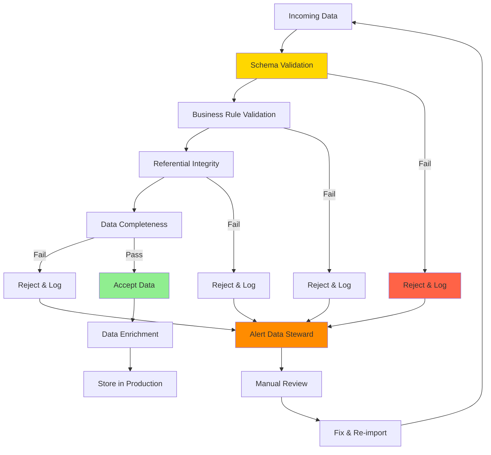
```mermaid
flowchart TD
    Data[Incoming Data] --> Validate1[Schema Validation]
    Validate1 --> Validate2[Business Rule Validation]
    Validate2 --> Validate3[Referential Integrity]
    Validate3 --> Validate4[Data Completeness]
    
    Validate1 -->|Fail| Reject1[Reject & Log]
    Validate2 -->|Fail| Reject2[Reject & Log]
    Validate3 -->|Fail| Reject3[Reject & Log]
    Validate4 -->|Fail| Reject4[Reject & Log]
    
    Validate4 -->|Pass| Accept[Accept Data]
    Accept --> Enrich[Data Enrichment]
    Enrich --> Store[Store in Production]
    
    Reject1 --> Alert[Alert Data Steward]
    Reject2 --> Alert
    Reject3 --> Alert
    Reject4 --> Alert
    
    Alert --> Review[Manual Review]
    Review --> Fix[Fix & Re-import]
    Fix --> Data
    
    style Validate1 fill:#FFD700
    style Accept fill:#90EE90
    style Reject1 fill:#FF6347
    style Alert fill:#FF8C00
```

### Change Tracking Architecture

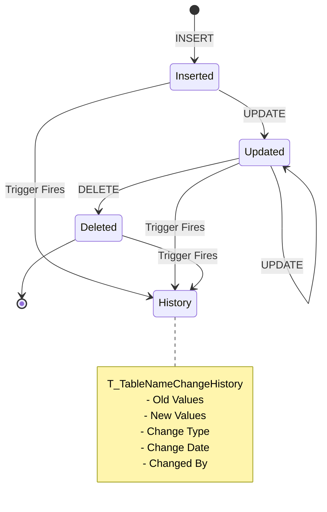
```mermaid
stateDiagram-v2
    [*] --> Inserted: INSERT
    Inserted --> Updated: UPDATE
    Updated --> Updated: UPDATE
    Updated --> Deleted: DELETE
    Deleted --> [*]
    
    Inserted --> History: Trigger Fires
    Updated --> History: Trigger Fires
    Deleted --> History: Trigger Fires
    
    note right of History
        T_TableNameChangeHistory
        - Old Values
        - New Values
        - Change Type
        - Change Date
        - Changed By
    end note
```

### Temporal Table Pattern

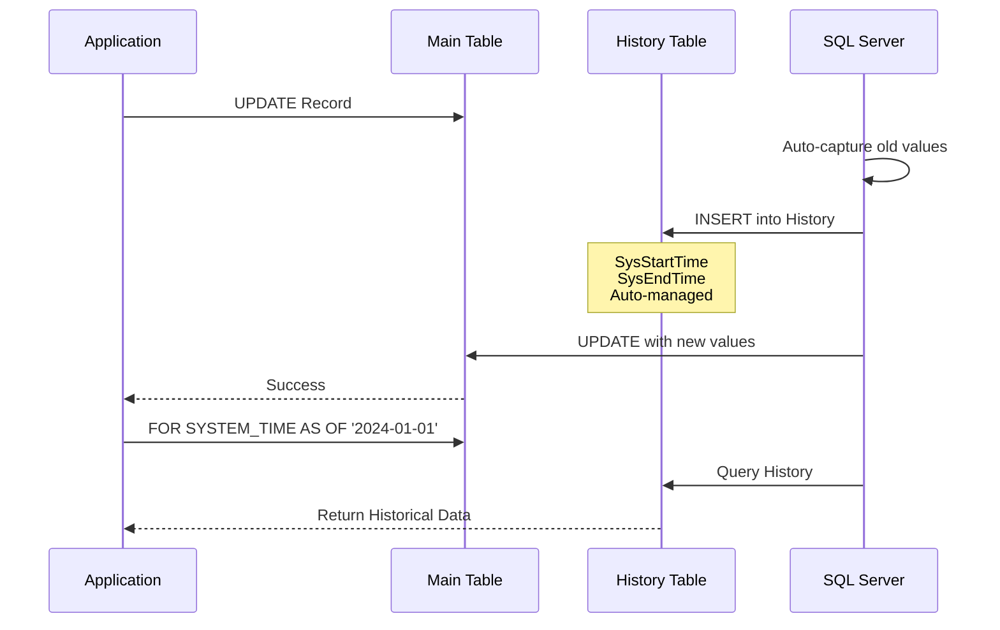
```mermaid
sequenceDiagram
    participant App as Application
    participant Main as Main Table
    participant Hist as History Table
    participant System as SQL Server
    
    App->>Main: UPDATE Record
    System->>System: Auto-capture old values
    System->>Hist: INSERT into History
    Note over Hist: SysStartTime<br/>SysEndTime<br/>Auto-managed
    System->>Main: UPDATE with new values
    Main-->>App: Success
    
    App->>Main: FOR SYSTEM_TIME AS OF '2024-01-01'
    System->>Hist: Query History
    Hist-->>App: Return Historical Data
```

---

## 🚀 Scalability & Optimization

### Scalability Strategy

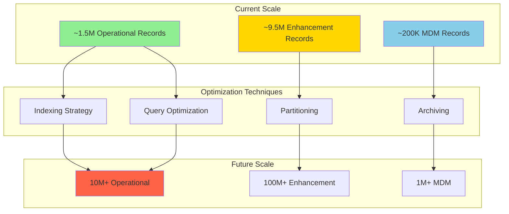
```mermaid
graph TB
    subgraph "Current Scale"
        C1[~1.5M Operational Records]
        C2[~9.5M Enhancement Records]
        C3[~200K MDM Records]
    end
    
    subgraph "Optimization Techniques"
        O1[Indexing Strategy]
        O2[Partitioning]
        O3[Archiving]
        O4[Query Optimization]
    end
    
    subgraph "Future Scale"
        F1[10M+ Operational]
        F2[100M+ Enhancement]
        F3[1M+ MDM]
    end
    
    C1 --> O1
    C2 --> O2
    C3 --> O3
    C1 --> O4
    
    O1 --> F1
    O2 --> F2
    O3 --> F3
    O4 --> F1
    
    style C1 fill:#90EE90
    style C2 fill:#FFD700
    style C3 fill:#87CEEB
    style F1 fill:#FF6347
```

### Caching Strategy

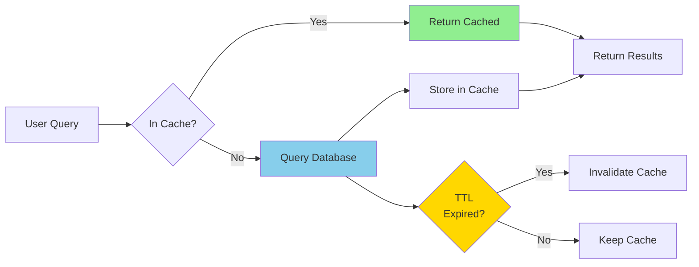
```mermaid
graph LR
    Query[User Query] --> Check{In Cache?}
    Check -->|Yes| Cache[Return Cached]
    Check -->|No| DB[Query Database]
    DB --> Store[Store in Cache]
    Store --> Return[Return Results]
    Cache --> Return
    
    DB --> TTL{TTL<br/>Expired?}
    TTL -->|Yes| Invalidate[Invalidate Cache]
    TTL -->|No| Keep[Keep Cache]
    
    style Cache fill:#90EE90
    style DB fill:#87CEEB
    style TTL fill:#FFD700
```

---

## 📈 Monitoring & Observability

### Monitoring Architecture

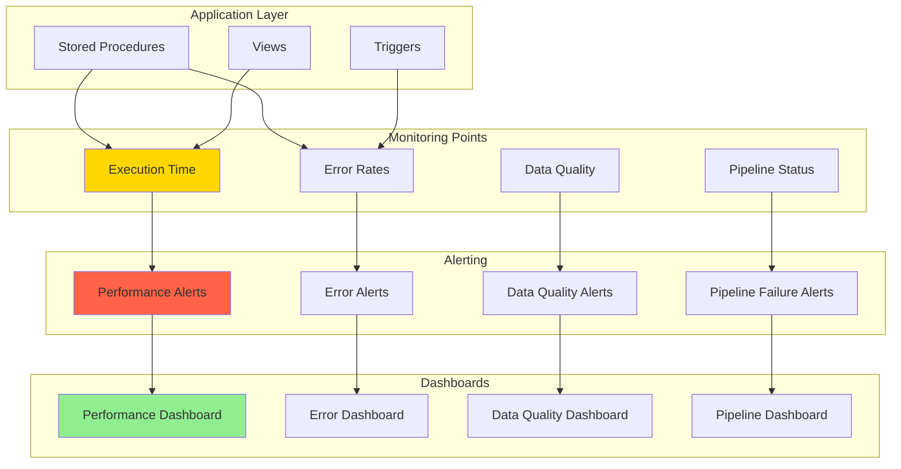
```mermaid
graph TB
    subgraph "Application Layer"
        SP[Stored Procedures]
        Views[Views]
        Triggers[Triggers]
    end
    
    subgraph "Monitoring Points"
        M1[Execution Time]
        M2[Error Rates]
        M3[Data Quality]
        M4[Pipeline Status]
    end
    
    subgraph "Alerting"
        A1[Performance Alerts]
        A2[Error Alerts]
        A3[Data Quality Alerts]
        A4[Pipeline Failure Alerts]
    end
    
    subgraph "Dashboards"
        D1[Performance Dashboard]
        D2[Error Dashboard]
        D3[Data Quality Dashboard]
        D4[Pipeline Dashboard]
    end
    
    SP --> M1
    SP --> M2
    Views --> M1
    Triggers --> M2
    
    M1 --> A1
    M2 --> A2
    M3 --> A3
    M4 --> A4
    
    A1 --> D1
    A2 --> D2
    A3 --> D3
    A4 --> D4
    
    style M1 fill:#FFD700
    style A1 fill:#FF6347
    style D1 fill:#90EE90
```

---

## 🎯 Best Practices & Patterns

### Development Patterns

```mermaid
graph TD
    Start[New Feature] --> Design[Design Phase]
    Design --> Review{Architecture<br/>Review}
    Review -->|Reject| Design
    Review -->|Approve| Implement[Implementation]
    
    Implement --> Test[Testing]
    Test --> Unit[Unit Tests]
    Test --> Integration[Integration Tests]
    Test --> Performance[Performance Tests]
    
    Unit --> Validate{All Pass?}
    Integration --> Validate
    Performance --> Validate
    
    Validate -->|Fail| Fix[Fix Issues]
    Fix --> Test
    Validate -->|Pass| Deploy[Deploy]
    
    Deploy --> Monitor[Monitor]
    Monitor --> Optimize[Optimize]
    
    style Design fill:#87CEEB
    style Review fill:#FFD700
    style Test fill:#90EE90
    style Deploy fill:#32CD32
```

### Code Review Checklist

- ✅ Follows ETL pattern (Staging → Core → Production)
- ✅ Implements proper error handling
- ✅ Includes change tracking
- ✅ Uses appropriate indexes
- ✅ Documents complex logic
- ✅ Tests with sample data
- ✅ Validates data quality
- ✅ Tracks pipeline execution

---

## 🔗 Integration Points Deep Dive

### API Integration Pattern

```mermaid
sequenceDiagram
    participant Client
    participant API as API Gateway
    participant Auth as Authentication
    participant SP as Stored Procedure
    participant DB as Database
    participant Cache as Cache Layer
    
    Client->>API: Request
    API->>Auth: Validate Token
    Auth-->>API: Authorized
    
    API->>Cache: Check Cache
    Cache-->>API: Cache Miss
    
    API->>SP: Execute Procedure
    SP->>DB: Query Data
    DB-->>SP: Return Results
    SP-->>API: Return Data
    
    API->>Cache: Store in Cache
    API-->>Client: Return Response
```

---

## 📝 Conclusion

This architecture supports:
- **Scalability**: Handles millions of records
- **Reliability**: Comprehensive error handling and monitoring
- **Security**: Multi-layer security model
- **Maintainability**: Clear patterns and documentation
- **Performance**: Optimized queries and indexing

**Key Architectural Principles**:
1. Staging → Core → Production pattern
2. Idempotent ETL operations (MERGE)
3. Comprehensive change tracking
4. Function-based security
5. View-based abstraction
6. Temporal tables for history

---

**For Questions or Architecture Decisions**: Refer to this guide and the dependency diagrams above.
