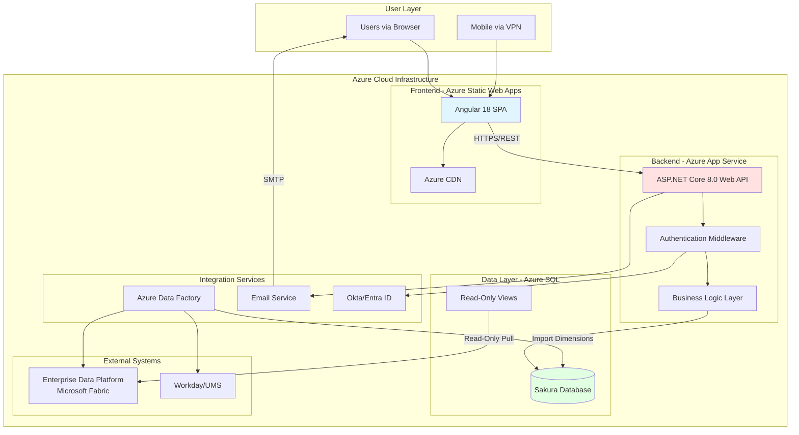
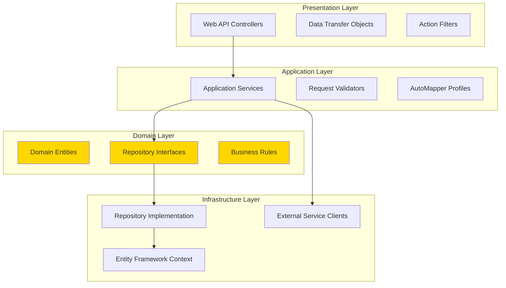
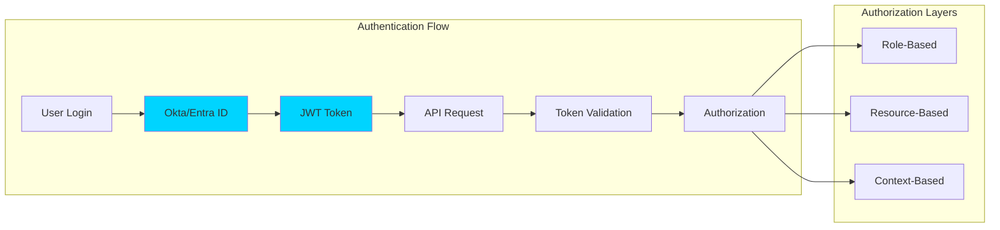
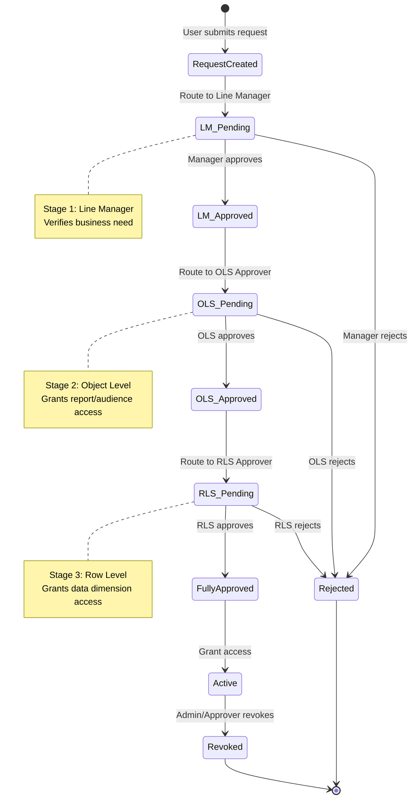
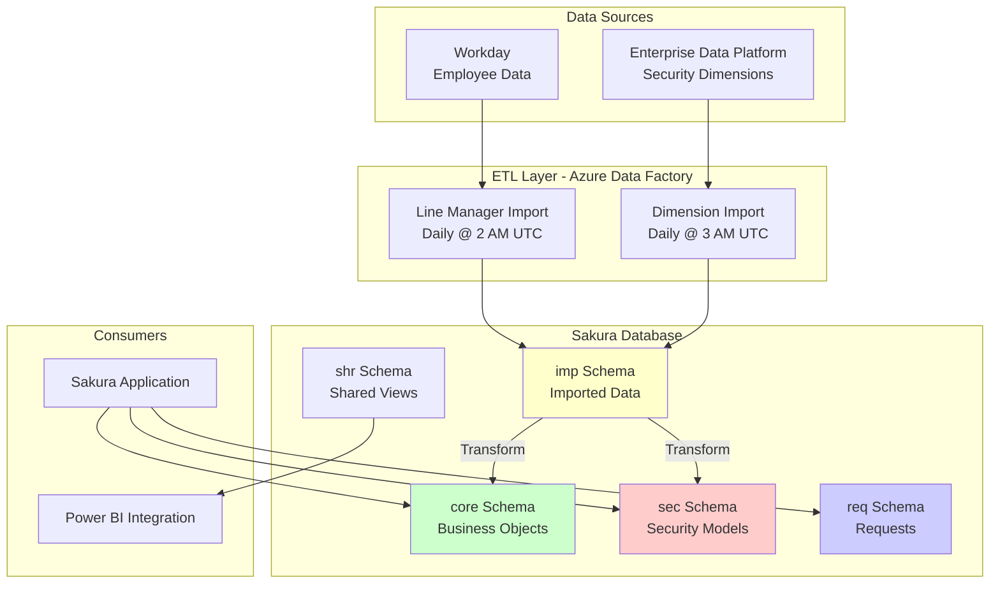
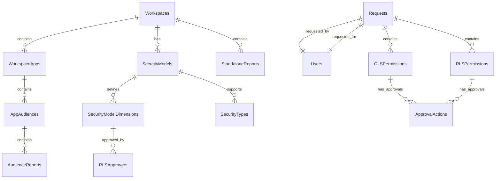
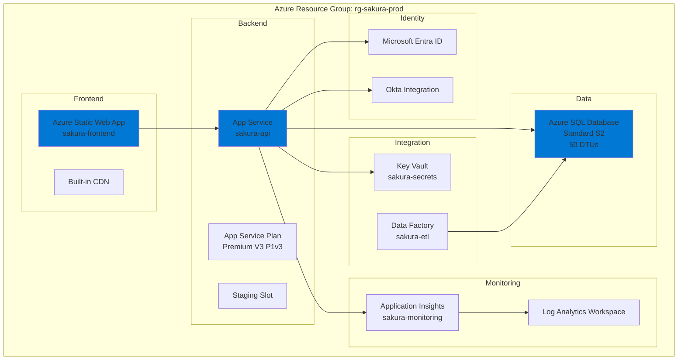
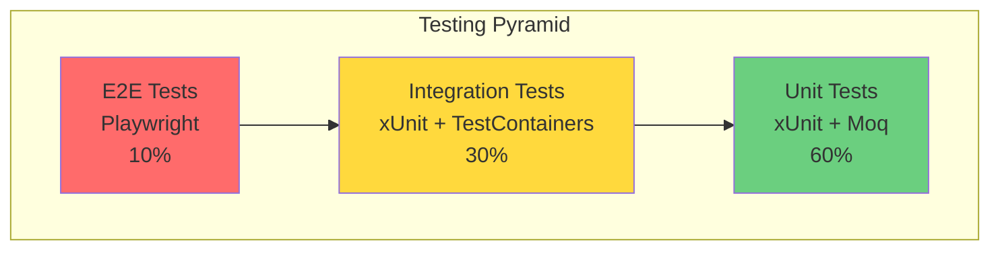
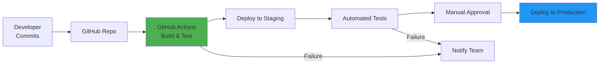

# Sakura V2 - Master Architecture Overview

> **Last Updated:** October 16, 2025  
> **Version:** 2.0  
> **Status:** Complete Technical Architecture

---

## 📑 Documentation Index

This is the master document that provides a high-level overview of the entire Sakura V2 system. For detailed implementation guidance, refer to these documents:

1. **[00-MASTER-ARCHITECTURE-OVERVIEW.md](./00-MASTER-ARCHITECTURE-OVERVIEW.md)** ← You are here
2. **[01-BACKEND-ARCHITECTURE.md](./01-BACKEND-ARCHITECTURE.md)** - .NET Core backend structure
3. **[02-API-DESIGN-COMPLETE.md](./02-API-DESIGN-COMPLETE.md)** - All endpoints and business logic
4. **[03-DATABASE-INTEGRATION.md](./03-DATABASE-INTEGRATION.md)** - Data access patterns
5. **[04-FRONTEND-INTEGRATION.md](./04-FRONTEND-INTEGRATION.md)** - Angular integration guide
6. **[05-DEPLOYMENT-AZURE.md](./05-DEPLOYMENT-AZURE.md)** - Azure deployment guide
7. **[06-SECURITY-AUTHENTICATION.md](./06-SECURITY-AUTHENTICATION.md)** - Security implementation

---

## 🎯 Executive Summary

**Sakura V2** is an enterprise-grade access request and approval management system built for dentsu's Power BI ecosystem. It manages both Object-Level Security (OLS) and Row-Level Security (RLS) through a three-tier approval workflow.

### Key Metrics
- **6 Workspaces** supported (EMEA, AMER, WFI, CDI, GI, FUM)
- **3-Stage Approval** workflow (Line Manager → OLS → RLS)
- **5 User Roles** (Requester, Approver, Workspace Admin, Support, Administrator)
- **8 Security Dimensions** (Entity, Client, Service Line, MSS, Cost Center, etc.)

---

## 🏗️ High-Level System Architecture



---

## 🎨 Technology Stack

### Frontend
```yaml
Framework: Angular 18.x
Language: TypeScript 5.x
Styling: Custom CSS + CSS Variables (Theme Support)
State Management: RxJS + Services
Build Tool: Angular CLI + esbuild
Deployment: Azure Static Web Apps
```

### Backend
```yaml
Framework: ASP.NET Core 8.0 Web API
Language: C# 12
Architecture: Clean Architecture (Onion)
Database: Azure SQL Database
ORM: Entity Framework Core 8.0
Authentication: Microsoft.Identity.Web (Okta/Entra)
Logging: Serilog
Caching: IMemoryCache / Redis (future)
API Documentation: Swagger/OpenAPI 3.0
```

### Infrastructure
```yaml
Cloud Provider: Microsoft Azure
Frontend Hosting: Azure Static Web Apps
Backend Hosting: Azure App Service (Linux)
Database: Azure SQL Database (S2 tier minimum)
ETL: Azure Data Factory
Identity: Okta + Microsoft Entra ID
Email: SMTP Relay (Azure-based)
Monitoring: Azure Application Insights
```

---

## 📐 Architectural Patterns

### Backend Architecture Pattern: Clean Architecture (Onion)



### Key Principles

1. **Dependency Inversion**: Core domain depends on abstractions, not implementations
2. **Single Responsibility**: Each service handles one business capability
3. **Interface Segregation**: Small, focused repository interfaces
4. **Separation of Concerns**: Clear boundaries between layers

---

## 🔐 Security Architecture



### Security Layers

1. **Network Security**
   - VPN required for remote access
   - HTTPS/TLS 1.2+ only
   - Azure Front Door with WAF (optional)

2. **Authentication**
   - SSO via Okta + Microsoft Entra ID
   - JWT bearer tokens
   - Token expiry: 1 hour (configurable)

3. **Authorization**
   - Role-based access control (RBAC)
   - Resource-level permissions
   - Context-aware security (workspace-scoped)

4. **Data Security**
   - SQL injection prevention (parameterized queries)
   - Input validation at all layers
   - Audit logging for all actions
   - Encryption at rest (Azure SQL TDE)
   - Encryption in transit (TLS)

---

## 🔄 Request Approval Workflow



---

## 📊 Data Flow Architecture



---

## 🗄️ Database Schema Overview

The database uses **7 schemas** for logical separation:

| Schema | Purpose | Key Tables |
|--------|---------|-----------|
| **core** | Domain objects | Users, Workspaces, Apps, Audiences, Reports |
| **sec** | Security models | SecurityModels, Dimensions, Approvers |
| **req** | Request management | Requests, OLSPermissions, RLSPermissions |
| **admin** | System configuration | Settings, EmailTemplates, HelpContent |
| **log** | Audit trails | AuditLogs, ChangeHistory |
| **imp** | External imports | LineManager, DimEntity, DimClient, etc. |
| **shr** | Data sharing | vw_OLSPermissions, vw_RLSPermissions |

### Entity Relationship Diagram (Simplified)



---

## 🚀 API Architecture

### RESTful API Design Principles

1. **Resource-Based URLs**: `/api/v1/workspaces/{id}/apps`
2. **HTTP Verbs**: GET (read), POST (create), PUT (update), DELETE (soft delete)
3. **Status Codes**: 200 (OK), 201 (Created), 400 (Bad Request), 401 (Unauthorized), 403 (Forbidden), 404 (Not Found), 500 (Server Error)
4. **Versioning**: URL-based versioning (`/api/v1/`)
5. **Pagination**: Query parameters (`?page=1&pageSize=20`)
6. **Filtering**: Query parameters (`?workspaceId=5&isActive=true`)
7. **Sorting**: Query parameter (`?sortBy=createdAt&sortOrder=desc`)

### API Structure

```
api/
├── v1/
│   ├── auth/
│   │   ├── login
│   │   └── refresh
│   ├── users/
│   │   ├── me
│   │   ├── {id}
│   │   └── search
│   ├── workspaces/
│   │   ├── GET    /               (List all)
│   │   ├── GET    /{id}           (Get one)
│   │   ├── POST   /               (Create)
│   │   ├── PUT    /{id}           (Update)
│   │   ├── DELETE /{id}           (Soft delete)
│   │   └── GET    /{id}/apps      (Nested resources)
│   ├── requests/
│   │   ├── POST   /               (Create request)
│   │   ├── GET    /my-requests    (User's requests)
│   │   ├── GET    /my-approvals   (User's pending approvals)
│   │   └── POST   /{id}/approve   (Approve)
│   ├── catalogue/
│   │   ├── GET    /search         (Search reports/audiences)
│   │   └── GET    /{itemId}       (Item details)
│   └── approvers/
│       ├── GET    /               (List approvers)
│       └── POST   /               (Assign approver)
```

---

## 🎭 User Roles & Permissions Matrix

| Capability | Requester | Approver | Workspace Admin | Support | Administrator |
|------------|-----------|----------|-----------------|---------|---------------|
| Request access for self | ✅ | ✅ | ✅ | ❌ | ✅ |
| Request on behalf | ✅ | ✅ | ✅ | ❌ | ✅ |
| View own access | ✅ | ✅ | ✅ | ✅ | ✅ |
| Approve requests | ❌ | ✅ | ❌ | ❌ | ❌ |
| Manage approvers | ❌ | ❌ | ✅ (WS scope) | ❌ | ✅ (Global) |
| Manage security models | ❌ | ❌ | ✅ (WS scope) | ❌ | ✅ (Global) |
| Revoke access | ❌ | ✅ (own scope) | ✅ (WS scope) | ❌ | ✅ (Global) |
| View all requests | ❌ | ❌ | ❌ | ✅ (Read-only) | ✅ |
| Configure system | ❌ | ❌ | ❌ | ❌ | ✅ |
| Delegation | ❌ | ✅ | ❌ | ❌ | ❌ |

---

## 📦 Deployment Architecture (Azure)



### Resource Naming Convention

```
{service}-{app}-{environment}-{region}

Examples:
- swa-sakura-prod-eastus
- app-sakura-api-prod-eastus
- sql-sakura-prod-eastus
- kv-sakura-prod-eastus
- ai-sakura-prod-eastus
```

### Estimated Monthly Costs

| Service | Tier | Est. Cost (USD/month) |
|---------|------|----------------------|
| Azure Static Web Apps | Standard | $9 |
| App Service Plan P1v3 | Premium | $146 |
| Azure SQL Database S2 | Standard | $150 |
| Azure Data Factory | Pay-per-use | $20-50 |
| Application Insights | Pay-per-GB | $15-30 |
| Key Vault | Standard | $1 |
| **Total** | | **~$350-400** |

---

## 🔧 Development Environment Setup

### Prerequisites

```yaml
Required Software:
  - Node.js: 20.x LTS
  - Angular CLI: 18.x
  - .NET SDK: 8.0
  - SQL Server: 2022 or Azure SQL
  - Visual Studio Code or Visual Studio 2022
  - Git: 2.x
  - Azure CLI: 2.x (for deployment)

Recommended Extensions (VS Code):
  - Angular Language Service
  - C# Dev Kit
  - REST Client
  - GitLens
  - Docker
```

### Local Development URLs

```
Frontend: http://localhost:4200
Backend API: https://localhost:5001
Swagger UI: https://localhost:5001/swagger
SQL Server: localhost,1433
```

---

## 🧪 Testing Strategy



### Test Coverage Targets

- **Unit Tests**: 80% code coverage minimum
- **Integration Tests**: All API endpoints
- **E2E Tests**: Critical user journeys
  - Request submission flow
  - Approval flow (3 stages)
  - Admin configuration
  - Report catalogue search

---

## 📈 Performance Requirements

| Metric | Target | Measured By |
|--------|--------|-------------|
| API Response Time (p95) | < 500ms | Application Insights |
| Page Load Time | < 2s | Lighthouse |
| Database Query Time | < 200ms | SQL Query Store |
| Concurrent Users | 500+ | Load Testing |
| Request Throughput | 100 req/sec | Load Testing |
| Availability | 99.5% | Azure Monitor |

---

## 🔄 CI/CD Pipeline



---

## 📋 Non-Functional Requirements

### Scalability
- Horizontal scaling via Azure App Service instances
- Database connection pooling
- Caching strategy (memory cache → Redis for multi-instance)

### Reliability
- Health check endpoints
- Graceful degradation
- Circuit breaker pattern for external services
- Retry policies with exponential backoff

### Maintainability
- Clean code principles
- SOLID design patterns
- Comprehensive documentation
- Code reviews required

### Observability
- Structured logging (Serilog)
- Distributed tracing (Application Insights)
- Custom metrics
- Alerting for critical errors

---

## 🚦 System Boundaries

### In Scope ✅
- Access request submission and approval
- OLS and RLS permission management
- Multi-tier approval workflow
- Delegation functionality
- Audit logging
- Email notifications
- Report catalogue
- Workspace administration

### Out of Scope ❌
- Direct Power BI integration (consumption only)
- User provisioning in Azure AD
- Security dimension data creation
- Shopping cart experience (bulk requests)
- Mobile-first responsive design
- Offline mode
- Real-time notifications (email-based only)

---

## 📚 Key Design Decisions

### 1. Why Clean Architecture?
- **Testability**: Easy to unit test business logic
- **Flexibility**: Easy to swap infrastructure components
- **Maintainability**: Clear separation of concerns

### 2. Why Azure Static Web Apps for Frontend?
- **Cost-effective**: Free tier includes global CDN
- **Simple deployment**: Git-based deployment
- **Built-in features**: Custom domains, SSL, staging environments

### 3. Why Azure SQL over Cosmos DB?
- **Relational data**: Strong relationships between entities
- **ACID compliance**: Critical for approval workflows
- **Reporting**: Complex queries and joins
- **Existing expertise**: Team familiarity

### 4. Why Email over In-App Notifications?
- **Phase 1 simplicity**: Avoid real-time infrastructure
- **Email reliability**: Established delivery mechanism
- **Audit trail**: Emails serve as records
- **Future enhancement**: In-app notifications in roadmap

---

## 🗺️ Implementation Roadmap

### Phase 1: Foundation (Weeks 1-4)
- [ ] Database schema implementation
- [ ] Backend project structure
- [ ] Authentication & authorization
- [ ] Core domain entities
- [ ] Basic CRUD APIs

### Phase 2: Core Features (Weeks 5-10)
- [ ] Request submission wizard (frontend)
- [ ] Approval workflow engine
- [ ] Email notification service
- [ ] Catalogue search
- [ ] User access views

### Phase 3: Administration (Weeks 11-14)
- [ ] Workspace admin console
- [ ] Security model management
- [ ] Approver assignment
- [ ] Audit log viewer

### Phase 4: Polish & Deploy (Weeks 15-16)
- [ ] Performance optimization
- [ ] Security audit
- [ ] Load testing
- [ ] Documentation completion
- [ ] Production deployment

---

## 📞 Support & Escalation

### Development Team Contacts
- **Technical Lead**: [TBD]
- **Backend Lead**: [TBD]
- **Frontend Lead**: [TBD]
- **Database Admin**: [TBD]

### Escalation Path
1. **L1**: End-user support (via GoTo ticketing system)
2. **L2**: Sakura Support role (read-only troubleshooting)
3. **L3**: Development team (code fixes, configuration)

---

## 🔗 Related Documentation

- [Database Design Guide](../FE/application/db-design.md)
- [Functional Design Document](../fdd.pdf)
- [API Documentation](http://localhost:5001/swagger) (development)
- [Deployment Runbook](./05-DEPLOYMENT-AZURE.md)

---

## ✅ Next Steps

1. **Read the detailed documents** in order:
   - Start with [01-BACKEND-ARCHITECTURE.md](./01-BACKEND-ARCHITECTURE.md)
   - Then [02-API-DESIGN-COMPLETE.md](./02-API-DESIGN-COMPLETE.md)
   - Continue through the numbered documents

2. **Set up local development environment**
   - Follow the setup guide in each tech-specific doc

3. **Review database schema**
   - Study the [db-design.md](../FE/application/db-design.md)

4. **Start with backend foundation**
   - Implement core entities
   - Set up EF Core context
   - Build repository pattern

---

**Document Status**: ✅ Complete  
**Last Review**: October 16, 2025  
**Next Review**: As needed during implementation

