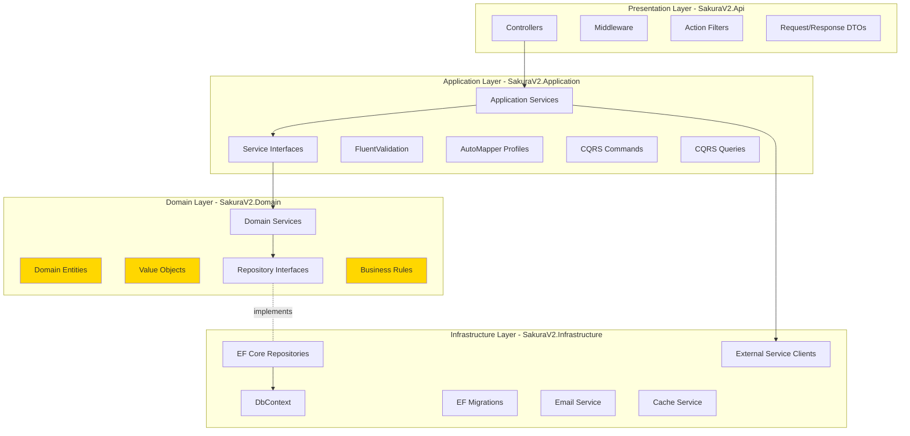

# Sakura V2 - Backend Architecture

> **Technology**: ASP.NET Core 8.0 Web API  
> **Pattern**: Clean Architecture (Onion Architecture)  
> **Language**: C# 12  
> **Database**: Azure SQL via Entity Framework Core 8

---

## 📑 Table of Contents

1. [Architecture Overview](#architecture-overview)
2. [Project Structure](#project-structure)
3. [Layer Responsibilities](#layer-responsibilities)
4. [Domain Layer](#domain-layer)
5. [Application Layer](#application-layer)
6. [Infrastructure Layer](#infrastructure-layer)
7. [Presentation Layer](#presentation-layer)
8. [Cross-Cutting Concerns](#cross-cutting-concerns)
9. [Dependency Injection](#dependency-injection)
10. [Configuration Management](#configuration-management)

---

## 🏗️ Architecture Overview

### Clean Architecture Diagram



### Key Principles

1. **Dependency Rule**: Dependencies point inward. Core domain has no dependencies on outer layers.
2. **Separation of Concerns**: Each layer has a single, well-defined purpose.
3. **Testability**: Business logic is isolated and easily testable.
4. **Flexibility**: Infrastructure can be swapped without affecting business logic.

---

## 📁 Project Structure

```
SakuraV2/
├── src/
│   ├── SakuraV2.Domain/                      # Core business logic (NO dependencies)
│   │   ├── Entities/
│   │   │   ├── Users/
│   │   │   │   ├── User.cs
│   │   │   │   └── LineManager.cs
│   │   │   ├── Workspaces/
│   │   │   │   ├── Workspace.cs
│   │   │   │   ├── WorkspaceApp.cs
│   │   │   │   ├── AppAudience.cs
│   │   │   │   └── Report.cs
│   │   │   ├── Security/
│   │   │   │   ├── SecurityModel.cs
│   │   │   │   ├── SecurityDimension.cs
│   │   │   │   ├── SecurityType.cs
│   │   │   │   └── Approver.cs
│   │   │   ├── Requests/
│   │   │   │   ├── Request.cs
│   │   │   │   ├── OLSPermission.cs
│   │   │   │   ├── RLSPermission.cs
│   │   │   │   └── ApprovalAction.cs
│   │   │   └── Admin/
│   │   │       ├── Setting.cs
│   │   │       ├── EmailTemplate.cs
│   │   │       └── HelpContent.cs
│   │   ├── ValueObjects/
│   │   │   ├── UserPrincipalName.cs
│   │   │   ├── EmailAddress.cs
│   │   │   └── AuditInfo.cs
│   │   ├── Interfaces/
│   │   │   ├── Repositories/
│   │   │   │   ├── IUserRepository.cs
│   │   │   │   ├── IWorkspaceRepository.cs
│   │   │   │   ├── IRequestRepository.cs
│   │   │   │   └── ISecurityRepository.cs
│   │   │   └── Services/
│   │   │       ├── IEmailService.cs
│   │   │       ├── ICacheService.cs
│   │   │       └── IAuditService.cs
│   │   ├── Enums/
│   │   │   ├── ApprovalStage.cs
│   │   │   ├── DecisionType.cs
│   │   │   ├── CatalogItemType.cs
│   │   │   └── UserRole.cs
│   │   ├── Exceptions/
│   │   │   ├── DomainException.cs
│   │   │   ├── NotFoundException.cs
│   │   │   ├── ValidationException.cs
│   │   │   └── UnauthorizedException.cs
│   │   └── Constants/
│   │       ├── SchemaNames.cs
│   │       ├── TableNames.cs
│   │       └── ApprovalStages.cs
│   │
│   ├── SakuraV2.Application/                 # Use cases and business workflows
│   │   ├── Services/
│   │   │   ├── Requests/
│   │   │   │   ├── IRequestService.cs
│   │   │   │   ├── RequestService.cs
│   │   │   │   ├── IApprovalService.cs
│   │   │   │   └── ApprovalService.cs
│   │   │   ├── Workspaces/
│   │   │   │   ├── IWorkspaceService.cs
│   │   │   │   ├── WorkspaceService.cs
│   │   │   │   ├── IAppService.cs
│   │   │   │   └── AppService.cs
│   │   │   ├── Security/
│   │   │   │   ├── ISecurityModelService.cs
│   │   │   │   ├── SecurityModelService.cs
│   │   │   │   ├── IApproverService.cs
│   │   │   │   └── ApproverService.cs
│   │   │   ├── Catalogue/
│   │   │   │   ├── ICatalogueService.cs
│   │   │   │   └── CatalogueService.cs
│   │   │   └── Admin/
│   │   │       ├── IAdminService.cs
│   │   │       └── AdminService.cs
│   │   ├── DTOs/
│   │   │   ├── Requests/
│   │   │   │   ├── CreateRequestDto.cs
│   │   │   │   ├── RequestDetailDto.cs
│   │   │   │   ├── ApprovalActionDto.cs
│   │   │   │   └── MyRequestsDto.cs
│   │   │   ├── Workspaces/
│   │   │   │   ├── WorkspaceDto.cs
│   │   │   │   ├── AppDto.cs
│   │   │   │   └── AudienceDto.cs
│   │   │   ├── Security/
│   │   │   │   ├── SecurityModelDto.cs
│   │   │   │   ├── DimensionDto.cs
│   │   │   │   └── ApproverDto.cs
│   │   │   ├── Users/
│   │   │   │   ├── UserDto.cs
│   │   │   │   └── UserProfileDto.cs
│   │   │   └── Common/
│   │   │       ├── PagedResultDto.cs
│   │   │       └── ResultDto.cs
│   │   ├── Mapping/
│   │   │   ├── RequestProfile.cs
│   │   │   ├── WorkspaceProfile.cs
│   │   │   ├── SecurityProfile.cs
│   │   │   └── UserProfile.cs
│   │   ├── Validators/
│   │   │   ├── CreateRequestValidator.cs
│   │   │   ├── ApprovalActionValidator.cs
│   │   │   └── WorkspaceValidator.cs
│   │   ├── Behaviors/
│   │   │   ├── ValidationBehavior.cs
│   │   │   ├── LoggingBehavior.cs
│   │   │   └── PerformanceBehavior.cs
│   │   └── Extensions/
│   │       └── ApplicationServiceExtensions.cs
│   │
│   ├── SakuraV2.Infrastructure/              # External concerns (DB, Email, etc.)
│   │   ├── Persistence/
│   │   │   ├── SakuraDbContext.cs
│   │   │   ├── Configurations/
│   │   │   │   ├── UserConfiguration.cs
│   │   │   │   ├── WorkspaceConfiguration.cs
│   │   │   │   ├── RequestConfiguration.cs
│   │   │   │   └── SecurityConfiguration.cs
│   │   │   ├── Repositories/
│   │   │   │   ├── GenericRepository.cs
│   │   │   │   ├── UserRepository.cs
│   │   │   │   ├── WorkspaceRepository.cs
│   │   │   │   ├── RequestRepository.cs
│   │   │   │   └── SecurityRepository.cs
│   │   │   ├── Migrations/
│   │   │   │   └── [EF Generated Files]
│   │   │   └── Seeds/
│   │   │       ├── LoVSeeder.cs
│   │   │       └── TestDataSeeder.cs
│   │   ├── Services/
│   │   │   ├── EmailService.cs
│   │   │   ├── CacheService.cs
│   │   │   ├── AuditService.cs
│   │   │   └── ExcelExportService.cs
│   │   ├── ExternalAPIs/
│   │   │   ├── OktaClient.cs
│   │   │   └── WorkdayClient.cs
│   │   └── Extensions/
│   │       └── InfrastructureServiceExtensions.cs
│   │
│   └── SakuraV2.Api/                         # Web API entry point
│       ├── Controllers/
│       │   ├── V1/
│       │   │   ├── AuthController.cs
│       │   │   ├── UsersController.cs
│       │   │   ├── WorkspacesController.cs
│       │   │   ├── RequestsController.cs
│       │   │   ├── ApprovalsController.cs
│       │   │   ├── CatalogueController.cs
│       │   │   ├── SecurityController.cs
│       │   │   └── AdminController.cs
│       │   └── BaseApiController.cs
│       ├── Middleware/
│       │   ├── ErrorHandlingMiddleware.cs
│       │   ├── RequestLoggingMiddleware.cs
│       │   └── PerformanceMonitoringMiddleware.cs
│       ├── Filters/
│       │   ├── ValidateModelAttribute.cs
│       │   ├── AuthorizationFilter.cs
│       │   └── AuditActionFilter.cs
│       ├── Extensions/
│       │   ├── WebApplicationExtensions.cs
│       │   └── SwaggerExtensions.cs
│       ├── Program.cs
│       ├── appsettings.json
│       ├── appsettings.Development.json
│       └── appsettings.Production.json
│
└── tests/
    ├── SakuraV2.Domain.Tests/
    │   ├── Entities/
    │   └── BusinessRules/
    ├── SakuraV2.Application.Tests/
    │   ├── Services/
    │   └── Validators/
    ├── SakuraV2.Infrastructure.Tests/
    │   └── Repositories/
    └── SakuraV2.Api.Tests/
        ├── Integration/
        └── Controllers/
```

---

## 🎯 Layer Responsibilities

### Domain Layer (SakuraV2.Domain)

**Purpose**: Contains the core business logic and rules. This is the heart of the application.

**Characteristics**:
- ✅ NO dependencies on other layers
- ✅ Pure C# classes
- ✅ Business rules and validation
- ✅ Defines repository interfaces (doesn't implement)
- ❌ No database concerns
- ❌ No external service calls
- ❌ No UI concerns

**Key Components**:
- **Entities**: Business objects with identity (User, Workspace, Request)
- **Value Objects**: Immutable objects without identity (Email, UPN)
- **Domain Services**: Business logic that doesn't belong to a single entity
- **Repository Interfaces**: Contracts for data access
- **Enums**: Domain-specific enumerations
- **Exceptions**: Custom business exceptions

---

### Application Layer (SakuraV2.Application)

**Purpose**: Orchestrates business workflows and use cases. Coordinates domain objects and infrastructure.

**Characteristics**:
- ✅ Depends on Domain layer
- ✅ Implements use cases
- ✅ Defines DTOs for data transfer
- ✅ Handles validation
- ✅ Manages transactions
- ❌ No direct database access (uses repositories)
- ❌ No HTTP concerns

**Key Components**:
- **Application Services**: Implement use cases (CreateRequestService)
- **DTOs**: Data Transfer Objects for API communication
- **Validators**: FluentValidation rules
- **Mappers**: AutoMapper profiles
- **Interfaces**: Service contracts

**Example Service**:
```csharp
public interface IRequestService
{
    Task<RequestDetailDto> CreateRequestAsync(CreateRequestDto dto, string currentUserUpn);
    Task<PagedResultDto<MyRequestsDto>> GetMyRequestsAsync(string userUpn, int page, int pageSize);
    Task<RequestDetailDto> GetRequestByIdAsync(long requestId, string currentUserUpn);
}
```

---

### Infrastructure Layer (SakuraV2.Infrastructure)

**Purpose**: Implements technical concerns like database access, external APIs, email, caching.

**Characteristics**:
- ✅ Depends on Domain layer (implements interfaces)
- ✅ Implements repository interfaces
- ✅ Contains EF Core DbContext
- ✅ External service integrations
- ✅ Technical services (email, cache)
- ❌ No business logic
- ❌ No HTTP concerns

**Key Components**:
- **DbContext**: Entity Framework Core database context
- **Repositories**: Concrete implementations of repository interfaces
- **Configurations**: EF Core entity configurations
- **Migrations**: Database schema migrations
- **External Services**: Okta client, Workday client, email service

**Example Repository**:
```csharp
public class RequestRepository : GenericRepository<Request>, IRequestRepository
{
    public RequestRepository(SakuraDbContext context) : base(context) { }

    public async Task<IEnumerable<Request>> GetUserRequestsAsync(string userUpn)
    {
        return await _context.Requests
            .Where(r => r.RequestedByUPN == userUpn || r.RequestedForUPN == userUpn)
            .Include(r => r.OLSPermissions)
            .Include(r => r.RLSPermissions)
            .OrderByDescending(r => r.CreatedAt)
            .ToListAsync();
    }
}
```

---

### Presentation Layer (SakuraV2.Api)

**Purpose**: HTTP API entry point. Handles requests, responses, authentication, authorization.

**Characteristics**:
- ✅ Depends on Application layer
- ✅ HTTP-specific concerns
- ✅ Authentication & authorization
- ✅ Request/response handling
- ✅ API versioning
- ✅ Swagger documentation
- ❌ No business logic
- ❌ No direct database access

**Key Components**:
- **Controllers**: HTTP endpoints
- **Middleware**: Request pipeline components
- **Filters**: Cross-cutting concerns
- **Program.cs**: Application startup and configuration

**Example Controller**:
```csharp
[ApiController]
[ApiVersion("1.0")]
[Route("api/v{version:apiVersion}/[controller]")]
[Authorize]
public class RequestsController : BaseApiController
{
    private readonly IRequestService _requestService;

    public RequestsController(IRequestService requestService)
    {
        _requestService = requestService;
    }

    [HttpPost]
    [ProducesResponseType(typeof(RequestDetailDto), StatusCodes.Status201Created)]
    [ProducesResponseType(StatusCodes.Status400BadRequest)]
    public async Task<IActionResult> CreateRequest([FromBody] CreateRequestDto dto)
    {
        var userUpn = User.GetUserPrincipalName();
        var result = await _requestService.CreateRequestAsync(dto, userUpn);
        return CreatedAtAction(nameof(GetRequest), new { id = result.RequestId }, result);
    }

    [HttpGet("{id}")]
    [ProducesResponseType(typeof(RequestDetailDto), StatusCodes.Status200OK)]
    [ProducesResponseType(StatusCodes.Status404NotFound)]
    public async Task<IActionResult> GetRequest(long id)
    {
        var userUpn = User.GetUserPrincipalName();
        var result = await _requestService.GetRequestByIdAsync(id, userUpn);
        return Ok(result);
    }
}
```

---

## 🎭 Domain Layer Deep Dive

### Entity Base Class

All entities inherit from a base entity class:

```csharp
namespace SakuraV2.Domain.Entities;

public abstract class BaseEntity
{
    public long Id { get; protected set; }
    public DateTime CreatedAt { get; protected set; } = DateTime.UtcNow;
    public DateTime? UpdatedAt { get; protected set; }
    public string? CreatedBy { get; protected set; }
    public bool IsActive { get; protected set; } = true;

    public void SetCreatedBy(string userUpn)
    {
        CreatedBy = userUpn;
    }

    public void MarkAsUpdated(DateTime? timestamp = null)
    {
        UpdatedAt = timestamp ?? DateTime.UtcNow;
    }

    public void Deactivate()
    {
        IsActive = false;
        MarkAsUpdated();
    }

    public void Activate()
    {
        IsActive = true;
        MarkAsUpdated();
    }
}
```

### Sample Entity: Request

```csharp
namespace SakuraV2.Domain.Entities.Requests;

public class Request : BaseEntity
{
    // Constructor
    private Request() { } // EF Core

    public Request(
        string requestedByUpn,
        string requestedForUpn,
        long workspaceId,
        string? comments = null)
    {
        RequestedByUPN = requestedByUpn ?? throw new ArgumentNullException(nameof(requestedByUpn));
        RequestedForUPN = requestedForUpn ?? throw new ArgumentNullException(nameof(requestedForUpn));
        WorkspaceId = workspaceId;
        Comments = comments;
        RequestedAt = DateTime.UtcNow;
        Status = RequestStatus.Pending;
        
        _olsPermissions = new List<OLSPermission>();
        _rlsPermissions = new List<RLSPermission>();
    }

    // Properties
    public string RequestedByUPN { get; private set; }
    public string RequestedForUPN { get; private set; }
    public long WorkspaceId { get; private set; }
    public DateTime RequestedAt { get; private set; }
    public RequestStatus Status { get; private set; }
    public string? Comments { get; private set; }

    // Navigation properties
    public virtual Workspace Workspace { get; private set; }
    
    private readonly List<OLSPermission> _olsPermissions;
    public virtual IReadOnlyCollection<OLSPermission> OLSPermissions => _olsPermissions.AsReadOnly();
    
    private readonly List<RLSPermission> _rlsPermissions;
    public virtual IReadOnlyCollection<RLSPermission> RLSPermissions => _rlsPermissions.AsReadOnly();

    // Business methods
    public void AddOLSPermission(OLSPermission permission)
    {
        if (permission == null)
            throw new ArgumentNullException(nameof(permission));

        if (_olsPermissions.Any(p => p.CatalogueItemId == permission.CatalogueItemId))
            throw new DomainException("OLS permission for this item already exists");

        _olsPermissions.Add(permission);
    }

    public void AddRLSPermission(RLSPermission permission)
    {
        if (permission == null)
            throw new ArgumentNullException(nameof(permission));

        _rlsPermissions.Add(permission);
    }

    public void UpdateStatus(RequestStatus newStatus)
    {
        if (!CanTransitionTo(newStatus))
            throw new DomainException($"Cannot transition from {Status} to {newStatus}");

        Status = newStatus;
        MarkAsUpdated();
    }

    private bool CanTransitionTo(RequestStatus newStatus)
    {
        return (Status, newStatus) switch
        {
            (RequestStatus.Pending, RequestStatus.LMApproved) => true,
            (RequestStatus.LMApproved, RequestStatus.OLSApproved) => true,
            (RequestStatus.OLSApproved, RequestStatus.FullyApproved) => true,
            (_, RequestStatus.Rejected) => true,
            (RequestStatus.FullyApproved, RequestStatus.Revoked) => true,
            _ => false
        };
    }

    public bool IsFullyApproved() => Status == RequestStatus.FullyApproved;
    
    public bool IsPending() => Status == RequestStatus.Pending;
    
    public bool CanBeApprovedBy(string userUpn, ApprovalStage stage)
    {
        // Business logic to determine if user can approve at this stage
        // This would check against current request status and approver assignments
        return true; // Simplified
    }
}

public enum RequestStatus
{
    Pending,
    LMApproved,
    OLSApproved,
    FullyApproved,
    Rejected,
    Revoked
}
```

### Value Object: UserPrincipalName

```csharp
namespace SakuraV2.Domain.ValueObjects;

public class UserPrincipalName : ValueObject
{
    public string Value { get; private set; }

    private UserPrincipalName(string value)
    {
        Value = value;
    }

    public static UserPrincipalName Create(string upn)
    {
        if (string.IsNullOrWhiteSpace(upn))
            throw new ArgumentException("UPN cannot be null or empty", nameof(upn));

        if (!upn.Contains("@"))
            throw new ArgumentException("UPN must be a valid email format", nameof(upn));

        if (!upn.EndsWith("@dentsu.com", StringComparison.OrdinalIgnoreCase))
            throw new ArgumentException("UPN must be a dentsu.com email", nameof(upn));

        return new UserPrincipalName(upn.ToLowerInvariant());
    }

    public static implicit operator string(UserPrincipalName upn) => upn.Value;

    protected override IEnumerable<object> GetEqualityComponents()
    {
        yield return Value;
    }
}

public abstract class ValueObject
{
    protected abstract IEnumerable<object> GetEqualityComponents();

    public override bool Equals(object? obj)
    {
        if (obj == null || obj.GetType() != GetType())
            return false;

        var other = (ValueObject)obj;
        return GetEqualityComponents().SequenceEqual(other.GetEqualityComponents());
    }

    public override int GetHashCode()
    {
        return GetEqualityComponents()
            .Select(x => x?.GetHashCode() ?? 0)
            .Aggregate((x, y) => x ^ y);
    }
}
```

### Repository Interface

```csharp
namespace SakuraV2.Domain.Interfaces.Repositories;

public interface IRequestRepository : IGenericRepository<Request>
{
    Task<IEnumerable<Request>> GetUserRequestsAsync(string userUpn);
    Task<IEnumerable<Request>> GetPendingApprovalsForUserAsync(string approverUpn, ApprovalStage stage);
    Task<Request?> GetWithPermissionsAsync(long requestId);
    Task<bool> HasPendingRequestForCatalogueItemAsync(long catalogueItemId, string userUpn);
}

public interface IGenericRepository<T> where T : BaseEntity
{
    Task<T?> GetByIdAsync(long id);
    Task<IEnumerable<T>> GetAllAsync();
    Task<IEnumerable<T>> FindAsync(Expression<Func<T, bool>> predicate);
    Task<T> AddAsync(T entity);
    Task UpdateAsync(T entity);
    Task DeleteAsync(long id);
    Task<int> CountAsync(Expression<Func<T, bool>>? predicate = null);
    Task<bool> ExistsAsync(Expression<Func<T, bool>> predicate);
}
```

---

## 🔧 Application Layer Deep Dive

### Application Service Pattern

```csharp
namespace SakuraV2.Application.Services.Requests;

public class RequestService : IRequestService
{
    private readonly IRequestRepository _requestRepository;
    private readonly IWorkspaceRepository _workspaceRepository;
    private readonly IApproverRepository _approverRepository;
    private readonly IMapper _mapper;
    private readonly IEmailService _emailService;
    private readonly IAuditService _auditService;
    private readonly ILogger<RequestService> _logger;

    public RequestService(
        IRequestRepository requestRepository,
        IWorkspaceRepository workspaceRepository,
        IApproverRepository approverRepository,
        IMapper mapper,
        IEmailService emailService,
        IAuditService auditService,
        ILogger<RequestService> logger)
    {
        _requestRepository = requestRepository;
        _workspaceRepository = workspaceRepository;
        _approverRepository = approverRepository;
        _mapper = mapper;
        _emailService = emailService;
        _auditService = auditService;
        _logger = logger;
    }

    public async Task<RequestDetailDto> CreateRequestAsync(CreateRequestDto dto, string currentUserUpn)
    {
        _logger.LogInformation("Creating request for user {RequestedFor} by {RequestedBy}", 
            dto.RequestedForUPN, currentUserUpn);

        // 1. Validate workspace exists
        var workspace = await _workspaceRepository.GetByIdAsync(dto.WorkspaceId);
        if (workspace == null || !workspace.IsActive)
            throw new NotFoundException($"Workspace with ID {dto.WorkspaceId} not found");

        // 2. Create request entity
        var request = new Request(
            requestedByUpn: currentUserUpn,
            requestedForUpn: dto.RequestedForUPN ?? currentUserUpn,
            workspaceId: dto.WorkspaceId,
            comments: dto.Comments
        );

        // 3. Add OLS permissions
        foreach (var olsDto in dto.OLSPermissions)
        {
            var olsPermission = new OLSPermission(
                catalogueItemId: olsDto.CatalogueItemId,
                catalogueItemType: olsDto.ItemType
            );
            request.AddOLSPermission(olsPermission);
        }

        // 4. Add RLS permissions
        foreach (var rlsDto in dto.RLSPermissions)
        {
            var rlsPermission = new RLSPermission(
                securityModelId: rlsDto.SecurityModelId,
                securityTypeCode: rlsDto.SecurityTypeCode
            );

            // Add dimension values
            foreach (var dimValue in rlsDto.DimensionValues)
            {
                rlsPermission.AddDimensionValue(dimValue.DimensionId, dimValue.Value);
            }

            request.AddRLSPermission(rlsPermission);
        }

        // 5. Find and assign approvers
        await AssignApproversAsync(request);

        // 6. Save to database
        var savedRequest = await _requestRepository.AddAsync(request);

        // 7. Send notification email
        await _emailService.SendRequestCreatedEmailAsync(savedRequest);

        // 8. Audit log
        await _auditService.LogRequestCreatedAsync(savedRequest.Id, currentUserUpn);

        // 9. Map and return
        return _mapper.Map<RequestDetailDto>(savedRequest);
    }

    private async Task AssignApproversAsync(Request request)
    {
        // Assign Line Manager approver
        var lineManager = await GetLineManagerAsync(request.RequestedForUPN);
        // ... assign LM approver

        // Assign OLS approvers based on catalogue items
        foreach (var olsPermission in request.OLSPermissions)
        {
            var olsApprover = await _approverRepository.GetOLSApproverAsync(
                olsPermission.CatalogueItemId,
                olsPermission.CatalogueItemType
            );
            // ... assign OLS approver
        }

        // Assign RLS approvers based on dimension selections
        foreach (var rlsPermission in request.RLSPermissions)
        {
            var rlsApprover = await _approverRepository.FindRLSApproverAsync(
                rlsPermission.SecurityModelId,
                rlsPermission.DimensionValues
            );
            // ... assign RLS approver
        }
    }
}
```

### DTOs (Data Transfer Objects)

```csharp
namespace SakuraV2.Application.DTOs.Requests;

public class CreateRequestDto
{
    public long WorkspaceId { get; set; }
    public string? RequestedForUPN { get; set; } // null = requesting for self
    public string? Comments { get; set; }
    public List<CreateOLSPermissionDto> OLSPermissions { get; set; } = new();
    public List<CreateRLSPermissionDto> RLSPermissions { get; set; } = new();
}

public class CreateOLSPermissionDto
{
    public long CatalogueItemId { get; set; }
    public CatalogItemType ItemType { get; set; }
}

public class CreateRLSPermissionDto
{
    public long SecurityModelId { get; set; }
    public string SecurityTypeCode { get; set; } = string.Empty;
    public List<DimensionValueDto> DimensionValues { get; set; } = new();
}

public class DimensionValueDto
{
    public long DimensionId { get; set; }
    public string Value { get; set; } = string.Empty;
}

public class RequestDetailDto
{
    public long RequestId { get; set; }
    public string RequestedByUPN { get; set; } = string.Empty;
    public string RequestedByDisplayName { get; set; } = string.Empty;
    public string RequestedForUPN { get; set; } = string.Empty;
    public string RequestedForDisplayName { get; set; } = string.Empty;
    public DateTime RequestedAt { get; set; }
    public string Status { get; set; } = string.Empty;
    public string? Comments { get; set; }
    
    public WorkspaceBasicDto Workspace { get; set; } = new();
    public List<OLSPermissionDto> OLSPermissions { get; set; } = new();
    public List<RLSPermissionDto> RLSPermissions { get; set; } = new();
    public List<ApprovalStageDto> ApprovalStages { get; set; } = new();
}
```

### FluentValidation

```csharp
namespace SakuraV2.Application.Validators;

public class CreateRequestValidator : AbstractValidator<CreateRequestDto>
{
    public CreateRequestValidator()
    {
        RuleFor(x => x.WorkspaceId)
            .GreaterThan(0)
            .WithMessage("Workspace ID must be greater than 0");

        RuleFor(x => x.RequestedForUPN)
            .EmailAddress()
            .When(x => !string.IsNullOrEmpty(x.RequestedForUPN))
            .WithMessage("Requested For UPN must be a valid email");

        RuleFor(x => x.OLSPermissions)
            .NotEmpty()
            .When(x => x.RLSPermissions == null || !x.RLSPermissions.Any())
            .WithMessage("At least one OLS or RLS permission must be requested");

        RuleFor(x => x.Comments)
            .MaximumLength(500)
            .WithMessage("Comments cannot exceed 500 characters");

        RuleForEach(x => x.OLSPermissions)
            .SetValidator(new CreateOLSPermissionValidator());

        RuleForEach(x => x.RLSPermissions)
            .SetValidator(new CreateRLSPermissionValidator());
    }
}

public class CreateOLSPermissionValidator : AbstractValidator<CreateOLSPermissionDto>
{
    public CreateOLSPermissionValidator()
    {
        RuleFor(x => x.CatalogueItemId)
            .GreaterThan(0)
            .WithMessage("Catalogue Item ID must be greater than 0");

        RuleFor(x => x.ItemType)
            .IsInEnum()
            .WithMessage("Invalid catalogue item type");
    }
}
```

### AutoMapper Profile

```csharp
namespace SakuraV2.Application.Mapping;

public class RequestProfile : Profile
{
    public RequestProfile()
    {
        CreateMap<Request, RequestDetailDto>()
            .ForMember(dest => dest.RequestId, opt => opt.MapFrom(src => src.Id))
            .ForMember(dest => dest.Status, opt => opt.MapFrom(src => src.Status.ToString()))
            .ForMember(dest => dest.Workspace, opt => opt.MapFrom(src => src.Workspace));

        CreateMap<OLSPermission, OLSPermissionDto>()
            .ForMember(dest => dest.PermissionId, opt => opt.MapFrom(src => src.Id))
            .ForMember(dest => dest.CurrentStage, opt => opt.MapFrom(src => src.CurrentStage.ToString()));

        CreateMap<RLSPermission, RLSPermissionDto>()
            .ForMember(dest => dest.PermissionId, opt => opt.MapFrom(src => src.Id));
    }
}
```

---

## 🏗️ Infrastructure Layer Deep Dive

### DbContext

```csharp
namespace SakuraV2.Infrastructure.Persistence;

public class SakuraDbContext : DbContext
{
    public SakuraDbContext(DbContextOptions<SakuraDbContext> options) : base(options) { }

    // Core schema
    public DbSet<User> Users { get; set; }
    public DbSet<Workspace> Workspaces { get; set; }
    public DbSet<WorkspaceApp> WorkspaceApps { get; set; }
    public DbSet<AppAudience> AppAudiences { get; set; }
    public DbSet<Report> Reports { get; set; }

    // Security schema
    public DbSet<SecurityModel> SecurityModels { get; set; }
    public DbSet<SecurityDimension> SecurityDimensions { get; set; }
    public DbSet<RLSApprover> RLSApprovers { get; set; }

    // Request schema
    public DbSet<Request> Requests { get; set; }
    public DbSet<OLSPermission> OLSPermissions { get; set; }
    public DbSet<RLSPermission> RLSPermissions { get; set; }
    public DbSet<ApprovalAction> ApprovalActions { get; set; }

    // Lookup tables
    public DbSet<ApprovalStageLoV> ApprovalStages { get; set; }
    public DbSet<DecisionLoV> Decisions { get; set; }
    public DbSet<CatalogItemTypeLoV> CatalogItemTypes { get; set; }

    protected override void OnModelCreating(ModelBuilder modelBuilder)
    {
        base.OnModelCreating(modelBuilder);

        // Apply all configurations from assembly
        modelBuilder.ApplyConfigurationsFromAssembly(typeof(SakuraDbContext).Assembly);

        // Seed lookup data
        SeedLookupTables(modelBuilder);
    }

    private void SeedLookupTables(ModelBuilder modelBuilder)
    {
        modelBuilder.Entity<ApprovalStageLoV>().HasData(
            new ApprovalStageLoV { ApprovalStageCode = "LM", StageOrder = 1 },
            new ApprovalStageLoV { ApprovalStageCode = "OLS", StageOrder = 2 },
            new ApprovalStageLoV { ApprovalStageCode = "RLS", StageOrder = 3 }
        );

        modelBuilder.Entity<DecisionLoV>().HasData(
            new DecisionLoV { DecisionCode = "Pending", IsTerminal = false },
            new DecisionLoV { DecisionCode = "Approved", IsTerminal = true },
            new DecisionLoV { DecisionCode = "Rejected", IsTerminal = true },
            new DecisionLoV { DecisionCode = "Revoked", IsTerminal = true }
        );

        modelBuilder.Entity<CatalogItemTypeLoV>().HasData(
            new CatalogItemTypeLoV { CatalogItemTypeCode = "Report", DisplayName = "Report" },
            new CatalogItemTypeLoV { CatalogItemTypeCode = "App", DisplayName = "Workspace App" },
            new CatalogItemTypeLoV { CatalogItemTypeCode = "Audience", DisplayName = "App Audience" }
        );
    }
}
```

### Entity Configuration

```csharp
namespace SakuraV2.Infrastructure.Persistence.Configurations;

public class RequestConfiguration : IEntityTypeConfiguration<Request>
{
    public void Configure(EntityTypeBuilder<Request> builder)
    {
        // Table
        builder.ToTable("Requests", "req");

        // Primary key
        builder.HasKey(r => r.Id);
        builder.Property(r => r.Id)
            .HasColumnName("RequestId")
            .ValueGeneratedOnAdd();

        // Properties
        builder.Property(r => r.RequestedByUPN)
            .IsRequired()
            .HasMaxLength(256);

        builder.Property(r => r.RequestedForUPN)
            .IsRequired()
            .HasMaxLength(256);

        builder.Property(r => r.RequestedAt)
            .IsRequired()
            .HasColumnType("datetime2(3)")
            .HasDefaultValueSql("SYSUTCDATETIME()");

        builder.Property(r => r.Status)
            .IsRequired()
            .HasConversion<string>()
            .HasMaxLength(20);

        builder.Property(r => r.Comments)
            .HasMaxLength(500);

        builder.Property(r => r.CreatedAt)
            .IsRequired()
            .HasColumnType("datetime2(3)")
            .HasDefaultValueSql("SYSUTCDATETIME()");

        builder.Property(r => r.UpdatedAt)
            .HasColumnType("datetime2(3)");

        builder.Property(r => r.IsActive)
            .IsRequired()
            .HasDefaultValue(true);

        // Relationships
        builder.HasOne(r => r.Workspace)
            .WithMany()
            .HasForeignKey(r => r.WorkspaceId)
            .OnDelete(DeleteBehavior.Restrict);

        builder.HasMany(r => r.OLSPermissions)
            .WithOne(p => p.Request)
            .HasForeignKey(p => p.RequestId)
            .OnDelete(DeleteBehavior.Cascade);

        builder.HasMany(r => r.RLSPermissions)
            .WithOne(p => p.Request)
            .HasForeignKey(p => p.RequestId)
            .OnDelete(DeleteBehavior.Cascade);

        // Indexes
        builder.HasIndex(r => r.RequestedByUPN);
        builder.HasIndex(r => r.RequestedForUPN);
        builder.HasIndex(r => r.WorkspaceId);
        builder.HasIndex(r => new { r.RequestedAt, r.Status });
    }
}
```

### Repository Implementation

```csharp
namespace SakuraV2.Infrastructure.Persistence.Repositories;

public class RequestRepository : GenericRepository<Request>, IRequestRepository
{
    public RequestRepository(SakuraDbContext context) : base(context) { }

    public async Task<IEnumerable<Request>> GetUserRequestsAsync(string userUpn)
    {
        return await _context.Requests
            .Where(r => r.RequestedByUPN == userUpn || r.RequestedForUPN == userUpn)
            .Include(r => r.Workspace)
            .Include(r => r.OLSPermissions)
                .ThenInclude(o => o.ApprovalActions)
            .Include(r => r.RLSPermissions)
                .ThenInclude(rls => rls.ApprovalActions)
            .OrderByDescending(r => r.RequestedAt)
            .AsNoTracking()
            .ToListAsync();
    }

    public async Task<IEnumerable<Request>> GetPendingApprovalsForUserAsync(
        string approverUpn, 
        ApprovalStage stage)
    {
        // Complex query to find requests where:
        // 1. User is assigned as approver for this stage
        // 2. Previous stages are approved
        // 3. Current stage is pending

        return await _context.Requests
            .Where(r => r.IsActive)
            .Include(r => r.OLSPermissions)
                .ThenInclude(o => o.ApprovalActions
                    .Where(a => a.ApprovalStageCode == stage.ToString() 
                             && a.ApproverUPN == approverUpn
                             && a.DecisionCode == "Pending"))
            .Include(r => r.RLSPermissions)
                .ThenInclude(rls => rls.ApprovalActions
                    .Where(a => a.ApprovalStageCode == stage.ToString() 
                             && a.ApproverUPN == approverUpn
                             && a.DecisionCode == "Pending"))
            .Where(r => r.OLSPermissions.Any(o => o.ApprovalActions.Any())
                     || r.RLSPermissions.Any(rls => rls.ApprovalActions.Any()))
            .OrderBy(r => r.RequestedAt)
            .ToListAsync();
    }

    public async Task<Request?> GetWithPermissionsAsync(long requestId)
    {
        return await _context.Requests
            .Include(r => r.Workspace)
            .Include(r => r.OLSPermissions)
                .ThenInclude(o => o.ApprovalActions)
            .Include(r => r.RLSPermissions)
                .ThenInclude(rls => rls.ApprovalActions)
            .FirstOrDefaultAsync(r => r.Id == requestId);
    }

    public async Task<bool> HasPendingRequestForCatalogueItemAsync(long catalogueItemId, string userUpn)
    {
        return await _context.Requests
            .Where(r => r.RequestedForUPN == userUpn && r.IsActive)
            .Where(r => r.Status == RequestStatus.Pending 
                     || r.Status == RequestStatus.LMApproved 
                     || r.Status == RequestStatus.OLSApproved)
            .AnyAsync(r => r.OLSPermissions.Any(o => o.CatalogueItemId == catalogueItemId));
    }
}

// Generic repository base
public class GenericRepository<T> : IGenericRepository<T> where T : BaseEntity
{
    protected readonly SakuraDbContext _context;
    protected readonly DbSet<T> _dbSet;

    public GenericRepository(SakuraDbContext context)
    {
        _context = context;
        _dbSet = context.Set<T>();
    }

    public virtual async Task<T?> GetByIdAsync(long id)
    {
        return await _dbSet.FirstOrDefaultAsync(e => e.Id == id);
    }

    public virtual async Task<IEnumerable<T>> GetAllAsync()
    {
        return await _dbSet.Where(e => e.IsActive).ToListAsync();
    }

    public virtual async Task<IEnumerable<T>> FindAsync(Expression<Func<T, bool>> predicate)
    {
        return await _dbSet.Where(predicate).ToListAsync();
    }

    public virtual async Task<T> AddAsync(T entity)
    {
        await _dbSet.AddAsync(entity);
        await _context.SaveChangesAsync();
        return entity;
    }

    public virtual async Task UpdateAsync(T entity)
    {
        _dbSet.Update(entity);
        await _context.SaveChangesAsync();
    }

    public virtual async Task DeleteAsync(long id)
    {
        var entity = await GetByIdAsync(id);
        if (entity != null)
        {
            entity.Deactivate();
            await UpdateAsync(entity);
        }
    }

    public virtual async Task<int> CountAsync(Expression<Func<T, bool>>? predicate = null)
    {
        return predicate == null 
            ? await _dbSet.CountAsync() 
            : await _dbSet.CountAsync(predicate);
    }

    public virtual async Task<bool> ExistsAsync(Expression<Func<T, bool>> predicate)
    {
        return await _dbSet.AnyAsync(predicate);
    }
}
```

### Email Service

```csharp
namespace SakuraV2.Infrastructure.Services;

public class EmailService : IEmailService
{
    private readonly IConfiguration _configuration;
    private readonly ILogger<EmailService> _logger;
    private readonly SmtpClient _smtpClient;

    public EmailService(IConfiguration configuration, ILogger<EmailService> logger)
    {
        _configuration = configuration;
        _logger = logger;

        var smtpHost = _configuration["Email:SmtpHost"];
        var smtpPort = int.Parse(_configuration["Email:SmtpPort"] ?? "587");

        _smtpClient = new SmtpClient(smtpHost, smtpPort)
        {
            EnableSsl = true,
            UseDefaultCredentials = false,
            Credentials = new NetworkCredential(
                _configuration["Email:Username"],
                _configuration["Email:Password"]
            )
        };
    }

    public async Task SendRequestCreatedEmailAsync(Request request)
    {
        var subject = $"[Sakura] Access Request #{request.Id} Created";
        var body = $@"
            <h2>Access Request Created</h2>
            <p>Request ID: {request.Id}</p>
            <p>Requested For: {request.RequestedForUPN}</p>
            <p>Workspace: {request.Workspace.WorkspaceName}</p>
            <p>Status: {request.Status}</p>
            <p><a href='{_configuration["AppUrl"]}/requests/{request.Id}'>View Request</a></p>
        ";

        await SendEmailAsync(request.RequestedForUPN, subject, body);
        
        if (request.RequestedByUPN != request.RequestedForUPN)
        {
            await SendEmailAsync(request.RequestedByUPN, subject, body);
        }
    }

    public async Task SendApprovalRequestEmailAsync(string approverUpn, Request request, ApprovalStage stage)
    {
        var subject = $"[Sakura] Approval Required - Request #{request.Id}";
        var approveUrl = $"{_configuration["AppUrl"]}/approvals/{request.Id}/approve?token=...";
        var rejectUrl = $"{_configuration["AppUrl"]}/approvals/{request.Id}/reject?token=...";

        var body = $@"
            <h2>Access Request Awaiting Your Approval</h2>
            <p>Request ID: {request.Id}</p>
            <p>Requested For: {request.RequestedForUPN}</p>
            <p>Approval Stage: {stage}</p>
            <p>
                <a href='{approveUrl}' style='background: green; color: white; padding: 10px 20px; text-decoration: none;'>Approve</a>
                <a href='{rejectUrl}' style='background: red; color: white; padding: 10px 20px; text-decoration: none;'>Reject</a>
            </p>
        ";

        await SendEmailAsync(approverUpn, subject, body);
    }

    private async Task SendEmailAsync(string toEmail, string subject, string htmlBody)
    {
        try
        {
            var mailMessage = new MailMessage
            {
                From = new MailAddress(_configuration["Email:FromAddress"] ?? "sakura@dentsu.com"),
                Subject = subject,
                Body = htmlBody,
                IsBodyHtml = true
            };

            mailMessage.To.Add(toEmail);

            await _smtpClient.SendMailAsync(mailMessage);
            
            _logger.LogInformation("Email sent to {Email} with subject: {Subject}", toEmail, subject);
        }
        catch (Exception ex)
        {
            _logger.LogError(ex, "Failed to send email to {Email}", toEmail);
            // Don't throw - email failures shouldn't break the workflow
        }
    }
}
```

---

## 🎯 Cross-Cutting Concerns

### Error Handling Middleware

```csharp
namespace SakuraV2.Api.Middleware;

public class ErrorHandlingMiddleware
{
    private readonly RequestDelegate _next;
    private readonly ILogger<ErrorHandlingMiddleware> _logger;

    public ErrorHandlingMiddleware(RequestDelegate next, ILogger<ErrorHandlingMiddleware> logger)
    {
        _next = next;
        _logger = logger;
    }

    public async Task InvokeAsync(HttpContext context)
    {
        try
        {
            await _next(context);
        }
        catch (Exception ex)
        {
            _logger.LogError(ex, "An unhandled exception occurred");
            await HandleExceptionAsync(context, ex);
        }
    }

    private static Task HandleExceptionAsync(HttpContext context, Exception exception)
    {
        var response = context.Response;
        response.ContentType = "application/json";

        var (statusCode, message) = exception switch
        {
            NotFoundException notFound => (StatusCodes.Status404NotFound, notFound.Message),
            ValidationException validation => (StatusCodes.Status400BadRequest, validation.Message),
            UnauthorizedException unauthorized => (StatusCodes.Status401Unauthorized, unauthorized.Message),
            DomainException domain => (StatusCodes.Status400BadRequest, domain.Message),
            _ => (StatusCodes.Status500InternalServerError, "An internal server error occurred")
        };

        response.StatusCode = statusCode;

        var result = JsonSerializer.Serialize(new
        {
            error = message,
            statusCode,
            timestamp = DateTime.UtcNow
        });

        return response.WriteAsync(result);
    }
}
```

### Audit Action Filter

```csharp
namespace SakuraV2.Api.Filters;

public class AuditActionFilter : IAsyncActionFilter
{
    private readonly IAuditService _auditService;

    public AuditActionFilter(IAuditService auditService)
    {
        _auditService = auditService;
    }

    public async Task OnActionExecutionAsync(ActionExecutingContext context, ActionExecutionDelegate next)
    {
        var executedContext = await next();

        if (executedContext.Exception == null)
        {
            var userUpn = context.HttpContext.User.GetUserPrincipalName();
            var actionName = context.ActionDescriptor.DisplayName;
            var method = context.HttpContext.Request.Method;
            var path = context.HttpContext.Request.Path;

            await _auditService.LogActionAsync(userUpn, method, path, actionName);
        }
    }
}
```

---

## 🔌 Dependency Injection Setup

### Program.cs

```csharp
using Microsoft.AspNetCore.Authentication.JwtBearer;
using Microsoft.Identity.Web;
using SakuraV2.Infrastructure.Extensions;
using SakuraV2.Application.Extensions;

var builder = WebApplication.CreateBuilder(args);

// Add services
builder.Services.AddControllers();
builder.Services.AddEndpointsApiExplorer();
builder.Services.AddSwaggerGen();

// Authentication
builder.Services.AddAuthentication(JwtBearerDefaults.AuthenticationScheme)
    .AddMicrosoftIdentityWebApi(builder.Configuration.GetSection("AzureAd"));

// Database
builder.Services.AddInfrastructureServices(builder.Configuration);

// Application services
builder.Services.AddApplicationServices();

// CORS
builder.Services.AddCors(options =>
{
    options.AddPolicy("AllowFrontend", policy =>
    {
        policy.WithOrigins(builder.Configuration["FrontendUrl"] ?? "http://localhost:4200")
              .AllowAnyHeader()
              .AllowAnyMethod()
              .AllowCredentials();
    });
});

var app = builder.Build();

// Configure pipeline
if (app.Environment.IsDevelopment())
{
    app.UseSwagger();
    app.UseSwaggerUI();
}

app.UseHttpsRedirection();
app.UseCors("AllowFrontend");
app.UseAuthentication();
app.UseAuthorization();
app.UseMiddleware<ErrorHandlingMiddleware>();
app.MapControllers();

app.Run();
```

### Infrastructure Service Extensions

```csharp
namespace SakuraV2.Infrastructure.Extensions;

public static class InfrastructureServiceExtensions
{
    public static IServiceCollection AddInfrastructureServices(
        this IServiceCollection services,
        IConfiguration configuration)
    {
        // Database
        services.AddDbContext<SakuraDbContext>(options =>
            options.UseSqlServer(
                configuration.GetConnectionString("SakuraDb"),
                b => b.MigrationsAssembly(typeof(SakuraDbContext).Assembly.FullName)
            )
        );

        // Repositories
        services.AddScoped<IUserRepository, UserRepository>();
        services.AddScoped<IWorkspaceRepository, WorkspaceRepository>();
        services.AddScoped<IRequestRepository, RequestRepository>();
        services.AddScoped<ISecurityRepository, SecurityRepository>();
        services.AddScoped(typeof(IGenericRepository<>), typeof(GenericRepository<>));

        // Services
        services.AddScoped<IEmailService, EmailService>();
        services.AddScoped<IAuditService, AuditService>();
        services.AddSingleton<ICacheService, MemoryCacheService>();

        return services;
    }
}
```

### Application Service Extensions

```csharp
namespace SakuraV2.Application.Extensions;

public static class ApplicationServiceExtensions
{
    public static IServiceCollection AddApplicationServices(this IServiceCollection services)
    {
        // AutoMapper
        services.AddAutoMapper(typeof(RequestProfile).Assembly);

        // FluentValidation
        services.AddValidatorsFromAssemblyContaining<CreateRequestValidator>();

        // Application Services
        services.AddScoped<IRequestService, RequestService>();
        services.AddScoped<IApprovalService, ApprovalService>();
        services.AddScoped<IWorkspaceService, WorkspaceService>();
        services.AddScoped<ICatalogueService, CatalogueService>();
        services.AddScoped<ISecurityModelService, SecurityModelService>();
        services.AddScoped<IAdminService, AdminService>();

        return services;
    }
}
```

---

## ⚙️ Configuration Management

### appsettings.json

```json
{
  "Logging": {
    "LogLevel": {
      "Default": "Information",
      "Microsoft.AspNetCore": "Warning",
      "Microsoft.EntityFrameworkCore": "Warning"
    }
  },
  "ConnectionStrings": {
    "SakuraDb": "Server=tcp:sql-sakura-prod.database.windows.net,1433;Database=sakura-db;User ID=sakuraadmin;Password=***;Encrypt=True;TrustServerCertificate=False;"
  },
  "AzureAd": {
    "Instance": "https://login.microsoftonline.com/",
    "TenantId": "your-tenant-id",
    "ClientId": "your-client-id",
    "Audience": "api://sakura-api"
  },
  "Email": {
    "SmtpHost": "smtp.office365.com",
    "SmtpPort": 587,
    "FromAddress": "sakura@dentsu.com",
    "Username": "sakura@dentsu.com",
    "Password": "***"
  },
  "AppUrl": "https://sakura.dentsu.com",
  "FrontendUrl": "https://sakura.dentsu.com",
  "AllowedHosts": "*"
}
```

---

**Next Document**: [02-API-DESIGN-COMPLETE.md](./02-API-DESIGN-COMPLETE.md)

