# Secure Authentication and Authorization

**Angular SPA Frontend and .NET Core Backend API using Azure Active Directory (Azure AD) and MSAL.js**

---

## 🧩 Core Concepts

| Concept | Description |
|---------|-------------|
| **Azure AD** | Acts as the Identity Provider (IdP) — verifies user identity and issues tokens. |
| **MSAL.js** | A client library used in the Angular app to handle login, token acquisition, and session management securely. |
| **OAuth 2.0 + OpenID Connect** | Industry standards used for authentication (ID token) and authorization (Access token). |
| **SPA (Angular)** | The frontend app where the user logs in and interacts. |
| **.NET Core API** | The backend Resource Server that validates tokens before serving data. |
| **PKCE** | A mechanism to securely exchange the authorization code for a token without exposing secrets in the browser. |
| **UPN** | The user's unique identifier, often their email — used to map users to internal records. |
| **Tenant ID** | The unique Azure AD directory ID your app belongs to. |
| **Scopes** | Define what resources or permissions an app can access, e.g., `api://{client-id}/access_as_user`. |

---

## 🏗️ System Architecture Diagram

```mermaid
graph TB
    subgraph Browser["User Browser"]
        subgraph SPA["Angular SPA Application"]
            MSAL["MSAL.js Library<br/>• Redirect-based login<br/>• PKCE flow<br/>• Token management<br/>• Session Storage"]
            Interceptor["HTTP Interceptor<br/>• Detects API calls<br/>• Fetches access tokens<br/>• Adds Authorization header"]
        end
    end
    
    AzureAD["Azure Active Directory<br/>• Identity Provider<br/>• Token Issuer<br/>• User Authentication<br/>• SSO Support<br/>• Custom Scopes"]
    
    subgraph Backend[".NET Core Backend API (Sakura API)"]
        IdentityWeb["Microsoft.Identity.Web<br/>• Token validation<br/>• Signature verify<br/>• Claims extraction<br/>• Scope validation"]
        AuthLogic["Authorization Logic<br/>• UPN-based mapping<br/>• Role-based access<br/>• RLS/OLS enforcement"]
        Database["Database Layer<br/>(Row-Level Security)"]
    end
    
    subgraph AppReg["App Registrations"]
        BackendApp["1. Backend API<br/>(exposes scope)"]
        FrontendApp["2. Frontend SPA<br/>(PKCE enabled)"]
    end
    
    Browser -->|HTTPS + OAuth 2.0| AzureAD
    Browser -->|API Calls with Bearer Token| Backend
    AzureAD -->|Token Validation| Backend
    AzureAD -.->|App Config| AppReg
    IdentityWeb --> AuthLogic
    AuthLogic --> Database
```



---

## 🔄 Authentication Flow Sequence Diagram

```mermaid
sequenceDiagram
    participant User
    participant SPA as Angular SPA
    participant AzureAD as Azure AD
    participant API as .NET Core API
    
    User->>SPA: 1. Navigate to app
    User->>SPA: 2. Click Login
    SPA->>AzureAD: 3. Redirect to Azure AD
    AzureAD->>User: 4. User authenticates (SSO)
    AzureAD->>SPA: 5. Authorization Code + State
    SPA->>AzureAD: 6. Exchange Code for Tokens (PKCE)
    AzureAD->>SPA: 7. ID Token + Access Token
    Note over SPA: 8. Store tokens in session storage
    
    User->>SPA: 9. API Call
    Note over SPA: 10. Interceptor adds token
    SPA->>API: 11. API Request + Bearer Token
    Note over API: 12. Validate Token<br/>• Signature<br/>• Audience<br/>• Issuer<br/>• Expiry<br/>• Scopes
    Note over API: 13. Extract Claims<br/>(UPN, email)
    API->>SPA: 14. Authorize & Return Data
    SPA->>User: 15. Response
```



---

## 🔐 PKCE Flow Detailed Diagram

```mermaid
flowchart TD
    Start([User Initiates Login]) --> GenerateCode[Generate Code Verifier<br/>Random string 43-128 chars]
    GenerateCode --> CreateChallenge[Create Code Challenge<br/>SHA256 + Base64URL encode]
    CreateChallenge --> AuthRequest[Authorization Request<br/>GET /authorize<br/>with code_challenge]
    
    AuthRequest -->|HTTPS| AzureAuth[Azure AD<br/>User Authenticates]
    AzureAuth --> AuthCode[Authorization Code<br/>short-lived]
    
    AuthCode --> TokenExchange[Token Exchange<br/>POST /token<br/>with code_verifier]
    TokenExchange -->|HTTPS| AzureValidate[Azure AD Validates<br/>• Verifies code_verifier<br/>• Computes challenge<br/>• Matches with original]
    
    AzureValidate --> Tokens[Tokens Returned<br/>• ID Token<br/>• Access Token<br/>• Refresh Token]
    Tokens --> Store[Store in Session Storage]
    Store --> End([Ready for API Calls])
    
    style GenerateCode fill:#e1f5ff
    style CreateChallenge fill:#e1f5ff
    style AuthRequest fill:#fff4e1
    style AzureAuth fill:#ffe1e1
    style TokenExchange fill:#fff4e1
    style AzureValidate fill:#ffe1e1
    style Tokens fill:#e1ffe1
    style Store fill:#e1ffe1
```



---

## 🛡️ Token Validation Flow

```mermaid
flowchart TD
    Request[HTTP Request<br/>Authorization: Bearer token] --> Extract[Extract Token from Header]
    Extract --> Decode[Decode JWT<br/>• Header<br/>• Payload<br/>• Signature]
    Decode --> ValidateSig[Validate Signature<br/>• Fetch public key from Azure AD<br/>• Verify Microsoft signature]
    ValidateSig --> ValidateClaims{Validate Claims}
    
    ValidateClaims -->|Check Issuer| CheckIssuer[✓ Issuer: login.microsoftonline.com]
    ValidateClaims -->|Check Audience| CheckAudience[✓ Audience: Matches backend Client ID]
    ValidateClaims -->|Check Expiry| CheckExpiry[✓ Expiry: Token not expired]
    ValidateClaims -->|Check Not Before| CheckNBF[✓ Not Before: Token is valid now]
    
    CheckIssuer --> ValidateScopes
    CheckAudience --> ValidateScopes
    CheckExpiry --> ValidateScopes
    CheckNBF --> ValidateScopes
    
    ValidateScopes[Validate Scopes<br/>✓ Contains required scope<br/>api://BACKEND_ID/access_as_user] --> ExtractClaims[Extract User Claims<br/>• UPN<br/>• Email<br/>• Display Name<br/>• Roles<br/>• Object ID]
    
    ExtractClaims --> AuthLayer[Authorization Layer<br/>• Map UPN to User Record<br/>• Determine Workspace Access<br/>• Apply Role-Based Permissions<br/>• Enforce RLS]
    
    AuthLayer --> Return[Return Authorized Data]
    
    ValidateSig -.->|Invalid| Reject[Reject Request<br/>401 Unauthorized]
    ValidateClaims -.->|Invalid| Reject
    ValidateScopes -.->|Invalid| Reject
    
    style Request fill:#e1f5ff
    style ValidateSig fill:#fff4e1
    style ValidateClaims fill:#fff4e1
    style ValidateScopes fill:#fff4e1
    style ExtractClaims fill:#e1ffe1
    style AuthLayer fill:#e1ffe1
    style Return fill:#e1ffe1
    style Reject fill:#ffe1e1
```



---

## 🔄 Token Renewal Flow (Silent Refresh)


---

## 🔐 Security Layers Diagram


---

## 📊 Data Flow Summary Diagram

```mermaid
flowchart TD
    UserAction[User Action] --> Login[Login]
    Login --> AzureAuth[Azure AD Authentication<br/>✓ Credentials<br/>✓ SSO Check<br/>✓ Conditional Access]
    
    AzureAuth --> TokenIssue[Token Issuance<br/>• ID Token<br/>• Access Token<br/>• Refresh Token]
    
    TokenIssue --> FrontendStorage[Frontend Storage<br/>Session Storage<br/>• Tokens<br/>• User Info]
    
    FrontendStorage --> APIRequest[API Request<br/>GET /api/data<br/>Authorization: Bearer token]
    
    APIRequest --> BackendValidation[Backend Validation<br/>✓ Signature<br/>✓ Audience<br/>✓ Expiry<br/>✓ Scopes]
    
    BackendValidation --> AuthCheck[Authorization Check<br/>• UPN Mapping<br/>• Role Check<br/>• Permission Check]
    
    AuthCheck --> DBQuery[Database Query<br/>• RLS Applied<br/>• Filtered by UPN<br/>• Workspace Access]
    
    DBQuery --> ReturnData[Return Authorized Data]
    ReturnData --> User[User]
    
    style UserAction fill:#e1f5ff
    style AzureAuth fill:#ffe1e1
    style TokenIssue fill:#fff4e1
    style FrontendStorage fill:#e1ffe1
    style BackendValidation fill:#fff4e1
    style AuthCheck fill:#e1ffe1
    style DBQuery fill:#f0e1ff
    style ReturnData fill:#e1ffe1
```



---

## ⚙️ Architecture Overview

### Frontend (Angular SPA)
- Uses MSAL.js for:
  - Redirect-based login
  - PKCE flow (secure token exchange)
  - Token management (auto-renewal in background via iframe)
- Stores tokens in session storage
- Uses an HTTP interceptor to:
  - Detect backend API calls
  - Fetch valid access tokens
  - Attach `Authorization: Bearer <token>` headers automatically

### Backend (.NET Core)
- Acts as the Resource Server
- Uses Microsoft.Identity.Web for:
  - Token validation
  - Issuer & Audience validation
  - Signature verification (Microsoft-signed JWTs)
- Extracts key claims (like UPN, email, roles) for:
  - User identification
  - Workspace/Permission mapping
- Validates:
  - Token signature
  - Expiry time
  - Proper scopes (e.g., `access_as_user`)

---

## 🧠 Authentication Flow (Detailed Steps)

### Step 1 — App Registration
You create two app registrations in Azure AD:

1. **Backend API (Sakura API)**
   - Exposes a custom scope → `access_as_user`
   - Represents the protected resource.

2. **Frontend SPA**
   - Uses PKCE
   - Redirect URI → `http://localhost:4200`
   - Requests token for the backend API's exposed scope.

### Step 2 — User Login
1. The SPA redirects the user to Microsoft's login page.
2. User authenticates (SSO enabled, no MFA in your setup).
3. Azure AD sends Authorization Code + State back to your SPA redirect URI.
4. MSAL.js exchanges the code for:
   - **ID Token** → user identity info (email, display name, UPN)
   - **Access Token** → required for backend API calls
5. Tokens are securely stored in Session Storage.

### Step 3 — Token Usage
When the user calls your backend (Sakura API):
1. The HTTP interceptor adds the `Authorization: Bearer <token>` header.
2. Backend validates the token:
   - Signature (issued by Microsoft)
   - Audience (Client ID match)
   - Issuer (tenant)
   - Expiry and Scopes
3. Once valid, backend allows access.

### Step 4 — Authorization
After authentication:
- The backend uses Identity.Web and claims to determine what data the user can access.
- This can be enhanced using:
  - Azure AD Groups for role-based access
  - Row-Level Security (RLS) or Object-Level Security (OLS) in the database

### Step 5 — Token Renewal
- MSAL handles silent token refresh via hidden iframes — no user interaction needed.
- Ensures fresh access tokens are available when the old ones expire.

### Step 6 — Logout
- Frontend clears session storage and MSAL cache.
- Backend treats requests with:
  - No token
  - Expired token
  - Invalid signature
  → as unauthorized.

---

## 🧾 Key Configurations

### Frontend Configuration

```typescript
// msal-config.ts
{
  auth: {
    clientId: "<SPA_CLIENT_ID>",
    authority: "https://login.microsoftonline.com/<TENANT_ID>",
    redirectUri: "http://localhost:4200",
  },
  cache: {
    cacheLocation: "sessionStorage",
  },
  scopes: ["api://<BACKEND_CLIENT_ID>/access_as_user"]
}
```

### Backend Configuration

```json
// appsettings.json
{
  "AzureAd": {
    "Instance": "https://login.microsoftonline.com/",
    "Domain": "<tenant_domain>",
    "TenantId": "<tenant_id>",
    "ClientId": "<backend_client_id>"
  }
}
```

```csharp
// Program.cs
builder.Services.AddMicrosoftIdentityWebApiAuthentication(
    builder.Configuration, 
    "AzureAd"
);
```

---

## 🧰 Validation Layers

| Layer | Role |
|-------|------|
| **Azure AD** | Authenticates users and issues tokens |
| **MSAL.js** | Manages token flow, PKCE, and renewals |
| **Interceptor** | Injects token in API calls |
| **Backend (Identity.Web)** | Validates token and permissions |
| **Database Layer** | Applies OLS/RLS based on claims (like UPN) |

---

## ⚖️ Conditional Access & Hybrid Model

- Conditional Access can be applied (optional) for enforcing device compliance or IP rules.
- **Hybrid Approach** = Authentication handled via Azure AD + fine-grained authorization handled via your own database mappings.

---

## 🔒 Security Highlights

- Uses secure OAuth 2.0 PKCE flow (no client secret in SPA)
- Tokens are signed by Microsoft (self-validated via public key)
- No MFA in this setup (can be enabled later)
- No self-signed tokens — all are Azure-issued
- Session-based token caching (not persistent)

---

## ✅ Summary

| Layer | Technology | Purpose |
|-------|-----------|---------|
| **Frontend** | Angular + MSAL.js | Login, PKCE, Token Management |
| **Backend** | ASP.NET Core + Microsoft.Identity.Web | Token Validation, Authorization |
| **Identity** | Azure AD | Authentication, Token Issuer |
| **Security** | OAuth 2.0 + PKCE + HTTPS | Secure Authorization Flow |

---

## 📝 Notes

- All diagrams use Mermaid syntax and can be rendered in:
  - GitHub/GitLab markdown viewers
  - VS Code with Mermaid extensions
  - Documentation platforms (Confluence, Notion, etc.)
  - Online Mermaid editors

- To view these diagrams, ensure your markdown viewer supports Mermaid diagrams.

