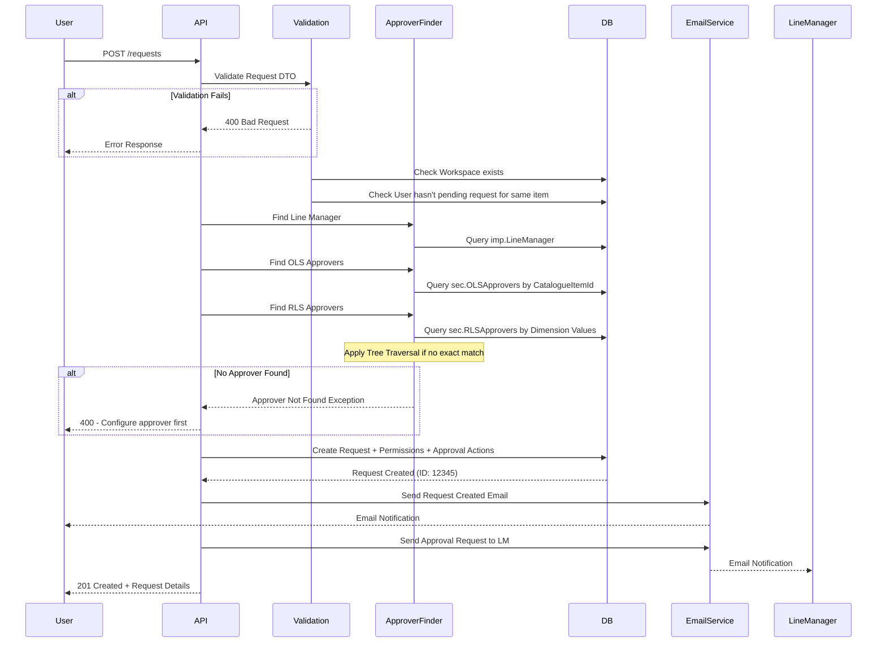
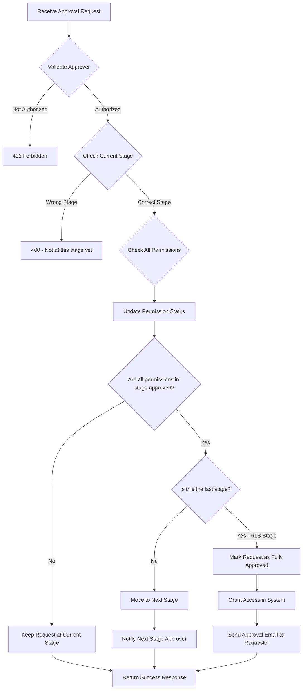

# Sakura V2 - Complete API Design

> **Base URL**: `https://api.sakura.dentsu.com/api/v1`  
> **Authentication**: Bearer Token (JWT via Okta/Entra ID)  
> **Content-Type**: `application/json`

---

## 📑 Table of Contents

1. [API Standards & Conventions](#api-standards--conventions)
2. [Authentication APIs](#authentication-apis)
3. [User Management APIs](#user-management-apis)
4. [Workspace APIs](#workspace-apis)
5. [Request Management APIs](#request-management-apis)
6. [Approval APIs](#approval-apis)
7. [Catalogue APIs](#catalogue-apis)
8. [Security Model APIs](#security-model-apis)
9. [Approver Management APIs](#approver-management-apis)
10. [Administration APIs](#administration-apis)
11. [Delegation APIs](#delegation-apis)
12. [Audit & Logging APIs](#audit--logging-apis)

---

## 🎯 API Standards & Conventions

### HTTP Status Codes

| Code | Meaning | When to Use |
|------|---------|-------------|
| 200 | OK | Successful GET, PUT, DELETE |
| 201 | Created | Successful POST that creates a resource |
| 204 | No Content | Successful DELETE with no response body |
| 400 | Bad Request | Validation error, malformed request |
| 401 | Unauthorized | Missing or invalid authentication token |
| 403 | Forbidden | Authenticated but not authorized |
| 404 | Not Found | Resource doesn't exist |
| 409 | Conflict | Resource conflict (e.g., duplicate) |
| 500 | Internal Server Error | Unexpected server error |

### Standard Response Formats

#### Success Response
```json
{
  "data": { /* response payload */ },
  "success": true,
  "message": "Operation completed successfully"
}
```

#### Error Response
```json
{
  "error": "Detailed error message",
  "statusCode": 400,
  "timestamp": "2025-10-16T10:30:00Z",
  "path": "/api/v1/requests",
  "validationErrors": [
    {
      "field": "workspaceId",
      "message": "Workspace ID must be greater than 0"
    }
  ]
}
```

#### Paginated Response
```json
{
  "data": [ /* array of items */ ],
  "pagination": {
    "page": 1,
    "pageSize": 20,
    "totalItems": 156,
    "totalPages": 8,
    "hasNext": true,
    "hasPrevious": false
  }
}
```

### Common Query Parameters

| Parameter | Type | Description | Example |
|-----------|------|-------------|---------|
| `page` | integer | Page number (1-based) | `?page=2` |
| `pageSize` | integer | Items per page (max 100) | `?pageSize=50` |
| `sortBy` | string | Field to sort by | `?sortBy=createdAt` |
| `sortOrder` | string | `asc` or `desc` | `?sortOrder=desc` |
| `search` | string | Search term | `?search=finance` |
| `isActive` | boolean | Filter by active status | `?isActive=true` |

---

## 🔐 Authentication APIs

### POST /auth/login
Initiate login via Okta/Entra ID (handled by frontend redirect).

**Response**: Redirect to Okta/Entra login page

---

### POST /auth/callback
OAuth callback handler (handled automatically by middleware).

**Request Headers**:
```
Authorization: Bearer {jwt_token}
```

**Response**:
```json
{
  "accessToken": "eyJhbGc...",
  "expiresIn": 3600,
  "user": {
    "upn": "john.doe@dentsu.com",
    "displayName": "John Doe",
    "roles": ["Requester"]
  }
}
```

---

### POST /auth/refresh
Refresh an expired access token.

**Request**:
```json
{
  "refreshToken": "refresh_token_here"
}
```

**Response**:
```json
{
  "accessToken": "new_jwt_token",
  "expiresIn": 3600
}
```

---

## 👤 User Management APIs

### GET /users/me
Get current authenticated user's profile.

**Headers**: `Authorization: Bearer {token}`

**Response**:
```json
{
  "userId": 123,
  "upn": "john.doe@dentsu.com",
  "displayName": "John Doe",
  "email": "john.doe@dentsu.com",
  "roles": ["Requester", "Approver"],
  "lineManager": {
    "upn": "jane.smith@dentsu.com",
    "displayName": "Jane Smith"
  },
  "delegations": [
    {
      "delegateUpn": "bob.johnson@dentsu.com",
      "validFrom": "2025-10-01T00:00:00Z",
      "validTo": "2025-10-31T23:59:59Z"
    }
  ]
}
```

---

### GET /users/{upn}
Get user details by UPN (User Principal Name).

**Parameters**:
- `upn` (path): User's email address

**Response**:
```json
{
  "userId": 456,
  "upn": "jane.smith@dentsu.com",
  "displayName": "Jane Smith",
  "email": "jane.smith@dentsu.com",
  "isActive": true,
  "createdAt": "2025-01-15T10:30:00Z"
}
```

---

### GET /users/search
Search for users.

**Query Parameters**:
- `q` (required): Search term
- `page`: Page number (default: 1)
- `pageSize`: Items per page (default: 20)

**Response**:
```json
{
  "data": [
    {
      "userId": 123,
      "upn": "john.doe@dentsu.com",
      "displayName": "John Doe",
      "email": "john.doe@dentsu.com"
    }
  ],
  "pagination": {
    "page": 1,
    "pageSize": 20,
    "totalItems": 3,
    "totalPages": 1
  }
}
```

---

## 🏢 Workspace APIs

### GET /workspaces
List all workspaces.

**Query Parameters**:
- `isActive`: Filter by active status (default: true)
- `page`, `pageSize`, `sortBy`, `sortOrder`

**Response**:
```json
{
  "data": [
    {
      "workspaceId": 1,
      "workspaceCode": "EMEA",
      "workspaceName": "EMEA Regional Workspace",
      "ownerUpn": "emea.owner@dentsu.com",
      "ownerDisplayName": "EMEA Owner",
      "techOwnerUpn": "emea.tech@dentsu.com",
      "isActive": true,
      "createdAt": "2025-01-01T00:00:00Z"
    },
    {
      "workspaceId": 2,
      "workspaceCode": "WFI",
      "workspaceName": "Workforce Intelligence",
      "ownerUpn": "wfi.owner@dentsu.com",
      "ownerDisplayName": "WFI Owner",
      "techOwnerUpn": "wfi.tech@dentsu.com",
      "isActive": true,
      "createdAt": "2025-01-01T00:00:00Z"
    }
  ],
  "pagination": {
    "page": 1,
    "pageSize": 20,
    "totalItems": 6,
    "totalPages": 1
  }
}
```

---

### GET /workspaces/{id}
Get workspace details by ID.

**Parameters**:
- `id` (path): Workspace ID

**Response**:
```json
{
  "workspaceId": 1,
  "workspaceCode": "EMEA",
  "workspaceName": "EMEA Regional Workspace",
  "description": "Regional workspace for EMEA operations",
  "ownerUpn": "emea.owner@dentsu.com",
  "ownerDisplayName": "EMEA Owner",
  "techOwnerUpn": "emea.tech@dentsu.com",
  "techOwnerDisplayName": "EMEA Tech",
  "isActive": true,
  "createdAt": "2025-01-01T00:00:00Z",
  "updatedAt": "2025-10-15T14:20:00Z",
  "apps": [
    {
      "appId": 10,
      "appCode": "FIN",
      "appName": "Finance Dashboard",
      "approvalMode": "AudienceBased"
    },
    {
      "appId": 11,
      "appCode": "HR",
      "appName": "HR Analytics",
      "approvalMode": "AppBased"
    }
  ],
  "securityModels": [
    {
      "securityModelId": 5,
      "modelName": "EMEA Standard Model",
      "securityTypes": ["ORGA", "Client", "CC"]
    }
  ]
}
```

---

### POST /workspaces
Create a new workspace (Admin only).

**Authorization**: `Sakura Administrator`

**Request**:
```json
{
  "workspaceCode": "AMER",
  "workspaceName": "Americas Workspace",
  "description": "Workspace for Americas region",
  "ownerUpn": "amer.owner@dentsu.com",
  "techOwnerUpn": "amer.tech@dentsu.com"
}
```

**Response**: `201 Created`
```json
{
  "workspaceId": 7,
  "workspaceCode": "AMER",
  "workspaceName": "Americas Workspace",
  "ownerUpn": "amer.owner@dentsu.com",
  "techOwnerUpn": "amer.tech@dentsu.com",
  "isActive": true,
  "createdAt": "2025-10-16T10:45:00Z"
}
```

---

### PUT /workspaces/{id}
Update workspace (Admin or Workspace Owner).

**Authorization**: `Sakura Administrator` OR `Workspace Owner`

**Request**:
```json
{
  "workspaceName": "Americas Regional Workspace",
  "description": "Updated description",
  "ownerUpn": "new.owner@dentsu.com",
  "techOwnerUpn": "new.tech@dentsu.com"
}
```

**Response**: `200 OK`

---

### DELETE /workspaces/{id}
Soft delete workspace (Admin only).

**Authorization**: `Sakura Administrator`

**Response**: `204 No Content`

---

### GET /workspaces/{id}/apps
List apps in a workspace.

**Parameters**:
- `id` (path): Workspace ID
- `isActive` (query): Filter by active status

**Response**:
```json
{
  "data": [
    {
      "appId": 10,
      "appCode": "FIN",
      "appName": "Finance Dashboard",
      "approvalMode": "AudienceBased",
      "isActive": true,
      "audiences": [
        {
          "audienceId": 100,
          "audienceName": "CFO Team",
          "reportCount": 5
        },
        {
          "audienceId": 101,
          "audienceName": "Finance Analysts",
          "reportCount": 8
        }
      ]
    }
  ]
}
```

---

### POST /workspaces/{workspaceId}/apps
Create a new app (Workspace Admin).

**Authorization**: `Workspace Admin` OR `Sakura Administrator`

**Request**:
```json
{
  "appCode": "SALES",
  "appName": "Sales Performance Dashboard",
  "approvalMode": "AudienceBased",
  "description": "Sales KPI dashboard"
}
```

**Response**: `201 Created`

---

### GET /workspaces/{workspaceId}/apps/{appId}/audiences
List audiences for an app.

**Response**:
```json
{
  "data": [
    {
      "audienceId": 100,
      "audienceCode": "CFO_TEAM",
      "audienceName": "CFO Team",
      "entraGroupUid": "a1b2c3d4-...",
      "isActive": true,
      "reports": [
        {
          "reportId": 1001,
          "reportName": "Revenue Report",
          "reportCode": "REV_RPT"
        },
        {
          "reportId": 1002,
          "reportName": "Budget Report",
          "reportCode": "BDG_RPT"
        }
      ]
    }
  ]
}
```

---

### POST /workspaces/{workspaceId}/apps/{appId}/audiences
Create an audience (Workspace Admin).

**Request**:
```json
{
  "audienceCode": "FINANCE_TEAM",
  "audienceName": "Finance Team Members",
  "entraGroupUid": "guid-here",
  "description": "Finance team audience"
}
```

**Response**: `201 Created`

---

## 📋 Request Management APIs

### POST /requests
Create a new access request.

**Request Body**:
```json
{
  "workspaceId": 1,
  "requestedForUpn": "john.doe@dentsu.com",
  "comments": "Need access for Q4 reporting",
  "olsPermissions": [
    {
      "catalogueItemId": 100,
      "catalogueItemType": "Audience"
    }
  ],
  "rlsPermissions": [
    {
      "securityModelId": 5,
      "securityTypeCode": "ORGA",
      "dimensionValues": [
        {
          "dimensionCode": "Entity",
          "valueCode": "EMEA_DE",
          "valueName": "Germany"
        },
        {
          "dimensionCode": "ServiceLine",
          "valueCode": "CXM",
          "valueName": "CXM"
        }
      ]
    }
  ]
}
```

**Business Logic Flow**:



**Response**: `201 Created`
```json
{
  "requestId": 12345,
  "workspaceId": 1,
  "workspaceName": "EMEA Regional Workspace",
  "requestedByUpn": "current.user@dentsu.com",
  "requestedByDisplayName": "Current User",
  "requestedForUpn": "john.doe@dentsu.com",
  "requestedForDisplayName": "John Doe",
  "requestedAt": "2025-10-16T10:45:00Z",
  "status": "Pending",
  "currentStage": "LM",
  "comments": "Need access for Q4 reporting",
  "olsPermissions": [
    {
      "permissionId": 50001,
      "catalogueItemType": "Audience",
      "catalogueItemId": 100,
      "catalogueItemName": "Finance Team Audience",
      "currentStage": "LM",
      "status": "Pending"
    }
  ],
  "rlsPermissions": [
    {
      "permissionId": 60001,
      "securityModelId": 5,
      "securityModelName": "EMEA Standard Model",
      "securityTypeCode": "ORGA",
      "securityTypeName": "Organization",
      "dimensionValues": [
        {
          "dimensionCode": "Entity",
          "dimensionName": "Entity",
          "value": "Germany",
          "valueCode": "EMEA_DE"
        },
        {
          "dimensionCode": "ServiceLine",
          "dimensionName": "Service Line",
          "value": "CXM",
          "valueCode": "CXM"
        }
      ],
      "currentStage": "LM",
      "status": "Pending"
    }
  ],
  "approvalStages": [
    {
      "stage": "LM",
      "stageOrder": 1,
      "approverUpn": "line.manager@dentsu.com",
      "approverDisplayName": "Line Manager",
      "status": "Pending",
      "assignedAt": "2025-10-16T10:45:00Z"
    },
    {
      "stage": "OLS",
      "stageOrder": 2,
      "approverUpn": "audience.owner@dentsu.com",
      "approverDisplayName": "Audience Owner",
      "status": "NotStarted"
    },
    {
      "stage": "RLS",
      "stageOrder": 3,
      "approverUpn": "data.approver@dentsu.com",
      "approverDisplayName": "Data Approver",
      "status": "NotStarted"
    }
  ]
}
```

---

### GET /requests/my-requests
Get requests submitted by or for the current user.

**Query Parameters**:
- `status`: Filter by status (`Pending`, `Approved`, `Rejected`, `Revoked`)
- `workspaceId`: Filter by workspace
- `page`, `pageSize`, `sortBy`, `sortOrder`

**Response**:
```json
{
  "data": [
    {
      "requestId": 12345,
      "workspaceName": "EMEA Regional Workspace",
      "requestedByUpn": "current.user@dentsu.com",
      "requestedForUpn": "john.doe@dentsu.com",
      "requestedAt": "2025-10-16T10:45:00Z",
      "status": "Pending",
      "currentStage": "LM",
      "olsCount": 1,
      "rlsCount": 1
    }
  ],
  "pagination": {
    "page": 1,
    "pageSize": 20,
    "totalItems": 15,
    "totalPages": 1
  }
}
```

---

### GET /requests/{id}
Get detailed request information.

**Parameters**:
- `id` (path): Request ID

**Authorization**: User must be:
- Requester (RequestedBy or RequestedFor)
- Assigned approver
- Workspace Admin for the workspace
- Sakura Administrator
- Sakura Support (read-only)

**Response**: Same as POST /requests response above

---

### GET /requests/{id}/history
Get approval history for a request.

**Response**:
```json
{
  "requestId": 12345,
  "history": [
    {
      "actionId": 1001,
      "stage": "LM",
      "approverUpn": "line.manager@dentsu.com",
      "approverDisplayName": "Line Manager",
      "decision": "Approved",
      "comments": "Approved for business need",
      "decidedAt": "2025-10-16T11:00:00Z"
    },
    {
      "actionId": 1002,
      "stage": "OLS",
      "approverUpn": "audience.owner@dentsu.com",
      "approverDisplayName": "Audience Owner",
      "decision": "Approved",
      "comments": null,
      "decidedAt": "2025-10-16T14:30:00Z"
    }
  ]
}
```

---

## ✅ Approval APIs

### GET /approvals/my-approvals
Get pending approvals for current user.

**Query Parameters**:
- `stage`: Filter by stage (`LM`, `OLS`, `RLS`)
- `status`: Filter by status (`Pending`, `Approved`, `Rejected`)
- `workspaceId`: Filter by workspace
- `page`, `pageSize`

**Response**:
```json
{
  "data": [
    {
      "requestId": 12345,
      "workspaceName": "EMEA Regional Workspace",
      "requestedForUpn": "john.doe@dentsu.com",
      "requestedForDisplayName": "John Doe",
      "requestedAt": "2025-10-16T10:45:00Z",
      "currentStage": "OLS",
      "myApprovalStage": "OLS",
      "permissionType": "OLS",
      "permissionSummary": "Finance Team Audience",
      "assignedAt": "2025-10-16T11:05:00Z",
      "existingAccessSummary": {
        "hasOlsAccess": false,
        "rlsAccessCount": 0
      }
    }
  ],
  "pagination": {
    "page": 1,
    "pageSize": 20,
    "totalItems": 5,
    "totalPages": 1
  }
}
```

---

### POST /approvals/{requestId}/approve
Approve a request.

**Parameters**:
- `requestId` (path): Request ID

**Request**:
```json
{
  "stage": "OLS",
  "permissionIds": [50001],
  "comments": "Approved - business justification valid"
}
```

**Business Logic**:



**Response**: `200 OK`
```json
{
  "requestId": 12345,
  "status": "Approved",
  "currentStage": "RLS",
  "message": "OLS approval successful. Request moved to RLS stage."
}
```

---

### POST /approvals/{requestId}/reject
Reject a request.

**Request**:
```json
{
  "stage": "OLS",
  "permissionIds": [50001],
  "reason": "Business justification insufficient",
  "comments": "Please provide more details about why this access is needed"
}
```

**Validation**:
- `reason` is REQUIRED (cannot be null or empty)
- User must be assigned approver for this stage

**Response**: `200 OK`
```json
{
  "requestId": 12345,
  "status": "Rejected",
  "message": "Request rejected at OLS stage"
}
```

**Side Effects**:
- Request status changes to `Rejected`
- Email sent to requester with rejection reason
- No further approvals can be done (terminal state)

---

### POST /approvals/{requestId}/revoke
Revoke an approved request.

**Authorization**: 
- Approver who approved it
- Workspace Admin
- Sakura Administrator

**Request**:
```json
{
  "reason": "User no longer needs access",
  "comments": "Employee transferred to different team"
}
```

**Response**: `200 OK`

---

### POST /approvals/bulk-approve
Bulk approve multiple requests (same stage).

**Request**:
```json
{
  "requestIds": [12345, 12346, 12347],
  "stage": "LM",
  "comments": "Bulk approval for team onboarding"
}
```

**Response**:
```json
{
  "successful": [12345, 12346],
  "failed": [
    {
      "requestId": 12347,
      "reason": "Already approved"
    }
  ]
}
```

---

## 🔍 Catalogue APIs

### GET /catalogue/search
Search for reports, audiences, and apps.

**Query Parameters**:
- `q` (required): Search term
- `workspaceId`: Filter by workspace
- `type`: Filter by type (`Report`, `Audience`, `App`)
- `page`, `pageSize`

**Response**:
```json
{
  "data": [
    {
      "catalogueItemId": 100,
      "catalogueItemType": "Audience",
      "name": "Finance Team Audience",
      "description": "Audience for finance team members",
      "workspaceId": 1,
      "workspaceName": "EMEA Regional Workspace",
      "appId": 10,
      "appName": "Finance Dashboard",
      "reportCount": 5,
      "hasAccess": false,
      "accessDetails": null
    },
    {
      "catalogueItemId": 1001,
      "catalogueItemType": "Report",
      "name": "Revenue Report",
      "description": "Quarterly revenue analysis",
      "workspaceId": 1,
      "workspaceName": "EMEA Regional Workspace",
      "reportType": "StandaloneReport",
      "hasAccess": true,
      "accessDetails": {
        "grantedAt": "2025-09-15T10:00:00Z",
        "expiresAt": null
      }
    }
  ],
  "pagination": {
    "page": 1,
    "pageSize": 20,
    "totalItems": 2,
    "totalPages": 1
  }
}
```

---

### GET /catalogue/{catalogueItemId}
Get detailed information about a catalogue item.

**Parameters**:
- `catalogueItemId` (path): Catalogue item ID
- `type` (query): `Report`, `Audience`, or `App`

**Response**:
```json
{
  "catalogueItemId": 100,
  "catalogueItemType": "Audience",
  "name": "Finance Team Audience",
  "description": "Audience for finance team members",
  "workspaceId": 1,
  "workspaceName": "EMEA Regional Workspace",
  "appId": 10,
  "appName": "Finance Dashboard",
  "reports": [
    {
      "reportId": 1001,
      "reportName": "Revenue Report",
      "reportCode": "REV_RPT"
    },
    {
      "reportId": 1002,
      "reportName": "Budget Report",
      "reportCode": "BDG_RPT"
    }
  ],
  "securityModels": [
    {
      "securityModelId": 5,
      "modelName": "EMEA Standard Model",
      "securityTypes": ["ORGA", "Client", "CC"]
    }
  ],
  "olsApprover": {
    "approverUpn": "audience.owner@dentsu.com",
    "approverDisplayName": "Audience Owner"
  },
  "currentUserAccess": {
    "hasOlsAccess": false,
    "rlsAccess": []
  }
}
```

---

## 🔒 Security Model APIs

### GET /security-models
List security models.

**Query Parameters**:
- `workspaceId`: Filter by workspace
- `isActive`: Filter by active status
- `page`, `pageSize`

**Response**:
```json
{
  "data": [
    {
      "securityModelId": 5,
      "modelName": "EMEA Standard Model",
      "modelCode": "EMEA_STD",
      "workspaceId": 1,
      "workspaceName": "EMEA Regional Workspace",
      "isActive": true,
      "securityTypes": ["ORGA", "Client", "CC"],
      "dimensionCount": 5
    }
  ]
}
```

---

### GET /security-models/{id}
Get security model details.

**Response**:
```json
{
  "securityModelId": 5,
  "modelName": "EMEA Standard Model",
  "modelCode": "EMEA_STD",
  "workspaceId": 1,
  "workspaceName": "EMEA Regional Workspace",
  "description": "Standard security model for EMEA workspace",
  "isActive": true,
  "securityTypes": [
    {
      "securityTypeCode": "ORGA",
      "displayName": "Organization (Entity + Service Line)",
      "dimensions": [
        {
          "dimensionId": 101,
          "dimensionCode": "Entity",
          "dimensionName": "Entity",
          "dimensionTable": "BL_UMV.DimEntity",
          "hierarchyLevels": ["Legal Entity", "BPC Entity", "Market", "Cluster", "Region", "Global"]
        },
        {
          "dimensionId": 102,
          "dimensionCode": "ServiceLine",
          "dimensionName": "Service Line",
          "dimensionTable": "BL_UMV.DimServiceLine",
          "hierarchyLevels": ["Service Line", "Overall"]
        }
      ]
    },
    {
      "securityTypeCode": "Client",
      "displayName": "Client",
      "dimensions": [
        {
          "dimensionId": 101,
          "dimensionCode": "Entity",
          "dimensionName": "Entity"
        },
        {
          "dimensionId": 102,
          "dimensionCode": "ServiceLine",
          "dimensionName": "Service Line"
        },
        {
          "dimensionId": 103,
          "dimensionCode": "Client",
          "dimensionName": "Client",
          "dimensionTable": "BL_UMV.DimClient",
          "hierarchyLevels": ["Client", "Dentsu Stakeholder", "All"]
        }
      ]
    }
  ]
}
```

---

### GET /security-models/{id}/dimensions/{dimensionCode}/values
Get dimension values for selection in wizard.

**Parameters**:
- `id` (path): Security Model ID
- `dimensionCode` (path): Dimension code (e.g., `Entity`, `Client`)

**Query Parameters**:
- `level`: Hierarchy level (e.g., `Market`, `Cluster`)
- `parentValue`: Parent value for hierarchical filtering
- `search`: Search term

**Response**:
```json
{
  "dimensionCode": "Entity",
  "dimensionName": "Entity",
  "level": "Market",
  "values": [
    {
      "valueCode": "EMEA_DE",
      "valueName": "Germany",
      "parentValueCode": "EMEA_DACH",
      "parentValueName": "DACH",
      "level": "Market",
      "hasChildren": true
    },
    {
      "valueCode": "EMEA_FR",
      "valueName": "France",
      "parentValueCode": "EMEA_FR",
      "parentValueName": "France",
      "level": "Market",
      "hasChildren": false
    }
  ]
}
```

---

### POST /security-models
Create a security model (Workspace Admin or Sakura Admin).

**Request**:
```json
{
  "modelCode": "AMER_STD",
  "modelName": "Americas Standard Model",
  "workspaceId": 7,
  "description": "Standard model for Americas workspace",
  "securityTypes": [
    {
      "securityTypeCode": "ORGA",
      "dimensions": [
        {
          "dimensionCode": "Entity",
          "dimensionTable": "BL_UMV.DimEntity",
          "displayOrder": 1
        },
        {
          "dimensionCode": "ServiceLine",
          "dimensionTable": "BL_UMV.DimServiceLine",
          "displayOrder": 2
        }
      ]
    }
  ]
}
```

**Response**: `201 Created`

---

## 👥 Approver Management APIs

### GET /approvers/ols
List OLS approvers.

**Query Parameters**:
- `workspaceId`: Filter by workspace
- `catalogueItemType`: `Report`, `Audience`, `App`
- `catalogueItemId`: Specific item ID
- `page`, `pageSize`

**Response**:
```json
{
  "data": [
    {
      "approverId": 5001,
      "catalogueItemType": "Audience",
      "catalogueItemId": 100,
      "catalogueItemName": "Finance Team Audience",
      "approverUpn": "audience.owner@dentsu.com",
      "approverDisplayName": "Audience Owner",
      "workspaceId": 1,
      "workspaceName": "EMEA Regional Workspace",
      "assignedAt": "2025-01-15T10:00:00Z",
      "isActive": true
    }
  ]
}
```

---

### POST /approvers/ols
Assign OLS approver (Workspace Admin or Sakura Admin).

**Request**:
```json
{
  "catalogueItemType": "Audience",
  "catalogueItemId": 100,
  "approverUpn": "new.approver@dentsu.com"
}
```

**Response**: `201 Created`

---

### DELETE /approvers/ols/{approverId}
Remove OLS approver assignment.

**Response**: `204 No Content`

---

### GET /approvers/rls
List RLS approvers.

**Query Parameters**:
- `securityModelId`: Filter by security model
- `securityTypeCode`: Filter by security type
- `page`, `pageSize`

**Response**:
```json
{
  "data": [
    {
      "approverId": 6001,
      "securityModelId": 5,
      "securityModelName": "EMEA Standard Model",
      "securityTypeCode": "ORGA",
      "dimensionValues": [
        {
          "dimensionCode": "Entity",
          "value": "Germany",
          "valueCode": "EMEA_DE"
        },
        {
          "dimensionCode": "ServiceLine",
          "value": "CXM",
          "valueCode": "CXM"
        }
      ],
      "approverUpn": "de.cxm.approver@dentsu.com",
      "approverDisplayName": "Germany CXM Approver",
      "assignedAt": "2025-01-15T10:00:00Z",
      "isActive": true
    }
  ]
}
```

---

### POST /approvers/rls
Assign RLS approver (Workspace Admin or Sakura Admin).

**Request**:
```json
{
  "securityModelId": 5,
  "securityTypeCode": "ORGA",
  "dimensionValues": [
    {
      "dimensionCode": "Entity",
      "value": "France",
      "valueCode": "EMEA_FR"
    },
    {
      "dimensionCode": "ServiceLine",
      "value": "Media",
      "valueCode": "MEDIA"
    }
  ],
  "approverUpn": "fr.media.approver@dentsu.com"
}
```

**Validation**:
- All required dimensions for the security type must be provided
- Dimension values must exist in dimension tables
- Approver UPN must be a valid dentsu user

**Response**: `201 Created`

---

### GET /approvers/rls/tree
Get RLS approver tree for a security model (for admin UI visualization).

**Query Parameters**:
- `securityModelId` (required)
- `securityTypeCode` (required)

**Response**:
```json
{
  "securityModelId": 5,
  "securityTypeCode": "ORGA",
  "tree": [
    {
      "dimensionCode": "Entity",
      "dimensionName": "Entity",
      "level": "Market",
      "nodes": [
        {
          "valueCode": "EMEA_DE",
          "valueName": "Germany",
          "approvers": [
            {
              "approverUpn": "de.approver@dentsu.com",
              "serviceLine": "CXM"
            },
            {
              "approverUpn": "de.media.approver@dentsu.com",
              "serviceLine": "Media"
            }
          ],
          "children": []
        },
        {
          "valueCode": "EMEA_FR",
          "valueName": "France",
          "approvers": [],
          "children": []
        }
      ]
    }
  ]
}
```

---

## ⚙️ Administration APIs

### GET /admin/settings
Get system settings (Admin only).

**Response**:
```json
{
  "emailingEnabled": true,
  "loggingLevel": "Information",
  "maxPageSize": 100,
  "requestRetentionDays": 365,
  "emailRetryAttempts": 3,
  "allowDelegation": true,
  "requireComments": false
}
```

---

### PUT /admin/settings
Update system settings (Admin only).

**Request**:
```json
{
  "emailingEnabled": false,
  "loggingLevel": "Warning"
}
```

**Response**: `200 OK`

---

### GET /admin/email-templates
List email templates.

**Response**:
```json
{
  "data": [
    {
      "templateId": 1,
      "templateCode": "REQUEST_CREATED",
      "templateName": "Request Created Email",
      "subject": "[Sakura] Access Request #{RequestId} Created",
      "bodyHtml": "<html>...</html>",
      "isActive": true
    }
  ]
}
```

---

### PUT /admin/email-templates/{id}
Update email template (Admin only).

**Request**:
```json
{
  "subject": "[Sakura] Your Access Request #{RequestId} Has Been Submitted",
  "bodyHtml": "<html><body>...</body></html>"
}
```

**Response**: `200 OK`

---

### GET /admin/help-content
Get in-app help content.

**Query Parameters**:
- `pageCode`: Filter by page
- `elementCode`: Filter by UI element

**Response**:
```json
{
  "data": [
    {
      "helpId": 1,
      "pageCode": "REQUEST_WIZARD",
      "elementCode": "WORKSPACE_SELECTION",
      "helpText": "Select the workspace containing the reports you need access to",
      "displayOrder": 1
    }
  ]
}
```

---

### PUT /admin/help-content/{id}
Update help content (Admin only).

**Request**:
```json
{
  "helpText": "Updated help text here"
}
```

**Response**: `200 OK`

---

## 🔄 Delegation APIs

### GET /delegations/me
Get current user's delegations.

**Response**:
```json
{
  "activeDelegations": [
    {
      "delegationId": 101,
      "delegateUpn": "bob.johnson@dentsu.com",
      "delegateDisplayName": "Bob Johnson",
      "validFrom": "2025-10-01T00:00:00Z",
      "validTo": "2025-10-31T23:59:59Z",
      "isActive": true,
      "createdAt": "2025-09-30T15:00:00Z"
    }
  ],
  "upcomingDelegations": [],
  "expiredDelegations": []
}
```

---

### POST /delegations
Create a delegation.

**Request**:
```json
{
  "delegateUpn": "bob.johnson@dentsu.com",
  "validFrom": "2025-11-01T00:00:00Z",
  "validTo": "2025-11-30T23:59:59Z",
  "reason": "Sabbatical leave"
}
```

**Validation**:
- User must be an Approver
- Cannot delegate to self
- Date range must be in future
- Cannot overlap with existing delegation

**Response**: `201 Created`

---

### DELETE /delegations/{id}
Remove a delegation.

**Response**: `204 No Content`

---

## 📊 Audit & Logging APIs

### GET /audit/logs
Query audit logs (Admin or Support only).

**Query Parameters**:
- `userUpn`: Filter by user
- `action`: Filter by action type
- `startDate`, `endDate`: Date range
- `page`, `pageSize`

**Response**:
```json
{
  "data": [
    {
      "logId": 100001,
      "timestamp": "2025-10-16T10:45:32Z",
      "userUpn": "john.doe@dentsu.com",
      "action": "REQUEST_CREATED",
      "resourceType": "Request",
      "resourceId": 12345,
      "details": {
        "workspaceId": 1,
        "olsCount": 1,
        "rlsCount": 1
      },
      "ipAddress": "10.0.1.50",
      "userAgent": "Mozilla/5.0..."
    }
  ],
  "pagination": {
    "page": 1,
    "pageSize": 50,
    "totalItems": 1523,
    "totalPages": 31
  }
}
```

---

### GET /audit/requests/{requestId}/history
Get full audit trail for a specific request.

**Response**:
```json
{
  "requestId": 12345,
  "auditTrail": [
    {
      "timestamp": "2025-10-16T10:45:00Z",
      "action": "REQUEST_CREATED",
      "userUpn": "requester@dentsu.com",
      "details": "Request created"
    },
    {
      "timestamp": "2025-10-16T11:00:00Z",
      "action": "LM_APPROVED",
      "userUpn": "line.manager@dentsu.com",
      "details": "Line Manager approved"
    }
  ]
}
```

---

### POST /audit/export
Export audit logs (Admin only).

**Request**:
```json
{
  "startDate": "2025-10-01T00:00:00Z",
  "endDate": "2025-10-31T23:59:59Z",
  "format": "xlsx",
  "filters": {
    "userUpn": null,
    "action": null
  }
}
```

**Response**:
```json
{
  "exportId": "abc123",
  "status": "Processing",
  "estimatedCompletionTime": "2025-10-16T11:00:00Z"
}
```

---

## 🔐 Authorization Matrix

| Endpoint Pattern | Requester | Approver | WS Admin | Support | Admin |
|------------------|-----------|----------|----------|---------|-------|
| `POST /requests` | ✅ | ✅ | ✅ | ❌ | ✅ |
| `GET /requests/my-requests` | ✅ | ✅ | ✅ | ❌ | ✅ |
| `GET /requests/{id}` | ✅ (own) | ✅ (assigned) | ✅ (WS) | ✅ | ✅ |
| `POST /approvals/.../approve` | ❌ | ✅ (assigned) | ❌ | ❌ | ❌ |
| `POST /approvals/.../revoke` | ❌ | ✅ (assigned) | ✅ (WS) | ❌ | ✅ |
| `GET /approvers/*` | ❌ | ❌ | ✅ (WS) | ✅ | ✅ |
| `POST /approvers/*` | ❌ | ❌ | ✅ (WS) | ❌ | ✅ |
| `GET /admin/*` | ❌ | ❌ | ❌ | ✅ | ✅ |
| `PUT /admin/*` | ❌ | ❌ | ❌ | ❌ | ✅ |
| `GET /audit/*` | ❌ | ❌ | ❌ | ✅ | ✅ |

---

## 📈 Performance Considerations

### Caching Strategy
- **User profile**: Cache for 1 hour
- **Workspaces list**: Cache for 30 minutes
- **Security dimension values**: Cache for 24 hours
- **Lookup tables (LoV)**: Cache indefinitely (invalidate on update)

### Database Optimization
- Index on `RequestedForUPN`, `RequestedByUPN`, `WorkspaceId`
- Covering index on approval queries
- Use `AsNoTracking()` for read-only queries
- Batch operations where possible

### API Rate Limiting
- 100 requests per minute per user
- 1000 requests per hour per user
- Burst allowance: 20 requests

---

**Next Document**: [03-DATABASE-INTEGRATION.md](./03-DATABASE-INTEGRATION.md)

