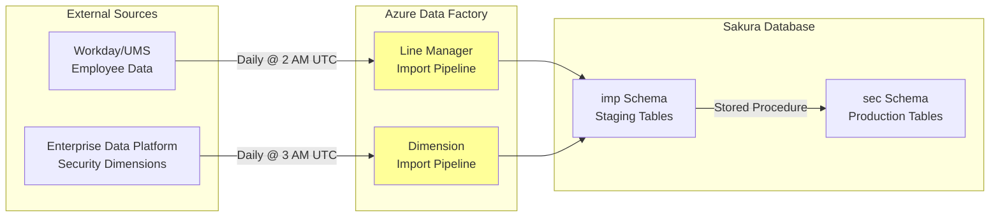
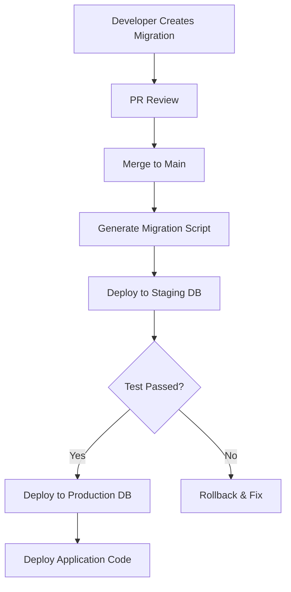

# Sakura V2 - Database Integration & Data Flow

> **ORM**: Entity Framework Core 8.0  
> **Database**: Azure SQL Database  
> **Migrations**: Code-First with EF Migrations  
> **Connection**: SQL Server Authentication

---

## 📑 Table of Contents

1. [Database Connection Setup](#database-connection-setup)
2. [Entity Framework Core Configuration](#entity-framework-core-configuration)
3. [Repository Pattern Implementation](#repository-pattern-implementation)
4. [Query Optimization Strategies](#query-optimization-strategies)
5. [Data Import Pipeline (ETL)](#data-import-pipeline-etl)
6. [Transaction Management](#transaction-management)
7. [Migration Strategy](#migration-strategy)
8. [Performance Monitoring](#performance-monitoring)

---

## 🔌 Database Connection Setup

### Connection String Configuration

**appsettings.json**:
```json
{
  "ConnectionStrings": {
    "SakuraDb": "Server=tcp:sql-sakura-prod.database.windows.net,1433;Database=sakura-db;User ID=sakuraadmin;Password=***;Encrypt=True;TrustServerCertificate=False;Connection Timeout=30;Max Pool Size=200;"
  }
}
```

### Azure Key Vault Integration (Production)

```csharp
// Program.cs
using Azure.Identity;
using Azure.Security.KeyVault.Secrets;

var builder = WebApplication.CreateBuilder(args);

if (!builder.Environment.IsDevelopment())
{
    // Load connection string from Azure Key Vault
    var keyVaultUrl = builder.Configuration["KeyVault:Url"];
    var client = new SecretClient(new Uri(keyVaultUrl), new DefaultAzureCredential());
    
    var connectionSecret = await client.GetSecretAsync("SakuraDbConnectionString");
    builder.Configuration["ConnectionStrings:SakuraDb"] = connectionSecret.Value.Value;
}
```

### DbContext Registration

```csharp
// Program.cs or InfrastructureServiceExtensions.cs
services.AddDbContext<SakuraDbContext>(options =>
{
    options.UseSqlServer(
        configuration.GetConnectionString("SakuraDb"),
        sqlOptions =>
        {
            // Enable retry on transient failures
            sqlOptions.EnableRetryOnFailure(
                maxRetryCount: 3,
                maxRetryDelay: TimeSpan.FromSeconds(5),
                errorNumbersToAdd: null
            );
            
            // Command timeout
            sqlOptions.CommandTimeout(30);
            
            // Migrations assembly
            sqlOptions.MigrationsAssembly(typeof(SakuraDbContext).Assembly.FullName);
        }
    );

    // Logging (Development only)
    if (Environment.GetEnvironmentVariable("ASPNETCORE_ENVIRONMENT") == "Development")
    {
        options.EnableSensitiveDataLogging();
        options.EnableDetailedErrors();
    }

    // Query tracking behavior
    options.UseQueryTrackingBehavior(QueryTrackingBehavior.NoTracking);
});
```

---

## 🏗️ Entity Framework Core Configuration

### DbContext Implementation

```csharp
namespace SakuraV2.Infrastructure.Persistence;

public class SakuraDbContext : DbContext
{
    public SakuraDbContext(DbContextOptions<SakuraDbContext> options) : base(options) { }

    #region Core Schema
    public DbSet<User> Users { get; set; }
    public DbSet<Workspace> Workspaces { get; set; }
    public DbSet<WorkspaceApp> WorkspaceApps { get; set; }
    public DbSet<AppAudience> AppAudiences { get; set; }
    public DbSet<Report> Reports { get; set; }
    public DbSet<AudienceReport> AudienceReports { get; set; }
    #endregion

    #region Security Schema
    public DbSet<SecurityModel> SecurityModels { get; set; }
    public DbSet<SecurityDimension> SecurityDimensions { get; set; }
    public DbSet<SecurityTypeDimension> SecurityTypeDimensions { get; set; }
    public DbSet<OLSApprover> OLSApprovers { get; set; }
    public DbSet<RLSApprover> RLSApprovers { get; set; }
    public DbSet<EntityHierarchy> EntityHierarchies { get; set; }
    #endregion

    #region Request Schema
    public DbSet<Request> Requests { get; set; }
    public DbSet<OLSPermission> OLSPermissions { get; set; }
    public DbSet<RLSPermission> RLSPermissions { get; set; }
    public DbSet<RLSDimensionValue> RLSDimensionValues { get; set; }
    public DbSet<ApprovalAction> ApprovalActions { get; set; }
    #endregion

    #region Admin Schema
    public DbSet<Setting> Settings { get; set; }
    public DbSet<EmailTemplate> EmailTemplates { get; set; }
    public DbSet<HelpContent> HelpContents { get; set; }
    #endregion

    #region Import Schema
    public DbSet<LineManager> LineManagers { get; set; }
    public DbSet<DimensionSource> DimensionSources { get; set; }
    #endregion

    #region Log Schema
    public DbSet<AuditLog> AuditLogs { get; set; }
    #endregion

    #region Lookup Tables
    public DbSet<ApprovalStageLoV> ApprovalStages { get; set; }
    public DbSet<DecisionLoV> Decisions { get; set; }
    public DbSet<CatalogItemTypeLoV> CatalogItemTypes { get; set; }
    public DbSet<SecurityTypeLoV> SecurityTypes { get; set; }
    public DbSet<ApprovalModeLoV> ApprovalModes { get; set; }
    #endregion

    protected override void OnModelCreating(ModelBuilder modelBuilder)
    {
        base.OnModelCreating(modelBuilder);

        // Apply all entity configurations from assembly
        modelBuilder.ApplyConfigurationsFromAssembly(typeof(SakuraDbContext).Assembly);

        // Configure schemas
        ConfigureSchemas(modelBuilder);

        // Seed lookup data
        SeedLookupData(modelBuilder);

        // Global query filters
        ConfigureGlobalFilters(modelBuilder);
    }

    private void ConfigureSchemas(ModelBuilder modelBuilder)
    {
        // Set default schema for entities if not explicitly configured
        modelBuilder.HasDefaultSchema("core");
    }

    private void ConfigureGlobalFilters(ModelBuilder modelBuilder)
    {
        // Soft delete filter - automatically filter out inactive records
        foreach (var entityType in modelBuilder.Model.GetEntityTypes())
        {
            if (typeof(BaseEntity).IsAssignableFrom(entityType.ClrType))
            {
                var parameter = Expression.Parameter(entityType.ClrType, "e");
                var property = Expression.Property(parameter, nameof(BaseEntity.IsActive));
                var filter = Expression.Lambda(Expression.Equal(property, Expression.Constant(true)), parameter);
                
                modelBuilder.Entity(entityType.ClrType).HasQueryFilter(filter);
            }
        }
    }

    private void SeedLookupData(ModelBuilder modelBuilder)
    {
        // Approval Stages
        modelBuilder.Entity<ApprovalStageLoV>().HasData(
            new ApprovalStageLoV { ApprovalStageCode = "LM", StageOrder = 1 },
            new ApprovalStageLoV { ApprovalStageCode = "OLS", StageOrder = 2 },
            new ApprovalStageLoV { ApprovalStageCode = "RLS", StageOrder = 3 }
        );

        // Decisions
        modelBuilder.Entity<DecisionLoV>().HasData(
            new DecisionLoV { DecisionCode = "Pending", IsTerminal = false },
            new DecisionLoV { DecisionCode = "Approved", IsTerminal = true },
            new DecisionLoV { DecisionCode = "Rejected", IsTerminal = true },
            new DecisionLoV { DecisionCode = "Revoked", IsTerminal = true }
        );

        // Catalog Item Types
        modelBuilder.Entity<CatalogItemTypeLoV>().HasData(
            new CatalogItemTypeLoV { CatalogItemTypeCode = "Report", DisplayName = "Report" },
            new CatalogItemTypeLoV { CatalogItemTypeCode = "App", DisplayName = "Workspace App" },
            new CatalogItemTypeLoV { CatalogItemTypeCode = "Audience", DisplayName = "App Audience" }
        );

        // Security Types
        modelBuilder.Entity<SecurityTypeLoV>().HasData(
            new SecurityTypeLoV { SecurityTypeCode = "ORGA", DisplayName = "Organization (Entity + Service Line)" },
            new SecurityTypeLoV { SecurityTypeCode = "Client", DisplayName = "Client" },
            new SecurityTypeLoV { SecurityTypeCode = "CC", DisplayName = "Cost Center" },
            new SecurityTypeLoV { SecurityTypeCode = "MSS", DisplayName = "Master Service Set" },
            new SecurityTypeLoV { SecurityTypeCode = "Country", DisplayName = "Country" },
            new SecurityTypeLoV { SecurityTypeCode = "PC", DisplayName = "Profit Center" },
            new SecurityTypeLoV { SecurityTypeCode = "SLPA", DisplayName = "Service Line / Practice Area" },
            new SecurityTypeLoV { SecurityTypeCode = "WFI", DisplayName = "Workforce Fixed Type" }
        );

        // Approval Modes
        modelBuilder.Entity<ApprovalModeLoV>().HasData(
            new ApprovalModeLoV { ApprovalModeCode = "AppBased", DisplayName = "App Based" },
            new ApprovalModeLoV { ApprovalModeCode = "AudienceBased", DisplayName = "Audience Based" }
        );
    }

    // Override SaveChanges to add audit tracking
    public override async Task<int> SaveChangesAsync(CancellationToken cancellationToken = default)
    {
        AddTimestamps();
        return await base.SaveChangesAsync(cancellationToken);
    }

    private void AddTimestamps()
    {
        var entries = ChangeTracker.Entries()
            .Where(e => e.Entity is BaseEntity && 
                       (e.State == EntityState.Added || e.State == EntityState.Modified));

        foreach (var entry in entries)
        {
            var entity = (BaseEntity)entry.Entity;

            if (entry.State == EntityState.Added)
            {
                entity.CreatedAt = DateTime.UtcNow;
            }

            if (entry.State == EntityState.Modified)
            {
                entity.UpdatedAt = DateTime.UtcNow;
            }
        }
    }
}
```

---

### Entity Configuration Examples

**User Configuration**:
```csharp
namespace SakuraV2.Infrastructure.Persistence.Configurations;

public class UserConfiguration : IEntityTypeConfiguration<User>
{
    public void Configure(EntityTypeBuilder<User> builder)
    {
        // Table
        builder.ToTable("Users", "core");

        // Primary Key
        builder.HasKey(u => u.Id);
        builder.Property(u => u.Id)
            .HasColumnName("UserId")
            .ValueGeneratedOnAdd();

        // Properties
        builder.Property(u => u.UPN)
            .IsRequired()
            .HasMaxLength(256);

        builder.HasIndex(u => u.UPN)
            .IsUnique()
            .HasDatabaseName("UQ_Users_UPN");

        builder.Property(u => u.DisplayName)
            .HasMaxLength(200);

        builder.Property(u => u.EntraObjectId)
            .HasColumnType("uniqueidentifier");

        // Timestamps
        builder.Property(u => u.CreatedAt)
            .IsRequired()
            .HasColumnType("datetime2(3)")
            .HasDefaultValueSql("SYSUTCDATETIME()");

        builder.Property(u => u.UpdatedAt)
            .HasColumnType("datetime2(3)");

        builder.Property(u => u.IsActive)
            .IsRequired()
            .HasDefaultValue(true);

        // Indexes
        builder.HasIndex(u => u.EntraObjectId);
        builder.HasIndex(u => u.IsActive);
    }
}
```

**Request Configuration**:
```csharp
public class RequestConfiguration : IEntityTypeConfiguration<Request>
{
    public void Configure(EntityTypeBuilder<Request> builder)
    {
        builder.ToTable("Requests", "req");

        builder.HasKey(r => r.Id);
        builder.Property(r => r.Id)
            .HasColumnName("RequestId");

        builder.Property(r => r.RequestedByUPN)
            .IsRequired()
            .HasMaxLength(256);

        builder.Property(r => r.RequestedForUPN)
            .IsRequired()
            .HasMaxLength(256);

        builder.Property(r => r.RequestedAt)
            .IsRequired()
            .HasColumnType("datetime2(3)")
            .HasDefaultValueSql("SYSUTCDATETIME()");

        builder.Property(r => r.Status)
            .IsRequired()
            .HasConversion<string>()
            .HasMaxLength(20);

        builder.Property(r => r.Comments)
            .HasMaxLength(500);

        // Relationships
        builder.HasOne(r => r.Workspace)
            .WithMany()
            .HasForeignKey(r => r.WorkspaceId)
            .OnDelete(DeleteBehavior.Restrict);

        builder.HasMany(r => r.OLSPermissions)
            .WithOne(p => p.Request)
            .HasForeignKey(p => p.RequestId)
            .OnDelete(DeleteBehavior.Cascade);

        builder.HasMany(r => r.RLSPermissions)
            .WithOne(p => p.Request)
            .HasForeignKey(p => p.RequestId)
            .OnDelete(DeleteBehavior.Cascade);

        // Indexes for performance
        builder.HasIndex(r => r.RequestedByUPN)
            .HasDatabaseName("IX_Requests_RequestedBy");

        builder.HasIndex(r => r.RequestedForUPN)
            .HasDatabaseName("IX_Requests_RequestedFor");

        builder.HasIndex(r => r.WorkspaceId)
            .HasDatabaseName("IX_Requests_Workspace");

        builder.HasIndex(r => new { r.RequestedAt, r.Status })
            .HasDatabaseName("IX_Requests_RequestedAt_Status");

        builder.HasIndex(r => new { r.Status, r.IsActive })
            .HasDatabaseName("IX_Requests_Status_IsActive");
    }
}
```

---

## 📚 Repository Pattern Implementation

### Generic Repository

```csharp
namespace SakuraV2.Infrastructure.Persistence.Repositories;

public class GenericRepository<T> : IGenericRepository<T> where T : BaseEntity
{
    protected readonly SakuraDbContext _context;
    protected readonly DbSet<T> _dbSet;
    protected readonly ILogger<GenericRepository<T>> _logger;

    public GenericRepository(
        SakuraDbContext context,
        ILogger<GenericRepository<T>> logger)
    {
        _context = context;
        _dbSet = context.Set<T>();
        _logger = logger;
    }

    public virtual async Task<T?> GetByIdAsync(long id, bool includeInactive = false)
    {
        IQueryable<T> query = _dbSet;

        if (includeInactive)
        {
            query = query.IgnoreQueryFilters();
        }

        return await query.FirstOrDefaultAsync(e => e.Id == id);
    }

    public virtual async Task<IEnumerable<T>> GetAllAsync(bool includeInactive = false)
    {
        IQueryable<T> query = _dbSet;

        if (includeInactive)
        {
            query = query.IgnoreQueryFilters();
        }

        return await query.ToListAsync();
    }

    public virtual async Task<PagedResult<T>> GetPagedAsync(
        int page,
        int pageSize,
        Expression<Func<T, bool>>? filter = null,
        Func<IQueryable<T>, IOrderedQueryable<T>>? orderBy = null,
        bool includeInactive = false)
    {
        IQueryable<T> query = _dbSet;

        if (includeInactive)
        {
            query = query.IgnoreQueryFilters();
        }

        if (filter != null)
        {
            query = query.Where(filter);
        }

        var totalItems = await query.CountAsync();

        if (orderBy != null)
        {
            query = orderBy(query);
        }

        var items = await query
            .Skip((page - 1) * pageSize)
            .Take(pageSize)
            .AsNoTracking()
            .ToListAsync();

        return new PagedResult<T>
        {
            Data = items,
            Page = page,
            PageSize = pageSize,
            TotalItems = totalItems,
            TotalPages = (int)Math.Ceiling(totalItems / (double)pageSize)
        };
    }

    public virtual async Task<IEnumerable<T>> FindAsync(
        Expression<Func<T, bool>> predicate,
        bool includeInactive = false)
    {
        IQueryable<T> query = _dbSet;

        if (includeInactive)
        {
            query = query.IgnoreQueryFilters();
        }

        return await query.Where(predicate).ToListAsync();
    }

    public virtual async Task<T> AddAsync(T entity)
    {
        await _dbSet.AddAsync(entity);
        await _context.SaveChangesAsync();
        
        _logger.LogInformation("Created entity {EntityType} with ID {EntityId}", 
            typeof(T).Name, entity.Id);
        
        return entity;
    }

    public virtual async Task AddRangeAsync(IEnumerable<T> entities)
    {
        await _dbSet.AddRangeAsync(entities);
        await _context.SaveChangesAsync();
        
        _logger.LogInformation("Created {Count} entities of type {EntityType}", 
            entities.Count(), typeof(T).Name);
    }

    public virtual async Task UpdateAsync(T entity)
    {
        _dbSet.Update(entity);
        await _context.SaveChangesAsync();
        
        _logger.LogInformation("Updated entity {EntityType} with ID {EntityId}", 
            typeof(T).Name, entity.Id);
    }

    public virtual async Task DeleteAsync(long id)
    {
        var entity = await GetByIdAsync(id);
        if (entity != null)
        {
            entity.Deactivate();
            await UpdateAsync(entity);
            
            _logger.LogInformation("Soft deleted entity {EntityType} with ID {EntityId}", 
                typeof(T).Name, id);
        }
    }

    public virtual async Task HardDeleteAsync(long id)
    {
        var entity = await _dbSet.FindAsync(id);
        if (entity != null)
        {
            _dbSet.Remove(entity);
            await _context.SaveChangesAsync();
            
            _logger.LogWarning("Hard deleted entity {EntityType} with ID {EntityId}", 
                typeof(T).Name, id);
        }
    }

    public virtual async Task<int> CountAsync(
        Expression<Func<T, bool>>? predicate = null,
        bool includeInactive = false)
    {
        IQueryable<T> query = _dbSet;

        if (includeInactive)
        {
            query = query.IgnoreQueryFilters();
        }

        return predicate == null 
            ? await query.CountAsync() 
            : await query.CountAsync(predicate);
    }

    public virtual async Task<bool> ExistsAsync(
        Expression<Func<T, bool>> predicate,
        bool includeInactive = false)
    {
        IQueryable<T> query = _dbSet;

        if (includeInactive)
        {
            query = query.IgnoreQueryFilters();
        }

        return await query.AnyAsync(predicate);
    }
}

public class PagedResult<T>
{
    public IEnumerable<T> Data { get; set; } = new List<T>();
    public int Page { get; set; }
    public int PageSize { get; set; }
    public int TotalItems { get; set; }
    public int TotalPages { get; set; }
    public bool HasNext => Page < TotalPages;
    public bool HasPrevious => Page > 1;
}
```

---

### Specialized Repository: RequestRepository

```csharp
public class RequestRepository : GenericRepository<Request>, IRequestRepository
{
    public RequestRepository(
        SakuraDbContext context,
        ILogger<RequestRepository> logger) 
        : base(context, logger) { }

    public async Task<IEnumerable<Request>> GetUserRequestsAsync(
        string userUpn,
        string? status = null,
        long? workspaceId = null)
    {
        var query = _context.Requests
            .Where(r => r.RequestedByUPN == userUpn || r.RequestedForUPN == userUpn);

        if (!string.IsNullOrEmpty(status))
        {
            query = query.Where(r => r.Status.ToString() == status);
        }

        if (workspaceId.HasValue)
        {
            query = query.Where(r => r.WorkspaceId == workspaceId.Value);
        }

        return await query
            .Include(r => r.Workspace)
            .Include(r => r.OLSPermissions)
                .ThenInclude(o => o.ApprovalActions)
            .Include(r => r.RLSPermissions)
                .ThenInclude(rls => rls.ApprovalActions)
            .OrderByDescending(r => r.RequestedAt)
            .AsNoTracking()
            .ToListAsync();
    }

    public async Task<Request?> GetWithAllDetailsAsync(long requestId)
    {
        return await _context.Requests
            .Include(r => r.Workspace)
            .Include(r => r.OLSPermissions)
                .ThenInclude(o => o.ApprovalActions)
            .Include(r => r.RLSPermissions)
                .ThenInclude(rls => rls.ApprovalActions)
            .Include(r => r.RLSPermissions)
                .ThenInclude(rls => rls.DimensionValues)
            .AsNoTracking()
            .FirstOrDefaultAsync(r => r.Id == requestId);
    }

    public async Task<IEnumerable<Request>> GetPendingApprovalsForUserAsync(
        string approverUpn,
        ApprovalStage stage)
    {
        // Complex query: find requests where user is assigned approver at this stage
        // and previous stages are complete
        
        return await _context.Requests
            .Where(r => r.IsActive)
            .Include(r => r.Workspace)
            .Include(r => r.OLSPermissions)
                .ThenInclude(o => o.ApprovalActions
                    .Where(a => a.ApprovalStageCode == stage.ToString() 
                             && a.ApproverUPN == approverUpn
                             && a.DecisionCode == "Pending"))
            .Include(r => r.RLSPermissions)
                .ThenInclude(rls => rls.ApprovalActions
                    .Where(a => a.ApprovalStageCode == stage.ToString() 
                             && a.ApproverUPN == approverUpn
                             && a.DecisionCode == "Pending"))
            .Where(r => r.OLSPermissions.Any(o => o.ApprovalActions.Any())
                     || r.RLSPermissions.Any(rls => rls.ApprovalActions.Any()))
            .OrderBy(r => r.RequestedAt)
            .AsNoTracking()
            .ToListAsync();
    }

    public async Task<bool> HasPendingRequestForCatalogueItemAsync(
        long catalogueItemId,
        string userUpn)
    {
        return await _context.Requests
            .Where(r => r.RequestedForUPN == userUpn && r.IsActive)
            .Where(r => r.Status == RequestStatus.Pending 
                     || r.Status == RequestStatus.LMApproved 
                     || r.Status == RequestStatus.OLSApproved)
            .AnyAsync(r => r.OLSPermissions.Any(o => o.CatalogueItemId == catalogueItemId));
    }

    public async Task<Dictionary<long, List<string>>> GetUserAccessSummaryAsync(
        string userUpn,
        long workspaceId)
    {
        // Returns a dictionary: catalogueItemId -> list of security dimension summaries
        
        var approvedRequests = await _context.Requests
            .Where(r => r.RequestedForUPN == userUpn 
                     && r.WorkspaceId == workspaceId 
                     && r.Status == RequestStatus.FullyApproved)
            .Include(r => r.OLSPermissions)
            .Include(r => r.RLSPermissions)
                .ThenInclude(rls => rls.DimensionValues)
            .AsNoTracking()
            .ToListAsync();

        var result = new Dictionary<long, List<string>>();

        foreach (var request in approvedRequests)
        {
            foreach (var ols in request.OLSPermissions)
            {
                if (!result.ContainsKey(ols.CatalogueItemId))
                {
                    result[ols.CatalogueItemId] = new List<string>();
                }
            }

            foreach (var rls in request.RLSPermissions)
            {
                var summary = string.Join(" - ", 
                    rls.DimensionValues.Select(dv => $"{dv.DimensionCode}:{dv.Value}"));
                
                // Add to all associated catalogue items
                foreach (var ols in request.OLSPermissions)
                {
                    result[ols.CatalogueItemId].Add(summary);
                }
            }
        }

        return result;
    }
}
```

---

## ⚡ Query Optimization Strategies

### 1. Index Strategy

```sql
-- Critical indexes for performance

-- Requests table
CREATE NONCLUSTERED INDEX IX_Requests_RequestedFor_Status 
ON req.Requests(RequestedForUPN, Status) 
INCLUDE (WorkspaceId, RequestedAt);

CREATE NONCLUSTERED INDEX IX_Requests_Workspace_Status_Active
ON req.Requests(WorkspaceId, Status, IsActive)
INCLUDE (RequestId, RequestedForUPN, RequestedAt);

-- OLSPermissions table
CREATE NONCLUSTERED INDEX IX_OLSPermissions_CatalogueItem
ON req.OLSPermissions(CatalogueItemId, CatalogueItemTypeCode)
INCLUDE (RequestId, CurrentStage);

-- ApprovalActions table
CREATE NONCLUSTERED INDEX IX_ApprovalActions_Approver_Decision
ON req.ApprovalActions(ApproverUPN, DecisionCode, ApprovalStageCode);

-- RLSApprovers (complex query optimization)
CREATE NONCLUSTERED INDEX IX_RLSApprovers_Lookup
ON sec.RLSApprovers(SecurityModelId, SecurityTypeCode)
INCLUDE (ApproverUPN, IsActive);
```

### 2. Compiled Queries (EF Core)

```csharp
namespace SakuraV2.Infrastructure.Persistence.CompiledQueries;

public static class RequestQueries
{
    // Compile frequently-used queries for better performance
    
    private static readonly Func<SakuraDbContext, string, IAsyncEnumerable<Request>> 
        _userRequestsQuery = EF.CompileAsyncQuery(
            (SakuraDbContext context, string userUpn) =>
                context.Requests
                    .Where(r => r.RequestedByUPN == userUpn || r.RequestedForUPN == userUpn)
                    .OrderByDescending(r => r.RequestedAt)
        );

    public static IAsyncEnumerable<Request> GetUserRequests(
        SakuraDbContext context, 
        string userUpn)
    {
        return _userRequestsQuery(context, userUpn);
    }

    private static readonly Func<SakuraDbContext, long, Task<Request?>> 
        _requestByIdQuery = EF.CompileAsyncQuery(
            (SakuraDbContext context, long requestId) =>
                context.Requests
                    .Include(r => r.Workspace)
                    .Include(r => r.OLSPermissions)
                    .Include(r => r.RLSPermissions)
                    .FirstOrDefault(r => r.Id == requestId)
        );

    public static Task<Request?> GetRequestById(
        SakuraDbContext context, 
        long requestId)
    {
        return _requestByIdQuery(context, requestId);
    }
}
```

### 3. Query Splitting for Large Includes

```csharp
// Instead of single query with many includes (Cartesian explosion)
var request = await _context.Requests
    .Include(r => r.OLSPermissions)
        .ThenInclude(o => o.ApprovalActions)
    .Include(r => r.RLSPermissions)
        .ThenInclude(rls => rls.ApprovalActions)
    .AsSplitQuery()  // ← Splits into multiple queries
    .FirstOrDefaultAsync(r => r.Id == requestId);
```

### 4. Projection for Read-Only Scenarios

```csharp
// Instead of loading full entities, project to DTOs
var requests = await _context.Requests
    .Where(r => r.RequestedForUPN == userUpn)
    .Select(r => new MyRequestsDto
    {
        RequestId = r.Id,
        WorkspaceName = r.Workspace.WorkspaceName,
        RequestedAt = r.RequestedAt,
        Status = r.Status.ToString(),
        OLSCount = r.OLSPermissions.Count,
        RLSCount = r.RLSPermissions.Count
    })
    .AsNoTracking()
    .ToListAsync();
```

---

## 🔄 Data Import Pipeline (ETL)

### Azure Data Factory Pipeline Design



### Import Stored Procedures

**Line Manager Import**:
```sql
CREATE PROCEDURE imp.ImportLineManagers
AS
BEGIN
    SET NOCOUNT ON;
    
    BEGIN TRANSACTION;
    BEGIN TRY
        -- Close out previous records
        UPDATE imp.LineManager
        SET ValidTo = DATEADD(DAY, -1, SYSUTCDATETIME())
        WHERE ValidTo IS NULL
          AND NOT EXISTS (
              SELECT 1 FROM stage.LineManagerImport s
              WHERE s.EmployeeUPN = imp.LineManager.EmployeeUPN
                AND s.ManagerUPN = imp.LineManager.ManagerUPN
          );

        -- Insert new records
        INSERT INTO imp.LineManager (EmployeeUPN, ManagerUPN, ValidFrom)
        SELECT 
            s.EmployeeUPN,
            s.ManagerUPN,
            SYSUTCDATETIME()
        FROM stage.LineManagerImport s
        WHERE NOT EXISTS (
            SELECT 1 FROM imp.LineManager lm
            WHERE lm.EmployeeUPN = s.EmployeeUPN
              AND lm.ManagerUPN = s.ManagerUPN
              AND lm.ValidTo IS NULL
        );

        COMMIT TRANSACTION;
    END TRY
    BEGIN CATCH
        ROLLBACK TRANSACTION;
        THROW;
    END CATCH
END;
GO
```

**Dimension Import**:
```sql
CREATE PROCEDURE imp.ImportDimensionData
    @SecurityDimensionCode VARCHAR(20),
    @ImportBatchId UNIQUEIDENTIFIER
AS
BEGIN
    SET NOCOUNT ON;
    
    BEGIN TRANSACTION;
    BEGIN TRY
        DECLARE @DimensionId BIGINT;
        
        SELECT @DimensionId = SecurityDimensionId 
        FROM sec.SecurityDimensions 
        WHERE SecurityDimensionCode = @SecurityDimensionCode;

        IF @DimensionId IS NULL
            THROW 50001, 'Security dimension not found', 1;

        -- Close out records not in this import
        UPDATE imp.DimensionSource
        SET ValidTo = DATEADD(DAY, -1, SYSUTCDATETIME())
        WHERE SecurityDimensionId = @DimensionId
          AND ValidTo IS NULL
          AND NaturalKey NOT IN (
              SELECT NaturalKey FROM stage.DimensionImport 
              WHERE BatchId = @ImportBatchId
          );

        -- Upsert logic
        MERGE imp.DimensionSource AS target
        USING (
            SELECT 
                @DimensionId AS SecurityDimensionId,
                NaturalKey,
                ParentNaturalKey,
                LevelName,
                DisplayName,
                ExtraJSON,
                SYSUTCDATETIME() AS ValidFrom
            FROM stage.DimensionImport
            WHERE BatchId = @ImportBatchId
        ) AS source
        ON target.SecurityDimensionId = source.SecurityDimensionId
           AND target.NaturalKey = source.NaturalKey
           AND target.ValidTo IS NULL
        WHEN MATCHED AND (
            target.DisplayName <> source.DisplayName OR
            ISNULL(target.ParentNaturalKey, '') <> ISNULL(source.ParentNaturalKey, '')
        ) THEN
            UPDATE SET ValidTo = DATEADD(DAY, -1, source.ValidFrom)
        WHEN NOT MATCHED BY TARGET THEN
            INSERT (
                SecurityDimensionId, NaturalKey, ParentNaturalKey,
                LevelName, DisplayName, ExtraJSON, ValidFrom
            )
            VALUES (
                source.SecurityDimensionId, source.NaturalKey, source.ParentNaturalKey,
                source.LevelName, source.DisplayName, source.ExtraJSON, source.ValidFrom
            );

        -- Insert new versions for changed records
        INSERT INTO imp.DimensionSource (
            SecurityDimensionId, NaturalKey, ParentNaturalKey,
            LevelName, DisplayName, ExtraJSON, ValidFrom
        )
        SELECT 
            @DimensionId, s.NaturalKey, s.ParentNaturalKey,
            s.LevelName, s.DisplayName, s.ExtraJSON, SYSUTCDATETIME()
        FROM stage.DimensionImport s
        WHERE s.BatchId = @ImportBatchId
          AND EXISTS (
              SELECT 1 FROM imp.DimensionSource ds
              WHERE ds.SecurityDimensionId = @DimensionId
                AND ds.NaturalKey = s.NaturalKey
                AND ds.ValidTo = DATEADD(DAY, -1, SYSUTCDATETIME())
          );

        COMMIT TRANSACTION;
    END TRY
    BEGIN CATCH
        ROLLBACK TRANSACTION;
        THROW;
    END CATCH
END;
GO
```

### C# Import Service

```csharp
namespace SakuraV2.Infrastructure.Services;

public class DimensionImportService : IDimensionImportService
{
    private readonly SakuraDbContext _context;
    private readonly ILogger<DimensionImportService> _logger;

    public DimensionImportService(
        SakuraDbContext context,
        ILogger<DimensionImportService> logger)
    {
        _context = context;
        _logger = logger;
    }

    public async Task ImportDimensionDataAsync(
        string dimensionCode,
        IEnumerable<DimensionImportDto> data)
    {
        var batchId = Guid.NewGuid();
        
        _logger.LogInformation(
            "Starting dimension import for {DimensionCode}, BatchId: {BatchId}, Count: {Count}",
            dimensionCode, batchId, data.Count());

        try
        {
            // Stage data
            await StageDimensionDataAsync(batchId, data);

            // Execute stored procedure
            await _context.Database.ExecuteSqlRawAsync(
                "EXEC imp.ImportDimensionData @SecurityDimensionCode={0}, @ImportBatchId={1}",
                dimensionCode, batchId
            );

            _logger.LogInformation(
                "Successfully imported dimension data for {DimensionCode}",
                dimensionCode);
        }
        catch (Exception ex)
        {
            _logger.LogError(ex, 
                "Failed to import dimension data for {DimensionCode}",
                dimensionCode);
            throw;
        }
    }

    private async Task StageDimensionDataAsync(
        Guid batchId,
        IEnumerable<DimensionImportDto> data)
    {
        // Bulk insert into staging table
        var stagingData = data.Select(d => new
        {
            BatchId = batchId,
            d.NaturalKey,
            d.ParentNaturalKey,
            d.LevelName,
            d.DisplayName,
            ExtraJSON = JsonSerializer.Serialize(d.ExtraData)
        });

        await _context.Database.ExecuteSqlRawAsync(
            @"INSERT INTO stage.DimensionImport 
              (BatchId, NaturalKey, ParentNaturalKey, LevelName, DisplayName, ExtraJSON)
              VALUES {0}",
            string.Join(",", stagingData.Select(d => 
                $"({d.BatchId}, '{d.NaturalKey}', '{d.ParentNaturalKey}', " +
                $"'{d.LevelName}', '{d.DisplayName}', '{d.ExtraJSON}')"))
        );
    }
}
```

---

## 🔒 Transaction Management

### Unit of Work Pattern

```csharp
namespace SakuraV2.Infrastructure.Persistence;

public interface IUnitOfWork : IDisposable
{
    IUserRepository Users { get; }
    IWorkspaceRepository Workspaces { get; }
    IRequestRepository Requests { get; }
    ISecurityRepository Security { get; }
    
    Task<int> SaveChangesAsync();
    Task BeginTransactionAsync();
    Task CommitTransactionAsync();
    Task RollbackTransactionAsync();
}

public class UnitOfWork : IUnitOfWork
{
    private readonly SakuraDbContext _context;
    private IDbContextTransaction? _transaction;

    public UnitOfWork(
        SakuraDbContext context,
        IUserRepository users,
        IWorkspaceRepository workspaces,
        IRequestRepository requests,
        ISecurityRepository security)
    {
        _context = context;
        Users = users;
        Workspaces = workspaces;
        Requests = requests;
        Security = security;
    }

    public IUserRepository Users { get; }
    public IWorkspaceRepository Workspaces { get; }
    public IRequestRepository Requests { get; }
    public ISecurityRepository Security { get; }

    public async Task<int> SaveChangesAsync()
    {
        return await _context.SaveChangesAsync();
    }

    public async Task BeginTransactionAsync()
    {
        _transaction = await _context.Database.BeginTransactionAsync();
    }

    public async Task CommitTransactionAsync()
    {
        try
        {
            await SaveChangesAsync();
            await _transaction.CommitAsync();
        }
        catch
        {
            await RollbackTransactionAsync();
            throw;
        }
        finally
        {
            _transaction?.Dispose();
            _transaction = null;
        }
    }

    public async Task RollbackTransactionAsync()
    {
        await _transaction?.RollbackAsync();
        _transaction?.Dispose();
        _transaction = null;
    }

    public void Dispose()
    {
        _transaction?.Dispose();
        _context.Dispose();
    }
}
```

### Usage in Service

```csharp
public class RequestService : IRequestService
{
    private readonly IUnitOfWork _unitOfWork;

    public RequestService(IUnitOfWork unitOfWork)
    {
        _unitOfWork = unitOfWork;
    }

    public async Task<RequestDetailDto> CreateRequestAsync(CreateRequestDto dto)
    {
        await _unitOfWork.BeginTransactionAsync();

        try
        {
            // 1. Create request
            var request = new Request(...);
            await _unitOfWork.Requests.AddAsync(request);

            // 2. Assign approvers
            await AssignApproversAsync(request);

            // 3. Send email notifications
            await SendNotificationsAsync(request);

            // 4. Log audit
            await LogAuditAsync(request);

            await _unitOfWork.CommitTransactionAsync();

            return MapToDto(request);
        }
        catch
        {
            await _unitOfWork.RollbackTransactionAsync();
            throw;
        }
    }
}
```

---

## 🚀 Migration Strategy

### Initial Migration

```bash
# Add initial migration
dotnet ef migrations add InitialCreate --project SakuraV2.Infrastructure --startup-project SakuraV2.Api

# Apply to database
dotnet ef database update --project SakuraV2.Infrastructure --startup-project SakuraV2.Api
```

### Migration Script Generation (for Production)

```bash
# Generate SQL script
dotnet ef migrations script --project SakuraV2.Infrastructure --startup-project SakuraV2.Api --output migration.sql --idempotent

# Idempotent flag ensures script can be run multiple times safely
```

### Production Deployment Strategy



---

## 📊 Performance Monitoring

### SQL Query Monitoring

```csharp
// Program.cs - Add command interceptor for logging
builder.Services.AddDbContext<SakuraDbContext>(options =>
{
    options.UseSqlServer(connectionString);
    options.AddInterceptors(new SlowQueryInterceptor());
});

public class SlowQueryInterceptor : DbCommandInterceptor
{
    private readonly ILogger<SlowQueryInterceptor> _logger;
    private const int SlowQueryThresholdMs = 1000;

    public override async ValueTask<DbDataReader> ReaderExecutedAsync(
        DbCommand command,
        CommandExecutedEventData eventData,
        DbDataReader result,
        CancellationToken cancellationToken = default)
    {
        if (eventData.Duration.TotalMilliseconds > SlowQueryThresholdMs)
        {
            _logger.LogWarning(
                "Slow query detected: {Query} took {Duration}ms",
                command.CommandText,
                eventData.Duration.TotalMilliseconds);
        }

        return await base.ReaderExecutedAsync(command, eventData, result, cancellationToken);
    }
}
```

### Azure SQL Monitoring

- **Query Performance Insight**: Review top resource-consuming queries
- **Query Store**: Enabled by default, tracks query performance over time
- **Azure Monitor**: Set up alerts for DTU usage, slow queries
- **Application Insights**: Dependency tracking for SQL calls

---

**Next Document**: [04-FRONTEND-INTEGRATION.md](./04-FRONTEND-INTEGRATION.md)

