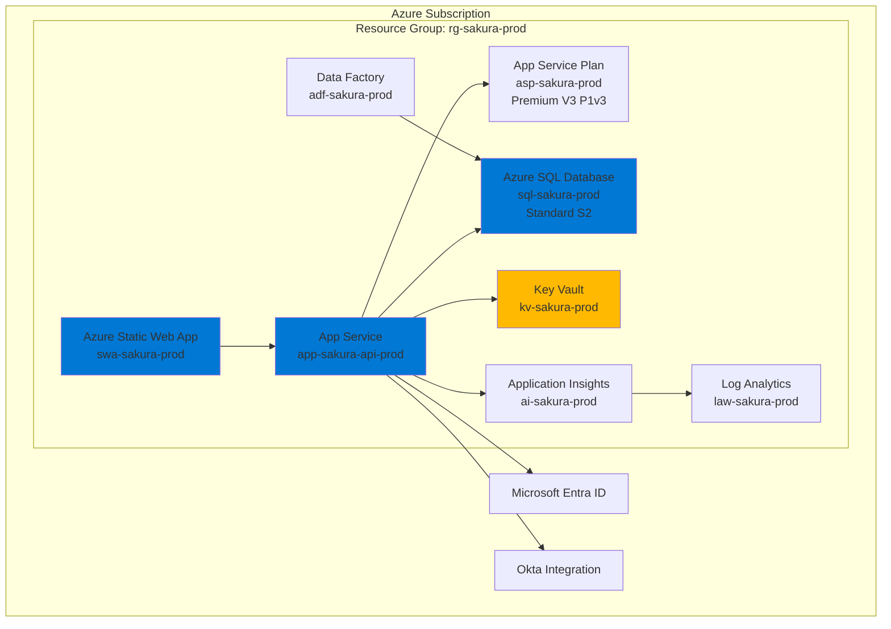

# Sakura V2 - Azure Deployment & DevOps Guide

> **Cloud Platform**: Microsoft Azure  
> **CI/CD**: GitHub Actions  
> **Infrastructure**: Azure Resource Manager (ARM) / Bicep

---

## 📑 Table of Contents

1. [Azure Resources Overview](#azure-resources-overview)
2. [Infrastructure as Code](#infrastructure-as-code)
3. [Frontend Deployment (Static Web Apps)](#frontend-deployment-static-web-apps)
4. [Backend Deployment (App Service)](#backend-deployment-app-service)
5. [Database Setup](#database-setup)
6. [CI/CD Pipeline](#cicd-pipeline)
7. [Environment Configuration](#environment-configuration)
8. [Monitoring & Observability](#monitoring--observability)
9. [Backup & Disaster Recovery](#backup--disaster-recovery)
10. [Scaling Strategy](#scaling-strategy)

---

## 🏗️ Azure Resources Overview



### Resource Naming Convention

```
{resource-type}-{application}-{environment}-{region}

Examples:
- rg-sakura-prod-eastus          (Resource Group)
- swa-sakura-prod-eastus          (Static Web App)
- app-sakura-api-prod-eastus      (App Service)
- asp-sakura-prod-eastus          (App Service Plan)
- sql-sakura-prod-eastus          (SQL Server)
- sqldb-sakura-prod-eastus        (SQL Database)
- kv-sakura-prod-eastus           (Key Vault)
- adf-sakura-prod-eastus          (Data Factory)
- ai-sakura-prod-eastus           (Application Insights)
- law-sakura-prod-eastus          (Log Analytics)
```

---

## 📜 Infrastructure as Code

### Bicep Template (Main)

**infra/main.bicep**:
```bicep
@description('Environment name')
@allowed(['dev', 'staging', 'prod'])
param environment string = 'prod'

@description('Azure region for resources')
param location string = resourceGroup().location

@description('Application name')
param applicationName string = 'sakura'

var resourceSuffix = '${applicationName}-${environment}-${location}'

// Static Web App for Frontend
resource staticWebApp 'Microsoft.Web/staticSites@2022-03-01' = {
  name: 'swa-${resourceSuffix}'
  location: location
  sku: {
    name: 'Standard'
    tier: 'Standard'
  }
  properties: {
    repositoryUrl: 'https://github.com/dentsu/sakura-v2'
    branch: environment == 'prod' ? 'main' : 'develop'
    buildProperties: {
      appLocation: '/FE/application'
      apiLocation: ''
      outputLocation: 'dist/application/browser'
    }
  }
}

// App Service Plan
resource appServicePlan 'Microsoft.Web/serverfarms@2022-03-01' = {
  name: 'asp-${resourceSuffix}'
  location: location
  sku: {
    name: 'P1v3'
    tier: 'PremiumV3'
    size: 'P1v3'
    family: 'Pv3'
    capacity: 1
  }
  kind: 'linux'
  properties: {
    reserved: true
  }
}

// App Service for Backend API
resource appService 'Microsoft.Web/sites@2022-03-01' = {
  name: 'app-${resourceSuffix}-api'
  location: location
  kind: 'app,linux'
  properties: {
    serverFarmId: appServicePlan.id
    httpsOnly: true
    siteConfig: {
      linuxFxVersion: 'DOTNETCORE|8.0'
      alwaysOn: true
      ftpsState: 'Disabled'
      minTlsVersion: '1.2'
      http20Enabled: true
      cors: {
        allowedOrigins: [
          'https://${staticWebApp.properties.defaultHostname}'
        ]
        supportCredentials: true
      }
      appSettings: [
        {
          name: 'ASPNETCORE_ENVIRONMENT'
          value: environment == 'prod' ? 'Production' : 'Staging'
        }
        {
          name: 'ApplicationInsights__ConnectionString'
          value: applicationInsights.properties.ConnectionString
        }
        {
          name: 'KeyVault__Url'
          value: keyVault.properties.vaultUri
        }
      ]
    }
  }
  identity: {
    type: 'SystemAssigned'
  }
}

// Staging Slot
resource appServiceSlot 'Microsoft.Web/sites/slots@2022-03-01' = {
  parent: appService
  name: 'staging'
  location: location
  kind: 'app,linux'
  properties: {
    serverFarmId: appServicePlan.id
    siteConfig: {
      linuxFxVersion: 'DOTNETCORE|8.0'
    }
  }
}

// Azure SQL Server
resource sqlServer 'Microsoft.Sql/servers@2022-05-01-preview' = {
  name: 'sql-${resourceSuffix}'
  location: location
  properties: {
    administratorLogin: 'sakuraadmin'
    administratorLoginPassword: '@Microsoft.KeyVault(SecretUri=${keyVault.properties.vaultUri}secrets/SqlAdminPassword/)'
    version: '12.0'
    minimalTlsVersion: '1.2'
    publicNetworkAccess: 'Enabled'
  }
}

// SQL Database
resource sqlDatabase 'Microsoft.Sql/servers/databases@2022-05-01-preview' = {
  parent: sqlServer
  name: 'sqldb-${resourceSuffix}'
  location: location
  sku: {
    name: 'S2'
    tier: 'Standard'
    capacity: 50
  }
  properties: {
    collation: 'SQL_Latin1_General_CP1_CI_AS'
    maxSizeBytes: 268435456000 // 250 GB
    zoneRedundant: false
    readScale: 'Disabled'
  }
}

// Firewall rule to allow Azure services
resource sqlFirewallRule 'Microsoft.Sql/servers/firewallRules@2022-05-01-preview' = {
  parent: sqlServer
  name: 'AllowAzureServices'
  properties: {
    startIpAddress: '0.0.0.0'
    endIpAddress: '0.0.0.0'
  }
}

// Key Vault
resource keyVault 'Microsoft.KeyVault/vaults@2022-07-01' = {
  name: 'kv-${resourceSuffix}'
  location: location
  properties: {
    sku: {
      family: 'A'
      name: 'standard'
    }
    tenantId: subscription().tenantId
    enableRbacAuthorization: true
    enableSoftDelete: true
    softDeleteRetentionInDays: 90
  }
}

// Application Insights
resource applicationInsights 'Microsoft.Insights/components@2020-02-02' = {
  name: 'ai-${resourceSuffix}'
  location: location
  kind: 'web'
  properties: {
    Application_Type: 'web'
    WorkspaceResourceId: logAnalyticsWorkspace.id
  }
}

// Log Analytics Workspace
resource logAnalyticsWorkspace 'Microsoft.OperationalInsights/workspaces@2022-10-01' = {
  name: 'law-${resourceSuffix}'
  location: location
  properties: {
    sku: {
      name: 'PerGB2018'
    }
    retentionInDays: 30
  }
}

// Data Factory
resource dataFactory 'Microsoft.DataFactory/factories@2018-06-01' = {
  name: 'adf-${resourceSuffix}'
  location: location
  identity: {
    type: 'SystemAssigned'
  }
}

// Grant App Service access to Key Vault
resource keyVaultRoleAssignment 'Microsoft.Authorization/roleAssignments@2022-04-01' = {
  name: guid(keyVault.id, appService.id, 'Key Vault Secrets User')
  scope: keyVault
  properties: {
    roleDefinitionId: subscriptionResourceId('Microsoft.Authorization/roleDefinitions', '4633458b-17de-408a-b874-0445c86b69e6') // Key Vault Secrets User
    principalId: appService.identity.principalId
    principalType: 'ServicePrincipal'
  }
}

// Outputs
output staticWebAppUrl string = 'https://${staticWebApp.properties.defaultHostname}'
output apiUrl string = 'https://${appService.properties.defaultHostName}'
output sqlServerFqdn string = sqlServer.properties.fullyQualifiedDomainName
output keyVaultUri string = keyVault.properties.vaultUri
output applicationInsightsConnectionString string = applicationInsights.properties.ConnectionString
```

### Deployment Script

**infra/deploy.sh**:
```bash
#!/bin/bash

# Variables
RESOURCE_GROUP="rg-sakura-prod-eastus"
LOCATION="eastus"
ENVIRONMENT="prod"

# Create resource group if it doesn't exist
az group create --name $RESOURCE_GROUP --location $LOCATION

# Deploy Bicep template
az deployment group create \
  --resource-group $RESOURCE_GROUP \
  --template-file main.bicep \
  --parameters environment=$ENVIRONMENT \
  --parameters location=$LOCATION
```

---

## 🎨 Frontend Deployment (Static Web Apps)

### GitHub Actions Workflow

**.github/workflows/frontend-deploy.yml**:
```yaml
name: Frontend Deploy

on:
  push:
    branches: [main, develop]
    paths:
      - 'FE/application/**'
  pull_request:
    branches: [main]

jobs:
  build-and-deploy:
    runs-on: ubuntu-latest
    name: Build and Deploy Frontend
    
    steps:
      - uses: actions/checkout@v4
        with:
          submodules: true
      
      - name: Setup Node.js
        uses: actions/setup-node@v4
        with:
          node-version: '20'
          cache: 'npm'
          cache-dependency-path: FE/application/package-lock.json
      
      - name: Install dependencies
        working-directory: FE/application
        run: npm ci
      
      - name: Run tests
        working-directory: FE/application
        run: npm run test:ci
      
      - name: Build
        working-directory: FE/application
        run: npm run build --configuration=production
      
      - name: Deploy to Azure Static Web Apps
        uses: Azure/static-web-apps-deploy@v1
        with:
          azure_static_web_apps_api_token: ${{ secrets.AZURE_STATIC_WEB_APPS_API_TOKEN }}
          repo_token: ${{ secrets.GITHUB_TOKEN }}
          action: "upload"
          app_location: "/FE/application"
          output_location: "dist/application/browser"
```

### Environment Variables (Static Web App)

Configure in Azure Portal → Configuration:
```
NEXT_PUBLIC_API_URL=https://app-sakura-api-prod-eastus.azurewebsites.net/api/v1
NEXT_PUBLIC_OKTA_ISSUER=https://dentsu.okta.com/oauth2/default
NEXT_PUBLIC_OKTA_CLIENT_ID=<client-id>
```

---

## 🚀 Backend Deployment (App Service)

### GitHub Actions Workflow

**.github/workflows/backend-deploy.yml**:
```yaml
name: Backend Deploy

on:
  push:
    branches: [main, develop]
    paths:
      - 'BE/**'
      - '.github/workflows/backend-deploy.yml'
  workflow_dispatch:

env:
  DOTNET_VERSION: '8.0.x'
  AZURE_WEBAPP_NAME: 'app-sakura-api-prod-eastus'
  AZURE_WEBAPP_PACKAGE_PATH: './BE'

jobs:
  build:
    runs-on: ubuntu-latest
    
    steps:
      - uses: actions/checkout@v4
      
      - name: Setup .NET
        uses: actions/setup-dotnet@v4
        with:
          dotnet-version: ${{ env.DOTNET_VERSION }}
      
      - name: Restore dependencies
        working-directory: ${{ env.AZURE_WEBAPP_PACKAGE_PATH }}
        run: dotnet restore
      
      - name: Build
        working-directory: ${{ env.AZURE_WEBAPP_PACKAGE_PATH }}
        run: dotnet build --configuration Release --no-restore
      
      - name: Run tests
        working-directory: ${{ env.AZURE_WEBAPP_PACKAGE_PATH }}
        run: dotnet test --no-build --configuration Release --verbosity normal
      
      - name: Publish
        working-directory: ${{ env.AZURE_WEBAPP_PACKAGE_PATH }}
        run: dotnet publish -c Release -o ./publish
      
      - name: Upload artifact
        uses: actions/upload-artifact@v4
        with:
          name: dotnet-app
          path: ${{ env.AZURE_WEBAPP_PACKAGE_PATH }}/publish
  
  deploy-staging:
    needs: build
    runs-on: ubuntu-latest
    environment: staging
    
    steps:
      - name: Download artifact
        uses: actions/download-artifact@v4
        with:
          name: dotnet-app
      
      - name: Login to Azure
        uses: azure/login@v2
        with:
          creds: ${{ secrets.AZURE_CREDENTIALS }}
      
      - name: Deploy to Staging Slot
        uses: azure/webapps-deploy@v3
        with:
          app-name: ${{ env.AZURE_WEBAPP_NAME }}
          slot-name: 'staging'
          package: .
      
      - name: Run smoke tests
        run: |
          curl -f https://${{ env.AZURE_WEBAPP_NAME }}-staging.azurewebsites.net/health || exit 1
  
  deploy-production:
    needs: deploy-staging
    runs-on: ubuntu-latest
    environment: production
    if: github.ref == 'refs/heads/main'
    
    steps:
      - name: Login to Azure
        uses: azure/login@v2
        with:
          creds: ${{ secrets.AZURE_CREDENTIALS }}
      
      - name: Swap Staging to Production
        run: |
          az webapp deployment slot swap \
            --name ${{ env.AZURE_WEBAPP_NAME }} \
            --resource-group rg-sakura-prod-eastus \
            --slot staging \
            --target-slot production
```

### App Service Configuration

**Application Settings**:
```json
{
  "ASPNETCORE_ENVIRONMENT": "Production",
  "ConnectionStrings__SakuraDb": "@Microsoft.KeyVault(SecretUri=https://kv-sakura-prod.vault.azure.net/secrets/SakuraDbConnectionString/)",
  "AzureAd__TenantId": "your-tenant-id",
  "AzureAd__ClientId": "your-client-id",
  "AzureAd__ClientSecret": "@Microsoft.KeyVault(SecretUri=https://kv-sakura-prod.vault.azure.net/secrets/AzureAdClientSecret/)",
  "Email__SmtpHost": "smtp.office365.com",
  "Email__SmtpPort": "587",
  "Email__FromAddress": "sakura@dentsu.com",
  "Email__Username": "@Microsoft.KeyVault(SecretUri=https://kv-sakura-prod.vault.azure.net/secrets/EmailUsername/)",
  "Email__Password": "@Microsoft.KeyVault(SecretUri=https://kv-sakura-prod.vault.azure.net/secrets/EmailPassword/)",
  "ApplicationInsights__ConnectionString": "InstrumentationKey=...;IngestionEndpoint=...",
  "KeyVault__Url": "https://kv-sakura-prod.vault.azure.net/"
}
```

---

## 🗄️ Database Setup

### Initial Migration

```bash
# Generate migration script
dotnet ef migrations script --project BE/SakuraV2.Infrastructure --startup-project BE/SakuraV2.Api --output migration.sql --idempotent

# Apply to Azure SQL
sqlcmd -S sql-sakura-prod-eastus.database.windows.net -d sqldb-sakura-prod-eastus -U sakuraadmin -P <password> -i migration.sql
```

### Automated Migration (GitHub Actions)

**.github/workflows/database-migration.yml**:
```yaml
name: Database Migration

on:
  workflow_dispatch:
    inputs:
      environment:
        description: 'Target environment'
        required: true
        default: 'staging'
        type: choice
        options:
          - staging
          - production

jobs:
  migrate:
    runs-on: ubuntu-latest
    environment: ${{ github.event.inputs.environment }}
    
    steps:
      - uses: actions/checkout@v4
      
      - name: Setup .NET
        uses: actions/setup-dotnet@v4
        with:
          dotnet-version: '8.0.x'
      
      - name: Install EF Core tools
        run: dotnet tool install --global dotnet-ef
      
      - name: Generate migration script
        working-directory: BE
        run: |
          dotnet ef migrations script \
            --project SakuraV2.Infrastructure \
            --startup-project SakuraV2.Api \
            --output migration.sql \
            --idempotent
      
      - name: Login to Azure
        uses: azure/login@v2
        with:
          creds: ${{ secrets.AZURE_CREDENTIALS }}
      
      - name: Apply migration
        uses: azure/sql-action@v2
        with:
          connection-string: ${{ secrets.SQL_CONNECTION_STRING }}
          path: BE/migration.sql
```

---

## 🔍 Monitoring & Observability

### Application Insights Configuration

**Program.cs**:
```csharp
builder.Services.AddApplicationInsightsTelemetry(options =>
{
    options.ConnectionString = builder.Configuration["ApplicationInsights__ConnectionString"];
    options.EnableAdaptiveSampling = true;
    options.EnableDebugLogger = false;
});

// Add custom telemetry
builder.Services.AddSingleton<ITelemetryInitializer, CustomTelemetryInitializer>();
```

### Custom Telemetry Initializer

```csharp
public class CustomTelemetryInitializer : ITelemetryInitializer
{
    public void Initialize(ITelemetry telemetry)
    {
        telemetry.Context.Cloud.RoleName = "SakuraAPI";
        telemetry.Context.Cloud.RoleInstance = Environment.MachineName;
    }
}
```

### Alert Rules

```bicep
resource sqlHighDtuAlert 'Microsoft.Insights/metricAlerts@2018-03-01' = {
  name: 'sql-high-dtu-alert'
  location: 'global'
  properties: {
    description: 'Alert when SQL Database DTU usage exceeds 80%'
    severity: 2
    enabled: true
    scopes: [
      sqlDatabase.id
    ]
    evaluationFrequency: 'PT5M'
    windowSize: 'PT15M'
    criteria: {
      'odata.type': 'Microsoft.Azure.Monitor.SingleResourceMultipleMetricCriteria'
      allOf: [
        {
          name: 'DTU percentage'
          metricName: 'dtu_consumption_percent'
          operator: 'GreaterThan'
          threshold: 80
          timeAggregation: 'Average'
        }
      ]
    }
    actions: [
      {
        actionGroupId: actionGroup.id
      }
    ]
  }
}
```

---

## 💾 Backup & Disaster Recovery

### SQL Database Backup

```bicep
resource sqlDatabase 'Microsoft.Sql/servers/databases@2022-05-01-preview' = {
  // ... other properties
  properties: {
    // ... other properties
    
    // Automated backups (built-in)
    requestedBackupStorageRedundancy: 'Geo'
    
    // Long-term retention
    longTermRetentionBackupResourceId: '/subscriptions/.../backups/...'
  }
}

// Long-term retention policy
resource backupLongTermRetentionPolicy 'Microsoft.Sql/servers/databases/backupLongTermRetentionPolicies@2022-05-01-preview' = {
  parent: sqlDatabase
  name: 'default'
  properties: {
    weeklyRetention: 'P4W'      // 4 weeks
    monthlyRetention: 'P12M'    // 12 months
    yearlyRetention: 'P5Y'      // 5 years
    weekOfYear: 1
  }
}
```

### Restore Procedure

```bash
# Restore from point-in-time
az sql db restore \
  --resource-group rg-sakura-prod-eastus \
  --server sql-sakura-prod-eastus \
  --name sqldb-sakura-prod-eastus \
  --dest-name sqldb-sakura-restored \
  --time "2025-10-16T10:00:00Z"
```

---

## 📈 Scaling Strategy

### App Service Auto-scaling

```bicep
resource autoScaleSettings 'Microsoft.Insights/autoscalesettings@2022-10-01' = {
  name: 'autoscale-${appServicePlan.name}'
  location: location
  properties: {
    targetResourceUri: appServicePlan.id
    enabled: true
    profiles: [
      {
        name: 'Scale based on CPU'
        capacity: {
          minimum: '1'
          maximum: '5'
          default: '1'
        }
        rules: [
          {
            metricTrigger: {
              metricName: 'CpuPercentage'
              metricResourceUri: appServicePlan.id
              timeGrain: 'PT1M'
              statistic: 'Average'
              timeWindow: 'PT10M'
              timeAggregation: 'Average'
              operator: 'GreaterThan'
              threshold: 70
            }
            scaleAction: {
              direction: 'Increase'
              type: 'ChangeCount'
              value: '1'
              cooldown: 'PT5M'
            }
          }
          {
            metricTrigger: {
              metricName: 'CpuPercentage'
              metricResourceUri: appServicePlan.id
              timeGrain: 'PT1M'
              statistic: 'Average'
              timeWindow: 'PT10M'
              timeAggregation: 'Average'
              operator: 'LessThan'
              threshold: 30
            }
            scaleAction: {
              direction: 'Decrease'
              type: 'ChangeCount'
              value: '1'
              cooldown: 'PT10M'
            }
          }
        ]
      }
    ]
  }
}
```

---

**Next Document**: [06-SECURITY-AUTHENTICATION.md](./06-SECURITY-AUTHENTICATION.md)

