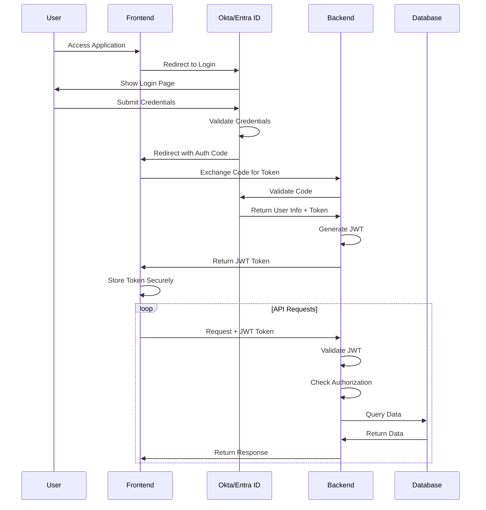
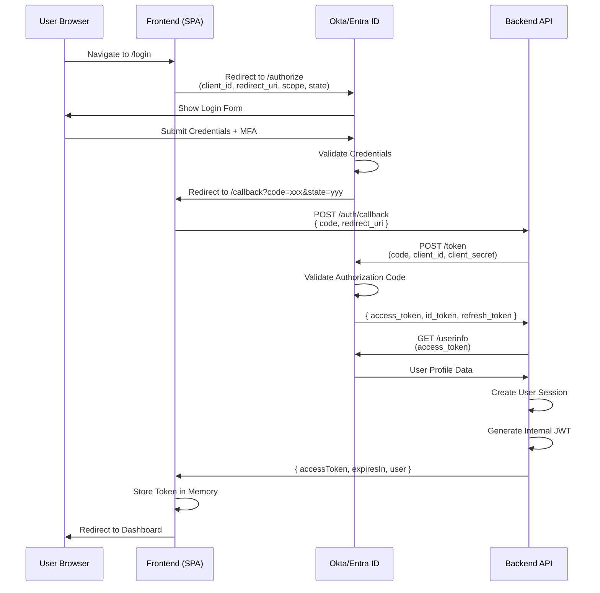

# Sakura V2 - Security & Authentication Implementation

> **Authentication**: Okta + Microsoft Entra ID (Azure AD)  
> **Authorization**: Role-Based Access Control (RBAC)  
> **Tokens**: JWT (JSON Web Tokens)

---

## 📑 Table of Contents

1. [Security Architecture Overview](#security-architecture-overview)
2. [Authentication Flow](#authentication-flow)
3. [Authorization & RBAC](#authorization--rbac)
4. [JWT Token Management](#jwt-token-management)
5. [API Security Implementation](#api-security-implementation)
6. [Frontend Security](#frontend-security)
7. [Data Protection](#data-protection)
8. [Security Best Practices](#security-best-practices)
9. [Vulnerability Management](#vulnerability-management)
10. [Compliance & Auditing](#compliance--auditing)

---

## 🏗️ Security Architecture Overview



### Security Layers

1. **Network Security**
   - HTTPS/TLS 1.2+ only
   - Azure Front Door with WAF (Web Application Firewall)
   - VPN requirement for corporate users
   - IP whitelisting for admin endpoints

2. **Authentication Layer**
   - SSO via Okta + Microsoft Entra ID
   - Multi-factor authentication (MFA) enforced
   - JWT bearer tokens with short expiry
   - Refresh token rotation

3. **Authorization Layer**
   - Role-Based Access Control (RBAC)
   - Resource-level permissions
   - Context-aware authorization (workspace-scoped)
   - Delegation support

4. **Data Security**
   - Encryption at rest (Azure SQL TDE)
   - Encryption in transit (TLS)
   - SQL injection prevention (parameterized queries)
   - Sensitive data masking in logs

5. **Application Security**
   - Input validation at all layers
   - Output encoding
   - CSRF protection
   - XSS prevention
   - Content Security Policy (CSP)

---

## 🔐 Authentication Flow

### OAuth 2.0 + OpenID Connect Flow



### Backend Authentication Implementation

**src/SakuraV2.Api/Controllers/AuthController.cs**:
```csharp
using Microsoft.AspNetCore.Mvc;
using Microsoft.Identity.Web;
using System.IdentityModel.Tokens.Jwt;
using System.Security.Claims;

[ApiController]
[Route("api/v1/auth")]
public class AuthController : ControllerBase
{
    private readonly IConfiguration _configuration;
    private readonly ITokenService _tokenService;
    private readonly IUserService _userService;
    private readonly HttpClient _httpClient;

    public AuthController(
        IConfiguration configuration,
        ITokenService tokenService,
        IUserService userService,
        HttpClient httpClient)
    {
        _configuration = configuration;
        _tokenService = tokenService;
        _userService = userService;
        _httpClient = httpClient;
    }

    [HttpPost("callback")]
    [AllowAnonymous]
    public async Task<IActionResult> Callback([FromBody] CallbackRequest request)
    {
        // Exchange authorization code for tokens
        var tokenResponse = await ExchangeCodeForTokensAsync(request.Code, request.RedirectUri);

        // Get user info from Okta/Entra
        var userInfo = await GetUserInfoAsync(tokenResponse.AccessToken);

        // Find or create user in database
        var user = await _userService.FindOrCreateUserAsync(
            userInfo.Email,
            userInfo.Name,
            userInfo.Sub
        );

        // Generate internal JWT token
        var jwtToken = _tokenService.GenerateToken(user);

        return Ok(new AuthResponse
        {
            AccessToken = jwtToken,
            ExpiresIn = 3600,
            User = new UserDto
            {
                UserId = user.Id,
                Upn = user.UPN,
                DisplayName = user.DisplayName,
                Roles = await _userService.GetUserRolesAsync(user.Id)
            }
        });
    }

    [HttpPost("refresh")]
    [AllowAnonymous]
    public async Task<IActionResult> RefreshToken([FromBody] RefreshTokenRequest request)
    {
        var principal = _tokenService.GetPrincipalFromExpiredToken(request.RefreshToken);
        
        if (principal == null)
            return Unauthorized("Invalid refresh token");

        var userUpn = principal.FindFirst(ClaimTypes.Email)?.Value;
        var user = await _userService.GetByUpnAsync(userUpn);

        if (user == null)
            return Unauthorized("User not found");

        var newToken = _tokenService.GenerateToken(user);

        return Ok(new AuthResponse
        {
            AccessToken = newToken,
            ExpiresIn = 3600
        });
    }

    [HttpPost("logout")]
    [Authorize]
    public IActionResult Logout()
    {
        // Invalidate token (if using token blacklist)
        var token = HttpContext.Request.Headers["Authorization"].ToString().Replace("Bearer ", "");
        _tokenService.RevokeToken(token);

        return Ok(new { message = "Logged out successfully" });
    }

    private async Task<TokenResponse> ExchangeCodeForTokensAsync(string code, string redirectUri)
    {
        var tokenEndpoint = _configuration["Okta:TokenEndpoint"];
        var clientId = _configuration["Okta:ClientId"];
        var clientSecret = _configuration["Okta:ClientSecret"];

        var requestBody = new Dictionary<string, string>
        {
            { "grant_type", "authorization_code" },
            { "code", code },
            { "redirect_uri", redirectUri },
            { "client_id", clientId },
            { "client_secret", clientSecret }
        };

        var response = await _httpClient.PostAsync(
            tokenEndpoint,
            new FormUrlEncodedContent(requestBody)
        );

        response.EnsureSuccessStatusCode();
        return await response.Content.ReadFromJsonAsync<TokenResponse>();
    }

    private async Task<UserInfo> GetUserInfoAsync(string accessToken)
    {
        var userInfoEndpoint = _configuration["Okta:UserInfoEndpoint"];

        _httpClient.DefaultRequestHeaders.Authorization = 
            new System.Net.Http.Headers.AuthenticationHeaderValue("Bearer", accessToken);

        var response = await _httpClient.GetAsync(userInfoEndpoint);
        response.EnsureSuccessStatusCode();

        return await response.Content.ReadFromJsonAsync<UserInfo>();
    }
}

public class CallbackRequest
{
    public string Code { get; set; } = string.Empty;
    public string RedirectUri { get; set; } = string.Empty;
}

public class RefreshTokenRequest
{
    public string RefreshToken { get; set; } = string.Empty;
}

public class TokenResponse
{
    public string AccessToken { get; set; } = string.Empty;
    public string IdToken { get; set; } = string.Empty;
    public string RefreshToken { get; set; } = string.Empty;
    public int ExpiresIn { get; set; }
}

public class UserInfo
{
    public string Sub { get; set; } = string.Empty;
    public string Email { get; set; } = string.Empty;
    public string Name { get; set; } = string.Empty;
}
```

### Token Service Implementation

**src/SakuraV2.Infrastructure/Services/TokenService.cs**:
```csharp
using System.IdentityModel.Tokens.Jwt;
using System.Security.Claims;
using System.Text;
using Microsoft.IdentityModel.Tokens;

public interface ITokenService
{
    string GenerateToken(User user);
    ClaimsPrincipal? GetPrincipalFromExpiredToken(string token);
    void RevokeToken(string token);
}

public class TokenService : ITokenService
{
    private readonly IConfiguration _configuration;
    private readonly ILogger<TokenService> _logger;

    public TokenService(IConfiguration configuration, ILogger<TokenService> logger)
    {
        _configuration = configuration;
        _logger = logger;
    }

    public string GenerateToken(User user)
    {
        var claims = new List<Claim>
        {
            new Claim(ClaimTypes.NameIdentifier, user.Id.ToString()),
            new Claim(ClaimTypes.Email, user.UPN),
            new Claim(ClaimTypes.Name, user.DisplayName ?? user.UPN),
            new Claim("upn", user.UPN),
            new Claim(JwtRegisteredClaimNames.Jti, Guid.NewGuid().ToString())
        };

        // Add roles
        var roles = GetUserRoles(user);
        foreach (var role in roles)
        {
            claims.Add(new Claim(ClaimTypes.Role, role));
        }

        var key = new SymmetricSecurityKey(
            Encoding.UTF8.GetBytes(_configuration["Jwt:Secret"]!)
        );

        var credentials = new SigningCredentials(key, SecurityAlgorithms.HmacSha256);

        var token = new JwtSecurityToken(
            issuer: _configuration["Jwt:Issuer"],
            audience: _configuration["Jwt:Audience"],
            claims: claims,
            expires: DateTime.UtcNow.AddHours(1),
            signingCredentials: credentials
        );

        return new JwtSecurityTokenHandler().WriteToken(token);
    }

    public ClaimsPrincipal? GetPrincipalFromExpiredToken(string token)
    {
        var tokenValidationParameters = new TokenValidationParameters
        {
            ValidateAudience = true,
            ValidateIssuer = true,
            ValidateIssuerSigningKey = true,
            ValidIssuer = _configuration["Jwt:Issuer"],
            ValidAudience = _configuration["Jwt:Audience"],
            IssuerSigningKey = new SymmetricSecurityKey(
                Encoding.UTF8.GetBytes(_configuration["Jwt:Secret"]!)
            ),
            ValidateLifetime = false // Allow expired tokens for refresh
        };

        var tokenHandler = new JwtSecurityTokenHandler();
        
        try
        {
            var principal = tokenHandler.ValidateToken(
                token,
                tokenValidationParameters,
                out SecurityToken securityToken
            );

            if (securityToken is not JwtSecurityToken jwtSecurityToken ||
                !jwtSecurityToken.Header.Alg.Equals(
                    SecurityAlgorithms.HmacSha256,
                    StringComparison.InvariantCultureIgnoreCase))
            {
                return null;
            }

            return principal;
        }
        catch (Exception ex)
        {
            _logger.LogError(ex, "Error validating expired token");
            return null;
        }
    }

    public void RevokeToken(string token)
    {
        // Implementation depends on token blacklist strategy
        // Could use Redis cache or database table
        _logger.LogInformation("Token revoked: {Token}", token.Substring(0, 10) + "...");
    }

    private string[] GetUserRoles(User user)
    {
        // Determine roles based on user properties or database lookup
        var roles = new List<string> { "Requester" };

        // Check if user is approver (simplified)
        // In reality, query approver tables
        roles.Add("Approver");

        // Check if workspace admin
        if (IsWorkspaceAdmin(user))
        {
            roles.Add("Workspace Admin");
        }

        // Check if Sakura admin
        if (IsSakuraAdmin(user))
        {
            roles.Add("Sakura Administrator");
        }

        return roles.ToArray();
    }

    private bool IsWorkspaceAdmin(User user)
    {
        // Query workspace ownership
        return false; // Placeholder
    }

    private bool IsSakuraAdmin(User user)
    {
        // Check against admin list (could be in config or database)
        var adminUpns = _configuration.GetSection("Admins").Get<string[]>();
        return adminUpns?.Contains(user.UPN, StringComparer.OrdinalIgnoreCase) ?? false;
    }
}
```

---

## 🛡️ Authorization & RBAC

### Role Definitions

```csharp
public static class Roles
{
    public const string Requester = "Requester";
    public const string Approver = "Approver";
    public const string WorkspaceAdmin = "Workspace Admin";
    public const string SakuraSupport = "Sakura Support";
    public const string SakuraAdministrator = "Sakura Administrator";
}
```

### Authorization Policies

**Program.cs**:
```csharp
builder.Services.AddAuthorization(options =>
{
    // Admin-only policy
    options.AddPolicy("AdminOnly", policy =>
        policy.RequireRole(Roles.SakuraAdministrator));

    // Workspace Admin or higher
    options.AddPolicy("WorkspaceAdminOrHigher", policy =>
        policy.RequireAssertion(context =>
            context.User.IsInRole(Roles.SakuraAdministrator) ||
            context.User.IsInRole(Roles.WorkspaceAdmin)));

    // Support or Admin (read-only access)
    options.AddPolicy("SupportOrAdmin", policy =>
        policy.RequireAssertion(context =>
            context.User.IsInRole(Roles.SakuraAdministrator) ||
            context.User.IsInRole(Roles.SakuraSupport)));

    // Approver role required
    options.AddPolicy("ApproverOnly", policy =>
        policy.RequireRole(Roles.Approver));
});
```

### Custom Authorization Handler

```csharp
public class WorkspaceOwnershipRequirement : IAuthorizationRequirement
{
    public long WorkspaceId { get; }

    public WorkspaceOwnershipRequirement(long workspaceId)
    {
        WorkspaceId = workspaceId;
    }
}

public class WorkspaceOwnershipHandler : AuthorizationHandler<WorkspaceOwnershipRequirement>
{
    private readonly IWorkspaceRepository _workspaceRepository;

    public WorkspaceOwnershipHandler(IWorkspaceRepository workspaceRepository)
    {
        _workspaceRepository = workspaceRepository;
    }

    protected override async Task HandleRequirementAsync(
        AuthorizationHandlerContext context,
        WorkspaceOwnershipRequirement requirement)
    {
        var userUpn = context.User.GetUserPrincipalName();

        // Admin always has access
        if (context.User.IsInRole(Roles.SakuraAdministrator))
        {
            context.Succeed(requirement);
            return;
        }

        // Check workspace ownership
        var workspace = await _workspaceRepository.GetByIdAsync(requirement.WorkspaceId);
        
        if (workspace != null && 
            (workspace.OwnerUPN == userUpn || workspace.TechOwnerUPN == userUpn))
        {
            context.Succeed(requirement);
        }
    }
}
```

### Using Authorization in Controllers

```csharp
[ApiController]
[Route("api/v1/workspaces")]
[Authorize]
public class WorkspacesController : ControllerBase
{
    [HttpGet]
    [AllowAnonymous] // Public endpoint
    public async Task<IActionResult> GetAll()
    {
        // ...
    }

    [HttpPost]
    [Authorize(Policy = "AdminOnly")]
    public async Task<IActionResult> Create([FromBody] CreateWorkspaceDto dto)
    {
        // Only Sakura Administrators can create workspaces
    }

    [HttpPut("{id}")]
    [Authorize(Policy = "WorkspaceAdminOrHigher")]
    public async Task<IActionResult> Update(long id, [FromBody] UpdateWorkspaceDto dto)
    {
        // Verify ownership
        var userUpn = User.GetUserPrincipalName();
        var workspace = await _workspaceService.GetByIdAsync(id);

        if (!User.IsInRole(Roles.SakuraAdministrator) &&
            workspace.OwnerUPN != userUpn &&
            workspace.TechOwnerUPN != userUpn)
        {
            return Forbid();
        }

        // ...
    }
}
```

---

## 🔑 JWT Token Management

### Token Configuration

**appsettings.json**:
```json
{
  "Jwt": {
    "Secret": "@Microsoft.KeyVault(SecretUri=https://kv-sakura-prod.vault.azure.net/secrets/JwtSecret/)",
    "Issuer": "https://api.sakura.dentsu.com",
    "Audience": "https://sakura.dentsu.com",
    "ExpiryMinutes": 60
  }
}
```

### JWT Authentication Setup

**Program.cs**:
```csharp
var jwtSecret = builder.Configuration["Jwt:Secret"];
var jwtIssuer = builder.Configuration["Jwt:Issuer"];
var jwtAudience = builder.Configuration["Jwt:Audience"];

builder.Services.AddAuthentication(options =>
{
    options.DefaultAuthenticateScheme = JwtBearerDefaults.AuthenticationScheme;
    options.DefaultChallengeScheme = JwtBearerDefaults.AuthenticationScheme;
})
.AddJwtBearer(options =>
{
    options.SaveToken = true;
    options.RequireHttpsMetadata = true;
    options.TokenValidationParameters = new TokenValidationParameters
    {
        ValidateIssuer = true,
        ValidateAudience = true,
        ValidateLifetime = true,
        ValidateIssuerSigningKey = true,
        ValidIssuer = jwtIssuer,
        ValidAudience = jwtAudience,
        IssuerSigningKey = new SymmetricSecurityKey(
            Encoding.UTF8.GetBytes(jwtSecret!)
        ),
        ClockSkew = TimeSpan.Zero // No tolerance for expiry
    };

    // Handle token validation events
    options.Events = new JwtBearerEvents
    {
        OnAuthenticationFailed = context =>
        {
            if (context.Exception.GetType() == typeof(SecurityTokenExpiredException))
            {
                context.Response.Headers.Add("Token-Expired", "true");
            }
            return Task.CompletedTask;
        },
        OnChallenge = context =>
        {
            context.HandleResponse();
            context.Response.StatusCode = 401;
            context.Response.ContentType = "application/json";
            
            var result = JsonSerializer.Serialize(new
            {
                error = "You are not authorized to access this resource",
                statusCode = 401
            });
            
            return context.Response.WriteAsync(result);
        }
    };
});
```

---

## 🔒 Data Protection

### Sensitive Data Encryption

```csharp
using Microsoft.AspNetCore.DataProtection;

public class SensitiveDataService
{
    private readonly IDataProtector _protector;

    public SensitiveDataService(IDataProtectionProvider provider)
    {
        _protector = provider.CreateProtector("SakuraV2.SensitiveData");
    }

    public string Encrypt(string plainText)
    {
        return _protector.Protect(plainText);
    }

    public string Decrypt(string cipherText)
    {
        return _protector.Unprotect(cipherText);
    }
}
```

### SQL Injection Prevention

```csharp
// GOOD: Parameterized query
var results = await _context.Requests
    .Where(r => r.RequestedForUPN == userUpn)
    .ToListAsync();

// GOOD: EF Core prevents SQL injection
var results = await _context.Requests
    .FromSqlRaw("SELECT * FROM req.Requests WHERE RequestedForUPN = {0}", userUpn)
    .ToListAsync();

// BAD: Never concatenate user input into SQL
// var sql = $"SELECT * FROM req.Requests WHERE RequestedForUPN = '{userUpn}'";
```

### Input Validation

```csharp
public class CreateRequestValidator : AbstractValidator<CreateRequestDto>
{
    public CreateRequestValidator()
    {
        RuleFor(x => x.WorkspaceId)
            .GreaterThan(0)
            .WithMessage("Workspace ID must be positive");

        RuleFor(x => x.RequestedForUPN)
            .EmailAddress()
            .When(x => !string.IsNullOrEmpty(x.RequestedForUPN))
            .WithMessage("Invalid email address");

        RuleFor(x => x.Comments)
            .MaximumLength(500)
            .WithMessage("Comments cannot exceed 500 characters");

        // Prevent XSS
        RuleFor(x => x.Comments)
            .Must(BeValidText)
            .WithMessage("Comments contain invalid characters");
    }

    private bool BeValidText(string? text)
    {
        if (string.IsNullOrEmpty(text))
            return true;

        // Check for script tags, javascript:, etc.
        var dangerousPatterns = new[]
        {
            "<script", "javascript:", "onerror=", "onclick="
        };

        return !dangerousPatterns.Any(pattern => 
            text.Contains(pattern, StringComparison.OrdinalIgnoreCase));
    }
}
```

---

## 🌐 Frontend Security

### Content Security Policy

**index.html**:
```html
<meta http-equiv="Content-Security-Policy" content="
  default-src 'self';
  script-src 'self' 'unsafe-inline' https://cdn.okta.com;
  style-src 'self' 'unsafe-inline';
  img-src 'self' data: https:;
  font-src 'self';
  connect-src 'self' https://api.sakura.dentsu.com https://dentsu.okta.com;
  frame-ancestors 'none';
">
```

### XSS Prevention

```typescript
import { DomSanitizer, SafeHtml } from '@angular/platform-browser';

@Component({
  template: `
    <!-- SAFE: Angular auto-escapes -->
    <p>{{ userInput }}</p>
    
    <!-- SAFE: Using sanitizer -->
    <div [innerHTML]="sanitizedHtml"></div>
    
    <!-- UNSAFE: Never use [innerHTML] with raw user input -->
    <!-- <div [innerHTML]="userInput"></div> -->
  `
})
export class MyComponent {
  userInput = '<script>alert("XSS")</script>'; // Will be escaped
  sanitizedHtml: SafeHtml;

  constructor(private sanitizer: DomSanitizer) {
    this.sanitizedHtml = this.sanitizer.sanitize(
      SecurityContext.HTML,
      this.userInput
    ) || '';
  }
}
```

### CSRF Protection

```typescript
// Angular HttpClient includes CSRF protection by default
// Sends X-XSRF-TOKEN header with requests

@Injectable()
export class HttpXsrfInterceptor implements HttpInterceptor {
  constructor(private tokenService: HttpXsrfTokenExtractor) {}

  intercept(req: HttpRequest<any>, next: HttpHandler): Observable<HttpEvent<any>> {
    const token = this.tokenService.getToken();

    if (token && !req.headers.has('X-XSRF-TOKEN')) {
      req = req.clone({
        headers: req.headers.set('X-XSRF-TOKEN', token)
      });
    }

    return next.handle(req);
  }
}
```

### Secure Token Storage

```typescript
// GOOD: Store in memory (most secure for SPAs)
export class AuthService {
  private tokenSubject = new BehaviorSubject<string | null>(null);

  setToken(token: string): void {
    this.tokenSubject.next(token);
  }

  getToken(): string | null {
    return this.tokenSubject.value;
  }
}

// ACCEPTABLE: sessionStorage (cleared on tab close)
sessionStorage.setItem('token', token);

// AVOID: localStorage (persists across sessions, vulnerable to XSS)
// localStorage.setItem('token', token);
```

---

## 🔍 Security Best Practices

### 1. Principle of Least Privilege

```csharp
// Grant minimum necessary permissions
[Authorize(Roles = "Requester")] // Not "Admin" for basic requests
public async Task<IActionResult> CreateRequest(CreateRequestDto dto)
{
    // Only allow users to request for themselves or if authorized
    var currentUserUpn = User.GetUserPrincipalName();
    
    if (!string.IsNullOrEmpty(dto.RequestedForUPN) && 
        dto.RequestedForUPN != currentUserUpn &&
        !User.IsInRole(Roles.WorkspaceAdmin))
    {
        return Forbid("You cannot request on behalf of others");
    }

    // ...
}
```

### 2. Secure Secrets Management

```csharp
// ✅ GOOD: Load from Key Vault
var secret = builder.Configuration["@Microsoft.KeyVault(...)"];

// ❌ BAD: Hard-coded secrets
// var secret = "my-super-secret-key-12345";

// ❌ BAD: Secrets in appsettings.json (committed to source control)
// "ConnectionStrings": { "Default": "Server=...;Password=MySuperSecret" }
```

### 3. Audit Logging

```csharp
public class AuditActionFilter : IAsyncActionFilter
{
    private readonly IAuditService _auditService;

    public async Task OnActionExecutionAsync(
        ActionExecutingContext context,
        ActionExecutionDelegate next)
    {
        var userUpn = context.HttpContext.User.GetUserPrincipalName();
        var action = context.ActionDescriptor.DisplayName;
        var method = context.HttpContext.Request.Method;
        var path = context.HttpContext.Request.Path;

        await _auditService.LogAsync(new AuditLog
        {
            UserUpn = userUpn,
            Action = action,
            Method = method,
            Path = path,
            Timestamp = DateTime.UtcNow,
            IpAddress = context.HttpContext.Connection.RemoteIpAddress?.ToString()
        });

        await next();
    }
}
```

### 4. Rate Limiting

```csharp
using AspNetCoreRateLimit;

// Startup.cs or Program.cs
builder.Services.AddMemoryCache();
builder.Services.Configure<IpRateLimitOptions>(options =>
{
    options.GeneralRules = new List<RateLimitRule>
    {
        new RateLimitRule
        {
            Endpoint = "*",
            Limit = 100,
            Period = "1m"
        },
        new RateLimitRule
        {
            Endpoint = "*/auth/*",
            Limit = 10,
            Period = "1m"
        }
    };
});

builder.Services.AddSingleton<IIpPolicyStore, MemoryCacheIpPolicyStore>();
builder.Services.AddSingleton<IRateLimitCounterStore, MemoryCacheRateLimitCounterStore>();
builder.Services.AddSingleton<IRateLimitConfiguration, RateLimitConfiguration>();

app.UseIpRateLimiting();
```

---

## 🚨 Vulnerability Management

### Dependency Scanning

**.github/workflows/security-scan.yml**:
```yaml
name: Security Scan

on:
  schedule:
    - cron: '0 0 * * 0' # Weekly
  push:
    branches: [main]

jobs:
  scan-backend:
    runs-on: ubuntu-latest
    steps:
      - uses: actions/checkout@v4
      
      - name: Run Trivy vulnerability scanner
        uses: aquasecurity/trivy-action@master
        with:
          scan-type: 'fs'
          scan-ref: './BE'
          format: 'sarif'
          output: 'trivy-results.sarif'
      
      - name: Upload Trivy results to GitHub Security
        uses: github/codeql-action/upload-sarif@v2
        with:
          sarif_file: 'trivy-results.sarif'

  scan-frontend:
    runs-on: ubuntu-latest
    steps:
      - uses: actions/checkout@v4
      
      - name: Run npm audit
        working-directory: FE/application
        run: npm audit --audit-level=moderate
```

### OWASP Top 10 Compliance

| Risk | Mitigation |
|------|-----------|
| **A01: Broken Access Control** | Role-based authorization, resource-level checks |
| **A02: Cryptographic Failures** | TLS 1.2+, Azure SQL TDE, secure token storage |
| **A03: Injection** | Parameterized queries, input validation |
| **A04: Insecure Design** | Security reviews, threat modeling |
| **A05: Security Misconfiguration** | Hardened configs, secrets in Key Vault |
| **A06: Vulnerable Components** | Dependency scanning, regular updates |
| **A07: Auth Failures** | MFA enforced, JWT with short expiry |
| **A08: Data Integrity Failures** | Code signing, integrity checks |
| **A09: Logging Failures** | Comprehensive audit logs, monitoring |
| **A10: SSRF** | Input validation, URL whitelist |

---

## 📋 Compliance & Auditing

### GDPR Compliance

- **Right to Access**: API endpoint to export user data
- **Right to Erasure**: Soft delete with anonymization option
- **Data Minimization**: Only collect necessary information
- **Consent**: Explicit consent for data processing
- **Audit Trail**: All access logged

### Audit Log Retention

```sql
-- Retain audit logs for 7 years
CREATE TABLE log.AuditLogs (
    LogId BIGINT IDENTITY(1,1) PRIMARY KEY,
    UserUpn NVARCHAR(256) NOT NULL,
    Action NVARCHAR(200) NOT NULL,
    ResourceType NVARCHAR(100),
    ResourceId BIGINT,
    Timestamp DATETIME2(3) NOT NULL,
    IpAddress NVARCHAR(45),
    UserAgent NVARCHAR(500),
    Details NVARCHAR(MAX)
);

-- Partitioning for performance
CREATE PARTITION FUNCTION PF_AuditLog_Timestamp (DATETIME2(3))
AS RANGE RIGHT FOR VALUES (
    '2025-01-01', '2026-01-01', '2027-01-01', '2028-01-01',
    '2029-01-01', '2030-01-01', '2031-01-01', '2032-01-01'
);
```

---

## ✅ Security Checklist

### Pre-Deployment

- [ ] All secrets stored in Azure Key Vault
- [ ] HTTPS/TLS 1.2+ enforced
- [ ] Input validation on all endpoints
- [ ] SQL injection protection verified
- [ ] XSS prevention mechanisms in place
- [ ] CSRF protection enabled
- [ ] Rate limiting configured
- [ ] Dependency vulnerabilities scanned
- [ ] Security headers configured
- [ ] Audit logging enabled

### Post-Deployment

- [ ] Penetration testing completed
- [ ] Security monitoring alerts configured
- [ ] Incident response plan documented
- [ ] Backup and recovery tested
- [ ] Access controls reviewed
- [ ] Compliance requirements met

---

**Documentation Complete! 🎉**

All 7 comprehensive documents have been created covering:
1. Master Architecture Overview
2. Backend Architecture
3. Complete API Design
4. Database Integration
5. Frontend Integration
6. Azure Deployment
7. Security & Authentication

These documents provide a complete blueprint for implementing Sakura V2 with robust, scalable, and secure architecture.

