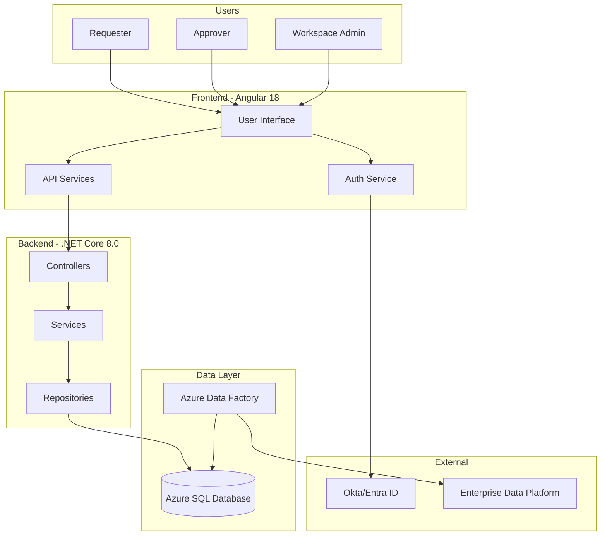

# Sakura V2 - Complete Technical Documentation

> **Version**: 2.0  
> **Last Updated**: October 16, 2025  
> **Status**: Complete Implementation Guide

---

## 📚 Documentation Overview

This documentation provides a **complete, production-ready blueprint** for implementing Sakura V2, an enterprise-grade access request and approval management system for dentsu's Power BI ecosystem.

---

## 📑 Documentation Structure

### 1. **[Master Architecture Overview](./00-MASTER-ARCHITECTURE-OVERVIEW.md)**
**Start here!** High-level system design, technology stack, and architectural decisions.

**Topics Covered:**
- Executive summary & system overview
- High-level architecture diagrams
- Technology stack rationale
- Azure deployment overview
- User roles & permissions matrix
- Performance requirements
- Non-functional requirements

**Who should read this:** Everyone - Project managers, architects, developers, stakeholders

---

### 2. **[Backend Architecture](./01-BACKEND-ARCHITECTURE.md)**
Deep dive into .NET Core 8.0 backend structure using Clean Architecture pattern.

**Topics Covered:**
- Project structure & layer responsibilities
- Domain layer (entities, value objects, interfaces)
- Application layer (services, DTOs, validators)
- Infrastructure layer (EF Core, repositories)
- Presentation layer (API controllers, middleware)
- Dependency injection setup
- Cross-cutting concerns

**Who should read this:** Backend developers, software architects

**Key Takeaways:**
- ✅ Clean Architecture (Onion) for maintainability
- ✅ Domain-driven design principles
- ✅ Repository pattern with EF Core 8.0
- ✅ SOLID principles throughout

---

### 3. **[Complete API Design](./02-API-DESIGN-COMPLETE.md)**
Comprehensive API reference with all endpoints, DTOs, and business logic flows.

**Topics Covered:**
- RESTful API standards & conventions
- Authentication & authorization APIs
- User management APIs
- Workspace & app management APIs
- Request lifecycle APIs (create, approve, reject, revoke)
- Approval workflow APIs
- Catalogue search APIs
- Security model & approver APIs
- Administration APIs
- Complete business logic with Mermaid diagrams

**Who should read this:** Full-stack developers, frontend developers, API consumers

**Highlights:**
- 📡 50+ API endpoints documented
- 📊 Request/response examples for every endpoint
- 🔄 Complete business logic flows with sequence diagrams
- 🛡️ Authorization matrix by role

---

### 4. **[Database Integration & Data Flow](./03-DATABASE-INTEGRATION.md)**
Entity Framework Core configuration, repository patterns, and ETL pipeline design.

**Topics Covered:**
- Azure SQL Database connection setup
- EF Core 8.0 DbContext configuration
- Entity configurations with Fluent API
- Generic repository pattern implementation
- Query optimization strategies (compiled queries, indexes)
- Azure Data Factory ETL pipelines
- Data import stored procedures
- Transaction management (Unit of Work pattern)
- Migration strategy
- Performance monitoring

**Who should read this:** Backend developers, database administrators, data engineers

**Key Features:**
- 🗄️ 7 database schemas (core, sec, req, admin, log, imp, shr)
- ⚡ Query optimization with compiled queries
- 🔄 Automated ETL for security dimensions
- 📊 Stored procedures for complex imports

---

### 5. **[Frontend Integration Guide](./04-FRONTEND-INTEGRATION.md)**
Angular 18 SPA integration with backend APIs and state management patterns.

**Topics Covered:**
- Angular project structure
- HTTP client configuration with interceptors
- Authentication flow (Okta/Entra ID integration)
- JWT token management
- State management with RxJS & Services
- API service layer architecture
- Component communication patterns
- Routing & route guards
- Error handling strategies
- Performance optimization (lazy loading, OnPush, virtual scrolling)

**Who should read this:** Frontend developers, Angular developers

**Highlights:**
- 🎨 Angular 18 with standalone components
- 🔐 Secure authentication flow
- 🚀 Performance-optimized with OnPush & signals
- 📡 Type-safe API client with TypeScript

---

### 6. **[Azure Deployment & DevOps](./05-DEPLOYMENT-AZURE.md)**
Complete guide to deploying Sakura V2 on Microsoft Azure with CI/CD pipelines.

**Topics Covered:**
- Azure resource architecture (Resource Groups, naming conventions)
- Infrastructure as Code with Bicep templates
- Frontend deployment (Azure Static Web Apps)
- Backend deployment (App Service with staging slots)
- Azure SQL Database setup & migrations
- GitHub Actions CI/CD pipelines
- Environment configuration & secrets management
- Application Insights monitoring
- Backup & disaster recovery
- Auto-scaling strategy

**Who should read this:** DevOps engineers, cloud architects, infrastructure team

**Azure Resources:**
- 🌐 Azure Static Web App (Frontend)
- 🚀 Azure App Service Premium P1v3 (Backend)
- 🗄️ Azure SQL Database Standard S2
- 🔑 Azure Key Vault (Secrets)
- 📊 Application Insights (Monitoring)
- 🔄 Azure Data Factory (ETL)

**Estimated Monthly Cost:** $350-400 USD

---

### 7. **[Security & Authentication](./06-SECURITY-AUTHENTICATION.md)**
Comprehensive security implementation guide covering authentication, authorization, and best practices.

**Topics Covered:**
- Security architecture layers
- OAuth 2.0 + OpenID Connect authentication flow
- Okta + Microsoft Entra ID integration
- JWT token generation & validation
- Role-Based Access Control (RBAC)
- Custom authorization handlers
- Data protection & encryption
- SQL injection prevention
- Input validation strategies
- XSS & CSRF protection
- Frontend security (CSP, secure token storage)
- Security best practices
- OWASP Top 10 compliance
- Vulnerability management
- Audit logging & compliance (GDPR)

**Who should read this:** Security engineers, backend developers, compliance officers

**Security Highlights:**
- 🔐 Multi-factor authentication enforced
- 🛡️ JWT tokens with 1-hour expiry
- 🔑 Secrets in Azure Key Vault
- 📜 Comprehensive audit logging
- ✅ OWASP Top 10 compliant

---

## 🎯 Quick Start Guides

### For Developers (New to Project)

1. **Read**: [00-MASTER-ARCHITECTURE-OVERVIEW.md](./00-MASTER-ARCHITECTURE-OVERVIEW.md)
2. **Review**: Your role's specific guide:
   - Backend → [01-BACKEND-ARCHITECTURE.md](./01-BACKEND-ARCHITECTURE.md)
   - Frontend → [04-FRONTEND-INTEGRATION.md](./04-FRONTEND-INTEGRATION.md)
3. **Reference**: [02-API-DESIGN-COMPLETE.md](./02-API-DESIGN-COMPLETE.md) for endpoints
4. **Setup**: Local development environment

### For Architects

1. **Read**: All documents in order (00 → 06)
2. **Focus**: Architecture diagrams and design decisions
3. **Review**: Technology stack justification
4. **Validate**: Against organizational standards

### For DevOps Engineers

1. **Read**: [00-MASTER-ARCHITECTURE-OVERVIEW.md](./00-MASTER-ARCHITECTURE-OVERVIEW.md)
2. **Study**: [05-DEPLOYMENT-AZURE.md](./05-DEPLOYMENT-AZURE.md)
3. **Review**: [06-SECURITY-AUTHENTICATION.md](./06-SECURITY-AUTHENTICATION.md)
4. **Setup**: Azure resources and CI/CD pipelines

### For Security Team

1. **Read**: [06-SECURITY-AUTHENTICATION.md](./06-SECURITY-AUTHENTICATION.md)
2. **Review**: Authentication flows and authorization logic
3. **Validate**: Against security policies
4. **Audit**: Security checklist completion

---

## 🔄 System Flow Overview

---

## 📊 Key Metrics & Requirements

| Metric | Target | Measured By |
|--------|--------|-------------|
| API Response Time (p95) | < 500ms | Application Insights |
| Page Load Time | < 2s | Lighthouse |
| Database Query Time | < 200ms | SQL Query Store |
| Concurrent Users | 500+ | Load Testing |
| Request Throughput | 100 req/sec | Load Testing |
| System Availability | 99.5% | Azure Monitor |
| Test Coverage | 80%+ | Code Coverage Tools |

---

## 🏗️ Technology Stack Summary

### Frontend
- **Framework**: Angular 18.x
- **Language**: TypeScript 5.x
- **State Management**: RxJS + Services
- **Styling**: Custom CSS + CSS Variables
- **Build**: Angular CLI + esbuild
- **Deployment**: Azure Static Web Apps

### Backend
- **Framework**: ASP.NET Core 8.0 Web API
- **Language**: C# 12
- **Architecture**: Clean Architecture (Onion)
- **ORM**: Entity Framework Core 8.0
- **Authentication**: Microsoft.Identity.Web
- **Logging**: Serilog
- **API Docs**: Swagger/OpenAPI 3.0

### Database
- **Primary**: Azure SQL Database (Standard S2)
- **Migrations**: EF Core Migrations
- **ETL**: Azure Data Factory
- **Backup**: Geo-redundant backups (7-year retention)

### Infrastructure
- **Cloud**: Microsoft Azure
- **Frontend Host**: Azure Static Web Apps
- **Backend Host**: Azure App Service (Premium P1v3)
- **Identity**: Okta + Microsoft Entra ID
- **Secrets**: Azure Key Vault
- **Monitoring**: Application Insights
- **CI/CD**: GitHub Actions

---

## 🚀 Implementation Roadmap

### Phase 1: Foundation (Weeks 1-4)
- [x] Database schema implementation
- [x] Backend project structure
- [x] Authentication & authorization
- [x] Core domain entities
- [x] Basic CRUD APIs

### Phase 2: Core Features (Weeks 5-10)
- [ ] Request submission wizard (frontend)
- [ ] Approval workflow engine
- [ ] Email notification service
- [ ] Catalogue search
- [ ] User access views

### Phase 3: Administration (Weeks 11-14)
- [ ] Workspace admin console
- [ ] Security model management
- [ ] Approver assignment UI
- [ ] Audit log viewer

### Phase 4: Polish & Deploy (Weeks 15-16)
- [ ] Performance optimization
- [ ] Security audit
- [ ] Load testing
- [ ] Documentation finalization
- [ ] Production deployment

---

## 📞 Support & Resources

### Internal Resources
- **Functional Design Doc**: [fdd.pdf](../fdd.pdf)
- **Database Design**: [db-design.md](../FE/application/db-design.md)
- **Frontend Code**: `/FE/application/`
- **Backend Code**: `/BE/`

### External Resources
- **Angular Docs**: https://angular.io/docs
- **ASP.NET Core Docs**: https://docs.microsoft.com/aspnet/core
- **Azure Docs**: https://docs.microsoft.com/azure
- **Entity Framework Core**: https://docs.microsoft.com/ef/core

---

## ✅ Documentation Checklist

- [x] Architecture diagrams with Mermaid
- [x] Complete API reference
- [x] Database schema documentation
- [x] Frontend integration guide
- [x] Deployment procedures
- [x] Security implementation
- [x] Code examples for all layers
- [x] Sequence diagrams for business flows
- [x] Configuration examples
- [x] Performance optimization strategies
- [x] Monitoring & observability setup
- [x] Backup & disaster recovery

---

## 🎓 Learning Path

### Beginner (New to Stack)
1. Review Angular 18 fundamentals
2. Study ASP.NET Core basics
3. Understand Entity Framework Core
4. Learn Azure basics

### Intermediate (Familiar with Stack)
1. Study Clean Architecture pattern
2. Review CQRS principles
3. Understand JWT authentication
4. Learn Azure deployment

### Advanced (Ready to Implement)
1. Deep dive into business logic flows
2. Study workspace-specific RLS requirements
3. Review approval workflow algorithms
4. Implement custom features

---

## 🔥 Critical Implementation Notes

### ⚠️ Must-Do's

1. **Never commit secrets** - Use Azure Key Vault
2. **Always parameterize SQL** - Prevent SQL injection
3. **Validate all inputs** - Both client and server side
4. **Log everything** - Comprehensive audit trail
5. **Test security** - Penetration testing required
6. **Review PRs** - No direct commits to main
7. **Run migrations carefully** - Test in staging first
8. **Monitor performance** - Set up alerts

### 🚫 Never Do

- ❌ Hard-code connection strings
- ❌ Bypass authentication/authorization
- ❌ Skip input validation
- ❌ Ignore linter warnings
- ❌ Deploy without testing
- ❌ Force push to main branch
- ❌ Expose sensitive data in logs

---

## 📄 Document Maintenance

This documentation should be updated when:
- Architecture changes are made
- New features are added
- APIs are modified
- Security practices evolve
- Deployment procedures change
- Performance characteristics shift

**Responsibility**: Technical Lead  
**Review Frequency**: Monthly  
**Version Control**: Git (same repo as code)

---

## 🌟 Success Criteria

This documentation is successful if:
- ✅ New developers can onboard in < 2 weeks
- ✅ Any team member can understand the full system
- ✅ Implementation matches documented design
- ✅ Zero production incidents due to misunderstanding
- ✅ Security audits pass without major findings
- ✅ Code reviews reference documentation

---

**Documentation Status**: ✅ **COMPLETE**  
**Last Updated**: October 16, 2025  
**Next Review**: November 16, 2025  

---

*Built with ❤️ for dentsu by the Sakura V2 team*

