# Azure AD + MSAL Integration - Detailed Architecture Diagrams

> **Purpose**: Comprehensive visual documentation of how Azure AD authentication works in Sakura V2  
> **Status**: Complete technical diagrams  
> **Date**: November 2025

---

## 📊 Table of Contents

1. [High-Level Architecture Overview](#1-high-level-architecture-overview)
2. [Complete Authentication Flow](#2-complete-authentication-flow)
3. [Frontend MSAL Initialization](#3-frontend-msal-initialization)
4. [Microsoft Identity Platform Flow](#4-microsoft-identity-platform-flow)
5. [Backend Token Validation](#5-backend-token-validation)
6. [Role Management & Authorization](#6-role-management--authorization)
7. [API Request with Token](#7-api-request-with-token)
8. [User Provisioning Flow](#8-user-provisioning-flow)
9. [Token Refresh Flow](#9-token-refresh-flow)
10. [Logout Flow](#10-logout-flow)
11. [Multi-Tab Session Management](#11-multi-tab-session-management)

---

## 1. High-Level Architecture Overview

```mermaid
graph TB
    subgraph "Browser"
        A[Angular SPA<br/>localhost:4200]
        A1[MSAL Browser<br/>@azure/msal-browser]
        A2[MSAL Angular<br/>@azure/msal-angular]
        A3[HTTP Interceptor<br/>MsalInterceptor]
        A4[Route Guard<br/>MsalGuard]
        Cache[Local Storage<br/>msal.account.keys<br/>msal.idtoken<br/>msal.accesstoken]
        A --> A1
        A --> A2
        A2 --> A3
        A2 --> A4
        A1 -->|"Token Cache<br/>(LocalStorage)"| Cache
    end

    subgraph "Microsoft Identity Platform"
        B[Azure AD<br/>login.microsoftonline.com]
        B1[Tenant: dentsu<br/>6e8992ec-76d5-4ea5-8eae-b0c5e558749a]
        B2[Frontend SPA App Registration<br/>Client ID: [SPA-CLIENT-ID]]
        B3[Backend API App Registration<br/>Client ID: [API-CLIENT-ID]]
        B4[API Scope<br/>api://[API-CLIENT-ID]/access_as_user]
        B --> B1
        B1 --> B2
        B1 --> B3
        B3 --> B4
    end

    subgraph "Backend API"
        C[ASP.NET Core 8.0 API<br/>localhost:7238]
        C1[Microsoft.Identity.Web<br/>JwtBearerAuthentication]
        C2[Token Validation<br/>JwtSecurityTokenHandler]
        C3[ClaimsPrincipal<br/>User.Identity]
        C4[Authorization Policies<br/>Requester, Approver, Admin]
        C5[Controllers<br/>[Authorize] attributes]
        C --> C1
        C1 --> C2
        C2 --> C3
        C3 --> C4
        C4 --> C5
    end

    subgraph "Sakura Database"
        D[(SQL Server)]
        D1[core.Users<br/>User info cache]
        D2[sec.OLSApprovers<br/>Organization approvers]
        D3[sec.RLSApprovers<br/>Regional approvers]
        D4[core.Workspaces<br/>Workspace ownership]
        D --> D1
        D --> D2
        D --> D3
        D --> D4
    end

    A3 -->|"HTTPS Request<br/>Authorization: Bearer {token}"| C
    A2 -->|"Redirect<br/>OAuth 2.0 + PKCE"| B
    B -->|"ID Token + Access Token<br/>Authorization Code"| A1
    C2 -->|"Validate Token<br/>Check signature, expiry"| B
    C5 -->|"Query User Roles<br/>Check database"| D

    style A fill:#e1f5ff
    style B fill:#0078d4,color:#fff
    style C fill:#68217a,color:#fff
    style D fill:#00a4ef,color:#fff
```

---

## 2. Complete Authentication Flow

```mermaid
sequenceDiagram
    participant U as User
    participant A as Angular App<br/>(localhost:4200)
    participant MSAL as MSAL Angular<br/>(Browser)
    participant AZURE as Azure AD<br/>(login.microsoftonline.com)
    participant API as Backend API<br/>(localhost:7238)
    participant DB as Sakura Database

    Note over U,DB: === PHASE 1: Initial Page Load ===
    
    U->>A: Navigate to http://localhost:4200
    A->>MSAL: App Component ngOnInit()
    MSAL->>MSAL: Initialize PublicClientApplication
    MSAL->>MSAL: Check localStorage for cached tokens
    MSAL->>MSAL: handleRedirectPromise()
    
    alt No cached tokens found
        MSAL->>A: No active account
        A->>A: Route Guard: MsalGuard.checkAccount()
        A->>A: Redirect to /login page
        A->>U: Show "Sign in with Microsoft" button
    else Cached token found
        MSAL->>MSAL: setActiveAccount(cachedAccount)
        A->>U: Show dashboard (already authenticated)
    end

    Note over U,DB: === PHASE 2: User Clicks Login ===
    
    U->>A: Click "Sign in with Microsoft"
    A->>MSAL: loginRedirect(request)
    MSAL->>MSAL: Generate PKCE code verifier
    MSAL->>MSAL: Generate state parameter
    MSAL->>AZURE: Redirect to:<br/>https://login.microsoftonline.com/[tenant]/oauth2/v2.0/authorize?<br/>client_id=[SPA-CLIENT-ID]<br/>&response_type=code<br/>&redirect_uri=http://localhost:4200<br/>&scope=api://[API-CLIENT-ID]/access_as_user<br/>&code_challenge=[PKCE]<br/>&state=[state]

    Note over U,DB: === PHASE 3: Azure AD Authentication ===
    
    AZURE->>U: Show Azure AD login page<br/>(dentsu branding)
    U->>AZURE: Enter email: user@dentsu.com
    U->>AZURE: Enter password
    AZURE->>AZURE: Validate credentials
    AZURE->>AZURE: Check MFA requirements
    AZURE->>U: Prompt for MFA (if required)
    U->>AZURE: Complete MFA challenge
    AZURE->>AZURE: Validate MFA
    
    Note over U,DB: === PHASE 4: Token Issuance ===
    
    AZURE->>AZURE: Generate Authorization Code
    AZURE->>MSAL: Redirect to:<br/>http://localhost:4200?code=[auth-code]&state=[state]
    MSAL->>MSAL: Validate state parameter
    MSAL->>AZURE: Exchange code for tokens:<br/>POST /oauth2/v2.0/token<br/>grant_type=authorization_code<br/>code=[auth-code]<br/>client_id=[SPA-CLIENT-ID]<br/>code_verifier=[PKCE-verifier]
    
    AZURE->>AZURE: Validate code_verifier
    AZURE->>AZURE: Generate ID Token (JWT)
    AZURE->>AZURE: Generate Access Token (JWT)
    AZURE->>AZURE: Generate Refresh Token
    
    AZURE->>MSAL: Response:<br/>{<br/>  "id_token": "eyJ0eXAi...",<br/>  "access_token": "eyJ0eXAi...",<br/>  "refresh_token": "...",<br/>  "expires_in": 3600<br/>}
    
    Note over U,DB: === PHASE 5: Token Storage & Account Setup ===
    
    MSAL->>MSAL: Parse ID Token claims:<br/>- preferred_username: user@dentsu.com<br/>- name: John Doe<br/>- oid: [object-id]<br/>- email: user@dentsu.com
    MSAL->>MSAL: Cache tokens in localStorage:<br/>- msal.account.keys<br/>- msal.idtoken.[account-id]<br/>- msal.accesstoken.[account-id].[scope]
    MSAL->>MSAL: setActiveAccount(accountInfo)
    MSAL->>A: Emit LOGIN_SUCCESS event
    A->>A: Route to dashboard

    Note over U,DB: === PHASE 6: First API Call ===
    
    A->>A: Component loads (e.g., MyRequestsComponent)
    A->>MSAL: HTTP Request: GET /api/v1/requests
    MSAL->>MSAL: MsalInterceptor intercepts request
    MSAL->>MSAL: Check if token needed:<br/>URL matches protectedResourceMap?
    MSAL->>MSAL: Get token from cache:<br/>acquireTokenSilent()
    
    alt Token expired or missing
        MSAL->>AZURE: Silent token refresh:<br/>acquireTokenSilent({scopes, account})
        AZURE->>MSAL: New access token
        MSAL->>MSAL: Update cache
    end
    
    MSAL->>API: HTTP Request with header:<br/>Authorization: Bearer eyJ0eXAi...

    Note over U,DB: === PHASE 7: Backend Token Validation ===
    
    API->>API: JwtBearerAuthentication middleware
    API->>API: Extract token from Authorization header
    API->>AZURE: Validate token signature:<br/>GET https://login.microsoftonline.com/[tenant]/discovery/v2.0/keys
    AZURE->>API: JWKS (JSON Web Key Set)
    API->>API: Verify token signature using JWKS
    API->>API: Validate claims:<br/>- aud (audience) = api://[API-CLIENT-ID]<br/>- iss (issuer) = https://login.microsoftonline.com/[tenant]/v2.0<br/>- exp (expiration) > now<br/>- scp (scope) contains "access_as_user"
    API->>API: Create ClaimsPrincipal:<br/>- User.Identity.Name = preferred_username<br/>- User.Claims = all token claims
    
    API->>API: Log: "=== AZURE AD TOKEN VALIDATED ==="<br/>User: user@dentsu.com

    Note over U,DB: === PHASE 8: User Lookup & Role Assignment ===
    
    API->>DB: SELECT * FROM core.Users<br/>WHERE Email = 'user@dentsu.com'
    
    alt User exists in database
        DB->>API: User record found:<br/>{UserId, Email, Name, ...}
        API->>API: Use existing UserId
    else User not found
        API->>API: Create new user record
        API->>DB: INSERT INTO core.Users<br/>(Email, Name, ObjectId, ...)<br/>VALUES ('user@dentsu.com', 'John Doe', '[oid]', ...)
        DB->>API: New UserId returned
    end
    
    API->>DB: Query user roles:<br/>- Check sec.OLSApprovers<br/>- Check sec.RLSApprovers<br/>- Check core.Workspaces (workspace admin)<br/>- Check config (SakuraAdmin)
    DB->>API: Role assignments:<br/>{IsRequester: true,<br/>IsApprover: true (OLS),<br/>IsWorkspaceAdmin: true,<br/>IsSakuraAdmin: false}

    Note over U,DB: === PHASE 9: Authorization Check ===
    
    API->>API: [Authorize(Policy="Requester")] check
    API->>API: User is authenticated? ✅<br/>Policy allows? ✅
    API->>API: Execute controller method
    API->>DB: SELECT * FROM core.Requests<br/>WHERE RequesterId = [UserId]
    DB->>API: Request data returned
    API->>MSAL: HTTP 200 OK<br/>{data: [...]}
    MSAL->>A: Response data
    A->>U: Display requests in UI

    Note over U,DB: ✅ Authentication & Authorization Complete
```



---

## 3. Frontend MSAL Initialization

```mermaid
graph TD
    A[Angular App Starts] --> B[app.config.ts loads]
    
    B --> C{MSAL Providers<br/>Registered?}
    
    C -->|Yes| D[MSALInstanceFactory called]
    C -->|No| Error[Error: MSAL not configured]
    
    D --> E[Read environment.ts]
    E --> E1[azureAd.clientId<br/>Frontend SPA Client ID]
    E --> E2[azureAd.authority<br/>https://login.microsoftonline.com/[tenant]]
    E --> E3[azureAd.redirectUri<br/>http://localhost:4200]
    E --> E4[azureAd.scopes<br/>api://[API-CLIENT-ID]/access_as_user]
    
    E1 --> F[Create PublicClientApplication]
    E2 --> F
    E3 --> F
    E4 --> F
    
    F --> G[MSAL Configuration Object]
    G --> G1[auth: clientId, authority, redirectUri]
    G --> G2[cache: BrowserCacheLocation.LocalStorage]
    G --> G3[system: loggerOptions with console callbacks]
    
    G1 --> H[MSAL Instance Created]
    G2 --> H
    G3 --> H
    
    H --> I[App Component OnInit]
    
    I --> J[authService.instance.initialize]
    J --> J1[Initialize MSAL in browser]
    J --> J2[Set up event listeners]
    J --> J3[Check for redirect response]
    
    J1 --> K{Redirect response<br/>in URL?}
    J2 --> K
    J3 --> K
    
    K -->|Yes: code=...&state=...| L[handleRedirectPromise]
    K -->|No| M[Check localStorage cache]
    
    L --> L1[Extract authorization code]
    L --> L2[Validate state parameter]
    L --> L3[Exchange code for tokens]
    L3 --> L4[Store tokens in cache]
    L4 --> L5[setActiveAccount accountInfo]
    
    M --> M1[Read msal.account.keys]
    M --> M2[Read msal.idtoken.*]
    M --> M3[Read msal.accesstoken.*]
    
    M1 --> N{Accounts found<br/>in cache?}
    M2 --> N
    M3 --> N
    
    N -->|Yes| O[getAllAccounts]
    N -->|No| P[No active account<br/>User needs to login]
    
    O --> O1[setActiveAccount firstAccount]
    O1 --> Q[MSAL Ready<br/>Authenticated State]
    
    L5 --> Q
    P --> R[MSAL Ready<br/>Unauthenticated State]
    
    Q --> S[MsalGuard checks account]
    R --> S
    
    S --> S1{Active account<br/>exists?}
    S1 -->|Yes| T[Allow route access]
    S1 -->|No| U[Redirect to /login]
    
    T --> V[Component loads]
    U --> W[Show login button]
    
    style A fill:#e1f5ff
    style H fill:#90EE90
    style Q fill:#90EE90
    style R fill:#FFB6C1
    style Error fill:#FF6B6B,color:#fff
```

---

## 4. Microsoft Identity Platform Flow

```mermaid
graph TB
    subgraph "Frontend: MSAL Angular"
        A[User clicks Login]
        A --> B[msalService.loginRedirect]
        B --> C[Generate PKCE Challenge]
        C --> C1[code_verifier: random string]
        C --> C2[code_challenge: SHA256 hash]
        C --> C3[state: random string for CSRF]
    end
    
    C1 --> D[Build Authorization URL]
    C2 --> D
    C3 --> D
    
    D --> E[Redirect Browser to:<br/>https://login.microsoftonline.com/<br/>[tenant-id]/oauth2/v2.0/authorize?<br/>client_id=[SPA-CLIENT-ID]<br/>&response_type=code<br/>&redirect_uri=http://localhost:4200<br/>&scope=api://[API-CLIENT-ID]/access_as_user<br/>&code_challenge=[PKCE-challenge]<br/>&code_challenge_method=S256<br/>&state=[state]<br/>&response_mode=query]
    
    subgraph "Azure AD: Authorization Server"
        E --> F[Azure AD Receives Request]
        F --> F1[Validate client_id<br/>Frontend SPA App Registration]
        F --> F2[Check redirect_uri<br/>matches registered URI]
        F --> F3[Validate tenant ID]
        
        F1 --> G{Valid Request?}
        F2 --> G
        F3 --> G
        
        G -->|No| Error1[Error: AADSTS50011<br/>Redirect URI mismatch]
        G -->|Yes| H[Show Login Page]
        
        H --> I[User Enters Credentials]
        I --> I1[Email: user@dentsu.com]
        I --> I2[Password: ********]
        
        I1 --> J[Azure AD Validates]
        I2 --> J
        
        J --> J1[Check User Exists]
        J --> J2[Verify Password Hash]
        J --> J3[Check Account Status<br/>Enabled? Blocked?]
        
        J1 --> K{Valid Credentials?}
        J2 --> K
        J3 --> K
        
        K -->|No| Error2[Error: Invalid credentials]
        K -->|Yes| L[Check MFA Policy]
        
        L --> L1{ MFA Required?}
        L1 -->|Yes| M[Prompt for MFA]
        M --> M1[Send code to phone]
        M --> M2[User enters code]
        M2 --> M3{Code Valid?}
        M3 -->|No| Error3[Error: Invalid MFA code]
        M3 -->|Yes| N[MFA Verified]
        L1 -->|No| N
        
        N --> O[Generate Authorization Code]
        O --> O1[Code: [random-guid]]
        O --> O2[Expires in: 10 minutes]
        O --> O3[Single-use only]
        O --> O4[Bound to: code_verifier]
        
        O1 --> P[Redirect to Frontend]
        O2 --> P
        O3 --> P
        O4 --> P
        
        P --> Q[Redirect URL:<br/>http://localhost:4200?<br/>code=[auth-code]&<br/>state=[state]&<br/>session_state=[session]]
    end
    
    subgraph "Frontend: Token Exchange"
        Q --> R[MSAL handlesRedirectPromise]
        R --> R1[Extract code from URL]
        R --> R2[Extract state from URL]
        R --> R3[Validate state matches<br/>original state]
        
        R1 --> S{State Valid?}
        R2 --> S
        R3 --> S
        
        S -->|No| Error4[Error: State mismatch<br/>CSRF attack detected]
        S -->|Yes| T[Call Token Endpoint]
        
        T --> U[POST https://login.microsoftonline.com/<br/>[tenant-id]/oauth2/v2.0/token]
        
        U --> U1[grant_type: authorization_code]
        U --> U2[code: [auth-code]]
        U --> U3[client_id: [SPA-CLIENT-ID]]
        U --> U4[redirect_uri: http://localhost:4200]
        U --> U5[code_verifier: [original-verifier]]
        U --> U6[scope: api://[API-CLIENT-ID]/access_as_user]
    end
    
    subgraph "Azure AD: Token Generation"
        U --> V[Azure AD Receives Token Request]
        V --> V1[Validate authorization code]
        V --> V2[Validate code_verifier:<br/>SHA256 verifier == challenge]
        V --> V3[Check code not expired]
        V --> V4[Check code not used before]
        
        V1 --> W{All Validations Pass?}
        V2 --> W
        V3 --> W
        V4 --> W
        
        W -->|No| Error5[Error: Invalid code]
        W -->|Yes| X[Generate Tokens]
        
        X --> X1[ID Token JWT]
        X --> X2[Access Token JWT]
        X --> X3[Refresh Token]
        
        X1 --> X1A[Claims:<br/>- iss: issuer<br/>- sub: user object ID<br/>- aud: SPA client ID<br/>- preferred_username: user@dentsu.com<br/>- name: John Doe<br/>- email: user@dentsu.com<br/>- exp: expiration<br/>- iat: issued at]
        
        X2 --> X2A[Claims:<br/>- iss: issuer<br/>- sub: user object ID<br/>- aud: api://[API-CLIENT-ID]<br/>- scp: access_as_user<br/>- exp: expiration (1 hour)<br/>- iat: issued at]
        
        X3 --> X3A[Refresh Token:<br/>- Long-lived<br/>- Used for silent refresh<br/>- Stored securely]
        
        X1A --> Y[Response JSON]
        X2A --> Y
        X3A --> Y
        
        Y --> Y1[{<br/>  access_token: eyJ0eXAi...,<br/>  id_token: eyJ0eXAi...,<br/>  refresh_token: ...,<br/>  expires_in: 3600,<br/>  token_type: Bearer<br/>}]
    end
    
    Y1 --> Z[Frontend Receives Tokens]
    Z --> Z1[Parse ID Token]
    Z --> Z2[Extract user info:<br/>- preferred_username<br/>- name<br/>- oid]
    Z --> Z3[Cache tokens in localStorage]
    Z --> Z4[setActiveAccount accountInfo]
    
    Z1 --> AA[Authentication Complete]
    Z2 --> AA
    Z3 --> AA
    Z4 --> AA
    
    style Error1 fill:#FF6B6B,color:#fff
    style Error2 fill:#FF6B6B,color:#fff
    style Error3 fill:#FF6B6B,color:#fff
    style Error4 fill:#FF6B6B,color:#fff
    style Error5 fill:#FF6B6B,color:#fff
    style AA fill:#90EE90
```

---

## 5. Backend Token Validation

```mermaid
graph TD
    A[HTTP Request Arrives] --> B[ASP.NET Core Middleware Pipeline]
    
    B --> C{Has Authorization<br/>Header?}
    C -->|No| D[401 Unauthorized<br/>No token provided]
    C -->|Yes| E[Extract Bearer Token]
    
    E --> E1[Header: Authorization: Bearer eyJ0eXAi...]
    E --> E2[Remove Bearer prefix]
    E --> E3[Token string: eyJ0eXAi...]
    
    E3 --> F[JwtBearerAuthentication Middleware]
    
    F --> F1[Microsoft.Identity.Web]
    F --> F2[JwtSecurityTokenHandler]
    
    F1 --> G[Read appsettings.json]
    G --> G1[AzureAd.Instance: login.microsoftonline.com]
    G --> G2[AzureAd.TenantId: 6e8992ec-...]
    G --> G3[AzureAd.ClientId: [API-CLIENT-ID]]
    G --> G4[AzureAd.Audience: api://[API-CLIENT-ID]]
    
    G1 --> H[Configure TokenValidationParameters]
    G2 --> H
    G3 --> H
    G4 --> H
    
    H --> H1[ValidateIssuer: true]
    H --> H2[ValidateAudience: true]
    H --> H3[ValidateLifetime: true]
    H --> H4[ValidateIssuerSigningKey: true]
    H --> H5[ValidIssuer: https://login.microsoftonline.com/[tenant]/v2.0]
    H --> H6[ValidAudience: api://[API-CLIENT-ID]]
    
    F2 --> I[Parse JWT Token]
    I --> I1[Split token: header.payload.signature]
    I --> I2[Decode Base64 header]
    I --> I3[Decode Base64 payload]
    I --> I4[Extract signature bytes]
    
    I1 --> J[Extract Claims from Payload]
    J --> J1[iss: issuer claim]
    J --> J2[aud: audience claim]
    J --> J3[exp: expiration timestamp]
    J --> J4[iat: issued at timestamp]
    J --> J5[preferred_username: user email]
    J --> J6[scp: scope claim]
    J --> J7[oid: object ID]
    J --> J8[name: display name]
    
    J1 --> K[Validate Issuer]
    K --> K1{iss ==<br/>https://login.microsoftonline.com/<br/>[tenant]/v2.0?}
    K1 -->|No| Error1[Error: IDX10205<br/>Issuer validation failed]
    K1 -->|Yes| L[Validate Audience]
    
    J2 --> L
    L --> L1{aud ==<br/>api://[API-CLIENT-ID]?}
    L1 -->|No| Error2[Error: IDX10214<br/>Audience validation failed]
    L1 -->|Yes| M[Validate Lifetime]
    
    J3 --> M
    M --> M1[Get current time: now]
    M --> M2[Convert exp to DateTime]
    M --> M3{exp > now?}
    M3 -->|No| Error3[Error: IDX10223<br/>Lifetime validation failed<br/>Token expired]
    M3 -->|Yes| N[Validate Signature]
    
    N --> N1[Get JWKS from Azure AD]
    N1 --> N2[GET https://login.microsoftonline.com/<br/>[tenant]/discovery/v2.0/keys]
    
    N2 --> O[Azure AD Returns JWKS]
    O --> O1[JSON Web Key Set:<br/>{<br/>  keys: [<br/>    {<br/>      kid: key-id-1,<br/>      x5c: [certificate-chain],<br/>      use: sig,<br/>      alg: RS256<br/>    },<br/>    ...<br/>  ]<br/>}]
    
    O1 --> P[Find Matching Key]
    P --> P1[Extract kid from token header]
    P --> P2[Find key with matching kid in JWKS]
    P --> P3{Key Found?}
    
    P3 -->|No| Error4[Error: IDX10503<br/>Unable to locate key]
    P3 -->|Yes| Q[Build X509Certificate]
    
    Q --> Q1[Parse x5c certificate chain]
    Q --> Q2[Create X509Certificate2]
    Q --> Q3[Extract public key]
    
    Q3 --> R[Verify Token Signature]
    R --> R1[Hash algorithm: RS256]
    R --> R2[Hash token header + payload]
    R --> R3[Verify signature using public key]
    R --> R4{Signature Valid?}
    
    R4 -->|No| Error5[Error: IDX10511<br/>Signature validation failed]
    R4 -->|Yes| S[Validate Scope]
    
    J6 --> S
    S --> S1{scp contains<br/>access_as_user?}
    S1 -->|No| Error6[Error: IDX10214<br/>Scope validation failed]
    S1 -->|Yes| T[Token Validation Complete]
    
    T --> U[Create ClaimsPrincipal]
    U --> U1[User.Identity.Name = preferred_username]
    U --> U2[User.Claims.Add all token claims]
    U --> U3[User.IsAuthenticated = true]
    
    U1 --> V[OnTokenValidated Event]
    U2 --> V
    U3 --> V
    
    V --> V1[Log: === AZURE AD TOKEN VALIDATED ===]
    V --> V2[Log: User: user@dentsu.com]
    V --> V3[Log all claims for debugging]
    
    V1 --> W[Attach ClaimsPrincipal to HttpContext]
    V2 --> W
    V3 --> W
    
    W --> W1[HttpContext.User = ClaimsPrincipal]
    W --> W2[Request authorized]
    
    W1 --> X[Continue to Controller]
    W2 --> X
    
    X --> Y[Controller Method Executes]
    
    style D fill:#FF6B6B,color:#fff
    style Error1 fill:#FF6B6B,color:#fff
    style Error2 fill:#FF6B6B,color:#fff
    style Error3 fill:#FF6B6B,color:#fff
    style Error4 fill:#FF6B6B,color:#fff
    style Error5 fill:#FF6B6B,color:#fff
    style Error6 fill:#FF6B6B,color:#fff
    style T fill:#90EE90
    style Y fill:#90EE90
```

---

## 6. Role Management & Authorization

```mermaid
graph TB
    subgraph "Azure AD: Identity Source"
        A[User Logs In]
        A --> B[Azure AD Token Claims]
        B --> B1[preferred_username: user@dentsu.com]
        B --> B2[oid: [object-id]]
        B --> B3[groups: [group-ids]]
        B --> B4[roles: [role-ids]]
    end
    
    subgraph "Backend: Token Validation"
        B --> C[ClaimsPrincipal Created]
        C --> C1[User.Identity.Name = user@dentsu.com]
        C --> C2[User.Claims = all token claims]
    end
    
    subgraph "Sakura Database: Role Storage"
        C1 --> D[Query core.Users]
        D --> D1[SELECT * FROM core.Users<br/>WHERE Email = 'user@dentsu.com']
        
        D1 --> E{User Exists?}
        E -->|No| F[INSERT new user]
        E -->|Yes| G[Get UserId]
        
        F --> F1[Email: user@dentsu.com<br/>Name: John Doe<br/>ObjectId: [oid]<br/>CreatedDate: NOW]
        F1 --> G
        
        G --> H[User ID: 12345]
    end
    
    subgraph "Role Assignment Sources"
        H --> I1[Source 1: Azure AD Groups<br/>Optional - for admin roles]
        H --> I2[Source 2: Database Tables<br/>Primary - for business logic]
        
        I1 --> I1A[Check if user in group:<br/>SG-Sakura-Admins]
        I1 --> I1B[Check if user in group:<br/>SG-Sakura-Support]
        
        I2 --> I2A[Check sec.OLSApprovers]
        I2 --> I2B[Check sec.RLSApprovers]
        I2 --> I2C[Check core.Workspaces]
        I2 --> I2D[Check config.AdminUsers]
    end
    
    subgraph "Role Checks in Database"
        I2A --> J1[SELECT * FROM sec.OLSApprovers<br/>WHERE UserId = 12345<br/>AND DimensionCode = 'ORG-A']
        
        I2B --> J2[SELECT * FROM sec.RLSApprovers<br/>WHERE UserId = 12345<br/>AND DimensionCode = 'REG-X']
        
        I2C --> J3[SELECT * FROM core.Workspaces<br/>WHERE OwnerId = 12345]
        
        I2D --> J4[SELECT * FROM config.AdminUsers<br/>WHERE UserId = 12345]
        
        I1A --> K1{User in Admin Group?}
        I1B --> K2{User in Support Group?}
        
        J1 --> L1{OLS Approver Found?}
        J2 --> L2{RLS Approver Found?}
        J3 --> L3{Workspace Owner?}
        J4 --> L4{In Admin List?}
    end
    
    subgraph "Role Resolution"
        K1 -->|Yes| M1[IsSakuraAdmin = true]
        K1 -->|No| M2[IsSakuraAdmin = false]
        
        K2 -->|Yes| M3[IsSakuraSupport = true]
        K2 -->|No| M4[IsSakuraSupport = false]
        
        L1 -->|Yes| M5[IsOLSApprover = true<br/>for ORG-A]
        L1 -->|No| M6[IsOLSApprover = false]
        
        L2 -->|Yes| M7[IsRLSApprover = true<br/>for REG-X]
        L2 -->|No| M8[IsRLSApprover = false]
        
        L3 -->|Yes| M9[IsWorkspaceAdmin = true<br/>for workspace IDs: 1, 5, 7]
        L3 -->|No| M10[IsWorkspaceAdmin = false]
        
        L4 -->|Yes| M11[IsSakuraAdmin = true<br/>override]
        L4 -->|No| M12[Use Azure AD group check]
    end
    
    subgraph "Base Role Assignment"
        M1 --> N[All Users]
        M2 --> N
        M11 --> N
        M12 --> N
        
        N --> N1[IsRequester = true<br/>Everyone can make requests]
    end
    
    subgraph "Authorization Policy Evaluation"
        N1 --> O[Authorization Middleware]
        
        M1 --> O
        M3 --> O
        M5 --> O
        M7 --> O
        M9 --> O
        
        O --> P1[Policy: Requester]
        O --> P2[Policy: Approver]
        O --> P3[Policy: WorkspaceAdmin]
        O --> P4[Policy: SakuraAdmin]
        
        P1 --> P1A{Requires: Authenticated}
        P2 --> P2A{Requires: Authenticated<br/>AND IsOLSApprover OR IsRLSApprover}
        P3 --> P3A{Requires: Authenticated<br/>AND IsWorkspaceAdmin}
        P4 --> P4A{Requires: Authenticated<br/>AND IsSakuraAdmin}
        
        P1A --> Q1{User Authenticated?}
        P2A --> Q2{User Authenticated?<br/>AND Is Approver?}
        P3A --> Q3{User Authenticated?<br/>AND Workspace Admin?}
        P4A --> Q4{User Authenticated?<br/>AND Sakura Admin?}
    end
    
    subgraph "Authorization Result"
        Q1 -->|Yes| R1[✅ Policy: Requester - ALLOWED]
        Q1 -->|No| R2[❌ Policy: Requester - DENIED<br/>401 Unauthorized]
        
        Q2 -->|Yes| R3[✅ Policy: Approver - ALLOWED]
        Q2 -->|No| R4[❌ Policy: Approver - DENIED<br/>403 Forbidden]
        
        Q3 -->|Yes| R5[✅ Policy: WorkspaceAdmin - ALLOWED]
        Q3 -->|No| R6[❌ Policy: WorkspaceAdmin - DENIED<br/>403 Forbidden]
        
        Q4 -->|Yes| R7[✅ Policy: SakuraAdmin - ALLOWED]
        Q4 -->|No| R8[❌ Policy: SakuraAdmin - DENIED<br/>403 Forbidden]
    end
    
    R1 --> S[Controller Method Executes]
    R3 --> S
    R5 --> S
    R7 --> S
    
    R2 --> T[Request Rejected]
    R4 --> T
    R6 --> T
    R8 --> T
    
    style R1 fill:#90EE90
    style R3 fill:#90EE90
    style R5 fill:#90EE90
    style R7 fill:#90EE90
    style R2 fill:#FF6B6B,color:#fff
    style R4 fill:#FF6B6B,color:#fff
    style R6 fill:#FF6B6B,color:#fff
    style R8 fill:#FF6B6B,color:#fff
```

---

## 7. API Request with Token

```mermaid
sequenceDiagram
    participant C as Angular Component
    participant H as HTTP Client<br/>Angular
    participant I as MsalInterceptor
    participant MSAL as MSAL Service
    participant API as Backend API
    participant AZURE as Azure AD
    participant DB as Database
    participant R as Response

    Note over C,R: === API Request Flow ===
    
    C->>C: User clicks "My Requests"
    C->>C: Component calls:<br/>this.requestService.getMyRequests()
    
    C->>H: HTTP GET /api/v1/requests
    H->>I: Request intercepted by<br/>MsalInterceptor
    
    I->>I: Check request URL:<br/>https://localhost:7238/api/v1/requests
    
    I->>I: Check protectedResourceMap:<br/>Map.get('https://localhost:7238/*')
    
    I->>I: Match found!<br/>This URL needs a token
    
    I->>MSAL: acquireTokenSilent({<br/>  scopes: ['api://[API-ID]/access_as_user'],<br/>  account: activeAccount<br/>})
    
    MSAL->>MSAL: Check token cache:<br/>localStorage.getItem('msal.accesstoken...')
    
    alt Token exists and valid
        MSAL->>MSAL: Get cached token
        MSAL->>MSAL: Check expiration:<br/>expires_in > now + 5min buffer
        
        alt Token expires soon
            MSAL->>AZURE: Silent refresh:<br/>acquireTokenSilent()
            AZURE->>MSAL: New access token
            MSAL->>MSAL: Update cache
            MSAL->>I: Return new token
        else Token still valid
            MSAL->>I: Return cached token
        end
    else No token or expired
        MSAL->>AZURE: acquireTokenSilent()
        AZURE->>AZURE: Check refresh token valid
        AZURE->>AZURE: Generate new access token
        AZURE->>MSAL: New access token
        MSAL->>MSAL: Cache new token
        MSAL->>I: Return new token
    end
    
    I->>I: Add Authorization header:<br/>Authorization: Bearer {accessToken}
    
    I->>I: Clone request with new header
    I->>API: HTTP GET /api/v1/requests<br/>Headers:<br/>Authorization: Bearer eyJ0eXAi...
    
    Note over C,R: === Backend Processing ===
    
    API->>API: JwtBearerAuthentication middleware
    API->>API: Extract token from header
    API->>AZURE: Validate token signature<br/>GET /discovery/v2.0/keys
    AZURE->>API: JWKS response
    API->>API: Verify signature ✅
    API->>API: Validate claims ✅
    API->>API: Create ClaimsPrincipal
    
    API->>API: [Authorize] attribute check
    API->>API: User.IsAuthenticated = true ✅
    API->>API: Policy check: Requester ✅
    
    API->>API: Controller method executes:<br/>GetMyRequests()
    
    API->>API: Extract user email:<br/>User.Identity.Name = 'user@dentsu.com'
    
    API->>DB: SELECT UserId FROM core.Users<br/>WHERE Email = 'user@dentsu.com'
    DB->>API: UserId = 12345
    
    API->>DB: SELECT * FROM core.Requests<br/>WHERE RequesterId = 12345<br/>ORDER BY CreatedDate DESC
    
    DB->>API: Result set:<br/>[{RequestId: 1, Status: 'Pending', ...},<br/>{RequestId: 2, Status: 'Approved', ...}]
    
    API->>API: Map to DTOs
    API->>API: Return 200 OK
    
    API->>R: HTTP 200 OK<br/>{<br/>  data: [<br/>    {requestId: 1, ...},<br/>    {requestId: 2, ...}<br/>  ]<br/>}
    
    R->>I: Response received
    I->>H: Pass through response
    H->>C: Data returned
    
    C->>C: Update component state
    C->>C: Display requests in UI
    
    Note over C,R: ✅ Request Complete
```



---

## 8. User Provisioning Flow

```mermaid
graph TD
    A[User First Time Login] --> B[Azure AD Authentication Success]
    
    B --> C[Token Received:<br/>ID Token contains user claims]
    
    C --> D[Backend Receives API Request]
    D --> E[Token Validated]
    E --> F[Extract User Claims]
    
    F --> F1[preferred_username: user@dentsu.com]
    F --> F2[name: John Doe]
    F --> F3[oid: abc123-def456-...]
    F --> F4[email: user@dentsu.com]
    
    F1 --> G[Check Database]
    F2 --> G
    F3 --> G
    F4 --> G
    
    G --> H[SELECT * FROM core.Users<br/>WHERE Email = 'user@dentsu.com'<br/>OR ObjectId = 'abc123-def456-...']
    
    H --> I{User Exists?}
    
    I -->|Yes| J[User Found]
    I -->|No| K[User Not Found]
    
    J --> J1[Get existing UserId]
    J --> J2[Update LastLoginDate = NOW]
    J --> J3[Update Name if changed]
    J --> J4[Return UserId]
    
    K --> L[Create New User]
    
    L --> L1[INSERT INTO core.Users<br/>(<br/>  Email,<br/>  Name,<br/>  ObjectId,<br/>  CreatedDate,<br/>  LastLoginDate,<br/>  IsActive<br/>)<br/>VALUES<br/>(<br/>  'user@dentsu.com',<br/>  'John Doe',<br/>  'abc123-def456-...',<br/>  GETDATE(),<br/>  GETDATE(),<br/>  1<br/>)]
    
    L1 --> M[Database Returns New UserId]
    
    M --> M1[UserId = 99999]
    
    M1 --> N[Assign Default Role]
    N --> N1[IsRequester = true<br/>All users can make requests]
    
    N1 --> O[Check for Additional Roles]
    
    O --> P1{Is in Azure AD Group<br/>SG-Sakura-Admins?}
    O --> P2{Is in config.AdminUsers?}
    O --> P3{Is Workspace Owner?<br/>Check ADF import}
    
    P1 -->|Yes| Q1[UPDATE core.Users<br/>SET IsSakuraAdmin = 1]
    P1 -->|No| Q2[IsSakuraAdmin = 0]
    
    P2 -->|Yes| Q3[UPDATE core.Users<br/>SET IsSakuraAdmin = 1]
    P2 -->|No| Q4[IsSakuraAdmin = 0]
    
    P3 -->|Yes| Q5[Workspace ownership<br/>managed separately]
    P3 -->|No| Q6[No workspace access]
    
    Q1 --> R[User Provisioned]
    Q2 --> R
    Q3 --> R
    Q4 --> R
    Q5 --> R
    Q6 --> R
    J4 --> R
    
    R --> S[User Ready to Use Application]
    
    Note1[Note: Line Manager data<br/>imported separately via ADF<br/>from Workday]
    
    S --> T[User Can Now:<br/>- Make requests<br/>- Approve requests<br/>- Manage workspaces<br/>based on role assignments]
    
    style A fill:#e1f5ff
    style K fill:#FFF4E6
    style L fill:#FFF4E6
    style R fill:#90EE90
    style S fill:#90EE90
```

---

## 9. Token Refresh Flow

```mermaid
sequenceDiagram
    participant MSAL as MSAL Angular
    participant Cache as LocalStorage
    participant AZURE as Azure AD
    participant API as Backend API

    Note over MSAL,API: === Token Refresh Scenario ===
    
    MSAL->>MSAL: User makes API request
    MSAL->>Cache: Get access token from cache
    Cache->>MSAL: Token: eyJ0eXAi...<br/>Expires: 2025-11-03 14:00:00
    
    MSAL->>MSAL: Check current time:<br/>2025-11-03 13:55:00
    
    MSAL->>MSAL: Calculate time remaining:<br/>5 minutes
    
    MSAL->>MSAL: Check refresh threshold:<br/>Token expires in < 5 min?
    
    alt Token expires soon or expired
        MSAL->>MSAL: Token needs refresh
        
        MSAL->>Cache: Get refresh token
        Cache->>MSAL: Refresh token: [refresh-token]
        
        MSAL->>AZURE: Silent token refresh:<br/>POST /oauth2/v2.0/token<br/>grant_type=refresh_token<br/>client_id=[SPA-CLIENT-ID]<br/>refresh_token=[refresh-token]<br/>scope=api://[API-ID]/access_as_user
        
        AZURE->>AZURE: Validate refresh token
        AZURE->>AZURE: Check token not revoked
        AZURE->>AZURE: Check token not expired
        
        alt Refresh token valid
            AZURE->>AZURE: Generate new access token
            AZURE->>AZURE: Generate new refresh token<br/>(rotate refresh token)
            AZURE->>AZURE: Generate new ID token
            
            AZURE->>MSAL: Response:<br/>{<br/>  access_token: eyJ0eXAi...NEW,<br/>  refresh_token: ...NEW,<br/>  id_token: eyJ0eXAi...NEW,<br/>  expires_in: 3600<br/>}
            
            MSAL->>Cache: Update cache:<br/>- Remove old access token<br/>- Store new access token<br/>- Store new refresh token<br/>- Store new ID token
            
            MSAL->>MSAL: Token refresh successful ✅
            MSAL->>API: Continue with API request<br/>Authorization: Bearer {NEW-TOKEN}
        else Refresh token invalid
            AZURE->>MSAL: Error: AADSTS700082<br/>Refresh token expired
            
            MSAL->>MSAL: Clear all cached tokens
            MSAL->>MSAL: Trigger interactive login
            
            MSAL->>AZURE: Redirect to login<br/>(user must authenticate again)
        end
    else Token still valid
        MSAL->>MSAL: Token OK, use cached token ✅
        MSAL->>API: Continue with API request<br/>Authorization: Bearer {CACHED-TOKEN}
    end
    
    Note over MSAL,API: === Backend Receives Request ===
    
    API->>API: Validate token signature
    API->>API: Check token expiration
    
    alt Token valid
        API->>API: Process request ✅
        API->>MSAL: HTTP 200 OK<br/>{data: [...]}
    else Token invalid
        API->>MSAL: HTTP 401 Unauthorized<br/>Token expired
        
        MSAL->>MSAL: Detect 401 error
        MSAL->>AZURE: Attempt silent refresh
        AZURE->>MSAL: New token
        MSAL->>API: Retry request with new token
    end
    
    Note over MSAL,API: ✅ Token Refresh Complete
```



---

## 10. Logout Flow

```mermaid
sequenceDiagram
    participant U as User
    participant A as Angular App
    participant MSAL as MSAL Service
    participant Cache as LocalStorage
    participant AZURE as Azure AD

    Note over U,AZURE: === User Initiates Logout ===
    
    U->>A: Click "Logout" button
    A->>MSAL: msalService.logoutRedirect()
    
    MSAL->>MSAL: Build logout URL:<br/>https://login.microsoftonline.com/<br/>[tenant]/oauth2/v2.0/logout?<br/>post_logout_redirect_uri=<br/>http://localhost:4200
    
    MSAL->>Cache: Clear local tokens:<br/>- msal.account.keys<br/>- msal.idtoken.*<br/>- msal.accesstoken.*
    
    Cache->>MSAL: Cache cleared ✅
    
    MSAL->>AZURE: Redirect browser to:<br/>Azure AD logout endpoint
    
    Note over U,AZURE: === Azure AD Logout ===
    
    AZURE->>AZURE: Receive logout request
    AZURE->>AZURE: Validate redirect URI
    AZURE->>AZURE: Clear Azure AD session cookies:<br/>- AADSSO cookies<br/>- Session cookies
    
    AZURE->>AZURE: Logout complete in Azure AD
    
    AZURE->>A: Redirect back to:<br/>http://localhost:4200?<br/>post_logout_redirect_uri=<br/>http://localhost:4200
    
    Note over U,AZURE: === App Post-Logout ===
    
    A->>A: App loads after redirect
    A->>MSAL: handleRedirectPromise()
    MSAL->>MSAL: Check for logout response
    MSAL->>MSAL: Verify no active account
    
    MSAL->>MSAL: Clear activeAccount
    MSAL->>A: Logout complete event
    
    A->>A: Route Guard checks:<br/>MsalGuard.canActivate()
    A->>MSAL: getActiveAccount()
    MSAL->>A: null (no account)
    
    A->>A: Redirect to /login page
    A->>U: Show "Sign in with Microsoft" button
    
    Note over U,AZURE: ✅ User Logged Out
    
    Note over U,AZURE: === Multi-Tab Logout ===
    
    U->>A: User has multiple tabs open
    U->>A: Logout in Tab 1
    
    A->>MSAL: logoutRedirect() in Tab 1
    MSAL->>Cache: Clear localStorage
    MSAL->>AZURE: Azure AD logout
    
    Note over U,AZURE: localStorage is shared<br/>across all tabs
    
    A->>A: Tab 2 detects logout:<br/>storage event listener
    A->>A: Tab 2 clears state
    A->>A: Tab 2 redirects to login
    
    Note over U,AZURE: ✅ All Tabs Logged Out
```



---

## 11. Multi-Tab Session Management


---

## 📝 Technical Details Summary

### Frontend Components

| Component | Technology | Purpose |
|-----------|------------|---------|
| **MSAL Browser** | `@azure/msal-browser` | Core authentication library, token cache management |
| **MSAL Angular** | `@azure/msal-angular` | Angular wrapper, route guards, HTTP interceptors |
| **PublicClientApplication** | MSAL class | Main MSAL instance, handles OAuth flow |
| **MsalInterceptor** | Angular interceptor | Automatically adds tokens to API requests |
| **MsalGuard** | Angular route guard | Protects routes, redirects to Azure AD if needed |
| **LocalStorage Cache** | Browser storage | Stores tokens, accounts, refresh tokens |

### Backend Components

| Component | Technology | Purpose |
|-----------|------------|---------|
| **Microsoft.Identity.Web** | NuGet package | JWT token validation, Azure AD integration |
| **JwtBearerAuthentication** | ASP.NET middleware | Validates Bearer tokens in Authorization header |
| **JwtSecurityTokenHandler** | .NET class | Parses and validates JWT token structure |
| **ClaimsPrincipal** | .NET class | Represents authenticated user with claims |
| **Authorization Policies** | ASP.NET Core | Role-based access control (Requester, Approver, Admin) |

### Token Types

| Token | Purpose | Lifetime | Storage |
|-------|---------|----------|---------|
| **ID Token** | User identity information | 1 hour | Frontend localStorage |
| **Access Token** | API authorization | 1 hour | Frontend localStorage |
| **Refresh Token** | Silent token renewal | 90 days | Frontend localStorage (secure) |

### Database Tables for Roles

| Table | Purpose | Key Columns |
|-------|---------|-------------|
| **core.Users** | User cache/provisioning | UserId, Email, Name, ObjectId |
| **sec.OLSApprovers** | Organization-level approvers | UserId, DimensionCode |
| **sec.RLSApprovers** | Regional-level approvers | UserId, DimensionCode |
| **core.Workspaces** | Workspace ownership | WorkspaceId, OwnerId |
| **config.AdminUsers** | Sakura administrators | UserId, IsSakuraAdmin |

---

**Document Status**: ✅ Complete  
**Last Updated**: November 2025  
**Next Review**: After Azure AD implementation

