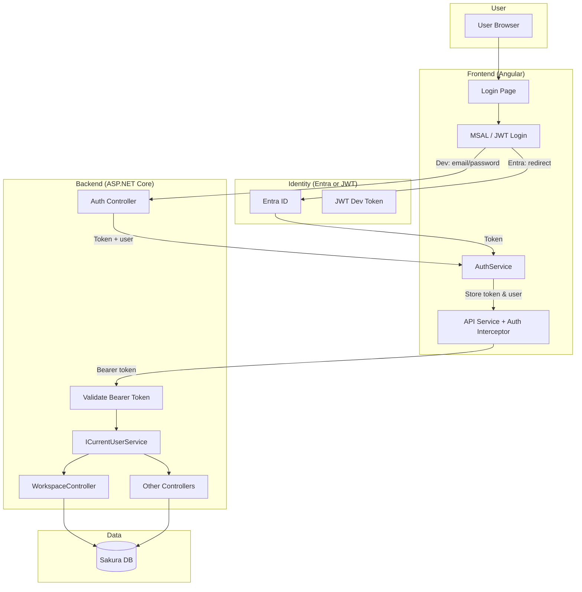
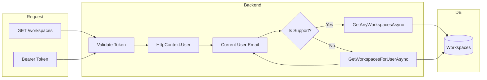
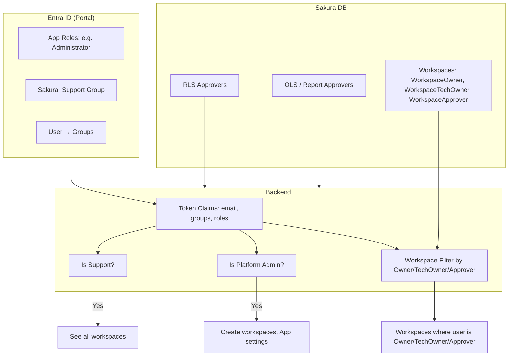
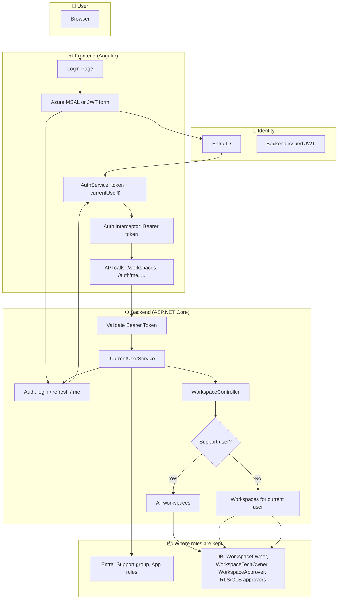

# Sakura — End-to-End Authentication Integration Plan

This document covers a **sophisticated authentication and authorization** strategy for the Sakura platform: IdP choice (Entra vs Okta), configuration, backend/frontend changes, environment setup, **where roles are maintained**, and how workspace filtering connects to identity.

---

## 1. IdP Choice: Microsoft Entra ID vs Okta

### Recommendation: **Microsoft Entra ID (Entra)**

| Factor | Entra ID | Okta |
|--------|----------|------|
| **Current state** | Already integrated: Enterprise App `azeuw1dweb01sakura`, tenant in env files, `WorkspaceEntraGroupUID` / `AppEntraGroupUID` / `AudienceEntraGroupUID` in DB | No existing integration |
| **Ecosystem** | Same tenant as Azure hosting (SWA, App Service, Key Vault); single sign-on with M365 | Extra vendor, separate SSO configuration |
| **Workspace/App model** | Workspace and App Entra group UIDs already in schema; natural fit for “user in group → access” | Would require mapping Okta groups to same DB fields or new columns |
| **Conditional Access** | Native (MFA, device, location) in same portal | Requires Okta policies and possibly duplicate rules |
| **Cost & ops** | One less vendor; existing Azure/Entra skills | Additional license and operational overhead |
| **Backend** | `Microsoft.Identity.Web` and token validation are standard on .NET in Azure | Okta SDK + validation; less common in pure Azure stacks |

**Conclusion:** Use **Entra ID** as the single IdP. Keep Okta in mind only if there is a hard requirement (e.g. existing Okta-only apps or group lifecycle).

---

## 2. Configuration Required

### 2.1 Entra ID (Azure Portal)

For each environment (Dev, UAT, Prod) use either **one App Registration with multiple redirect URIs** or **separate App Registrations** per environment. Prefer separate apps per environment for isolation.

- **App registration (or Enterprise App)**  
  - Name: e.g. `azeuw1dweb01sakura` (UAT) / prod equivalent.  
  - **Application (client) ID** — used in frontend and, if needed, backend.  
  - **Directory (tenant) ID** — used in `authority` (e.g. `https://login.microsoftonline.com/<tenant-id>`).

- **Authentication**  
  - Platform: **Single-page application (SPA)**.  
  - Redirect URIs:  
    - Dev: `http://localhost:4200`, `http://localhost:4200/`  
    - UAT: `https://<uat-static-web-app-url>`  
    - Prod: `https://<prod-static-web-app-url>`  
  - Implicit/grant: use **Authorization code + PKCE** (no implicit flow).

- **API permissions**  
  - `openid`, `profile`, `User.Read`.  
  - If backend validates tokens: optional custom scope, e.g. `api://<backend-client-id>/access_as_user`, or validate audience of the SPA client ID.

- **Token configuration (optional)**  
  - Add optional claims: `email`, `preferred_username` (for `forUser`), `groups` or custom roles if you use App roles.

- **Enterprise Application (optional)**  
  - **Assign users and groups** — assign security groups (e.g. `Sakura_Support`, `Sakura_Admins`) or individual users who may access the app.  
  - **App roles** — define roles (e.g. `Support`, `Administrator`) and assign users/groups to them; backend can read `roles` claim.

### 2.2 Frontend (Angular) — Environment files

Already partially present; ensure every environment has:

```ts
// environment.ts / environment.uat.ts / environment.production.ts
export const environment = {
  enableAzureAuth: true,  // true for UAT/Prod, false for local dev if using JWT
  azureAd: {
    clientId: '<application-client-id>',
    authority: 'https://login.microsoftonline.com/<tenant-id>',
    redirectUri: '<origin-of-the-app>',
    postLogoutRedirectUri: '<origin-of-the-app>',
    scopes: ['User.Read', 'openid', 'profile']
    // If backend exposes API scope: 'api://<backend-app-id>/access_as_user'
  },
  tokenKey: 'sakura_jwt_token',
  apiUrl: '<backend-api-url>'
};
```

- **Dev:** `enableAzureAuth: false` and JWT login to backend is acceptable.  
- **UAT/Prod:** `enableAzureAuth: true`, correct `redirectUri`/`postLogoutRedirectUri` for that host.

### 2.3 Backend (ASP.NET Core)

- **appsettings** (or Key Vault):
  - `AppSettings:EnableAzureAuth`: `true` in UAT/Prod, `false` in Dev.
  - **AzureAd** (when EnableAzureAuth is true):
    - `Instance`: `https://login.microsoftonline.com/`
    - `TenantId`: same as frontend tenant
    - `ClientId`: can be SPA client ID (audience of access tokens) or a separate backend App Registration
  - **Jwt** (when EnableAzureAuth is false): existing key/issuer/audience for your own JWT.

- **Middleware:** When `EnableAzureAuth` is true, use `Microsoft.Identity.Web` to validate Bearer tokens and populate `HttpContext.User` (claims). No need to trust `forUser` from the client once you derive identity from the token.

---

## 3. Backend Changes

### 3.1 Current behaviour (summary)

- **AuthController:**  
  - If `EnableAzureAuth == false`: email/password → `TempUserService` → issues own JWT (with userId, email, name, role, workspaceId, etc.).  
  - If `EnableAzureAuth == true`: expects Azure token in body/header, validates (stub today), extracts userId, issues refresh token; does **not** return the same user/role payload as dev.
- **WorkspaceController:**  
  - `GetWorkspaces(includeDeleted, forUser)` — **requires** `forUser`; filters by `WorkspaceOwner` / `WorkspaceTechOwner` / `WorkspaceApprover` CSV.  
  - Special case: `forUser == "sakurahelp@dentsu.com"` returns all workspaces (support).
- **No global “current user” from JWT** — today the client could send any `forUser`; backend does not enforce that it matches the authenticated user.

### 3.2 Required backend changes

1. **Introduce `ICurrentUserService`**  
   - Reads from `HttpContext.User` (claims set by JWT validation middleware).  
   - Exposes at least: `UserId`, `Email` (or `PreferredUsername`), optional `Name`, optional `Roles` (if using Entra app roles).  
   - In dev (own JWT): map from your existing JWT claims (e.g. `sub`, `email`, `role`).  
   - In prod (Entra): map from `sub`, `preferred_username`, `roles`, etc.

2. **Validate token on every API request**  
   - Use `Microsoft.Identity.Web` (or equivalent) so that Bearer token is validated and `HttpContext.User` is set.  
   - Ensure unauthenticated requests to protected endpoints return 401.

3. **Stop trusting client-supplied `forUser` for authorization**  
   - **Option A (recommended):** Remove `forUser` from the API.  
     - `GET /workspaces` (and “all including deleted” variant) call `GetWorkspacesForUserAsync(currentUserEmail, includeDeleted)` where `currentUserEmail` comes from `ICurrentUserService`.  
     - Support users (e.g. `sakurahelp@dentsu.com` or members of an Entra “Support” group) can be treated in backend logic: if current user is Support, call `GetAnyWorkspacesAsync()` (or equivalent) instead of filtering by owner/approver.  
   - **Option B:** Keep `forUser` as optional override only for **Support** (e.g. validated by checking that current user is Support), and otherwise ignore it and use `ICurrentUserService` for normal users.

4. **`POST /auth/login` when using Entra**  
   - Frontend does not call this with password; it uses MSAL and then sends the Azure access token to the backend (or uses it only for API calls).  
   - If you still want a “backend session”: backend can accept Azure token, validate it, create/refresh your own refresh token, and return a short-lived backend JWT that includes the same claims (e.g. email, role). Then frontend uses that JWT for API calls.  
   - Alternatively, frontend sends Azure access token on every request and backend validates it (no backend-issued JWT).  
   - Whichever you choose, **`/auth/me`** should return the current user (from token or from your session) so the frontend can get `userId`, `email`, `name`, `role`, etc., without re-decoding the token.

5. **`/auth/me`**  
   - Implement (or complete) this endpoint: read from `ICurrentUserService` (and optionally DB for workspace/role enrichment) and return the same shape the frontend expects (`userId`, `email`, `name`, `role`, `workspaceId`, `workspaceName`, `approverLevel`).  
   - For Entra-only users, “role” can come from Entra app roles or from your DB if you sync/set it on first login.

6. **Support / “see all workspaces”**  
   - Define Support in one place (e.g. list of UPNs in config, or Entra group `Sakura_Support`).  
   - In `WorkspaceController` (or service), if `ICurrentUserService.Email` is in that list (or in Support group), return all workspaces; otherwise use `GetWorkspacesForUserAsync(currentUserEmail, includeDeleted)`.

---

## 4. Frontend Changes

### 4.1 Use current user for workspace calls

- **Today:** `workspace-domain.service.ts` and any other callers pass `forUser: 'sakurahelp@dentsu.com'` to `/workspaces`, so everyone sees all workspaces.  
- **After:**  
  - Backend no longer uses client `forUser` (or uses it only for Support).  
  - Frontend should **not** send a fake `forUser`.  
  - Call `GET /workspaces?includeDeleted=false` (and optionally `true` for “all”) with **only** the Bearer token; backend derives the user from the token and returns the correct list.

### 4.2 Populate user after Azure login

- After MSAL redirect, you need the backend’s idea of the current user (email, role, etc.):  
  - Either call **`/auth/me`** with the token (Azure or backend-issued) and store the result in `AuthService` (same shape as today: `userId`, `email`, `name`, `role`, …).  
  - Or decode the Azure token in the frontend only for display (not for authorization) and still call `/auth/me` once to get role/workspace info if that comes from DB.  
- Ensure **AuthService** sets `currentUser$` from that response so that sidebar, header, and any “current user” logic use one source of truth.

### 4.3 Replace hardcoded “current.user@dentsu.com” / “sakurahelp@dentsu.com”

- **wso-object-management.component.ts** (and similar): replace `createdBy` / `deletedBy` with `this.authService.currentUserValue?.email` (or from `AuthService.getCurrentUser()`).  
- **Workspace list:** Rely on backend to filter by authenticated user; remove hardcoded `forUser: 'sakurahelp@dentsu.com'` from `workspace-domain.service.ts` and `mock-data.service.ts` (if used for workspaces).

### 4.4 Guards and routes

- Re-enable route guards so that unauthenticated users are sent to `/login`.  
- Use **MsalGuard** when `enableAzureAuth` is true, and your existing **authGuard** (JWT) when false.

---

## 5. All Environments

| Environment | enableAzureAuth | IdP | Backend user source | Workspace filter |
|-------------|------------------|-----|---------------------|------------------|
| **Local Dev** | false | None (JWT) | TempUserService + JWT claims | forUser from JWT (email) |
| **API Dev** | false | None (JWT) | TempUserService + JWT claims | forUser from JWT |
| **UAT** | true | Entra | Entra token + optional /auth/me from DB | ICurrentUserService; Support sees all |
| **Production** | true | Entra | Entra token + optional /auth/me from DB | ICurrentUserService; Support sees all |

- Each environment has its own **redirect URIs** in Entra and matching **apiUrl** / **backend URL** in frontend.  
- Backend **AppSettings:EnableAzureAuth** and **AzureAd** (or Jwt) settings must match the environment.

---

## 6. Visual Flow (End-to-End)

See the Mermaid diagrams in **Section 7** below for: high-level auth flow, role resolution, and where workspace filtering connects.

---

## 7. How Workspace Filtering and Roles Connect

### 7.1 Current workspace filtering

- Backend: **WorkspaceService.GetWorkspacesForUserAsync(forUser, includeDeleted)**  
  - Loads workspaces where `forUser` appears in:
    - **WorkspaceOwner** (CSV), or  
    - **WorkspaceTechOwner** (CSV), or  
    - **WorkspaceApprover** (CSV).  
- So “workspaces for this user” = workspaces where the user is Owner, Tech Owner, or Approver.  
- **Support:** Today implemented by special-casing `forUser == "sakurahelp@dentsu.com"` to return all workspaces.  
- Frontend currently passes `sakurahelp@dentsu.com` for everyone, so filtering is effectively disabled in the app.

### 7.2 Desired behaviour

- **Authenticated user** = identity from token (Entra or JWT), e.g. `preferred_username` or `email`.  
- **Backend** never trusts a client-supplied `forUser` for normal users. It uses **ICurrentUserService.Email** (or UPN).  
- **Workspace list:**  
  - If current user is **Support** → return all workspaces (same as today’s sakurahelp logic).  
  - Else → return only workspaces where that user is in **WorkspaceOwner**, **WorkspaceTechOwner**, or **WorkspaceApprover**.  
- **Who is Support?**  
  - Maintain in one place: e.g. Entra group **Sakura_Support** (or a list in backend config).  
  - Backend checks group membership from token or a small lookup.

### 7.3 Who is Workspace Admin / Owner, Support, Requester / Approver?

| Role / Concept | Where it’s defined | How backend knows |
|----------------|--------------------|--------------------|
| **Workspace Admin / Owner** | **Database:** `Workspaces.WorkspaceOwner`, `WorkspaceTechOwner` (and optionally `WorkspaceApprover`) | User is in one of these CSV lists for that workspace. Backend already filters by this in `GetWorkspacesForUserAsync`. |
| **Support** | **Entra:** e.g. security group `Sakura_Support`, or backend config list (e.g. `sakurahelp@dentsu.com`) | Token contains group membership, or backend checks config. Support then gets “all workspaces” and can assist any workspace. |
| **Requester** | **Implicit:** any authenticated user can be a requester. **Capabilities** define what they can do (see Capabilities-Per-Role). | No separate “Requester” store; if the user has a token and is allowed to use the app, they can create requests (subject to workspace visibility and capability checks). |
| **Approver** | **Database:** RLS/OLS approvers per workspace/security model/report (e.g. RLS Approvers tables, WorkspaceReport approvers, etc.). Also **WorkspaceApprover** CSV on Workspace. | Backend checks: is this user in the relevant approver list for this workspace/report/security model? Used for “pending approvals” and approval actions. |

So:

- **Workspace Admin/Owner** → **maintained in DB** (`Workspaces.WorkspaceOwner`, `WorkspaceTechOwner`).  
- **Support** → **maintained in Entra** (group) or **backend config**.  
- **Requester** → no separate store; any app user.  
- **Approver** → **maintained in DB** (Workspace approvers, RLS/OLS approver tables, report approvers).

### 7.4 Optional: Entra App Roles for “Administrator”

- You can define an **App role** (e.g. `Administrator`) in the Entra app and assign it to users/groups.  
- Backend reads `roles` claim from the token.  
- Use this for **platform-level** admin (e.g. create workspaces, change application settings) as in **Capabilities-Per-Role (ADM)**.  
- Workspace-level “owner” remains in DB; platform-level “admin” can be Entra app role.

---

## 8. Mermaid Diagrams — Visual Flows

### 8.1 High-level authentication flow (all environments)



### 8.2 Workspace list: who sees what



### 8.3 Where roles are maintained and how they connect



### 8.4 End-to-end flow (from login to workspace list)

```mermaid
sequenceDiagram
  participant U as User
  participant FE as Frontend
  participant Entra as Entra ID
  participant BE as Backend
  participant DB as Database

  alt Entra (UAT/Prod)
    U->>FE: Open app
    FE->>FE: Not logged in → /login
    U->>FE: Sign in with Microsoft
    FE->>Entra: Redirect (MSAL)
    Entra->>FE: Redirect with token
    FE->>FE: Store token, optional /auth/me
    FE->>BE: GET /auth/me (Bearer token)
    BE->>BE: Validate token, ICurrentUserService
    BE->>FE: { email, name, role, ... }
  else JWT (Dev)
    U->>FE: Email + password
    FE->>BE: POST /auth/login
    BE->>DB: TempUserService
    BE->>FE: { token, email, name, role, ... }
  end

  FE->>BE: GET /workspaces (Bearer token)
  BE->>BE: Validate token → email
  BE->>BE: Support? → all ; else GetWorkspacesForUserAsync(email)
  BE->>DB: Query Workspaces
  DB->>BE: Rows
  BE->>FE: Workspace list
  FE->>U: Show workspaces
```

---

## 9. One-Page Visual: Whole Flow (Final)

Use this single diagram to understand the full flow once everything is finalised.



**Legend:**  
- **Support user** = in Entra group or config → sees all workspaces.  
- **Other users** = see only workspaces where they are in Owner / TechOwner / Approver (from DB).  
- **Platform admin** = optional Entra app role for create workspace / app settings.

---

## 10. Summary Checklist

- [ ] **IdP:** Standardise on **Entra ID** for UAT/Prod; keep JWT + TempUserService for dev.  
- [ ] **Entra:** App registration(s) per env, SPA redirect URIs, PKCE, optional App roles and Support group.  
- [ ] **Backend:** Add **ICurrentUserService**; validate Bearer token on every request; derive `forUser` from token (no client trust); implement/complete **/auth/me**; Support = config or Entra group.  
- [ ] **Frontend:** Remove hardcoded `forUser`; use token only; call **/auth/me** after login; use **AuthService.currentUserValue** for createdBy/deletedBy and UI.  
- [ ] **Environments:** Dev (JWT), UAT/Prod (Entra), each with correct redirect URIs and backend flags.  
- [ ] **Roles:**  
  - **Workspace Admin/Owner** → DB (`WorkspaceOwner`, `WorkspaceTechOwner`).  
  - **Support** → Entra group or config.  
  - **Approver** → DB (RLS/OLS/Report approvers).  
  - **Platform Admin** → Optional Entra app role.

Once the above is in place, you will have a single, clear auth flow for all environments, correct workspace filtering per user, and a single place (Entra + DB) where each role type is maintained.
