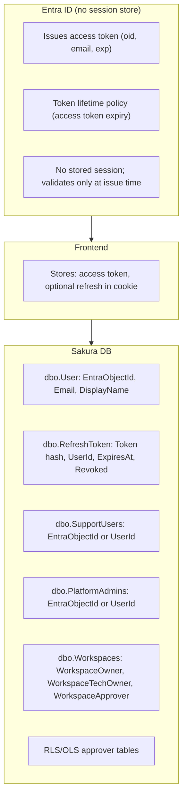
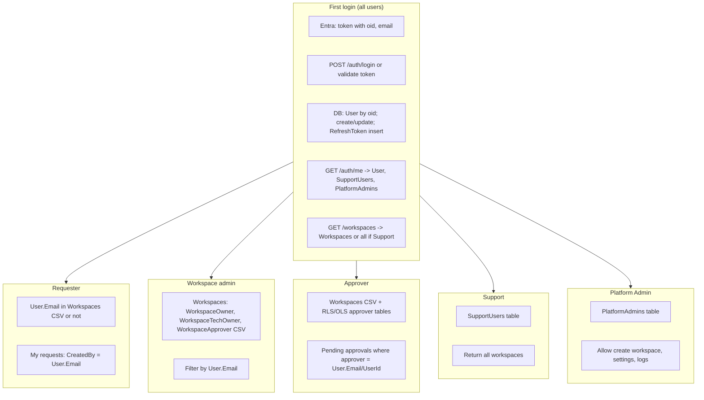

# Sakura — Auth flow reference: endpoints, tables, columns, first login, and per user type

This document gives a single place to see: **what is maintained on Entra vs DB**, **each endpoint**, **each table and key columns**, the **first-login flow**, and the **flow per user type** (Requester, Workspace admin, Approver, Platform Admin, Support).

---

## 1. What is maintained on Entra side vs database side



| Side | What is maintained | Notes |
|------|--------------------|--------|
| **Entra** | **Identity at issue time:** issues token with `oid`, `email`, `exp`. **No session store** — Entra does not track “who is logged in”; it only issues and validates tokens. Token expiry is in the token (`exp` claim) or in Entra token lifetime policy. | Stateless from Entra’s perspective for your app. |
| **DB** | **User** (oid → UserId, Email). **RefreshToken** (hash, UserId, ExpiresAt, Revoked) for refresh flow. **SupportUsers**, **PlatformAdmins** (who is Support/Admin). **Workspaces** (Owner, TechOwner, Approver CSV). **RLS/OLS** approver tables. **Session** = “valid access token” + optional “valid refresh token in DB”; expiry for refresh is **dbo.RefreshToken.ExpiresAt**. | All role and refresh state in DB. |

---

## 2. Tables and key columns

| Table | Key columns used in auth/flow | Purpose |
|-------|-------------------------------|---------|
| **dbo.User** | Id, EntraObjectId, Email, DisplayName, CreatedAt, UpdatedAt | One row per user; oid → UserId and current Email. |
| **dbo.RefreshToken** | Id, Token (hash), UserId, CreatedAt, CreatedByIp, **ExpiresAt**, **Revoked**, RevokedAt | Store refresh token hash; check ExpiresAt and Revoked on /auth/refresh. |
| **dbo.SupportUsers** | EntraObjectId (or UserId) | If current user here → return all workspaces. |
| **dbo.PlatformAdmins** | EntraObjectId (or UserId) | If current user here → allow create workspace, app settings, etc. |
| **dbo.Workspaces** | Id, **WorkspaceOwner**, **WorkspaceTechOwner**, **WorkspaceApprover** (CSV emails), IsActive | Filter workspaces by User.Email in these columns. |
| **RLS/OLS approver tables** | Approver email or UserId per workspace/model/report | Who can approve; “pending approvals” for current user. |
| **Request / Permission tables** | CreatedBy, UpdatedBy (email) | Requester’s requests; audit. |

---

## 3. Auth and main endpoints

| Endpoint | Method | Purpose | Tables / columns used |
|----------|--------|---------|------------------------|
| **/api/Auth/login** | POST | Login (JWT dev) or validate Entra token and issue refresh | TempUser (dev); **RefreshToken** (Token, UserId, ExpiresAt); User (if create/update by oid). |
| **/api/Auth/me** | GET | Return current user (userId, email, name, isSupport, isPlatformAdmin) | **User** (by oid); **SupportUsers**; **PlatformAdmins**. |
| **/api/Auth/refresh** | POST | Issue new access token from refresh cookie | **RefreshToken** (Token hash, UserId, ExpiresAt, Revoked). |
| **/api/Auth/logout** | POST | Revoke refresh token, clear cookie | **RefreshToken** (set Revoked, RevokedAt). |
| **/api/Workspaces** | GET | List workspaces for current user | **User** (Email); **SupportUsers** (UserId/oid); **Workspaces** (WorkspaceOwner, WorkspaceTechOwner, WorkspaceApprover). |
| **/api/Workspaces/{id}** | GET | Get one workspace (if allowed) | Same as above for “can see this workspace”. |
| **Create workspace** | POST | Create workspace (Platform Admin only) | **User**; **PlatformAdmins** (UserId/oid). |
| **Approval / request endpoints** | GET/POST | My requests, pending approvals, approve | **User** (Email/UserId); **Workspaces**; RLS/OLS approver tables; request tables (CreatedBy). |

---

## 4. First login — full flow (all user types)

```mermaid
sequenceDiagram
  participant U as User
  participant FE as Frontend
  participant Entra as Entra ID
  participant BE as Backend
  participant DB as Sakura DB

  Note over U,DB: First login
  U->>FE: Open app / Click login
  FE->>Entra: Redirect (MSAL)
  Entra->>FE: Redirect with access token (oid, email, exp)
  FE->>FE: Store access token

  FE->>BE: POST /api/Auth/login (Bearer token) or email+password (dev)
  BE->>BE: Validate token, extract oid + email
  BE->>DB: SELECT User BY EntraObjectId = oid
  alt User not found
    BE->>DB: INSERT User (EntraObjectId, Email, DisplayName)
  else User found, email changed
    BE->>DB: UPDATE User SET Email = token email, UpdatedAt
  end
  BE->>DB: INSERT RefreshToken (Token hash, UserId, ExpiresAt)
  BE-->>FE: 200 + Set-Cookie refreshToken (optional)

  FE->>BE: GET /api/Auth/me (Bearer token)
  BE->>BE: Validate token, oid -> User
  BE->>DB: SELECT User (Id, Email, DisplayName)
  BE->>DB: SELECT SupportUsers WHERE UserId/EntraObjectId
  BE->>DB: SELECT PlatformAdmins WHERE UserId/EntraObjectId
  BE-->>FE: 200 { userId, email, name, isSupport, isPlatformAdmin }
  FE->>FE: Store in AuthService

  FE->>BE: GET /api/Workspaces (Bearer token)
  BE->>BE: oid -> User; User.Email
  BE->>DB: Is UserId in SupportUsers?
  alt Support
    BE->>DB: SELECT * FROM Workspaces (all)
  else Not Support
    BE->>DB: SELECT Workspaces WHERE Email in Owner/TechOwner/Approver CSV
  end
  BE-->>FE: 200 [workspace list]

  Note over U,DB: Session = access token (frontend) + optional refresh (cookie + RefreshToken row). No server-side session store.
```

**Columns in the flow:**

- **Token:** oid, email, exp (Entra or backend).
- **User:** EntraObjectId (from oid), Email (from token or update), Id (UserId).
- **RefreshToken:** Token (hash), UserId, ExpiresAt.
- **SupportUsers / PlatformAdmins:** EntraObjectId or UserId.
- **Workspaces:** WorkspaceOwner, WorkspaceTechOwner, WorkspaceApprover (CSV); match with User.Email.

---

## 5. Per user type: endpoints, tables, columns, what they get

### 5.1 Requester

| Step | Endpoint | Tables / columns | What they get |
|------|----------|------------------|----------------|
| Login | POST /auth/login, GET /auth/me | User, RefreshToken | Token, userId, email, name |
| Workspace list | GET /workspaces | User (Email), Workspaces (Owner, TechOwner, Approver) | Workspaces where their **Email** is in CSV (may be empty if not in any) |
| My requests | GET requests (e.g. my requests) | Request/Permission tables **CreatedBy** = User.Email | List of requests they created |
| Create request | POST request | Request table **CreatedBy** = User.Email | Request created |

**No** SupportUsers or PlatformAdmins row. No special columns; just **User.Email** and **CreatedBy** for filtering.

---

### 5.2 Workspace admin / Owner

| Step | Endpoint | Tables / columns | What they get |
|------|----------|------------------|----------------|
| Login | POST /auth/login, GET /auth/me | User, RefreshToken | Token, userId, email, name |
| Workspace list | GET /workspaces | User (Email), **Workspaces** (**WorkspaceOwner**, **WorkspaceTechOwner**, WorkspaceApprover) | Workspaces where **User.Email** is in one of these CSV columns |
| Manage workspace | GET/PUT /workspaces/{id}, apps, reports, security models, etc. | Same; backend checks User.Email in Workspaces for that id | Full management of those workspaces |

**Key columns:** **dbo.Workspaces.WorkspaceOwner**, **WorkspaceTechOwner** (and **WorkspaceApprover** for “see workspace”). Backend uses **User.Email** from **User** table.

---

### 5.3 Approver (and Requester)

| Step | Endpoint | Tables / columns | What they get |
|------|----------|------------------|----------------|
| Login | POST /auth/login, GET /auth/me | User, RefreshToken | Token, userId, email, name |
| Workspace list | GET /workspaces | User (Email), **Workspaces** (Owner, TechOwner, **WorkspaceApprover**) | Workspaces where **User.Email** is in Owner/TechOwner/Approver |
| Pending approvals | GET approvals / pending | **RLS/OLS approver tables** where approver = User.Email (or UserId) | List of items awaiting their approval |
| Approve / reject | POST approval | Same tables; backend checks approver = current user | Action recorded |

**Key columns:** **Workspaces.WorkspaceApprover** (CSV) and **RLS/OLS approver table** columns that store approver email (or UserId). Backend uses **User.Email** (or UserId) for matching.

---

### 5.4 Platform Admin

| Step | Endpoint | Tables / columns | What they get |
|------|----------|------------------|----------------|
| Login | POST /auth/login, GET /auth/me | User, RefreshToken, **PlatformAdmins** | Token, userId, email, name, **isPlatformAdmin = true** |
| Workspace list | GET /workspaces | User, Workspaces (same as others; may also be in SupportUsers) | Workspaces (filtered or all if also Support) |
| Create workspace | POST create workspace | **User** (UserId/oid), **PlatformAdmins** (UserId or EntraObjectId) | 200 if in PlatformAdmins; **403** if not |
| App settings / event logs | GET/POST settings, logs | Same; **PlatformAdmins** | Allowed only if in **PlatformAdmins** |

**Key columns:** **dbo.PlatformAdmins** (EntraObjectId or UserId). Backend checks **ICurrentUserService.UserId** (or EntraObjectId) in this table.

---

### 5.5 Support

| Step | Endpoint | Tables / columns | What they get |
|------|----------|------------------|----------------|
| Login | POST /auth/login, GET /auth/me | User, RefreshToken, **SupportUsers** | Token, userId, email, name, **isSupport = true** |
| Workspace list | GET /workspaces | **User**, **SupportUsers** (UserId or EntraObjectId), **Workspaces** | **All workspaces** (backend uses GetAnyWorkspaces, no filter by Owner/Approver) |
| Any workspace / request | GET/PUT workspace, requests, etc. | Same; backend allows because in SupportUsers | Can open and assist any workspace |

**Key columns:** **dbo.SupportUsers** (EntraObjectId or UserId). Backend: if current user in **SupportUsers** → return all workspaces; no filter by **Workspaces.WorkspaceOwner** etc.

---

## 6. One diagram: first login and then by role



---

## 7. Summary: Entra vs DB and session

| Item | Entra | DB |
|------|--------|-----|
| **Session store** | None | Refresh token row in **dbo.RefreshToken** (ExpiresAt, Revoked); access token not stored. |
| **Identity** | Issues token (oid, email) | **dbo.User** (EntraObjectId, Email); oid → User row. |
| **Who is Support** | — | **dbo.SupportUsers** (EntraObjectId or UserId). |
| **Who is Platform Admin** | — | **dbo.PlatformAdmins** (EntraObjectId or UserId). |
| **Workspace visibility** | — | **dbo.Workspaces** (WorkspaceOwner, WorkspaceTechOwner, WorkspaceApprover) + **User.Email**. |
| **Approver** | — | RLS/OLS approver tables + **User.Email** or UserId. |
| **Token expiry (access)** | In token `exp` / Entra policy | Not stored. |
| **Token expiry (refresh)** | — | **dbo.RefreshToken.ExpiresAt**. |

This gives one place to see each endpoint, each table, the columns that matter, what is on Entra vs DB, and the flow for first login and for Requester, Workspace admin, Approver, Platform Admin, and Support.
