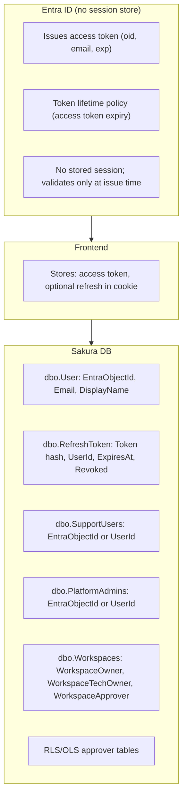
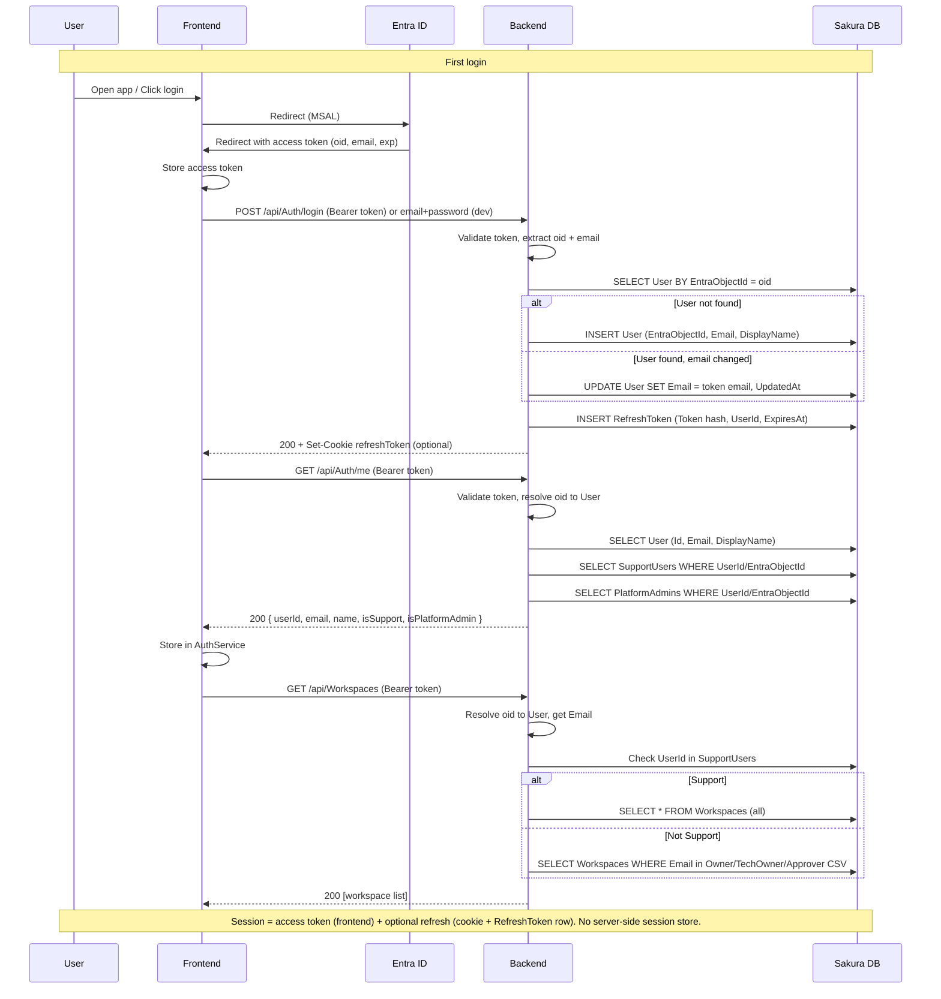
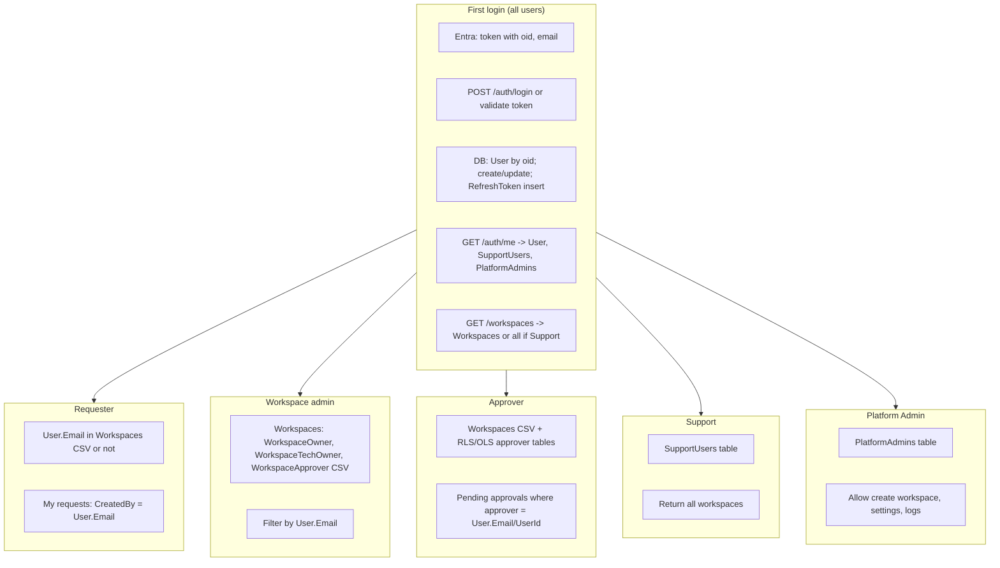

# Sakura — Auth flow reference

Single place for: **Entra vs DB**, **endpoints**, **tables and columns**, **first-login flow**, **per user type**, **token verification**, **session expiry and logout**, and **table relationships**.

---

## Contents

| § | What it covers |
|---|----------------|
| 1 | What is maintained on Entra vs database |
| 2 | **All auth-related tables and relationships** (with ER diagram) |
| 3 | Tables and key columns (quick reference) |
| 4 | Auth and main endpoints |
| 5 | **How the backend verifies the token (same app)** + pseudo-code |
| 6 | First login — full flow |
| 7 | Per user type: endpoints, tables, what they get |
| 8 | One diagram: first login and by role |
| 9 | When does session expire? |
| 10 | What happens on logout? |
| 11 | Logout at each level |
| 12 | Why is refresh optional? |
| 13 | Summary: Entra vs DB and session |

---

## 1. What is maintained on Entra side vs database side



| Side | What is maintained | Notes |
|------|--------------------|--------|
| **Entra** | **Identity at issue time:** issues token with `oid`, `email`, `exp`. **No session store** — Entra does not track “who is logged in”; it only issues and validates tokens. Token expiry is in the token (`exp` claim) or in Entra token lifetime policy. | Stateless from Entra’s perspective for your app. |
| **DB** | **User** (oid → UserId, Email). **RefreshToken** (hash, UserId, ExpiresAt, Revoked) for refresh flow. **SupportUsers**, **PlatformAdmins** (who is Support/Admin). **Workspaces** (Owner, TechOwner, Approver CSV). **RLS/OLS** approver tables. **Session** = “valid access token” + optional “valid refresh token in DB”; expiry for refresh is **dbo.RefreshToken.ExpiresAt**. | All role and refresh state in DB. |

---

## 2. All auth-related tables and their relationships

**Purpose:** One place to see every auth-related table and how they link. The backend uses **User** as the bridge from token (oid) to roles and workspace visibility.

### 2.1 Entity-relationship overview

```mermaid
erDiagram
  User ||--o{ RefreshToken : "UserId"
  User ||--o{ SupportUsers : "UserId or EntraObjectId"
  User ||--o{ PlatformAdmins : "UserId or EntraObjectId"
  Workspaces ||--o{ PermissionRequests : "WorkspaceId"
  Workspaces ||--o{ WorkspaceSecurityModels : "WorkspaceId"
  WorkspaceSecurityModels ||--o{ RLS_Approvers : "SecurityModelId"
  PermissionRequests ||--o{ PermissionHeaders : "PermissionRequestId"
  User {
    int Id PK
    string EntraObjectId UK
    string Email
  }
  RefreshToken {
    int Id PK
    string Token_hash
    int UserId FK
    datetime ExpiresAt
    bool Revoked
  }
  SupportUsers {
    string EntraObjectId_or_UserId
  }
  PlatformAdmins {
    string EntraObjectId_or_UserId
  }
  Workspaces {
    int Id PK
    string WorkspaceOwner CSV
    string WorkspaceTechOwner CSV
    string WorkspaceApprover CSV
  }
  PermissionRequests {
    string CreatedBy
    int WorkspaceId FK
  }
```

**Note:** **User** is the central identity table (EntraObjectId = oid from token). **Workspaces** do not have a FK to User; matching is by **User.Email** in the CSV columns. **SupportUsers** and **PlatformAdmins** reference User by **UserId** or **EntraObjectId**.

### 2.2 Table list and relationships (auth-related)

| Table | Primary key | Links to / used with | Purpose |
|-------|-------------|----------------------|---------|
| **dbo.User** | Id | — (root identity) | One row per user. **EntraObjectId** = token oid; **Email** = current email. RefreshToken, SupportUsers, PlatformAdmins reference this (by UserId or EntraObjectId). |
| **dbo.RefreshToken** | Id | **User** (UserId) | Stores refresh token hash; **ExpiresAt**, **Revoked**. Used only for /auth/refresh and logout. |
| **dbo.SupportUsers** | (EntraObjectId or UserId) | **User** (logical) | If current user has a row here → return all workspaces. |
| **dbo.PlatformAdmins** | (EntraObjectId or UserId) | **User** (logical) | If current user has a row here → allow create workspace, app settings, event logs. |
| **dbo.Workspaces** | Id | — | **WorkspaceOwner**, **WorkspaceTechOwner**, **WorkspaceApprover** (CSV emails). Filter by **User.Email**. PermissionRequests, WorkspaceSecurityModels reference WorkspaceId. |
| **dbo.UserRoles** | Id | Optional: PlatformAdmins can use RoleName | Role definitions; can be used with a UserRoleAssignment table for Platform Admin. |
| **dbo.PermissionRequests** | Id | **Workspaces** (WorkspaceId); **CreatedBy** (email) | Requests; **CreatedBy** = User.Email for "my requests". |
| **dbo.PermissionHeaders** | Id | **PermissionRequests** (PermissionRequestId) | Request headers. |
| **dbo.WorkspaceSecurityModels** | Id | **Workspaces** (WorkspaceId) | Security models per workspace. |
| **dbo.RLS*Approvers** (e.g. RLSAMERApprovers) | — | **WorkspaceSecurityModels**; approver email/UserId | Who can approve RLS per model/type. Match by **User.Email** or UserId. |
| **dbo.WorkspaceReports**, **WorkspaceApps**, **AppAudiences** | Id | **Workspaces** (WorkspaceId) | Workspace-scoped data; access checked via Workspaces (Owner/TechOwner/Approver) + User.Email. |

**Relationship summary:**

- **Token (oid)** → **User** (by EntraObjectId) → **UserId**, **Email**.
- **RefreshToken** → **User** (UserId); expiry in **RefreshToken.ExpiresAt**.
- **SupportUsers**, **PlatformAdmins** → **User** (UserId or EntraObjectId).
- **Workspaces** ↔ **User**: no FK; match **User.Email** to WorkspaceOwner / WorkspaceTechOwner / WorkspaceApprover (CSV).
- **PermissionRequests** → **Workspaces** (WorkspaceId); **CreatedBy** = email (same as User.Email).
- **RLS/OLS approver tables** → workspace/security model; approver column = User.Email or UserId.

### 2.3 SQL Server: column names and data types

Auth-related tables with correct SQL Server column names and data types. Tables marked *(planned)* are not yet in the database.

**dbo.User** *(planned)*

| Column | Data type | Notes |
|--------|-----------|--------|
| Id | INT NOT NULL IDENTITY | PK |
| EntraObjectId | NVARCHAR(255) NOT NULL | Unique; token `oid` |
| Email | NVARCHAR(255) NOT NULL | Current email |
| DisplayName | NVARCHAR(255) NULL | |
| CreatedAt | DATETIME2(0) NOT NULL | |
| UpdatedAt | DATETIME2(0) NOT NULL | |

**dbo.RefreshToken**

| Column | Data type | Notes |
|--------|-----------|--------|
| Id | INT NOT NULL IDENTITY | PK |
| Token | NVARCHAR(255) NOT NULL | Token or hash |
| UserId | NVARCHAR(255) NOT NULL | References User (logical); consider INT if User.Id is INT |
| CreatedAt | DATETIME2(0) NOT NULL | |
| CreatedByIp | NVARCHAR(50) NOT NULL | |
| ExpiresAt | DATETIME2(0) NOT NULL | |
| Revoked | BIT NOT NULL DEFAULT 1 | |
| RevokedAt | DATETIME2(0) NULL | |

**dbo.SupportUsers** *(planned)*

| Column | Data type | Notes |
|--------|-----------|--------|
| Id | INT NOT NULL IDENTITY | PK (optional) |
| EntraObjectId | NVARCHAR(255) NOT NULL | Or UserId INT FK to User |

**dbo.PlatformAdmins** *(planned)*

| Column | Data type | Notes |
|--------|-----------|--------|
| Id | INT NOT NULL IDENTITY | PK (optional) |
| EntraObjectId | NVARCHAR(255) NOT NULL | Or UserId INT FK to User |

**dbo.Workspaces**

| Column | Data type | Notes |
|--------|-----------|--------|
| Id | INT NOT NULL IDENTITY | PK |
| WorkspaceCode | NVARCHAR(50) NOT NULL | Unique |
| WorkspaceName | NVARCHAR(255) NOT NULL | |
| WorkspaceOwner | NVARCHAR(255) NOT NULL | CSV emails |
| WorkspaceTechOwner | NVARCHAR(255) NOT NULL | CSV emails |
| WorkspaceApprover | NVARCHAR(255) NOT NULL | CSV emails |
| WorkspaceEntraGroupUID | NVARCHAR(255) NULL | |
| WorkspaceTag | NVARCHAR(50) NULL | |
| DomainLoVId | INT NOT NULL | FK to dbo.LoVs |
| IsActive | BIT NOT NULL DEFAULT 1 | |
| CreatedAt | DATETIME2(0) NOT NULL | |
| CreatedBy | NVARCHAR(255) NOT NULL | |
| UpdatedAt | DATETIME2(0) NOT NULL | |
| UpdatedBy | NVARCHAR(255) NOT NULL | |

**dbo.UserRoles**

| Column | Data type | Notes |
|--------|-----------|--------|
| Id | INT NOT NULL IDENTITY | PK |
| RoleName | NVARCHAR(255) NULL | Unique |
| RoleDescription | NVARCHAR(255) NULL | |
| RoleStatus | INT NULL DEFAULT 1 | |
| CreatedAt | DATETIME2(0) NOT NULL | |
| CreatedBy | NVARCHAR(255) NOT NULL | |
| UpdatedAt | DATETIME2(0) NOT NULL | |
| UpdatedBy | NVARCHAR(255) NOT NULL | |

**dbo.PermissionRequests**

| Column | Data type | Notes |
|--------|-----------|--------|
| Id | INT NOT NULL IDENTITY | PK |
| RequestCode | NVARCHAR(50) NOT NULL | Unique |
| RequestedFor | NVARCHAR(255) NOT NULL | |
| RequestedBy | NVARCHAR(255) NOT NULL | |
| LMApprover | NVARCHAR(255) NOT NULL | |
| RequestStatus | INT NOT NULL DEFAULT 0 | |
| RequestReason | NVARCHAR(255) NOT NULL | |
| WorkspaceId | INT NOT NULL | FK to dbo.Workspaces |
| CreatedAt | DATETIME2(0) NOT NULL | |
| CreatedBy | NVARCHAR(255) NOT NULL | Auth: requester email |
| UpdatedAt | DATETIME2(0) NOT NULL | |
| UpdatedBy | NVARCHAR(255) NOT NULL | |

**dbo.PermissionHeaders**

| Column | Data type | Notes |
|--------|-----------|--------|
| Id | INT NOT NULL IDENTITY | PK |
| PermissionRequestId | INT NOT NULL | FK to dbo.PermissionRequests |
| PermissionType | INT NOT NULL | 0: OLS, 1: RLS |
| ApprovalStatus | INT NOT NULL DEFAULT 0 | |
| Approvers | NVARCHAR(1024) NOT NULL | CSV list |
| ApprovedBy | NVARCHAR(255) NULL | |
| ApprovedAt | DATETIME2(0) NULL | |
| CreatedAt | DATETIME2(0) NOT NULL | |
| CreatedBy | NVARCHAR(255) NOT NULL | |
| UpdatedAt | DATETIME2(0) NOT NULL | |
| UpdatedBy | NVARCHAR(255) NOT NULL | |

**dbo.WorkspaceSecurityModels**

| Column | Data type | Notes |
|--------|-----------|--------|
| Id | INT NOT NULL IDENTITY | PK |
| WorkspaceId | INT NOT NULL | FK to dbo.Workspaces |
| SecurityModelCode | NVARCHAR(50) NOT NULL | |
| SecurityModelName | NVARCHAR(255) NOT NULL | |
| IsActive | BIT NOT NULL DEFAULT 1 | |
| CreatedAt | DATETIME2(0) NOT NULL | |
| CreatedBy | NVARCHAR(255) NOT NULL | |
| UpdatedAt | DATETIME2(0) NOT NULL | |
| UpdatedBy | NVARCHAR(255) NOT NULL | |

**dbo.RLSAMERApprovers** (and other RLS*Approvers)

| Column | Data type | Notes |
|--------|-----------|--------|
| Id | INT NOT NULL IDENTITY | PK |
| SecurityModelId | INT NOT NULL | FK to dbo.WorkspaceSecurityModels |
| SecurityTypeLoVId | INT NOT NULL | FK to dbo.LoVs |
| Approvers | NVARCHAR(1024) NOT NULL | CSV list; match User.Email or UserId |
| CreatedAt | DATETIME2(0) NOT NULL | |
| CreatedBy | NVARCHAR(255) NOT NULL | |
| UpdatedAt | DATETIME2(0) NOT NULL | |
| UpdatedBy | NVARCHAR(255) NOT NULL | |

*System-versioned tables also have `ValidFrom` and `ValidTo` (DATETIME2(0)) in the history table.*

---

## 3. Tables and key columns (quick reference)

| Table | Key columns used in auth/flow | Purpose |
|-------|-------------------------------|---------|
| **dbo.User** | Id, EntraObjectId, Email, DisplayName, CreatedAt, UpdatedAt | One row per user; oid → UserId and current Email. |
| **dbo.RefreshToken** | Id, Token (hash), UserId, CreatedAt, CreatedByIp, **ExpiresAt**, **Revoked**, RevokedAt | Store refresh token hash; check ExpiresAt and Revoked on /auth/refresh. |
| **dbo.SupportUsers** | EntraObjectId (or UserId) | If current user here → return all workspaces. |
| **dbo.PlatformAdmins** | EntraObjectId (or UserId) | If current user here → allow create workspace, app settings, etc. |
| **dbo.Workspaces** | Id, **WorkspaceOwner**, **WorkspaceTechOwner**, **WorkspaceApprover** (CSV emails), IsActive | Filter workspaces by User.Email in these columns. |
| **RLS/OLS approver tables** | Approver email or UserId per workspace/model/report | Who can approve; “pending approvals” for current user. |
| **Request / Permission tables** | CreatedBy, UpdatedBy (email) | Requester’s requests; audit. |

---

## 4. Auth and main endpoints

| Endpoint | Method | Purpose | Tables / columns used |
|----------|--------|---------|------------------------|
| **/api/Auth/login** | POST | Login (JWT dev) or validate Entra token and issue refresh | TempUser (dev); **RefreshToken** (Token, UserId, ExpiresAt); User (if create/update by oid). |
| **/api/Auth/me** | GET | Return current user (userId, email, name, isSupport, isPlatformAdmin) | **User** (by oid); **SupportUsers**; **PlatformAdmins**. |
| **/api/Auth/refresh** | POST | Issue new access token from refresh cookie | **RefreshToken** (Token hash, UserId, ExpiresAt, Revoked). |
| **/api/Auth/logout** | POST | Revoke refresh token, clear cookie | **RefreshToken** (set Revoked, RevokedAt). |
| **/api/Workspaces** | GET | List workspaces for current user | **User** (Email); **SupportUsers** (UserId/oid); **Workspaces** (WorkspaceOwner, WorkspaceTechOwner, WorkspaceApprover). |
| **/api/Workspaces/{id}** | GET | Get one workspace (if allowed) | Same as above for “can see this workspace”. |
| **Create workspace** | POST | Create workspace (Platform Admin only) | **User**; **PlatformAdmins** (UserId/oid). |
| **Approval / request endpoints** | GET/POST | My requests, pending approvals, approve | **User** (Email/UserId); **Workspaces**; RLS/OLS approver tables; request tables (CreatedBy). |

---

## 5. How the backend verifies the token (same app)

The backend does **not** call Entra on every request. It validates the **access token** locally using the JWT and Entra's public keys.

### 5.1 What the backend checks

1. **Signature** — Verify with Entra's **JWKS** (public keys). If the signature is valid, the token was issued by Entra and has not been tampered with.
2. **iss** — Issuer must be your Entra tenant (e.g. `https://login.microsoftonline.com/{tenant-id}/v2.0`).
3. **aud** — Audience must match your app. **"Same app"** means: the token was issued for your backend (or for your SPA's client ID / API scope). The backend config holds the expected **aud**; if it matches, frontend and backend are talking about the same app.
4. **exp** — Current time &lt; **exp**. Expiry is read **from the token**; the backend does not look up expiry anywhere else (including not in **RefreshToken**).

### 5.2 Access-token validation does not use the RefreshToken table

- **Access token** is validated only via JWT: signature + **iss** + **aud** + **exp**. No database lookup.
- **dbo.RefreshToken** is used only for the **/auth/refresh** flow (and logout revoke). It is **not** used to validate the access token on normal API requests.

### 5.3 Example (pseudo-code)

```csharp
// On each request with Authorization: Bearer <access_token>
// 1. Get Entra JWKS (cached), verify JWT signature
// 2. Check claims:
//    - iss == "https://login.microsoftonline.com/{tenant}/v2.0"
//    - aud == configured ClientId or API scope (same app)
//    - exp > DateTime.UtcNow
// 3. Extract oid (and email) from token -> resolve to User in DB for roles/workspaces
// No call to Entra; no lookup in RefreshToken for validation.
```

---

## 6. First login — full flow (all user types)

Sequence below: from user opening the app through first workspace list. Same flow for all user types; role differences apply when loading workspaces and approval data.



**Columns in the flow:**

- **Token:** oid, email, exp (Entra or backend).
- **User:** EntraObjectId (from oid), Email (from token or update), Id (UserId).
- **RefreshToken:** Token (hash), UserId, ExpiresAt.
- **SupportUsers / PlatformAdmins:** EntraObjectId or UserId.
- **Workspaces:** WorkspaceOwner, WorkspaceTechOwner, WorkspaceApprover (CSV); match with User.Email.

---

## 7. Per user type: endpoints, tables, columns, what they get

### 7.1 Requester

| Step | Endpoint | Tables / columns | What they get |
|------|----------|------------------|----------------|
| Login | POST /auth/login, GET /auth/me | User, RefreshToken | Token, userId, email, name |
| Workspace list | GET /workspaces | User (Email), Workspaces (Owner, TechOwner, Approver) | Workspaces where their **Email** is in CSV (may be empty if not in any) |
| My requests | GET requests (e.g. my requests) | Request/Permission tables **CreatedBy** = User.Email | List of requests they created |
| Create request | POST request | Request table **CreatedBy** = User.Email | Request created |

**No** SupportUsers or PlatformAdmins row. No special columns; just **User.Email** and **CreatedBy** for filtering.

---

### 7.2 Workspace admin / Owner

| Step | Endpoint | Tables / columns | What they get |
|------|----------|------------------|----------------|
| Login | POST /auth/login, GET /auth/me | User, RefreshToken | Token, userId, email, name |
| Workspace list | GET /workspaces | User (Email), **Workspaces** (**WorkspaceOwner**, **WorkspaceTechOwner**, WorkspaceApprover) | Workspaces where **User.Email** is in one of these CSV columns |
| Manage workspace | GET/PUT /workspaces/{id}, apps, reports, security models, etc. | Same; backend checks User.Email in Workspaces for that id | Full management of those workspaces |

**Key columns:** **dbo.Workspaces.WorkspaceOwner**, **WorkspaceTechOwner** (and **WorkspaceApprover** for “see workspace”). Backend uses **User.Email** from **User** table.

---

### 7.3 Approver (and Requester)

| Step | Endpoint | Tables / columns | What they get |
|------|----------|------------------|----------------|
| Login | POST /auth/login, GET /auth/me | User, RefreshToken | Token, userId, email, name |
| Workspace list | GET /workspaces | User (Email), **Workspaces** (Owner, TechOwner, **WorkspaceApprover**) | Workspaces where **User.Email** is in Owner/TechOwner/Approver |
| Pending approvals | GET approvals / pending | **RLS/OLS approver tables** where approver = User.Email (or UserId) | List of items awaiting their approval |
| Approve / reject | POST approval | Same tables; backend checks approver = current user | Action recorded |

**Key columns:** **Workspaces.WorkspaceApprover** (CSV) and **RLS/OLS approver table** columns that store approver email (or UserId). Backend uses **User.Email** (or UserId) for matching.

---

### 7.4 Platform Admin

| Step | Endpoint | Tables / columns | What they get |
|------|----------|------------------|----------------|
| Login | POST /auth/login, GET /auth/me | User, RefreshToken, **PlatformAdmins** | Token, userId, email, name, **isPlatformAdmin = true** |
| Workspace list | GET /workspaces | User, Workspaces (same as others; may also be in SupportUsers) | Workspaces (filtered or all if also Support) |
| Create workspace | POST create workspace | **User** (UserId/oid), **PlatformAdmins** (UserId or EntraObjectId) | 200 if in PlatformAdmins; **403** if not |
| App settings / event logs | GET/POST settings, logs | Same; **PlatformAdmins** | Allowed only if in **PlatformAdmins** |

**Key columns:** **dbo.PlatformAdmins** (EntraObjectId or UserId). Backend checks **ICurrentUserService.UserId** (or EntraObjectId) in this table.

---

### 7.5 Support

| Step | Endpoint | Tables / columns | What they get |
|------|----------|------------------|----------------|
| Login | POST /auth/login, GET /auth/me | User, RefreshToken, **SupportUsers** | Token, userId, email, name, **isSupport = true** |
| Workspace list | GET /workspaces | **User**, **SupportUsers** (UserId or EntraObjectId), **Workspaces** | **All workspaces** (backend uses GetAnyWorkspaces, no filter by Owner/Approver) |
| Any workspace / request | GET/PUT workspace, requests, etc. | Same; backend allows because in SupportUsers | Can open and assist any workspace |

**Key columns:** **dbo.SupportUsers** (EntraObjectId or UserId). Backend: if current user in **SupportUsers** → return all workspaces; no filter by **Workspaces.WorkspaceOwner** etc.

---

## 8. One diagram: first login and then by role



---

## 9. When does session expire?

Access token and refresh token have separate expiry; only the refresh flow uses the DB.

| What | Where expiry is maintained | When it expires |
|------|----------------------------|------------------|
| **Access token** | **Inside the token** (JWT `exp` claim). For Entra: set by Entra token lifetime policy; for backend-issued JWT: set in backend config (e.g. `Jwt:ExpiresInMinutes`). Not stored in DB. | When the clock reaches `exp`. Typical values: e.g. 1 hour. After that, the token is invalid and the backend will reject it (401). |
| **Refresh token** | **dbo.RefreshToken.ExpiresAt** (and optionally the cookie’s expiry in the browser). | When the clock reaches **ExpiresAt**, or when the row is **Revoked** (e.g. on logout). Typical values: e.g. 7 days. |
| **“Session” (user experience)** | — | The user is “in session” while they have a **valid access token** (and, if you use refresh, can get a new one via refresh until the refresh token expires or is revoked). Session effectively ends when: (1) access token expires and no refresh or refresh failed, or (2) user logs out (token cleared, refresh revoked). |

---

## 10. What happens on logout?

| Step | What happens |
|------|------------------|
| **1. User clicks Logout** | Frontend runs logout logic (e.g. clear token, call backend logout, redirect to login). |
| **2. Frontend** | Removes the **access token** from storage (localStorage/memory). Clears any stored user (e.g. AuthService). Optionally calls **POST /api/Auth/logout**. If refresh token was in a cookie, the backend will clear it and revoke it. |
| **3. Backend (POST /api/Auth/logout)** | Reads the **refresh token** from the cookie (if present). Looks up the row in **dbo.RefreshToken** by token hash. Sets **Revoked = 1**, **RevokedAt = now**. Sends **Set-Cookie** to clear the refresh cookie in the browser. Does **not** store “user X is logged out” — the access token is simply no longer sent by the frontend. |
| **4. Entra** | No action. Entra does not track “sessions”; it only issued the tokens. There is nothing to “invalidate” on the Entra side for your app. (Optional: frontend can call MSAL logout to clear Entra SSO state in the browser.) |
| **5. DB** | Only change: **dbo.RefreshToken** row updated (**Revoked**, **RevokedAt**). No delete of User or other tables. |

After logout, any request without a Bearer token (or with an old one) gets **401** from the backend. The user must sign in again to get a new access token.

---

## 11. Logout at each level (who does what)

| Level | How logout is handled |
|-------|------------------------|
| **Frontend** | On logout: (1) Remove access token from storage. (2) Clear current user from AuthService. (3) Call **POST /api/Auth/logout** so the backend can revoke the refresh token and clear the cookie. (4) Redirect to login page. (5) Optional: MSAL logout to clear Entra SSO state. |
| **Backend** | **POST /api/Auth/logout**: (1) Read refresh token from cookie. (2) Find row in **dbo.RefreshToken** by token hash. (3) Set **Revoked = 1**, **RevokedAt = now**. (4) Clear refresh cookie (Set-Cookie with empty or past expiry). (5) Return 200. No server-side “session” to destroy — only the refresh token row is updated. |
| **Entra** | Nothing required for your app’s session. Entra does not maintain a session store for Sakura. Optional: if the frontend calls MSAL’s logout, the browser’s Entra SSO state is cleared so the next login may show the Entra login page again. |
| **DB** | Only **dbo.RefreshToken**: update **Revoked** and **RevokedAt** for the refresh token that was in the cookie. No other tables are updated on logout. |

---

## 12. Why is refresh optional? (explanation)

Refresh is **optional** because the app can work with **only an access token**:

- **Without refresh:** User signs in → gets **access token** (e.g. 1 hour). Frontend stores it and sends it on every request. When the access token **expires**, the backend returns **401**. The frontend then **clears the token and redirects to login** — the user must sign in again. Session length is effectively the **access token lifetime** (e.g. 1 hour).
- **With refresh:** User signs in → gets **access token** + **refresh token** (e.g. in cookie). When the access token is about to expire (or after 401), the frontend calls **POST /api/Auth/refresh** with the cookie. The backend checks **dbo.RefreshToken** (hash, **ExpiresAt**, **Revoked**) and, if valid, issues a **new access token** (and optionally rotates the refresh token). The user stays “logged in” without re-entering credentials until the **refresh token** expires or is revoked (e.g. logout). Session length can be much longer (e.g. 7 days) without storing passwords or long-lived access tokens.

**Why call it optional?**

- **Simpler setup:** You can ship with access-token-only and no refresh endpoint, no **dbo.RefreshToken** table, and no cookie handling. Session ends when the access token expires; user logs in again.
- **Security / ops:** Short-lived access tokens limit exposure if a token is stolen; refresh tokens can be revoked in the DB (logout, or revoke all tokens for a user). If you don’t need long-lived “remember me” behaviour, you may skip refresh.
- **Entra:** With Entra, the frontend can use MSAL to **acquire tokens silently** (e.g. when the access token expires) as long as the user has an Entra session in the browser. So in some setups the “refresh” is done by MSAL talking to Entra, not by your backend’s **/auth/refresh**. Your backend’s refresh (and **dbo.RefreshToken**) is then optional — used when you want a **backend-issued** access token (e.g. JWT dev mode) or a single place to revoke “session” (revoke refresh token in DB).

So: **session expiry** = access token `exp` (and, if used, refresh token **ExpiresAt** or **Revoked**). **Logout** = frontend clears token and calls backend to revoke refresh and clear cookie; at each level, only the refresh row in DB and the cookie are updated; Entra has nothing to do unless you use MSAL logout. **Refresh** = optional so you can keep sessions short and simple (access token only) or support longer sessions and revocability with a refresh token in the DB.

---

## 13. Summary: Entra vs DB and session

| Item | Entra | DB |
|------|--------|-----|
| **Session store** | None | Refresh token row in **dbo.RefreshToken** (ExpiresAt, Revoked); access token not stored. |
| **Identity** | Issues token (oid, email) | **dbo.User** (EntraObjectId, Email); oid → User row. |
| **Who is Support** | — | **dbo.SupportUsers** (EntraObjectId or UserId). |
| **Who is Platform Admin** | — | **dbo.PlatformAdmins** (EntraObjectId or UserId). |
| **Workspace visibility** | — | **dbo.Workspaces** (WorkspaceOwner, WorkspaceTechOwner, WorkspaceApprover) + **User.Email**. |
| **Approver** | — | RLS/OLS approver tables + **User.Email** or UserId. |
| **Token expiry (access)** | In token `exp` / Entra policy | Not stored. |
| **Token expiry (refresh)** | — | **dbo.RefreshToken.ExpiresAt**. |

This gives one place to see each endpoint, each table, the columns that matter, what is on Entra vs DB, and the flow for first login and for Requester, Workspace admin, Approver, Platform Admin, and Support.
