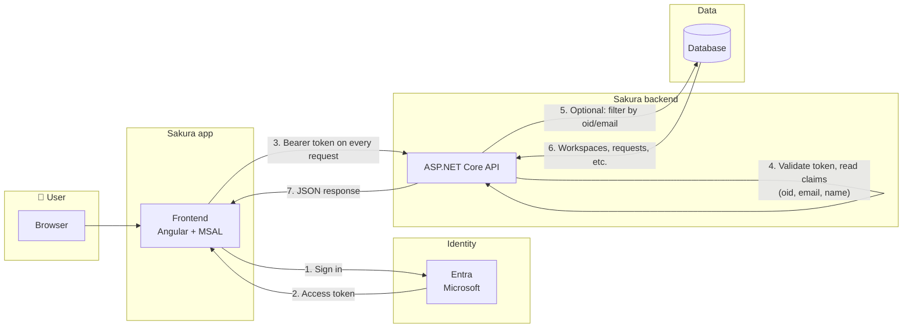
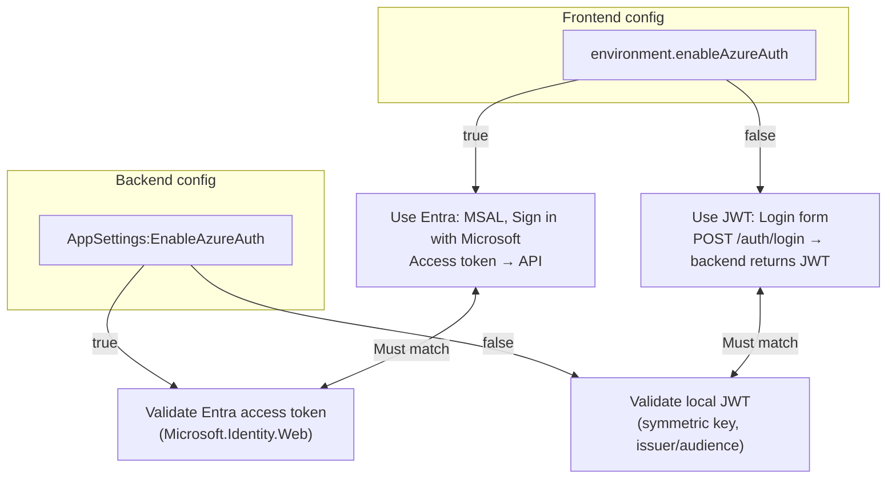
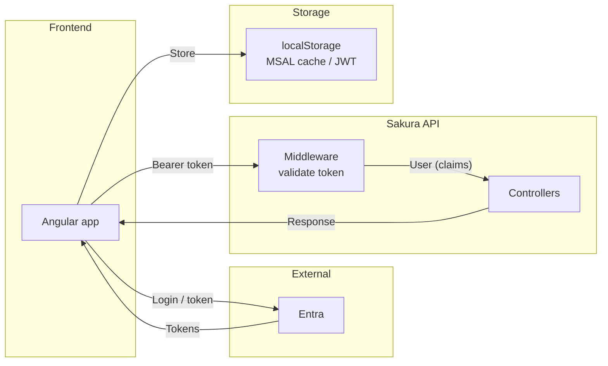
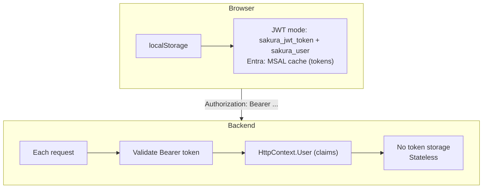
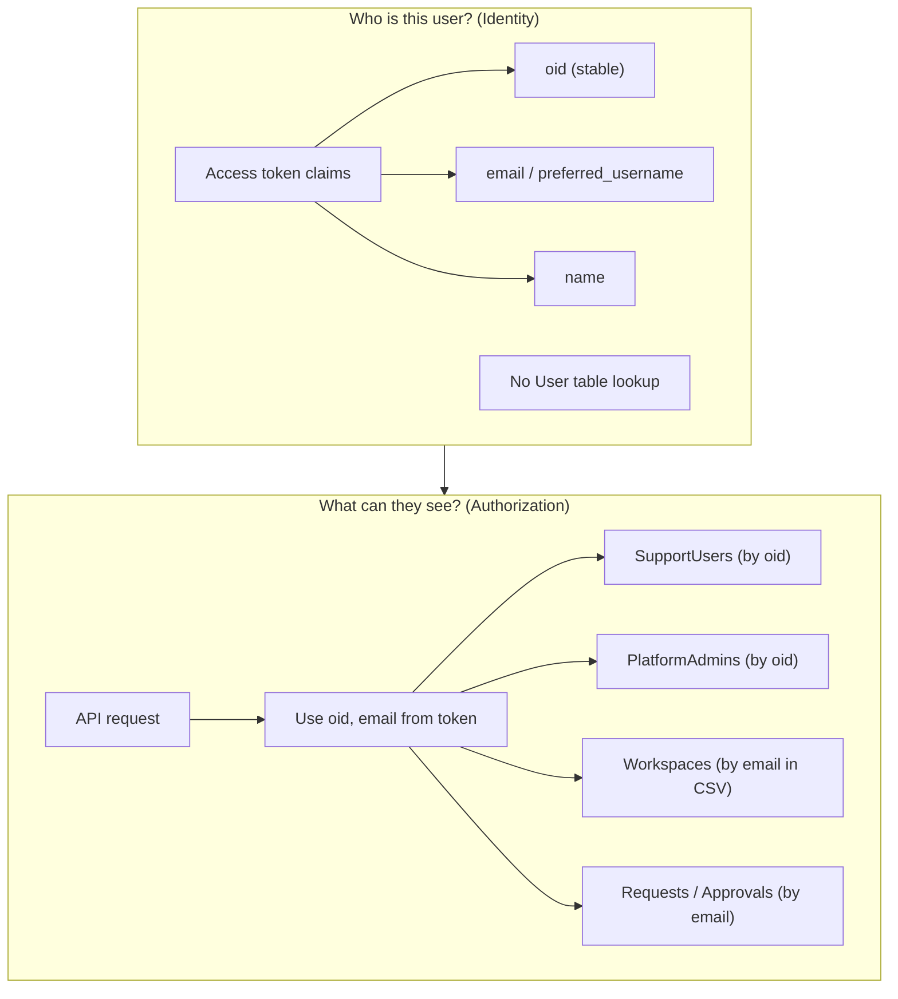

# Sakura auth – whole picture (from code)

Simple end-to-end view: **frontend**, **backend**, **database**, **Entra**, and how they talk. All of this is based on the current codebase.

---

## 1. The big picture in one paragraph

**User** opens the Sakura app in the **browser**. If the app is configured for **Entra** (`enableAzureAuth: true`), they **sign in with Microsoft** (Entra). The **frontend** gets an **access token** from Entra and sends it to the **backend** on every API call. The **backend** does **not** use a User table: it learns **who the user is** only from the **token** (oid, email, name). **Role** and **workspace** can come from the token or later from the **database** (tables keyed by oid/email). So: **identity = token claims**; **authorization** = token + optional DB (SupportUsers, PlatformAdmins, Workspaces by email).



---

## 2. The pieces and what they do

| Piece | What it is (in this app) | Responsibility |
|--------|---------------------------|----------------|
| **Browser** | User runs the Angular app (e.g. Static Web App). | Runs frontend; stores token in MSAL cache (localStorage); sends `Authorization: Bearer <token>` to the API. |
| **Frontend (Angular)** | SPA in `FE/application`. | Login UI; talks to Entra via MSAL; calls backend APIs with the token; shows “current user” from GET /auth/me. |
| **Entra (Microsoft)** | Azure AD / Microsoft Entra ID. | **Identity only**: “Who is this person?” Issues **ID token** (who signed in) and **access token** (for the API). Does **not** know about Sakura roles or workspaces. |
| **Backend (ASP.NET Core API)** | `BE_Main/.../Dentsu.SakuraApi`. | Validates the Bearer token; reads **oid, email, name** (and optionally role/workspace) from token; returns data. No “User table” lookup for identity. |
| **Database** | Sakura DB (e.g. SQL). | Stores **business data**: workspaces, requests, approvals, etc. Can store **SupportUsers** (by oid), **PlatformAdmins** (by oid), **Workspaces** (by email in CSV). Used for **authorization** (who can see what), not for “who are you?” |

---

## 3. How auth mode is chosen (from code)

- **Frontend:** `environment.enableAzureAuth` (e.g. in `environment.api-dev.ts`).  
  - `true` → use **Entra** (MSAL, “Sign in with Microsoft”, access token to API).  
  - `false` → use **JWT** (login form, POST /auth/login, backend returns a JWT; that JWT is sent on later requests).
- **Backend:** `AppSettings:EnableAzureAuth` (e.g. in appsettings or Azure App Setting `AppSettings__EnableAzureAuth`).  
  - `true` → validate **Entra** access tokens (Microsoft.Identity.Web).  
  - `false` → validate **local JWT** (symmetric key, issuer/audience from config).

Frontend and backend must match: both Entra or both JWT, and backend must trust the token the frontend sends.



---

## 4. Entra flow step by step (what the code does)

1. **User opens app** → Angular loads; if `enableAzureAuth`, MSAL is configured and an **APP_INITIALIZER** runs: `initialize()` → `handleRedirectPromise()` → `setActiveAccount()` so MSAL is ready before the app uses it.
2. **User goes to a protected route** → **MsalGuard** runs. If not signed in, user is sent to `/login`.
3. **User clicks “Sign in with Microsoft”** → `MsalService.loginRedirect()` (e.g. in `ui-azure-login.component.ts`). Browser goes to **Entra**; user signs in; Entra redirects back to the app with auth code.
4. **MSAL** exchanges the code for **tokens** (ID token + access token). These are cached in the browser (localStorage). The **access token** audience is the API (`api://e73f4528-.../access_as_user`).
5. **App loads the layout** → Layout waits for MSAL idle (or 2s timeout), then calls **AuthService.getCurrentUser()**.
6. **getCurrentUser()** (when Azure auth is on) uses **acquireTokenSilent()** to get the **access token**, then calls **GET /api/Auth/me** with header **`Authorization: Bearer <access_token>`** (explicit header so the call always has a token).
7. **Backend** receives the request. **Authentication middleware** (Microsoft.Identity.Web when `EnableAzureAuth` is true) validates the token (signature, issuer, audience, expiry) and fills **HttpContext.User** with **claims** from the token.
8. **GET /auth/me (GetMe)** reads **User** (claims only, no DB for identity):  
   - **userId** = oid (preferred) or sub, etc.  
   - **email** = preferred_username, upn, unique_name, or email claim (never sub as email).  
   - **name** = name claim.  
   - **role** = from token or default `"User"`; **workspaceId/workspaceName/approverLevel** from token if present (today the code does not read these from DB in GetMe).
9. Backend returns **JSON**: `{ userId, email, name, role, workspaceId, workspaceName, approverLevel }`.
10. Frontend stores this in **localStorage** (`sakura_user`) and in **BehaviorSubject** so the UI shows name/email. Other API calls use the **MsalInterceptor** (or the same explicit token for /auth/me) to attach the Bearer token.

So: **Entra** = “who is this person?” (token). **Backend** = “I trust the token; here’s what I read from it.” **Database** = not used for identity in GetMe in current code; used elsewhere for “what can this user see?” (by oid/email).

```mermaid
sequenceDiagram
    actor User
    participant Browser as Browser / Angular
    participant MSAL as MSAL
    participant Entra as Entra (Microsoft)
    participant API as Sakura API
    participant DB as Database

    User->>Browser: Open app
    Browser->>MSAL: APP_INITIALIZER: initialize(), handleRedirectPromise()
    MSAL-->>Browser: Ready

    User->>Browser: Navigate to protected route
    Browser->>MSAL: MsalGuard: not signed in?
    MSAL-->>Browser: Redirect to /login

    User->>Browser: Click Sign in with Microsoft
    Browser->>MSAL: loginRedirect()
    MSAL->>Entra: Redirect to login.microsoftonline.com
    User->>Entra: Sign in (credentials)
    Entra-->>Browser: Redirect back with auth code
    Browser->>MSAL: handleRedirectPromise, exchange code
    MSAL->>Entra: Exchange code for tokens
    Entra-->>MSAL: ID token + Access token
    MSAL-->>Browser: Tokens cached (localStorage)

    Browser->>Browser: Layout loads; wait for MSAL idle or 2s
    Browser->>MSAL: acquireTokenSilent(scopes, account)
    MSAL-->>Browser: accessToken
    Browser->>API: GET /api/Auth/me with Bearer token
    API->>API: Validate token, HttpContext.User claims
    API->>API: GetMe: read oid, email, name from User
    API-->>Browser: userId, email, name, role
    Browser->>Browser: setStoredUser; UI shows name/email

    Note over Browser,API: Later API calls
    Browser->>API: Any API + Bearer token
    API->>API: Validate token, User.Claims
    API->>DB: Optional: filter by oid/email
    DB-->>API: Data
    API-->>Browser: JSON
```

---

## 5. APIs and who uses them

| API | Direction | Purpose |
|-----|-----------|--------|
| **Entra (login.microsoftonline.com)** | Browser ↔ Entra | User signs in; frontend gets ID + access token. No Sakura backend involved. |
| **GET /api/Auth/me** | Frontend → Backend | “Who am I?” Backend returns userId, email, name, role, workspace from **token claims** only. Must have `Authorization: Bearer <access_token>`. |
| **POST /api/Auth/login** | Frontend → Backend | Used only when **not** Entra (JWT mode). Email/password → backend returns JWT + user. Not used in Entra flow. |
| **All other APIs** (e.g. workspaces, requests) | Frontend → Backend | Same Bearer token. Backend validates token, then uses **oid/email from User** (and optionally DB) to filter data. |



---

## 6. Where tokens live

- **Browser:** MSAL stores tokens in **localStorage** (when Entra). For JWT mode, the app stores the JWT in localStorage under `tokenKey` and user in `sakura_user`.
- **Backend:** Does **not** store tokens. It only **validates** the Bearer token on each request and reads **HttpContext.User** (claims). Stateless.



---

## 7. Database role (from current design / docs)

- **No User table** for identity: “who am I?” = token claims (oid, email, name).
- **SupportUsers / PlatformAdmins** (if present): keyed by **oid** → “is this user support / platform admin?”.
- **Workspaces**: filtered by **email** (e.g. WorkspaceOwner, WorkspaceTechOwner CSV) → “which workspaces can this user see?”.
- **Requests / approvals**: filtered by **email** (e.g. CreatedBy, approver) → “my requests”, “pending for me”.

So: **identity = token**; **authorization / visibility = token + DB** (by oid or email).



---

## 8. How business APIs work with Entra (GetWorkspaces, GetWorkspaceApp, Create AppAudience)

Every call to the Sakura API (workspaces, workspace apps, app audiences, etc.) follows the **same pattern** when Entra is on. The only difference is the URL and parameters; auth is identical.

### One flow for all business APIs

1. **Frontend** (e.g. a component) calls a domain service: `workspaceService.getWorkspaces()`, or a WSO service that calls `GET /workspaces/{id}/WorkspaceApp`, or `POST .../AppAudience`.
2. The domain service uses **ApiService** (e.g. `apiService.get('/workspaces', { forUser, includeDeleted })`). It does **not** set the `Authorization` header itself.
3. The request goes through **HttpClient**. When `enableAzureAuth` is true, **MsalInterceptor** runs first: it sees the request URL matches the protected resource map (your API base URL), gets an **access token** (from cache or silently), and adds **`Authorization: Bearer <access_token>`** to the request.
4. The request hits the **backend** with the Bearer token.
5. **Backend**: Authentication middleware validates the token and fills **`HttpContext.User`** with claims (oid, email, name, etc.). If the controller has **`[Authorize]`**, only then is the action run; otherwise the action runs but `User` is still set when the token is valid.
6. The **controller** runs (e.g. `WorkspaceController.GetWorkspaces(forUser)`). It uses **route/query/body** (e.g. `workspaceId`, `appId`, `forUser`) and, when needed, can use **`User`** (e.g. to replace `forUser` with the current user’s email from the token).
7. The **service** (e.g. `WorkspaceService.GetWorkspacesForUserAsync(forUser)`) talks to the **database** (filter by email in WorkspaceOwner/WorkspaceTechOwner/WorkspaceApprover, or by workspaceId for child resources).
8. Backend returns JSON → frontend receives it and updates the UI.

So: **same token, same middleware, same User**; only the endpoint and parameters change.

### Example APIs in one picture

| API | Frontend call | Backend controller | How “current user” is used |
|-----|----------------|--------------------|----------------------------|
| **GET /workspaces** | `apiService.get('/workspaces', { forUser, includeDeleted })` | `WorkspaceController.GetWorkspaces(forUser)` | Backend filters workspaces where **forUser** is in Owner/TechOwner/Approver CSV. For Entra, **forUser** should be the current user’s **email** (from GET /auth/me or `authService.currentUserValue?.email`). Today the frontend may hardcode a value; it should pass the logged-in user’s email. |
| **GET /workspaces/{id}/WorkspaceApp** | `apiService.get('/workspaces/:workspaceId/apps', { workspaceId })` | `WorkspaceAppController.ListWorkspaceApps(workspaceId)` | No `forUser` in URL; backend returns apps for that **workspaceId**. Access control is effectively “user must already have access to the workspace” (e.g. they got workspaceId from GET /workspaces filtered by their email). |
| **POST .../AppAudience** (create) | `apiService.post('/workspaces/:workspaceId/apps/:appId/audiences', body)` | `AppAudienceController.AddAppAudienceAsync(workspaceId, appId, request)` | Backend ensures workspace and app exist and are linked; creates the audience. Again, “current user” is implied by the **Bearer token**; the backend could later add checks (e.g. only workspace owners can create) using **User** (oid/email). |

### Mermaid: one request (e.g. GET workspaces or GET workspace apps)

```mermaid
sequenceDiagram
    participant Component as UI Component
    participant Service as Domain Service
    participant Api as ApiService
    participant MSAL as MsalInterceptor
    participant API as Sakura API
    participant DB as Database

    Component->>Service: getWorkspaces() or getApps(workspaceId)
    Service->>Api: get('/workspaces', { forUser, includeDeleted })<br/>or get('/workspaces/:id/apps')
    Api->>Api: Build URL + params (no Auth header)
    Api->>MSAL: HttpClient.get(url)

    Note over MSAL: URL matches protectedResourceMap
    MSAL->>MSAL: acquireTokenSilent() or use cache
    MSAL->>API: GET url + Authorization: Bearer &lt;token&gt;

    API->>API: Validate token → User (oid, email, name)
    API->>API: Controller: GetWorkspaces(forUser) or ListWorkspaceApps(workspaceId)
    API->>DB: Service: filter by forUser or by workspaceId
    DB-->>API: Rows
    API-->>MSAL: JSON response
    MSAL-->>Api: response
    Api-->>Service: mapped data
    Service-->>Component: workspaces or apps
```

### Important points for Entra

- **Token:** Every business API request (GET workspaces, GET workspace apps, POST create AppAudience, etc.) uses the **same** Entra access token, attached by **MsalInterceptor** (when the request URL matches the API).
- **Backend “current user”:** After validation, the backend has **`User`** (claims). It can use **`User`** instead of trusting a **forUser** query param (e.g. GET /workspaces could take email from `User` and ignore or override `forUser` for security).
- **GET /workspaces and forUser:** The backend **requires** a `forUser` query parameter and filters by it. For Entra, the frontend should pass the **current user’s email** (e.g. from `authService.currentUserValue?.email` after GET /auth/me has run), not a hardcoded email.
- **Workspace-scoped APIs (apps, audiences):** They take **workspaceId** (and **appId**) in the path. The user is only supposed to call these for workspaces they already have access to (from GET /workspaces filtered by their email). The backend can later add **`[Authorize]`** and extra checks (e.g. ensure current user’s email is in that workspace’s Owner/TechOwner/Approver) if needed.

---

## 9. One-line summary

**Frontend** gets identity from **Entra** (access token), sends that token to the **backend** on every call; **backend** trusts the token and reads **oid, email, name** (and optionally role/workspace) from it; **database** is used for **what** the user can see/do (by oid/email), not for **who** the user is. That’s the whole picture from the code.
