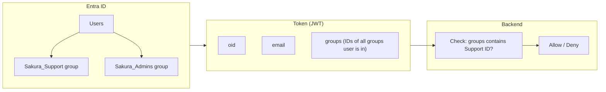
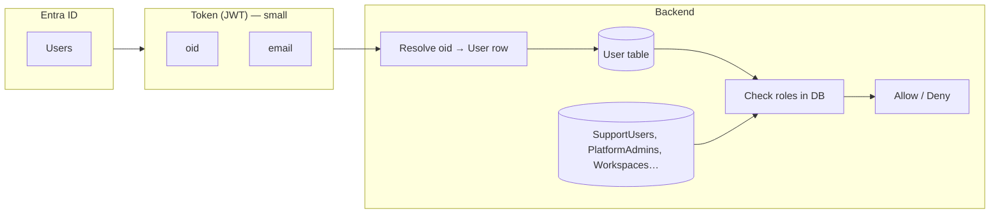
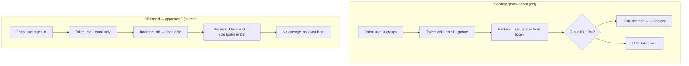

# Sakura — Entra Auth & Roles: Step-by-Step Roadmap

This document is a **zero-assumption, step-by-step roadmap** so that authentication with Microsoft Entra ID works flawlessly and each user has correct permissions. It follows **Approach 3 (Hybrid)**:

- **Stable link:** Entra **oid** (object ID) links token to DB; **oid** does not change when email changes.
- **User table:** One row per user (EntraObjectId, Email, DisplayName). **Email change** = update this single row; no mass update of Workspaces or approvers.
- **All role data in DB:** Support, Platform Admin, workspace Owner/Approver, and RLS/OLS approvers are in Sakura DB (keyed by UserId or EntraObjectId, or by email with “current email” from User table). No dependency on Entra groups or token roles for permissions.

---

## Why we moved from security-group–based to DB-based roles

Originally, roles like **Support** and **Platform Administrator** can be modelled with **Entra ID security groups** or **App roles**: you put users in groups (e.g. `Sakura_Support`, `Sakura_Admins`), configure the token to include a **groups** (or **roles**) claim, and the backend decides access by reading those claims. This works for small teams and simple setups. For Sakura we moved to a **DB-based** approach for roles so that the system stays **accurate**, **performant**, and **scalable** at tens of thousands of users, and so that **email changes** are easy to handle without touching Entra or mass-updating data. Below is the rationale, with diagrams.

### Security-group–based approach (what we moved away from)

In this model, role membership lives in **Entra**: security groups or App role assignments. The token carries that information so the backend can authorize without a DB lookup for roles.

**Why we moved away from it:**

| Issue | What happens |
|-------|------------------|
| **Token size** | Entra limits token size. Adding many groups (or roles) inflates the token; with large tenants or many app-specific groups, the token can grow too large or hit limits. |
| **Groups overage** | If a user is in **more than a few groups** (e.g. 200+), Entra does **not** put all group IDs in the token. Instead the token contains an "overage" marker, and the backend must call **Microsoft Graph** to resolve group membership. That adds latency, dependency on Graph, and complexity. |
| **Scale (70k+ users)** | With tens of thousands of users, managing "who is Support" or "who is Admin" only in Entra means either few, large groups (hard to reason about) or many groups and token/overage issues. Role lifecycle (onboarding, offboarding, audits) is split between Entra and the app. |
| **Email change** | When a user's email changes in Entra, group membership is unchanged—so roles still work. But the app often stores **email** elsewhere (e.g. WorkspaceOwner, approver lists). Then you must either mass-update those references or maintain a separate mapping. The **security group** model doesn't solve that; a **stable identity (oid) + DB** model does. |

So we keep **Entra for authentication** (who you are: **oid** + email in the token) and move **authorization** (Support, Platform Admin, workspace visibility) into **Sakura DB**, keyed by **oid** or an internal **UserId** derived from it.

### DB-based approach (what we use now — Approach 3)

Here, the token only needs to identify the user (**oid** and optionally **email**). The backend resolves **oid** to a **User** row in the DB and then checks **role and workspace data only in the DB**. No groups or roles claim required; no Graph call for overage.

**Why this fits us:**

| Benefit | How it helps |
|---------|------------------|
| **Small, stable token** | Token stays small (oid + email). No groups or roles claim; no token bloat and no groups overage, regardless of how many Entra groups the user belongs to. |
| **One place for roles** | Support, Platform Admin, workspace Owner/Approver, and RLS/OLS approvers all live in **Sakura DB**. Backend does one lightweight lookup (oid → User), then uses **UserId** or **EntraObjectId** (and, for legacy CSV, **current email** from the User table) for all permission checks. |
| **Scales to 70k+ users** | No dependency on Entra group membership for app roles. Add/remove Support or Admins by inserting/deleting rows in DB tables. No Graph calls; no token limits tied to group count. |
| **Email change = one row** | When email changes in Entra, the next login sends the **same oid** and **new email**. Backend updates the **User** row (Email, UpdatedAt). Workspaces and approver tables that are keyed by **UserId** or **oid** need no change; those that still match by email use **User.Email** at runtime, so one update keeps everything consistent. |

### Side-by-side (high level)

In short: we moved from a **security-group–based** approach to a **DB-based** one so that **identity** stays in Entra (oid + email in the token) and **all role and permission data** lives in the Sakura DB, keyed by a stable identifier. That keeps the token small, avoids groups overage and Graph dependency, scales to very large user counts, and makes email changes a single-row update in the User table.

---

Every step states **which portal or system** to use, **what to change**, **for which environment**, and **why** in terms of **accurate**, **performant**, **scalable**, and **consistent** behaviour.

---

## Part A — Definitions and Principles

### A.1 Definitions (so we use the same language)

| Term | Definition |
|------|------------|
| **Approach 3 (Hybrid)** | Identity link = **stable** (Entra `oid`). DB has a **User/UserIdentity** table keyed by `oid`; **email** is stored there and updated when it changes. Permissions can be keyed by internal **UserId** or **EntraObjectId**; legacy CSV columns may still use email, with “current email” read from the User table. |
| **Entra ID** | Microsoft Entra ID (formerly Azure AD). The identity provider: holds users, groups, and app registrations. |
| **oid (Entra Object ID)** | Stable identifier for a user in the Entra tenant. **Does not change** when the user’s email/UPN changes. Present in the token as claim `http://schemas.microsoft.com/identity/claims/objectidentifier` or `oid`. This is the **primary link** between Entra and Sakura DB. |
| **sub (subject)** | Stable per user per app in the token. Can differ across app registrations. Alternative to `oid` for linking; we use **oid** for tenant-wide consistency. |
| **App Registration** | In Entra: the “application” that represents your SPA (or API). Has a Client ID, redirect URIs, and optional app roles. |
| **Enterprise Application** | The “instance” of an App Registration in your tenant; used for **Assign users and groups** and optional SSO. |
| **Token** | JWT issued by Entra after login. Contains claims: `oid`, `sub`, `preferred_username`, `email`, and optionally `name`. |
| **Current user** | The identity the backend trusts for the request: derived from the validated Bearer token (**oid** + email from token); then resolved to **UserId** and **current email** via the **User** table. Never from client-supplied parameters. |
| **User / UserIdentity table** | DB table that maps **Entra oid → internal UserId** and stores **Email**, **DisplayName**, **UpdatedAt**. One row per user. When email changes in Entra, update this single row; no mass update of Workspaces or approvers. |
| **UserId** | Internal primary key in Sakura DB for a user (e.g. `dbo.Users.Id`). Used to key **Support**, **Platform Admin**, and (optionally) future workspace/approver data. Linked to **EntraObjectId** in the User table. |
| **Workspace Owner / Tech Owner / Approver** | Stored in **Sakura DB** in `Workspaces.WorkspaceOwner`, `WorkspaceTechOwner`, `WorkspaceApprover` (CSV emails). Defines who can manage that workspace and who sees it in the list. For **Approach 3**, “current user email” used for matching comes from the **User** table (so one place to update on email change). |
| **Support** | A user who can see **all** workspaces. Maintained in **Sakura DB** (e.g. `SupportUsers(EntraObjectId)` or `SupportUsers(UserId)`), not in Entra. |
| **Platform Administrator (ADM)** | Can create workspaces, change application settings, see event logs. Maintained in **Sakura DB** (e.g. `PlatformAdmins(EntraObjectId)` or `UserRoles(UserId, Role)`), not in Entra. |
| **Requester (REQ)** | Any authenticated user; can create and view their own requests. No separate store. |
| **Approver (APR)** | User appears in DB as RLS/OLS/report approver for a workspace. Maintained in **Sakura DB** (approver tables and WorkspaceApprover). |

### A.2 Four principles and how they drive the steps

| Principle | Meaning | How we apply it (Approach 3) |
|-----------|--------|-----------------------------|
| **Accurate** | Identity and permissions reflect reality; no wrong access. | Backend derives user from token **oid** (stable); resolves to **UserId** and **current email** via **User** table. All role data (Support, Platform Admin, workspace/approver) in **DB**; one source per role type. Email change = update one User row. |
| **Performant** | No unnecessary latency or load. | Validate token once; one lightweight DB lookup (oid → User) per request (or per login + cache in request scope). No token bloat; no Entra group calls. |
| **Scalable** | Adding users/workspaces/environments doesn’t require re-architecting. | **70k+ users**: no Entra groups for roles; all role data in DB. New user = one row in User table (on first login). Support/Admin = rows in DB tables. Same pattern Dev/UAT/Prod. |
| **Consistent** | Same rules everywhere; same behaviour across envs. | One auth pipeline: token (oid + email) → resolve to User (UserId, current email) → authorize from DB. Same schema and logic everywhere; only config differs per env. |

---

## Part B — Roadmap Overview

| Phase | Goal | Main outcome (Approach 3) |
|-------|------|----------------------------|
| **1** | Entra foundation | App registration(s), redirect URIs, token claims (**oid** + email); users sign in and get a valid token. |
| **2** | Backend: trust the token + User table | ICurrentUserService (oid + UserId + current email from **User** table); **User/UserIdentity** table; resolve oid on each request; no trust of client `forUser`. |
| **3** | Frontend: use token only | No hardcoded `forUser`; call `/auth/me`; use current user for workspaces and audit fields. |
| **4** | Roles and assignment (all in DB) | **Support** and **Platform Admin** in **Sakura DB** tables (keyed by EntraObjectId or UserId); workspace/approver data in DB; backend enforces from DB. **Email change**: update single User row. |
| **5** | Per-environment checklist | Dev, UAT, Prod each configured correctly (including User table and oid resolution). |
| **6** | Validation and go-live | Smoke tests, email-change test, and checklist so auth works flawlessly. |

---

## Phase 1 — Entra foundation (Azure Portal)

**Goal:** So that the frontend can redirect users to Entra, get a token, and the backend can validate it with correct audience/issuer.

---

### Step 1.1 — Create or identify the App Registration (per environment)

| Where | Azure Portal → Microsoft Entra ID → App registrations |
|-------|--------------------------------------------------------|
| What | **New registration** (or use existing e.g. for UAT). One app per environment is recommended (Dev, UAT, Prod) for isolation. |
| Name | e.g. `Sakura-SPA-Dev`, `Sakura-SPA-UAT`, `Sakura-SPA-Prod` (or `azeuw1dweb01sakura` for UAT if that’s your convention). |
| Supported account types | “Accounts in this organizational directory only” (single tenant). |
| Redirect URI | Leave empty for now; we set it in the next step. |

**Why (Accurate / Performant / Scalable / Consistent)**  
- **Accurate:** Each environment has its own client ID and redirect URI so tokens and redirects can’t be mixed.  
- **Scalable:** Adding a new environment = new app registration, same steps.  
- **Consistent:** Same structure in Dev, UAT, Prod.

**Environments:** Repeat for Dev (optional if you use JWT-only in dev), UAT, Prod.

---

### Step 1.2 — Add SPA redirect URIs and enable PKCE

| Where | Same App registration → **Authentication** |
|-------|---------------------------------------------|
| What | 1. Platform: **Add a platform** → **Single-page application**.  
|      | 2. Redirect URIs:  
|      | - **Dev:** `http://localhost:4200`, `http://localhost:4200/`  
|      | - **UAT:** `https://<your-uat-static-web-app-url>` (e.g. `https://lemon-wave-07fa68003.2.azurestaticapps.net`)  
|      | - **Prod:** `https://<your-prod-url>` (e.g. `https://sakura.dentsu.com`)  
|      | 3. Under **Implicit grant and hybrid flows**: leave **unchecked** (we use Authorization code + PKCE only).  
|      | 4. **Save**. |

**Why**  
- **Accurate:** Redirect URI must match exactly what the frontend uses; wrong URI = auth failure.  
- **Performant / Consistent:** PKCE is the standard for SPAs; no implicit flow.

**Environments:** Configure only the URIs that apply to this app (e.g. one app for UAT = UAT URI only; if one app for all, add all three URIs).

---

### Step 1.3 — API permissions

| Where | Same App registration → **API permissions** |
|-------|--------------------------------------------|
| What | **Add a permission** → **Microsoft Graph** → **Delegated**:  
|      | - `openid`  
|      | - `profile`  
|      | - `User.Read`  
|      | (Optional) **APIs my organization uses** → your backend API if you expose a custom scope (e.g. `api://<backend-client-id>/access_as_user`). For validating the token with audience = SPA client ID, Graph is enough.  
|      | **Grant admin consent** (if your policy requires it). |

**Why**  
- **Accurate:** `openid` and `profile` give a standard ID token/access token with `sub`, `preferred_username`, etc.  
- **Consistent:** Same minimal set everywhere.

---

### Step 1.4 — Token configuration (optional claims)

| Where | Same App registration → **Token configuration** |
|-------|-------------------------------------------------|
| What | **oid** is already in the token by default (no need to add). **Add optional claim** → **ID token** (and **Access token** if frontend sends access token to backend):  
|      | - `email`  
|      | - `preferred_username`  
|      | So the backend has **oid** (stable link to DB) and **email/UPN** (for creating/updating the User row and for display). |

**Why (Approach 3)**  
- **Accurate:** **oid** never changes when email changes; backend links to User table by oid. Email in token is used to create/update the User row.  
- **Performant:** No Graph API call; oid + email in token.  
- **Consistent:** Same claims in every request.

---

### Step 1.5 — Expose optional API scope (if backend validates tokens with custom audience)

| Where | Same App registration → **Expose an API** |
|-------|-------------------------------------------|
| What | If you want the backend to accept tokens with audience `api://<this-app-client-id>/access_as_user`:  
|      | **Add a scope**: `access_as_user`, “Admins and users”.  
|      | **Application ID URI**: default `api://<client-id>` is fine.  
| Frontend | Then request scope `api://<client-id>/access_as_user` in MSAL so the access token has this audience. |

**Why**  
- **Accurate:** Backend validates that the token was issued for your API, not just for Graph.  
- **Consistent:** Same pattern as in your existing env files that reference `api://.../access_as_user`.

**Environments:** Same Application ID URI pattern per app (Dev/UAT/Prod); only client ID changes.

---

### Step 1.6 — (Optional) Entra group for Support

| Where | Microsoft Entra ID → **Groups** → **New group** |
|-------|-----------------------------------------------|
| What | **Approach 3 uses DB for Support** (see Phase 2 and Phase 4). If you do **not** use DB tables for Support, you can instead create a Security group (e.g. `Sakura_Support`) and add members; backend would then need the **groups** claim and config for the group Object ID. **Recommended:** Use DB table `SupportUsers(EntraObjectId)` or `SupportUsers(UserId)` so role data is in one place and email change needs no Entra/group update. |
| Why | **Scalable (70k users):** DB scales; no token bloat or groups overage. **Consistent:** All role data in DB. |

---

### Step 1.7 — (Optional) Entra App roles for Platform Administrator

| Where | App registration → **App roles** → **Create app role** |
|-------|--------------------------------------------------------|
| What | **Approach 3 uses DB for Platform Admin** (e.g. `PlatformAdmins(EntraObjectId)` or `UserRoles(UserId, Role)`). If you do **not** use DB for ADM, you can define an App role (e.g. `Sakura.Administrator`) and assign users in Enterprise application → Users and groups. **Recommended:** Use DB table so all role data is in DB and email change needs no Entra update. |
| Why | **Accurate / Scalable:** DB = single source; no dependency on token `roles` claim or Entra assignment. |

---

### Step 1.8 — Assign the app to users or groups (who can sign in)

| Where | Microsoft Entra ID → **Enterprise applications** → select your app (e.g. `azeuw1dweb01sakura`) → **Users and groups** |
|-------|--------------------------------------------------------------------------------------------------------------------------|
| What | **Add user/group**: Either assign “Everyone” in the tenant (if all employees may use Sakura) or specific groups/users. |
| Why | **Accurate:** Only assigned users can get a token for the app. **Consistent:** Same assignment model in each env. |

---

## Phase 2 — Backend: trust the token + User table (Approach 3)

**Goal:** Backend validates the Bearer token, resolves **oid** to the **User** table (stable link), and uses **UserId** + **current email** from DB for all authorization. No trust of client-supplied `forUser`. **Email change** = update one User row.

---

### Step 2.1 — Ensure authentication middleware runs

| Where | Code: `AccessControlConfiguration.cs` (or wherever `ConfigureAccessControl(IApplicationBuilder)` is). |
|-------|------------------------------------------------------------------------------------------------------|
| What | Ensure **UseAuthentication()** is called **before** **UseAuthorization()**. Example:  
|      | `app.UseAuthentication();`  
|      | `app.UseAuthorization();`  
|      | *(In this repo it was previously commented out; it is now enabled so Bearer tokens are validated.)* |
| Why | **Accurate:** Without this, the Bearer token is never validated and `HttpContext.User` is not set. **Consistent:** Every request goes through the same pipeline. |

---

### Step 2.2 — Configure AzureAd in appsettings (per environment)

| Where | Backend: `appsettings.json` and/or `appsettings.{Environment}.json`, or Key Vault. |
|-------|-------------------------------------------------------------------------------------|
| What | When **AppSettings:EnableAzureAuth** is true, the **AzureAd** section must be valid:  
|      | - `Instance`: `https://login.microsoftonline.com/`  
|      | - `TenantId`: your Entra tenant ID (same as in frontend authority)  
|      | - `ClientId`: the **SPA** App Registration’s Client ID (so the backend validates tokens issued for that client)  
|      | - Optional: `Audience`: if you use a custom scope, e.g. `api://<client-id>/access_as_user` |
| Why | **Accurate:** Valid issuer and audience so only your tenant and your app’s tokens are accepted. **Consistent:** Same section name and shape in all envs; only values differ. |

**Environments:**  
- **Dev (JWT):** `EnableAzureAuth: false`; use **Jwt** section.  
- **UAT / Prod:** `EnableAzureAuth: true`; **AzureAd** with that env’s tenant and SPA client ID.

---

### Step 2.3 — Add User / UserIdentity table (Approach 3)

| Where | Sakura DB: new table (e.g. `dbo.Users` or `dbo.UserIdentity`). |
|-------|---------------------------------------------------------------|
| What | Create table with at least:  
|      | - **Id** (PK, int identity) — internal **UserId**.  
|      | - **EntraObjectId** (unique, nvarchar) — **oid** from Entra token; **never changes** when email changes.  
|      | - **Email** (nvarchar) — current email/UPN; **update this** when user’s email changes in Entra.  
|      | - **DisplayName** (nvarchar, optional).  
|      | - **CreatedAt**, **UpdatedAt** (datetime2).  
|      | Optional: **IsSupport**, **IsPlatformAdmin** as columns, or use separate tables (Step 2.8 / 2.9). |
| **Why (Approach 3)**  
- **Accurate:** One row per user; **oid** is the stable link. When email changes in Entra, update only **Email** and **UpdatedAt** in this row; no mass update of Workspaces or approvers.  
- **Performant:** Single lookup by oid (indexed). **Scalable:** 70k+ users; no token bloat. **Consistent:** Same schema in all envs. |

---

### Step 2.4 — Resolve oid to User on each request (create/update User row)

| Where | Backend: service (e.g. `IUserResolutionService` or inside `ICurrentUserService`). |
|-------|----------------------------------------------------------------------------------|
| What | After validating the token, read **oid** and **email** (and optionally **name**) from claims.  
|      | 1. Look up **User** by **EntraObjectId** = oid.  
|      | 2. If not found: **INSERT** a new row (EntraObjectId, Email, DisplayName, CreatedAt, UpdatedAt).  
|      | 3. If found and token email differs from **User.Email**: **UPDATE** User set Email = token email, UpdatedAt = now. (This is **email-change handling**.)  
|      | 4. Expose **UserId** (Id) and **current Email** (from User row) to the rest of the backend. |
| **Why (Approach 3)**  
- **Accurate:** “Current user” is always the row keyed by oid; email in DB is always current after login.  
- **Performant:** One indexed lookup + optional single-row update. **Consistent:** Same flow every request. |

---

### Step 2.5 — Add ICurrentUserService (oid + UserId + current email from User table)

| Where | Backend: new interface and implementation. |
|-------|-------------------------------------------|
| What | 1. **Interface** (e.g. in Application or Domain):  
|      | `string? EntraObjectId { get; }`  // oid from token  
|      | `int? UserId { get; }`  // internal Id from User table (after resolution)  
|      | `string? Email { get; }`  // **from User table** (current email; updated on email change)  
|      | `string? Name { get; }`  // display name from User or token  
|      | 2. **Implementation**: reads **oid** and email from `HttpContext.User`; calls User resolution (Step 2.4); returns **UserId**, **Email** (from User table), **EntraObjectId**, **Name**.  
|      | 3. **Dev JWT:** if no oid, map from existing claims (e.g. email) and resolve or create User by email, or return token email as-is for backward compatibility.  
|      | 4. Register as **Scoped**. |
| **Why (Approach 3)**  
- **Accurate:** Email used for workspace/approver matching comes from **User** table (one place to update on email change). **Performant:** One DB round-trip (resolution). **Consistent:** Same API for Entra and JWT. |

---

### Step 2.6 — Implement /auth/me

| Where | Backend: `AuthController` or dedicated `MeController`. |
|-------|--------------------------------------------------------|
| What | **GET /api/Auth/me** (or your route):  
|      | - Requires authenticated user (Bearer).  
|      | - Read from **ICurrentUserService**: **UserId** (internal), **EntraObjectId**, **Email** (from User table — current email), **Name**.  
|      | - Optionally enrich from DB (e.g. isSupport, isPlatformAdmin from DB tables).  
|      | - Return JSON: `{ userId, entraObjectId?, email, name, role, workspaceId?, workspaceName?, approverLevel? }` so the frontend matches its existing `AuthUser` shape. Use **email from User table** so frontend always sees the current email. |
| Why (Approach 3) | **Accurate:** Frontend gets the same identity (and current email) the backend uses. **Consistent:** Same response shape in all envs. |

---

### Step 2.7 — Remove trust of client forUser for workspaces

| Where | Backend: `WorkspaceController` (and any service that uses “current user” for workspace list). |
|-------|----------------------------------------------------------------------------------------------|
| What | 1. **Do not** take `forUser` from the query string for normal users.  
|      | 2. Get **current user email** from **ICurrentUserService.Email** (this is the **email from the User table**, so it stays correct after an email change).  
|      | 3. If current user is **Support** (see Step 2.8), call `GetAnyWorkspacesAsync()` (or equivalent) and return all workspaces.  
|      | 4. Otherwise call `GetWorkspacesForUserAsync(currentUserEmail, includeDeleted)` and return that list.  
|      | 5. Optionally keep `forUser` as an optional parameter **only** for Support users (e.g. “act as” for troubleshooting), and validate that the caller is Support before using it. |
| Why (Approach 3) | **Accurate:** Matching uses **current email from User table**; when email changes, one User row update keeps workspace visibility correct. **Consistent:** Same logic in every environment. |

---

### Step 2.8 — Define and check “Support” in backend (Approach 3: DB)

| Where | Sakura DB: table (e.g. `dbo.SupportUsers`). Backend: service that checks this table. |
|-------|----------------------------------------------------------------------------------------|
| What | **Approach 3:** Create table e.g. **SupportUsers** with column **EntraObjectId** (or **UserId**). Insert rows for support users (e.g. look up their **oid** from Entra or from **Users** table after first login).  
|      | In workspace list logic: if **ICurrentUserService.UserId** (or **EntraObjectId**) exists in **SupportUsers** → return all workspaces; else → filter by current user email (from User table).  
|      | **Alternative:** App setting `AppSettings:SupportUserEmails` (comma-separated) or **SupportUsers(Email)** and match **ICurrentUserService.Email**; less ideal for email change because you’d update SupportUsers too if email changes. Prefer keying by **UserId** or **EntraObjectId**. |
| Why (Approach 3) | **Accurate:** Support is in DB; no Entra group or token claim. **Scalable:** 70k users; no groups overage. **Email change:** No update to SupportUsers if keyed by oid/UserId. **Consistent:** All role data in DB. |

---

### Step 2.9 — Enforce Platform Administrator for sensitive actions (Approach 3: DB)

| Where | Sakura DB: table (e.g. `dbo.PlatformAdmins` or `dbo.UserRoles`). Backend: check before “create workspace”, “application settings”, “event logs”. |
|-------|---------------------------------------------------------------------------------------------------------------------------------------------------|
| What | **Approach 3:** Create table e.g. **PlatformAdmins(EntraObjectId)** or **PlatformAdmins(UserId)** (or **UserRoles(UserId, Role)** with role `PlatformAdministrator`). Insert rows for platform admins.  
|      | Before sensitive actions: if **ICurrentUserService.UserId** (or **EntraObjectId**) is in **PlatformAdmins** (or has role in UserRoles) → allow; else → 403.  
|      | **Alternative:** Entra app role in token; then check `ICurrentUserService` has that role. Approach 3 prefers DB so all role data is in one place and email change needs no Entra update. |
| Why (Approach 3) | **Accurate:** Only designated admins (from DB). **Scalable:** No token roles claim. **Email change:** No update if keyed by oid/UserId. **Consistent:** Same DB-backed check everywhere. |

---

## Phase 3 — Frontend: use token only

**Goal:** Frontend never sends a fake `forUser`; it sends only the Bearer token; workspace list and audit fields use the current user from the backend.

---

### Step 3.1 — Environment files: correct values per environment

| Where | Frontend: `environment.ts`, `environment.uat.ts`, `environment.production.ts` (and api-dev if used). |
|-------|-----------------------------------------------------------------------------------------------------|
| What | For **each** environment set:  
|      | - `apiUrl` = backend base URL for that env.  
|      | - `enableAzureAuth` = `true` for UAT/Prod, `false` for local dev (if using JWT).  
|      | - `azureAd.clientId` = App Registration **Client ID** for that env.  
|      | - `azureAd.authority` = `https://login.microsoftonline.com/<tenant-id>`.  
|      | - `azureAd.redirectUri` and `postLogoutRedirectUri` = **exact** frontend origin for that env (must match Entra redirect URIs).  
|      | - `azureAd.scopes` = `['User.Read','openid','profile']` or include `api://<client-id>/access_as_user` if backend expects that audience. |
| Why | **Accurate:** Wrong redirect URI = login fails; wrong client ID = wrong audience. **Consistent:** Same keys in every file; only values differ. |

**Environments:**  
- **Dev:** e.g. `http://localhost:4200`, client ID of Dev app (or shared).  
- **UAT:** UAT Static Web App URL, UAT app client ID.  
- **Prod:** Prod URL, Prod app client ID.

---

### Step 3.2 — After login: call /auth/me and store user

| Where | Frontend: login flow (e.g. `UiAzureLoginComponent` and `AuthService`). |
|-------|----------------------------------------------------------------------|
| What | 1. After MSAL redirect (or after JWT login), get the token and store it (already done).  
|      | 2. **Call GET /auth/me** with the Bearer token.  
|      | 3. Map response to `AuthUser` (userId, email, name, role, workspaceId, workspaceName, approverLevel) and store in **AuthService** (e.g. `setStoredUser`, `currentUserSubject.next`).  
|      | 4. So for the rest of the app, “current user” comes from this one source. |
| Why | **Accurate:** UI and API use the same identity the backend uses. **Performant:** One call per login. **Consistent:** Same flow for Azure and JWT. |

---

### Step 3.3 — Stop sending forUser for workspaces

| Where | Frontend: `workspace-domain.service.ts` (and any other place that calls `/workspaces`). |
|-------|---------------------------------------------------------------------------------------|
| What | Remove the hardcoded `forUser: 'sakurahelp@dentsu.com'` from **all** workspace API calls.  
|      | Call **GET /workspaces?includeDeleted=false** (or true) **without** a `forUser` parameter.  
|      | Backend will use the token to get the current user and return the correct list. |
| Why | **Accurate:** Users only get workspaces they are allowed to see. **Consistent:** No special dev override that leaks to prod. |

---

### Step 3.4 — Use current user for audit fields

| Where | Frontend: e.g. `wso-object-management.component.ts`, any place that sets `createdBy` / `deletedBy` / `updatedBy`. |
|-------|-------------------------------------------------------------------------------------------------------------------|
| What | Replace every `'current.user@dentsu.com'` or `'sakurahelp@dentsu.com'` with `this.authService.currentUserValue?.email ?? ''` (or from `getCurrentUser()`). |
| Why | **Accurate:** Audit trail reflects the real user. **Consistent:** One source for “current user” in the UI. |

---

### Step 3.5 — Route guards

| Where | Frontend: `app.routes.ts` and guard implementations. |
|-------|------------------------------------------------------|
| What | Ensure protected routes use **MsalGuard** when `enableAzureAuth` is true, and your existing **authGuard** (JWT) when false. Unauthenticated users redirect to `/login`. |
| Why | **Accurate:** No access to app without a valid session. **Consistent:** Same protection in all envs with the right guard per auth mode. |

---

## Phase 4 — Roles and user management (Approach 3: all in DB)

**Goal:** One clear place per role type; **all role-based info in Sakura DB**. Stable link = **oid** via **User** table. **Email change** = update one User row; no mass update of Workspaces or approvers.

---

### Step 4.1 — Where each “role” is maintained (Approach 3 summary)

| Role / Concept | Where to maintain (Approach 3) | Backend how |
|----------------|-------------------------------|-------------|
| **Identity (stable link)** | **Sakura DB:** `dbo.Users` (EntraObjectId, Email, DisplayName, …) | Token **oid** → resolve to User row; **Email** from User table is “current email”. On email change in Entra, update only **User.Email**. |
| **Workspace Owner / Tech Owner** | **Sakura DB:** `Workspaces.WorkspaceOwner`, `WorkspaceTechOwner` (CSV emails) | `GetWorkspacesForUserAsync(**currentUserEmail**)` where currentUserEmail = **User.Email** (from ICurrentUserService). Legacy CSV stays email-based; “current email” comes from User table so one place to update. |
| **Workspace Approver** | **Sakura DB:** `Workspaces.WorkspaceApprover` + RLS/OLS approver tables | Same: match by **current user email** (from User table). |
| **Support** | **Sakura DB:** e.g. `SupportUsers(EntraObjectId)` or `SupportUsers(UserId)` | If ICurrentUserService.UserId/EntraObjectId in SupportUsers → return all workspaces. |
| **Platform Administrator** | **Sakura DB:** e.g. `PlatformAdmins(EntraObjectId)` or `UserRoles(UserId, Role)` | If UserId/EntraObjectId in PlatformAdmins (or has role) → allow create workspace, app settings, etc. |
| **Requester** | No store | Any authenticated user (has User row). |
| **Approver (per workspace/report)** | **Sakura DB:** RLS approvers, OLS/report approvers | Backend checks DB when loading “my approvals” and when approving; match by current user email (from User table). |

**Why (Approach 3)**  
- **Accurate:** One source per role type; **oid** stable; email change = one User row update.  
- **Scalable:** 70k+ users; no Entra groups for roles; no token bloat.  
- **Consistent:** Same DB schema in every environment (data differs, schema same).

---

### Step 4.2 — Email change handling (Approach 3)

| What | When a user’s email changes in Entra (rename, domain change, etc.): |
|------|---------------------------------------------------------------------|
| **Token** | Next login: token has **same oid**, **new email**. |
| **Backend** | Step 2.4 resolution: lookup User by **oid**; **UPDATE User SET Email = new email, UpdatedAt = now**. No change to Workspaces, SupportUsers, PlatformAdmins, or approver tables (they are keyed by UserId/oid or, for legacy CSV, the “current email” used at runtime is always **User.Email** after this update). |
| **Legacy CSV** | If Workspaces/approvers still store **email** in CSV: no mass update needed. At runtime we use **User.Email** for matching; once User row is updated, matching uses the new email. For **display** of “who is owner” in UI you may still show stored CSV values; for **authorization** we use current user’s email from User table. Optional future migration: store **UserId** instead of email in CSV and join to User for display. |

**Why (Approach 3)**  
- **Accurate:** Single place to update. **Performant:** One row update. **Scalable:** No sweep of 70k users or millions of rows. **Consistent:** Same flow for every email change.

---

### Step 4.3 — (Optional) Token “groups” claim only if not using DB for Support

| Where | Entra: App registration → **Token configuration** |
|-------|----------------------------------------------------|
| What | **Approach 3 uses DB for Support**, so you do **not** need the **groups** claim. If you ever keep an Entra group for Support as fallback, add optional claim **groups** and store Support group Object ID in config; backend can check. **Recommended:** Use only DB (SupportUsers) so all role data is in one place. |
| Why | **Performant / Scalable:** No groups in token = smaller token; no groups overage with 70k users. |

---

## Phase 5 — Per-environment checklist (Approach 3)

Use this as a literal checklist; tick when done for each environment.

### Dev (local, JWT)

| Step | Portal / Place | What (Approach 3) | Done |
|------|----------------|-------------------|------|
| 1.1 | Entra | (Optional) App registration for Dev | ☐ |
| 1.2 | Entra | Redirect URI `http://localhost:4200` | ☐ |
| 2.1 | Backend | UseAuthentication() enabled | ☐ |
| 2.2 | Backend | EnableAzureAuth = false; Jwt section set | ☐ |
| 2.3 | DB | User/UserIdentity table created | ☐ |
| 2.4–2.5 | Backend | Resolve user by oid/email; ICurrentUserService (UserId, Email from User table) | ☐ |
| 2.6–2.9 | Backend | /auth/me; workspace list from ICurrentUserService.Email; Support/PlatformAdmin from DB tables | ☐ |
| 3.1 | Frontend | environment: apiUrl, enableAzureAuth false, tokenKey | ☐ |
| 3.2–3.5 | Frontend | /auth/me after login; no forUser; audit from currentUser; guards | ☐ |

### UAT (Entra)

| Step | Portal / Place | What (Approach 3) | Done |
|------|----------------|-------------------|------|
| 1.1–1.5 | Entra | App registration UAT; SPA URIs; permissions; optional claims (email, preferred_username); oid in token by default; optional API scope | ☐ |
| 1.6–1.8 | Entra | (Optional) Entra group/App role if not using DB; assign users/groups to app | ☐ |
| 2.1 | Backend | UseAuthentication() enabled | ☐ |
| 2.2 | Backend | EnableAzureAuth = true; AzureAd = UAT tenant + SPA client ID | ☐ |
| 2.3 | DB | User + SupportUsers + PlatformAdmins (or UserRoles) tables | ☐ |
| 2.4–2.9 | Backend | oid → User resolve (create/update); ICurrentUserService; /auth/me; workspace from User.Email; Support/ADM from DB | ☐ |
| 3.1 | Frontend | environment.uat: apiUrl UAT, enableAzureAuth true, redirectUri = UAT SWA URL, clientId UAT | ☐ |
| 3.2–3.5 | Frontend | Same as Dev | ☐ |

### Production (Entra)

| Step | Portal / Place | What (Approach 3) | Done |
|------|----------------|-------------------|------|
| 1.1–1.8 | Entra | Same as UAT but Prod app registration and Prod redirect URI | ☐ |
| 2.2 | Backend | EnableAzureAuth = true; AzureAd = Prod tenant + SPA client ID | ☐ |
| 2.3 | DB | User + SupportUsers + PlatformAdmins tables (same schema as UAT) | ☐ |
| 2.4–2.9 | Backend | Same as UAT (code same; config different) | ☐ |
| 3.1 | Frontend | environment.production: apiUrl Prod, redirectUri Prod, clientId Prod | ☐ |
| 3.2–3.5 | Frontend | Same as UAT | ☐ |

---

## Phase 6 — Validation (auth works flawlessly) — Approach 3

### Step 6.1 — Smoke tests per environment

| Test | Expected (Approach 3) |
|------|------------------------|
| Unauthenticated GET /api/workspaces | 401 (or redirect to login if you use challenge). |
| Login (Entra or JWT) then GET /api/auth/me | 200; body has userId, email (from User table), name, role. |
| GET /api/workspaces with valid token | 200; list only workspaces where **current user email** (from User table) is in Owner/TechOwner/Approver (or all if Support). |
| Support user GET /api/workspaces | 200; full list (SupportUsers table). |
| Non-admin POST create workspace | 403 if PlatformAdmins enforced; otherwise per your rules. |
| Frontend: after login, workspace list loads | No hardcoded forUser; list matches backend. |
| Frontend: create/delete object | createdBy/deletedBy = current user email (from User). |
| **Email change:** change email in Entra, re-login | User table row updated (same oid, new email); workspace list still correct; no mass update of Workspaces/approvers. |

### Step 6.2 — Quick “nothing missed” checklist (Approach 3)

- [ ] Entra redirect URIs match frontend origins exactly (including trailing slash or not).
- [ ] Backend AzureAd.ClientId = SPA client ID (or audience) for that env.
- [ ] UseAuthentication() is called before UseAuthorization().
- [ ] **User table** exists; **oid** resolution (create/update User row) runs on each request (or after login).
- [ ] ICurrentUserService exposes **UserId**, **Email** (from User table), **EntraObjectId**.
- [ ] No `forUser` sent from frontend; backend uses ICurrentUserService only.
- [ ] **Support** and **Platform Admin** in DB tables (SupportUsers, PlatformAdmins or UserRoles); keyed by EntraObjectId or UserId.
- [ ] All env files have correct apiUrl, clientId, redirectUri for that env.

---

## Summary table: step → principle (Approach 3)

| Step | Accurate | Performant | Scalable | Consistent |
|------|----------|------------|----------|------------|
| Entra app per env; token has **oid** + email | Right token; oid = stable link | — | New env = new app | Same setup per env |
| **User table** (EntraObjectId, Email, …) | One row per user; email change = one update | Indexed lookup by oid | 70k+ users; no token bloat | Same schema all envs |
| **Resolve oid → User** (create/update row) | Current email always from User table | One DB round-trip per request | — | Same flow every request |
| **ICurrentUserService** (UserId, Email from User) | No client-supplied identity; email from DB | One resolution per request | — | Same API JWT/Entra |
| No forUser from client; backend derives | Users see only their workspaces; email from User | — | — | Same logic all envs |
| **Support / Platform Admin in DB** (SupportUsers, PlatformAdmins) | One source; keyed by oid/UserId | No Entra group call | 70k users; no groups overage | All role data in DB |
| /auth/me returns User table email | UI and API same identity and current email | One call per login | — | Same response shape |
| **Email change:** update User row only | No mass update; Workspaces/approvers unchanged | Single row update | — | Same handling everywhere |

Following this roadmap in order gives you **Approach 3 (Hybrid)**: Entra auth with **stable oid**, **User table** for current email, **all role data in DB**, and **email change** handled by updating one User row. The system stays accurate, performant, scalable, and consistent.

---

## Appendix — One-page “order of operations” (Approach 3)

Do these in order so nothing is missed:

1. **Entra (Azure Portal)**  
   - Create App Registration(s) per env → Authentication (SPA + redirect URIs) → API permissions (openid, profile, User.Read) → Token config (email, preferred_username; **oid** is in token by default).  
   - Assign users/groups to app (who can sign in).  
   - **(Optional)** Entra group for Support or App role for Admin — **Approach 3 prefers DB** for both (SupportUsers, PlatformAdmins).

2. **DB (Sakura)**  
   - **User** table: Id, EntraObjectId (unique), Email, DisplayName, CreatedAt, UpdatedAt.  
   - **SupportUsers** table: EntraObjectId (or UserId).  
   - **PlatformAdmins** table: EntraObjectId (or UserId), or **UserRoles**(UserId, Role).

3. **Backend**  
   - Enable `app.UseAuthentication()` before `UseAuthorization()`.  
   - Set appsettings: `EnableAzureAuth` + `AzureAd` (or Jwt for dev).  
   - **Resolve oid → User**: on each request (or after login), lookup by EntraObjectId; if missing INSERT, if email changed UPDATE User.Email.  
   - **ICurrentUserService**: expose UserId, EntraObjectId, **Email (from User table)**, Name.  
   - Implement GET `/auth/me` (return User table email and userId).  
   - Workspace list: use **ICurrentUserService.Email** (from User table); if UserId/oid in **SupportUsers** → all workspaces, else `GetWorkspacesForUserAsync(email)`.  
   - Support check: **SupportUsers** table (by UserId or EntraObjectId). Platform Admin check: **PlatformAdmins** or **UserRoles** (by UserId or EntraObjectId).

4. **Frontend**  
   - Set each environment file: `apiUrl`, `enableAzureAuth`, `azureAd` (clientId, authority, redirectUri, scopes).  
   - After login: call `/auth/me`, store in AuthService (userId, email, name, role, …).  
   - Remove all `forUser` from workspace calls.  
   - Use `authService.currentUserValue?.email` for createdBy/deletedBy.  
   - Guards: MsalGuard (when Entra) or authGuard (when JWT).

5. **Validate**  
   - 401 when no token; 200 with correct list for normal user; all workspaces for Support; audit fields show current user.  
   - **Email change:** change email in Entra, re-login → User row updated; workspace list still correct (no mass update elsewhere).
