# Sakura Backend - Complete Mermaid Documentation

## 1. Solution Level - Project Dependencies

**What This Diagram Shows:**
This diagram displays all the projects in the Sakura solution and how they depend on each other. Arrows show which project references (uses code from) another project.

**How to Read It:**
- Each box represents a project (a collection of related code files)
- Arrows point from a project to the projects it uses
- Solid arrows (→) mean "references" or "depends on"
- Dotted arrows (-.->) mean "tests" (test projects)
- Colors help distinguish different types of projects

**Example:**
- `Dentsu.SakuraApi` (the API project) uses code from `Dentsu.Sakura.Application`, `Dentsu.Sakura.Domain`, `Dentsu.Sakura.Infrastructure`, and `Dentsu.Sakura.Shared`
- This means the API layer can call methods from these other projects
- `Dentsu.Sakura.Domain` only depends on `Dentsu.Sakura.Shared`, making it the most independent project

**Technical Details:**
- **API Layer** (blue): Handles HTTP requests, contains controllers
- **Application Layer** (orange): Contains business logic and services
- **Domain Layer** (green): Contains entities (data models) and core business rules
- **Infrastructure Layer** (pink): Handles database access and external services
- **Shared Layer** (purple): Contains utilities used by all layers

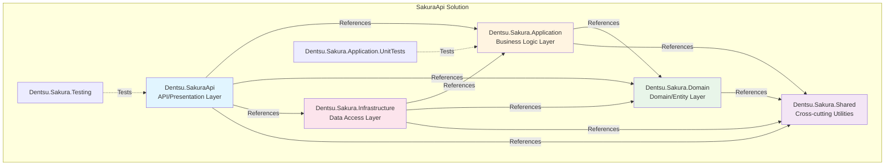

## 2. Layer-by-Layer Architecture

**What This Diagram Shows:**
This diagram shows how the different layers of the application are organized and how data flows from the HTTP request through each layer to the database and back.

**How to Read It:**
- Each box represents a layer (a group of related components)
- Arrows show the flow of data/requests
- Top to bottom: Request comes in, goes through layers, reaches database, response comes back
- External boxes (right side) are services outside the application

**Example Flow:**
1. Client sends HTTP request (e.g., "Get workspace 5")
2. Middleware processes it (adds headers, handles errors)
3. Controller receives it and routes to appropriate service
4. Service contains business logic (validates, processes)
5. Service uses UnitOfWork to get repository
6. Repository queries database through DbContext
7. Database returns data
8. Data flows back up through layers
9. Service converts entity to DTO (Data Transfer Object)
10. Controller returns HTTP response

**Technical Details:**
- **Separation of Concerns**: Each layer has a specific responsibility
- **Dependency Direction**: Inner layers don't know about outer layers
- **DTOs**: Data Transfer Objects - simplified versions of entities for API responses
- **UnitOfWork**: Manages database transactions and repositories

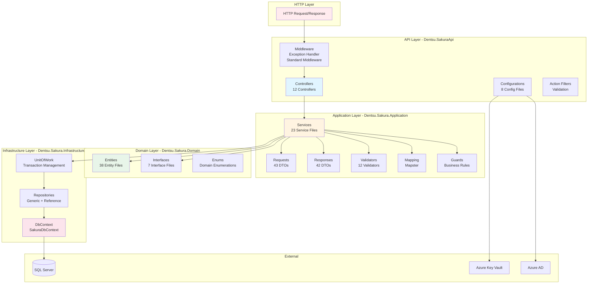

## 3. API Layer - Detailed Structure

**What This Diagram Shows:**
This diagram shows all the components in the API layer (the entry point of the application). It displays controllers, middleware, configurations, and how they connect to services.

**How to Read It:**
- Controllers (top section) handle HTTP requests and call services
- Middleware (middle section) processes requests before/after controllers
- Configurations (bottom section) set up the application (DI, auth, validation, etc.)
- Arrows show which service interface each controller uses

**Example:**
- When a request comes to `GET /api/workspace/5`:
  - `WorkspaceController` receives it
  - Controller calls `IWorkspaceService.GetWorkspaceAsync(5)`
  - Service processes the request and returns data
  - Controller returns HTTP response

**Technical Details:**
- **Controllers**: Handle HTTP requests, one per domain area (Workspace, WorkspaceApp, etc.)
- **Middleware**: Global request/response processing (exception handling, headers)
- **Configurations**: Setup code that runs at application startup
- **Dependency Injection**: Controllers receive services through constructor injection

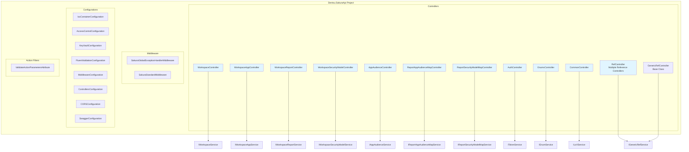

## 4. Application Layer - Detailed Structure

**What This Diagram Shows:**
This diagram shows all services, DTOs (Data Transfer Objects), validators, and other components in the Application layer. This layer contains the business logic.

**How to Read It:**
- Services are grouped by domain (Workspaces, Reference, Security, Common)
- Each service implements an interface (shown with arrows)
- Services use UnitOfWork and ObjectMapper (shown with arrows)
- DTOs, Validators, and Mapping support the services

**Example:**
- `WorkspaceService` implements `IWorkspaceService`
- It uses `ISakuraUnitOfWork` to get repositories
- It uses `IObjectMapper` to convert between entities and DTOs
- It processes `CreateWorkspaceRequest` DTOs and returns `WorkspaceResponse` DTOs

**Technical Details:**
- **Service Layer**: Contains business logic and orchestrates operations
- **Interface Segregation**: Each service has its own interface for better testability
- **DTOs**: Separate objects for API requests/responses (not the same as entities)
- **Validators**: FluentValidation rules that validate DTOs before processing
- **Mapping**: Converts between DTOs and entities using Mapster

```mermaid
graph TB
    subgraph "Dentsu.Sakura.Application Project"
        subgraph "Services - Workspaces"
            WS[WorkspaceService]
            WAS[WorkspaceAppService]
            WRS[WorkspaceReportService]
            WSMS[WorkspaceSecurityModelService]
            AAS[AppAudienceService]
            RAMS[ReportAppAudienceMapService]
            RSMS[ReportSecurityModelMapService]
        end
        
        subgraph "Services - Reference"
            GRS[GenericRefService<br/>Base for all Reference Services]
            RS[RegionService]
            CS[ClusterService]
            MS[MarketService]
            ES[EntityService]
            DS[DentsuStakeholderService]
            CP[ClientProgramService]
            BPCE[BPCEntityService]
            BPCS[BPCSegmentService]
            BPCB[BPCBrandService]
            BU[BusinessUnitService]
            CC[CostCenterService]
            CCFA[CostCenterFunctionalAreaService]
            CO[CountryService]
            CC2[CountryClusterService]
            CR[CountryRegionService]
            EMP[EmployeeService]
            MSS[MasterServiceSetService]
            PA[PeopleAggregatorService]
            PC[ProfitCenterService]
            SL[ServiceLineService]
            SLA[ServiceLineAltSLService]
            SLSH[ServiceLineServiceLineHRGroupService]
        end
        
        subgraph "Services - Security"
            TS[TokenService]
            TUS[TempUserService]
        end
        
        subgraph "Services - Common"
            ES2[EnumService]
            LS[LoVService]
        end
        
        subgraph "Interfaces"
            IWS[IWorkspaceService]
            IWAS[IWorkspaceAppService]
            IWRS[IWorkspaceReportService]
            IWSMS[IWorkspaceSecurityModelService]
            IAAS[IAppAudienceService]
            IRAMS[IReportAppAudienceMapService]
            IRSMS[IReportSecurityModelMapService]
            IGRS[IGenericRefService]
            ITS[ITokenService]
            IES[IEnumService]
            ILS[ILoVService]
            IUOW[ISakuraUnitOfWork]
            IREPO[ISakuraRepository]
            IMAP[IObjectMapper]
        end
        
        subgraph "DTOs"
            REQ[Requests<br/>43 Request DTOs]
            RES[Responses<br/>42 Response DTOs]
            DTO[Shared DTOs<br/>4 Files]
        end
        
        subgraph "Validators"
            VAL[FluentValidation Validators<br/>12 Validator Files]
        end
        
        subgraph "Mapping"
            MAP[ObjectMapper<br/>Mapster Configuration]
        end
        
        subgraph "Guards"
            WG[WorkspaceGuard]
            OG[OwnershipGuard]
        end
    end
    
    WS --> IWS
    WAS --> IWAS
    WRS --> IWRS
    WSMS --> IWSMS
    AAS --> IAAS
    RAMS --> IRAMS
    RSMS --> IRSMS
    GRS --> IGRS
    TS --> ITS
    ES2 --> IES
    LS --> ILS
    
    WS --> IUOW
    WS --> IMAP
    WAS --> IUOW
    WRS --> IUOW
    WSMS --> IUOW
    AAS --> IUOW
    RAMS --> IUOW
    RSMS --> IUOW
    
    style WS fill:#fff4e1
    style WAS fill:#fff4e1
    style WRS fill:#fff4e1
    style WSMS fill:#fff4e1
    style AAS fill:#fff4e1
    style RAMS fill:#fff4e1
    style RSMS fill:#fff4e1
    style GRS fill:#fff4e1
```

## 5. Domain Layer - Entity Hierarchy

**What This Diagram Shows:**
This diagram shows the inheritance hierarchy of all entities in the system. It shows which base classes entities extend and the relationships between entities.

**How to Read It:**
- Top section shows base classes (SakuraEntity, SakuraAuditableEntity, SakuraReferenceEntity)
- Middle sections show concrete entities grouped by type
- Arrows show inheritance (child extends parent)
- Numbers like `1:N` show relationships (one-to-many)

**Example:**
- `Workspace` extends `SakuraAuditableEntity` (which extends `SakuraEntity<int>`)
- This means Workspace has: Id, CreatedBy, CreatedAt, UpdatedBy, UpdatedAt
- `Workspace` has a `1:N` relationship with `WorkspaceApp` (one workspace has many apps)
- `WorkspaceApp` has a `1:N` relationship with `AppAudience` (one app has many audiences)

**Technical Details:**
- **Inheritance**: Base classes provide common properties (Id, audit fields)
- **SakuraEntity<TKey>**: Base with just Id property (generic key type)
- **SakuraAuditableEntity**: Adds audit trail (who/when created/updated)
- **SakuraReferenceEntity**: For read-only reference data (Regions, Countries, etc.)
- **Relationships**: Shown with cardinality (1:N = one-to-many)

```mermaid
graph TB
    subgraph "Base Entities"
        SE[SakuraEntity&lt;TKey&gt;<br/>Id: TKey]
        SAE[SakuraAuditableEntity<br/>Extends SakuraEntity&lt;int&gt;<br/>+ CreatedBy, CreatedAt<br/>+ UpdatedBy, UpdatedAt]
        SRE[SakuraReferenceEntity<br/>Extends SakuraEntity&lt;int&gt;<br/>+ MapKey, IsCurrent]
    end
    
    subgraph "Workspace Entities"
        W[Workspace<br/>Extends SakuraAuditableEntity]
        WA[WorkspaceApp<br/>Extends SakuraAuditableEntity]
        WR[WorkspaceReport<br/>Extends SakuraAuditableEntity]
        WSM[WorkspaceSecurityModel<br/>Extends SakuraAuditableEntity]
        AA[AppAudience<br/>Extends SakuraAuditableEntity]
        RAM[ReportAppAudienceMap<br/>Extends SakuraAuditableEntity]
        RSM[ReportSecurityModelMap<br/>Extends SakuraAuditableEntity]
        SMSTM[SecurityModelSecurityTypeMap<br/>Extends SakuraAuditableEntity]
    end
    
    subgraph "Reference Entities"
        R[Region<br/>Extends SakuraReferenceEntity]
        C[Cluster<br/>Extends SakuraReferenceEntity]
        M[Market<br/>Extends SakuraReferenceEntity]
        E[Entity<br/>Extends SakuraReferenceEntity]
        BPCE[BPCEntity<br/>Extends SakuraReferenceEntity]
        DS[DentsuStakeholder<br/>Extends SakuraReferenceEntity]
        CP[ClientProgram<br/>Extends SakuraReferenceEntity]
        CO[Country<br/>Extends SakuraReferenceEntity]
        EMP[Employee<br/>Extends SakuraReferenceEntity]
        BU[BusinessUnit<br/>Extends SakuraReferenceEntity]
        CC[CostCenter<br/>Extends SakuraReferenceEntity]
        PC[ProfitCenter<br/>Extends SakuraReferenceEntity]
        SL[ServiceLine<br/>Extends SakuraReferenceEntity]
        OTHERS[+ 10 More Reference Entities]
    end
    
    subgraph "Security Entities"
        U[User<br/>Extends SakuraAuditableEntity]
        RT[RefreshToken<br/>Extends SakuraEntity&lt;int&gt;]
    end
    
    subgraph "Common Entities"
        LOV[LoV<br/>Extends SakuraAuditableEntity]
    end
    
    SE --> SAE
    SE --> SRE
    SAE --> W
    SAE --> WA
    SAE --> WR
    SAE --> WSM
    SAE --> AA
    SAE --> RAM
    SAE --> RSM
    SAE --> SMSTM
    SAE --> U
    SAE --> LOV
    SRE --> R
    SRE --> C
    SRE --> M
    SRE --> E
    SRE --> BPCE
    SRE --> DS
    SRE --> CP
    SRE --> CO
    SRE --> EMP
    SRE --> BU
    SRE --> CC
    SRE --> PC
    SRE --> SL
    SRE --> OTHERS
    
    W -->|1:N| WA
    W -->|1:N| WR
    W -->|1:N| WSM
    WA -->|1:N| AA
    WSM -->|1:N| SMSTM
    WR -->|1:N| RAM
    WR -->|1:N| RSM
    
    style SE fill:#e8f5e9
    style SAE fill:#e8f5e9
    style SRE fill:#e8f5e9
    style W fill:#fff4e1
    style WA fill:#fff4e1
    style WR fill:#fff4e1
    style WSM fill:#fff4e1
```

## 6. Infrastructure Layer - Data Access

**What This Diagram Shows:**
This diagram shows the data access components that interact with the database. It shows repositories, UnitOfWork, and how they connect to the database.

**How to Read It:**
- UnitOfWork creates and manages repositories
- Repositories use DbContext to query the database
- DbContext translates C# code to SQL queries
- All components work together to provide data access

**Example:**
- Service calls `UnitOfWork.GetSakuraRepository<Workspace, int>()`
- UnitOfWork creates or returns cached `SakuraRepository<Workspace, int>`
- Repository uses `SakuraDbContext` to query `Workspaces` DbSet
- DbContext generates SQL and executes it on SQL Server
- Results flow back through the layers

**Technical Details:**
- **Repository Pattern**: Abstracts database operations, makes code testable
- **Unit of Work**: Manages repositories and transactions
- **DbContext**: Entity Framework Core's database context (ORM - Object-Relational Mapping)
- **Generic Repository**: One repository class handles all entity types
- **Reference Repository**: Special read-only repository for reference views

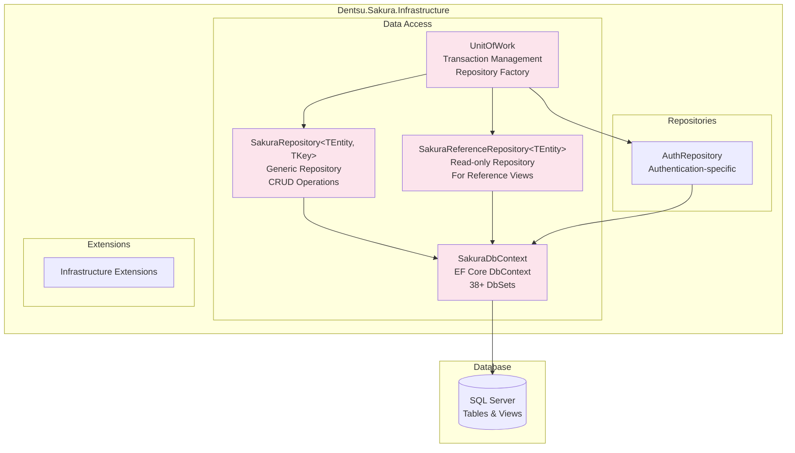

## 7. Request Flow - Complete Example

**What This Diagram Shows:**
This is a generic sequence diagram showing the typical flow of any HTTP request through the system. It shows the order of operations and which components communicate.

**How to Read It:**
- Time flows from top to bottom
- Each horizontal arrow is a method call or message
- `->>` means a return value or response
- `->` means a request or call
- Participants on the left are different components

**Example:**
When a client requests "Get workspace 5":
1. Client sends HTTP GET request
2. Middleware catches any exceptions
3. Controller receives request
4. Validator checks if ID parameter is valid
5. Controller calls service method
6. Service gets repository from UnitOfWork
7. Repository queries database
8. Database executes SQL
9. Data flows back up
10. Service maps entity to DTO
11. Controller returns response
12. Middleware adds headers
13. Client receives response

**Technical Details:**
- **Sequence Diagram**: Shows interactions over time
- **Async Operations**: Most operations are asynchronous (non-blocking)
- **Transaction Management**: UnitOfWork ensures all changes are saved together
- **Exception Handling**: Middleware catches errors and converts to proper HTTP status codes

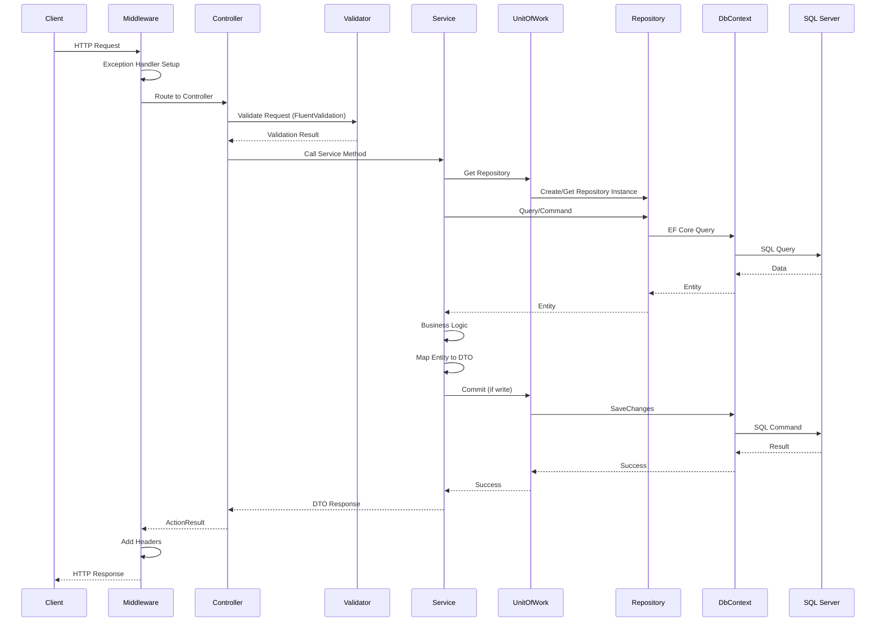

## 8. Workspace Entity Relationships

**What This Diagram Shows:**
This Entity-Relationship Diagram (ERD) shows how workspace-related entities are connected in the database. It shows foreign keys and relationships.

**How to Read It:**
- Each box is an entity (database table)
- Lines show relationships between entities
- `||--o{` means "one-to-many" (one parent has many children)
- `}o--||` means "many-to-one" (many children belong to one parent)
- PK = Primary Key, FK = Foreign Key, UK = Unique Key

**Example:**
- `Workspace ||--o{ WorkspaceApp` means one Workspace has many WorkspaceApps
- `WorkspaceApp` has `WorkspaceId FK` which references `Workspace.Id PK`
- `Workspace }o--|| LoV` means many Workspaces belong to one LoV (Domain)
- `WorkspaceApp ||--o{ AppAudience` means one App has many Audiences

**Technical Details:**
- **Primary Key (PK)**: Unique identifier for each record (usually Id)
- **Foreign Key (FK)**: References another table's primary key
- **Unique Key (UK)**: Ensures no duplicates (e.g., WorkspaceCode must be unique)
- **Soft Delete**: IsActive field marks records as deleted without removing them
- **Audit Fields**: CreatedAt, CreatedBy, UpdatedAt, UpdatedBy track changes

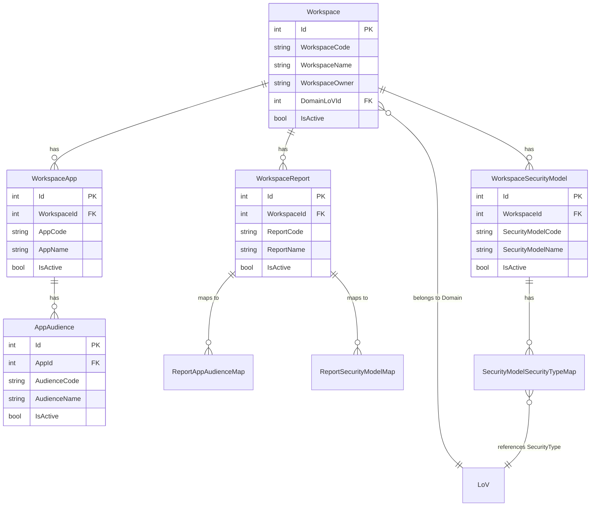

## 9. Service Method Details - WorkspaceService

**What This Diagram Shows:**
This diagram shows all the methods in WorkspaceService and what operations they perform. It shows the flow from service method to repository operations.

**How to Read It:**
- Each box is a service method
- Arrows show which repository operations each method uses
- Methods are grouped by operation type (Get, Create, Update, Delete)
- The right side shows the repository methods being called

**Example Methods:**
- `GetWorkspaceAsync(5)` - Gets workspace with ID 5
  - Calls: `Repository.GetAsync(5)`
  - Returns: WorkspaceResponse DTO
- `AddWorkspaceAsync(request)` - Creates new workspace
  - Calls: `Validate Uniqueness` (checks if code exists)
  - Calls: `Repository.Add(entity)` (adds to database)
  - Calls: `UnitOfWork.CommitAsync()` (saves changes)
- `UpdateWorkspaceAsync(id, request)` - Updates existing workspace
  - Calls: `Repository.GetAsync(id)` (loads current)
  - Calls: `Check Concurrency` (prevents conflicts)
  - Calls: `Repository.Update(entity)` (updates)
  - Calls: `UnitOfWork.CommitAsync()` (saves)

**Technical Details:**
- **Service Layer**: Contains business logic and orchestration
- **Repository Pattern**: Abstracts database operations
- **Unit of Work**: Manages transactions (all or nothing)
- **Async Methods**: All methods are asynchronous for better performance

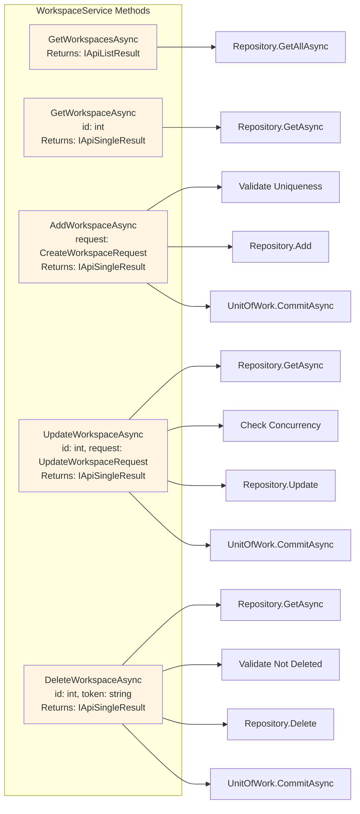

## 10. Complete Controller Endpoint Map

**What This Diagram Shows:**
This diagram lists all the HTTP endpoints (URLs) that the API exposes. Each endpoint is a way for clients to interact with the backend.

**How to Read It:**
- Each box shows an HTTP method (GET, POST, PUT, DELETE) and the URL path
- GET = retrieve data, POST = create new, PUT = update existing, DELETE = remove
- `{id}` means a number parameter (e.g., `/api/workspace/5` where 5 is the workspace ID)
- `{entity}` means a text parameter (e.g., `/api/reference/Region`)

**Example:**
- `GET /api/workspace/{id}` - To get workspace with ID 5, call: `GET /api/workspace/5`
- `POST /api/workspace` - To create a new workspace, send a POST request with workspace data in the body
- `PUT /api/workspace/{id}` - To update workspace 5, send a PUT request with updated data

**Technical Details:**
- **RESTful API**: Follows REST (Representational State Transfer) conventions
- **HTTP Methods**: 
  - GET: Read data (safe, no side effects)
  - POST: Create new resources
  - PUT: Update existing resources (idempotent - same request = same result)
  - DELETE: Remove resources (soft delete - sets IsActive = false)
- **Route Parameters**: Values in `{}` are replaced with actual values when calling

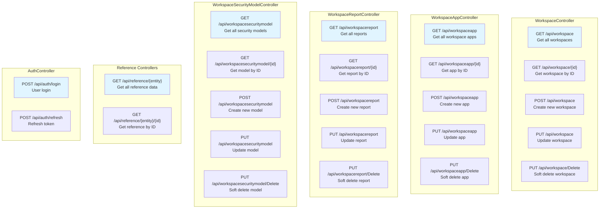

## 11. Repository Methods - SakuraRepository

**What This Diagram Shows:**
This diagram shows all the methods available in the generic repository class. The repository is a layer that handles database operations (CRUD - Create, Read, Update, Delete).

**How to Read It:**
- Each box is a method name with its parameters
- Arrows show which database operation each method uses
- Methods are grouped by operation type (Add, Delete, Update, Get)
- `TEntity` means "any entity type" (Workspace, WorkspaceApp, etc.)
- `VKey` means "any key type" (usually int)

**Example:**
- `Add(entity)` - Adds a new workspace to the database
  - Example: `repository.Add(newWorkspace)` creates a new workspace record
- `GetAsync(id)` - Gets one entity by its ID
  - Example: `repository.GetAsync(5)` returns workspace with ID 5
- `GetAll()` - Gets all entities (returns a query you can filter)
  - Example: `repository.GetAll().Where(w => w.IsActive == true)` gets only active workspaces

**Technical Details:**
- **Generic Repository Pattern**: One class handles all entity types using generics (`<TEntity, VKey>`)
- **Soft Delete**: `GetAsync` excludes deleted records (IsActive = false), `GetAsyncIncludingDeleted` includes them
- **IQueryable**: `GetAll()` returns a query builder, not data yet - allows filtering before database call
- **Async Methods**: Methods ending in `Async` are asynchronous (non-blocking, better performance)

```mermaid
graph TB
    subgraph "SakuraRepository Methods"
        subgraph "Create Operations"
            ADD["Add(entity)<br/>Add single entity"]
            ADD_RANGE["Add(entities)<br/>Add multiple entities"]
        end
        
        subgraph "Read Operations"
            GET["GetAsync(id)<br/>Get by ID<br/>Excludes deleted"]
            GET_INC_DEL["GetAsyncIncludingDeleted(id)<br/>Get by ID<br/>Includes deleted"]
            GET_ALL["GetAll()<br/>Get all entities<br/>Returns IQueryable"]
            GET_ALL_INC["GetAll(include)<br/>Get all with related data"]
            FIND_BY["FindBy(predicate)<br/>Find by condition<br/>Returns IQueryable"]
        end
        
        subgraph "Update Operations"
            UPDATE["Update(entity)<br/>Update entity"]
        end
        
        subgraph "Delete Operations"
            DELETE_ENT["Delete(entity)<br/>Soft delete entity"]
            DELETE_ID["Delete(id)<br/>Soft delete by ID"]
            DELETE_RANGE["Delete(entities)<br/>Soft delete multiple"]
        end
        
        subgraph "Check Operations"
            EXISTS["Exists(predicate)<br/>Check if exists<br/>Excludes deleted"]
            EXISTS_INC_DEL["ExistsIncludingDeleted(predicate)<br/>Check if exists<br/>Includes deleted"]
        end
        
        subgraph "Advanced Operations"
            GET_ALL_PAGE["GetAll(page, pageCount)<br/>Get paginated results"]
            FROM_SQL["FromSql(sql)<br/>Execute raw SQL"]
        end
    end
    
    ADD --> DB1["DbSet.Add"]
    ADD_RANGE --> DB2["DbSet.AddRange"]
    DELETE_ENT --> DB3["DbSet.Remove"]
    DELETE_ID --> GET
    DELETE_ID --> DELETE_ENT
    DELETE_RANGE --> DB4["DbSet.RemoveRange"]
    UPDATE --> DB5["DbSet.Update"]
    GET --> DB6["DbSet.SingleOrDefaultAsync<br/>+ Soft Delete Filter"]
    GET_INC_DEL --> DB7["DbSet.IgnoreQueryFilters<br/>SingleOrDefaultAsync"]
    GET_ALL --> DB8["DbSet<br/>IQueryable"]
    GET_ALL_INC --> DB9["DbSet.Include"]
    FIND_BY --> DB10["DbSet.Where"]
    EXISTS --> DB11["DbSet.Any<br/>+ Soft Delete Filter"]
    EXISTS_INC_DEL --> DB12["DbSet.IgnoreQueryFilters.Any"]
    GET_ALL_PAGE --> DB13["DbSet.OrderAndPaging"]
    FROM_SQL --> DB14["DbSet.FromSqlRaw"]
    
    style ADD fill:#fce4ec
    style DELETE_ENT fill:#fce4ec
    style UPDATE fill:#fce4ec
    style GET fill:#fce4ec
    style GET_ALL fill:#fce4ec
```

## 12. UnitOfWork Pattern

**What This Diagram Shows:**
This diagram explains the Unit of Work pattern, which manages database transactions and provides repositories. It ensures all changes are saved together or not at all.

**How to Read It:**
- UnitOfWork is a factory that creates repositories
- It caches repositories so you get the same instance for the same entity type
- Commit methods save all pending changes to the database
- The cache prevents creating multiple repository instances

**Example:**
When creating a workspace:
1. Service calls `UnitOfWork.GetSakuraRepository<Workspace, int>()`
2. UnitOfWork checks cache - if not found, creates new repository
3. Service uses repository to add workspace
4. Service calls `UnitOfWork.CommitAsync()`
5. UnitOfWork calls `DbContext.SaveChangesAsync()`
6. All pending changes (adds, updates, deletes) are saved in one transaction

**Technical Details:**
- **Repository Factory**: Creates repositories on demand
- **Caching**: Same repository instance reused for same entity type
- **Transaction Management**: Commit ensures all changes succeed or fail together
- **Scoped Lifetime**: One UnitOfWork per HTTP request

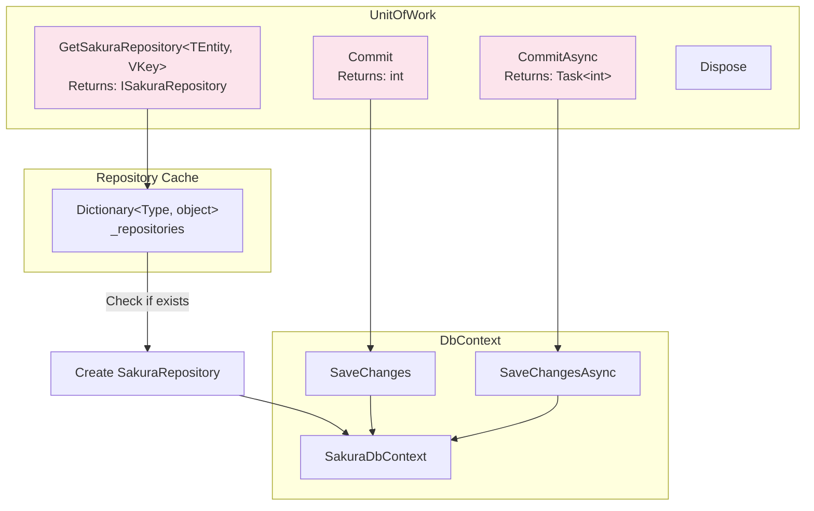

## 13. Detailed Request Flow - Create Workspace

**What This Diagram Shows:**
This sequence diagram shows step-by-step what happens when a client creates a new workspace. It shows the order of operations and which components talk to each other.

**How to Read It:**
- Time flows from top to bottom
- Each horizontal line is a message/call from one component to another
- `->>` means a return/response
- `->` means a call/request
- Each participant (left column) is a component in the system

**Example Scenario:**
Client wants to create a workspace with code "PROJECT_A" and name "My Project"

1. **Client sends request**: `POST /api/workspace` with workspace data
2. **Middleware** receives it and routes to the controller
3. **Controller** validates the request format
4. **Service** checks if workspace code already exists (business rule)
5. **Service** validates the DomainLoVId is valid
6. **Service** converts request DTO to entity
7. **Service** sets audit fields (CreatedAt, CreatedBy, etc.)
8. **Repository** adds entity to database context
9. **UnitOfWork** saves changes to database
10. **Service** converts entity back to response DTO
11. **Controller** returns success response to client

**Technical Details:**
- **FluentValidation**: Validates request format before processing
- **Business Logic**: Service checks uniqueness and validates references
- **Mapping**: Converts between DTOs (Data Transfer Objects) and Entities
- **Unit of Work**: Ensures all changes are saved together (transaction)
- **Soft Delete Check**: `ExistsIncludingDeleted` checks even deleted records to prevent code reuse

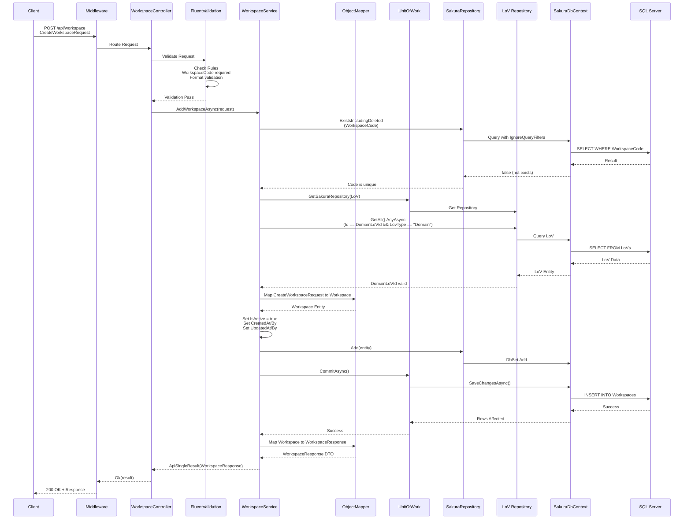

## 14. Detailed Request Flow - Update Workspace

**What This Diagram Shows:**
This sequence diagram shows what happens when updating an existing workspace. It includes optimistic concurrency checking to prevent conflicts when multiple users edit the same record.

**How to Read It:**
- The `alt` block shows two possible paths: concurrency mismatch (error) or success
- Concurrency token is a version number that changes each time the record is updated
- If tokens don't match, someone else updated the record first - update is rejected

**Example Scenario:**
User A and User B both load workspace ID 5. User A updates it first. When User B tries to update, their token is outdated, so the update is rejected.

**Step-by-Step:**
1. Client sends update request with ID and concurrency token
2. Service checks if workspace exists
3. Service loads current workspace from database
4. Service compares request token with database token
5. **If tokens match**: Proceed with update
   - Check workspace code uniqueness
   - Validate DomainLoVId
   - Map only allowed fields
   - Update audit fields
   - Save to database
6. **If tokens don't match**: Return error (someone else updated it)

**Technical Details:**
- **Optimistic Concurrency**: Prevents lost updates when multiple users edit simultaneously
- **ConcurrencyToken**: A hash/version number that changes on each update
- **GetAsyncIncludingDeleted**: Loads workspace even if soft-deleted (needed for updates)
- **Partial Update**: Only specified fields are updated, others remain unchanged

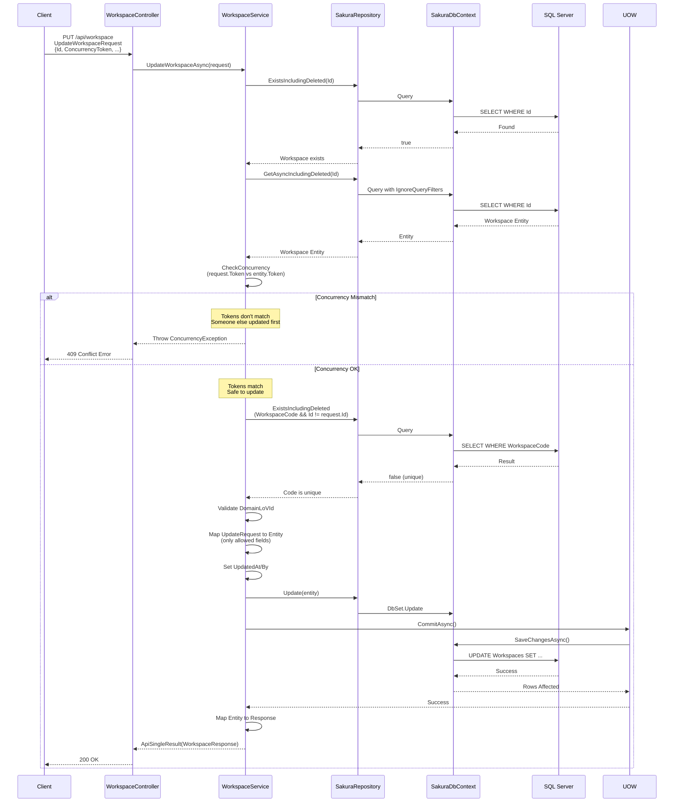

## 15. Detailed Request Flow - Delete Workspace (Soft Delete)

**What This Diagram Shows:**
This sequence diagram shows the soft delete process. Instead of removing the record from the database, it sets `IsActive = false`, so the data is preserved but hidden.

**How to Read It:**
- Soft delete means the record stays in the database but is marked as inactive
- `GetAsync(Id)` only returns active records (IsActive = true)
- If workspace is already inactive, deletion is rejected
- The `alt` block shows two paths: already deleted (error) or active (can delete)

**Example Scenario:**
User wants to delete workspace ID 5. The system:
1. Checks if workspace exists
2. Loads the workspace (only if active)
3. Checks concurrency token
4. If already inactive, returns error
5. If active, sets IsActive = false and updates audit fields
6. Record remains in database but won't appear in normal queries

**Step-by-Step:**
1. Client sends delete request with ID and concurrency token
2. Service checks if workspace exists (including deleted ones)
3. Service loads workspace (only active ones via `GetAsync`)
4. Service checks concurrency token
5. **If already inactive**: Return error (can't delete twice)
6. **If active**: 
   - Set audit fields (UpdatedAt, UpdatedBy)
   - Mark for deletion
   - Save changes triggers soft delete rule
   - Database sets IsActive = false
   - Return success

**Technical Details:**
- **Soft Delete**: Data is preserved for audit/history, but hidden from normal operations
- **Hard Delete**: Would use `DELETE FROM Workspaces WHERE Id = ...` (not used here)
- **ApplySoftDeleteRules**: DbContext intercepts deletion and converts to UPDATE
- **GetAsync vs GetAsyncIncludingDeleted**: First excludes deleted, second includes them

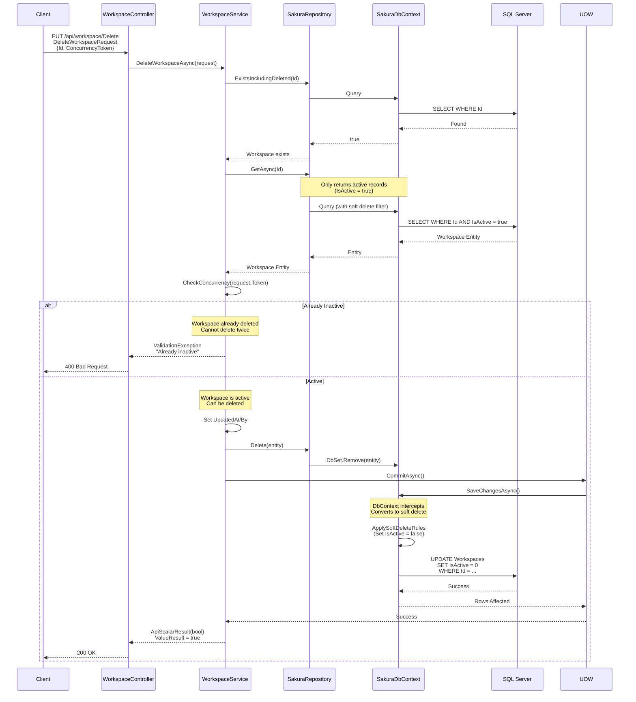

## 16. All Service Methods - Complete Overview

**What This Diagram Shows:**
This diagram lists all service methods across all services in the application. It shows how many methods each service has and groups them by service type.

**How to Read It:**
- Each subgraph represents one service class
- Boxes inside are method names
- Numbers in service names show how many methods each service has
- Methods are grouped by service for easy reference

**Example:**
- `WorkspaceService` has 8 methods:
  - 5 read methods (GetWorkspaceAsync, GetWorkspacesAsync, etc.)
  - 3 write methods (AddWorkspaceAsync, UpdateWorkspaceAsync, DeleteWorkspaceAsync)
- `WorkspaceSecurityModelService` has 12 methods (most complex service)
- `GenericRefService` has only 2 methods (simple read-only service)

**Technical Details:**
- **Service Methods**: All methods are async (return Task) for better performance
- **Naming Convention**: Methods ending in "Async" are asynchronous
- **CRUD Operations**: Most services have Create, Read, Update, Delete methods
- **Specialized Methods**: Some services have domain-specific methods (e.g., AddSecurityTypeToModelAsync)

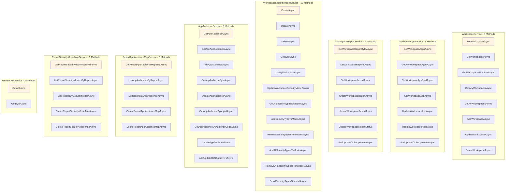

## 17. DbContext - All DbSets

**What This Diagram Shows:**
This diagram shows all the DbSets defined in SakuraDbContext. Each DbSet represents a database table or view that can be queried.

**How to Read It:**
- Each box is a DbSet property
- DbSets are grouped by entity type (Workspace, Common, Reference)
- All DbSets connect to SQL Server (shown at bottom)
- DbSet names match entity class names (pluralized)

**Example:**
- `Workspaces` DbSet maps to the `Workspaces` table in SQL Server
- Querying `context.Workspaces` returns all workspace records
- `Regions` DbSet maps to a read-only view in the `refv` schema
- Reference entities (Regions, Countries, etc.) are read-only views

**Technical Details:**
- **DbSet**: Entity Framework Core's representation of a database table/view
- **38+ DbSets**: Total number of tables/views in the database
- **Workspace Entities**: Writable tables (can insert, update, delete)
- **Reference Entities**: Read-only views (can only query, not modify)
- **Schema Separation**: Reference views are in `refv` schema, workspace tables in `dbo` schema

```mermaid
graph TB
    subgraph "SakuraDbContext - 38+ DbSets"
        subgraph "Workspace Entities"
            DB1[Workspaces]
            DB2[WorkspaceApps]
            DB3[WorkspaceReports]
            DB4[WorkspaceSecurityModels]
            DB5[AppAudiences]
            DB6[ReportAppAudienceMap]
            DB7[ReportSecurityModelMap]
            DB8[SecurityModelSecurityTypeMap]
        end
        
        subgraph "Common Entities"
            DB9[Lovs]
            DB10[RefreshTokens]
        end
        
        subgraph "Reference Entities"
            DB11[DentsuStakeholders]
            DB12[ClientPrograms]
            DB13[Clusters]
            DB14[Regions]
            DB15[Markets]
            DB16[Entities]
            DB17[BPCEntities]
            DB18[CountryRegions]
            DB19[CountryClusters]
            DB20[Countries]
            DB21[MasterServiceSets]
            DB22[ProfitCenters]
            DB23[BPCBrands]
            DB24[CostCenters]
            DB25[CostCenterFunctionalAreas]
            DB26[BusinessUnits]
            DB27[BPCSegments]
            DB28[ServiceLines]
            DB29[ServiceLineAltSLs]
            DB30[ServiceLineServiceLineHRGroups]
            DB31[PeopleAggregators]
            DB32[Employees]
        end
    end
    
    DB1 --> SQL[(SQL Server)]
    DB2 --> SQL
    DB3 --> SQL
    DB4 --> SQL
    DB5 --> SQL
    DB6 --> SQL
    DB7 --> SQL
    DB8 --> SQL
    DB9 --> SQL
    DB10 --> SQL
    DB11 --> SQL
    DB12 --> SQL
    DB13 --> SQL
    DB14 --> SQL
    DB15 --> SQL
    DB16 --> SQL
    DB17 --> SQL
    DB18 --> SQL
    DB19 --> SQL
    DB20 --> SQL
    DB21 --> SQL
    DB22 --> SQL
    DB23 --> SQL
    DB24 --> SQL
    DB25 --> SQL
    DB26 --> SQL
    DB27 --> SQL
    DB28 --> SQL
    DB29 --> SQL
    DB30 --> SQL
    DB31 --> SQL
    DB32 --> SQL
    
    style DB1 fill:#fce4ec
    style DB2 fill:#fce4ec
    style DB3 fill:#fce4ec
    style DB4 fill:#fce4ec
    style DB5 fill:#fce4ec
    style DB9 fill:#fce4ec
```

## 18. Complete Entity Relationship Diagram

**What This Diagram Shows:**
This is a comprehensive Entity-Relationship Diagram showing all workspace-related entities, their properties, and how they relate to each other. It includes all fields (columns) for each entity.

**How to Read It:**
- Each entity box shows all its properties (fields/columns)
- PK = Primary Key, FK = Foreign Key, UK = Unique Key
- Relationship lines show how entities connect
- Field types show data types (int, string, bool, DateTime)

**Example:**
- `Workspace` entity has properties like Id (PK), WorkspaceCode (UK), WorkspaceName, etc.
- `WorkspaceApp` has `WorkspaceId FK` which links to `Workspace.Id PK`
- `ReportAppAudienceMap` is a junction table linking Reports to AppAudiences
- All entities have audit fields (CreatedAt, CreatedBy, UpdatedAt, UpdatedBy)

**Technical Details:**
- **Primary Keys**: Unique identifiers (usually Id, auto-increment)
- **Foreign Keys**: References to other tables (e.g., WorkspaceId references Workspace.Id)
- **Unique Keys**: Prevent duplicates (e.g., WorkspaceCode must be unique)
- **ConcurrencyToken**: Used for optimistic concurrency control
- **Audit Trail**: All entities track who created/updated and when
- **Soft Delete**: IsActive field marks records as deleted

```mermaid
erDiagram
    Workspace ||--o{ WorkspaceApp : "has many"
    Workspace ||--o{ WorkspaceReport : "has many"
    Workspace ||--o{ WorkspaceSecurityModel : "has many"
    Workspace }o--|| LoV : "belongs to Domain"
    
    WorkspaceApp ||--o{ AppAudience : "has many"
    
    WorkspaceReport ||--o{ ReportAppAudienceMap : "maps to"
    WorkspaceReport ||--o{ ReportSecurityModelMap : "maps to"
    
    WorkspaceSecurityModel ||--o{ SecurityModelSecurityTypeMap : "has many"
    SecurityModelSecurityTypeMap }o--|| LoV : "references SecurityType"
    
    ReportAppAudienceMap }o--|| AppAudience : "references"
    ReportAppAudienceMap }o--|| WorkspaceReport : "references"
    
    ReportSecurityModelMap }o--|| WorkspaceSecurityModel : "references"
    ReportSecurityModelMap }o--|| WorkspaceReport : "references"
    
    Workspace {
        int Id PK
        string WorkspaceCode UK
        string WorkspaceName
        string WorkspaceOwner
        string WorkspaceTechOwner
        string WorkspaceApprover
        string WorkspaceEntraGroupUID
        string WorkspaceTag
        int DomainLoVId FK
        bool IsActive
        DateTime CreatedAt
        string CreatedBy
        DateTime UpdatedAt
        string UpdatedBy
        string ConcurrencyToken
    }
    
    WorkspaceApp {
        int Id PK
        int WorkspaceId FK
        string AppCode
        string AppName
        string AppOwner
        string AppTechnicalOwner
        string AppEntraGroupUID
        int OLSMode
        int ApprovalMode
        string Approvers
        string AdditionalQuestionsJSON
        bool IsActive
        DateTime CreatedAt
        string CreatedBy
        DateTime UpdatedAt
        string UpdatedBy
        string ConcurrencyToken
    }
    
    WorkspaceReport {
        int Id PK
        int WorkspaceId FK
        string ReportCode
        string ReportName
        string ReportOwner
        string ReportTechnicalOwner
        string ReportEntraGroupUID
        string Approvers
        bool IsActive
        DateTime CreatedAt
        string CreatedBy
        DateTime UpdatedAt
        string UpdatedBy
        string ConcurrencyToken
    }
    
    WorkspaceSecurityModel {
        int Id PK
        int WorkspaceId FK
        string SecurityModelCode UK
        string SecurityModelName
        bool IsActive
        DateTime CreatedAt
        string CreatedBy
        DateTime UpdatedAt
        string UpdatedBy
        string ConcurrencyToken
    }
    
    AppAudience {
        int Id PK
        int AppId FK
        string AudienceCode
        string AudienceName
        string AudienceEntraGroupUID
        string Approvers
        bool IsActive
        DateTime CreatedAt
        string CreatedBy
        DateTime UpdatedAt
        string UpdatedBy
        string ConcurrencyToken
    }
    
    ReportAppAudienceMap {
        int Id PK
        int ReportId FK
        int AppAudienceId FK
        bool IsActive
        DateTime CreatedAt
        string CreatedBy
        DateTime UpdatedAt
        string UpdatedBy
    }
    
    ReportSecurityModelMap {
        int Id PK
        int ReportId FK
        int SecurityModelId FK
        bool IsActive
        DateTime CreatedAt
        string CreatedBy
        DateTime UpdatedAt
        string UpdatedBy
    }
    
    SecurityModelSecurityTypeMap {
        int Id PK
        int SecurityModelId FK
        int SecurityTypeLoVId FK
        bool IsActive
        DateTime CreatedAt
        string CreatedBy
        DateTime UpdatedAt
        string UpdatedBy
    }
    
    LoV {
        int Id PK
        string LovType
        string LoVValue
        string LoVName
        string LoVDescription
        string ParentLoVType
        string ParentLoVValue
        bool IsActive
        DateTime CreatedAt
        string CreatedBy
        DateTime UpdatedAt
        string UpdatedBy
    }
```

## 19. Middleware Pipeline

**What This Diagram Shows:**
This diagram shows the order in which middleware components process HTTP requests. It shows the request flow through the ASP.NET Core pipeline.

**How to Read It:**
- Request flows left to right (top path)
- Response flows right to left (bottom path)
- Each box is a middleware component
- Order matters - middleware executes in sequence

**Example Flow:**
1. HTTP Request enters
2. SakuraStandardMiddleware adds custom headers
3. SakuraGlobalExceptionHandlerMiddleware sets up exception handling
4. Routing determines which controller to use
5. Authentication verifies user identity
6. Controller processes request
7. Response flows back through middleware (exception handler, standard middleware)
8. HTTP Response sent to client

**Technical Details:**
- **Middleware Pipeline**: Components that process requests/responses
- **Request Pipeline**: Top-to-bottom flow (incoming request)
- **Response Pipeline**: Bottom-to-top flow (outgoing response)
- **Exception Handler**: Catches all unhandled exceptions and converts to HTTP errors
- **Standard Middleware**: Adds custom headers (version info, correlation IDs, etc.)

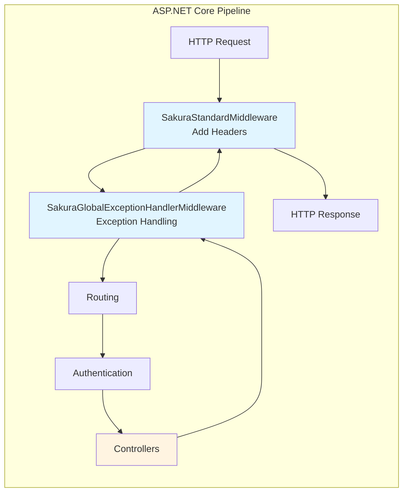

## 20. Dependency Injection Container

**What This Diagram Shows:**
This diagram shows how services are registered in the Dependency Injection (DI) container. It shows which interfaces map to which implementations and their lifetimes.

**How to Read It:**
- Each box shows an interface → implementation mapping
- Arrows show dependencies (which services use which other services)
- Scoped services are created once per HTTP request
- Singleton services are created once for the entire application lifetime

**Example:**
- `IWorkspaceService → WorkspaceService` means when code asks for IWorkspaceService, DI provides WorkspaceService instance
- All workspace services depend on `ISakuraUnitOfWork` (shown by arrows)
- `ISakuraUnitOfWork → UnitOfWork` depends on `SakuraDbContext`
- `SakuraDbContext` depends on `ISecretProvider` (to get connection string from Key Vault)

**Technical Details:**
- **Dependency Injection**: Services are provided by the framework, not created manually
- **Scoped Lifetime**: One instance per HTTP request (most services)
- **Singleton Lifetime**: One instance for entire application (configurations, secret providers)
- **Interface-Based**: Code depends on interfaces, not concrete classes (enables testing)
- **Constructor Injection**: Services are provided through constructor parameters

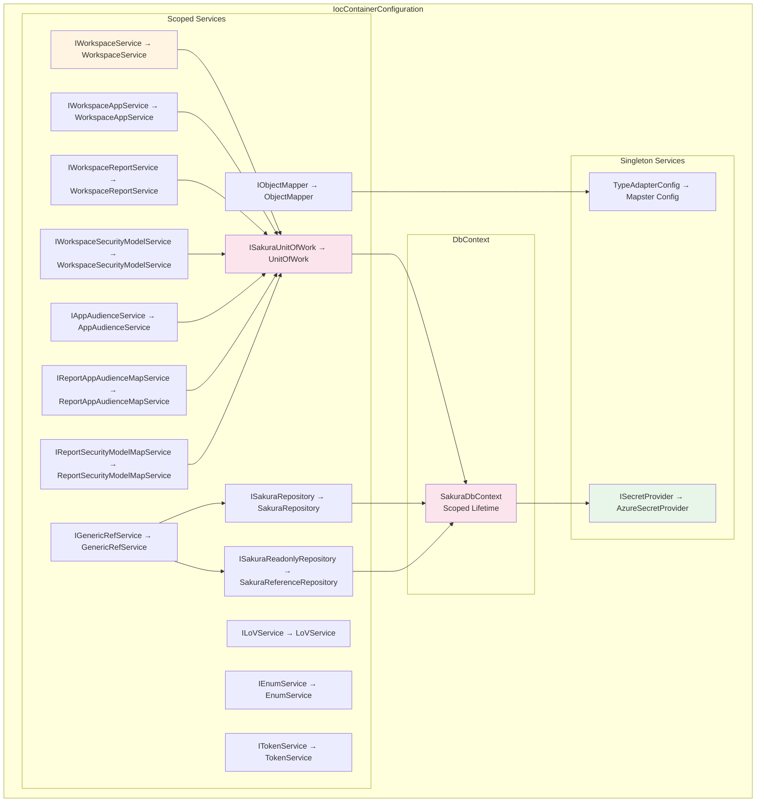

---

## Summary

This documentation provides a complete visual representation of the Sakura Backend architecture using Mermaid diagrams:

1. **Solution Level**: Project dependencies and relationships
2. **Layer Architecture**: High-level layer structure
3. **API Layer**: All controllers, middleware, configurations
4. **Application Layer**: All services, DTOs, validators
5. **Domain Layer**: Entity hierarchy and relationships
6. **Infrastructure Layer**: DbContext, repositories, UnitOfWork
7. **Request Flows**: Detailed sequence diagrams for CRUD operations
8. **Service Methods**: Complete method listings
9. **Repository Methods**: All repository operations
10. **Entity Relationships**: Complete ER diagrams
11. **Middleware Pipeline**: Request processing flow
12. **Dependency Injection**: Service registrations

All diagrams use Mermaid syntax and can be rendered in any Markdown viewer that supports Mermaid (GitHub, GitLab, VS Code, etc.).
