# Sakura Backend - Complete Mermaid Documentation

## 1. Solution Level - Project Dependencies

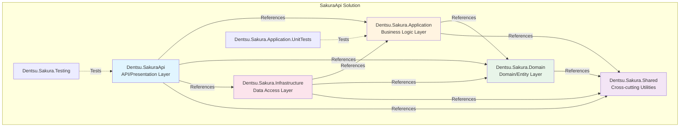

## 2. Layer-by-Layer Architecture

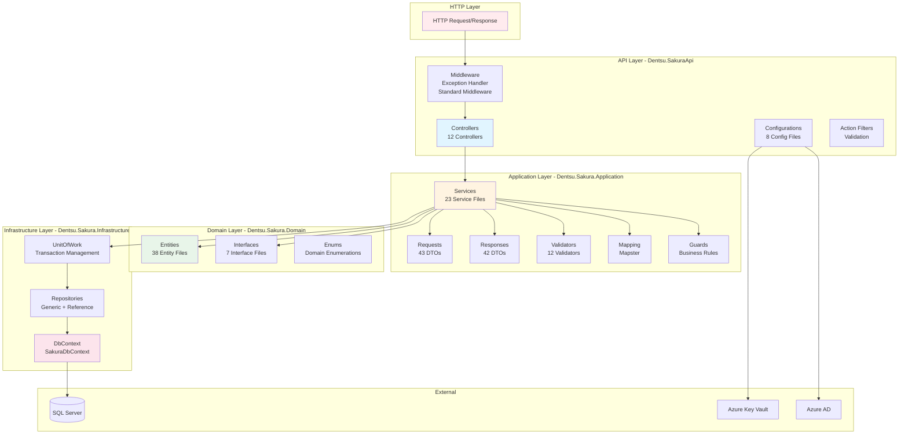

## 3. API Layer - Detailed Structure

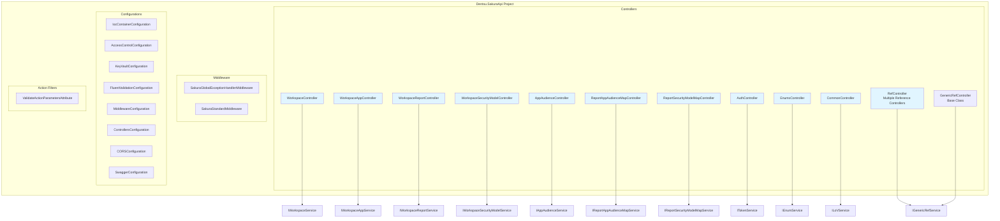

## 4. Application Layer - Detailed Structure

```mermaid
graph TB
    subgraph "Dentsu.Sakura.Application Project"
        subgraph "Services - Workspaces"
            WS[WorkspaceService]
            WAS[WorkspaceAppService]
            WRS[WorkspaceReportService]
            WSMS[WorkspaceSecurityModelService]
            AAS[AppAudienceService]
            RAMS[ReportAppAudienceMapService]
            RSMS[ReportSecurityModelMapService]
        end
        
        subgraph "Services - Reference"
            GRS[GenericRefService<br/>Base for all Reference Services]
            RS[RegionService]
            CS[ClusterService]
            MS[MarketService]
            ES[EntityService]
            DS[DentsuStakeholderService]
            CP[ClientProgramService]
            BPCE[BPCEntityService]
            BPCS[BPCSegmentService]
            BPCB[BPCBrandService]
            BU[BusinessUnitService]
            CC[CostCenterService]
            CCFA[CostCenterFunctionalAreaService]
            CO[CountryService]
            CC2[CountryClusterService]
            CR[CountryRegionService]
            EMP[EmployeeService]
            MSS[MasterServiceSetService]
            PA[PeopleAggregatorService]
            PC[ProfitCenterService]
            SL[ServiceLineService]
            SLA[ServiceLineAltSLService]
            SLSH[ServiceLineServiceLineHRGroupService]
        end
        
        subgraph "Services - Security"
            TS[TokenService]
            TUS[TempUserService]
        end
        
        subgraph "Services - Common"
            ES2[EnumService]
            LS[LoVService]
        end
        
        subgraph "Interfaces"
            IWS[IWorkspaceService]
            IWAS[IWorkspaceAppService]
            IWRS[IWorkspaceReportService]
            IWSMS[IWorkspaceSecurityModelService]
            IAAS[IAppAudienceService]
            IRAMS[IReportAppAudienceMapService]
            IRSMS[IReportSecurityModelMapService]
            IGRS[IGenericRefService]
            ITS[ITokenService]
            IES[IEnumService]
            ILS[ILoVService]
            IUOW[ISakuraUnitOfWork]
            IREPO[ISakuraRepository]
            IMAP[IObjectMapper]
        end
        
        subgraph "DTOs"
            REQ[Requests<br/>43 Request DTOs]
            RES[Responses<br/>42 Response DTOs]
            DTO[Shared DTOs<br/>4 Files]
        end
        
        subgraph "Validators"
            VAL[FluentValidation Validators<br/>12 Validator Files]
        end
        
        subgraph "Mapping"
            MAP[ObjectMapper<br/>Mapster Configuration]
        end
        
        subgraph "Guards"
            WG[WorkspaceGuard]
            OG[OwnershipGuard]
        end
    end
    
    WS --> IWS
    WAS --> IWAS
    WRS --> IWRS
    WSMS --> IWSMS
    AAS --> IAAS
    RAMS --> IRAMS
    RSMS --> IRSMS
    GRS --> IGRS
    TS --> ITS
    ES2 --> IES
    LS --> ILS
    
    WS --> IUOW
    WS --> IMAP
    WAS --> IUOW
    WRS --> IUOW
    WSMS --> IUOW
    AAS --> IUOW
    RAMS --> IUOW
    RSMS --> IUOW
    
    style WS fill:#fff4e1
    style WAS fill:#fff4e1
    style WRS fill:#fff4e1
    style WSMS fill:#fff4e1
    style AAS fill:#fff4e1
    style RAMS fill:#fff4e1
    style RSMS fill:#fff4e1
    style GRS fill:#fff4e1
```

## 5. Domain Layer - Entity Hierarchy

```mermaid
graph TB
    subgraph "Base Entities"
        SE[SakuraEntity&lt;TKey&gt;<br/>Id: TKey]
        SAE[SakuraAuditableEntity<br/>Extends SakuraEntity&lt;int&gt;<br/>+ CreatedBy, CreatedAt<br/>+ UpdatedBy, UpdatedAt]
        SRE[SakuraReferenceEntity<br/>Extends SakuraEntity&lt;int&gt;<br/>+ MapKey, IsCurrent]
    end
    
    subgraph "Workspace Entities"
        W[Workspace<br/>Extends SakuraAuditableEntity]
        WA[WorkspaceApp<br/>Extends SakuraAuditableEntity]
        WR[WorkspaceReport<br/>Extends SakuraAuditableEntity]
        WSM[WorkspaceSecurityModel<br/>Extends SakuraAuditableEntity]
        AA[AppAudience<br/>Extends SakuraAuditableEntity]
        RAM[ReportAppAudienceMap<br/>Extends SakuraAuditableEntity]
        RSM[ReportSecurityModelMap<br/>Extends SakuraAuditableEntity]
        SMSTM[SecurityModelSecurityTypeMap<br/>Extends SakuraAuditableEntity]
    end
    
    subgraph "Reference Entities"
        R[Region<br/>Extends SakuraReferenceEntity]
        C[Cluster<br/>Extends SakuraReferenceEntity]
        M[Market<br/>Extends SakuraReferenceEntity]
        E[Entity<br/>Extends SakuraReferenceEntity]
        BPCE[BPCEntity<br/>Extends SakuraReferenceEntity]
        DS[DentsuStakeholder<br/>Extends SakuraReferenceEntity]
        CP[ClientProgram<br/>Extends SakuraReferenceEntity]
        CO[Country<br/>Extends SakuraReferenceEntity]
        EMP[Employee<br/>Extends SakuraReferenceEntity]
        BU[BusinessUnit<br/>Extends SakuraReferenceEntity]
        CC[CostCenter<br/>Extends SakuraReferenceEntity]
        PC[ProfitCenter<br/>Extends SakuraReferenceEntity]
        SL[ServiceLine<br/>Extends SakuraReferenceEntity]
        OTHERS[+ 10 More Reference Entities]
    end
    
    subgraph "Security Entities"
        U[User<br/>Extends SakuraAuditableEntity]
        RT[RefreshToken<br/>Extends SakuraEntity&lt;int&gt;]
    end
    
    subgraph "Common Entities"
        LOV[LoV<br/>Extends SakuraAuditableEntity]
    end
    
    SE --> SAE
    SE --> SRE
    SAE --> W
    SAE --> WA
    SAE --> WR
    SAE --> WSM
    SAE --> AA
    SAE --> RAM
    SAE --> RSM
    SAE --> SMSTM
    SAE --> U
    SAE --> LOV
    SRE --> R
    SRE --> C
    SRE --> M
    SRE --> E
    SRE --> BPCE
    SRE --> DS
    SRE --> CP
    SRE --> CO
    SRE --> EMP
    SRE --> BU
    SRE --> CC
    SRE --> PC
    SRE --> SL
    SRE --> OTHERS
    
    W -->|1:N| WA
    W -->|1:N| WR
    W -->|1:N| WSM
    WA -->|1:N| AA
    WSM -->|1:N| SMSTM
    WR -->|1:N| RAM
    WR -->|1:N| RSM
    
    style SE fill:#e8f5e9
    style SAE fill:#e8f5e9
    style SRE fill:#e8f5e9
    style W fill:#fff4e1
    style WA fill:#fff4e1
    style WR fill:#fff4e1
    style WSM fill:#fff4e1
```

## 6. Infrastructure Layer - Data Access

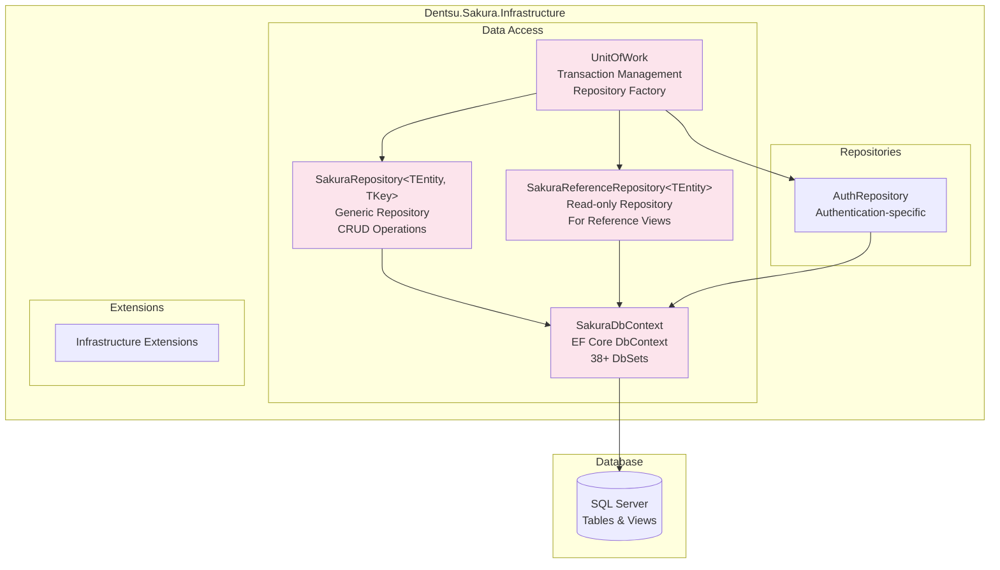

## 7. Request Flow - Complete Example

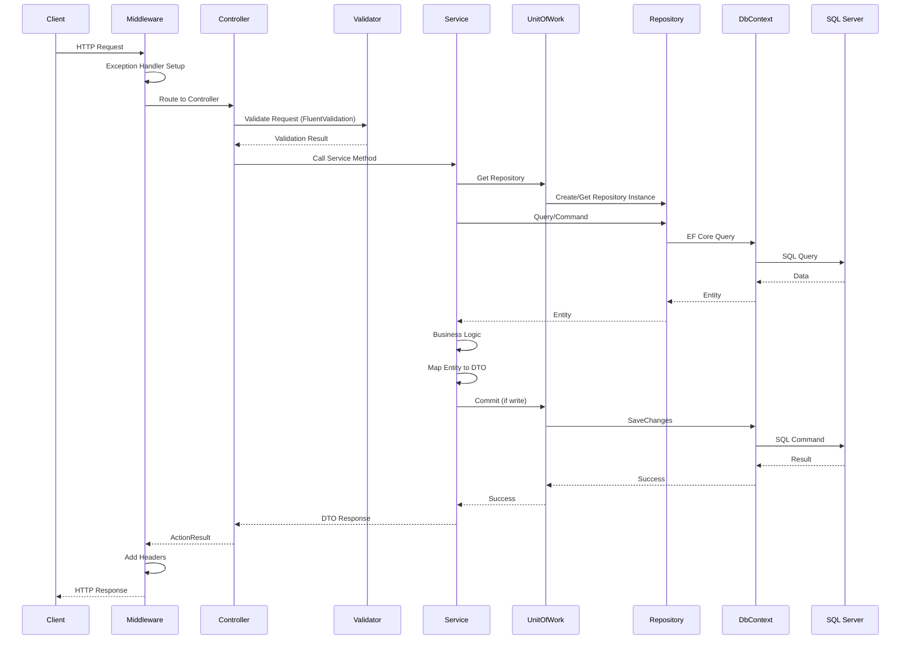

## 8. Workspace Entity Relationships

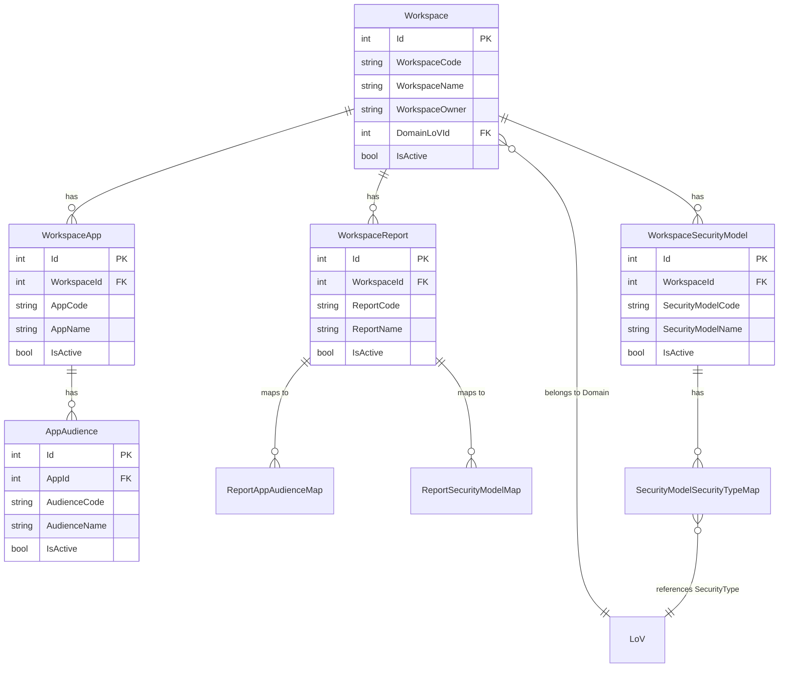

## 9. Service Method Details - WorkspaceService

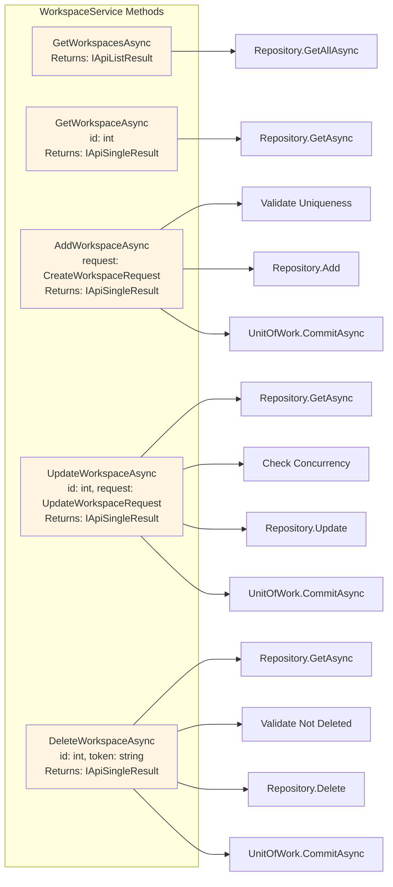

## 10. Complete Controller Endpoint Map

```mermaid
graph TB
    subgraph "WorkspaceController"
        WS_GET_ALL[GET /api/workspace]
        WS_GET_ONE[GET /api/workspace/{id}]
        WS_CREATE[POST /api/workspace]
        WS_UPDATE[PUT /api/workspace/{id}]
        WS_DELETE[DELETE /api/workspace/{id}]
    end
    
    subgraph "WorkspaceAppController"
        WA_GET_ALL[GET /api/workspaceapp]
        WA_GET_ONE[GET /api/workspaceapp/{id}]
        WA_CREATE[POST /api/workspaceapp]
        WA_UPDATE[PUT /api/workspaceapp/{id}]
        WA_DELETE[DELETE /api/workspaceapp/{id}]
    end
    
    subgraph "WorkspaceReportController"
        WR_GET_ALL[GET /api/workspacereport]
        WR_GET_ONE[GET /api/workspacereport/{id}]
        WR_CREATE[POST /api/workspacereport]
        WR_UPDATE[PUT /api/workspacereport/{id}]
        WR_DELETE[DELETE /api/workspacereport/{id}]
    end
    
    subgraph "WorkspaceSecurityModelController"
        WSM_GET_ALL[GET /api/workspacesecuritymodel]
        WSM_GET_ONE[GET /api/workspacesecuritymodel/{id}]
        WSM_CREATE[POST /api/workspacesecuritymodel]
        WSM_UPDATE[PUT /api/workspacesecuritymodel/{id}]
        WSM_DELETE[DELETE /api/workspacesecuritymodel/{id}]
    end
    
    subgraph "Reference Controllers"
        REF_GET_ALL[GET /api/reference/{entity}]
        REF_GET_ONE[GET /api/reference/{entity}/{id}]
    end
    
    subgraph "AuthController"
        AUTH_LOGIN[POST /api/auth/login]
        AUTH_REFRESH[POST /api/auth/refresh]
    end
    
    style WS_GET_ALL fill:#e1f5ff
    style WA_GET_ALL fill:#e1f5ff
    style WR_GET_ALL fill:#e1f5ff
    style WSM_GET_ALL fill:#e1f5ff
    style REF_GET_ALL fill:#e1f5ff
    style AUTH_LOGIN fill:#e1f5ff
```

## 11. Repository Methods - SakuraRepository

```mermaid
graph TB
    subgraph "SakuraRepository&lt;TEntity, VKey&gt; Methods"
        ADD[Add<br/>entity: TEntity]
        ADD_RANGE[Add<br/>entities: IEnumerable]
        DELETE_ENT[Delete<br/>entity: TEntity]
        DELETE_ID[Delete<br/>id: VKey]
        DELETE_RANGE[Delete<br/>entities: IEnumerable]
        UPDATE[Update<br/>entity: TEntity]
        GET[GetAsync<br/>id: VKey<br/>Returns: Task&lt;TEntity?&gt;]
        GET_INC_DEL[GetAsyncIncludingDeleted<br/>id: VKey<br/>Returns: Task&lt;TEntity?&gt;]
        GET_ALL[GetAll<br/>Returns: IQueryable]
        GET_ALL_INC[GetAll<br/>include: string<br/>Returns: IQueryable]
        GET_ALL_INCS[GetAll<br/>includes: Expression[]<br/>Returns: IQueryable]
        GET_ALL_PAGE[GetAll<br/>page, pageCount<br/>Returns: IQueryable, TotalCount]
        EXISTS[Exists<br/>predicate: Expression]
        EXISTS_INC_DEL[ExistsIncludingDeleted<br/>predicate: Expression]
        FIND_BY[FindBy<br/>predicate: Expression<br/>Returns: IQueryable]
        FROM_SQL[FromSql<br/>sql: string<br/>Returns: IQueryable]
    end
    
    ADD --> DB[DbSet.Add]
    ADD_RANGE --> DB2[DbSet.AddRange]
    DELETE_ENT --> DB3[DbSet.Remove]
    DELETE_ID --> GET
    DELETE_ID --> DELETE_ENT
    DELETE_RANGE --> DB4[DbSet.RemoveRange]
    UPDATE --> DB5[DbSet.Update]
    GET --> DB6[DbSet.SingleOrDefaultAsync]
    GET_INC_DEL --> DB7[DbSet.IgnoreQueryFilters<br/>SingleOrDefaultAsync]
    GET_ALL --> DB8[DbSet]
    GET_ALL_INC --> DB9[DbSet.Include]
    GET_ALL_INCS --> DB10[DbSet.IncludeMultiple]
    GET_ALL_PAGE --> DB11[DbSet.OrderAndPaging]
    EXISTS --> DB12[DbSet.Any]
    EXISTS_INC_DEL --> DB13[DbSet.IgnoreQueryFilters.Any]
    FIND_BY --> DB14[DbSet.Where]
    FROM_SQL --> DB15[DbSet.FromSqlRaw]
    
    style ADD fill:#fce4ec
    style DELETE_ENT fill:#fce4ec
    style UPDATE fill:#fce4ec
    style GET fill:#fce4ec
    style GET_ALL fill:#fce4ec
```

## 12. UnitOfWork Pattern

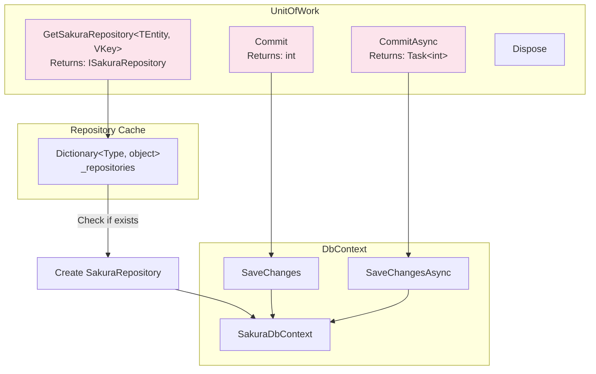

## 13. Detailed Request Flow - Create Workspace

```mermaid
sequenceDiagram
    participant Client
    participant MW as Middleware
    participant CTRL as WorkspaceController
    participant VAL as FluentValidation
    participant SVC as WorkspaceService
    participant MAP as ObjectMapper
    participant UOW as UnitOfWork
    participant REPO as SakuraRepository
    participant LOV_REPO as LoV Repository
    participant DB as SakuraDbContext
    participant SQL as SQL Server
    
    Client->>MW: POST /api/workspace<br/>CreateWorkspaceRequest
    MW->>CTRL: Route Request
    CTRL->>VAL: Validate Request
    VAL->>VAL: Check Rules<br/>- WorkspaceCode required<br/>- Format validation
    VAL-->>CTRL: Validation Pass
    CTRL->>SVC: AddWorkspaceAsync(request)
    SVC->>REPO: ExistsIncludingDeleted<br/>(WorkspaceCode)
    REPO->>DB: Query with IgnoreQueryFilters
    DB->>SQL: SELECT WHERE WorkspaceCode
    SQL-->>DB: Result
    DB-->>REPO: false (not exists)
    REPO-->>SVC: Code is unique
    SVC->>UOW: GetSakuraRepository&lt;LoV&gt;
    UOW->>LOV_REPO: Get Repository
    SVC->>LOV_REPO: GetAll().AnyAsync<br/>(Id == DomainLoVId && LovType == "Domain")
    LOV_REPO->>DB: Query LoV
    DB->>SQL: SELECT FROM LoVs
    SQL-->>DB: LoV Data
    DB-->>LOV_REPO: LoV Entity
    LOV_REPO-->>SVC: DomainLoVId valid
    SVC->>MAP: Map&lt;CreateWorkspaceRequest, Workspace&gt;
    MAP-->>SVC: Workspace Entity
    SVC->>SVC: Set IsActive = true<br/>Set CreatedAt/By<br/>Set UpdatedAt/By
    SVC->>REPO: Add(entity)
    REPO->>DB: DbSet.Add
    SVC->>UOW: CommitAsync()
    UOW->>DB: SaveChangesAsync()
    DB->>SQL: INSERT INTO Workspaces
    SQL-->>DB: Success
    DB-->>UOW: Rows Affected
    UOW-->>SVC: Success
    SVC->>MAP: Map&lt;Workspace, WorkspaceResponse&gt;
    MAP-->>SVC: WorkspaceResponse DTO
    SVC-->>CTRL: ApiSingleResult&lt;WorkspaceResponse&gt;
    CTRL-->>MW: Ok(result)
    MW-->>Client: 200 OK + Response
```

## 14. Detailed Request Flow - Update Workspace

```mermaid
sequenceDiagram
    participant Client
    participant CTRL as WorkspaceController
    participant SVC as WorkspaceService
    participant REPO as SakuraRepository
    participant DB as SakuraDbContext
    participant SQL as SQL Server
    
    Client->>CTRL: PUT /api/workspace<br/>UpdateWorkspaceRequest<br/>{Id, ConcurrencyToken, ...}
    CTRL->>SVC: UpdateWorkspaceAsync(request)
    SVC->>REPO: ExistsIncludingDeleted(Id)
    REPO->>DB: Query
    DB->>SQL: SELECT WHERE Id
    SQL-->>DB: Found
    DB-->>REPO: true
    REPO-->>SVC: Workspace exists
    SVC->>REPO: GetAsyncIncludingDeleted(Id)
    REPO->>DB: Query with IgnoreQueryFilters
    DB->>SQL: SELECT WHERE Id
    SQL-->>DB: Workspace Entity
    DB-->>REPO: Entity
    REPO-->>SVC: Workspace Entity
    SVC->>SVC: CheckConcurrency<br/>(request.Token vs entity.Token)
    alt Concurrency Mismatch
        SVC-->>CTRL: Throw ConcurrencyException
    else Concurrency OK
        SVC->>REPO: ExistsIncludingDeleted<br/>(WorkspaceCode && Id != request.Id)
        REPO->>DB: Query
        DB->>SQL: SELECT WHERE WorkspaceCode
        SQL-->>DB: Result
        DB-->>REPO: false (unique)
        REPO-->>SVC: Code is unique
        SVC->>SVC: Validate DomainLoVId
        SVC->>SVC: Map UpdateRequest to Entity<br/>(only allowed fields)
        SVC->>SVC: Set UpdatedAt/By
        SVC->>REPO: Update(entity)
        REPO->>DB: DbSet.Update
        SVC->>UOW: CommitAsync()
        UOW->>DB: SaveChangesAsync()
        DB->>SQL: UPDATE Workspaces SET ...
        SQL-->>DB: Success
        DB-->>UOW: Rows Affected
        UOW-->>SVC: Success
        SVC->>SVC: Map Entity to Response
        SVC-->>CTRL: ApiSingleResult&lt;WorkspaceResponse&gt;
        CTRL-->>Client: 200 OK
    end
```

## 15. Detailed Request Flow - Delete Workspace (Soft Delete)

```mermaid
sequenceDiagram
    participant Client
    participant CTRL as WorkspaceController
    participant SVC as WorkspaceService
    participant REPO as SakuraRepository
    participant DB as SakuraDbContext
    participant SQL as SQL Server
    
    Client->>CTRL: PUT /api/workspace/Delete<br/>DeleteWorkspaceRequest<br/>{Id, ConcurrencyToken}
    CTRL->>SVC: DeleteWorkspaceAsync(request)
    SVC->>REPO: ExistsIncludingDeleted(Id)
    REPO->>DB: Query
    DB->>SQL: SELECT WHERE Id
    SQL-->>DB: Found
    DB-->>REPO: true
    REPO-->>SVC: Workspace exists
    SVC->>REPO: GetAsync(Id)
    REPO->>DB: Query (with soft delete filter)
    DB->>SQL: SELECT WHERE Id AND IsActive = true
    SQL-->>DB: Workspace Entity
    DB-->>REPO: Entity
    REPO-->>SVC: Workspace Entity
    SVC->>SVC: CheckConcurrency(request.Token)
    alt Already Inactive
        SVC-->>CTRL: ValidationException<br/>"Already inactive"
    else Active
        SVC->>SVC: Set UpdatedAt/By
        SVC->>REPO: Delete(entity)
        REPO->>DB: DbSet.Remove(entity)
        SVC->>UOW: CommitAsync()
        UOW->>DB: SaveChangesAsync()
        DB->>DB: ApplySoftDeleteRules<br/>(Set IsActive = false)
        DB->>SQL: UPDATE Workspaces<br/>SET IsActive = 0<br/>WHERE Id = ...
        SQL-->>DB: Success
        DB-->>UOW: Rows Affected
        UOW-->>SVC: Success
        SVC-->>CTRL: ApiScalarResult&lt;bool&gt;<br/>ValueResult = true
        CTRL-->>Client: 200 OK
    end
```

## 16. All Service Methods - Complete Overview

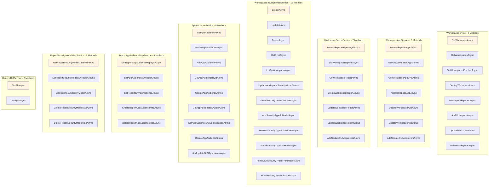

## 17. DbContext - All DbSets

```mermaid
graph TB
    subgraph "SakuraDbContext - 38+ DbSets"
        subgraph "Workspace Entities"
            DB1[Workspaces]
            DB2[WorkspaceApps]
            DB3[WorkspaceReports]
            DB4[WorkspaceSecurityModels]
            DB5[AppAudiences]
            DB6[ReportAppAudienceMap]
            DB7[ReportSecurityModelMap]
            DB8[SecurityModelSecurityTypeMap]
        end
        
        subgraph "Common Entities"
            DB9[Lovs]
            DB10[RefreshTokens]
        end
        
        subgraph "Reference Entities"
            DB11[DentsuStakeholders]
            DB12[ClientPrograms]
            DB13[Clusters]
            DB14[Regions]
            DB15[Markets]
            DB16[Entities]
            DB17[BPCEntities]
            DB18[CountryRegions]
            DB19[CountryClusters]
            DB20[Countries]
            DB21[MasterServiceSets]
            DB22[ProfitCenters]
            DB23[BPCBrands]
            DB24[CostCenters]
            DB25[CostCenterFunctionalAreas]
            DB26[BusinessUnits]
            DB27[BPCSegments]
            DB28[ServiceLines]
            DB29[ServiceLineAltSLs]
            DB30[ServiceLineServiceLineHRGroups]
            DB31[PeopleAggregators]
            DB32[Employees]
        end
    end
    
    DB1 --> SQL[(SQL Server)]
    DB2 --> SQL
    DB3 --> SQL
    DB4 --> SQL
    DB5 --> SQL
    DB6 --> SQL
    DB7 --> SQL
    DB8 --> SQL
    DB9 --> SQL
    DB10 --> SQL
    DB11 --> SQL
    DB12 --> SQL
    DB13 --> SQL
    DB14 --> SQL
    DB15 --> SQL
    DB16 --> SQL
    DB17 --> SQL
    DB18 --> SQL
    DB19 --> SQL
    DB20 --> SQL
    DB21 --> SQL
    DB22 --> SQL
    DB23 --> SQL
    DB24 --> SQL
    DB25 --> SQL
    DB26 --> SQL
    DB27 --> SQL
    DB28 --> SQL
    DB29 --> SQL
    DB30 --> SQL
    DB31 --> SQL
    DB32 --> SQL
    
    style DB1 fill:#fce4ec
    style DB2 fill:#fce4ec
    style DB3 fill:#fce4ec
    style DB4 fill:#fce4ec
    style DB5 fill:#fce4ec
    style DB9 fill:#fce4ec
```

## 18. Complete Entity Relationship Diagram

```mermaid
erDiagram
    Workspace ||--o{ WorkspaceApp : "has many"
    Workspace ||--o{ WorkspaceReport : "has many"
    Workspace ||--o{ WorkspaceSecurityModel : "has many"
    Workspace }o--|| LoV : "belongs to Domain"
    
    WorkspaceApp ||--o{ AppAudience : "has many"
    
    WorkspaceReport ||--o{ ReportAppAudienceMap : "maps to"
    WorkspaceReport ||--o{ ReportSecurityModelMap : "maps to"
    
    WorkspaceSecurityModel ||--o{ SecurityModelSecurityTypeMap : "has many"
    SecurityModelSecurityTypeMap }o--|| LoV : "references SecurityType"
    
    ReportAppAudienceMap }o--|| AppAudience : "references"
    ReportAppAudienceMap }o--|| WorkspaceReport : "references"
    
    ReportSecurityModelMap }o--|| WorkspaceSecurityModel : "references"
    ReportSecurityModelMap }o--|| WorkspaceReport : "references"
    
    Workspace {
        int Id PK
        string WorkspaceCode UK
        string WorkspaceName
        string WorkspaceOwner
        string WorkspaceTechOwner
        string WorkspaceApprover
        string WorkspaceEntraGroupUID
        string WorkspaceTag
        int DomainLoVId FK
        bool IsActive
        DateTime CreatedAt
        string CreatedBy
        DateTime UpdatedAt
        string UpdatedBy
        string ConcurrencyToken
    }
    
    WorkspaceApp {
        int Id PK
        int WorkspaceId FK
        string AppCode
        string AppName
        string AppOwner
        string AppTechnicalOwner
        string AppEntraGroupUID
        int OLSMode
        int ApprovalMode
        string Approvers
        string AdditionalQuestionsJSON
        bool IsActive
        DateTime CreatedAt
        string CreatedBy
        DateTime UpdatedAt
        string UpdatedBy
        string ConcurrencyToken
    }
    
    WorkspaceReport {
        int Id PK
        int WorkspaceId FK
        string ReportCode
        string ReportName
        string ReportOwner
        string ReportTechnicalOwner
        string ReportEntraGroupUID
        string Approvers
        bool IsActive
        DateTime CreatedAt
        string CreatedBy
        DateTime UpdatedAt
        string UpdatedBy
        string ConcurrencyToken
    }
    
    WorkspaceSecurityModel {
        int Id PK
        int WorkspaceId FK
        string SecurityModelCode UK
        string SecurityModelName
        bool IsActive
        DateTime CreatedAt
        string CreatedBy
        DateTime UpdatedAt
        string UpdatedBy
        string ConcurrencyToken
    }
    
    AppAudience {
        int Id PK
        int AppId FK
        string AudienceCode
        string AudienceName
        string AudienceEntraGroupUID
        string Approvers
        bool IsActive
        DateTime CreatedAt
        string CreatedBy
        DateTime UpdatedAt
        string UpdatedBy
        string ConcurrencyToken
    }
    
    ReportAppAudienceMap {
        int Id PK
        int ReportId FK
        int AppAudienceId FK
        bool IsActive
        DateTime CreatedAt
        string CreatedBy
        DateTime UpdatedAt
        string UpdatedBy
    }
    
    ReportSecurityModelMap {
        int Id PK
        int ReportId FK
        int SecurityModelId FK
        bool IsActive
        DateTime CreatedAt
        string CreatedBy
        DateTime UpdatedAt
        string UpdatedBy
    }
    
    SecurityModelSecurityTypeMap {
        int Id PK
        int SecurityModelId FK
        int SecurityTypeLoVId FK
        bool IsActive
        DateTime CreatedAt
        string CreatedBy
        DateTime UpdatedAt
        string UpdatedBy
    }
    
    LoV {
        int Id PK
        string LovType
        string LoVValue
        string LoVName
        string LoVDescription
        string ParentLoVType
        string ParentLoVValue
        bool IsActive
        DateTime CreatedAt
        string CreatedBy
        DateTime UpdatedAt
        string UpdatedBy
    }
```

## 19. Middleware Pipeline

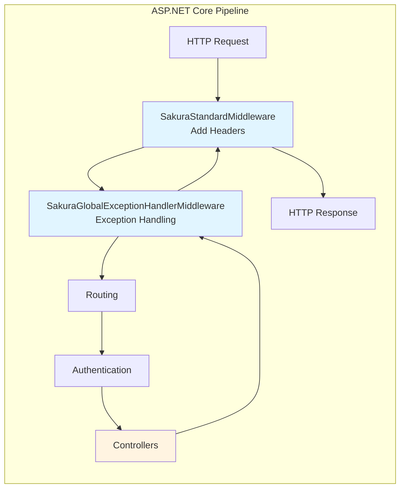

## 20. Dependency Injection Container

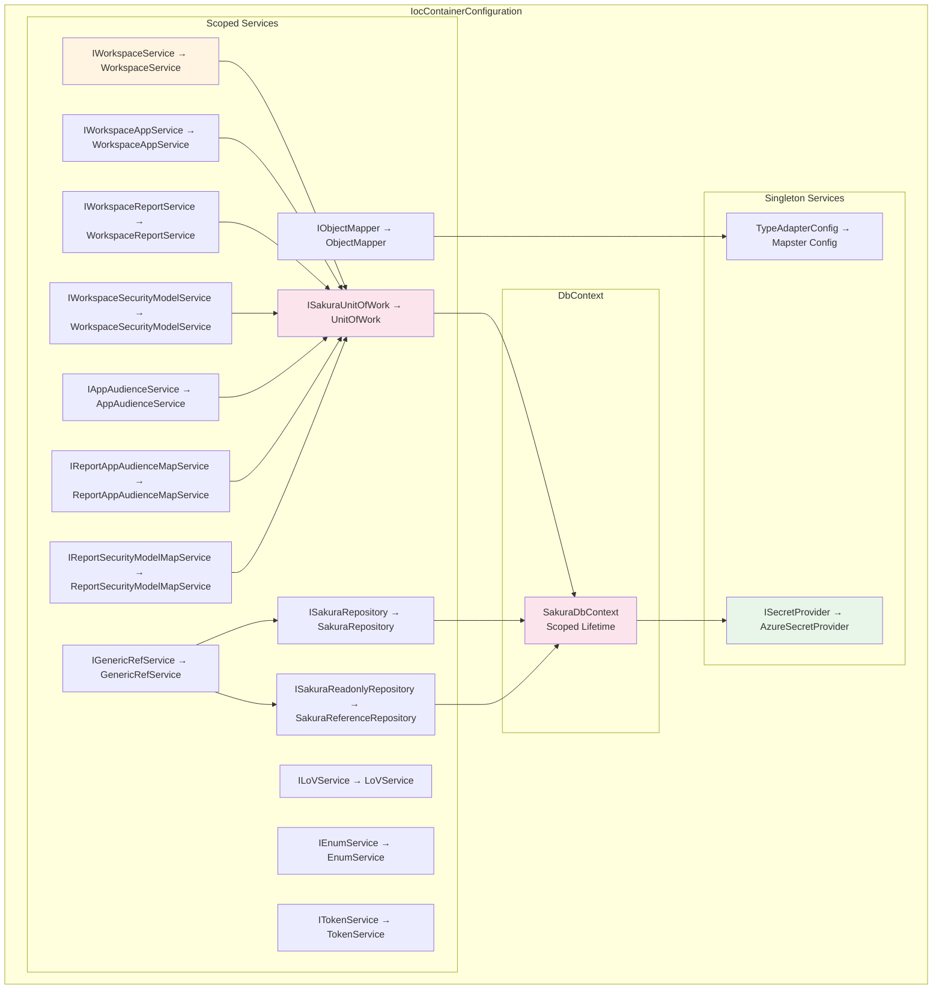

---

## Summary

This documentation provides a complete visual representation of the Sakura Backend architecture using Mermaid diagrams:

1. **Solution Level**: Project dependencies and relationships
2. **Layer Architecture**: High-level layer structure
3. **API Layer**: All controllers, middleware, configurations
4. **Application Layer**: All services, DTOs, validators
5. **Domain Layer**: Entity hierarchy and relationships
6. **Infrastructure Layer**: DbContext, repositories, UnitOfWork
7. **Request Flows**: Detailed sequence diagrams for CRUD operations
8. **Service Methods**: Complete method listings
9. **Repository Methods**: All repository operations
10. **Entity Relationships**: Complete ER diagrams
11. **Middleware Pipeline**: Request processing flow
12. **Dependency Injection**: Service registrations

All diagrams use Mermaid syntax and can be rendered in any Markdown viewer that supports Mermaid (GitHub, GitLab, VS Code, etc.).
