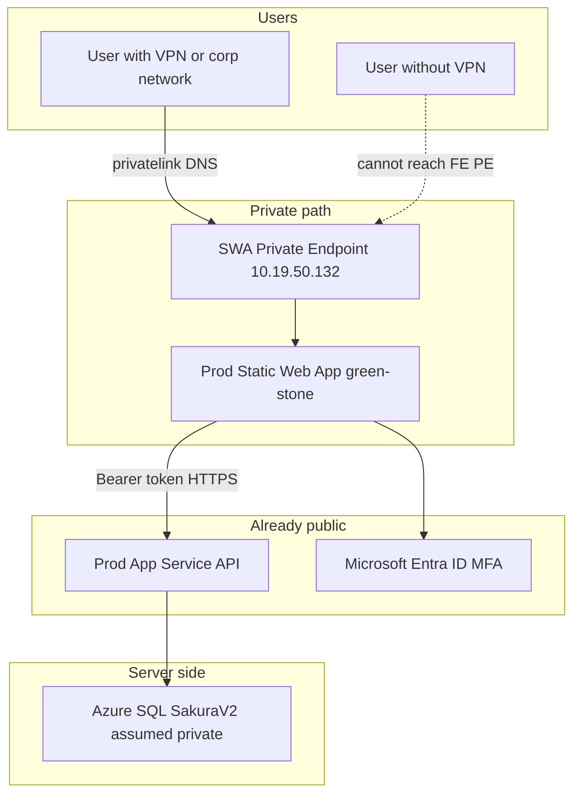
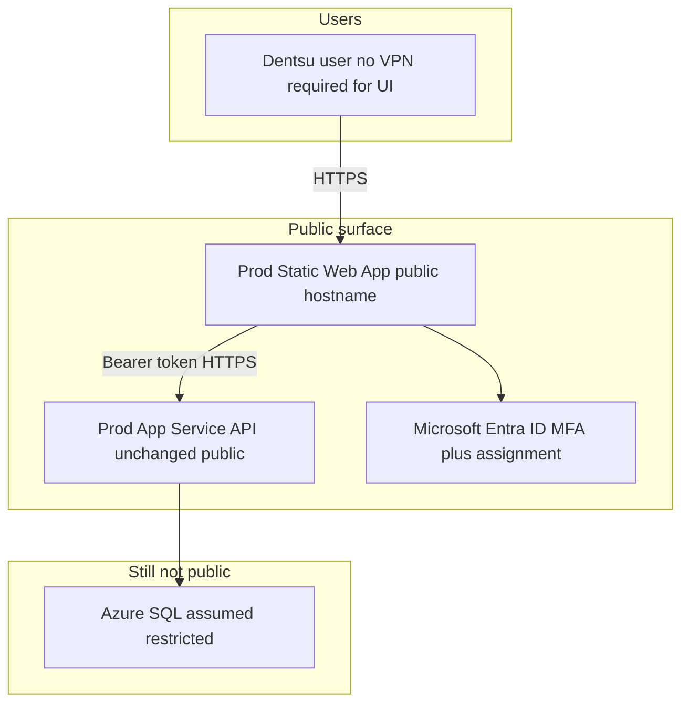

# Sakura V2 — Network Scenario (Before / After Public Frontend)

**Purpose:** One page for current Prod posture, what VPN actually protects, and the steps to move the **frontend** out of VPN.  
**Audience:** Product, Platform, InfoSec, Engineering  
**Evidence date:** Aug 2026 (live Azure JSON + on-VPN DNS)  
**Status:** Design + docs. **No PE removal until InfoSec Phase 0 approval.**

---

## 1. One-line summary

| Topic | Answer |
|-------|--------|
| Why do users need VPN today? | **Frontend** Static Web App resolves to private IP via Private Endpoint + corp DNS |
| Is the API behind VPN? | **No** — Prod App Service is publicly reachable; Entra JWT protects it |
| Is SQL behind VPN? | **Assumed private / not browser-facing** — Networking not verified (no portal read). Browser never talks to SQL |
| What “move FE out of VPN” means | Remove/disconnect **SWA Private Endpoint** (and privatelink DNS), keep API + SQL as they are, keep Entra MFA |

---

## 2. Prod resources (quick reference)

| Layer | Resource | Live hostname / ID | Network today |
|-------|----------|--------------------|---------------|
| Frontend | SWA `azeuw1pswasakura` | `green-stone-0e7ff2e03.2.azurestaticapps.net` | **Private** — PE Approved, IP `10.19.50.132` |
| Frontend custom domain | — | `sakura.dentsu.com` | **Not bound** |
| Backend | App Service `azeuw1pweb01sakura` | `azeuw1pweb01sakura-awfefugdgubjhygd.westeurope-01.azurewebsites.net` | **Public** — `publicNetworkAccess: Enabled`, no PE |
| Backend custom domain | — | `api.sakura.dentsu.com` | **Not bound** |
| Database | SQL `azeuw1psenmastersvrdb01` / DB `SakuraV2` | `*.database.windows.net` | **Assumed restricted** (unverified) |
| Identity | Entra app `e73f4528-…` | Tenant `6e8992ec-…` | MFA at sign-in |
| Subscription / RG | Prod | Sub `15039875-…` · RG `AZ-VDC000007-EUW1-RG-BI-PROD-CENTRAL` | — |

### All environments (FE PE)

| Env | SWA | PE IP | API typical posture |
|-----|-----|-------|---------------------|
| Dev | `azeuw1dswasakura` (orange-sand) | `10.19.54.134` | Public App Service |
| UAT | `azeuw1tswasakura` (lemon-wave) | `10.19.54.136` | Public App Service |
| Prod | `azeuw1pswasakura` (green-stone) | `10.19.50.132` | **Confirmed public** |

---

## 3. BEFORE — current scenario (VPN required for UI)

On corp/VPN DNS, Prod FE resolves:

| Query | Result |
|-------|--------|
| `green-stone-0e7ff2e03.2.azurestaticapps.net` | Alias → `….privatelink.2.azurestaticapps.net` → **`10.19.50.132`** |

### BEFORE — who can do what

| Actor | Open FE URL | Sign in (Entra) | Call API hostname | Reach SQL from browser |
|-------|-------------|-----------------|-------------------|------------------------|
| Dentsu user **with VPN** | Yes | Yes (if allowed) | Yes | No |
| Dentsu user **without VPN** | **No** (PE/DNS) | N/A | Hostname may be reachable, but UI never loads | No |
| Random internet user | No | No | Can hit API host; cannot use app without Entra | No |

---

## 4. AFTER — target scenario (FE public / no VPN for UI)

### AFTER — who can do what

| Actor | Open FE URL | Sign in (Entra) | Call API | Reach SQL from browser |
|-------|-------------|-----------------|----------|------------------------|
| Dentsu user **without VPN** | **Yes** | Yes if assigned + MFA | Yes | No |
| Dentsu user not assigned to Enterprise App | Yes (page loads) | **Usually no** | No useful access | No |
| Random internet user | Can open URL | **No** | Probing only | No |

### BEFORE vs AFTER (side by side)

| Item | BEFORE (today) | AFTER (target) |
|------|----------------|----------------|
| FE Private Endpoint | **Connected** (`10.19.50.132`) | **Removed / disconnected** |
| FE DNS | privatelink → private IP | Public SWA resolution |
| VPN for UI | **Required** | **Not required** |
| API network | Public | Public (unchanged) |
| SQL | Assumed private | Assumed private (unchanged) |
| Entra / MFA | Required | Required (must stay) |
| Main risk change | Network gate + identity | Identity / CA / assignment only |

---

## 5. What to do — move frontend out of VPN

Do **not** start Prod PE removal until **Phase 0** is approved.

### Phase 0 — Decision gate

| # | Action | Owner | Done? |
|---|--------|-------|-------|
| 0.1 | InfoSec written OK to make Prod FE reachable without VPN | InfoSec / Ebad | ☐ |
| 0.2 | Document accepted residual risk | InfoSec | ☐ |
| 0.3 | Scope: UAT first, then Prod (recommended) | Product + Platform | ☐ |

### Phase 1 — Compensating controls (before PE removal)

| # | Action | Why |
|---|--------|-----|
| 1.1 | Confirm MFA remains mandatory | Identity stays when network gate goes |
| 1.2 | Confirm Conditional Access on Enterprise App Sakura | Device / location if required |
| 1.3 | Assign correct Entra **groups** (Assignment required = Yes) | Not a 2-user test list |
| 1.4 | Auth hygiene: Auth Code + PKCE; review Implicit grant | Hardening before public UI |
| 1.5 | Confirm CORS allows live FE origin on Prod API | Browser calls must succeed |

### Phase 2 — Platform change (UAT then Prod)

| # | Action | Env |
|---|--------|-----|
| 2.1 | Disconnect/remove SWA Private Endpoint | UAT `azeuw1tswasakura` first |
| 2.2 | Ensure public DNS for SWA hostname (no privatelink-only rewrite for users) | UAT |
| 2.3 | Off-VPN test: open FE → Entra login → one API call | UAT |
| 2.4 | Repeat PE removal + DNS for Prod `azeuw1pswasakura` (`10.19.50.132`) | Prod |
| 2.5 | Off-VPN test on Prod green-stone URL | Prod |
| 2.6 | Optional later: bind `sakura.dentsu.com` + update Entra redirects | Prod |
| 2.7 | Update user guides: VPN no longer required for V2 web | Docs |

### Phase 3 — Validation checklist

| # | Test | Pass? |
|---|------|-------|
| 3.1 | Assigned user **without VPN** opens FE and signs in | ☐ |
| 3.2 | Unassigned user cannot complete access | ☐ |
| 3.3 | Request create / approve still works | ☐ |
| 3.4 | SQL still not exposed to browser; API still Entra-protected | ☐ |

### What you do **not** change for this goal

| Do not | Reason |
|--------|--------|
| Put SQL on the public internet | Browser never needs SQL; keep DB restricted |
| “Take API out of VPN” | API is already public |
| Rely on My Apps alone | Launch pad, not a firewall |
| Prod-first PE removal | Pilot on UAT |

---

## 6. Related docs

| Doc | Role |
|-----|------|
| [ARCHITECTURE.md](../ARCHITECTURE.md) §10 | Full inventory + networking diagram |
| [SAKURA_VPN_ACCESS_SECURITY_ASSESSMENT_AND_ROADMAP.md](./SAKURA_VPN_ACCESS_SECURITY_ASSESSMENT_AND_ROADMAP.md) | Security assessment + full roadmap |
| [Azure-Static-Web-App-Prod-Pipeline-Config.md](./Azure-Static-Web-App-Prod-Pipeline-Config.md) | Prod deploy hostnames / token |

---

## 7. Evidence snapshot (Prod)

| Check | Result |
|-------|--------|
| SWA PE | Approved · `azeuw1pswasakura_Privateendpoint` · `10.19.50.132` |
| SWA customDomains | `[]` |
| On-VPN nslookup green-stone | → privatelink → `10.19.50.132` |
| App Service `publicNetworkAccess` | `Enabled` |
| App Service PE | None |
| App Service VNet | None |
| SQL Networking | Not read (no access) — assumed restricted |
