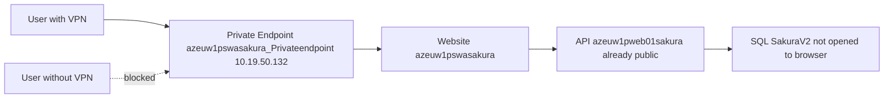
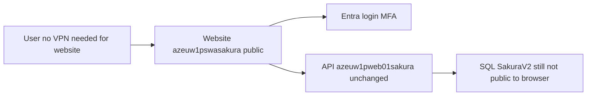

# Sakura V2 — Step-by-Step: Move Frontend Outside VPN

**Who this is for:** Anyone who needs a clear checklist (beginner OK).  
**Goal in plain words:** Today users must connect **Dentsu VPN** to open the Sakura website. We want them to open the website **without VPN**, while still signing in with company Microsoft account + MFA.  
**What we change:** Only the **frontend website** network lock.  
**What we do not change:** Database lock; API stays as it is (already public); Entra login stays.

**Rule:** Do not touch Production Private Endpoint until Step 0 and Step 1 are done and UAT (Step 2) passed.

---

## A. Names you will see (memorise these)

### Production (live users)

| What people call it | Exact Azure / URL name |
|---------------------|------------------------|
| Prod frontend website | Static Web App **`azeuw1pswasakura`** |
| Prod frontend URL | `https://green-stone-0e7ff2e03.2.azurestaticapps.net` |
| Prod frontend private lock | Private Endpoint **`azeuw1pswasakura_Privateendpoint`** → IP **`10.19.50.132`** |
| Prod resource group | **`AZ-VDC000007-EUW1-RG-BI-PROD-CENTRAL`** |
| Prod subscription | **`15039875-d735-4154-b944-f25aa3db1327`** |
| Prod backend API | App Service **`azeuw1pweb01sakura`** |
| Prod API URL | `https://azeuw1pweb01sakura-awfefugdgubjhygd.westeurope-01.azurewebsites.net` |
| Prod database | SQL server **`azeuw1psenmastersvrdb01`** · database **`SakuraV2`** |
| Login app | Entra App Registration / Enterprise App **Sakura** · App ID **`e73f4528-2ceb-40e3-8e4a-d72287adb4c5`** |

### UAT (test first — recommended)

| What people call it | Exact name |
|---------------------|------------|
| UAT frontend | Static Web App **`azeuw1tswasakura`** |
| UAT frontend URL | `https://lemon-wave-07fa68003.2.azurestaticapps.net` |
| UAT private lock | Private Endpoint → IP **`10.19.54.136`** |
| UAT API | App Service **`azeuw1tweb01sakura`** |

### Dev (do not use for this change unless asked)

| What | Exact name |
|------|------------|
| Dev frontend | **`azeuw1dswasakura`** · `orange-sand-03a59b103.3.azurestaticapps.net` · PE **`10.19.54.134`** |

---

## B. Picture: today vs target

### TODAY (inside VPN)

| Today | Fact |
|-------|------|
| Website | Locked behind Private Endpoint + VPN DNS |
| API | Already reachable on the internet |
| Database | Not used by the browser; keep locked |

### TARGET (outside VPN for website)

| After | Fact |
|-------|------|
| Website | Public URL works without VPN |
| Login | Still Microsoft Entra + MFA |
| API / DB | Same as today |

---

## C. Full step-by-step checklist

For **every** step below: do the work → fill the **Document for security** box → keep screenshots/tickets in one folder (e.g. `Sakura-FE-Public-Access-Evidence`).

---

### STEP 0 — Get written permission (do this first)

Without this, Cloud/InfoSec will reject the change later.

#### Step 0.1 — Ask InfoSec for approval

| | |
|--|--|
| **What to do** | Send a short request to InfoSec (e.g. Ebad / security owner): *“We want Sakura V2 website `azeuw1pswasakura` reachable without Dentsu VPN. API `azeuw1pweb01sakura` is already public. SQL stays private. Please approve or reject.”* |
| **Why required** | Moving the website outside VPN is a **security decision**, not only a Cloud click. |
| **Document for security** | Email/ticket ID · date · approver name · Approve / Reject · any conditions (e.g. “only with Conditional Access”). |

#### Step 0.2 — Write down accepted risk

| | |
|--|--|
| **What to do** | In the same ticket, record: *“After this change, anyone on the internet can open the website URL. Only Dentsu users who pass Entra + MFA (+ assignment) can sign in.”* |
| **Why required** | Security assessment later needs proof you understood residual risk. |
| **Document for security** | One paragraph signed/approved by InfoSec in the ticket. |

#### Step 0.3 — Agree order: UAT then Prod

| | |
|--|--|
| **What to do** | Agree in writing: change **UAT `azeuw1tswasakura` first**, prove it, then Prod **`azeuw1pswasakura`**. |
| **Why required** | Avoids breaking live users on first try. |
| **Document for security** | Note in ticket: UAT pilot date · Prod target date. |

**Stop here if Step 0 is not Approved.**

---

### STEP 1 — Security controls before any network change

These replace the “VPN trust” with identity controls. Do all of these **before** removing Private Endpoints.

#### Step 1.1 — Confirm MFA stays on

| | |
|--|--|
| **What to do** | Ask InfoSec/Entra admin: MFA for app **Sakura** (`e73f4528-2ceb-40e3-8e4a-d72287adb4c5`) will remain after FE is public. |
| **Where** | Entra / Conditional Access (or InfoSec confirms in ticket). |
| **Why required** | VPN removal must **not** turn MFA off. |
| **Document for security** | Screenshot or written confirmation: “MFA required = Yes” for Sakura. |

#### Step 1.2 — Confirm Conditional Access (CA)

| | |
|--|--|
| **What to do** | Ask: Are there CA policies on Enterprise Application **Sakura**? List them (MFA, compliant device, location, etc.). |
| **Where** | Entra → Enterprise applications → **Sakura** → Conditional Access. |
| **Why required** | After VPN is gone, CA is a main control for security assessment. |
| **Document for security** | Policy names · what each requires · screenshot of CA blade (or InfoSec export). |

#### Step 1.3 — Fix who can sign in (assignment)

| | |
|--|--|
| **What to do** | Enterprise App **Sakura** → Users and groups: keep **Assignment required = Yes**. Add the real Entra **security groups** for Sakura users (not only 2 test people). |
| **Where** | Entra → Enterprise applications → **Sakura** → Users and groups. |
| **Why required** | Stops every Dentsu account from using Sakura just because the URL is public. |
| **Document for security** | Screenshot: Assignment required = Yes · list of groups added · owner who approved the list. |

#### Step 1.4 — Check login redirect URLs

| | |
|--|--|
| **What to do** | App registration **Sakura** → Authentication: confirm SPA redirect includes `https://green-stone-0e7ff2e03.2.azurestaticapps.net/` (and UAT lemon-wave if testing UAT). |
| **Where** | Entra → App registrations → **Sakura** → Authentication. |
| **Why required** | Wrong redirect = login fails after users reach the public site. |
| **Document for security** | Screenshot of SPA redirect URI list. |

#### Step 1.5 — Note Implicit grant debt

| | |
|--|--|
| **What to do** | On Authentication blade, check if Implicit grant is still enabled. Prefer Auth Code + PKCE for SPA. Plan fix with FE/security if still on Implicit. |
| **Why required** | Public apps are expected to use modern auth in security reviews. |
| **Document for security** | Current setting · ticket to remediate if needed · owner. |

#### Step 1.6 — Confirm API CORS allows the website

| | |
|--|--|
| **What to do** | On App Service **`azeuw1pweb01sakura`** (and UAT **`azeuw1tweb01sakura`**), confirm CORS (or app config) allows origin `https://green-stone-0e7ff2e03.2.azurestaticapps.net` (and UAT lemon-wave). |
| **Where** | Azure Portal → App Service → CORS / or appsettings. |
| **Why required** | Browser blocks API calls if CORS is wrong — looks like “app broken” after VPN removal. |
| **Document for security** | Screenshot of allowed origins. |

#### Step 1.7 — Snapshot “SQL stays private” for the file

| | |
|--|--|
| **What to do** | Ask a DBA/cloud admin with access to screenshot SQL server **`azeuw1psenmastersvrdb01`** → Networking (public access / firewall / private endpoint). You may not have access — that is OK; get someone who does. |
| **Why required** | Security assessment will ask: “Did you open the database?” Answer must be **No**, with proof. |
| **Document for security** | Screenshot: public access Off / firewall / PE · date · who captured it. |

**Do not remove any Private Endpoint until Step 1 checklist is complete and filed.**

---

### STEP 2 — Change UAT first (pilot)

Resource: Static Web App **`azeuw1tswasakura`** · URL `https://lemon-wave-07fa68003.2.azurestaticapps.net` · PE IP **`10.19.54.136`**.

#### Step 2.1 — Record UAT “before” proof

| | |
|--|--|
| **What to do** | With VPN **ON**: `nslookup lemon-wave-07fa68003.2.azurestaticapps.net` — expect private IP `10.19.54.136`. Screenshot SWA Networking showing Private Endpoint connected. |
| **Why required** | Proves what you changed later. |
| **Document for security** | nslookup output · PE screenshot · date. |

#### Step 2.2 — Open change ticket for Cloud / EUC

| | |
|--|--|
| **What to do** | Raise ticket: *Remove / disconnect Private Endpoint on UAT SWA `azeuw1tswasakura` so `lemon-wave-07fa68003.2.azurestaticapps.net` works without VPN. Also update corp DNS so it no longer forces privatelink-only for that hostname (if EUC owns DNS).* |
| **Why required** | PE + DNS are often owned by Cloud/EUC, not app developers. |
| **Document for security** | Ticket number · exact resource names · requested outcome. |

#### Step 2.3 — Disconnect / remove UAT Private Endpoint

| | |
|--|--|
| **What to do** | Azure Portal → Static Web App **`azeuw1tswasakura`** → Networking → Private endpoint → Disconnect/Delete the approved PE (the one used for `10.19.54.136`). Only the Cloud owner should do this if you lack rights. |
| **Why required** | This is the actual lock that forces VPN for the website. |
| **Document for security** | Before/after Networking screenshots · who performed · timestamp. |

#### Step 2.4 — Fix UAT DNS (if still pointing to private IP)

| | |
|--|--|
| **What to do** | With VPN **OFF**, run `nslookup lemon-wave-07fa68003.2.azurestaticapps.net`. It must **not** resolve only to `10.19.54.136`. If it still does on VPN-off public DNS, ask EUC to adjust privatelink / corporate DNS override. |
| **Why required** | Removing PE without DNS fix can leave users broken or confused. |
| **Document for security** | VPN-off nslookup · VPN-on nslookup · EUC ticket if DNS changed. |

#### Step 2.5 — Test UAT without VPN

| | |
|--|--|
| **What to do** | Disconnect VPN. Open `https://lemon-wave-07fa68003.2.azurestaticapps.net`. Sign in. Create or view one request. In browser DevTools → Network, confirm API call to **`azeuw1tweb01sakura`** returns 200 (not CORS/401 loop). |
| **Why required** | Proves the pilot works end to end. |
| **Document for security** | Screenshots: page load · signed-in home · one successful API call · tester name · date. |

#### Step 2.6 — Negative test on UAT

| | |
|--|--|
| **What to do** | Try a Dentsu user **not** in the assigned groups — should not get into the app. |
| **Why required** | Proves assignment still protects after VPN is gone. |
| **Document for security** | Screenshot of blocked/denied sign-in · user identity type (not password). |

**Only continue to Prod if Step 2.5 and 2.6 pass.**

---

### STEP 3 — Change Production

Resource: Static Web App **`azeuw1pswasakura`** · URL `https://green-stone-0e7ff2e03.2.azurestaticapps.net` · PE **`azeuw1pswasakura_Privateendpoint`** · IP **`10.19.50.132`** · RG **`AZ-VDC000007-EUW1-RG-BI-PROD-CENTRAL`**.

#### Step 3.1 — Record Prod “before” proof

| | |
|--|--|
| **What to do** | VPN ON: `nslookup green-stone-0e7ff2e03.2.azurestaticapps.net` → expect `10.19.50.132`. Screenshot PE **Approved**. |
| **Why required** | Audit trail for security assessment. |
| **Document for security** | nslookup · PE JSON/screenshot · date. |

#### Step 3.2 — Change window + communication

| | |
|--|--|
| **What to do** | Book a short maintenance window. Tell users: “Sakura may briefly fail; after change VPN will no longer be required for the website.” |
| **Why required** | PE removal can briefly disrupt VPN users until DNS settles. |
| **Document for security** | Comms email · window start/end · approver. |

#### Step 3.3 — Open Prod Cloud/EUC ticket

| | |
|--|--|
| **What to do** | Ticket text: *Disconnect/remove Private Endpoint `azeuw1pswasakura_Privateendpoint` (IP `10.19.50.132`) on SWA `azeuw1pswasakura` in RG `AZ-VDC000007-EUW1-RG-BI-PROD-CENTRAL`. Update DNS so `green-stone-0e7ff2e03.2.azurestaticapps.net` is reachable without VPN. Do not change App Service `azeuw1pweb01sakura` or SQL `azeuw1psenmastersvrdb01`.* |
| **Why required** | Clear scope prevents accidental API/SQL changes. |
| **Document for security** | Ticket ID · exact resource names (copy from this step). |

#### Step 3.4 — Disconnect / remove Prod Private Endpoint

| | |
|--|--|
| **What to do** | Portal → **`azeuw1pswasakura`** → Networking → remove/disconnect **`azeuw1pswasakura_Privateendpoint`**. |
| **Why required** | This is the change that moves the website from “inside VPN” to “outside VPN”. |
| **Document for security** | Before/after screenshots · operator · timestamp · change ticket link. |

#### Step 3.5 — Fix Prod DNS if needed

| | |
|--|--|
| **What to do** | VPN **OFF**: `nslookup green-stone-0e7ff2e03.2.azurestaticapps.net` — must not require `10.19.50.132`. Open the HTTPS URL without VPN. |
| **Why required** | Confirms public path works. |
| **Document for security** | VPN-off nslookup · browser success screenshot. |

#### Step 3.6 — Test Prod without VPN

| | |
|--|--|
| **What to do** | No VPN → open green-stone URL → Entra login + MFA → one real business action (request/approve) → confirm API calls to **`azeuw1pweb01sakura-awfefugdgubjhygd.westeurope-01.azurewebsites.net`** succeed. |
| **Why required** | Production acceptance. |
| **Document for security** | Test script results · screenshots · tester · date/time. |

#### Step 3.7 — Confirm what you did **not** open

| | |
|--|--|
| **What to do** | Re-check: App Service **`azeuw1pweb01sakura`** still as before (public + Entra). SQL **`azeuw1psenmastersvrdb01`** still not public to internet browsers. |
| **Why required** | Security assessment asks for blast-radius proof. |
| **Document for security** | Short signed note + SQL networking screenshot from Step 1.7. |

---

### STEP 4 — Paperwork and user docs (required for future security assessment)

#### Step 4.1 — Update user guides

| | |
|--|--|
| **What to do** | Edit `userguide/.../VPN.md` and `SakuraUserGuide.md`: VPN is **no longer required** for Sakura V2 website (after Prod cutover). Keep VPN notes only if something else still needs it. |
| **Why required** | Users and auditors must not follow outdated “VPN mandatory” text. |
| **Document for security** | PR/commit link · date guides updated. |

#### Step 4.2 — Update architecture / this evidence pack

| | |
|--|--|
| **What to do** | Keep this file + ticket pack updated: BEFORE PE IP, AFTER “PE removed”, who approved, test results. |
| **Why required** | Future security assessment = show evidence pack, not memory. |
| **Document for security** | Folder index: tickets, screenshots, nslookups, CA proof, MFA proof, test results. |

#### Step 4.3 — Optional My Apps tile

| | |
|--|--|
| **What to do** | Only if Product wants it: Enterprise App **Sakura** → Visible to users = Yes. This is **not** the security control — assignment + MFA + CA are. |
| **Why required** | Helps discovery; does not replace VPN by itself. |
| **Document for security** | Screenshot of Visible setting · who approved. |

#### Step 4.4 — Optional custom domain later

| | |
|--|--|
| **What to do** | Later: bind `sakura.dentsu.com` to **`azeuw1pswasakura`**, add Entra redirect, update FE env. **Not required** to leave VPN. |
| **Why required** | Nice URL only; separate change. |
| **Document for security** | Domain ticket · Entra redirect screenshot. |

---

## D. Do not do these (avoids confusion)

| Do not | Exact reason |
|--------|----------------|
| Delete or open SQL **`azeuw1psenmastersvrdb01`** to the whole internet | Browser never needs the database |
| “Move API out of VPN” as a task | API **`azeuw1pweb01sakura`** is already public |
| Remove Prod PE before UAT pilot | High risk to live users |
| Remove PE without InfoSec Step 0 | Fails future security assessment |
| Assume My Apps = secure | My Apps is only a launch icon |

---

## E. One-page “done” definition

You are finished when **all** of these are true and documented:

| # | Done means | Evidence |
|---|------------|----------|
| 1 | InfoSec approved | Ticket |
| 2 | MFA + CA + assignment documented | Screenshots |
| 3 | UAT works **without VPN** | Test pack |
| 4 | Prod PE **`azeuw1pswasakura_Privateendpoint`** removed | Portal screenshot |
| 5 | Prod green-stone URL works **without VPN** | Test pack |
| 6 | SQL not opened to public browsers | Networking screenshot |
| 7 | User guides updated | Commit/PR |

---

## F. Related reading

| Doc | Use when |
|-----|----------|
| [SAKURA_VPN_ACCESS_SECURITY_ASSESSMENT_AND_ROADMAP.md](./SAKURA_VPN_ACCESS_SECURITY_ASSESSMENT_AND_ROADMAP.md) | Deep security discussion |
| [ARCHITECTURE.md](../ARCHITECTURE.md) §10 | Full resource map |
| [Azure-Static-Web-App-Prod-Pipeline-Config.md](./Azure-Static-Web-App-Prod-Pipeline-Config.md) | Deploy / tokens |
