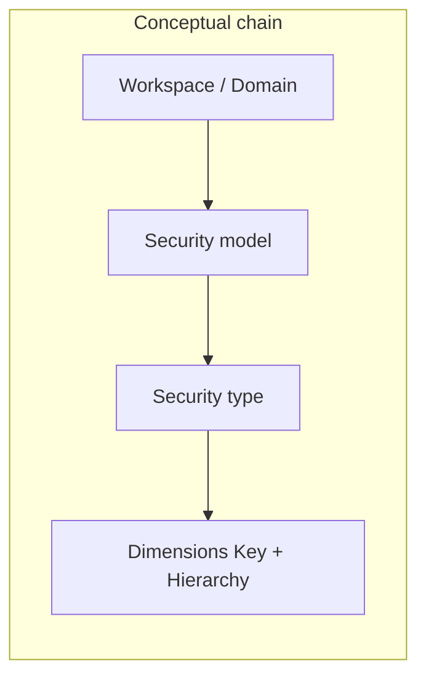
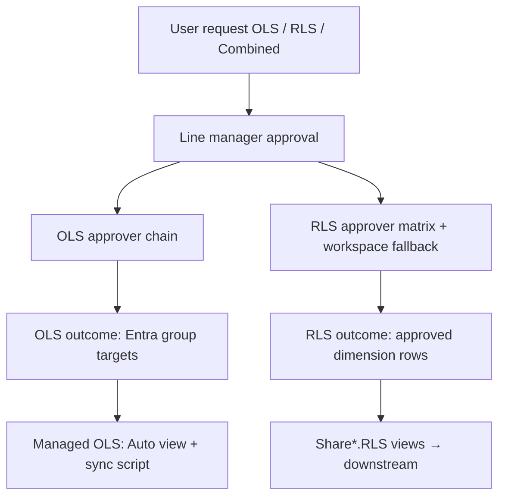
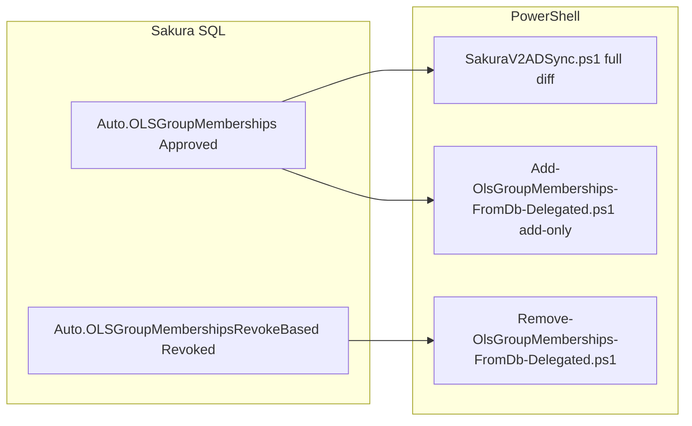
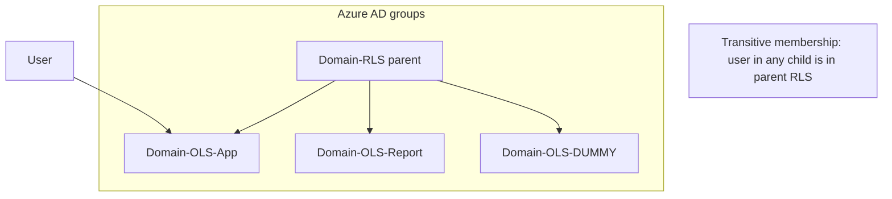

# Sakura Access Management — End-to-End Design (OLS + RLS)

> **Audience:** architects, app owners, and operators who need one place that ties **business language** (domain, security model, security type, dimensions) to **Sakura**, **SQL views**, and **Entra automation**.  
> **Repository ground truth:** `Sakura_DB` view definitions, `FE/.../permission-request-workspace-rls.config.ts`, `Docs/DOMAIN_SECURITY_MODEL_TYPE_AND_DIMENSIONS.md`, `BE_Main/SakuraV2ADSync.ps1`, `AD/Add-OlsGroupMemberships-FromDb-Delegated.ps1`, `AD/Remove-OlsGroupMemberships-FromDb-Delegated.ps1`.

---

## 1. Overview

Sakura provisions **Power BI** access through two layers:

| Layer | What it controls | Typical enforcement |
|--------|------------------|---------------------|
| **OLS** (Object Level Security) | Apps, Audiences, Reports, Workspaces — *can the user open the artifact?* | Entra **security groups** (especially **Managed** app audiences), workspace catalog |
| **RLS** (Row Level Security) | **Security model** + **security type** + **dimensions** — *which rows in the model?* | Domain **Share** views → downstream Fabric / semantic pipelines; historically **not** mirrored by the same AD job as OLS |

**Request shapes supported in product terms:**

- **OLS-only** — line manager → OLS approver → group assignment path for object access.
- **RLS-only** — line manager → RLS approver (matrix) → dimension-scoped approval stored in domain RLS tables.
- **Combined** — both headers; both approval chains as configured.

---

## 2. Core concepts (repository-aligned)

### 2.1 Workspace / domain

In Sakura, a **workspace** belongs to a **domain** (List-of-Values), e.g. **GI**, **CDI**, **WFI**, **DFI**, **AMER**, **EMEA**. The UI may map codes (e.g. FDI → DFI, CGI → GI); the **database** is authoritative for `WorkspaceCode` and `DomainLoVId`.

### 2.2 Security model

A **WorkspaceSecurityModel** is a **named package** of RLS rules for that workspace (examples used in scripts: `GI-Default`, `DFI-Default`, `AMER-Default`, `CDI-CLIENT`). Models are **not** hard-coded globally — they come from **`WorkspaceSecurityModels`** and **`SecurityModelSecurityTypeMap`**.

### 2.3 Security type

A **LoV** entry with `LoVType = 'SecurityType'`. It tells the UI **which dimension groups** apply and which **RLS detail table** row shape is used. Labels vary by domain (e.g. **GI**, **FUM**, **AMER-ORGA**, **EMEA** variants).

### 2.4 Dimensions

**Dimensions** are scopes for data access: usually a **Key** (which reference row) plus a **Hierarchy** (rollup level: Global, Entity, DSH, etc.). They are stored per domain in `RLSPermission*Details` tables and exposed in **`Share[Schema].RLS`** views.

---

## 3. Domain cheat sheet — model, type, dimensions

The table below matches **`Docs/DOMAIN_SECURITY_MODEL_TYPE_AND_DIMENSIONS.md`** and the **tabular RLS** behaviour in the frontend. **Security model codes** in your environment may differ; always confirm in **`WorkspaceSecurityModels`**.

| Domain | UI / config key | Typical security types (LoV) | Dimensions (what users / approvers fill) |
|--------|------------------|------------------------------|------------------------------------------|
| **GI** | GI | **GI** | Organization (Entity) → Client → MSS → Service line |
| **CDI** | CDI | Orga, PA, Client, CC, MSS, PC *(options from DB map)* | Tabular path: **Entity + Client + Service line** *(same three for all CDI types in current UI logic)* |
| **WFI** | WFI | **WFI** | Organization (Entity) → People Aggregator (PA) |
| **DFI** (Finance) | DFI | **FUM** | Entity → Country → Client → MSS → Profit center *(FUM “Geo” / N/A org path supported in validation)* |
| **AMER** | AMER | Orga, PA, Client, CC, MSS, PC *(from DB map)* | **Depends on type label** — e.g. Orga: Entity+SL; Client: Entity+Client+SL; CC: Entity+SL+CC; PC: Entity+SL+PC+Client; MSS: Entity+MSS; PA: Entity+PA+SL |
| **EMEA** | EMEA | Orga, Country, Client, CC, MSS, … | **Depends on type label** — e.g. Orga: Entity+SL; Country: Entity+Country+SL; Client: Entity+Client+SL; CC: Entity+SL+CC; MSS: Entity+MSS |

**Frontend references:** `FE/application/src/app/domains/data-entry/data/permission-request-workspace-rls.config.ts`, `rls-dimensions-by-security-type.util.ts`.

---

## 4. What Sakura does today (highlights)

| Capability | Where it lives |
|------------|----------------|
| Permission requests (OLS + RLS headers, combined) | Data Entry / request wizards → `PermissionRequests`, `PermissionHeaders`, `OLSPermissions`, `RLSPermissions` |
| OLS approvers | Per app / audience / report / workspace catalog |
| RLS approvers | Matrix by **security model + security type + dimension combination** (WSO) — see `Docs/RLS_APPROVER_ASSIGN_REASSIGN_GUIDE.md` |
| **Managed OLS** — automated Entra membership | **`[Auto].[OLSGroupMemberships]`** → `SakuraV2ADSync.ps1` (full add/remove sync to **`AppAudiences.AudienceEntraGroupUID`**) |
| **Revoked Managed OLS** — removal candidates | **`[Auto].[OLSGroupMembershipsRevokeBased]`** → `Remove-OlsGroupMemberships-FromDb-Delegated.ps1` |
| **Add-only / delegated** batch | `Add-OlsGroupMemberships-FromDb-Delegated.ps1` reads **`[Auto].[OLSGroupMemberships]`** |
| Approved **RLS** for analytics / pipelines | **`Share[Domain].RLS`** views (one schema per domain — see §6) |
| **NotManaged** apps — app owners manage groups | **`Share[Domain].OLS`** views expose approved OLS for **NotManaged** apps (excluded from `Auto` sync by design) |

> **Important (V2 split):** Approved **RLS** is **not** applied by the same mechanism as **`Auto.OLSGroupMemberships`**. RLS flows through **Share views** and downstream processing. **Entra nesting** can still combine groups operationally — see **`Docs/SG_UN_SAKURA_RLS_OLS_V1_V2_FLOW.md`**.

---

## 5. Approval workflow (conceptual)

- **OLS:** routed using **workspace app / audience / report** mappings.
- **RLS:** routed using **approvers assigned to model + type + dimensions**; may fall back to **workspace approver** when configured.
- **Combined:** both chains must complete for their respective headers.

---

## 6. SQL views — approved RLS by domain (Power BI / Fabric consumers)

Each domain uses a **separate schema** in the database. **RLS** approved rows read from domain-specific detail tables.

> **Naming note:** Finance (DFI) RLS uses schema **`ShareFUM`**, not `ShareDFI`.

### 6.1 `[ShareGI].[RLS]`

| Column | Description |
|--------|-------------|
| `EntityKey`, `EntityHierarchy` | Organization |
| `ClientKey`, `ClientHierarchy` | Client |
| `MSSKey`, `MSSHierarchy` | Master service set |
| `SLKey`, `SLHierarchy` | Service line |
| `AdditionalDetailsJSON` | Extra payload from `RLSPermissions` |
| `SecurityType` | From `LoVs` (`LoVValue`) |
| `RequestedBy`, `RequestedFor` | People |
| `RequestDate`, `ApprovedBy`, `ApprovalDate` | Audit |

**Source:** `dbo.RLSPermissionGIDetails`, `dbo.RLSPermissions`, approved RLS headers.

---

### 6.2 `[ShareCDI].[RLS]`

| Column | Description |
|--------|-------------|
| `EntityKey`, `EntityHierarchy` | Organization |
| `ClientKey`, `ClientHierarchy` | Client |
| `SLKey`, `SLHierarchy` | Service line |
| `AdditionalDetailsJSON` | Extra payload |
| `SecurityType` | LoV security type |
| `RequestedBy`, `RequestedFor`, `RequestDate`, `ApprovedBy`, `ApprovalDate` | Audit |

**Source:** `dbo.RLSPermissionCDIDetails`.

---

### 6.3 `[ShareWFI].[RLS]`

| Column | Description |
|--------|-------------|
| `EntityKey`, `EntityHierarchy` | Organization |
| `PAKey`, `PAHierarchy` | People Aggregator |
| `AdditionalDetailsJSON` | Extra payload |
| `SecurityType` | LoV security type |
| `RequestedBy`, `RequestedFor`, `RequestDate`, `ApprovedBy`, `ApprovalDate` | Audit |

**Source:** `dbo.RLSPermissionWFIDetails`.

---

### 6.4 `[ShareFUM].[RLS]` *(DFI / FUM domain)*

| Column | Description |
|--------|-------------|
| `EntityKey`, `EntityHierarchy` | Organization |
| `CountryKey`, `CountryHierarchy` | Country |
| `ClientKey`, `ClientHierarchy` | Client |
| `MSSKey`, `MSSHierarchy` | MSS |
| `ProfitCenterKey`, `ProfitCenterHierarchy` | Profit center |
| `AdditionalDetailsJSON` | Extra payload |
| `SecurityType` | LoV security type (e.g. **FUM**) |
| `RequestedBy`, `RequestedFor`, `RequestDate`, `ApprovedBy`, `ApprovalDate` | Audit |

**Source:** `dbo.RLSPermissionFUMDetails`.

---

### 6.5 `[ShareAMER].[RLS]`

| Column | Description |
|--------|-------------|
| `EntityKey`, `EntityHierarchy` | Organization |
| `SLKey`, `SLHierarchy` | Service line |
| `ClientKey`, `ClientHierarchy` | Client |
| `PCKey`, `PCHierarchy` | Profit center |
| `CCKey`, `CCHierarchy` | Cost center |
| `PAKey`, `PAHierarchy` | People Aggregator |
| `MSSKey`, `MSSHierarchy` | MSS |
| `AdditionalDetailsJSON` | Extra payload |
| `SecurityType` | LoV security type |
| `RequestedBy`, `RequestedFor`, `RequestDate`, `ApprovedBy`, `ApprovalDate` | Audit |

**Source:** `dbo.RLSPermissionAMERDetails`.

---

### 6.6 `[ShareEMEA].[RLS]`

| Column | Description |
|--------|-------------|
| `EntityKey`, `EntityHierarchy` | Organization |
| `SLKey`, `SLHierarchy` | Service line |
| `ClientKey`, `ClientHierarchy` | Client |
| `CCKey`, `CCHierarchy` | Cost center |
| `CountryKey`, `CountryHierarchy` | Country |
| `MSSKey`, `MSSHierarchy` | MSS |
| `AdditionalDetailsJSON` | Extra payload |
| `SecurityType` | LoV security type |
| `RequestedBy`, `RequestedFor`, `RequestDate`, `ApprovedBy`, `ApprovalDate` | Audit |

**Source:** `dbo.RLSPermissionEMEADetails`.

---

### 6.7 Sample / dev views (optional)

For each domain, **`Share[Domain].RLSSample`** exists alongside **`RLS`** — use for **samples** or non-prod validation (`Sakura_DB/Share/Views/RLS/`).

---

## 7. SQL views — OLS (NotManaged apps & SAR)

**`Share[Domain].OLS`** exposes **approved** OLS for **NotManaged** apps (`WorkspaceApps.OLSMode = 1`) and **standalone report** rows where applicable — so **app owners** can implement their own Entra process. Column pattern includes: `OLSItemType`, `OLSItemId`, `OLSItemCode`, `OLSItemName`, `OLSEntraGroupId`, request/approval metadata, `AppId`, `WorkspaceId`, workspace/app owners.

**Managed OLS** (automation) does **not** use these Share views for sync — it uses **`Auto`** (next section).

---

## 8. SQL views — PowerShell / Entra automation (Managed OLS)

These views are the **contract** for group membership scripts.

### 8.1 `[Auto].[OLSGroupMemberships]` — desired **add / keep** state

| Column | Type | Meaning |
|--------|------|---------|
| `RequestedFor` | string (UPN) | User to be in the group |
| `EntraGroupUID` | GUID | Target Entra group (`AppAudiences.AudienceEntraGroupUID`) |
| `LastChangeDate` | datetime2 | Coalesce of approval / update time |

**Filters (summary):** `PermissionType = OLS`, `ApprovalStatus = Approved`, **Managed** apps only (`OLSMode = 0`), **App Audience** rows (`OLSItemType = 1`), active workspace/app/audience, non-null group UID.

**Used by:** `BE_Main/SakuraV2ADSync.ps1`, `AD/Add-OlsGroupMemberships-FromDb-Delegated.ps1`.

### 8.2 `[Auto].[OLSGroupMembershipsRevokeBased]` — **revoke** candidates

| Column | Same as above |
|--------|----------------|
| `RequestedFor`, `EntraGroupUID`, `LastChangeDate` | Revoked rows (`ApprovalStatus = Revoked`) |

**Used by:** `AD/Remove-OlsGroupMemberships-FromDb-Delegated.ps1` to **remove** users still present in the group.

---

## 9. Target design — domain RLS parent + OLS nesting + dummy OLS *(proposal)*

The following aligns with your **product architecture intent** and complements **`Docs/SG_UN_SAKURA_RLS_OLS_V1_V2_FLOW.md`**. Treat operational cutover (group names, nesting in Entra, whether dummy groups exist) as an **implementation checklist** — not all steps may be deployed in every tenant at once.

### 9.1 Idea

- Per domain, a **parent** Entra group **`<Domain>-RLS`** represents **RLS membership** for Power BI / Fabric.
- All **OLS** leaf groups for that domain (**`<Domain>-OLS-*`**) are **nested** under **`<Domain>-RLS`**.
- **RLS-only** requests (no artifact OLS) add the user to **`<Domain>-OLS-DUMMY`**, which is also nested under **`<Domain>-RLS`**, so **transitive membership** grants the parent without granting a real app audience.

### 9.2 Behaviour

| Flow | Line manager → | Provisioning idea |
|------|----------------|---------------------|
| OLS | OLS approver | Add to **`<Domain>-OLS-…`** → user inherits **`<Domain>-RLS`** via nesting |
| RLS-only | RLS approver | Add to **`<Domain>-OLS-DUMMY`** → same inheritance |
| Combined | Both | OLS groups as needed; RLS already covered by nesting **or** explicit RLS rows still in **Share*.RLS** for semantic filters |

### 9.3 Automation alignment

A scheduled job (e.g. **every 8 hours**) can:

1. Continue to read **`[Auto].[OLSGroupMemberships]`** for **Managed** audiences — ensuring **real** OLS groups match Sakura.
2. **If/when** dummy groups are modeled as **Managed** audiences with Entra GUIDs in catalog, the **same** view-driven pattern applies; otherwise a **separate** controlled view/proc may be introduced — that extension is **not** in the current `Auto.OLSGroupMemberships` definition (which is **App Audience**-scoped).

### 9.4 Guardrails

- **Dummy** group must **not** map to a Power BI artifact that grants unintended object access (naming, catalog, OLS mode).
- Confirm **Power BI / Fabric** resolves **nested** groups as required for your deployment.
- **Service account** / app registration needs **Group.ReadWrite.All** (application) or equivalent, and **ownership** of target groups where your tenant policy requires it.

---

## 10. Players — who does what

| Player | Role |
|--------|------|
| **Requester** | Submits OLS / RLS / combined requests; picks workspace, security model, type, dimensions. |
| **Line manager** | First approval gate. |
| **OLS approver** | Approves access to apps, audiences, reports per workspace rules. |
| **RLS approver** | Approves data scope; mapped via **WSO** dimension matrix. |
| **Workspace owner / tech owner** | Catalog ownership; may be fallback approver. |
| **Sakura database** | System of record for requests, headers, permissions. |
| **`SakuraV2ADSync.ps1`** | Reconciles **Managed OLS** Entra membership to **`Auto.OLSGroupMemberships`**. |
| **Downstream pipelines** | Consume **`Share*.RLS`** (and OLS as needed) to build security tables in Fabric. |

---

## 11. Related documentation

| Document | Topic |
|----------|--------|
| `Docs/DOMAIN_SECURITY_MODEL_TYPE_AND_DIMENSIONS.md` | Per-domain dimensions and UI behaviour |
| `Docs/SG_UN_SAKURA_RLS_OLS_V1_V2_FLOW.md` | V1 vs V2, `#SG-UN-SAKURA-RLS`, nesting |
| `Docs/RLS_APPROVER_ASSIGN_REASSIGN_GUIDE.md` | RLS approver matrix |
| `Docs/SAKURAV2_TERMINOLOGY_GUIDE.md` | Glossary (security model, type, LoV) |

---

## 12. Summary

- **OLS** is about **artifacts**; **RLS** is about **data scope** expressed as **security model → security type → dimensions**.  
- **Sakura** stores both; **Managed OLS** sync uses **`[Auto].[OLSGroupMemberships]`** and **`SakuraV2ADSync.ps1`**; **RLS** consumption for models is primarily **`Share[GI|CDI|WFI|FUM|AMER|EMEA].RLS`** with the columns listed in §6.  
- A **domain RLS parent** with **nested OLS groups** and an **OLS-DUMMY** for RLS-only requests is a **clean Entra pattern** to pair with Sakura’s approvals — implement incrementally and keep **dummy** groups free of unintended OLS surface area.

---

*Generated from repository definitions; update view lists if new domains or schemas are added to `Sakura_DB/Share`.*
