# Cost Center Business Unit (BU) in Sakura — Beginner Friendly Guide

**Audience:** New team members, analysts, and anyone configuring or debugging BU-related permissions.  
**Related (technical reference):** [COST_CENTER_BUSINESS_UNIT_REFERENCE.md](./COST_CENTER_BUSINESS_UNIT_REFERENCE.md)

---

## 1. Purpose

This document explains:

- What a **Business Unit (BU)** is
- How it relates to **Cost Centers**
- How **UMS** provides the data
- How **Sakura V1** and **Sakura V2** store it
- How **permission requests** use it
- Why `CostCenterBusinessUnit`, `CostCenterGroup`, and `CostCenterPractice` must not be confused

---

## 2. Start with Cost Centers

A **Cost Center** is the smallest unit that users can request access to.

| Cost Center Code | Cost Center Name |
| --- | --- |
| A10110 | Account Management 1 |
| A10120 | Account Management 2 |
| 20240 | RCKT Copywriting & Concepting |
| 24210 | Dentsu Creative Account Management |
| 20100 | RCKT Management |

Each row is **one** cost center — think of it as an individual department or team.

---

## 3. What is a Business Unit?

A **Business Unit** is a **group of multiple cost centers**. It is not another cost center code.

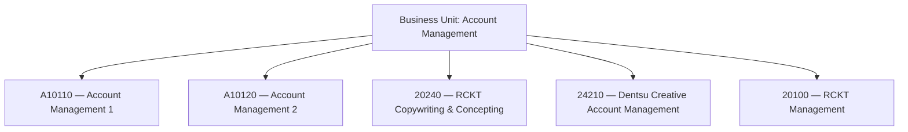

**Key idea:** One BU name can cover many cost centers, even if they sit under different BPC Rollups.

---

## 4. Where does Business Unit come from?

UMS provides a field on the cost center enhancements table:

**`CostCenterBusinessUnit`**

| Cost Center | CostCenterBusinessUnit |
| --- | --- |
| A10110 | Account Management |
| A10120 | Account Management |
| A10100 | Commercial |

This field answers:

> *Which Business Unit does this cost center belong to?*

**This is the field Sakura uses** for Business Unit functionality.

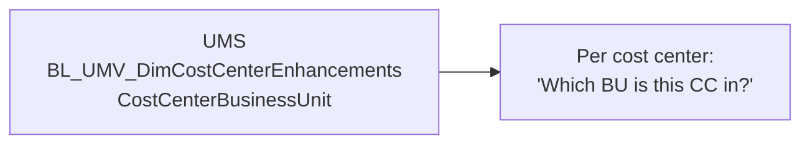

---

## 5. Sakura V1

Sakura V1 copies the UMS value into one column on the cost center table:

**`dbo.CostCenter.CostCenterGroupKey`**

| CostCenterCode | CostCenterGroupKey |
| --- | --- |
| A10110 | Account Management |
| A10120 | Account Management |

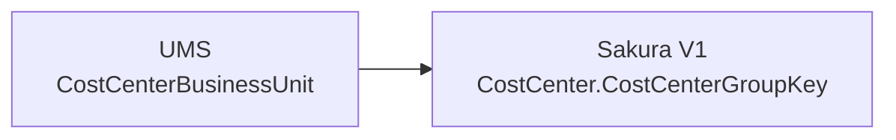

The **values are the same**. Only the **column name** changes in Sakura.

---

## 6. Sakura V2

V2 stores distinct Business Unit names in a **separate reference table** instead of repeating the value on every cost center row.

**`ref.BusinessUnits`** (exposed as `refv.BusinessUnits`)

| BusinessUnitCode |
| --- |
| Account Management |
| Commercial |
| Technology |
| PMO |
| Executive |

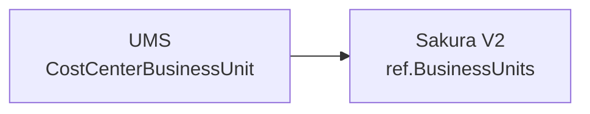

The **concept is unchanged**. Only the **database design** changes.

---

## 7. How the Business Unit picker works

The portal lets users choose one of **three** cost center access levels:

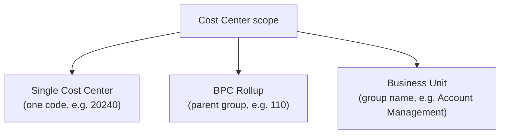

Example picker (Business Unit branch):

| Business Unit (picker value) |
| --- |
| Account Management |
| Technology |
| Commercial |
| Executive |

These values come from:

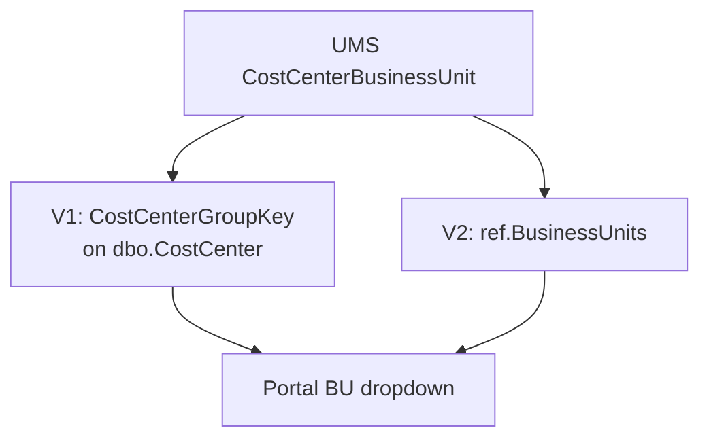

**V1 org-level rule:** At **Global / Region / Cluster**, the picker shows **BPC Rollup only** — not Single Cost Center or Business Unit. At **Market / Entity**, all three levels can appear (when data is populated).

---

## 8. Example — Account Management

These sample rows show how one BU spans multiple BPC Rollups:

| CostCenterCode | Description | BPC Rollup (parent) | Business Unit |
| --- | --- | --- | --- |
| 20100 | RCKT Management | 270 — Indirect Practice Area Costs | Account Management |
| 20240 | RCKT Copywriting & Concepting | 110 — Service Delivery | Account Management |
| 24210 | Dentsu Creative Account Management | 110 — Service Delivery | Account Management |
| A10110 | Account Management 1 | 120 — Revenue Activity - Client Management | Account Management |
| A10120 | Account Management 2 | 120 — Revenue Activity - Client Management | Account Management |

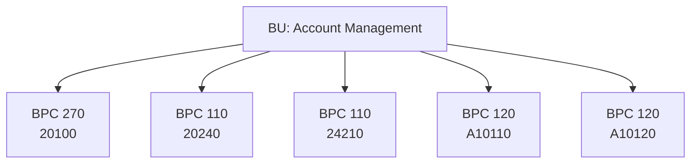

| Count | What you see |
| --- | --- |
| 5 | Single cost centers |
| 3 | Different BPC Rollups (110, 120, 270) |
| 1 | Business Unit (Account Management) |

A Business Unit can be **broader** than any single BPC Rollup.

> **Validated data note:** In the repo's UMS extract (`Excel/DIM_COSTCENTERENHANCEMENTS.csv`), only `A10110` and `A10120` currently have `CostCenterBusinessUnit = Account Management`. The other codes may still show `Account Management` in V1 production from a wider enrichment path. Always validate against your environment.

---

## 9. Three independent access levels

Each level uses a **different field** and grants a **different scope**.

| Level | Field used | User selects | Access granted |
| --- | --- | --- | --- |
| Single Cost Center | `CostCenterKey` | `20240` | `20240` only |
| BPC Rollup | `CostCenterParentKey` | `110` (Service Delivery) | All CCs under parent 110 (e.g. 20240, 24210) |
| Business Unit | `CostCenterGroupKey` | `Account Management` | All CCs with that BU (20100, 20240, 24210, A10110, A10120, …) |

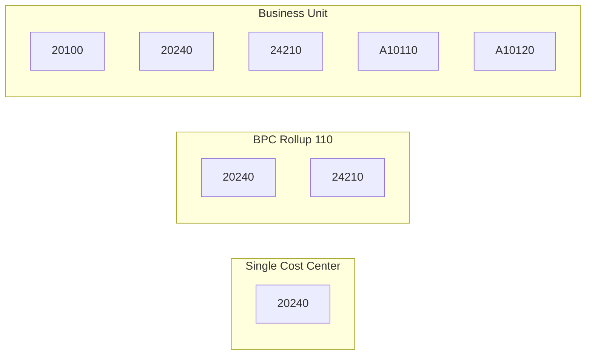

---

## 10. What gets stored in the request?

If the user selects **Business Unit → Account Management**, the request does **not** list every underlying cost center.

It stores only:

| Field | Value |
| --- | --- |
| `CostCenterLevel` | `Business Unit` |
| `CostCenterCode` | `Account Management` |

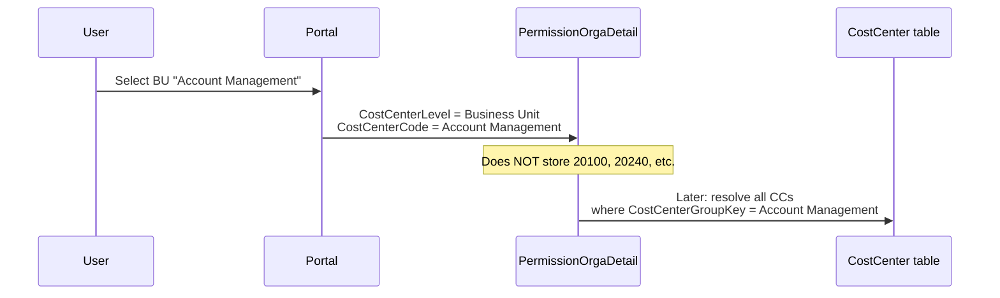

Sakura resolves membership **later** by matching `CostCenterGroupKey` (V1) or the BU reference (V2).

---

## 11. CostCenterBusinessUnit vs CostCenterGroup vs CostCenterPractice

This is the most common source of confusion. Similar names — **different meanings**.

### Comparison at a glance

| Field | What it is | Sakura uses for BU? | Example |
| --- | --- | --- | --- |
| **CostCenterBusinessUnit** | BU **assignment** on each cost center row | **Yes** | A10110 → Account Management |
| **CostCenterGroup** | UMS **master catalogue** of group names (separate concept) | **No** | HR, Finance, Legal (list of possible groups) |
| **CostCenterPractice** | Another UMS **hierarchy** on the same table | **No** | A10100 → Practice = Account Management |

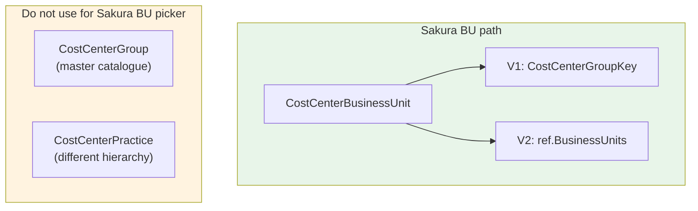

### CostCenterBusinessUnit — the one Sakura uses

| Cost Center | CostCenterBusinessUnit |
| --- | --- |
| A10110 | Account Management |
| A10120 | Account Management |

Represents: *this cost center's Business Unit assignment.*

### CostCenterGroup — catalogue, not the assignment

Think of it as a **catalogue of possible organisational groups**:

| Example values in master list |
| --- |
| HR |
| Finance |
| Legal |
| Technology |
| Commercial |

Sakura **does not** read this field for BU permissions. Do not assume it matches `CostCenterBusinessUnit` — in validated repo data, only **9 of 21** master-list names match exactly.

### CostCenterPractice — different hierarchy

| CostCenterCode | CostCenterBusinessUnit | CostCenterPractice |
| --- | --- | --- |
| A10100 | Commercial | Account Management |
| A10110 | Account Management | *(empty)* |

Same cost center area — **two different fields**, two different answers. Sakura ignores Practice for the BU picker.

---

## 12. A simple mental model — library analogy

### Catalogue (all possible categories)

```
Science | Math | History | Technology
```

≈ **`CostCenterGroup`** — lists what groups *exist*.

### Book record (one item's category)

```
Book → Category = Technology
```

≈ **`CostCenterBusinessUnit`** — tags *this* cost center.

### Sakura end-to-end

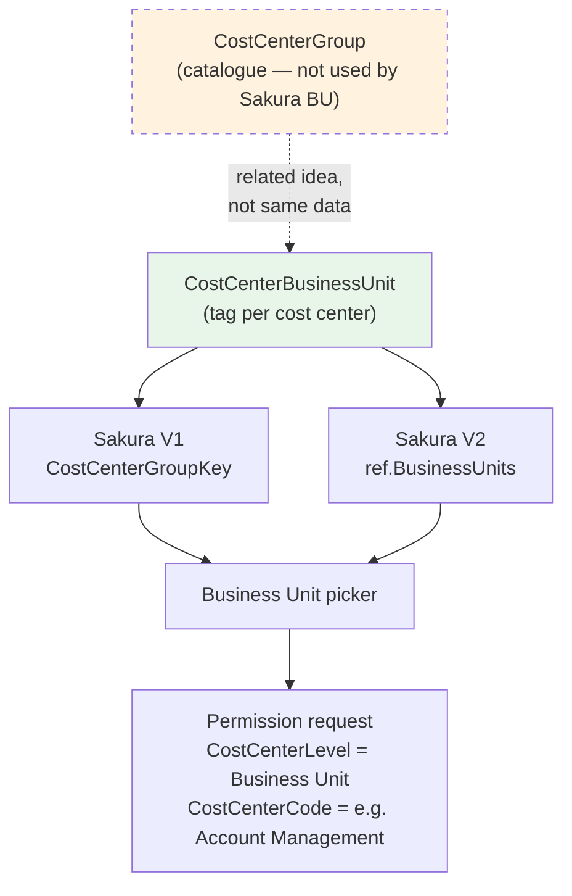

---

## 13. V1 vs V2 — quick reference

| Topic | Sakura V1 | Sakura V2 |
| --- | --- | --- |
| UMS source column | `CostCenterBusinessUnit` | `CostCenterBusinessUnit` |
| Where BU is stored | `CostCenter.CostCenterGroupKey` (on each CC row) | `ref.BusinessUnits` (separate table) |
| BU dropdown | `CostCenterBusinessUnit` view, `fnGetCostCenterListWithContextFilter` | `refv.BusinessUnits`, API |
| Request storage | `CostCenterLevel` + `CostCenterCode` | Same |
| BU request example | Level = `Business Unit`, Code = `Account Management` | Same |

---

## 14. Key takeaways

| # | Takeaway |
| --- | --- |
| 1 | A **Business Unit** groups many cost centers; it is not a cost center code. |
| 2 | UMS provides BU via **`CostCenterBusinessUnit`**. |
| 3 | V1 stores it as **`CostCenterGroupKey`**; V2 stores distinct values in **`ref.BusinessUnits`**. |
| 4 | Requests store **`CostCenterLevel`** + **`CostCenterCode`**, not every underlying CC. |
| 5 | **`CostCenterBusinessUnit`**, **`CostCenterGroup`**, and **`CostCenterPractice`** are different — do not swap them. |
| 6 | For Sakura BU behaviour, always follow: **`CostCenterBusinessUnit` → `CostCenterGroupKey` (V1) / `ref.BusinessUnits` (V2)**. |

### The three concepts — one line each

1. **`CostCenterBusinessUnit`** — the **tag** on each cost center (Sakura uses this).
2. **`CostCenterGroupKey` / `ref.BusinessUnits`** — **where Sakura stores** that tag.
3. **`CostCenterGroup`** — UMS **catalogue**; related in meaning, **not the same data** unless your query proves it.

---

## 15. See also

| Document | Use when |
| --- | --- |
| [COST_CENTER_BUSINESS_UNIT_REFERENCE.md](./COST_CENTER_BUSINESS_UNIT_REFERENCE.md) | Validated data, SQL queries, pipeline paths |
| [CostCenterGroupKey_Simple_Explanation.txt](./CostCenterGroupKey_Simple_Explanation.txt) | Short V1 summary |
| [SYSTEMS_AND_UMS_CONNECTIVITY.md](./SYSTEMS_AND_UMS_CONNECTIVITY.md) | Full UMS → Sakura connectivity |
| `Excel/DIM_COSTCENTERENHANCEMENTS.csv` | Sample UMS enhancements data in this repo |
