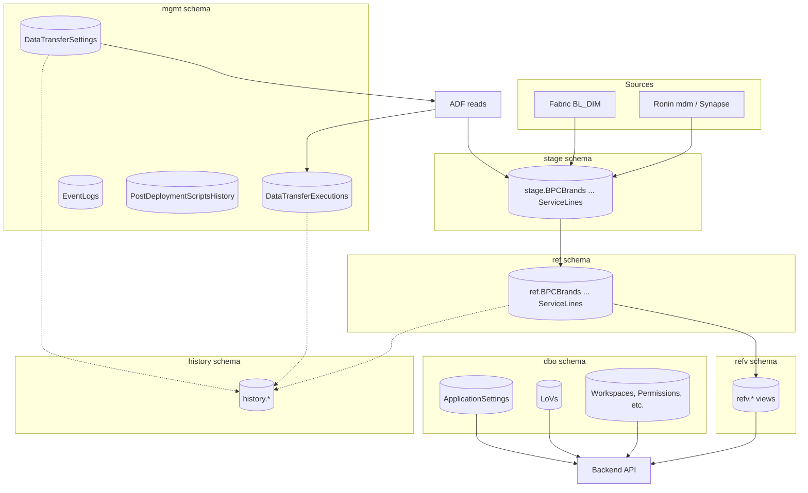
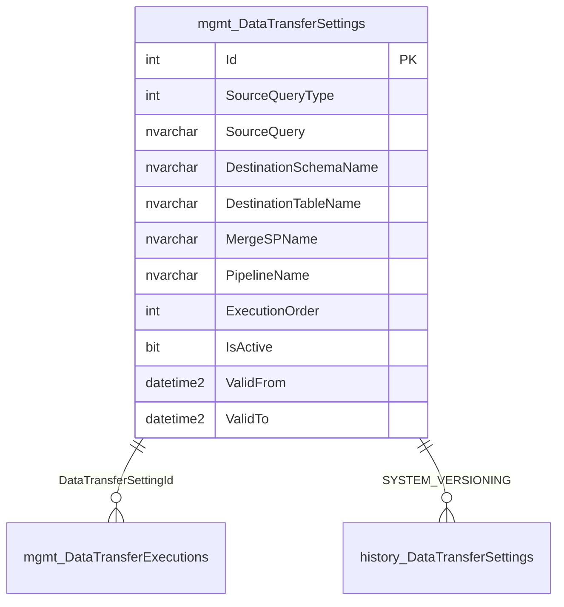
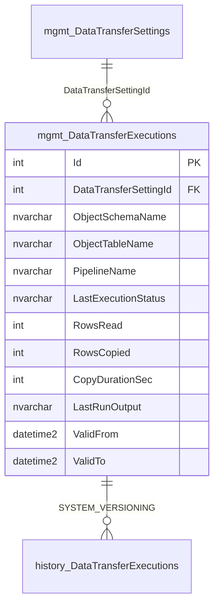
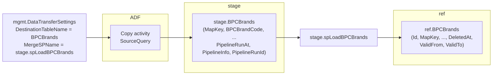
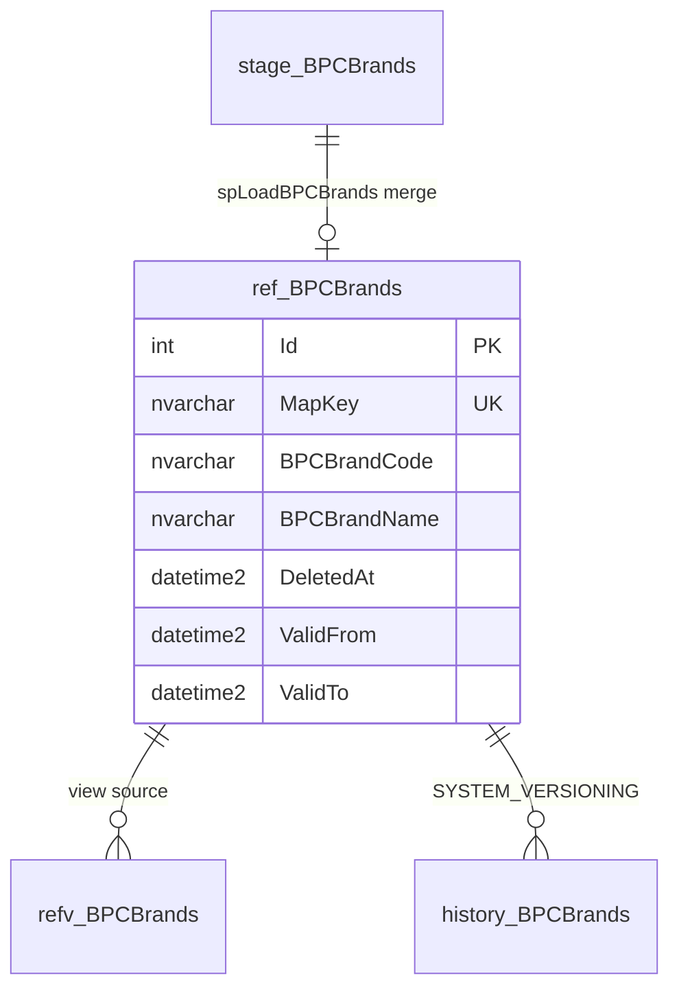
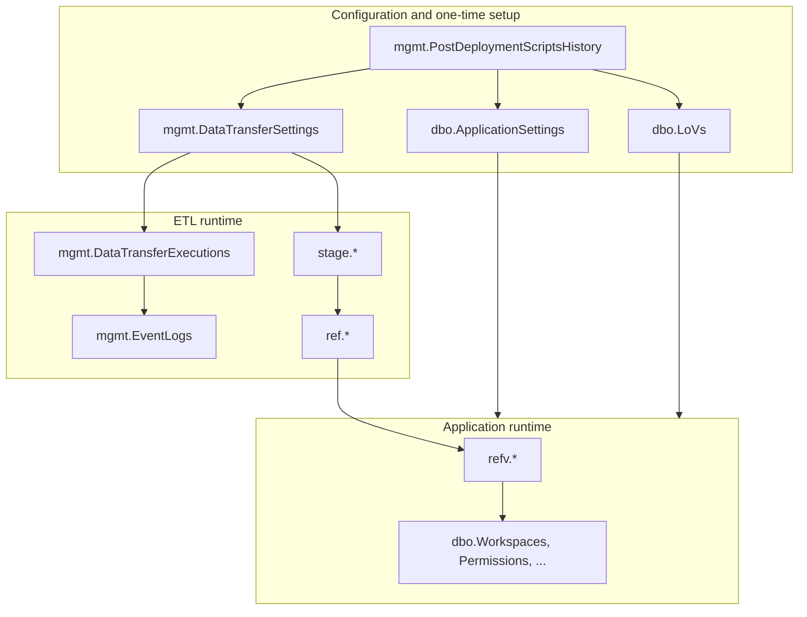

# Sakura_DB — Tables and Columns Reference
This document describes **every major table and column** in Sakura_DB: why each is required, how it helps, its relationships, and the crucial role it plays in the system.
---
## 1. Schema Overview and Table Relationships

---
## 2. mgmt Schema — ETL Control Plane
### 2.1 mgmt.DataTransferSettings
**Why it is required:** ADF has no hard-coded list of transfers. It must read from the database to know which source queries to run, which stage tables to fill, and which merge stored procedures to execute. This table is the **single source of truth** for ETL configuration.
**How it helps:** One row per transfer. ADF Lookup filters by `PipelineName` (e.g. `P_REF_CENTRAL_IMPORT`). Each row drives: Copy (SourceQuery → stage table), Merge (MergeSPName), and logging.
**Relationships:**
| Column | Purpose | Relationship / Crucial role |
|--------|---------|-----------------------------|
| **Id** | Primary key, identity | Referenced by `mgmt.DataTransferExecutions.DataTransferSettingId`. Uniquely identifies a transfer. |
| **SourceQueryType** | Type of source (e.g. 1 = query text) | Tells ADF how to interpret SourceQuery. |
| **SourceQuery** | Full SQL run against Fabric or Ronin | Defines exactly what data is copied into the stage table. Must return columns that match the stage table. |
| **DestinationSchemaName** | Always `stage` | Target schema for the Copy activity. |
| **DestinationTableName** | e.g. `BPCBrands`, `Employees` | Target stage table. Must match an existing stage table and merge SP. |
| **MergeSPName** | e.g. `stage.spLoadBPCBrands` | Stored procedure executed after copy to merge stage → ref. |
| **PipelineName** | `P_REF_CENTRAL_IMPORT` or `P_REF_RONIN_IMPORT` | **Must exactly match** ADF pipeline name so the Lookup returns the correct rows. |
| **ExecutionOrder** | Integer (1, 2, …) | Order in which transfers run within a pipeline. |
| **IsActive** | 1 = run, 0 = skip | Allows disabling a transfer without deleting the row. |
| **CreatedAt, CreatedBy, UpdatedAt, UpdatedBy** | Audit | Who created/updated the configuration. |
| **ValidFrom, ValidTo** | System-versioned period | Populated by SQL Server; history of changes stored in `history.DataTransferSettings`. |
**Crucial role:** Without this table (or with wrong `PipelineName`), ADF returns no rows and no ETL runs. Post-deployment seeds it once; later changes use update scripts.

---
### 2.2 mgmt.DataTransferExecutions
**Why it is required:** The pipeline needs to record the outcome of each transfer (success/failure, rows read/copied, duration, errors). This table holds the **latest** execution per transfer; history is in `history.DataTransferExecutions`.
**How it helps:** ADF calls `mgmt.spSetDataTransferExecution` with a JSON payload after each copy/merge. The procedure MERGEs into this table (one row per transfer, updated on every run). Ops and monitoring can query it to see last run status.
**Relationships:**
| Column | Purpose | Relationship / Crucial role |
|--------|---------|-----------------------------|
| **Id** | Primary key | Identifies the execution row. |
| **DataTransferSettingId** | FK to DataTransferSettings.Id | Links this execution to the transfer definition. |
| **ObjectSchemaName, ObjectTableName** | Echo of destination schema/table | Redundant but useful for reporting without joining. |
| **PipelineName** | Echo of pipeline | Same as in DataTransferSettings. |
| **LastPipelineRunId** | ADF run ID | Correlate with ADF monitoring. |
| **LastRunBeginTimestamp, LastRunEndTimestamp** | When the transfer ran | For scheduling and duration analysis. |
| **LastExecutionStatus** | e.g. Success, Failed | Quick filter for failures. |
| **LastExecutionMessage** | Error or info text | Human-readable reason for failure. |
| **RowsRead, RowsCopied** | Counts from ADF | Data volume and validation. |
| **CopyDurationSec, TransferDurationSec, etc.** | Performance metrics | Tuning and alerting. |
| **NumberOfErrors** | Error count | Alert when > 0. |
| **LastRunOutput** | Full JSON from ADF | Detailed troubleshooting. |
| **ValidFrom, ValidTo** | System-versioned | History in `history.DataTransferExecutions`. |
**Crucial role:** Enables visibility into ETL health. If `spSetDataTransferExecution` is not called (e.g. missing permissions), this table is not updated and the pipeline appears to have no history.

---
### 2.3 mgmt.EventLogs
**Why it is required:** Provides an append-only audit trail of events (e.g. DataTransferSuccess, DataTransferError) without querying execution tables. Useful for dashboards and alerting.
**How it helps:** `mgmt.AddToEventLog` is called by `spSetDataTransferExecution` to write one row per transfer completion. TableName, RecordId, EventName, EventDescription, EventTriggeredBy, EventTriggeredAt give a full picture.
**Relationships:**
| Column | Purpose | Relationship / Crucial role |
|--------|---------|-----------------------------|
| **Id** | Identity, primary key | Unique log entry. |
| **TableName** | e.g. DataTransferExecutions | Which logical entity the event refers to. |
| **RecordId** | e.g. DataTransferExecutions.Id | Links to the record. |
| **EventName** | DataTransferSuccess, DataTransferError | Type of event. |
| **EventDescription** | Free text | Details for humans. |
| **EventTriggeredAt** | When it happened | Time ordering. |
| **EventTriggeredBy** | Who/what triggered | Often the ADF pipeline or service. |
**Crucial role:** Lightweight event stream for ETL; no direct FK to other tables—consumed by monitoring and reporting.
---
### 2.4 mgmt.PostDeploymentScriptsHistory
**Why it is required:** Post-deployment runs on **every** deploy. Some scripts must run **only once per database** (e.g. seed DataTransferSettings, grant ADF rights). This table records which scripts have already run so they are skipped on subsequent deploys.
**How it helps:** Each one-time script is wrapped in `IF NOT EXISTS (SELECT * FROM mgmt.PostDeploymentScriptsHistory WHERE ScriptName = '...' AND DatabaseName = DB_NAME())`. If no row exists, the script runs and then a row is inserted; next deploy the row exists and the script is skipped.
**Relationships:**
| Column | Purpose | Relationship / Crucial role |
|--------|---------|-----------------------------|
| **ScriptName** | e.g. `.\Data\mgmt_DataTransferSettings_Default.sql` | Unique identifier for the script (with DatabaseName). |
| **DatabaseName** | DB_NAME() at run time | Same DACPAC can be deployed to Dev, UAT, Prod; each database has its own history. |
| **ExecutionTime** | When the script ran | Audit. |
**Crucial role:** Prevents re-running one-time logic (e.g. DELETE + INSERT of DataTransferSettings) on every deploy, which would wipe or duplicate configuration.
---
### 2.5 mgmt.PreDeploymentScriptsHistory
**Why it is required:** Same idea as PostDeploymentScriptsHistory but for **pre-deployment** scripts. Tracks which pre-deploy scripts have run so they run only once per database.
**Relationships:** Same structure as PostDeploymentScriptsHistory (ScriptName, DatabaseName, ExecutionTime). Used by `Sakura.PreDeployment.sql` if one-time pre-deploy steps exist.
---
### 2.6 mgmt Stored Procedures (spSetDataTransferExecution, AddToEventLog)
**mgmt.spSetDataTransferExecution**
**Why it is required:** ADF cannot write directly to DataTransferExecutions with complex logic. The pipeline passes a **JSON payload** (run id, status, rows read/copied, duration, errors, etc.) and **DataTransferSettingId**. The procedure parses the JSON and MERGEs into `mgmt.DataTransferExecutions`, and calls `AddToEventLog` to write an event (DataTransferSuccess or DataTransferError).
**Crucial role:** ADF must have EXECUTE on this procedure (granted by post-deploy Grant_Rights_To_Managed_User_Of_ADF.sql). Without it, ETL runs but execution history and event log are not updated.
**mgmt.AddToEventLog**
**Why it is required:** Single point to insert into `mgmt.EventLogs` with consistent columns (TableName, RecordId, EventName, EventDescription, EventTriggeredBy, EventTriggeredAt).
**Crucial role:** Called by spSetDataTransferExecution; provides the audit trail for ETL events.
---
## 3. stage Schema — Staging for ETL
Stage tables follow a **common pattern**. Example: `stage.BPCBrands`. There are **16** tables in the default ETL configuration (8 Central: BPCBrands, BPCSegments, CostCenters, Employees, Entities, MasterServiceSets, ProfitCenters, ServiceLines; 8 Ronin: BusinessUnits, Regions, ClientPrograms, Markets, Clusters, Countries, DentsuStakeholders, PeopleAggregators). The project also defines `stage.Clients` and `ref.Clients` for future or alternate use.
**Why they are required:** ADF Copy activity writes to a table; it does not call a stored procedure to insert directly into ref. Stage is the landing zone. The merge SP then reads from stage and merges into ref (insert new, update changed, resurrect soft-deleted, soft-delete missing).
**How they help:** Decouples "copy from source" from "merge into ref". Same stage structure for all 16 entities; columns = business keys/attributes + pipeline metadata.
**Common columns across stage tables:**
| Column | Purpose | Relationship / Crucial role |
|--------|---------|-----------------------------|
| **MapKey** (or entity-specific key) | Business key from source | Used by merge SP to match stage row to ref row (e.g. ref.BPCBrands.MapKey). Often primary key. |
| **Business columns** | e.g. BPCBrandCode, BPCBrandName, BPCBrandParentMapKey | Mirror ref table; data comes from SourceQuery. |
| **PipelineRunAt** | When the copy ran | Audit; which pipeline run produced this snapshot. |
| **PipelineInfo** | Pipeline metadata | Debugging. |
| **PipelineRunId** | ADF run identifier | Traceability. |
**Relationships:** Each stage table is the **destination** of one row in `mgmt.DataTransferSettings` (DestinationSchemaName = 'stage', DestinationTableName = table name). The same table is the **source** for the corresponding `stage.spLoad*` procedure, which writes to `ref.*`.

**Crucial role:** Without stage tables, ADF would need to write directly to ref (harder to manage, no clear "current snapshot" from source). Stage + merge SP gives a clean, testable pattern.
---
## 4. ref Schema — Canonical Reference Data
Ref tables (e.g. `ref.BPCBrands`, `ref.Employees`) hold the **canonical** reference data. They are populated by `stage.spLoad*` procedures, not by the application.
**Why they are required:** Backend and Share views need a single, versioned, soft-delete-aware store for brands, employees, regions, cost centers, etc. Stage is transient; ref is persistent.
**Common columns across ref tables:**
| Column | Purpose | Relationship / Crucial role |
|--------|---------|-----------------------------|
| **Id** | Identity, primary key | Surrogate key for joins; stable across ETL updates. |
| **MapKey** | Business key (unique) | Matches source and stage; merge SP matches on MapKey. |
| **Entity-specific columns** | e.g. BPCBrandCode, BPCBrandName | Business attributes from source. |
| **DeletedAt** | NULL = active, set = soft-deleted | Merge SP sets DeletedAt when a row disappears from stage; clears it when row reappears (resurrect). |
| **CreatedAt, UpdatedAt** | When row was created/updated | Audit. |
| **PipelineStatus, PipelineInfo, PipelineRunId** | Last ETL run that touched the row | Traceability. |
| **ValidFrom, ValidTo** | System-versioned period | History in `history.`. |
**Relationships:** ref tables are the **target** of stage.spLoad* and the **source** of refv views. dbo permission/detail tables store **keys** (e.g. EntityKey, SLKey) that reference ref/refv (e.g. ref.Entities, ref.ServiceLines). Backend and Share views join dbo + ref/refv.

**Crucial role:** ref is the single source of truth for reference data consumed by the Backend API (dropdowns, security models, permissions). If ref is empty (ETL not run), the app cannot function correctly.
---
## 5. refv Schema — Views Over ref
Views such as `refv.BPCBrands` expose ref data with:
- **Filtering:** e.g. `dbo.fnsMarkIfDeleted(BPCBrandName, DeletedAt)` to show "[Deleted]" for soft-deleted rows.
- **IsCurrent:** e.g. `dbo.fnsIsCurrent(DeletedAt)` to indicate active rows.
**Why they are required:** Backend prefers to query refv instead of ref so that display logic (deleted marking, IsCurrent) is consistent and centralised.
**Relationships:** Each refv view selects from one ref table (and possibly helper functions). No FKs; logical layer only.
**Crucial role:** Keeps ref tables clean; presentation logic in one place.
---
## 6. dbo Schema — Application Data
### 6.1 dbo.ApplicationSettings
**Why it is required:** Backend needs configuration (BaseUrl, EnvironmentTag, email settings, etc.) that can vary by environment (Dev/UAT/Prod). Storing it in the database allows the same build to be deployed everywhere; values are set by post-deployment using SqlCmd variables.
**Key columns:**
| Column | Purpose | Relationship / Crucial role |
|--------|---------|-----------------------------|
| **Id** | Primary key | Surrogate key. |
| **SettingKey** | e.g. BaseUrl, EnvironmentTag, EmailingMode | Unique; used by Backend to look up value. |
| **SettingValue** | String value | Consumed by app (e.g. fnAppSettingValue). |
| **SettingDataType** | e.g. System.String | Type hint for parsing. |
| **LastChangeDate, LastChangedBy** | Audit | Who changed the setting. |
| **ValidFrom, ValidTo** | System-versioned | History in history.ApplicationSettings. |
**Relationships:** No FKs. Post-deployment script `ApplicationSettings_Default.sql` MERGEs default/overrides (using AppBaseURL, AppEnvironment). Backend reads via API or functions.
**Crucial role:** Without correct ApplicationSettings, BaseUrl and email behaviour can be wrong for the environment.
---
### 6.2 dbo.LoVs
**Why it is required:** List-of-Value metadata (SecurityType, Domain, ApplicationSetting_EmailingMode, etc.) drives dropdowns, security model types, and RLS/OLS domain configuration. Must be consistent across environments.
**Key columns:**
| Column | Purpose | Relationship / Crucial role |
|--------|---------|-----------------------------|
| **Id** | Primary key | Surrogate key. |
| **LoVType** | e.g. SecurityType, Domain | Groups values (with LoVValue forms unique key). |
| **LoVValue** | e.g. FUM, GI, EMEA | Stored value used in app and Share views. |
| **LoVName** | Display name | Shown in UI. |
| **LoVDescription** | Description | Optional help text. |
| **ParentLoVType, ParentLoVValue** | Hierarchy | e.g. SecurityType FUM under Domain DFI. |
| **SystemDataTypeName** | Type hint | e.g. System.String. |
| **CreatedAt, CreatedBy, UpdatedAt, UpdatedBy** | Audit | Who created/updated. |
| **ValidFrom, ValidTo** | System-versioned | History. |
**Relationships:** Post-deployment LoV_* scripts MERGE seed data. Backend and Share views filter/join on LoVType and LoVValue. No FKs from LoVs to other tables; other tables store LoV values as strings.
**Crucial role:** Share*.RLS and security model logic depend on SecurityType and Domain LoVs. Missing or wrong LoVs break domain-specific views and configuration.
---
### 6.3 dbo — Workspaces, Permissions, and Related Tables
Tables such as **Workspaces**, **WorkspaceApps**, **WorkspaceReports**, **WorkspaceSecurityModels**, **PermissionRequests**, **PermissionHeaders**, **RLSPermissions**, **RLSPermission*Details**, **RLS*Approvers**, **OLSPermissions**, **Emails**, **EmailTemplates** hold application state. They reference ref/refv via **keys** (e.g. EntityKey, SLKey, ClientKey) stored in detail tables. Backend reads/writes these; Share views join them with ref/refv and LoVs for RLS/OLS views.
**Crucial role:** Core Sakura business data; without them the app has no workspaces, permissions, or emails.
---
### 6.4 dbo Helper Functions and Stored Procedures
| Object | Purpose | Crucial role |
|--------|---------|--------------|
| **dbo.fnAppSettingValue** | Returns the value for a given SettingKey from ApplicationSettings. | Backend and jobs read config (e.g. BaseUrl, EmailingMode) through this instead of querying the table directly. |
| **dbo.fnFindAppEmailQueue** | Finds the appropriate email queue for the app. | Used by email-sending logic to route emails. |
| **dbo.MarkEmailAsSent** | Marks an email record as sent. | Email job updates state after sending. |
| **dbo.MarkEmailAsUnsent** | Marks an email record as unsent (e.g. for retry). | Email job or admin action. |
---
## 7. history Schema — Temporal History
For every system-versioned table in mgmt and ref (and some in dbo), SQL Server maintains a **history** table (e.g. `history.DataTransferSettings`, `history.BPCBrands`). Rows are inserted/updated automatically when the main table is updated; **ValidFrom** and **ValidTo** define the period.
**Why it is required:** Auditing and reporting: see how configuration or reference data looked at any point in time.
**Relationships:** Each history table has the same columns as the main table (without period columns being generated). Linked only by SQL Server’s SYSTEM_VERSIONING; no explicit FK.
**Crucial role:** Compliance and troubleshooting; not used by ADF or app at runtime.
---
## 8. Share, romv, and auto Schemas
### 8.1 Share Schemas (ShareAMER, ShareEMEA, ShareFUM, ShareGI, ShareCDI, ShareWFI, ShareEDP)
**Why they are required:** External consumers (e.g. Fabric, BI tools) need domain-specific views over RLS and OLS permission data. Each **Share*** schema contains:
- **Share*.RLS** — Row-level security view: joins dbo.RLSPermission*Details, PermissionHeaders, PermissionRequests, LoVs (SecurityType). Exposes hierarchy keys and approval info for that domain.
- **Share*.RLSSample** — Sample/template data for the same domain.
- **Share*.OLS** — Object-level security view: joins dbo.OLSPermissions and ref/refv as needed.
**Relationships:** Views only; they read from dbo (permissions, LoVs) and ref/refv (via keys in detail tables). No FKs. **Crucial role:** Backend and external tools use these for reporting and data access per domain; they depend on LoVs (SecurityType, Domain) and ref being populated.
### 8.2 romv Schema (Read-Only Model Views)
**Why it is required:** Provides read-only views (e.g. **romv.PermissionRequests**, **romv.PermissionHeaders**) for reporting and integration without exposing writable tables.
**Relationships:** Views over dbo tables. **Crucial role:** Reporting and integrations query romv instead of dbo where appropriate.
### 8.3 auto Schema (Automation)
**Why it is required:** Holds objects used by automations (e.g. **auto.OLSGroupMemberships**).
**Relationships:** Depends on dbo/ref as needed. **Crucial role:** Central place for automation logic and views.
---
## 9. End-to-End Relationship Summary

---
## 10. Quick Reference — All ref/stage Entity Names
**Central (Fabric) — 8:** BPCBrands, BPCSegments, CostCenters, Employees, Entities, MasterServiceSets, ProfitCenters, ServiceLines.
**Ronin — 8:** BusinessUnits, Regions, ClientPrograms, Markets, Clusters, Countries, DentsuStakeholders, PeopleAggregators.
**Also in project (ref/stage):** Clients (table exists; add to DataTransferSettings if needed for ETL).
This document, together with **SAKURA_DB_EXPERT_REFERENCE.md** and **SAKURA_ETL_AND_SAKURA_DB_REFERENCE.md**, gives you a complete reference for every table and column and how they work together.
