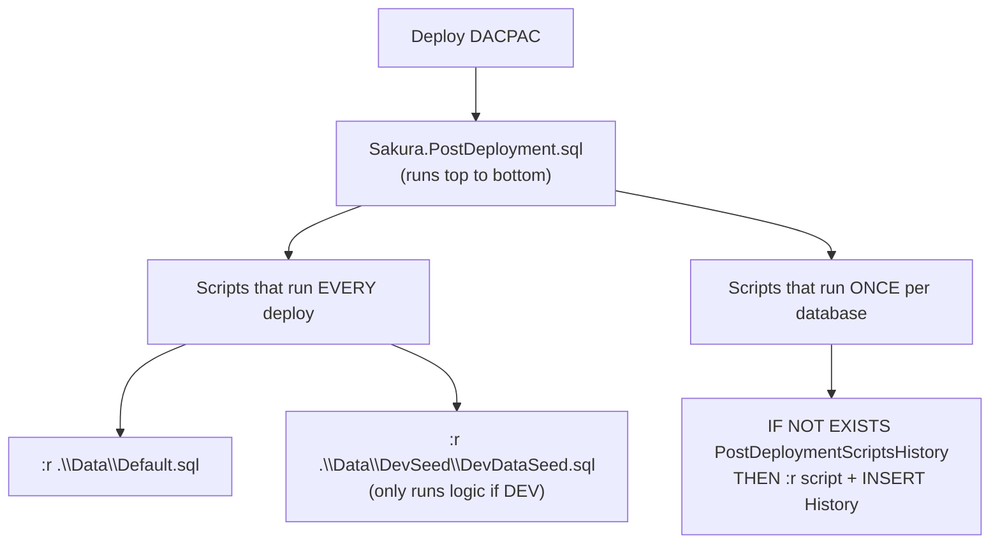
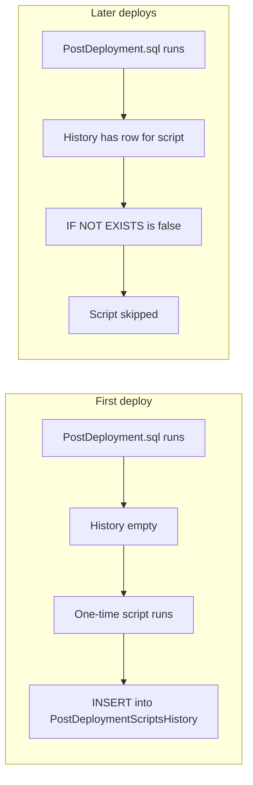
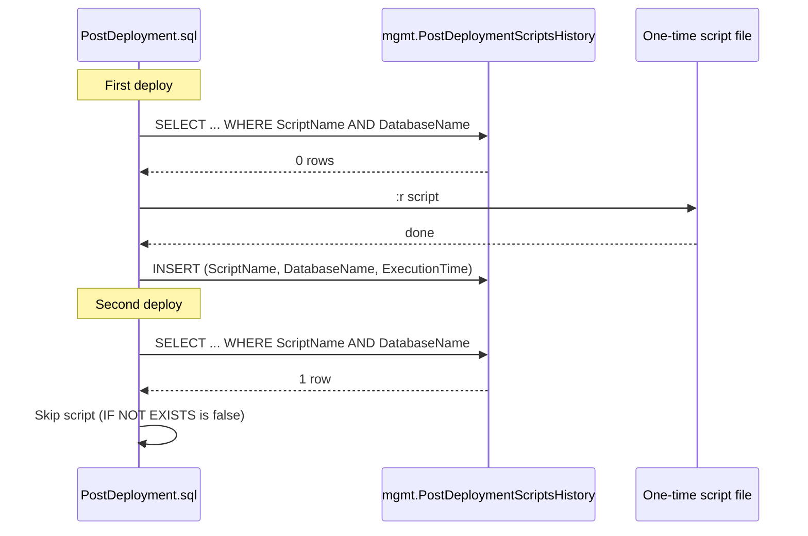
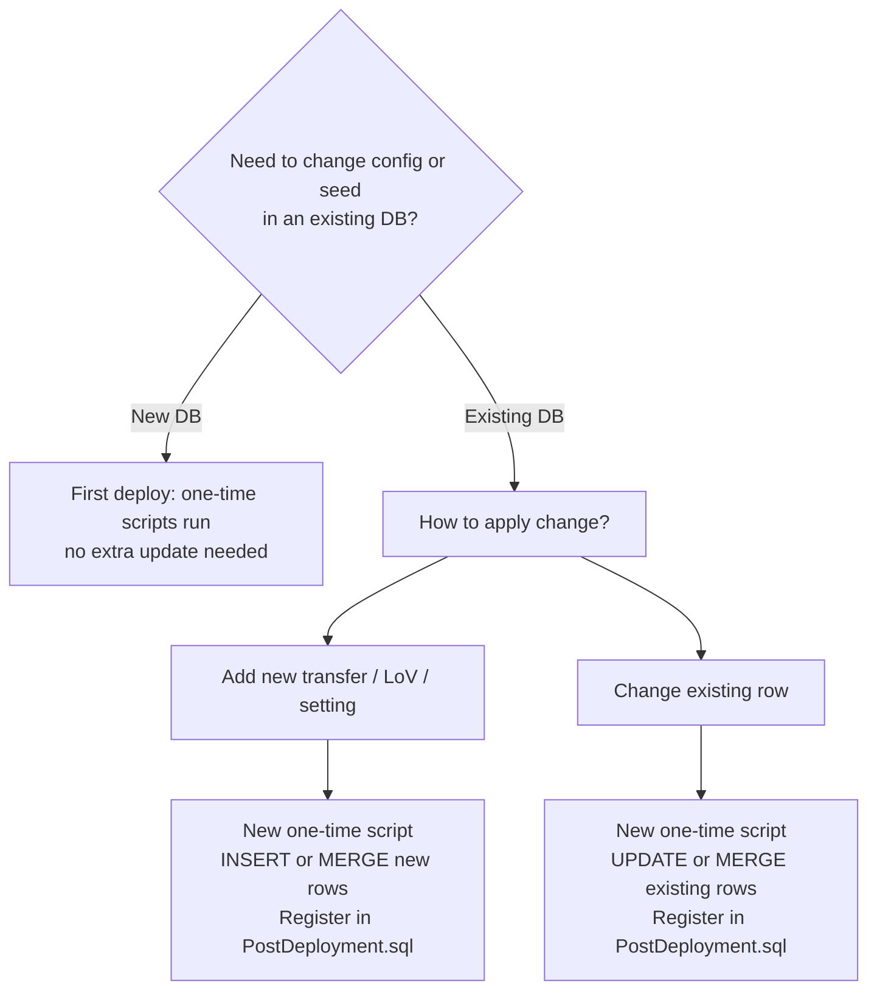
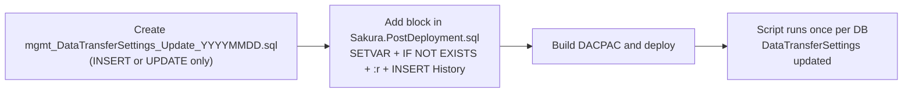
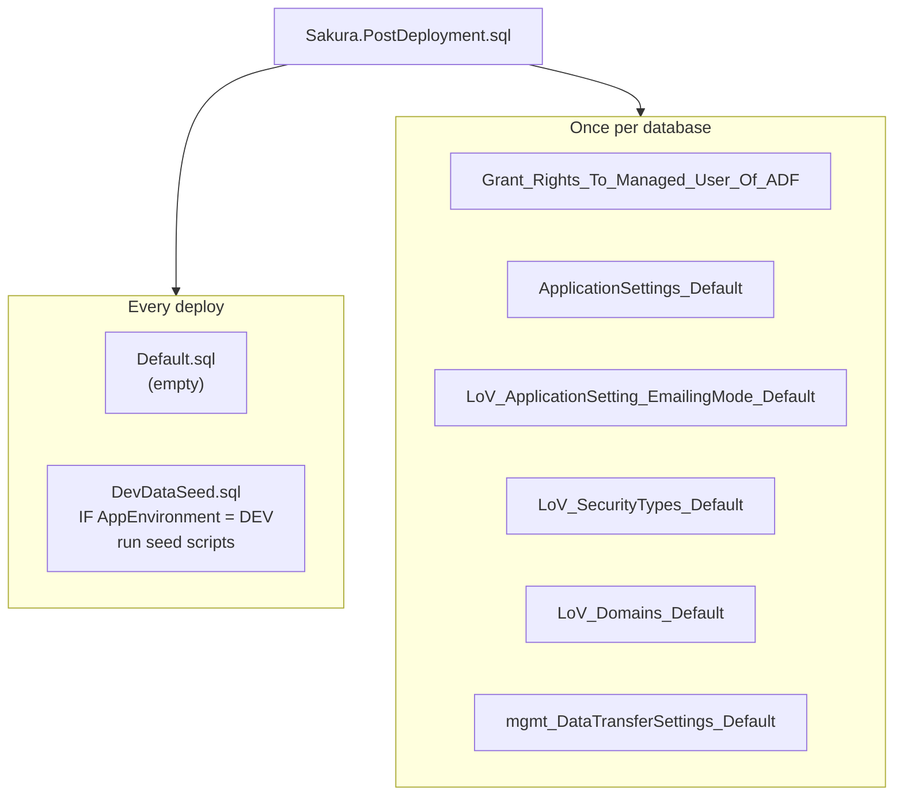

# Sakura_DB — Post-Deployment Script Mastery
This document gives **complete mastery** of post-deployment scripts: what data is added only once and why, how the history table knows if it is the first time, what data is added, when and why to update data in post-deployment, and how to do it. No ambiguity.
---
## 1. What Runs on Each Deploy?
Every time you deploy the Sakura database (DACPAC), the **single compiled post-deployment script** runs. That script is built from `Sakura.PostDeployment.sql`, which runs in a **fixed order** from top to bottom.
**Exact execution order (Sakura.PostDeployment.sql):**
1. **:r .\Data\Default.sql** — Runs every deploy (file is empty; placeholder).
2. **:r .\Data\DevSeed\DevDataSeed.sql** — Runs every deploy; inside it, only if `$(AppEnvironment) = 'DEV'` does it run WorkspaceSecurityModels, SecurityModelSecurityTypes, Employees seed.
3. **Grant_Rights_To_Managed_User_Of_ADF.sql** — One-time (guarded by PostDeploymentScriptsHistory).
4. **ApplicationSettings_Default.sql** — One-time.
5. **LoV_ApplicationSetting_EmailingMode_Default.sql** — One-time.
6. **LoV_SecurityTypes_Default.sql** — One-time.
7. **LoV_Domains_Default.sql** — One-time.
8. **mgmt_DataTransferSettings_Default.sql** — One-time.
Order matters: e.g. Grant_Rights before ETL runs; LoVs (Domains) before LoVs (SecurityTypes) if SecurityTypes reference Domain; DataTransferSettings last among the one-time seeds.

---
## 2. Which Data Is Added Only Once, and Why?
### 2.1 Data that is added only once (one-time scripts)
| Script | What it does | Why only once? |
|--------|----------------|----------------|
| **Grant_Rights_To_Managed_User_Of_ADF.sql** | Grants EXECUTE on `mgmt.spSetDataTransferExecution`, ALTER and EXECUTE on schema `stage` to the ADF managed identity (DEV/UAT/PROD). | Running again would just re-apply the same grants (idempotent). Guarding keeps all one-time setup in the same pattern and avoids unnecessary re-execution. |
| **ApplicationSettings_Default.sql** | MERGEs default application settings (BaseUrl, EnvironmentTag, email settings, etc.) using SqlCmd variables **AppBaseURL** and **AppEnvironment**. | First deploy: table is empty, so MERGE inserts all rows. **If we ran it every time**, we would overwrite any admin changes to settings (e.g. AdminEmail, EmailingMode) with the default values from the script. So we run once to **seed**; after that, humans or pipelines change settings in the DB. |
| **LoV_ApplicationSetting_EmailingMode_Default.sql** | MERGEs LoVs for type ApplicationSetting_EmailingMode (Skip, Send, Pause). | Same idea: seed once so the app has the list; later changes (new LoV values, renames) are done by separate update scripts or app. Running every time would revert any manual LoV changes. |
| **LoV_SecurityTypes_Default.sql** | MERGEs SecurityType LoVs (FUM, GI, CDI, WFI, EMEA-*, AMER-*). | Seed once; Share views and security models depend on these. Re-running would overwrite customisations. |
| **LoV_Domains_Default.sql** | MERGEs Domain LoVs (DFI, GI, CDI, WFI, EMEA, AMER). | Seed once; used across app and Share. |
| **mgmt_DataTransferSettings_Default.sql** | **DELETE**s all rows in `mgmt.DataTransferSettings`, then **INSERT**s the full set of 16 transfer definitions (8 Central, 8 Ronin). | **Critical.** This script wipes the table. If it ran on **every** deploy, every deployment to UAT or Prod would **erase** the current DataTransferSettings and replace them with the default set. Any custom SourceQuery, ExecutionOrder, or new transfer added via an update script would be lost. So it **must** run only once—on the very first deployment when the table is empty. |
**Why "only once" in one sentence:** One-time scripts **seed** configuration and reference data. Running them again would **overwrite** or **wipe** existing data (especially DataTransferSettings), so we run them once per database and then use **update** scripts for changes.

---
## 3. How Does PostDeploymentScriptsHistory Know It Is the First Time?
The history table does **not** "know" in advance whether it is the first deploy. It simply **records** that a script has been run. "First time" is inferred by **not** finding a row.
### 3.1 Mechanism
1. **Before any one-time script:** The post-deployment script runs:
```sql
IF NOT EXISTS (SELECT * FROM mgmt.PostDeploymentScriptsHistory
WHERE [ScriptName] = '$(ScriptName)' AND [DatabaseName] = DB_NAME())
BEGIN
-- run the script (:r $(ScriptName))
INSERT INTO mgmt.PostDeploymentScriptsHistory VALUES ('$(ScriptName)', DB_NAME(), SYSDATETIME());
END;
```
2. **First deploy:** `PostDeploymentScriptsHistory` is empty (or has no row for this ScriptName + DatabaseName). So `NOT EXISTS` is true → the script runs → then a row is inserted. So "first time" = **no row yet** for that script in that database.
3. **Second and later deploys:** The row is already there. `NOT EXISTS` is false → the script is **skipped**. So "not first time" = **row exists**.
So the history table does not "know from start" in a special way—it **is** the record of what has already run. "First time" means: no row for (ScriptName, DatabaseName).

### 3.2 Per-database
**DatabaseName** is `DB_NAME()` at run time. So:
- Same DACPAC deployed to **Dev**, **UAT**, and **Prod** (three different databases) → each database has its **own** history. The script runs **once per database** (once in Dev, once in UAT, once in Prod), not once globally.
- So "first time" is **per database**: first time **this** script runs in **this** database.
**Pre-deployment:** The same pattern exists for **pre-deployment** scripts. `mgmt.PreDeploymentScriptsHistory` tracks which pre-deploy scripts have run (ScriptName, DatabaseName, ExecutionTime). `Sakura.PreDeployment.sql` (if used) would check `IF NOT EXISTS (... PreDeploymentScriptsHistory ...)` before running one-time pre-deploy steps. First time = no row for that script in that database.
---
## 4. What Data Is Added by Each One-Time Script?
| Script | Table(s) affected | Data added |
|--------|-------------------|------------|
| **Grant_Rights_To_Managed_User_Of_ADF.sql** | No table; permissions on objects | Grants to ADF user (azeuw1dadfsakura / azeuw1tadfsakura / azeuw1padfsakura): EXECUTE on mgmt.spSetDataTransferExecution; ALTER and EXECUTE on schema stage. |
| **ApplicationSettings_Default.sql** | dbo.ApplicationSettings | Rows for BaseUrl, EnvironmentTag, SakuraEmailSubjectTag, EmailLandingZonePath, AdminEmail, DefaultEmailFrom, DefaultEmailFromName, EmailMaxRetrials, EmailRetryAfterMins, LogReadEventGracePeriodMins, SendAddedAsNewApproverEmails, CreatePermissionRevokedEmails, EmailingMode, ActiveEmailQueues. Values use SqlCmd vars **AppBaseURL** and **AppEnvironment**. |
| **LoV_ApplicationSetting_EmailingMode_Default.sql** | dbo.LoVs | LoVType = ApplicationSetting_EmailingMode: values 0 (Skip), 1 (Send), 2 (Pause). |
| **LoV_SecurityTypes_Default.sql** | dbo.LoVs | LoVType = SecurityType: FUM, GI, CDI, WFI, EMEA-ORGA, EMEA-CLIENT, EMEA-CC, EMEA-COUNTRY, EMEA-MSS, AMER-ORGA, AMER-CLIENT, AMER-CC, AMER-PC, AMER-PA, AMER-MSS (with ParentLoVType = Domain, ParentLoVValue = DFI/GI/CDI/WFI/EMEA/AMER). |
| **LoV_Domains_Default.sql** | dbo.LoVs | LoVType = Domain: DFI, GI, CDI, WFI, EMEA, AMER. |
| **mgmt_DataTransferSettings_Default.sql** | mgmt.DataTransferSettings | **DELETE** all rows, then **INSERT** 16 rows: 8 for P_REF_CENTRAL_IMPORT (BPCBrands, BPCSegments, CostCenters, Employees, Entities, MasterServiceSets, ProfitCenters, ServiceLines), 8 for P_REF_RONIN_IMPORT (BusinessUnits, Regions, ClientPrograms, Markets, Clusters, Countries, DentsuStakeholders, PeopleAggregators). Each row has SourceQuery, DestinationSchemaName, DestinationTableName, MergeSPName, PipelineName, ExecutionOrder, IsActive. |
---
## 5. When Do We Update Data in Post-Deployment Scripts?
You **update** (or add) data in post-deployment in these situations:
| Situation | When | Why |
|-----------|------|-----|
| **New environment or new database** | First deploy | One-time scripts run and seed everything. No "update" needed; the one-time scripts do the initial insert/MERGE. |
| **Change default application settings for new deploys** | When you change the default value in the script and want it to apply to **new** databases only | Edit ApplicationSettings_Default.sql and leave it one-time; existing DBs already have a history row so they won't re-run. For **existing** DBs you need an update script (below). |
| **Add or change a LoV** (e.g. new SecurityType) | When you add a new list value or change name/description | Don't change LoV_*_Default.sql for existing DBs (it won't run again). Add a **new** one-time script that MERGEs the new/changed LoV rows. |
| **Add or change an ETL transfer** (new source table, new pipeline, change SourceQuery) | When you add a new ref entity or change an existing transfer | **Do not** change mgmt_DataTransferSettings_Default.sql and expect it to run again (it won't). Add a **new** one-time script (e.g. mgmt_DataTransferSettings_Update_YYYYMMDD.sql) that **INSERT**s or **UPDATE**s only the rows you need. |
| **Change ADF grants** (e.g. new user, new permission) | When you add a new ADF identity or permission | Add a new one-time script that runs GRANTs (and guard with PostDeploymentScriptsHistory). Or, if you are okay with it running every time, put it in a script that is **not** guarded (e.g. a small script included without IF NOT EXISTS)—but then order and idempotency matter. Standard practice: new one-time script. |
**When to update:** When the **existing** database (UAT, Prod) must get **new or changed** configuration or seed data that was not in the original one-time script, or when the original script will not run again because it is already in history.

---
## 6. Why Would You Need to Update?
- **DataTransferSettings:** You add a new ref entity (new stage table + merge SP). ADF must see a new row in DataTransferSettings. Without an update script, that row never appears in an existing DB.
- **LoVs:** You introduce a new SecurityType or Domain. The app and Share views expect it. Without an update script, existing DBs never get the new row.
- **ApplicationSettings:** You introduce a new setting key (e.g. NewFeatureFlag) and want it in all environments. Existing DBs don't run ApplicationSettings_Default again, so you need a small one-time script that MERGEs that key.
- **Grants:** A new ADF identity or a new object to grant on. A one-time script ensures every DB gets the new grant once.
So: **you need to update** whenever the **codebase** has moved ahead (new transfer, new LoV, new setting) but the **database** was already deployed and the original seed script is already in history.
---
## 7. How to Do It — Step by Step
### 7.1 Add or change DataTransferSettings (existing DB)
**Do not** edit `mgmt_DataTransferSettings_Default.sql` to add a new transfer. That script is one-time and does DELETE + INSERT; existing DBs will not run it again.
1. **Create** a new script file, e.g. `Scripts\Post Deployment\Data\mgmt_DataTransferSettings_Update_20250210.sql`.
2. **Content:** Only the change you need. Examples:
- **New transfer:** `INSERT INTO mgmt.DataTransferSettings (SourceQueryType, SourceQuery, DestinationSchemaName, DestinationTableName, MergeSPName, PipelineName, ExecutionOrder, IsActive, CreatedAt, CreatedBy, UpdatedAt, UpdatedBy) VALUES (...);`
- **Change existing:** `UPDATE mgmt.DataTransferSettings SET SourceQuery = '...', UpdatedAt = GETUTCDATE(), UpdatedBy = '...' WHERE DestinationTableName = '...' AND PipelineName = '...';`
3. **Register** in `Sakura.PostDeployment.sql`:
- Add a block **after** the existing one-time scripts (order matters):
```sql
:SETVAR ScriptName ".\Data\mgmt_DataTransferSettings_Update_20250210.sql"
GO
IF NOT EXISTS (SELECT * FROM mgmt.PostDeploymentScriptsHistory WHERE [ScriptName] = '$(ScriptName)' AND [DatabaseName] = DB_NAME())
BEGIN
BEGIN TRY
PRINT '[Post-Deployment]: Executing $(ScriptName)';
:r $(ScriptName)
INSERT INTO mgmt.PostDeploymentScriptsHistory VALUES ('$(ScriptName)', DB_NAME(), SYSDATETIME());
END TRY
BEGIN CATCH
DECLARE @err NVARCHAR(MAX) = ERROR_MESSAGE();
RAISERROR('One time script $(ScriptName) failed %s', 16, 1, @err);
END CATCH;
END;
GO
```
4. Deploy. The new script runs **once** per database and is then skipped on future deploys.

### 7.2 Add or change LoVs (existing DB)
1. Create e.g. `Scripts\Post Deployment\Data\LoV_SecurityTypes_Update_20250210.sql`.
2. Content: MERGE into dbo.LoVs for the new or changed rows (same MERGE pattern as LoV_SecurityTypes_Default.sql, but only the rows you add/change).
3. Register in `Sakura.PostDeployment.sql` with the same IF NOT EXISTS + :r + INSERT History pattern and a unique ScriptName.
4. Deploy; script runs once per database.
### 7.3 Add or change ApplicationSettings (existing DB)
1. Create e.g. `Scripts\Post Deployment\Data\ApplicationSettings_Update_20250210.sql`.
2. Content: MERGE into dbo.ApplicationSettings for the new or changed keys (use $(AppBaseURL) / $(AppEnvironment) if needed).
3. Register in `Sakura.PostDeployment.sql` as above.
4. Deploy.
### 7.4 Rules of thumb
- **Do not** put `GO` or a trailing `;` inside the one-time script file when it is included by `:r` (can terminate the outer script).
- **ScriptName** must be unique and stable (e.g. path + filename). It is the key for "has this already run?"
- **Order:** Place new one-time scripts in the right place (e.g. DataTransferSettings updates after mgmt_DataTransferSettings_Default).
- **Idempotent:** Prefer MERGE or "INSERT where not exists" / "UPDATE where key matches" so the script is safe to run once; avoid assuming current state.
---
## 8. Scripts That Run Every Deploy (Not One-Time)
| Script | When it runs | What it does |
|--------|----------------|--------------|
| **:r .\Data\Default.sql** | Every deploy | File is empty; placeholder for global defaults. |
| **:r .\Data\DevSeed\DevDataSeed.sql** | Every deploy | **Inside** the file it checks `$(AppEnvironment) = 'DEV'`. Only in DEV does it run WorkspaceSecurityModels, SecurityModelSecurityTypes, Employees seed. So **only DEV** gets dev seed data on every deploy. |
So "every deploy" scripts are either empty or conditional (e.g. DEV-only). They do **not** use PostDeploymentScriptsHistory.

---
## 10. SqlCmd Variables Used in Post-Deployment
Post-deployment scripts use **SqlCmd variables** set at deploy time (e.g. by the deployment pipeline) so the same DACPAC works across Dev, UAT, and Prod:
| Variable | Used in | Purpose |
|----------|---------|---------|
| **$(AppEnvironment)** | Grant_Rights_To_Managed_User_Of_ADF.sql, ApplicationSettings_Default.sql, DevDataSeed.sql | Values: `DEV`, `UAT`, `PROD`. Drives which ADF user gets grants (azeuw1dadfsakura / azeuw1tadfsakura / azeuw1padfsakura) and whether DevDataSeed runs; also used for EnvironmentTag and SakuraEmailSubjectTag in ApplicationSettings. |
| **$(AppBaseURL)** | ApplicationSettings_Default.sql | Base URL for the app (e.g. hostname). Used to build BaseUrl setting (e.g. `https://$(AppBaseURL)/GAPTEQForms/Sakura`). |
These are typically set in the deployment pipeline (e.g. Azure DevOps release) or via SqlPackage / SSDT with **Variable** overrides. If they are not set, the script may use a default or fail depending on the script.
---
## 11. Complete Mastery Checklist
- **What runs when:** Every deploy runs Sakura.PostDeployment.sql top to bottom in a fixed order (see section 1). Some scripts run every time (Default.sql, DevDataSeed.sql with DEV check). Others run only once per database (guarded by PostDeploymentScriptsHistory).
- **Which data is added only once:** DataTransferSettings (full seed), ApplicationSettings (defaults), LoVs (EmailingMode, SecurityTypes, Domains), and ADF grants. They are one-time so we don’t overwrite or wipe existing config.
- **How history knows "first time":** There is no separate "first time" flag. If there is **no row** in PostDeploymentScriptsHistory for (ScriptName, DatabaseName), the script runs (first time for that DB). After the script runs, we INSERT a row; next deploy NOT EXISTS is false and the script is skipped. Same idea applies to PreDeploymentScriptsHistory for pre-deploy scripts.
- **What data each one-time script adds:** See section 4 (table of scripts and tables/data).
- **When to update:** When an **existing** database needs new or changed configuration (new transfer, new LoV, new setting, new grant) that the original one-time script doesn’t provide and won’t run again.
- **Why update:** So that existing DBs (UAT, Prod) get the same config as new DBs without manually editing tables.
- **How to update:** Create a **new** one-time script (INSERT/UPDATE/MERGE only what’s needed). Register it in Sakura.PostDeployment.sql with the same IF NOT EXISTS + :r + INSERT PostDeploymentScriptsHistory pattern. Do not put GO inside the included file. Use a unique, stable ScriptName.
- **SqlCmd variables:** Use $(AppEnvironment) and $(AppBaseURL) where needed; set them at deploy time (e.g. pipeline) so the same DACPAC works for Dev, UAT, and Prod (see section 10).
With this, you have full mastery of post-deployment: what runs when, what is added once and why, how the history table works, and when, why, and how to update data in post-deployment scripts.
