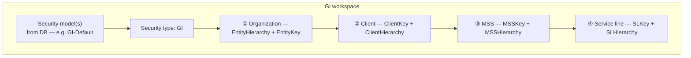
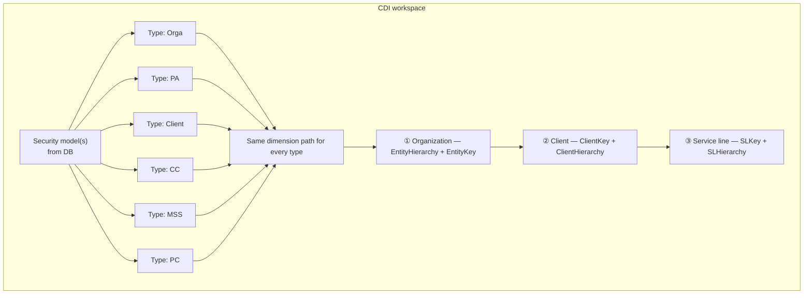
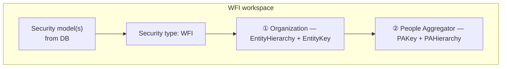
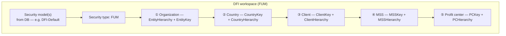
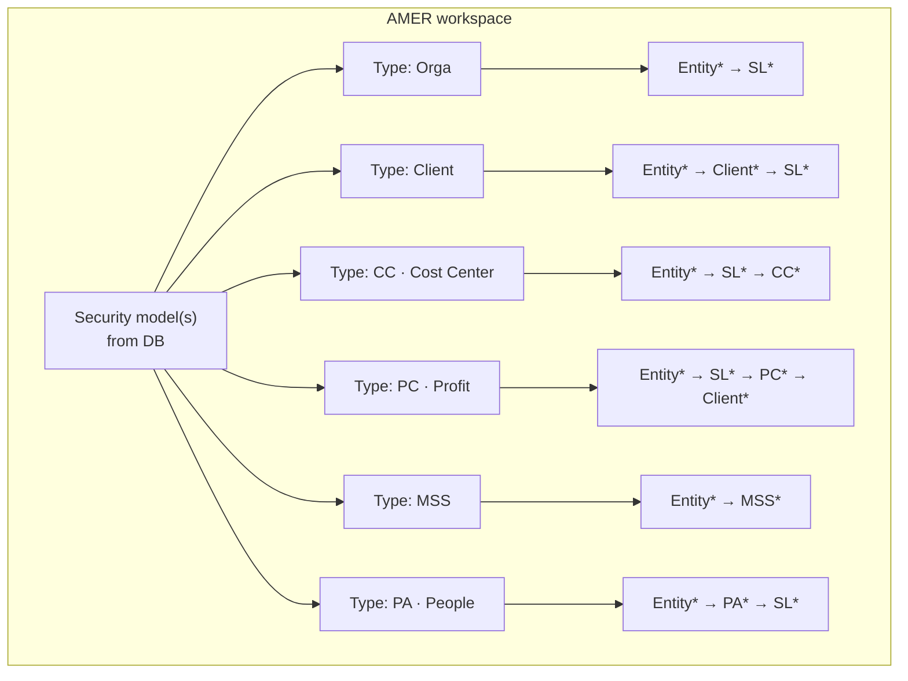
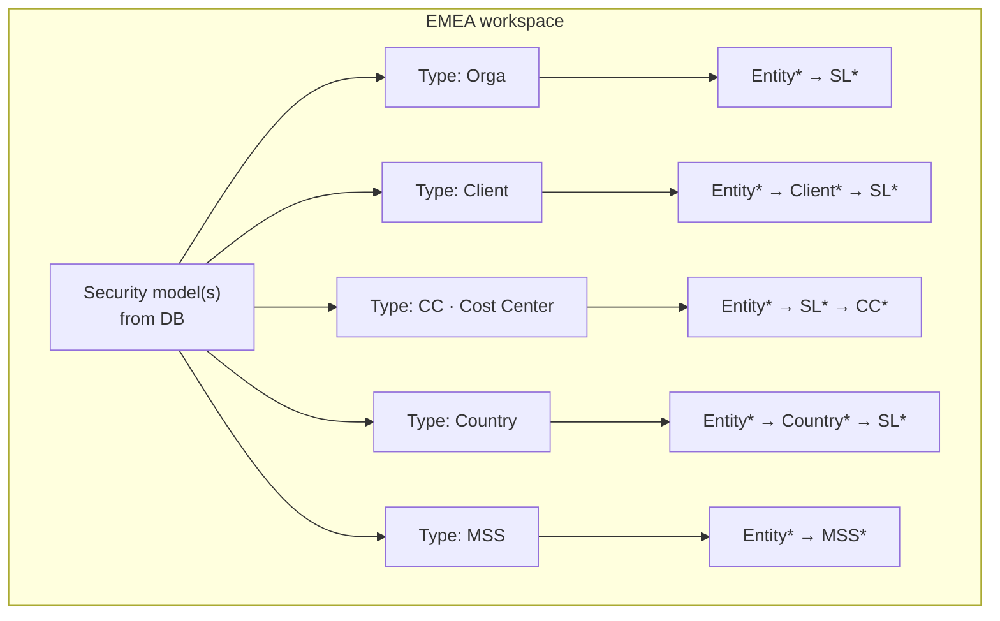
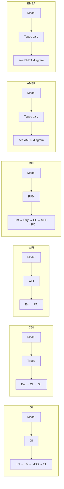

# RLS guide: domains, security models, types, and dimensions

This explains what you choose **when creating a permission request** (Data Entry) and **when assigning an RLS approver** (WSO console), in the same order the UI expects.

**Code references (if you need to verify behavior):**

- Dimension list per workspace: `FE/application/src/app/domains/data-entry/data/permission-request-workspace-rls.config.ts`
- Which dimensions appear for which security type: `FE/application/src/app/domains/data-entry/data/rls-dimensions-by-security-type.util.ts` (`getRlsDimensionVisibilityFlags`)
- Permission request RLS UI: `permission-requests-entry.component.ts` / `.html`
- Assign RLS approver UI: `wso-approver-assignments/approver-assignments.component.ts` / `.html`

---

## A. The two screens — same ideas, different layout

| Idea | What it is |
|------|------------|
| **Workspace / domain** | The business area (GI, CDI, WFI, DFI, AMER, EMEA). The app maps some DB workspace codes to these (e.g. FDI→DFI, CGI→GI). |
| **Security model** | A named package of RLS rules for that workspace (codes like `GI-Default`, `DFI-Default`). **Comes from the database** for the workspace you picked — not hard-coded in the doc. |
| **Security type** | A List-of-Values (LoV) entry (e.g. Client, Orga, FUM, GI). It tells the UI **which dimension groups** to show. |
| **Dimension** | A scope for access, usually a **Key** (which row in reference data) plus a **Hierarchy** (what level that key means: Global, Entity, L1, DSH, etc.). |

### A.1 Permission request (tabular RLS)

1. Pick **workspace** (already done earlier on the form).
2. Pick **security model** — loads types for that model from the API.
3. Pick **security type** — the form **hides** dimensions that do not apply.
4. Fill **dimensions** (see Part C). Most hierarchies are **filled automatically** when you pick a key; **Organization** is special: you pick **Entity hierarchy** first, then **Entity key** (except Global/N/A where the key is set for you).
5. Click **Resolve RLS approvers**, then submit when approvers look right.

### A.2 Assign RLS approver (WSO)

1. Pick **workspace** and **security model**.
2. Pick **security type** — same visibility rules as the permission request.
3. **Organization:** choose **level** (Global, Region, Cluster, Market, Entity, BPCEntity, N/A — for DFI/FUM also flows that use **N/A** for a “Geo” path). Then choose the **key** for that level (unless Global/N/A).
4. Other dimensions appear **in order** when previous steps are valid (e.g. cost center often after entity **and** service line).
5. For **client**, choose **All clients** vs **Specific client** before picking a client key.
6. Enter **approver** and save.

---

## B. One block per domain

For each domain below: **1) Security model** · **2) Security type** · **3) Dimensions**.

> **Security model codes** are whatever your environment has in `WorkspaceSecurityModels`. Examples people use in scripts: `GI-Default`, `DFI-Default`, `CDI-CLIENT`, etc. The app does **not** use one global list in code.

---

### B.1 GI (Growth Insights)

1. **Security model** — Any active model for a GI workspace, linked in DB to the types your reports use (often type **GI**).
2. **Security type** — Config default: **GI** only. (API may still return what is mapped to the model.)
3. **Dimensions** — Always, for GI: **Organization (Entity)** + **Client** + **MSS** + **Service line** (each has Key + hidden/auto Hierarchy except Entity hierarchy, which you pick explicitly).

---

### B.2 CDI (Client Data Insights)

1. **Security model** — Any active model for CDI (e.g. client- or campaign-oriented codes in DB).
2. **Security type** — Config lists: **Orga**, **PA**, **Client**, **CC**, **MSS**, **PC** as options.  
   **Important:** In the current app logic, **every** CDI security type still shows the **same** three dimension groups: **Entity + Client + Service line** (the code does not switch CDI dimensions by type).
3. **Dimensions** — **Organization (Entity)**, **Client**, **Service line** only (no separate PA/CC/MSS/PC fields on this tabular form).

---

### B.3 WFI (Workforce Information)

1. **Security model** — Any active WFI workspace model (often tied to type **WFI**).
2. **Security type** — **WFI**.
3. **Dimensions** — **Organization (Entity)** + **People Aggregator (PA)**. No client / SL / MSS on this path.

---

### B.4 DFI / FUM (Finance — config key `DFI`, internal type `FUM`)

1. **Security model** — e.g. **DFI-Default** in samples; real codes come from DB.
2. **Security type** — **FUM**.
3. **Dimensions** — **Entity** + **Country** + **Client** + **MSS** + **Profit center (PC)**.  
   **Assign approver (FUM only):** choosing **N/A** at organization level enables a **Geo** style flow where **country** can become required; if entity is a normal market/entity selection, country may be optional — see validation in `isDimensionCombinationValid`.

---

### B.5 AMER

1. **Security model** — Any AMER workspace model from DB.
2. **Security type** — Typical options: **Orga**, **PA**, **Client**, **CC**, **MSS**, **PC** (exact list = what is mapped to the model in DB).
3. **Dimensions** — Depend on the **label** of the security type (case-insensitive):

| You selected (contains…) | Dimension groups shown |
|--------------------------|-------------------------|
| **CC** or **Cost** | Entity + Service line + Cost center |
| **PC** or **Profit** | Entity + Service line + Profit center + **Client** |
| **MSS** | Entity + MSS |
| **Client** | Entity + Client + Service line |
| **PA** or **People** | Entity + People Aggregator + Service line |
| **Orga** (else) | Entity + Service line |

---

### B.6 EMEA

1. **Security model** — Any EMEA workspace model from DB.
2. **Security type** — Typical options: **Orga**, **Country**, **Client**, **CC**, **MSS** (plus whatever your DB maps).
3. **Dimensions** — Depend on the security type label:

| You selected (contains…) | Dimension groups shown |
|--------------------------|-------------------------|
| **CC** or **Cost** | Entity + Service line + Cost center |
| **Country** | Entity + Country + Service line |
| **MSS** | Entity + MSS |
| **Client** | Entity + Client + Service line |
| **Orga** (else) | Entity + Service line |

---

## B.7 Mermaid: workspace → security model → security type → dimension path

**How to read these diagrams**

- **Security models** live in the database per workspace; the box is “any model you select for this workspace.” A model is linked to **one or more** security types via `SecurityModelSecurityTypeMap` (only types mapped to that model appear in the UI).
- **`*`** on a dimension means **Key + Hierarchy** (hierarchy may be auto-filled in tabular entry).
- **Dimension order** follows the usual UI / validation flow (organization first, then others as gates in Assign RLS approver).

### GI workspace

### CDI workspace

### WFI workspace

### DFI workspace (FUM)

### AMER workspace

### EMEA workspace

### Combined overview (six workspaces)

---

## C. Every dimension — what you actually do

Below, **Key** = “which value” (client, entity, SL, …). **Hierarchy** = “at what rollup level” that value applies (DSH, L1, Default, …). The backend stores both.

### C.1 Organization (Entity)

| | Permission request | Assign RLS approver |
|---|-------------------|---------------------|
| **What you see** | **Entity hierarchy** dropdown, then **Entity key** search/select (order: hierarchy on the left, key on the right in the paired row). | **Organization level** first, then a **key** picker whose options depend on level (Market, Cluster, Region, Entity, BPCEntity). |
| **Hierarchy choices (typical)** | Global, Region, Cluster, Market, Entity, BPCEntity, N/A (from config). | Same idea: level drives which reference list fills the key. |
| **Auto behavior** | If hierarchy = **Global** → key becomes **Global**. If **N/A** → key **N/A** and key field is cleared for other levels. Changing hierarchy clears key when moving off Global/N/A. | Global/N/A shortcuts similar; FUM uses **N/A** entity key to open **Geo** flow (country emphasis). |
| **Hidden hierarchy?** | No — entity hierarchy is the main user-visible hierarchy. | N/A — level is explicit. |

---

### C.2 Client

| | Permission request | Assign RLS approver |
|---|-------------------|---------------------|
| **What you see** | **Client key** only in the UI; **Client hierarchy** is hidden and auto-set. | **All** vs **Specific** radio; if Specific, **Client key** selector. |
| **Auto hierarchy** | **All Clients** or **All** key → hierarchy **All Clients**. Any specific stakeholder key → hierarchy **DSH** (see `onRlsDimensionKeyChange`). | Managed by the assign form when you switch All/Specific. |
| **Special values** | Dropdown may include **All Clients** as a quick “all clients” scope. | **Client: All** does not require a specific client key. |

---

### C.3 Service line (SL)

| | Permission request | Assign RLS approver |
|---|-------------------|---------------------|
| **What you see** | **SL key**; hierarchy hidden/auto. | **Service line** key when the security type needs SL. |
| **Auto hierarchy** | Key **Overall** or **Default** → hierarchy **Default**; otherwise **ServiceLine**. | Same business rules apply via backend/list data. |

---

### C.4 MSS (Market sub-segment)

| | Permission request | Assign RLS approver |
|---|-------------------|---------------------|
| **What you see** | **MSS key**; hierarchy hidden/auto. List may include **Overall** for “all MSS”. | **MSS** key when type requires MSS. |
| **Auto hierarchy** | **Overall** / **All** → **Overall**. Else uses MSS metadata level (L0→Overall, L1–L4) or parses “(Lx)” from label; fallback **L1**. | Align with same reference data. |

---

### C.5 Cost center (CC)

| | Permission request | Assign RLS approver |
|---|-------------------|---------------------|
| **What you see** | **CC key**; hierarchy hidden. | **Cost center** after entity (and service line when required by rules). |
| **Auto hierarchy** | Always sets hierarchy to **CostCenter** when key is set. | — |

---

### C.6 Profit center (PC)

| | Permission request | Assign RLS approver |
|---|-------------------|---------------------|
| **What you see** | **PC key** (label may say ProfitCenter); hierarchy hidden. May include **All PCs**. | **Profit center** key when type is PC/FUM. |
| **Auto hierarchy** | **All PCs** / **All** → **All PCs**. Keys like **BR_*** or brand-like labels → **BPCBrand**; else **PC**. | — |

---

### C.7 Country

| | Permission request | Assign RLS approver |
|---|-------------------|---------------------|
| **What you see** | **Country key**; hierarchy hidden. | **Country** when EMEA country type or FUM; FUM may require country when entity key is **N/A** (Geo flow). |
| **Auto hierarchy** | **Global** → Global; **N/A** → N/A; specific country → **Country**. | Follow FUM vs EMEA visibility in `shouldShowField` / `shouldShowFieldFUM`. |

---

### C.8 People Aggregator (PA)

| | Permission request | Assign RLS approver |
|---|-------------------|---------------------|
| **What you see** | **PA key**; hierarchy hidden. | **People Aggregator** / Practice area when type needs PA (AMER PA, WFI). |
| **Auto hierarchy** | Uses rules + **assigned RLS rows** lookup: if one matching key has a single hierarchy in existing approver rows, that hierarchy is copied; else defaults such as **Business Areas** (see comments in `onRlsDimensionKeyChange`). | **Assign** validation requires **PA hierarchy** as well as key when PA is required (`isDimensionCombinationValid`). |

---

## D. Options: where dropdown values come from

- **Permission request:** After you pick workspace + security model, the app loads **assigned RLS approver rows** and **reference data** for that workspace type. Dropdowns prefer **backend** values (and can still allow custom typed values on many fields).
- **Assign approver:** Reference lists (entities, clients, SL, MSS, …) load per workspace type from the same RLS/reference services the console uses.

---

## E. Quick reference — default security type options in frontend config

(Real options still come from **SecurityModelSecurityTypeMap** for the model you pick.)

| Domain | Default type labels in `WORKSPACE_RLS_CONFIG` |
|--------|-----------------------------------------------|
| CDI | Orga, PA, Client, CC, MSS, PC |
| AMER | Orga, PA, Client, CC, MSS, PC |
| WFI | WFI |
| GI | GI |
| DFI | FUM |
| EMEA | Orga, Country, Client, CC, MSS |

---

## F. Related docs

- `Docs/SAKURAV2_TERMINOLOGY_GUIDE.md` — glossary (may use names like `EMEA-ORGA`; in the app that is **EMEA workspace** + security type **Orga**).
- `Docs/SECURITY_TYPE_DIMENSION_ANALYSIS.md` — note: security model **entity** in DB does not store dimension columns; dimensions live in RLS tables + UI rules.

---

*This file is meant to reduce confusion when moving between “new permission request” and “assign RLS approver” for each domain and dimension.*
