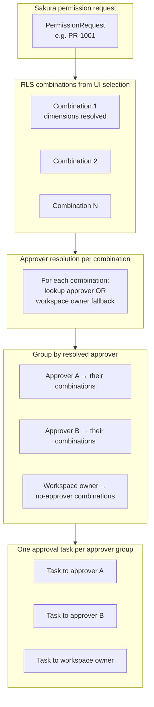
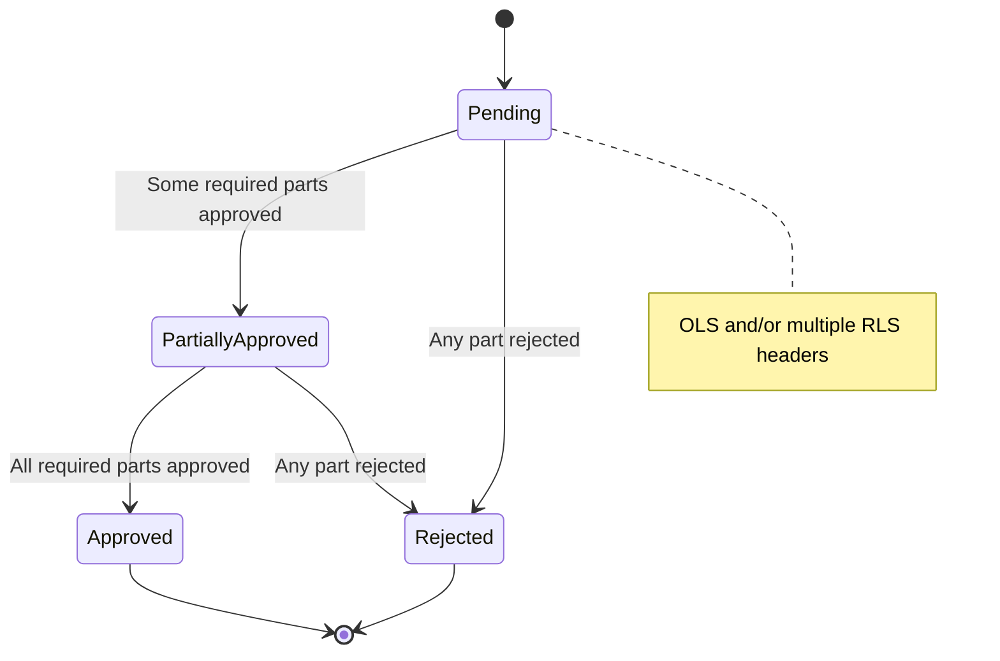
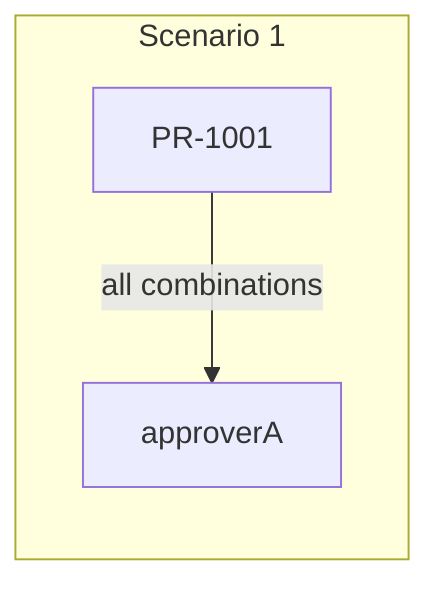
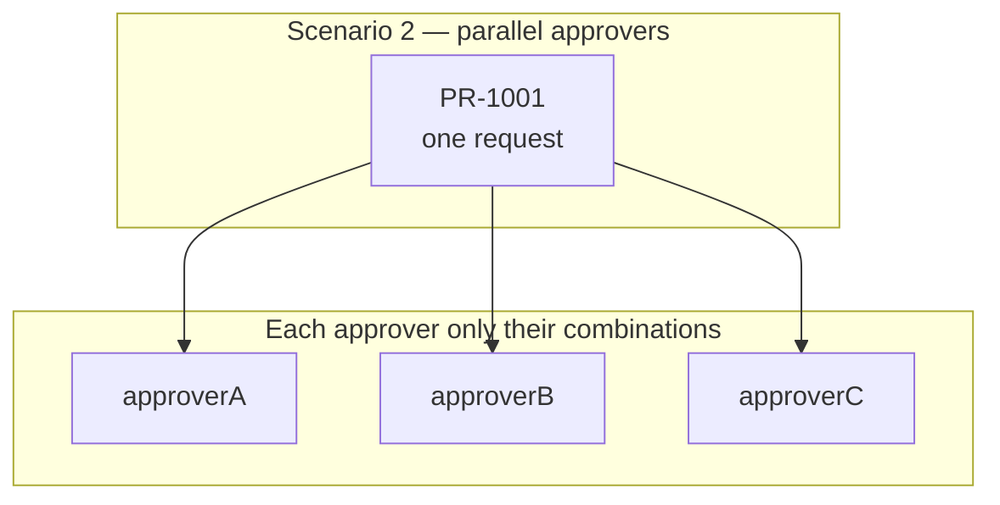
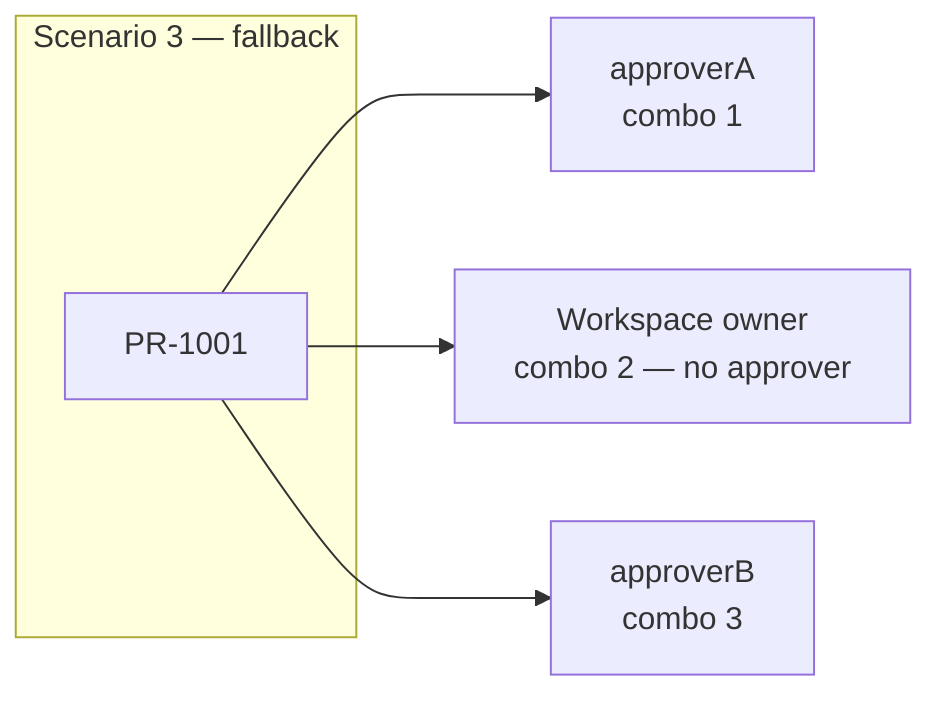
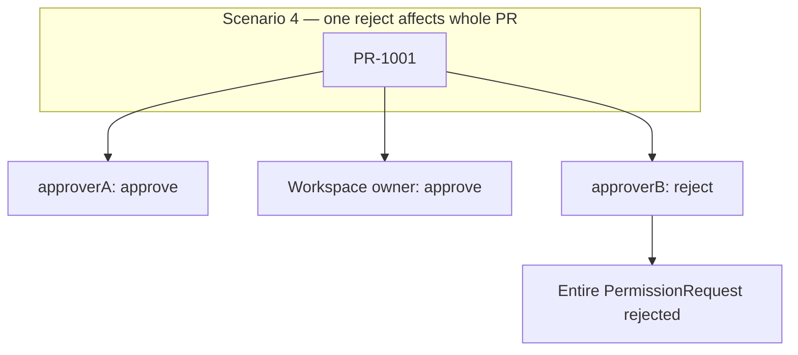
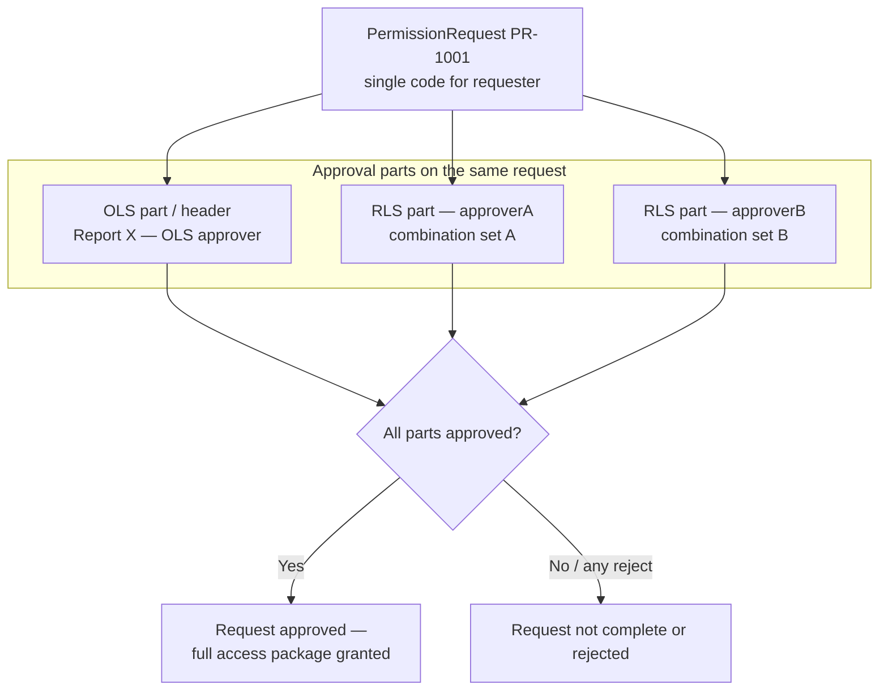

1.  If one request contains combinations with different RLS approvers, should one approver approve everything, or should each approver approve only their own combinations ?

2.  If one combination has no approver, should only that combination go to workspace owner, or should the full request go to workspace owner?

3.  Should the request be considered approved only when all combination approvers approve?

4.  Can one approver reject only their combination, or does rejection reject the entire request?

5.  If approverA approves combination 1 and approverB rejects combination 3, what should happen to the whole request?

6.  Should the requester see one request code or multiple request codes?

7.  Should emails go to all approvers at once, or should approval happen sequentially?

8.  When revoking later, should the user revoke the whole request or selected combinations?

9.  Email content for RLS in case of multiple dimension selection

---

## Sakura model overview (Multi-RLS)

The diagrams below use Sakura concepts: a single **PermissionRequest** (for example `PR-1001`), **RLS combinations** built from dimension selections (client, country, MSS, and similar), **resolved approvers** per combination, and **workspace owner** when no approver is configured.

### Flow: one request, combinations grouped by approver



### Approval outcome (recommended: reject-all)



---

**Scenario 1: All Selected Combinations Have the Same Approver**  
Example:

Combination 1 -\> approverA

Combination 2 -\> approverA

Combination 3 -\> approverA

**One request, one RLS approval/header**

- one approver owns all selected combinations

- no approval ownership conflict

- requester sees one request

- approver gets one approval task

This is the simplest case and works well with the current model.



**Scenario 2: Selected Combinations Have Different Approvers**  
Example:

Combination 1 -\> approverA

Combination 2 -\> approverB

Combination 3 -\> approverC

**One request with multiple RLS approval parts/headers**

- requester still sees one request

- each approver approves only their own combinations

- audit clearly shows who approved which access

- avoids one approver approving another approver's area

Alternative: **Multiple requests**  
This can be used if the business wants each approver's part to be fully independent with separate request codes.



**Scenario 3: Some Combinations Have No Approver**  
Example:

Combination 1 -\> approverA

Combination 2 -\> no approver found

Combination 3 -\> approverB

**One request with multiple RLS approval parts/headers**

- approverA approves combination 1

- workspace owner approves combination 2 as fallback

- approverB approves combination 3

- requester still tracks one request

- fallback usage is visible and auditable

Alternative: **Multiple requests**  
One request can go to approverA, one to workspace owner, one to approverB. This is cleaner technically but creates more request codes and more user noise.



**Scenario 4: One Approver Rejects One Combination**  
Example:

Combination 1 -\> approverA approves

Combination 2 -\> workspace owner approves

Combination 3 -\> approverB rejects

Suggested approach depends on business rule.

If rejection should reject everything:

- **One request with multiple approval parts/headers**

- if any approver rejects, whole request becomes rejected

- this keeps user communication and audit simple



**Scenario 5: Request Contains OLS + Multi-RLS**  
Example:

OLS: Report X

RLS Combination 1 -\> approverA

RLS Combination 2 -\> approverB

**One request with multiple approval parts/headers**

- one request represents the full access package

- OLS approver approves report/audience access

- each RLS approver approves their own combinations

- request is approved only when all required approvals are complete

Possible header structure:

PermissionRequest PR-1001

\- OLS header -\> OLS approver

\- RLS header -\> approverA

\- RLS header -\> approverB

### Sakura: one request, multiple approval parts (OLS + RLS)



**Scenario 6: Too Many Combinations Are Selected**  
Example:

Client: 10 values

Country: 10 values

MSS: 5 values

Potential combinations: 500

**Either block or split**

- keep one request only if combination count is within limit

- if over limit, ask user to reduce selection or split into multiple requests

**If the request exceeds that:**

- frontend should show a preview and ask user to reduce

- or backend should reject validation with a clear message

**Scenario 7: Workspace Owner Fallback Is Used for Many Combinations**  
Example:

20 selected combinations

12 combinations have no approver

12 combinations go to workspace owner

**One request with multiple approval parts/headers**, but with warning/reporting

- request can proceed

- fallback combinations are still approved by an accountable owner

- missing approver configuration is visible

- if fallback count is too high, block request and ask admin to fix approver setup

- if fallback is acceptable, continue and audit fallback usage

Recommended approach

- Allow one request with multiple RLS combinations.

- Group combinations by resolved approver.

- Create one approval task per approver group.

- If any approver rejects, reject the whole request.

- If approver is missing, assign that combination to workspace owner.

- Limit total combinations per request.

### Recommended grouping (sequence)

```mermaid
sequenceDiagram
    participant U as Requester
    participant S as Sakura API / workflow
    participant R as Approver resolution
    participant A as Approver A
    participant B as Approver B
    participant W as Workspace owner

    U->>S: Submit PermissionRequest with many RLS combinations
    S->>R: Resolve approver per combination
    R-->>S: Groups: A's combos, B's combos, owner fallback combos
    S->>A: Approval task (only A's combinations)
    S->>B: Approval task (only B's combinations)
    S->>W: Approval task (fallback combinations)
    A-->>S: Approve / reject
    B-->>S: Approve / reject
    W-->>S: Approve / reject
    Note over S: Any rejection rejects whole request; all approve completes request
```
