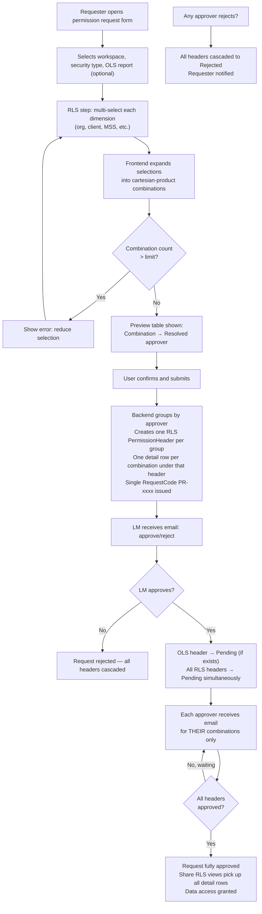
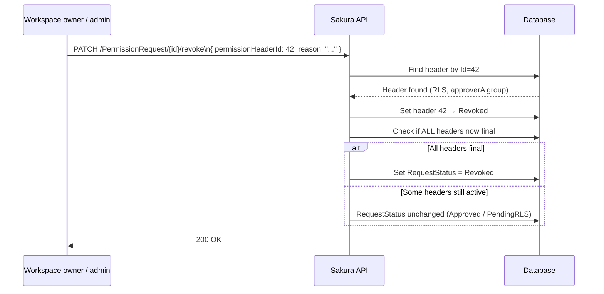

# Sakura — Multi-RLS Full Implementation Plan

**Status:** Design / pre-build  
**Audience:** Engineering, Product, QA  
**Last updated:** 2026-05-06

---

## 1. What we read before writing this

Every recommendation below is grounded in the actual Sakura source. Files verified:

| Layer | File / location |
|---|---|
| DB | `Sakura_DB/Dbo/Tables/PermissionRequests.sql` |
| DB | `Sakura_DB/Dbo/Tables/PermissionHeaders.sql` |
| DB | `Sakura_DB/Dbo/Tables/RLSPermissions.sql` |
| DB | `Sakura_DB/Dbo/Tables/RLSPermission{CDI,AMER,EMEA,GI,FUM,WFI}Details.sql` |
| BE | `PermissionRequestService.cs` (2 451 lines — full read) |
| BE | `RLSApproverService.cs` |
| BE | `IRLSApproverResolver.cs` |
| FE | `permission-request.model.ts` |
| FE | `permission-request-workspace-rls.config.ts` |
| FE | `permission-request-workspace-approver.util.ts` |
| Docs | `DOMAIN_RLS_FILTER_BUSINESS_RULES.md` |
| Docs | `MultiRLS.md` |

---

## 2. Current state — what the schema actually allows today

### 2.1 The two hard blockers in the DB

```sql
-- PermissionHeaders.sql
CONSTRAINT UK_PermissionHeaders_Request_Type
    UNIQUE (PermissionRequestId, PermissionType)
```

This unique constraint means **one PermissionRequest can have at most one OLS header and one RLS header**. It is the primary schema blocker for multi-RLS.

```sql
-- RLSPermissions.sql
CONSTRAINT UK_RLSPermissions
    UNIQUE (PermissionHeaderId)
```

This means **one RLS header can carry exactly one RLSPermission record** (one dimension combination set at the parent level).

### 2.2 What is already fine in the DB

The `RLSPermission*Details` tables (CDI, AMER, EMEA, GI, FUM, WFI) have **no unique constraint** on their `RLSPermissionsId` foreign key column:

```sql
-- RLSPermissionGIDetails.sql (representative)
CONSTRAINT PK_RLSPermissionGIDetails PRIMARY KEY (Id),
CONSTRAINT FK_RLSPermissionGIDetails_To_RLSPermissions
    FOREIGN KEY ([RLSPermissionsId]) REFERENCES dbo.RLSPermissions (Id)
-- ← no UNIQUE on RLSPermissionsId
```

**Multiple combination-detail rows per `RLSPermission` are already allowed by the schema.** The backend builders already call `.Add()` into those collections (`rlsPermission.RLSPermissionGIDetails.Add(detail)` etc.). The only gap is the DB call path only creates one.

### 2.3 What already works in the backend

| Feature | Code evidence | Works today? |
|---|---|---|
| **Reject-all cascade** | `RejectHeaderAsync` marks every other header `Rejected` with a reason string | ✅ Yes |
| **Revoke all headers** | `RevokeAllAsync` loops all headers | ✅ Yes |
| **Approve/reject by header ID** | `ApproveHeaderAsync` uses `request.PermissionHeaderId` when > 0 | ✅ Yes |
| **Reject any header → whole request rejected** | `entity.RequestStatus = RequestStatus.Rejected` after any header reject | ✅ Yes |
| **System-versioned audit trail** | All tables have `SYSTEM_VERSIONING = ON` with history tables | ✅ Yes |
| **Bulk approve/reject** | `BulkApproveHeadersAsync` / `BulkRejectHeadersAsync` already exist | ✅ Yes |

### 2.4 What does NOT work today

| Gap | Root cause |
|---|---|
| Multiple RLS headers per request | `UK_PermissionHeaders_Request_Type` unique constraint |
| Multiple RLS dimension combinations per header | `UK_RLSPermissions` unique constraint |
| Revoke a specific RLS header | `RevokeAsync` finds header by `PermissionType` (not by ID) — breaks with multiple RLS headers |
| Multi-select dimension values | FE sends single `Record<string, string>` for all dimensions |
| Cross-dimension (cartesian) combinations | No expansion logic anywhere |
| Parallel RLS approval | `ValidateStage` enforces sequential `PendingRLS` status check; `ApproveLMAsync` only activates the first `NotStarted` header |
| Combination count limit | No validation |

---

## 3. Questions answered before design

### Q1: Is individual dimension multi-select possible?

**Yes.** The user selects multiple values for one dimension (e.g., clients A, B, C). The frontend expands these into individual combinations. Nothing in the DB or BE prevents multiple `RLSPermissionGIDetails` rows from being inserted under one `RLSPermission`.

### Q2: Is cross-dimension (cartesian) combination possible?

**Yes.** When the user selects 3 clients and 2 MSS values the system computes 3 × 2 = 6 combinations. Each combination is a single row in the detail table. The approver resolver is called once per combination; combinations sharing the same resolved approver are grouped under one `PermissionHeader`.

### Q3: Is request creation possible with these changes?

**Yes.** The create endpoint is extended to accept an array of combinations. The service groups them by resolved approver, creates one `PermissionHeader` per group, and under each header one `RLSPermission` with N `RLSPermission*Details` rows. Single `RequestCode` — requester sees one request.

### Q4: Can revoke target a single combination group (header)?

**Yes.** `ApproveHeaderAsync` and `RejectHeaderAsync` already accept `PermissionHeaderId`. `RevokeAsync` needs a one-line change to look up by `PermissionHeaderId` instead of `PermissionType`. `RevokeAllAsync` already works unchanged.

### Q5: Does reject-all work?

**Already implemented.** `RejectHeaderAsync` cascades to all other headers on the same request (see lines 444–461 of `PermissionRequestService.cs`).

---

## 4. Recommended architecture

### 4.1 Design decision: one header per approver group, multiple detail rows per combination

```
PermissionRequest (PR-1001)
├── PermissionHeader [OLS]          → one OLS approver
└── PermissionHeader [RLS, group A] → approverA
│   └── RLSPermission
│       ├── RLSPermission*Details  (combo: Entity=UK, Client=ClientA, MSS=L2)
│       └── RLSPermission*Details  (combo: Entity=UK, Client=ClientA, MSS=L3)
└── PermissionHeader [RLS, group B] → approverB
    └── RLSPermission
        ├── RLSPermission*Details  (combo: Entity=FR, Client=ClientB, MSS=L2)
        └── RLSPermission*Details  (combo: Entity=DE, Client=ClientC, MSS=L0)
```

**Why this shape:**

- The `Share*.RLS.sql` views JOIN on individual dimension-value columns — they naturally read all detail rows for an approved header, so multiple rows per header = multiple RLS rows in the view = correct data-level access.
- One header per approver group keeps the number of headers proportional to the number of distinct approvers (bounded), not to the number of combinations (unbounded).
- Partial revoke = revoke a specific header (one approver group's combinations).
- Full revoke = `RevokeAllAsync` (unchanged).
- Reject-all = already implemented (unchanged).

### 4.2 Approval flow after LM approves

Current flow is sequential (LM → OLS → RLS one at a time). With multiple RLS headers the flow becomes:

```
LM approves
  ↓
If OLS header exists → set OLS to Pending (status = PendingOLS)
  ↓
OLS approver approves → set ALL RLS headers to Pending simultaneously (status = PendingRLS)
  ↓ (parallel)
ApproverA approves their header  ──┐
ApproverB approves their header  ──┤ any order
Workspace owner approves fallback ─┘
  ↓
When ALL RLS headers are Approved → RequestStatus = Approved
  ↓
If no OLS exists: after LM → set ALL RLS headers to Pending directly
```

If any header is rejected → whole request rejected (existing cascade unchanged).

---

## 5. Database changes

### 5.1 Required changes

#### Change 1: Allow multiple RLS headers per request

```sql
-- Drop the composite unique constraint (keep PK on Id intact)
ALTER TABLE [dbo].[PermissionHeaders]
    DROP CONSTRAINT [UK_PermissionHeaders_Request_Type];

-- Replace with a non-unique index for query performance
CREATE NONCLUSTERED INDEX [IX_PermissionHeaders_Request_Type]
    ON [dbo].[PermissionHeaders] ([PermissionRequestId], [PermissionType]);
```

**Impact:** OLS is still logically limited to one header per request (enforced in the service layer, not the DB). RLS can now have many.

#### Change 2: Allow multiple RLS combinations per header

```sql
-- Drop the unique constraint on RLSPermissions
ALTER TABLE [dbo].[RLSPermissions]
    DROP CONSTRAINT [UK_RLSPermissions];

-- Keep a non-unique index for join performance
CREATE NONCLUSTERED INDEX [IX_RLSPermissions_PermissionHeaderId]
    ON [dbo].[RLSPermissions] ([PermissionHeaderId]);
```

**Note:** The `RLSPermission*Details` tables already have no unique constraint on `RLSPermissionsId` — no changes needed there.

#### Change 3: Add metadata columns to PermissionHeaders

```sql
ALTER TABLE [dbo].[PermissionHeaders]
    ADD [ApproverGroupLabel] NVARCHAR(255)  NULL,   -- e.g. "approverA@dentsu.com (3 combos)"
        [SortOrder]          INT NOT NULL DEFAULT 0, -- display ordering
        [CombinationCount]   INT NOT NULL DEFAULT 1; -- denormalised for fast display
```

These columns are metadata only; they do not affect the workflow engine.

### 5.2 No changes needed

- `RLSPermission*Details` tables — already multi-row capable
- `PermissionRequests` table — unchanged
- `Share*.RLS.sql` views — they already JOIN on individual dimension-value columns; multiple rows per approved header will simply appear as additional allowed rows
- History tables — SQL Server temporal versioning propagates automatically

---

## 6. Backend changes

### 6.1 New request shape for create

Replace the single-combination `RlsDimensions` with an array:

```csharp
// New shape — replaces CreatePermissionRequestRequest.RlsDimensions
public class RlsCombinationRequest
{
    // Key = "Organisation", "Client", "MSS", etc.
    public Dictionary<string, DimensionValue> Dimensions { get; set; } = new();
    // Pre-resolved by frontend from /PermissionRequest/previewApprovers
    public string ResolvedApprover { get; set; } = string.Empty;
}

// On CreatePermissionRequestRequest:
public List<RlsCombinationRequest>? RlsCombinations { get; set; }
public int? MaxCombinationsLimit { get; set; } // server default: 50
```

### 6.2 `AddPermissionRequestAsync` — grouping logic

```csharp
if (request.HasRLS && request.RlsCombinations?.Any() == true)
{
    // 1. Validate combination count
    if (request.RlsCombinations.Count > MaxCombinationLimit)
        throw new ValidationException(...);

    // 2. Group by resolved approver (or workspace owner fallback)
    var groups = request.RlsCombinations
        .GroupBy(c => string.IsNullOrWhiteSpace(c.ResolvedApprover)
            ? workspaceOwner
            : c.ResolvedApprover);

    // 3. One PermissionHeader per group
    foreach (var (sortOrder, group) in groups.Select((g, i) => (i, g)))
    {
        var rlsHeader = new PermissionHeader
        {
            PermissionType     = PermissionType.RLS,
            ApprovalStatus     = ApprovalStatus.NotStarted,
            Approvers          = group.Key,
            ApproverGroupLabel = $"{group.Key} ({group.Count()} combination(s))",
            SortOrder          = sortOrder,
            CombinationCount   = group.Count(),
            // ... audit fields
        };

        var rlsPermission = new RLSPermission
        {
            SecurityModelId    = request.SecurityModelId,
            SecurityTypeLoVId  = request.SecurityTypeLoVId,
            // ... audit fields
        };

        // 4. One detail row per combination in the group
        foreach (var combo in group)
            builder(rlsPermission, combo.Dimensions); // existing builder, param adapted

        rlsHeader.RLSPermissions.Add(rlsPermission);
        entity.PermissionHeaders.Add(rlsHeader);
    }
}
```

### 6.3 `ApproveLMAsync` — activate all RLS headers at once

```csharp
// Current code: activates only the FIRST NotStarted header (sequential)
// New code: activates ALL NotStarted RLS headers simultaneously

if (hasOlsHeader && olsHeader.ApprovalStatus == ApprovalStatus.NotStarted)
{
    // OLS goes first as before
    olsHeader.ApprovalStatus = ApprovalStatus.Pending;
    entity.RequestStatus = RequestStatus.PendingOLS;
}
else
{
    // No OLS or OLS already done — activate all RLS headers in parallel
    foreach (var rlsHeader in entity.PermissionHeaders
        .Where(h => h.PermissionType == PermissionType.RLS
                 && h.ApprovalStatus == ApprovalStatus.NotStarted))
    {
        rlsHeader.ApprovalStatus = ApprovalStatus.Pending;
    }
    entity.RequestStatus = RequestStatus.PendingRLS;
}
```

### 6.4 `ApproveHeaderAsync` — completion check

```csharp
// After approving one header:
var anyPendingOrNotStarted = entity.PermissionHeaders
    .Any(h => h.ApprovalStatus == ApprovalStatus.NotStarted
           || h.ApprovalStatus == ApprovalStatus.Pending);

if (!anyPendingOrNotStarted)
    entity.RequestStatus = RequestStatus.Approved;
// else keep current status (PendingOLS / PendingRLS)
```

### 6.5 `ValidateStage` — update for parallel RLS

```csharp
// Remove strict single-type sequential check.
// Instead validate that the specific header is in Pending state.
private void ValidateHeaderStage(PermissionHeader header)
{
    if (header.ApprovalStatus != ApprovalStatus.Pending)
        throw new ValidationException(...);
}
```

### 6.6 `RevokeAsync` — use header ID not PermissionType

```csharp
// Change from:
var header = entity.PermissionHeaders
    .FirstOrDefault(h => h.PermissionType == request.PermissionType);

// Change to:
var header = request.PermissionHeaderId > 0
    ? entity.PermissionHeaders.FirstOrDefault(h => h.Id == request.PermissionHeaderId)
    : entity.PermissionHeaders.FirstOrDefault(h => h.PermissionType == request.PermissionType);
// ↑ Fallback for backward compatibility with old clients
```

### 6.7 `ExtractRlsDimensions` — return all detail rows

```csharp
// Current: FirstOrDefault on detail collection → only first combination
// New: return all detail rows as a List<Dictionary<string, string?>>
private static List<Dictionary<string, string?>> ExtractAllRlsDimensions(RLSPermission rls)
{
    var list = new List<Dictionary<string, string?>>();
    // CDI
    foreach (var d in rls.RLSPermissionCDIDetails)
        list.Add(BuildDimDict(ExtractCdiDims(d)));
    // GI, AMER, EMEA, FUM, WFI — same pattern
    return list;
}
```

### 6.8 `PreviewApprovers` endpoint — per-combination resolution

Return a structured preview so the frontend can show grouping before submitting:

```csharp
// New response shape
public class MultiRlsApproverPreview
{
    public List<ApproverGroup> Groups { get; set; } = new();
    public int TotalCombinations { get; set; }
    public int CombinationLimit { get; set; }
    public bool ExceedsLimit { get; set; }
}

public class ApproverGroup
{
    public string Approver { get; set; } = string.Empty;
    public bool IsWorkspaceOwnerFallback { get; set; }
    public List<Dictionary<string, string>> Combinations { get; set; } = new();
}
```

### 6.9 Duplicate check — update for multi-combination

The existing `ValidateDuplicateRequestAsync` checks that no active request already has the same dimensions. With multiple combinations it should check whether **any** of the new combinations already has an active approved or in-flight grant. Flag overlapping combinations rather than blocking the whole request.

---

## 7. Frontend changes

### 7.1 Multi-select dimension pickers

Replace each single-value `lookup` input with a multi-select variant. The existing `RlsDimensionConfig.inputType` is already typed:

```typescript
// permission-request-workspace-rls.config.ts
export type RlsInputType = 'direct' | 'dropdown' | 'lookup' | 'hidden';
// Add: 'multi-lookup'
export type RlsInputType = 'direct' | 'dropdown' | 'lookup' | 'multi-lookup' | 'hidden';
```

Example: GI Client picker changes from `'lookup'` (single) to `'multi-lookup'`. All other config stays the same.

### 7.2 Combination expansion and preview

After the user finishes selecting, compute the cartesian product client-side:

```typescript
function expandToCombinations(
  selections: Record<string, string[]>  // dimensionKey → selected values
): Record<string, string>[] {
  // Standard cartesian product across dimension values
  // Returns array of single-value records (one per combination)
}
```

Show a preview table **before** submitting:

| Org | Client | MSS | Resolved approver |
|---|---|---|---|
| UK | ClientA | L2 | approverA@dentsu.com |
| UK | ClientA | L3 | approverA@dentsu.com |
| FR | ClientB | L2 | approverB@dentsu.com |

Show combination count with a warning at 40 and a hard block at 50.

### 7.3 Updated `CreatePermissionRequestRequest`

```typescript
export interface RlsCombination {
  dimensions: Record<string, { key: string; hierarchy: string }>;
  resolvedApprover: string;
}

// On CreatePermissionRequestRequest:
rlsCombinations?: RlsCombination[];
// Keep rlsDimensions for backward-compatible single-combination path
```

### 7.4 Approver grouping display (pre-submit)

After calling `/previewApprovers` with all combinations, render:

```
Approval groups for this request:
  approverA@dentsu.com — 4 combinations
  approverB@dentsu.com — 2 combinations
  [Workspace owner fallback] — 1 combination (no approver configured)
```

User must confirm before submitting.

### 7.5 WSO console — approval UI per header

Each RLS `PermissionHeader` is shown as a separate card/row:

- **Header ID** (for precise approve/reject/revoke)
- **Combinations table** (list of detail rows)
- **Approver(s)** assigned to this header
- **Status badge** (NotStarted / Pending / Approved / Rejected / Revoked)
- **Approve / Reject / Revoke** actions — pass `permissionHeaderId` in every action call

### 7.6 Revoke UI

Two options offered to workspace owner:

1. **Revoke all** — calls `RevokeAllAsync` — revokes every header
2. **Revoke selected combinations** — user picks one or more RLS headers → calls `RevokeAsync` with `permissionHeaderId` for each

Requester sees the request status update and which combination groups were revoked.

---

## 8. User-friendly flow (end-to-end)



---

## 9. Revoke and reject — all cases

### Reject-all (already implemented — no change needed)

When any approver rejects their header, `RejectHeaderAsync` in the backend already:
1. Marks that header `Rejected`
2. Loops every other header and marks it `Rejected` with reason `"Rejected due to [OLS/RLS] rejection."`
3. Sets `RequestStatus = Rejected`

No code change required here.

### Partial revoke (new)



This enables revoking one approver group's combinations while keeping another group active.

### Full revoke (already implemented — no change needed)

`RevokeAllAsync` loops all headers — works unchanged with multiple RLS headers.

---

## 10. Future-proofing decisions baked into this plan

| Risk | How it is handled |
|---|---|
| Approver not configured for some combinations | Workspace owner fallback is resolved at preview time and stored explicitly in `PermissionHeaders.Approvers`; audit log shows fallback usage |
| Combination explosion (500+) | Hard limit enforced at both FE (block on preview) and BE (validation in `AddPermissionRequestAsync`); configurable via `appsettings.json` |
| Sequential approval assumption in old code | `ValidateStage` replaced with per-header status check; `ApproveLMAsync` activates all RLS headers in parallel |
| Old clients sending single `rlsDimensions` | Backward-compatible: if `RlsCombinations` is null, fall back to wrapping `RlsDimensions` as a single-item combination list |
| Duplicate detection with multi-combination | Updated to flag overlapping individual combinations, not block the whole request |
| Revoke by `PermissionType` (old clients) | `RevokeAsync` checks `PermissionHeaderId > 0` first, falls back to `PermissionType` |
| Temporal audit trail | All changed tables already have `SYSTEM_VERSIONING = ON` — no extra work |
| Share RLS view compatibility | Views JOIN on detail-table rows — multiple rows per approved header is additive, views do not need changes |

---

## 11. What must NOT change (guard rails)

1. The `RequestCode` uniqueness — requester always sees one code per request.
2. The `LMApprover` field — always a single LM per request.
3. The system-versioned temporal tables — do not disable history tables during migration.
4. The reject-all behavior — keep it as-is; partial rejection is not a requirement and creates audit confusion.
5. The OLS uniqueness — enforce in the service layer (not the DB) that only one OLS header exists per request.

---

## 12. Phased delivery

### Phase 1 — DB + BE foundation (no FE changes)
- Drop `UK_PermissionHeaders_Request_Type`
- Drop `UK_RLSPermissions`
- Add `ApproverGroupLabel`, `SortOrder`, `CombinationCount` columns to `PermissionHeaders`
- Update `AddPermissionRequestAsync` to accept `RlsCombinations[]` with backward compat
- Update `ApproveLMAsync` for parallel RLS headers
- Update `ApproveHeaderAsync` completion check
- Update `RevokeAsync` to use `PermissionHeaderId`
- Update `ValidateStage` to per-header check
- Update `ExtractRlsDimensions` to return all detail rows
- Add combination count limit validation
- Update `PreviewApprovers` to return `MultiRlsApproverPreview`

### Phase 2 — FE wizard multi-select
- Add `'multi-lookup'` input type to RLS config
- Implement client-side cartesian product expansion
- Combination preview table
- Approver grouping confirmation screen
- Update `CreatePermissionRequestRequest` on FE
- Combination count warning and hard block

### Phase 3 — WSO console + revoke UX
- Per-header approval/reject cards in WSO console
- Partial revoke UI (select headers to revoke)
- Email templates updated to list combinations per approver
- Audit log display shows per-header decisions

### Phase 4 — hardening
- Duplicate detection updated for multi-combination
- Performance testing with max combinations per request
- Combination count limit moved to `ApplicationSettings` table (admin-configurable)

---

## 13. Open questions for product / domain owners

| # | Question | Why it matters |
|---|---|---|
| 1 | What is the combination limit? (suggested: 30 warn, 50 hard block) | Drives validation threshold and DB index sizing |
| 2 | Can a requester revoke a subset of combinations themselves, or is revoke workspace-owner only? | Determines which roles see the partial revoke UI |
| 3 | If approverA approves but approverB is still pending, should the request show as "Partially approved" or just "Pending RLS"? | Drives status label in the requester view |
| 4 | Should duplicate detection block an exact-duplicate combination or only warn? | Determines whether overlapping combos reuse old grants or create new ones |
| 5 | For email: list all combinations in one email per approver, or one email per combination? | Affects email template design and volume |
| 6 | Is partial revoke (revoke one approver group but keep others active) a business requirement or just technical nice-to-have? | If not required, we can defer Phase 3 partial revoke |
