# Sakura Backend - Mermaid Diagrams Documentation

## Table of Contents
1. [Entity Relationship Diagrams](#entity-relationship-diagrams)
2. [Class Diagrams](#class-diagrams)
3. [Sequence Diagrams](#sequence-diagrams)
4. [Architecture Diagrams](#architecture-diagrams)

---

## 1. Entity Relationship Diagrams

### 1.1 Complete Database Schema

```mermaid
erDiagram
    Workspace ||--o{ WorkspaceApp : "contains"
    SecurityModel ||--o{ SecurityDimension : "has"
    SecurityModel ||--o{ SecurityModelTypeMapping : "maps to"
    
    Workspace {
        int Id PK "Primary key - unique workspace identifier"
        string WorkspaceName "Display name for workspace"
        string WorkspaceCode UK "Unique business code for workspace"
        string WorkspaceOwner "Email of business owner"
        string WorkspaceTechOwner "Email of technical owner"
        string WorkspaceApprover "Email of default approver"
        string WorkspaceEntraGroupUID "Azure Entra Group GUID for access control"
        string WorkspaceTag "Tags for categorization"
        bool IsActive "Soft delete flag - true means active"
        string CreatedBy "Email of user who created record"
        datetime CreatedAt "Timestamp when record was created"
        string UpdatedBy "Email of user who last updated"
        datetime UpdatedAt "Timestamp of last update - used for concurrency"
    }
    
    WorkspaceApp {
        int Id PK "Primary key - unique app identifier"
        int WorkspaceId FK "Foreign key to parent workspace"
        string AppCode "Unique code for application within workspace"
        string AppName "Display name of application"
        string AppOwner "Email of application business owner"
        string AppTechnicalOwner "Email of application technical owner"
        string AppEntraGroupUID "Azure Entra Group GUID for app access"
        int OLSMode "Object Level Security mode: 0=Managed, 1=Unmanaged"
        int ApprovalMode "Approval type: 0=AppBased, 1=AudienceBased"
        string Approvers "Comma-separated list of approver emails"
        string AdditionalQuestionsJSON "Custom approval questions in JSON format"
        bool IsActive "Soft delete flag - true means active"
        string CreatedBy "Email of user who created record"
        datetime CreatedAt "Timestamp when record was created"
        string UpdatedBy "Email of user who last updated"
        datetime UpdatedAt "Timestamp of last update"
    }
    
    SecurityModel {
        int Id PK "Primary key - unique security model identifier"
        int WorkspaceId "Workspace this security model belongs to"
        string ModelCode UK "Unique uppercase code for security model"
        string ModelName "Display name of security model"
        string Description "Optional description of model purpose"
        bool IsActive "Soft delete flag - true means active"
        string CreatedBy "Email of user who created record"
        datetime CreatedAt "Timestamp when record was created"
        string UpdatedBy "Email of user who last updated"
        datetime UpdatedAt "Timestamp of last update"
    }
    
    SecurityDimension {
        int Id PK "Primary key - unique dimension identifier"
        int SecurityModelId FK "Foreign key to parent security model - cascades delete"
        string DimensionCode "Unique code for dimension within model"
        string DimensionName "Display name of dimension"
        string SourceTable "Database table containing dimension data"
        int DimensionType "Type identifier for dimension category"
        bool IsActive "Soft delete flag - true means active"
        string CreatedBy "Email of user who created record"
        datetime CreatedAt "Timestamp when record was created"
        string UpdatedBy "Email of user who last updated"
        datetime UpdatedAt "Timestamp of last update"
    }
    
    SecurityModelTypeMapping {
        int Id PK "Primary key - unique mapping identifier"
        int SecurityModelId FK "Foreign key to security model - cascades delete"
        string SecurityTypeCode "References LoVs table where LovType=SecurityType"
        string CreatedBy "Email of user who created record"
        datetime CreatedAt "Timestamp when record was created"
        string UpdatedBy "Email of user who last updated"
        datetime UpdatedAt "Timestamp of last update"
    }
    
    LoVs {
        int Id PK "Primary key - unique LoV identifier"
        string LovType "Category of value - groups related LoVs"
        string LoVValue "Code value used in system logic"
        string LoVName "Display name shown to users"
        string LoVDescription "Description of value meaning"
        string ParentLoVType "Parent category for hierarchical LoVs"
        string ParentLoVValue "Parent value for hierarchical relationships"
        datetime CreatedAt "Timestamp when record was created"
        string CreatedBy "Email of user who created record"
        datetime UpdatedAt "Timestamp of last update"
        string UpdatedBy "Email of user who last updated"
    }
    
    RefreshToken {
        int TokenId PK "Primary key - unique token identifier"
        string Token UK "SHA256 hash of refresh token"
        string UserId "User identifier - email or Azure AD sub"
        datetime CreatedAt "Timestamp when token was created"
        datetime ExpiresAt "Timestamp when token expires - 7 days default"
        string CreatedByIp "IP address of client that created token"
        bool Revoked "Flag indicating if token has been revoked"
        datetime RevokedAt "Timestamp when token was revoked"
    }
```

### 1.2 Core Workspace Domain

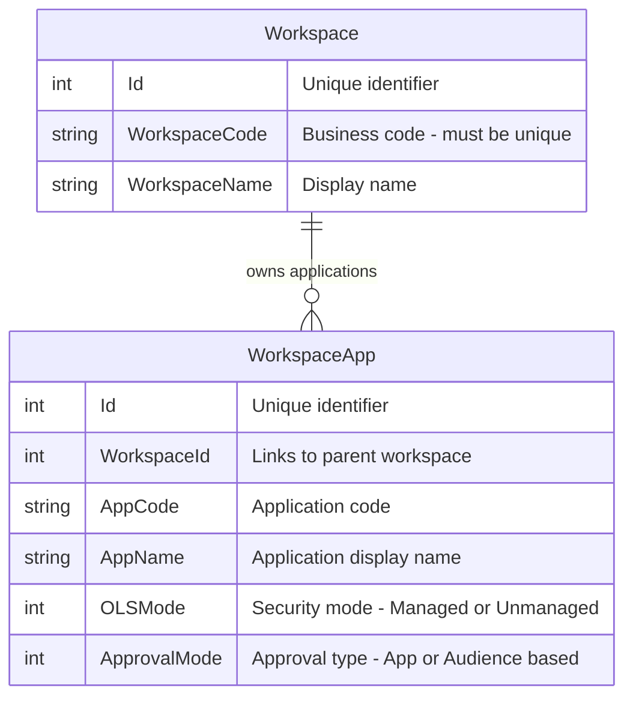

### 1.3 Security Model Domain

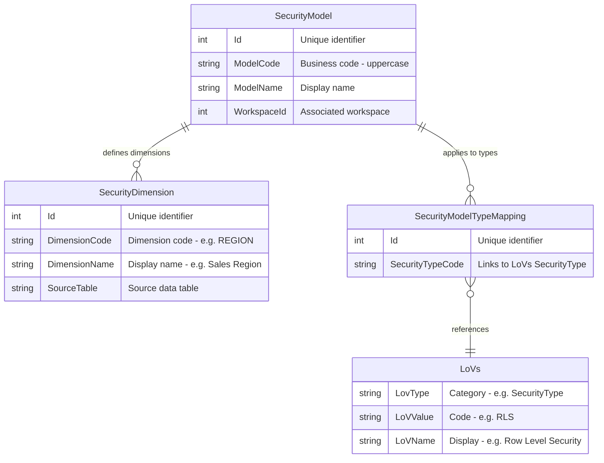

---

## 2. Class Diagrams

### 2.1 Domain Layer - Entity Hierarchy

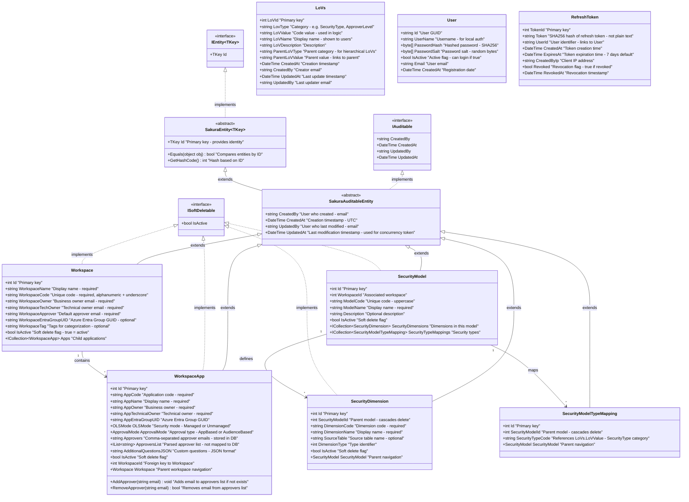

### 2.2 Application Layer - Request/Response Pattern

```mermaid
classDiagram
    class SakuraRequest {
        <<abstract>>
        +string ConcurrencyToken "HMAC-SHA256 token - validates no concurrent updates"
    }
    
    class SakuraCreateRequest {
        <<abstract>>
        +string CreatedBy "Email of user creating record - required"
    }
    
    class SakuraUpdateRequest {
        <<abstract>>
        +int Id "Entity ID to update - required"
        +string UpdatedBy "Email of user updating - required"
    }
    
    class SakuraDeleteRequest {
        <<abstract>>
        +int Id "Entity ID to delete - required"
        +string DeletedBy "Email of user deleting - required"
    }
    
    class CreateWorkspaceRequest {
        +string WorkspaceName "Display name - required"
        +string WorkspaceCode "Unique code - required"
        +string WorkspaceOwner "Owner email - required"
        +string WorkspaceTechOwner "Tech owner email - required"
        +string WorkspaceApprover "Approver email - required"
        +string WorkspaceEntraGroupUID "Azure Group GUID - optional"
        +string WorkspaceTag "Tags - optional"
    }
    
    class UpdateWorkspaceRequest {
        "Inherits all fields from CreateWorkspaceRequest plus Id and UpdatedBy"
    }
    
    class DeleteWorkspaceRequest {
        "Contains Id, DeletedBy, and ConcurrencyToken only"
    }
    
    class SakuraResponse {
        <<abstract>>
        +string ConcurrencyToken "Auto-computed from Id and UpdatedAt - sent to client"
    }
    
    class WorkspaceResponse {
        +int Id "Workspace identifier"
        +string WorkspaceName "Display name"
        +string WorkspaceCode "Unique code"
        +string WorkspaceOwner "Owner email"
        +string WorkspaceTechOwner "Tech owner email"
        +string WorkspaceApprover "Approver email"
        +string WorkspaceEntraGroupUID "Azure Group GUID"
        +string WorkspaceTag "Tags"
        +bool IsActive "Active flag"
        +DateTime CreatedAt "Creation timestamp"
        +string CreatedBy "Creator email"
        +DateTime UpdatedAt "Last update timestamp"
        +string UpdatedBy "Last updater email"
        +string ConcurrencyToken "Inherited - for optimistic locking"
    }
    
    class SecurityModelResponse {
        +int Id "Model identifier"
        +int WorkspaceId "Parent workspace ID"
        +string ModelCode "Unique uppercase code"
        +string ModelName "Display name"
        +string Description "Optional description"
        +List~string~ SecurityTypes "Security type codes"
        +List~SecurityDimensionResponse~ Dimensions "Child dimensions"
        +bool IsActive "Active flag"
        +DateTime CreatedAt "Creation timestamp"
        +string CreatedBy "Creator email"
        +DateTime ModifiedAt "Last update timestamp"
        +string ModifiedBy "Last updater email"
        +string ConcurrencyToken "Inherited"
    }
    
    class ApiBaseResult {
        +bool Success "True if request succeeded"
        +string Message "Human-readable message"
        +List~ErrorInfo~ Errors "Validation/business errors"
    }
    
    class ApiSingleResult~T~ {
        +T Data "Single entity response"
    }
    
    class ApiListResult~T~ {
        +List~T~ Data "List of entities"
        +int Count "Total count"
    }
    
    class ApiScalarResult~T~ {
        +T Value "Scalar value - bool, int, etc"
    }
    
    SakuraRequest <|-- SakuraCreateRequest : extends
    SakuraRequest <|-- SakuraUpdateRequest : extends
    SakuraRequest <|-- SakuraDeleteRequest : extends
    SakuraCreateRequest <|-- CreateWorkspaceRequest : extends
    SakuraUpdateRequest <|-- UpdateWorkspaceRequest : extends
    SakuraDeleteRequest <|-- DeleteWorkspaceRequest : extends
    SakuraResponse <|-- WorkspaceResponse : extends
    SakuraResponse <|-- SecurityModelResponse : extends
    ApiBaseResult <|-- ApiSingleResult~T~ : extends
    ApiBaseResult <|-- ApiListResult~T~ : extends
    ApiBaseResult <|-- ApiScalarResult~T~ : extends
```

### 2.3 Infrastructure Layer - Repository Pattern

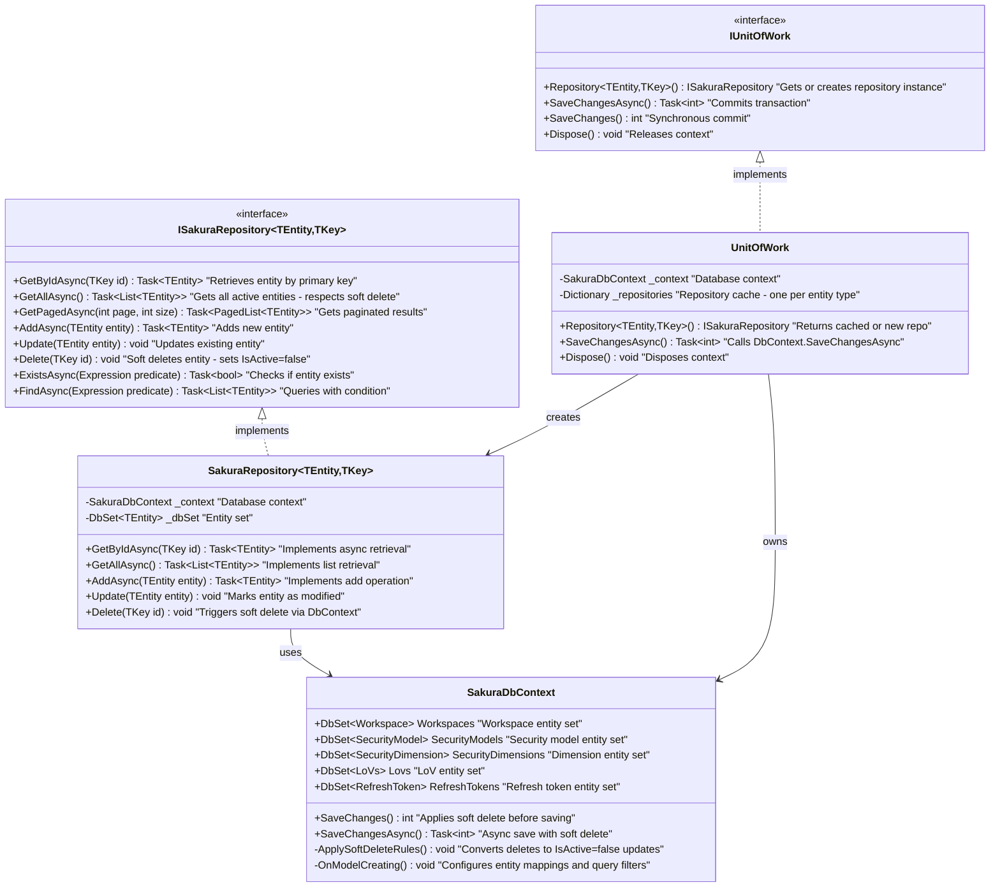

---

## 3. Sequence Diagrams

### 3.1 Workspace Creation Flow

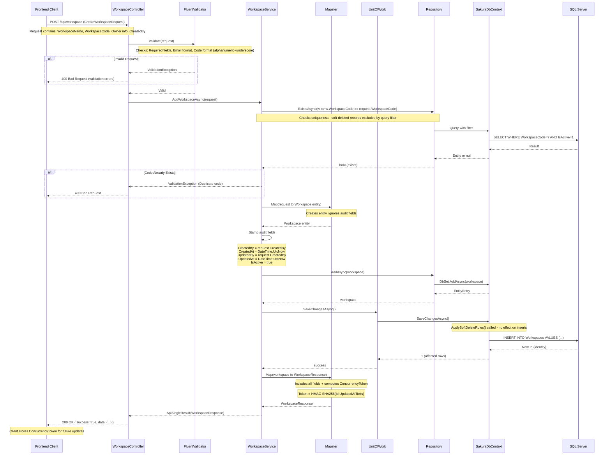

### 3.2 Workspace Update Flow with Concurrency Check

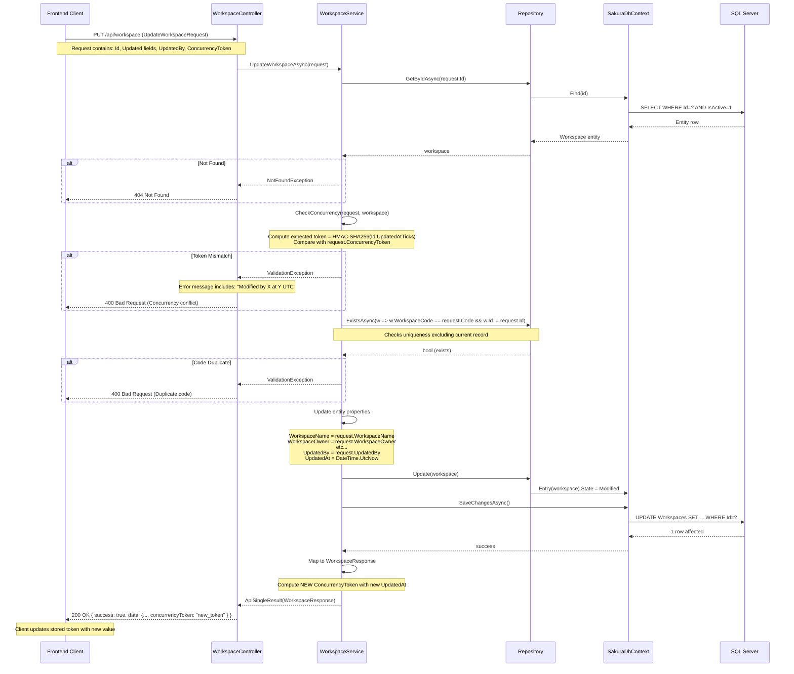

### 3.3 Soft Delete Flow

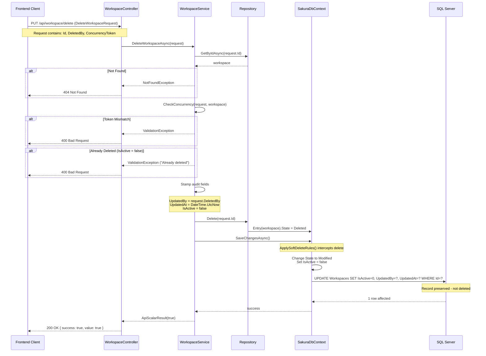

### 3.4 Authentication Flow (Dev Mode)

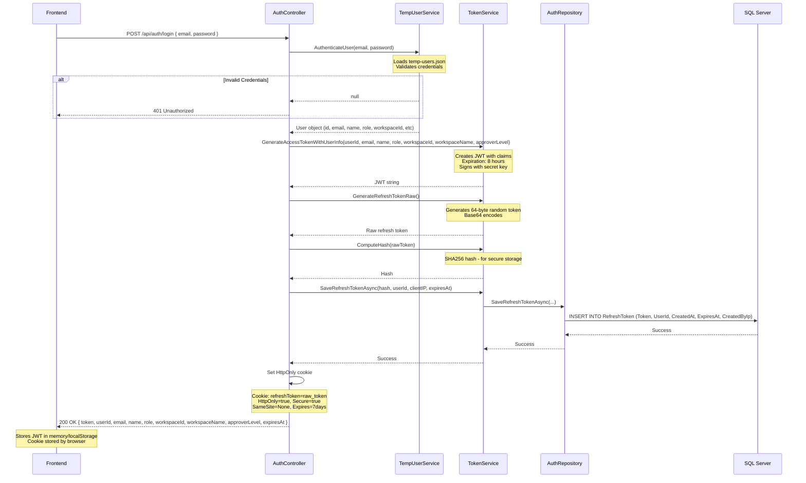

### 3.5 Token Refresh Flow

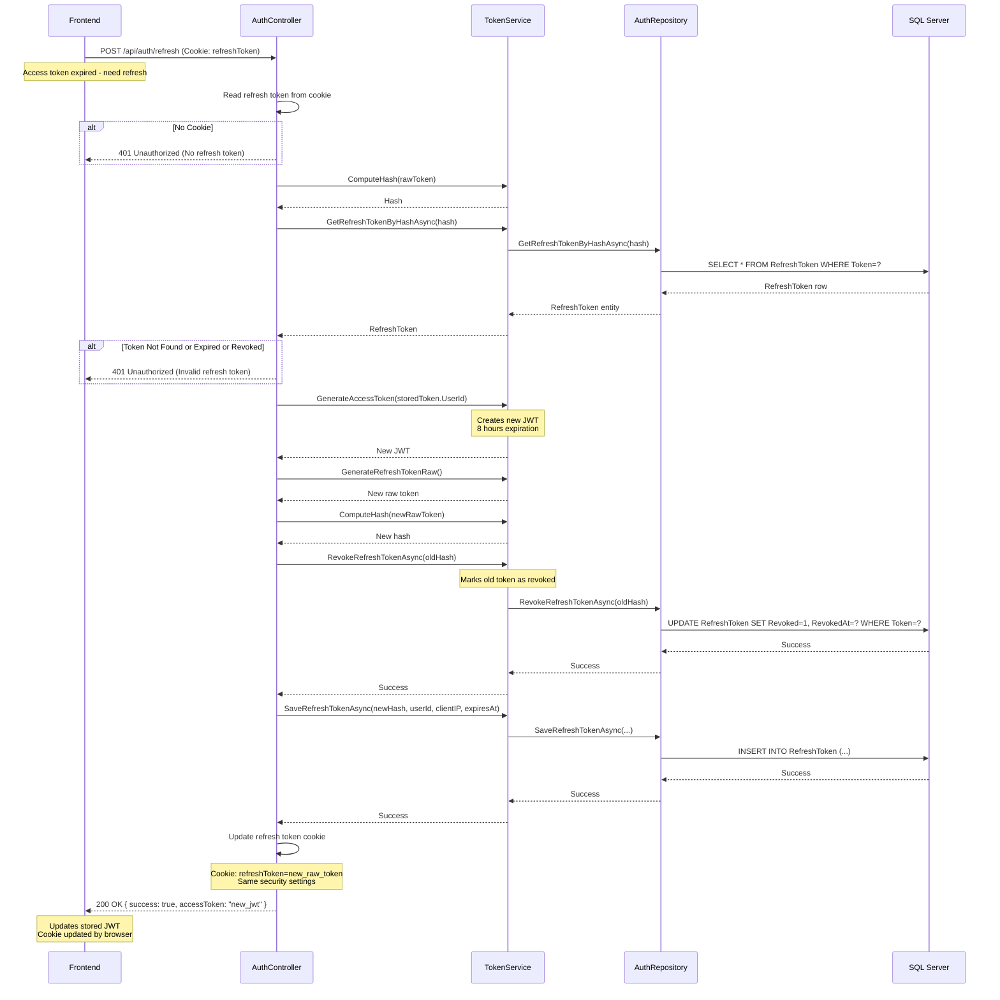

---

## 4. Architecture Diagrams

### 4.1 System Architecture - Clean Architecture Layers

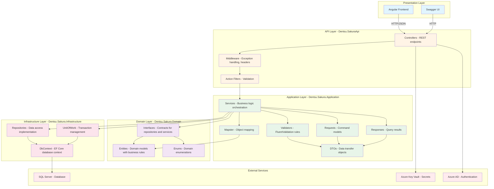

### 4.2 Request Processing Pipeline

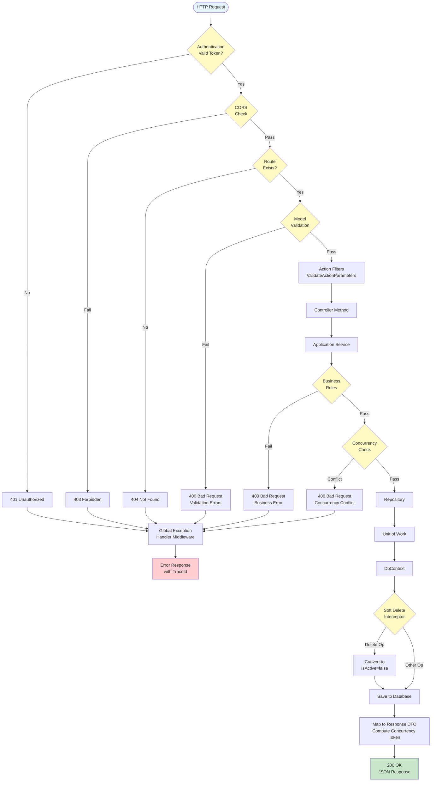

### 4.3 Dependency Injection Container

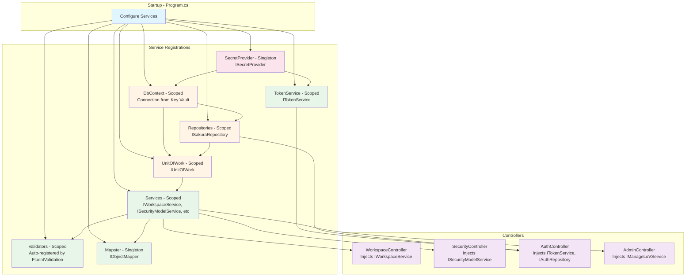

### 4.4 Data Flow - Read vs Write

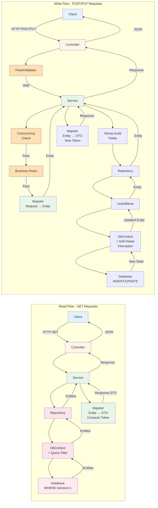

---

## Summary

This document provides visual representations of:

✅ **Entity Relationships** - Database schema with detailed field explanations  
✅ **Class Hierarchies** - Domain model inheritance and interfaces  
✅ **Request/Response Patterns** - Application layer contracts  
✅ **Repository Pattern** - Infrastructure layer abstractions  
✅ **Sequence Flows** - Step-by-step operation flows with notes  
✅ **Architecture Layers** - Clean architecture visualization  
✅ **Processing Pipeline** - Request lifecycle from HTTP to database  
✅ **Dependency Injection** - Service container configuration  
✅ **Data Flows** - Read vs write operation differences  

All diagrams include single-line explanations for each property and method to clarify their purpose.

---

**Document Version**: 1.0  
**Last Updated**: November 16, 2025  
**Mermaid Version**: Compatible with Mermaid.js 10.0+

