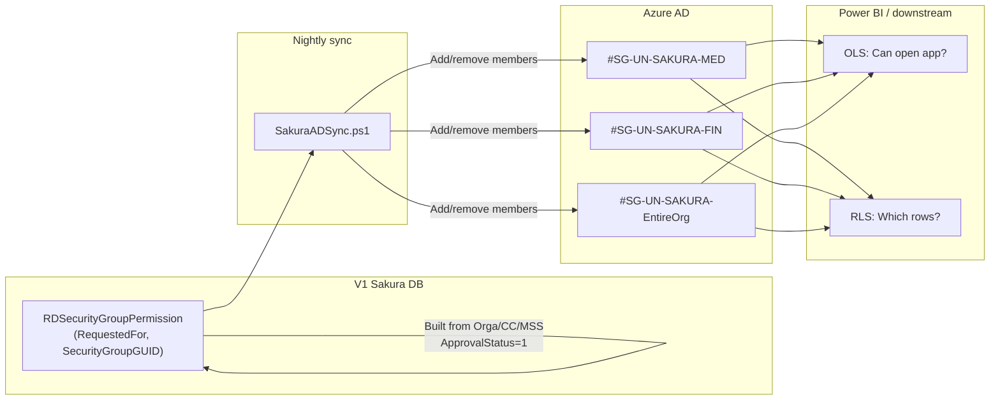
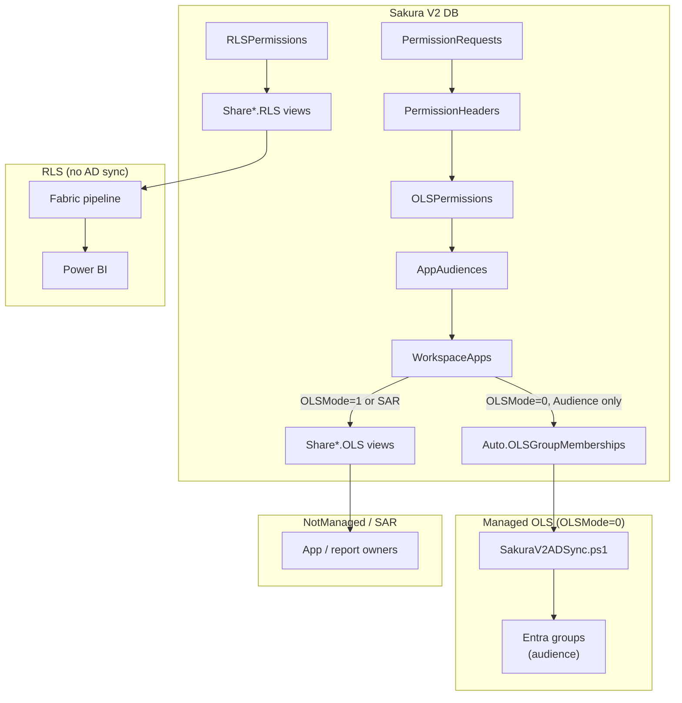
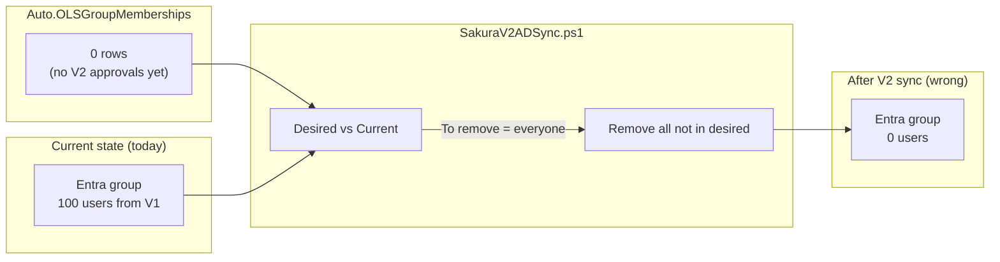
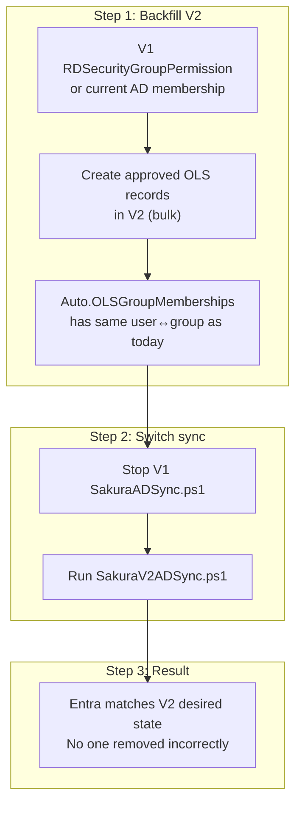

# OLS & RLS Maintenance — Whole Picture (V1, V2, App/Report, RLS)

**Purpose:** One clean reference for how OLS and RLS are maintained in Version 1, how they are maintained in Version 2, who consumes what (app audience, report, downstream), and how to handle the transition so existing users do not lose access.

---

## 1. Quick Definitions

| Term | Meaning | Who enforces |
|------|--------|----------------|
| **OLS (Object-Level Security)** | Which **reports or audiences** a user can open | Power BI / Entra group membership + (for NotManaged) app owners |
| **RLS (Row-Level Security)** | Which **rows/data** the user sees inside the report | Downstream Fabric pipeline + Power BI semantic model |

Sakura **does not enforce** either. Sakura records requests, runs approvals, stores approved state, and **exposes views**. Downstream (Fabric/EDP + Power BI) and/or app owners consume those views and enforce access.

**Are all standalone reports (SAR) unmanaged?**  
**Yes.** The logic that makes SAR **never** managed by the sync is below.

**Logic (why SAR cannot be managed — answer = No):**

| Check | Where | Result |
|-------|--------|--------|
| What does the sync view include? | `Auto.OLSGroupMemberships` | Only rows where `OLS.OLSItemType = 1` (Audience). SAR permissions have `OLSItemType = 0` (WorkspaceReport). So SAR rows are **excluded** by the view. |
| What does the view join to? | Same view | `OLS.OLSItemId` is joined to `AppAudiences.Id`. For SAR, `OLSItemId` points to `WorkspaceReports.Id`, not an audience. So SAR never matches the join. |
| Is there a “managed” flag for reports? | `WorkspaceReports` table | No. `OLSMode` exists only on **WorkspaceApps**. Reports do not have Managed/NotManaged; the design is “sync = Audience + Managed app only.” |

**Conclusion:** By design, SAR never appears in `Auto.OLSGroupMemberships`, so the sync script never adds/removes users to SAR report Entra groups. Access to SAR is maintained by report owners via `Share[Domain].OLS`. So **all SAR are unmanaged** (no logic path makes them managed).

**Can we change the logic to support managed SAR?**  
**Yes.** You can support sync-managed SAR by changing the logic in one place: the **`Auto.OLSGroupMemberships`** view. The sync script already works on any `(RequestedFor, EntraGroupUID)` list; it does not care whether the group is an audience or a report group.

| What to change | How |
|----------------|-----|
| **View** | Add a second branch (e.g. `UNION ALL`) that selects from `OLSPermissions` where `OLSItemType = 0` (WorkspaceReport), join to `WorkspaceReports` on `OLS.OLSItemId = WR.Id`, and output `PR.RequestedFor`, `WR.ReportEntraGroupUID AS EntraGroupUID`, and `LastChangeDate`. Filter to `WR.ReportDeliveryMethod = 1` (SAR) and `WR.ReportEntraGroupUID IS NOT NULL` so only SAR with a group are included. |
| **Which SAR are managed?** | Option A: **All SAR** that have `ReportEntraGroupUID` set → sync manages them. Option B: Add a column on `WorkspaceReports` (e.g. `SyncReportOLS` BIT or `ReportOLSMode` 0/1) and in the view filter to that flag so only chosen reports are sync-managed. |
| **Script** | No change. `SakuraV2ADSync.ps1` already reads `RequestedFor`, `EntraGroupUID`, `LastChangeDate` and diffs to AD. |

After the view change, approved OLS for those SAR would flow into the view and the nightly sync would add/remove users to the report’s Entra group the same way it does for audiences.

**In Sakura V2, are users added to app or audience or both?**  
**Audience only.** The sync script reads `Auto.OLSGroupMemberships`, which uses **`AppAudiences.AudienceEntraGroupUID`** only. It does **not** use `WorkspaceApps.AppEntraGroupUID` (the app-level group). So for Managed OLS in V2, users are added to the **audience** Entra group(s) they are approved for, not to the app-level group. If an app has an `AppEntraGroupUID`, that group is not populated by Sakura sync — it would be maintained separately (e.g. manually or by another process).

| Level | Column | Used by sync? |
|-------|--------|----------------|
| **App** | `WorkspaceApps.AppEntraGroupUID` | No |
| **Audience** | `AppAudiences.AudienceEntraGroupUID` | Yes |

---

## 2. How OLS Is Maintained in Version 1

### 2.1 Source of truth (desired state)

- **Database:** Sakura **V1** (`Sakura` database).
- **View:** `dbo.RDSecurityGroupPermission`.
- **Columns:** `RequestedFor` (user email), `SecurityGroupName`, `SecurityGroupGUID` (Entra group Object ID), `LastChangeDate`.
- **Logic:** Built from approved requests: `RequestType IN (0, 2, 7)` (Orga, Cost Center, MSS). Every approved user is also added to the “EntireOrg” group (see group list below).
- **Approval:** `ApprovalStatus = 1` (V1 convention; V2 uses 2 for Approved).

### 2.2 Sync to Azure AD (who actually gets access)

- **Script:** `SakuraADSync.ps1` (V1).
- **Reads:** `SELECT RequestedFor, SecurityGroupName, SecurityGroupGUID, LastChangeDate FROM dbo.RDSecurityGroupPermission`.
- **Does:** For each distinct `SecurityGroupGUID`, gets current members from Graph, diffs desired vs current, **adds** missing users (batch 20) and **removes** users no longer in desired state.
- **Auth:** Now uses **service principal** (ClientSecretCredential) so it can run in automation; originally interactive (browser), which failed in scheduled runs.

### 2.3 V1 groups (UAT vs Prod)

- **UAT:** Group names end with `-UAT` (e.g. `#SG-UN-SAKURA-FIN-UAT`, `#SG-UN-SAKURA-EntireOrg-UAT`).
- **Prod:** Same logical groups without suffix (e.g. `#SG-UN-SAKURA-FIN`, `#SG-UN-SAKURA-EntireOrg`).
- The **same script** runs against one environment; the **database** (V1) holds the environment-specific group GUIDs/names. So V1 “maintenance” is: keep `RDSecurityGroupPermission` populated from approved requests, run `SakuraADSync.ps1` so Entra matches that desired state.

### 2.4 Who uses this in V1

- **App/report access:** Entirely via **Entra security group membership**. Power BI uses these groups to allow “see this app/report.” No separate “Share OLS” view for app owners in V1; sync script is the only bridge from Sakura DB to AD.

### 2.5 How RLS worked in Version 1

In V1 there was **no separate RLS storage or pipeline**. Row-level “which data can this user see?” was enforced the **same way** as OLS:

- **Single mechanism:** Azure AD group membership. The view `RDSecurityGroupPermission` was built from request types **Orga (0), Cost Center (2), and MSS (7)**. Which group(s) a user was in encoded both “can open this app” and “which scope of data” (entity, cost center, MSS, etc.). Power BI (or the downstream semantic model) used **group membership** to decide which rows a user could see.
- **No separate RLS sync:** `SakuraADSync.ps1` was the only sync; it handled both OLS and RLS because both were represented by the same AD groups. There were no dedicated “Share RLS” views or a separate RLS processing pipeline in the V1 design.
- **Latency:** Up to **24 hours** — users got row-level access on the next nightly sync after approval.
- **Contrast with V2:** V2 stores RLS in `RLSPermissions` and domain detail tables, exposes `Share*.RLS` views, and the downstream Fabric pipeline builds the 5 security tables (DimSecurityProfile, FactSecurity, etc.). So in V2, RLS is **view-driven** and does not depend on AD group membership. In V1, RLS was **group-driven** only.

---

## 3. How OLS Is Maintained in Version 2

### 3.1 Two modes: Managed vs NotManaged

| Mode | Meaning | Who maintains Entra membership |
|------|--------|---------------------------------|
| **Managed (OLSMode = 0)** | Sakura automates group membership | Nightly sync script (`SakuraV2ADSync.ps1`) |
| **NotManaged (OLSMode = 1)** | Sakura only records approval | App owners (read `Share[Domain].OLS` and manage their own groups/apps) |

### 3.2 Managed OLS — desired state and sync

- **Database:** Sakura **V2** (`SakuraV2` or project’s V2 DB).
- **View:** `Auto.OLSGroupMemberships`.
- **Columns:** `RequestedFor`, `EntraGroupUID`, `LastChangeDate`.
- **Logic (conceptually):**  
  Approved OLS (`PermissionHeaders.ApprovalStatus = 2`, `PermissionType = 0`) → `OLSPermissions` → **AppAudience** only (`OLSItemType = 1`) → join `AppAudiences` (with `AudienceEntraGroupUID` not null), `WorkspaceApps` (OLSMode = 0, active), `Workspaces` (active).  
  **Standalone reports (SAR)** and **NotManaged** apps are **excluded**; the sync script does not touch those groups.
- **Script:** `SakuraV2ADSync.ps1` reads `Auto.OLSGroupMemberships`, resolves emails to Object IDs, then for each `EntraGroupUID` diffs desired vs current AD and adds/removes members (same algorithm as V1).

So for **Managed** app audiences in V2:

- **Maintenance:** Keep V2 permission data correct (approve/revoke in Sakura); the view reflects approved state; the sync script makes Entra match that state.

### 3.3 NotManaged OLS — app owners and reports

- **Consumers:** App owners / workspace technical owners.
- **Views:** `ShareAMER.OLS`, `ShareEMEA.OLS`, `ShareGI.OLS`, `ShareFUM.OLS`, `ShareCDI.OLS`, `ShareWFI.OLS`.
- **Content:** Approved OLS only (`ApprovalStatus = 2`), for **NotManaged** apps and for **standalone reports (SAR)**.  
  Each row gives: user (`RequestedFor`), item (audience or report), `OLSEntraGroupId` (which Entra group to use if they manage by group), app/workspace metadata.
- **Maintenance:** Sakura maintains the data; **app owners** maintain actual access (e.g. add/remove users in Power BI or in their own systems using the view as the source of truth).

So for **app audience (NotManaged)** and **report (SAR)** in V2:

- **OLS is “maintained”** by: (1) Sakura storing approvals and exposing `Share*.OLS`, (2) app owners (or downstream) reading those views and applying changes in their systems.

---

## 4. How RLS Is Maintained in Version 2

- **Stored in Sakura:** RLS is stored as separate permission records (e.g. `RLSPermissions` + domain detail tables like `RLSPermissionAMERDetails`, `RLSPermissionFUMDetails`, etc.). Approvers approve RLS independently from OLS.
- **Exposed to downstream:** Domain-specific **Share RLS views** (e.g. `ShareFUM.RLS`, `ShareGI.RLS`, `ShareCDI.RLS`, `ShareWFI.RLS`). These are the **same** as documented in `RLS_System_Documentation.md`: they feed the integration layer (e.g. `LH_CENTRAL_SILVER`), then domain silver/gold, which build the 5 core security tables (DimSecurityProfile, DimAdAccountSecurityProfileMapping, Request tables, DimSecurity, FactSecurity). Power BI then applies RLS via the filter chain (user email → SecurityProfileId → FactSecurity → DimSecurity → fact rows).
- **Maintenance:**  
  - **Sakura:** Request/approve/revoke RLS; views only expose approved state.  
  - **Downstream:** Pipelines refresh from those views on a schedule (e.g. every 4 hours for FUM/GI). No AD sync for RLS; RLS is view-driven end-to-end.

So **RLS in V2** is maintained by: (1) keeping RLS permissions and detail tables correct in Sakura, (2) downstream pipelines and Power BI consuming the Share RLS views and applying the documented processing.

---

## 5. Your Current Groups (`exportgroup.csv`) and How They Fit

- **exportgroup.csv** is an export of **current Entra (Azure AD) security groups** (displayName, id, etc.). It includes:
  - **Prod-style** names (e.g. `#SG-UN-SAKURA-FIN`, `#SG-UN-SAKURA-Overall`, `#SG-UN-SAKURA-RLS`).
  - **UAT-style** names (e.g. `#SG-UN-SAKURA-MED-UAT`, `#SG-UN-SAKURA-EntireOrg-UAT`).
  - **Other** groups (e.g. `#SG-UN-SAKURA-DWI-*`, `#SG-UN-SAKURA-DFI-*`, PowerUser, Admin, etc.).

So in practice you have **one tenant** with a mix of UAT and Prod (and other) groups. Who is in each group is determined by:

- **V1:** Whatever `SakuraADSync.ps1` last wrote, based on `dbo.RDSecurityGroupPermission` (V1 DB).
- **V2:** For any group that V2 “owns” (Managed app audiences whose `AudienceEntraGroupUID` points to that group), membership would be driven by `Auto.OLSGroupMemberships` once you run `SakuraV2ADSync.ps1` and no longer run V1 sync for that group.

**Important:** If a group is still fed **only** by V1, then switching to V2 sync **without** backfilling V2 desired state will make the sync script think “desired = what’s in `Auto.OLSGroupMemberships`”. If that view is empty (or has only new V2 requests), the script will **remove** everyone who was added under V1. So “current groups” stay correct only if the **source of truth** for each group (V1 view vs V2 view) is populated and the **correct script** is run for that source.

---

## 6. Why `Auto.OLSGroupMemberships` Can Be “Empty” and the Risk

- **Why it can be empty:**  
  `Auto.OLSGroupMemberships` is built **only** from V2 tables: approved OLS on **AppAudience** items for **Managed** apps with a non-null `AudienceEntraGroupUID`. If you have not yet created (or approved) permission requests in V2 for those audiences, the view returns no rows (or only a few for new requests).

- **Consequence:**  
  The V2 sync script treats the view as the **full** desired state. So for each group it syncs:
  - Desired = rows from `Auto.OLSGroupMemberships` for that `EntraGroupUID`.
  - Current = members in Entra.
  - It **removes** anyone in Entra who is not in desired.  
  So if you run **only** V2 sync against groups that today are populated by V1, and the view has no (or few) rows, **existing users will be removed** and will lose access.

- **Conclusion:**  
  OLS in V2 can only be “maintained” safely for those groups **after** the desired state in V2 is populated. Until then, either keep using V1 sync for those groups, or backfill V2 (see below).

---

## 7. How to Solve This in Enterprise Maintenance (Approach per Issue)

### Issue 1: “Auto.OLSGroupMemberships is empty; we only have new permission requests in V2.”

- **Approach:**  
  - Do **not** run `SakuraV2ADSync.ps1` against production Managed-audience groups until the **desired** state for those groups exists in V2.  
  - Options:  
    - **A.** Keep running **V1** sync (`SakuraADSync.ps1`) for existing V1-backed groups; use V2 sync only for **new** V2-only groups (if any), **or**  
    - **B.** **Backfill** V2: for each user who should stay in each Managed audience, create (or bulk-import) an approved OLS permission in V2 so that `Auto.OLSGroupMemberships` contains the same (user, EntraGroupUID) pairs as today in AD. Then switch to V2 sync for those groups and retire V1 sync for them.

### Issue 2: “We want one script and one source of truth (V2).”

- **Approach:**  
  1. **Backfill** desired state in V2: e.g. script or bulk load that creates approved OLS permission records (and headers) so that `Auto.OLSGroupMemberships` outputs one row per (user, group) that must remain.  
  2. **Validate:** Run `SELECT RequestedFor, EntraGroupUID FROM Auto.OLSGroupMemberships` and compare to current AD (or to V1’s `RDSecurityGroupPermission`).  
  3. **Switch:** Point the nightly job to `SakuraV2ADSync.ps1` and V2 DB; stop running V1 sync for those groups.  
  4. From then on, **maintain** OLS in V2 only (request/approve/revoke in Sakura); the sync script keeps Entra in line.

### Issue 3: “Who maintains what for app audience vs report?”

- **Managed app audience:** Sakura + sync script maintain; app owners do nothing for group membership.  
- **NotManaged app audience / SAR report:** Sakura maintains approval data and `Share*.OLS` views; **app owners** (or report owners) maintain actual access using those views.  
- **RLS:** Sakura maintains RLS permissions; **downstream pipeline** maintains the 5 security tables and Power BI applies RLS; no AD sync for RLS.

### Issue 4: “UAT vs Prod groups in one tenant.”

- **Approach:**  
  - In **V1:** `RDSecurityGroupPermission` (and underlying data) must use the correct group GUID/name per environment (UAT vs Prod). Same script, different DB or environment config.  
  - In **V2:** `AppAudiences.AudienceEntraGroupUID` (and report groups if you ever sync them) must point to the right group per environment.  
  - Your **exportgroup.csv** is a snapshot of all groups in the tenant; map which GUIDs are UAT vs Prod and ensure Sakura (V1 or V2) references the right GUIDs for the environment you are syncing.

### Issue 5: “Existing users already in groups; we only add new users via auto (desired state).”

- **Clarification:** The sync script does **not** “only add.” It **reconciles**: desired (from DB/view) vs current (from AD). So if desired state does not include existing users, they will be **removed**.  
- **Approach:** Ensure **desired state** includes every user who must keep access. That means either:  
  - Backfill V2 so `Auto.OLSGroupMemberships` includes those users, **or**  
  - Keep using V1’s `RDSecurityGroupPermission` (and V1 sync) until V2 desired state is fully populated.

---

## 8. One-Page Summary Table

| Aspect | V1 | V2 |
|--------|----|----|
| **OLS desired state** | `dbo.RDSecurityGroupPermission` (V1 DB) | `Auto.OLSGroupMemberships` (V2 DB) for Managed audiences |
| **OLS sync script** | `SakuraADSync.ps1` → adds/removes to match `SecurityGroupGUID` | `SakuraV2ADSync.ps1` → adds/removes to match `EntraGroupUID` |
| **Who gets OLS (Managed)** | Script adds users to Entra groups | Same; script reads V2 view |
| **Who gets OLS (NotManaged / SAR)** | N/A (V1 was effectively all “managed” by sync) | App owners use `Share[Domain].OLS` and manage their own systems |
| **RLS desired state** | Not stored separately; encoded in which AD group user is in (Orga/CC/MSS) | In V2 `RLSPermissions` + domain detail tables |
| **RLS “sync”** | Same as OLS — one sync added user to groups; Power BI used group for row filtering | Downstream reads `Share*.RLS` views; pipeline builds 5 tables; no AD sync |
| **App audience** | Via Entra groups from V1 sync | Managed: sync script; NotManaged: app owner + Share OLS views |
| **Report** | Via same Entra groups in V1 | SAR: app/report owner + Share OLS; report-level Entra groups not synced by script |
| **Risk if switching to V2 sync with empty view** | N/A | Everyone in those groups is removed → **backfill desired state first** |

---

## 9. Mermaid diagrams

### 9.1 V1 — OLS and RLS (one mechanism)

In V1, one sync and one set of AD groups controlled both “can open app/report” and “which rows you see.”

**Takeaway:** One view → one script → same groups for both OLS and RLS. No separate RLS storage.

---

### 9.2 V2 — OLS (Managed vs NotManaged) and RLS (separate)

In V2, OLS splits into Managed (sync) vs NotManaged (Share views); RLS is view-driven only.

**Takeaway:** Managed = sync script; NotManaged/SAR = Share*.OLS → app owners; RLS = Share*.RLS → pipeline only.

---

### 9.3 The issue — empty view + V2 sync removes everyone

If you run V2 sync before backfilling, desired state is empty so the script removes all current members.

**Problem:** Desired = 0 rows → script removes everyone → users lose access.

---

### 9.4 Best way to solve — backfill then switch

Populate V2 desired state first, then run V2 sync so the script only adds/removes to match that state.

**Takeaway:** Do **not** run V2 sync on production groups until `Auto.OLSGroupMemberships` is populated (backfill). Then switch from V1 to V2 sync.

---

## 10. References in This Repo

- **OLS vs RLS, who enforces:** `Docs/OLS_RLS_AND_DOWNSTREAM_ENFORCEMENT.md`  
- **OLS item types (Report vs Audience):** `Docs/OLS_ITEM_TYPE_REFERENCE.md`  
- **AD sync (V1 and V2) in detail:** `Docs/AD_SYNC_DEEP_REFERENCE.md`  
- **RLS pipeline (5 tables, Power BI):** `Docs/RLS_System_Documentation.md`  
- **V2 view used by sync:** `Sakura_DB/Auto/OLSGroupMemberships.sql`  
- **Share OLS (NotManaged / SAR):** `Sakura_DB/Share/Views/OLS/Share*.OLS.sql`  
- **Current Entra groups (your snapshot):** `exportgroup.csv`

---

*Last updated: March 2025. Use this doc to explain the whole scenario to app audience, report, and enterprise stakeholders.*
