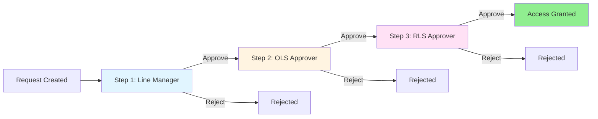
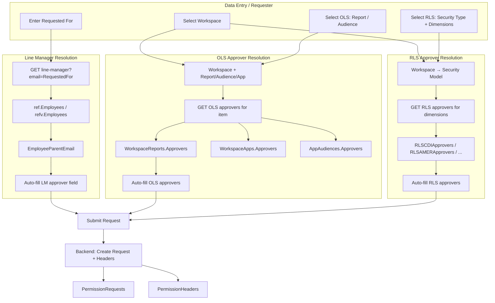
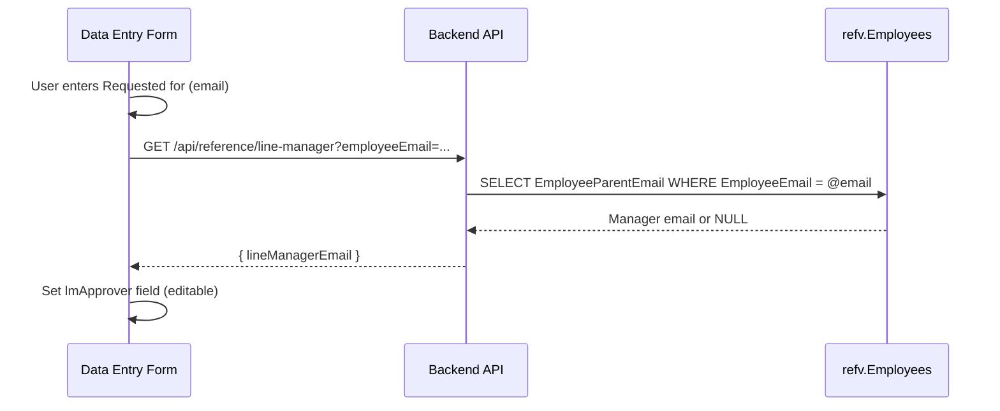
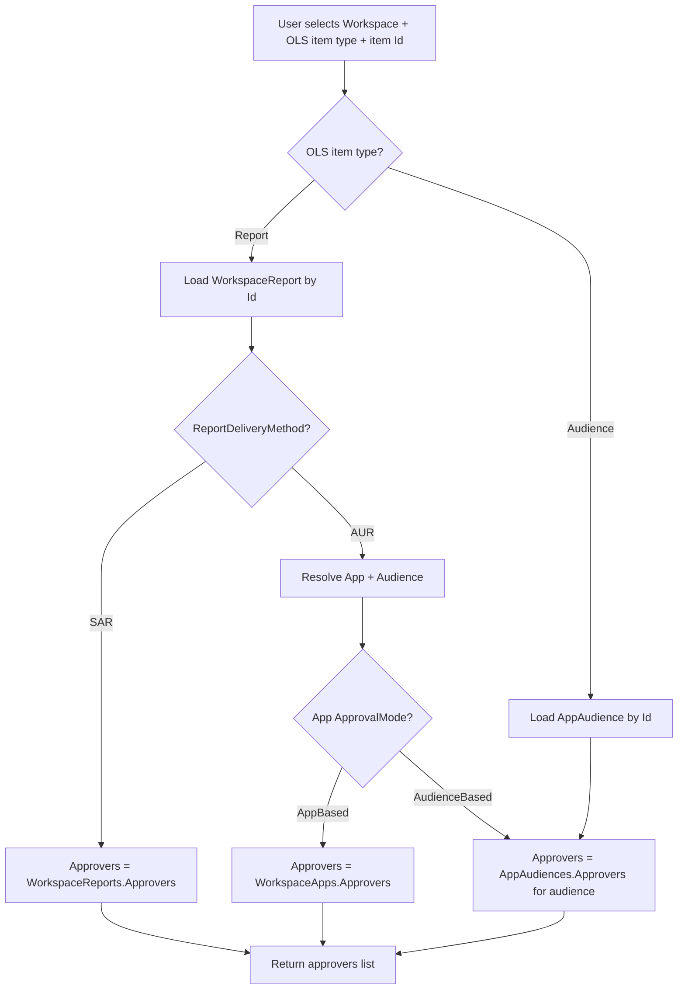
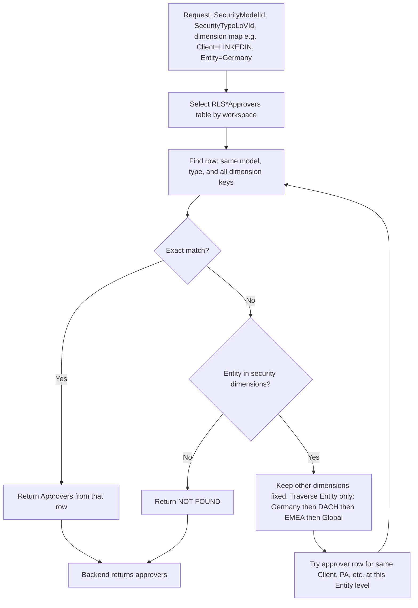
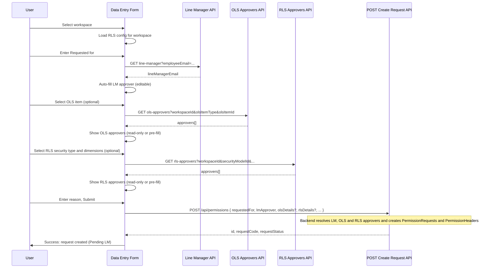

# Approver Finding Logic — End-to-End Flow

This document describes **how approvers are (or should be) found** across Sakura: from Data Entry when creating a request, through DB, Backend, and Frontend. It includes the **actual logic**, **current gaps**, and **recommended flow** so that:

1. **Line Manager** is auto-populated when the user enters "Requested for".
2. **OLS/RLS approvers** are auto-populated after the user selects OLS item (report/audience) and/or RLS dimensions.

---

## 1. Enterprise Flow Overview (Sakura)

In Sakura, every permission request goes through a **three-step approval chain**:

- **LM (Line Manager):** "Does this employee need this access?" — Source: **Workday / ref.Employees** (manager of RequestedFor).
- **OLS Approver:** "Should this user see this report/audience?" — Source: **WorkspaceReports.Approvers**, **WorkspaceApps.Approvers**, or **AppAudiences.Approvers** depending on delivery mode.
- **RLS Approver:** "Should this user see this data?" — Source: **RLS*Approvers** tables (per workspace: CDI, AMER, EMEA, FUM, GI, WFI) matched by SecurityModelId, SecurityTypeLoVId, and dimension keys.

So **approver finding** must resolve:

1. **LM** from **RequestedFor** (employee) → line manager email.
2. **OLS** from **Workspace + OLS item** (report Id or audience Id + app context) → approver list.
3. **RLS** from **Workspace + Security Model + Security Type + dimension selections** → approver list. **Traversal** (when no exact match) applies **only to the Organisation/Entity** dimension; other dimensions are not traversed (see §6.3 and FDD § "Traversing The Approver Tree").

---

## 2. High-Level Data Flow (Where Approvers Come From)

---

## 3. Database Level — What Exists Today

### 3.1 Line Manager (LM)

| Asset | Purpose |
|-------|--------|
| **ref.Employees** | MapKey, EmployeeCode, EmployeeName, EmployeeEmail, **ManagerMapKey** |
| **refv.Employees** | View: EmployeeEmail, **EmployeeParentEmail** (manager email via JOIN to parent) |

**Logic:** For a given `RequestedFor` (employee email), LM = `EmployeeParentEmail` from `refv.Employees` where `EmployeeEmail = RequestedFor`.

- **Present:** ref tables and view exist; Script_Populate uses `COALESCE(e.EmployeeParentEmail, r.RequestedFor)` for LM when seeding.
- **Missing at API level:** No backend endpoint that returns line manager for an employee email. So the **frontend cannot auto-fill LM** from the DB today.

### 3.2 OLS Approvers

| Table | Approvers stored | When used |
|-------|------------------|-----------|
| **WorkspaceReports** | `Approvers` (NVARCHAR(1024), semicolon-separated) | Standalone reports (SAR) |
| **WorkspaceApps** | `Approvers` | When ApprovalMode = AppBased |
| **AppAudiences** | `Approvers` | When parent app ApprovalMode = AudienceBased |

**Logic:**

- **Standalone report:** OLS approver = `WorkspaceReports.Approvers` for that ReportId (and WorkspaceId).
- **Report in App, AppBased:** OLS approver = `WorkspaceApps.Approvers` for that AppId.
- **Report in App, AudienceBased:** OLS approver = `AppAudiences.Approvers` for the chosen AudienceId (and AppId).

All approver columns use the same delimiter (`;` in domain layer, see `ApproverExtensions.Delimiter`).

- **Present:** Tables and columns exist; WSO Console and backend services read/write them.
- **Missing for Data Entry:** No single backend API that, given `workspaceId + olsItemType + olsItemId` (and app/audience context if needed), returns the resolved OLS approver list for **preview** or for **create**.

### 3.3 RLS Approvers

| Table | Key columns | Purpose |
|-------|-------------|---------|
| **RLSCDIApprovers** | SecurityModelId, SecurityTypeLoVId, EntityKey, EntityHierarchy, ClientKey, ... | CDI workspace |
| **RLSAMERApprovers** | SecurityModelId, SecurityTypeLoVId, EntityKey, SLKey, ClientKey, PCKey, CCKey, PAKey, MSSKey, ... | AMER workspace |
| **RLSEMEAApprovers** | (similar dimension keys) | EMEA |
| **RLSFUMApprovers**, **RLSGIApprovers**, **RLSWFIApprovers** | (per-workspace dimensions) | FUM, GI, WFI |

**Logic:** RLS approver = row(s) in the workspace-specific RLS*Approvers table where:

- `SecurityModelId` and `SecurityTypeLoVId` match the request’s security model and security type.
- Dimension keys (EntityKey, ClientKey, SLKey, etc.) match the user’s selections. If no match and the model uses **Entity**, the system may **traverse only the Entity hierarchy** (Market → Cluster → Region → Global), **keeping all other dimensions (e.g. Client) fixed** — see FDD § "Traversing The Approver Tree". Other dimensions (Client, PA, MSS, etc.) are **not** traversed.

- **Present:** All RLS*Approvers tables exist; backend has `RLSApproverService` for CRUD by workspace (AMER, CDI, EMEA, FUM, GI, WFI).
- **Missing for Data Entry:** No backend API that, given `workspaceId, securityModelId, securityTypeLoVId, dimension key-value map`, **resolves** the RLS approver list (with entity-only traversal when Entity is in the model; other dimensions fixed). So the **frontend cannot auto-fill RLS approvers** from the DB today.

### 3.4 Permission Request and Headers

| Table | Relevant columns |
|-------|-------------------|
| **PermissionRequests** | RequestedFor, RequestedBy, **LMApprover**, RequestStatus, RequestReason, WorkspaceId |
| **PermissionHeaders** | PermissionRequestId, PermissionType (0=OLS, 1=RLS), **Approvers**, ApprovalStatus, ApprovedBy, ... |

When a request is **created**, backend must:

1. Insert **PermissionRequests** with **LMApprover** set (either from client or resolved from ref.Employees).
2. Insert one or two **PermissionHeaders** (OLS and/or RLS) with **Approvers** set (either from client or resolved from WorkspaceReports/Apps/Audiences and RLS*Approvers).

Today: **No POST create API** exists; backend only has GET list/details. So creation (and thus writing LM + OLS/RLS approvers) is not implemented.

---

## 4. Backend Level — What Exists Today

### 4.1 Line Manager

- **No** dedicated API to get line manager for an employee.
- **MockDataService** (frontend) has `getLineManager(employeeUPN)` returning mock data; no backend equivalent.

**Needed:** e.g. `GET /api/reference/line-manager?employeeEmail={requestedFor}` returning `{ lineManagerEmail: string | null }` using refv.Employees (or equivalent).

### 4.2 OLS Approver Resolution

- **WorkspaceReportService**, **WorkspaceAppService**, **AppAudienceService** read/update **Approvers** on reports, apps, and audiences.
- **No** single “resolve OLS approver for this catalog item” API that:
  - Input: workspaceId, olsItemType (Report/Audience), olsItemId (and if audience: appId or context).
  - Output: list of approver emails (for that report, or that app, or that audience depending on delivery/approval mode).

**Needed:** e.g. `GET /api/workspaces/{workspaceId}/ols-approvers?olsItemType=Report&olsItemId=123` (and similar for Audience with appId) returning `{ approvers: string[] }`.

### 4.3 RLS Approver Resolution

- **RLSApproverService** provides **GetAsync** and **UpsertAsync** per workspace (per security model and type) for **admin** CRUD of RLS approver rows.
- **No** “resolve RLS approver for this request context” API that:
  - Input: workspaceId, securityModelId, securityTypeLoVId, dimension key-value map (e.g. entityKey, clientKey, ...).
  - Logic: Match against the correct RLS*Approvers table; if no exact match and the model has Entity, traverse **only Entity** (Market→Cluster→Region→Global), keeping all other dimensions fixed; return the approver list.

**Needed:** e.g. `GET /api/workspaces/{workspaceId}/rls-approvers?securityModelId=1&securityTypeLoVId=2&entityKey=DE&...` or a POST with a body for dimensions, returning `{ approvers: string[] }`.

### 4.4 Create Permission Request (POST)

- **WorkspaceRequestController** exposes only:
  - GET list, GET by id, GET by workspace.
- **No** POST to create a permission request.

So even if the frontend had LM and OLS/RLS approvers, there is **no backend** to accept a create payload and persist PermissionRequests + PermissionHeaders (with approvers). See **PERMISSION_REQUEST_TABULAR_AND_APPROVAL_CHANGES.md** for the full required backend design (PermissionRequestRow, PermissionHeaderRow, CreatePermissionRequestAsync, approver resolution inside create, etc.).

---

## 5. Frontend Level — What Exists Today

### 5.1 Data Entry — Permission Request Form

**File:** `permission-requests-entry.component.ts` / `.html`

| Field | Current behavior | Desired behavior |
|-------|------------------|-------------------|
| **Requested for** | Manual text input | Same; on blur/change → **auto-fill LM approver** from API. |
| **LM approver** | **Manual text input** (required) | **Auto-populated** from line-manager API when Requested for is set; editable as override. |
| **OLS** (item type + report/audience id) | Manual input | After OLS selection → call **OLS approver API** and show (or pre-fill) OLS approvers. |
| **RLS** (security type + dimensions) | Dropdowns per workspace config | After RLS dimensions selected → call **RLS approver API** and show (or pre-fill) RLS approvers. |

- **DataEntryLookupService** provides workspaces, apps, security models, LoVs; it does **not** provide line manager or OLS/RLS approver resolution.
- **PermissionRequestService.createRequest** sends `CreatePermissionRequestRequest` (including `lmApprover`) to `POST /permissions`; in real API mode this endpoint does not exist (mock returns success).

So today:

1. **Line manager is not auto-populated** — no API, form uses manual LM input.
2. **OLS/RLS approvers are not auto-populated** — no API to resolve them; form does not show or pre-fill approvers after OLS/RLS selection.

### 5.2 Request Wizard / Other Flows

- **request-domain.service** (mock) uses `mockDataService.getLineManager(requestedForUPN)` when submitting; **getOLSApprovers** / **getRLSApprovers** exist in MockDataService but are not used in the Data Entry form.
- Wizard/request-form components show **static/mock** approver lists (e.g. Bob Green, Anne Real, Jane Brown) and do not drive them from workspace + OLS/RLS.

---

## 6. Actual Approver Resolution Logic (How It Should Work)

### 6.1 Line Manager Resolution

**Rules:**

- If employee exists in refv.Employees → LM = EmployeeParentEmail.
- If not found or null → LM can default to empty or RequestedFor (per existing script logic); UI can show “No line manager found” and require manual entry.

### 6.2 OLS Approver Resolution

- **Standalone report (SAR):** approvers = `WorkspaceReports.Approvers` for that report.
- **Report in app:** use app’s ApprovalMode: **AppBased** → `WorkspaceApps.Approvers`; **AudienceBased** → `AppAudiences.Approvers` for the relevant audience.
- **Audience only:** `AppAudiences.Approvers` for that audience.

Backend should expose this as one (or two) GET endpoints so the frontend can call after OLS selection and display/auto-fill OLS approvers.

### 6.3 RLS Approver Resolution (traversal: Organisation only, in combination)

**FDD (08-common-functionality):** *"This traversal mechanism is applicable **only to Entity-based Security Models**. Other dimensions do not benefit from hierarchical fallback."* Traversing is done **in combination**: only the **Entity/Organisation** level is relaxed; all other dimensions (Client, PA, MSS, etc.) stay **fixed** at the user’s selection.

**Example (solution-architect guidance):** User selects **LINKEDIN** (client) **in Germany** (entity). No approver for that combination?

- **Correct:** Try **LINKEDIN** at the next Entity level → **LINKEDIN in DACH**, then LINKEDIN in EMEA, then LINKEDIN at Global. (Same client; step up only the Organisation hierarchy.)
- **Incorrect:** Try **MICROSOFT in Germany**. (MICROSOFT is the DSH of LINKEDIN in the Client dimension; we do **not** traverse the Client hierarchy.)

So: **traversal = Organisation only**. If Organisation is not in the security dimension combination, there is no traversal — exact match or NOT FOUND.

- Per-workspace table: CDI → RLSCDIApprovers, AMER → RLSAMERApprovers, etc.
- Match on SecurityModelId, SecurityTypeLoVId, and dimension keys (EntityKey, ClientKey, SLKey, ... as per table).
- **Traversal (only when Entity is in the model):** If no exact match, **keep Client, PA, MSS, etc. unchanged**; traverse **only Entity** upward (Market → Cluster → Region → Global) until an approver row is found. Do **not** traverse Client (e.g. LINKEDIN → DSH/MICROSOFT) or any other dimension (FDD § "Traversing The Approver Tree"; FDD 09 out-of-scope: cross-dimensional traversal is not implemented).
- Return list of emails (semicolon-separated in DB, split to list in API).

---

## 7. End-to-End Flow: Data Entry Create Request (Optimum)

---

## 8. Gap Summary and Checklist

### 8.1 Is Everything in Place?

| Layer | Line Manager | OLS Approvers | RLS Approvers | Create Request |
|-------|--------------|---------------|---------------|----------------|
| **DB** | ✅ refv.Employees (EmployeeParentEmail) | ✅ WorkspaceReports/Apps/Audiences.Approvers | ✅ RLS*Approvers tables | ✅ PermissionRequests (LMApprover), PermissionHeaders (Approvers) |
| **Backend** | ❌ No line-manager API | ❌ No OLS resolve API | ❌ No RLS resolve API | ❌ No POST create API |
| **Frontend** | ❌ No call to LM API; manual LM input | ❌ No call after OLS selection; no preview | ❌ No call after RLS selection; no preview | ✅ createRequest() exists but POST not implemented |

So: **DB is ready**; **backend and frontend are missing** the resolution APIs and create API, and the frontend does not auto-fill LM or OLS/RLS approvers.

### 8.2 Recommended Implementation Order

1. **Backend: Line manager API**  
   - `GET /api/reference/line-manager?employeeEmail=...` using refv.Employees (or ref.Employees + join).  
   - Frontend: On “Requested for” blur/change, call and set `lmApprover` (editable).

2. **Backend: OLS approver resolution API**  
   - e.g. `GET /api/workspaces/{workspaceId}/ols-approvers?olsItemType=Report&olsItemId=123` (and for Audience with appId/audienceId).  
   - Resolve per WorkspaceReports / WorkspaceApps / AppAudiences rules.  
   - Frontend: After OLS item selection, call and show/pre-fill OLS approvers.

3. **Backend: RLS approver resolution API**  
   - e.g. `GET` or `POST` with workspaceId, securityModelId, securityTypeLoVId, dimension map.  
   - Resolve from correct RLS*Approvers table; entity-only traversal (other dimensions fixed in combination).  
   - Frontend: After RLS dimensions selected, call and show/pre-fill RLS approvers.

4. **Backend: POST create permission request**  
   - Implement as in PERMISSION_REQUEST_TABULAR_AND_APPROVAL_CHANGES.md (PermissionRequestRow, PermissionHeaderRow, CreatePermissionRequestAsync).  
   - Accept LM in payload or resolve from ref when not provided; resolve OLS/RLS approvers when olsDetails/rlsDetails present; create headers with resolved Approvers.

5. **Frontend: Data Entry form**  
   - Wire “Requested for” → line-manager API → auto-fill LM.  
   - Wire OLS selection → OLS approvers API → display/pre-fill.  
   - Wire RLS selection → RLS approvers API → display/pre-fill.  
   - Keep submit → POST create; show success/error and RequestCode.

---

## 9. References

- **FDD:** `FDD/04-approver-role.md` (approval chain, LM/OLS/RLS types), `FDD/08-common-functionality.md` (Traversing The Approver Tree — **Organisation/Entity only**; other dimensions not traversed), `FDD/09-out-of-scope.md` (no cross-dimensional traversal).
- **DB:** `Sakura_DB/Ref/Views/refv.Employees.sql`, `Sakura_DB/Dbo/Tables/WorkspaceReports.sql`, `AppAudiences.sql`, `PermissionRequests.sql`, `PermissionHeaders.sql`, `RLSCDIApprovers.sql`, etc.
- **Backend:** `RLSApproverService`, `AppAudienceService`, `WorkspaceReportService`, `WorkspaceAppService`; `ApproverExtensions` (delimiter).
- **Frontend:** `permission-requests-entry.component.*`, `DataEntryLookupService`, `permission-request.service.ts`, `permission-request-workspace-rls.config.ts`.
- **Roadmap:** `Docs/PERMISSION_REQUEST_TABULAR_AND_APPROVAL_CHANGES.md`, `Docs/ROADMAP_01_TABULAR_CREATE_AND_SINGLE_APPROVAL.md`.
