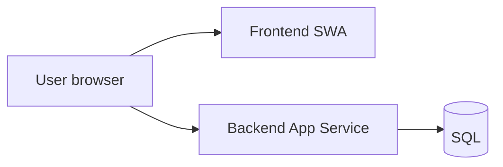
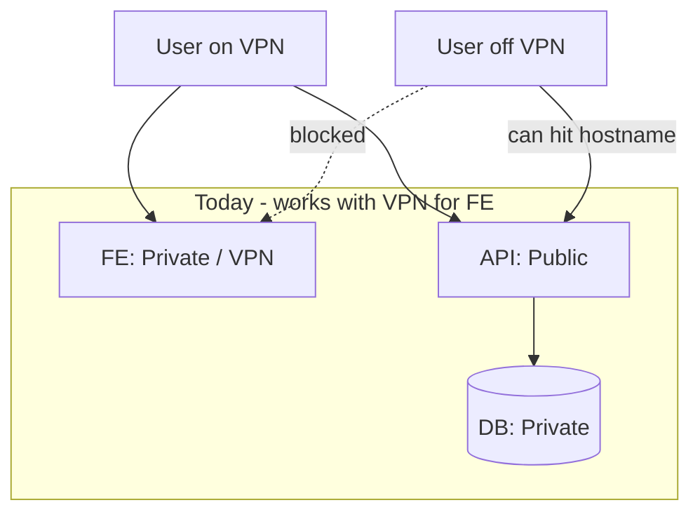
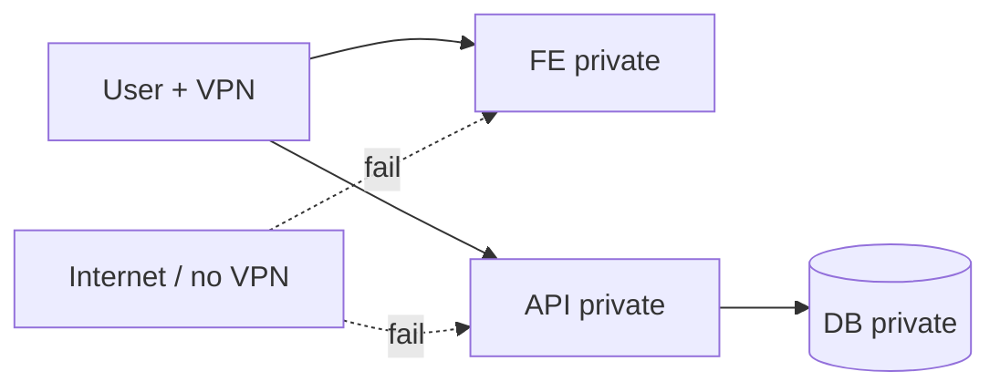
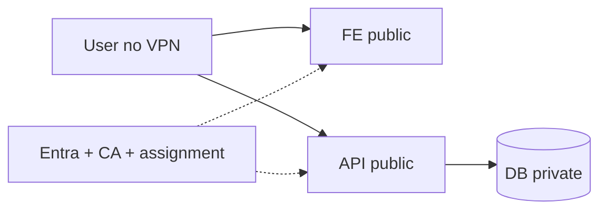
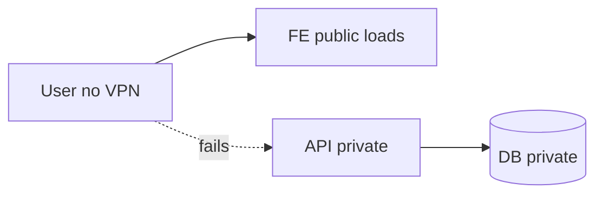
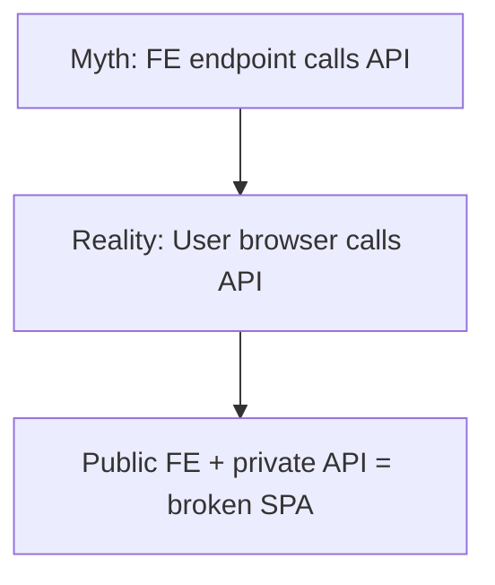
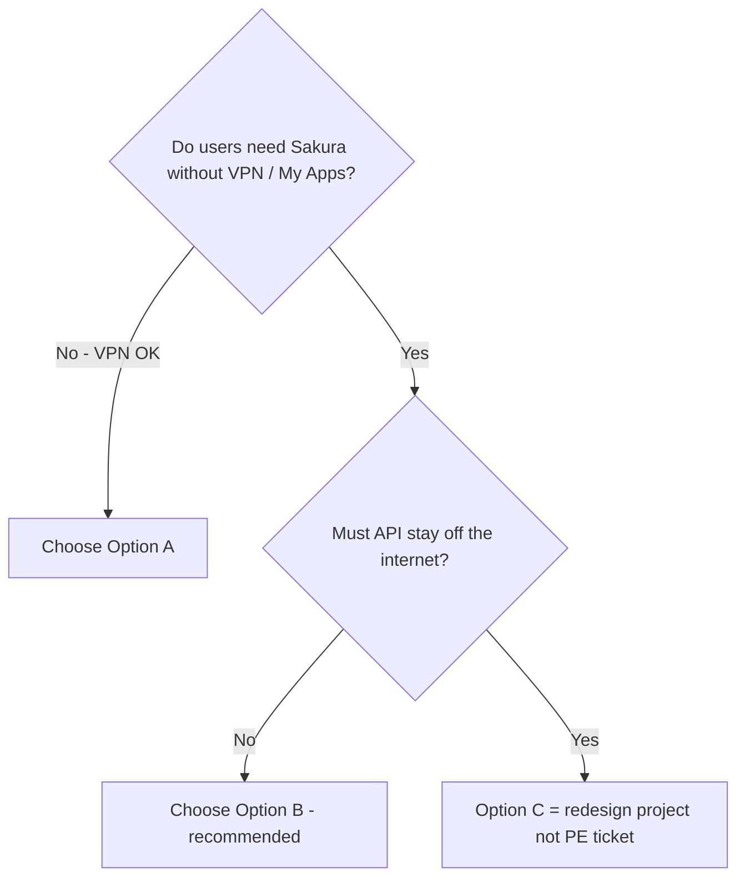
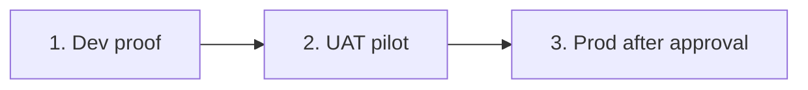
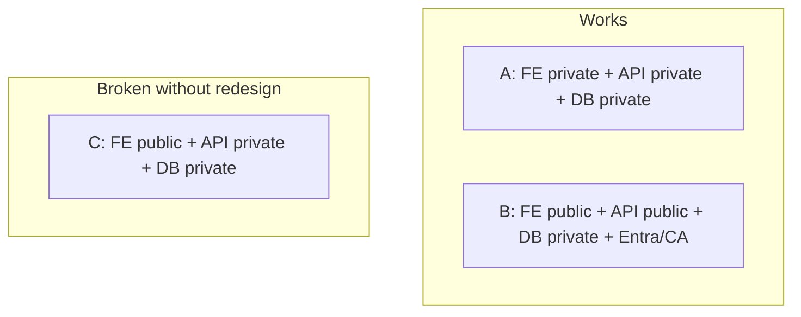

# Sakura — FE / API / DB Network Options (Simple Guide)

**Purpose:** Explain what works end-to-end today, what breaks, what to recommend for YBR and later My Apps, and how to pass a security audit.

**Architecture fact (read once):** Sakura is a **browser SPA**. The user’s browser calls the API **directly**. The Static Web App does **not** proxy API traffic.

---

## 1. Current resources (as deployed)

| Env | Frontend (SWA) | FE URL | FE Private Endpoint | Backend (API) | SQL |
|-----|----------------|--------|---------------------|---------------|-----|
| **Dev** | `azeuw1dswasakura` | `https://orange-sand-03a59b103.3.azurestaticapps.net` | `azeuw1dswasakura_privateendpoint` (`10.19.54.134`) | `azeuw1dweb01sakura` | Private (not public) |
| **UAT / Test** | `azeuw1tswasakura` | `https://lemon-wave-07fa68003.2.azurestaticapps.net` | `azeuw1tswasakura_privateendpoint` (`10.19.54.136`) | `azeuw1tweb01sakura` | Private (not public) |
| **Prod** | `azeuw1pswasakura` | `https://green-stone-0e7ff2e03.2.azurestaticapps.net` | `azeuw1pswasakura_Privateendpoint` (`10.19.50.132`) | `azeuw1pweb01sakura` | `azeuw1psenmastersvrdb01` (private) |

**Shared networking pattern (FE PE):**

| Item | Value |
|------|--------|
| VNet | `AZ-VDC000006-EUW1-NET-CORE` (Dev/UAT pattern) |
| Subnet | `AZ-VDC000006-EUW1-SNET-LZ-CORE-INTERNALSUBNET1` |
| Auth | Entra app **Sakura** (`e73f4528-2ceb-40e3-8e4a-d72287adb4c5`) |

**Today’s posture (typical):**

| Layer | Today | Note |
|-------|--------|------|
| FE | **Private** (PE + public disabled) | Needs VPN |
| API | **Public** (`*.azurewebsites.net`) | Weakest network link |
| DB | **Private** | Browser never talks to DB |

---

## 2. The three options

### Option A — VPN everywhere *(works)*

| Layer | Network |
|-------|---------|
| FE | Private |
| API | Private (PE + public disabled) |
| DB | Private |

| | |
|--|--|
| **Works?** | Yes |
| **My Apps later?** | Tile can exist, but users still need VPN to open the app |
| **Code change?** | No |
| **When to use** | Stay internal / VPN-only (including YBR if everyone is on VPN) |

**Dev API PE ticket target (if choosing A):**  
`azeuw1dweb01sakura` → same VNet/subnet as `azeuw1dswasakura_privateendpoint` → then disable API public access after DNS works.

---

### Option B — Public FE *(works — recommended for My Apps)*

| Layer | Network |
|-------|---------|
| FE | **Public** (remove SWA PE) |
| API | **Public** (keep reachable) |
| DB | **Private** |

| | |
|--|--|
| **Works?** | Yes |
| **My Apps later?** | Yes — normal path |
| **Code change?** | Usually none for network; harden Entra/CA for Prod |
| **When to use** | Security review wants FE without VPN; future My Apps |

**Security replaces VPN** with identity controls (see section 4).  
**Do not** put the API behind VPN-only PE if this is the target.

---

### Option C — Public FE + private API *(broken for current Sakura)*

| Layer | Network |
|-------|---------|
| FE | Public |
| API | Private / VPN-only |
| DB | Private |

| | |
|--|--|
| **Works?** | **No** — UI opens, API calls fail |
| **Why** | Browser calls API directly; no VPN → cannot reach private API |
| **“Allow only from FE endpoint”** | Not possible for this SPA (FE does not call API; the browser does) |
| **Only if redesigned** | BFF / Front Door / reverse proxy (not current Sakura) |

---

## 3. Recommendation (easy decision)

| Goal | Choose | Why (engineering principles) |
|------|--------|------------------------------|
| YBR on VPN only | **A** | Accurate, secure network lock, no redesign |
| YBR / security review without VPN + later My Apps | **B** | Fits existing SPA; simplest working path; maintainable |
| “FE public + API VPN forever” | **C only after redesign** | Current architecture cannot do this reliably |

**Default recommendation for Sakura → My Apps:** **Option B.**  
Keep DB private. Harden API with Entra + Conditional Access + assignment. Do **not** VPN-lock the API.

**If you already raised an API PE ticket (Option A style):**  
Fine for **current VPN posture**. If you later go public FE, you must **re-open API public access** (or redesign). Add that note on the ticket so it does not block the final My Apps process.

---

## 4. How to pass security audit (Option B)

Aligned with: **Correctness → Security → Reliability → No regression**, using **existing** Entra SPA architecture (not Okta Hybrid, not a new proxy).

### 4.1 What auditors care about

| Concern | Answer under Option B |
|---------|------------------------|
| FE on internet | Yes — intentional; gated by Entra login |
| API on internet | Yes — **auth required**; not anonymous |
| DB on internet | **No** — stays private |
| Who can use the app | Enterprise app **assignment** |
| Extra MFA / device rules | **Conditional Access** |
| Cross-env abuse | CORS = that env’s FE origin only |
| VPN | Not required for FE/API reachability |

### 4.2 Evidence checklist (collect these)

1. **InfoSec approval** ticket (public FE approved).  
2. Enterprise app **Sakura** overview (`e73f4528-2ceb-40e3-8e4a-d72287adb4c5`).  
3. **Assignment required = Yes** + Users/groups list.  
4. **Conditional Access** policy screenshots (MFA / compliant device / as InfoSec requires).  
5. **SQL networking** — public access disabled / private only (`azeuw1psenmastersvrdb01` for Prod).  
6. **CORS** — only matching FE origin per env (Dev→Dev, UAT→UAT, Prod→Prod).  
7. **Test proof:** VPN **off** → FE loads → login → one API call succeeds.  
8. Optional My Apps: **Visible to users? = Yes** when Product wants the tile.

### 4.3 Suggested rollout order (no regression)

| Step | FE | API | DB |
|------|----|-----|-----|
| Dev | Remove/disable PE on `azeuw1dswasakura` | Keep `azeuw1dweb01sakura` public | Keep private |
| UAT | Same for `azeuw1tswasakura` | Keep `azeuw1tweb01sakura` public | Keep private |
| Prod | Same for `azeuw1pswasakura` after InfoSec | Keep `azeuw1pweb01sakura` public | Keep `azeuw1psenmastersvrdb01` private |

**Do not** disable API public network access as part of Option B.

### 4.4 One paragraph for InfoSec / audit

> Sakura is a browser SPA: the client calls the App Service API directly. Making the frontend public while locking the API to VPN breaks the application. Our supported model is: **public FE + public API + private SQL**, with **Entra authentication, Conditional Access, and enterprise app assignment** replacing VPN as the access control. Database remains unreachable from the internet. My Apps is an Entra launch surface only; it does not replace these controls.

---

## 5. What not to do

| Action | Result |
|--------|--------|
| Access Restriction “Allow FE VNet only” on API | Breaks SPA (403 / Unable to connect) |
| Public FE + API PE public disabled | Broken for non-VPN users |
| Assume “request from FE hostname” can be enforced on App Service | Not how SPA traffic works |
| Rely on CORS alone as network lock | CORS does not stop Postman/curl |
| Require Okta Hybrid for My Apps | Not needed — Sakura uses Entra |

---

## 6. Quick reference — works vs broken

| Option | FE | API | DB | VPN needed? | My Apps ready? |
|--------|----|-----|-----|-------------|----------------|
| **A** | Private | Private | Private | Yes | Tile only; still VPN |
| **B** ★ | Public | Public | Private | No | Yes |
| **C** | Public | Private | Private | Would need VPN for API | No (broken SPA) |

★ = **Recommended** for public FE / security review without VPN / future My Apps.

---

## Related docs

- `Docs/SAKURA_V2_NETWORK_BEFORE_AFTER_PUBLIC_FE.md` — click-by-click for Option B  
- `Docs/SAKURA_VPN_ACCESS_SECURITY_ASSESSMENT_AND_ROADMAP.md` — broader VPN / security roadmap  
