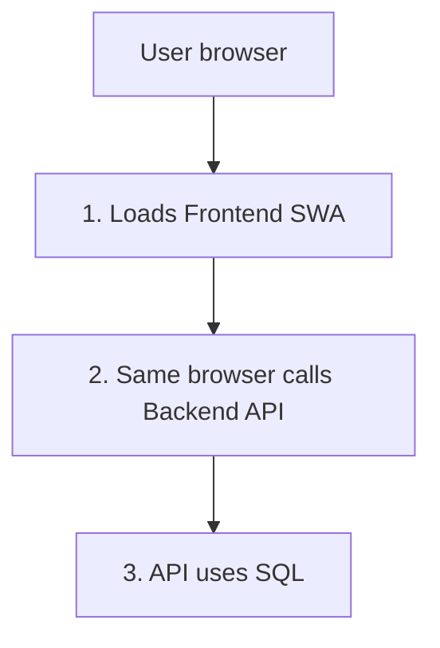
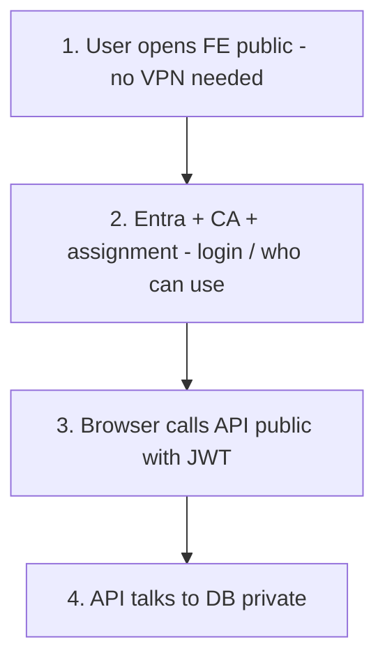
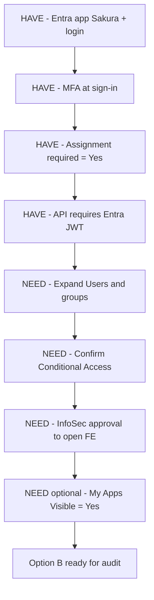
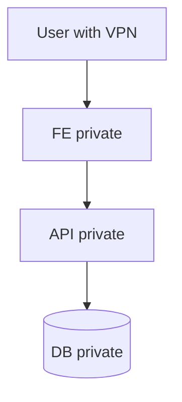
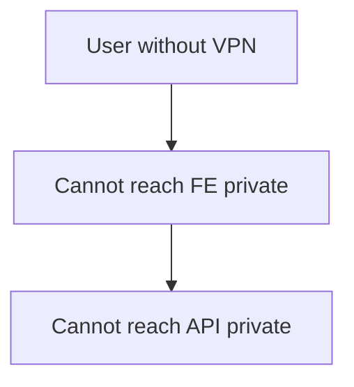
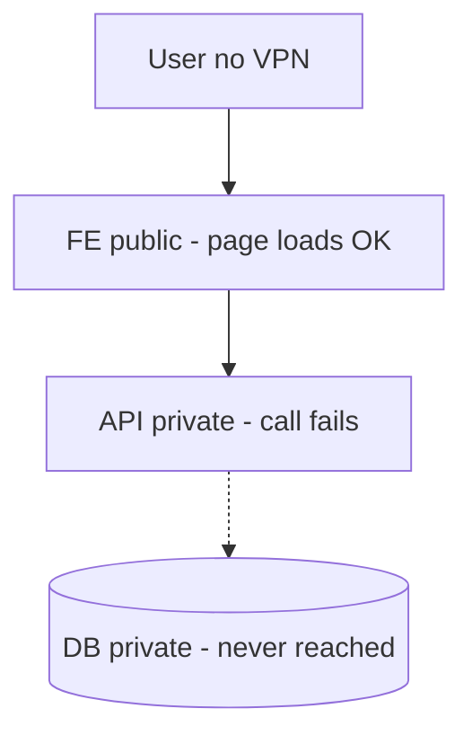
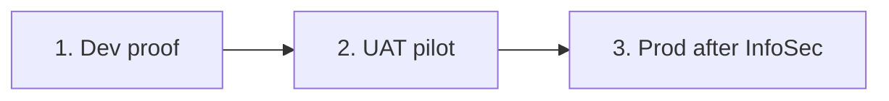
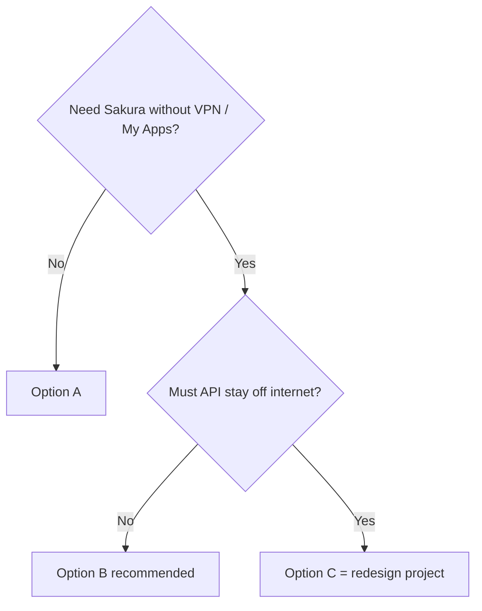

# Sakura — FE / API / DB Network Options

**One fact:** Sakura is a browser SPA. The **user’s browser** calls the API. The frontend does **not** proxy API calls.

---

# Part 1 — Recommended approach (read this first)

## Recommendation: Option B

**Public FE + public API + private DB**, secured by **Entra + Conditional Access + assignment** (not VPN).

| Layer | Target |
|-------|--------|
| FE | Public (remove Static Web App Private Endpoint) |
| API | Public (keep as today — do **not** VPN-lock) |
| DB | Private (unchanged) |

### Why this is recommended

- Works with current Sakura (no redesign)
- Fits **My Apps** later
- DB stays off the internet
- Security moves from VPN → identity (Entra / CA / assignment)
- Smallest change that is correct for “FE without VPN”

### Effort (Option B)

| Scope | Effort | What you do |
|-------|--------|-------------|
| **Dev proof** | **Low** (hours–few days) | Remove FE PE on `azeuw1dswasakura` + DNS if needed; API already public |
| **UAT pilot** | **Low–medium** | Same for `azeuw1tswasakura` + test with real users |
| **Prod** | **Medium** | InfoSec approval + evidence + remove `azeuw1pswasakura` PE |
| **App code** | **None** (network) | Usually no FE/API code change for opening FE |
| **Identity hardening** | **Low–medium** | Confirm CA; expand assignment groups; optional My Apps tile |

**Do not** set API `Public network access = Disabled` if you choose Option B.

---

# Part 2 — Entra + CA + assignment: HAVE vs NEED

These three replace VPN as the main gate for Option B.

| Control | Meaning | Status today | Action |
|---------|---------|--------------|--------|
| **Entra login** | User signs in with Microsoft / Dentsu account | **HAVE** — already works (incl. MFA on VPN path) | Keep |
| **Assignment** | Only listed users/groups can use Enterprise app **Sakura** | **HAVE partially** — `Assignment required = Yes`; assignee list is small | **NEED** — add the right groups before broad public FE |
| **Conditional Access (CA)** | Extra rules (MFA, compliant device, location, etc.) | **NEED confirm** — MFA exists at sign-in; CA policies for this app not fully evidenced | **NEED** — InfoSec confirm/export CA for app `e73f4528-2ceb-40e3-8e4a-d72287adb4c5` |
| **My Apps tile** | App visible in `myapplications.microsoft.com` | **NEED** — `Visible to users?` is typically **No** today | Optional later — turn **Yes** when Product wants the tile |

**Simple read:**

- You **already have** Entra login + MFA + JWT on API + assignment switch on.
- You **still need** InfoSec OK, prove/fix CA for the app, and assign the right people/groups.
- My Apps tile is **extra** — not required for the app to work without VPN.

---

# Part 3 — Option A (separate)

## What it is

Keep **everything on VPN**: FE private + API private + DB private.

| Layer | Action |
|-------|--------|
| FE | Keep PE (already done) |
| API | Add PE (e.g. Dev `azeuw1dweb01sakura` same VNet as FE) → then disable public access |
| DB | Keep private |

### Pros

- Strong network lock (internet cannot reach FE or API)
- No app redesign
- No code change
- Good if **everyone** stays on VPN (including YBR)

### Cons

- Users **must** use VPN forever for this model
- My Apps tile does **not** remove VPN need
- If you later want public FE, you must **undo** API private lock
- API PE + DNS work (EUC/Networking ticket)

### Effort (Option A)

| Scope | Effort | What you do |
|-------|--------|-------------|
| **Dev API PE** | **Medium** | Ticket: PE on `azeuw1dweb01sakura` + privatelink DNS + public disabled |
| **UAT / Prod API PE** | **Medium each** | Same pattern per env |
| **App code** | **None** | Hostname stays the same |
| **My Apps without VPN** | **N/A** | Not achieved by Option A |

**Dev API PE target:** same VNet/subnet as `azeuw1dswasakura_privateendpoint` (`AZ-VDC000006-EUW1-NET-CORE` / `…INTERNALSUBNET1`).

---

# Part 4 — Option B (separate — recommended)

## What it is

**Public FE + public API + private DB.** Identity (Entra + CA + assignment) replaces VPN.

(See Part 1 for diagram and why.)

### Pros

- Works with **current** SPA architecture
- No VPN for FE/API reachability
- Ready path for **My Apps**
- DB stays private
- API is already public today — less network change
- Fits security audit if evidence is collected (Part 6)

### Cons

- FE URL is on the internet (scanning surface)
- API hostname stays on the internet (protected by JWT, not VPN)
- Depends on Entra + CA + assignment being done well
- InfoSec approval needed for Prod
- Weaker **network** gate than Option A (by design)

### Effort (Option B)

| Scope | Effort | What you do |
|-------|--------|-------------|
| **Dev** | **Low** | Remove PE on `azeuw1dswasakura`; fix DNS if still privatelink |
| **UAT** | **Low–medium** | Same for `azeuw1tswasakura` |
| **Prod** | **Medium** | InfoSec + evidence + remove PE on `azeuw1pswasakura` |
| **Identity** | **Low–medium** | Assignment groups + CA confirm (Part 2) |
| **Code** | **None** | Usually |

---

# Part 5 — Option C (separate — not current Sakura)

## What it is

**Public FE + private API + private DB** — what people often want for “security,” but it **breaks** today’s app.

### Why it breaks

Browser must call the API. If API is VPN-only and user has no VPN → UI loads, data fails.

“Allow only from FE endpoint” does **not** work: the FE does not call the API; the **browser** does.

### What “redesign” means (short)

Build a **public gateway** so traffic becomes:

`Browser → public gateway → private API → DB`

(BFF / Front Door / APIM / proxy). That is a **project**, not a PE ticket.

### Pros

- API never on the public internet (after redesign)
- FE can be public
- DB stays private

### Cons

- **Does not work** without redesign
- High cost / time
- New Azure components + FE URL changes + auth path + full regression
- Over-engineering vs Option B unless InfoSec **requires** private API

### Effort (Option C)

| Scope | Effort | What you do |
|-------|--------|-------------|
| **Design + build gateway** | **High** (weeks–months) | New architecture |
| **Network + DNS** | **High** | Private link / VNet to API |
| **FE change** | **Medium** | Point API base URL to gateway |
| **Test all envs** | **High** | Full E2E |
| **PE ticket alone** | **Useless for C** | Does not fix SPA |

---

# Part 6 — Pass security audit (on recommended Option B)

### What to tell auditors

> Sakura is a browser SPA: the client calls the API directly. Public FE + VPN-only API breaks the app. Supported model: **public FE + public API + private SQL**, with **Entra + Conditional Access + assignment** replacing VPN. My Apps is only a launch tile.

### Evidence checklist

| # | Evidence | HAVE / NEED |
|---|----------|-------------|
| 1 | InfoSec approval for public FE | NEED |
| 2 | Enterprise app **Sakura** overview (`e73f4528-2ceb-40e3-8e4a-d72287adb4c5`) | HAVE (screenshot) |
| 3 | Assignment required = Yes + Users/groups list | HAVE switch / NEED expand groups |
| 4 | Conditional Access export for this app | NEED confirm |
| 5 | SQL private (`azeuw1psenmastersvrdb01` Prod) | HAVE pattern |
| 6 | CORS = env FE origin only | Confirm |
| 7 | Test: VPN **off** → login → API call works | NEED after FE opened |
| 8 | My Apps Visible = Yes | Optional NEED later |

### Rollout order

| Step | FE | API | DB |
|------|----|-----|-----|
| Dev | Open `azeuw1dswasakura` | Keep `azeuw1dweb01sakura` public | Private |
| UAT | Open `azeuw1tswasakura` | Keep `azeuw1tweb01sakura` public | Private |
| Prod | Open `azeuw1pswasakura` | Keep `azeuw1pweb01sakura` public | `azeuw1psenmastersvrdb01` private |

---

# Part 7 — Resources (current names)

| Env | Frontend (SWA) | FE URL | FE PE | Backend API | SQL |
|-----|----------------|--------|-------|-------------|-----|
| **Dev** | `azeuw1dswasakura` | `https://orange-sand-03a59b103.3.azurestaticapps.net` | `azeuw1dswasakura_privateendpoint` (`10.19.54.134`) | `azeuw1dweb01sakura` | Private |
| **UAT** | `azeuw1tswasakura` | `https://lemon-wave-07fa68003.2.azurestaticapps.net` | `azeuw1tswasakura_privateendpoint` (`10.19.54.136`) | `azeuw1tweb01sakura` | Private |
| **Prod** | `azeuw1pswasakura` | `https://green-stone-0e7ff2e03.2.azurestaticapps.net` | `azeuw1pswasakura_Privateendpoint` (`10.19.50.132`) | `azeuw1pweb01sakura` | `azeuw1psenmastersvrdb01` |

| Item | Value |
|------|--------|
| VNet (Dev/UAT FE PE) | `AZ-VDC000006-EUW1-NET-CORE` |
| Subnet | `AZ-VDC000006-EUW1-SNET-LZ-CORE-INTERNALSUBNET1` |
| Entra app | **Sakura** (`e73f4528-2ceb-40e3-8e4a-d72287adb4c5`) |

### Today’s posture

| Layer | Today |
|-------|--------|
| FE | Private (VPN) |
| API | Public |
| DB | Private |

---

# Part 8 — Quick compare

| | Option A | Option B ★ | Option C |
|--|----------|------------|----------|
| FE | Private | Public | Public |
| API | Private | Public | Private |
| DB | Private | Private | Private |
| Works today? | Yes | Yes | No (needs redesign) |
| My Apps without VPN? | No | Yes | Only after redesign |
| Effort | Medium (API PEs) | Low→Medium | **High** |
| Code change | No | Usually no | Yes + new gateway |

★ = **Recommended** for no-VPN FE / security review / My Apps.

### Decision

### Do not

| Action | Result |
|--------|--------|
| Access Restriction “Allow FE VNet only” on API | Breaks SPA |
| Public FE + API public disabled | Broken without redesign |
| Rely on CORS alone as network lock | Does not stop Postman/curl |
| Require Okta Hybrid for My Apps | Not needed — use Entra |

---

## Related docs

- `Docs/SAKURA_V2_NETWORK_BEFORE_AFTER_PUBLIC_FE.md` — click-by-click for Option B  
- `Docs/SAKURA_VPN_ACCESS_SECURITY_ASSESSMENT_AND_ROADMAP.md` — VPN / Entra evidence  
