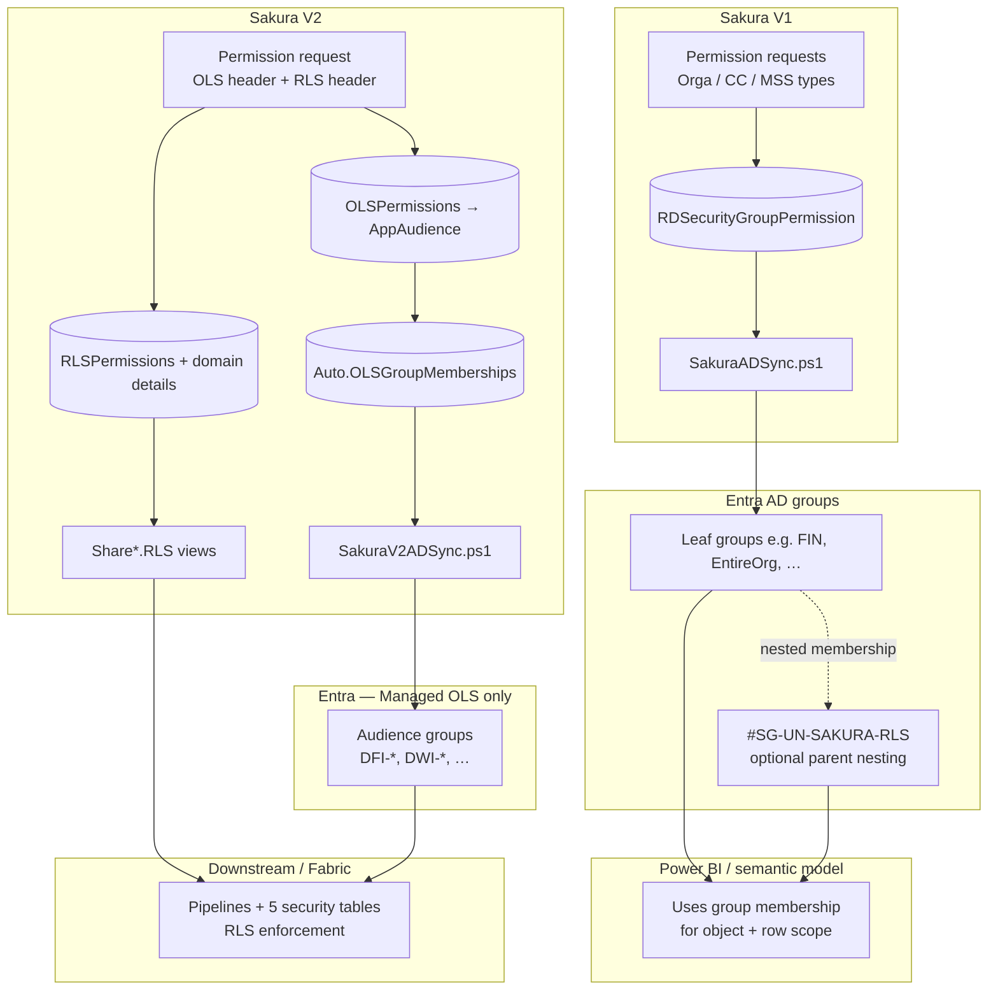
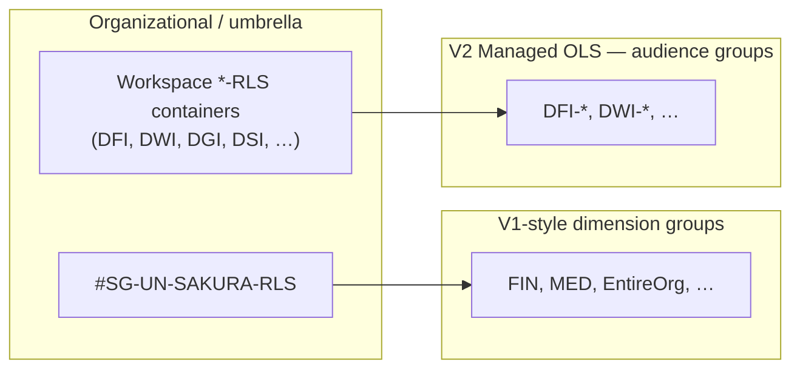
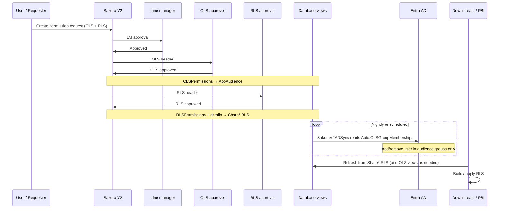

# `SG-UN-SAKURA-RLS`, OLS, RLS, and Audiences — V1 vs V2 (End-to-End)

**Purpose:** Answer how `#SG-UN-SAKURA-RLS` and the newer workspace groups (`DFI-*`, `DWI-*`, `*-RLS` containers) relate to Sakura, OLS, and RLS; what changes in Version 2; and where **audiences** fit. This complements **[OLS_RLS_MAINTENANCE_PICTURE.md](./OLS_RLS_MAINTENANCE_PICTURE.md)** and **[OLS_RLS_AND_DOWNSTREAM_ENFORCEMENT.md](./OLS_RLS_AND_DOWNSTREAM_ENFORCEMENT.md)**.

---

## 1. Corrected questions (short answers)

| Question | Plain answer |
|----------|----------------|
| Did Sakura V1 “play a role” in OLS or was it OLS + RLS? | **Both**, but **in one mechanism**: approved access was expressed as **membership in Entra security groups**. There was **no separate RLS table + pipeline** in V1. “Which app/report” and “which rows” were both driven by **which groups** the user was in (Orga / Cost Center / MSS style dimensions mapped to groups). |
| Is every user who ever used Sakura only present under `#SG-UN-SAKURA-*`? | **No.** Sakura sync only maintains users who appear in the **V1 desired-state view** (`RDSecurityGroupPermission`) or **V2** `Auto.OLSGroupMemberships` (for Managed OLS). People can also be in **other** tenant groups (`SG-AMER-*`, `SG-SAMURAI-*`, manual membership, other apps) with **no** Sakura row. |
| If we add someone to an **OLS** group in Sakura (security profile), is **RLS** automatic? | **Not in V2 by default.** Approved **OLS** drives **Entra audience groups** (Managed path). Approved **RLS** is stored separately and flows to **Share `*.RLS` views** and the **downstream Fabric / Power BI pipeline** — **not** via the OLS AD sync. Same user usually needs **both** approved (or a deliberate design such as one shared group — see [OLS_RLS_ONE_GROUP_PROPOSAL_MERMAID.md](./OLS_RLS_ONE_GROUP_PROPOSAL_MERMAID.md)). |
| How did users get access “through” `#SG-UN-SAKURA-RLS` in V1? | V1 sync targeted **specific group GUIDs** from `RDSecurityGroupPermission` (e.g. FIN, EntireOrg, MSS, etc.). If those groups are **nested under** `#SG-UN-SAKURA-RLS` in Entra, a user in a **child** group is effectively under the parent **by nesting**, but the **script still adds the user to the leaf/group named in the database**, not necessarily to `RLS` itself. |
| How do V2 users get the “same” access? | **OLS:** Managed apps → `Auto.OLSGroupMemberships` → `SakuraV2ADSync.ps1` → **`AppAudiences.AudienceEntraGroupUID`** groups only (not app-level `AppEntraGroupUID`). **RLS:** Approved RLS rows → **`Share[Domain].RLS`** → downstream builds security tables; **no AD sync for RLS**. |
| Does everyone need a **new** request for V2? | **For a clean V2 source of truth, yes** unless you **backfill** approved OLS/RLS in V2 to match today’s access. If you run V2 OLS sync against groups without backfill, the script can **remove** users not in `Auto.OLSGroupMemberships` (see maintenance doc §6). |
| Where does **audience** come in? | V2 models **app audiences** as catalog rows (`AppAudiences`) each with optional **`AudienceEntraGroupUID`**. OLS permissions point at an **audience** (or SAR report). V1 was **coarser**: group list per security dimension type without this per-app audience layer. |

---

## 2. One picture: V1 = groups for everything; V2 = split OLS (AD) vs RLS (views)



**Reading the diagram:** In V1, **one** chain (DB view → AD sync → groups) carried both “can open” and “which rows” as far as the model was configured. In V2, **OLS** and **RLS** are **separate approvals and separate technical paths**; only OLS (Managed audiences) is mirrored into AD by Sakura’s sync.

---

## 3. Your hierarchy: three different “roles” of groups

Entra **nesting** (parent/child) is a **directory** concept. Sakura’s sync is driven by **GUIDs in the database**, not by “user is under RLS therefore done.”

### 3.1 Schematic (abbreviated — not every group)

The diagram below is **only** to explain the **three roles** (umbrella → workspace container → leaves). It is **not** a complete tree. For the **full** `#SG-UN-SAKURA-*` nesting snapshot, use **§3.2** and **Appendix A**.



### 3.2 Reference tree — major `#SG-UN-SAKURA` trunks (matches your Entra explorer)

This Mermaid chart lists **all main nested structures** you described. **Leaf lists** under `#SG-UN-SAKURA-RLS` and `#SG-UN-SAKURA-RLS-UAT` are collapsed to one node each (full names are in **Appendix A**). Groups that appear **both** under a parent and as **separate roots** in the portal (e.g. the same audience visible in two places) are normal for Entra — the appendix is the line-by-line source of truth.

```mermaid
flowchart TB
  subgraph EXT["Other prefixes in same tenant (not SG-UN-SAKURA)"]
    AMER[SG-AMER-PNL-APP-*]
    SAMU[SG-SAMURAI-*]
  end

  subgraph FLAT["SG-UN-SAKURA — often shown as roots / peers"]
    ADUAT[#SG-UN-SAKURA-Admin-UAT]
    AMERRLS[#SG-UN-SAKURA-AMER-RLS]
    CDIAPAC[#SG-UN-SAKURA-CDI-APAC-CP]
    CEEV[#SG-UN-SAKURA-CEE-Viewer]
    CORET[#SG-UN-SAKURA-Core-Testers]
    DFI_CL[#SG-UN-SAKURA-DFI-ClientLeads]
    DFI_SUAT[#SG-UN-SAKURA-DFI-Sustainability-UAT]
    DSITST[#SG-UN-SAKURA-DSI-CDI-Test]
    DWI_HR[#SG-UN-SAKURA-DWI-HRMgmt]
    DWI_QA[#SG-UN-SAKURA-DWI-QA]
    MEM[#SG-UN-SAKURA-Member]
    MIG[#SG-UN-SAKURA-Migration]
    PBI_DEV[#SG-UN-SAKURA-PowerBI-Developers]
    PBI_QA[#SG-UN-SAKURA-PowerBI-QA]
    PBI_SUP[#SG-UN-SAKURA-PowerBI-Support]
    SSS[#SG-UN-SAKURA-SAMURAI-SelfService]
    DGI_GI_ROOT[#SG-UN-SAKURA-DGI-GrowthInsights]
  end

  subgraph DFI["DFI"]
    DFI_RLS[#SG-UN-SAKURA-DFI-RLS]
    DFI_V[#SG-UN-SAKURA-DFI-Viewer]
    DFI_D[#SG-UN-SAKURA-DFI-Developers]
    DFI_RLS --> DFI_AUD["Audience groups: Sustainability, Finance-Manager-OFR, APAC, Exec, Tag, ARManager, EMEA, MSS, AssetManager, APManager, Americas, FinanceManager, FP&A, InternalAudit, ProjectManager, Media-Insights"]
    DFI_V --> DFI_D
  end

  subgraph DGI["DGI"]
    DGI_RLS[#SG-UN-SAKURA-DGI-RLS]
    DGI_RLS --> DGI_EX[#SG-UN-SAKURA-DGI-EXEC]
    DGI_RLS --> DGI_GI[#SG-UN-SAKURA-DGI-GrowthInsights]
    DGI_RLS --> DGI_V[#SG-UN-SAKURA-DGI-Viewer]
    DGI_V --> DGI_D[#SG-UN-SAKURA-DGI-Developers]
  end

  subgraph DMI["DMI"]
    DMI_E[#SG-UN-SAKURA-DMI-Exec]
    DMI_GM[#SG-UN-SAKURA-DMI-GroupManagers]
    DMI_V[#SG-UN-SAKURA-DMI-Viewer]
    DMI_V --> DMI_D[#SG-UN-SAKURA-DMI-Developers]
  end

  subgraph DSI["DSI"]
    DSI_RLS[#SG-UN-SAKURA-DSI-RLS]
    DSI_RLS --> DSI_CDI[#SG-UN-SAKURA-DSI-CDI]
  end

  subgraph DWI["DWI"]
    DWI_RLS[#SG-UN-SAKURA-DWI-RLS]
    DWI_V[#SG-UN-SAKURA-DWI-Viewer]
    DWI_D[#SG-UN-SAKURA-DWI-Developers]
    DWI_RLS --> DWI_AUD["Dashboard groups: Exploratory Dashboard, TimeMgmt, Functional Dashboard, QBR, DF_DataCheck, APAC Datamart, CtS"]
    DWI_V --> DWI_D
  end

  subgraph PBI["Power BI"]
    PBI_TEAM[#SG-UN-SAKURA-PowerBI-Team]
    PBI_AD[#SG-UN-SAKURA-Admin]
    PBI_TEAM --> PBI_AD
  end

  subgraph PU["PowerUser (each → AllArea)"]
    PU_AA[#SG-UN-SAKURA-PowerUser-AllArea]
    PU_BPC["#SG-UN-SAKURA-PowerUser-BPC/SAC"] --> PU_AA
    PU_CL[#SG-UN-SAKURA-PowerUser-Client] --> PU_AA
    PU_FN[#SG-UN-SAKURA-PowerUser-Finance] --> PU_AA
    PU_OFR[#SG-UN-SAKURA-PowerUser-OFR] --> PU_AA
    PU_PR[#SG-UN-SAKURA-PowerUser-Project] --> PU_AA
    PU_SA[#SG-UN-SAKURA-PowerUser-Sales] --> PU_AA
    PU_TM[#SG-UN-SAKURA-PowerUser-Time] --> PU_AA
    PU_UT[#SG-UN-SAKURA-PowerUser-Utilization] --> PU_AA
  end

  subgraph V1RLS["V1-style umbrella"]
    RLS[#SG-UN-SAKURA-RLS]
    RLS_UAT[#SG-UN-SAKURA-RLS-UAT]
    RLS --> RLS_LEAF["Child groups: CntrlMgmtPrm, Comms, CRTV, CXM, CXMBU, CXMCL, EntireOrg, FACILITY, FIN, FINCOM, FINCTL, FINOPL, FINSPC, FUNC, HR, Legal, MED, MEDCL, MEDMB, NB, OPERNS, Overall, TECH"]
    RLS_UAT --> RLS_U_LEAF["Parallel *-UAT children"]
  end
```



| Layer | Typical names | Role |
|--------|----------------|------|
| **Umbrella** | `#SG-UN-SAKURA-RLS`, `#SG-UN-SAKURA-RLS-UAT` | Often a **parent** of V1-style groups for **governance / reporting in AD**. Membership may be **nested** (child groups are members of `RLS`). |
| **Workspace “RLS” container** | `#SG-UN-SAKURA-DFI-RLS`, `#SG-UN-SAKURA-DWI-RLS`, … | **Organizational** grouping of **that workspace’s** audience groups in Entra. It is **not** the same as Sakura’s **database RLS** (row filters). |
| **Audience / leaf OLS groups** | `SG-UN-SAKURA-DFI-*`, `SG-UN-SAKURA-DWI-*`, V1 FIN/MED/… | Groups Sakura **may** sync to for **object-level** access (V2: `AudienceEntraGroupUID`; V1: entries in `RDSecurityGroupPermission`). |

**Important:** In V2, **`SakuraV2ADSync.ps1` fills `AudienceEntraGroupUID` groups** for Managed OLS (see `Auto.OLSGroupMemberships`). It does **not** populate `WorkspaceApps.AppEntraGroupUID`. It does **not** sync RLS.

---

## 4. AD Sync mental model (what you described)

> “From Sakura side in AD sync we add one of the child groups **and** `SAKURA-RLS` — since they are under the parent they are already part of it.”

- **If** users are placed in **child** groups and those children are **group-nested** under `#SG-UN-SAKURA-RLS`, then **yes**: transitive membership means they are “under” `RLS` for anything that checks **nested** group expansion.
- **What Sakura actually writes** is still determined by the **view**: each row is **(user, SecurityGroupGUID)** in V1 or **(user, EntraGroupUID)** in V2. The sync adds the user to **that** group. Whether that group is nested under `RLS` is an **Entra structure** choice.

---

## 5. Why you see `SG-AMER-*`, `SG-SAMURAI-*`, etc. next to `SG-UN-SAKURA-*`

Those names **do not share** the `SG-UN-SAKURA` prefix. They are usually:

- **Application or platform** groups (e.g. PnL app, regional Samurai),
- **Not** emitted by `Auto.OLSGroupMemberships` unless you explicitly configure an audience’s `AudienceEntraGroupUID` to that object id,
- Maintained by **other** processes or teams.

So the **flat list** of “all groups in the tenant” mixes **Sakura-managed OLS audiences**, **V1 RLS/OLS-style groups**, and **unrelated** groups. Only rows in Sakura’s **desired-state** views define what Sakura sync will reconcile.

---

## 6. End-to-end flow: Version 2 request → access



**Takeaway:** Getting **into** `#SG-UN-SAKURA-DFI-FinanceManager` (example) for Managed OLS requires an **approved OLS** row pointing at that **audience** with a non-null **`AudienceEntraGroupUID`**. Getting **correct rows inside the report** requires **approved RLS** and a successful **downstream** refresh — **not** being added to `#SG-UN-SAKURA-DFI-RLS` alone (that group is organizational unless your Power BI model explicitly uses it).

---

## 7. Audiences in V2 (why V1 did not have this label)

| V1 mental model | V2 mental model |
|-----------------|-----------------|
| Pick report + security model; dimensions map to **known group types** (Orga, CC, MSS, …). | Same user-facing idea, but catalog is explicit: **app** → many **audiences** → each audience may have its **own Entra group** (`AudienceEntraGroupUID`). |
| One row in `RDSecurityGroupPermission` → one group dimension. | One approved OLS row → **OLSItemType** (Audience vs SAR) + **OLSItemId** → audience or report; Managed sync uses **audience** groups only. |

So **audience** is the V2 way to say: “this slice of the app (e.g. DFI Finance Manager) maps to **this** Entra group for OLS.”

---

## 8. Do we need new requests for every user when moving to V2?

| Approach | Meaning |
|----------|---------|
| **Big-bang new requests** | Each user submits (or admin bulk-creates) V2 requests; approvers clear queues. |
| **Backfill** | Load approved **OLS** + **RLS** into V2 so `Auto.OLSGroupMemberships` and `Share*.RLS` match current reality; then cut over sync and retire V1 for those groups. |

Without backfill, pointing **only** V2 sync at groups that are still full of V1 users is **risky**: desired state may be incomplete and the sync can **remove** members (see [OLS_RLS_MAINTENANCE_PICTURE.md](./OLS_RLS_MAINTENANCE_PICTURE.md) §6).

---

## 9. Quick reference table

| Topic | V1 | V2 |
|--------|----|----|
| OLS enforcement lever | Entra groups (sync from `RDSecurityGroupPermission`) | Managed: same idea but from `Auto.OLSGroupMemberships` → **audience** groups; NotManaged: `Share*.OLS` for owners |
| RLS enforcement lever | **Same AD groups** (no separate RLS store) | **`Share*.RLS`** → downstream tables → Power BI RLS |
| Sakura AD sync script | `SakuraADSync.ps1` | `SakuraV2ADSync.ps1` (OLS Managed audiences only) |
| `#SG-UN-SAKURA-RLS` | Umbrella / nesting over V1-style groups | Still valid as **AD structure**; not a substitute for V2 RLS data |
| Audience | Not a first-class table like V2 | **`AppAudiences`** + `AudienceEntraGroupUID` |

---

## Appendix A — Line-by-line tree (your Entra hierarchy export)

**Scope:** This is the **full** structure you shared (including groups that also appear in a flat list elsewhere in the portal). **Prefix `#`** is omitted in the tree below for readability; in Entra, display names may include `#`. Names with **`&`** or **`/`** are copied as in your list.

**Other prefixes (same tenant, not `SG-UN-SAKURA`):**

- `SG-AMER-PNL-APP-ALL-PROD`
- `SG-AMER-PNL-APP-PNL-PROD`
- `SG-AMER-PNL-APP-AUD-CTS-PROD`
- `SG-SAMURAI-EMEA-FRANCE-OFR`

**`SG-UN-SAKURA` — flat / peer groups (no parent in your paste):**

- `SG-UN-SAKURA-DGI-GrowthInsights`
- `SG-UN-SAKURA-DSI-CDI`
- `SG-UN-SAKURA-DSI-CDI-Test`
- `SG-UN-SAKURA-DFI-Americas`
- `SG-UN-SAKURA-DFI-APManager`
- `SG-UN-SAKURA-DFI-APAC`
- `SG-UN-SAKURA-DFI-ARManager`
- `SG-UN-SAKURA-DFI-AssetManager`
- `SG-UN-SAKURA-DFI-EMEA`
- `SG-UN-SAKURA-DFI-Exec`
- `SG-UN-SAKURA-DFI-FinanceManager`
- `SG-UN-SAKURA-DFI-Finance-Manager-OFR`
- `SG-UN-SAKURA-DFI-FP&A`
- `SG-UN-SAKURA-DFI-InternalAudit`
- `SG-UN-SAKURA-DFI-Media-Insights`
- `SG-UN-SAKURA-DFI-MSS`
- `SG-UN-SAKURA-DFI-ProjectManager`
- `SG-UN-SAKURA-DFI-Sustainability`
- `SG-UN-SAKURA-DFI-Tag`
- `SG-UN-SAKURA-DWI-APAC Datamart`
- `SG-UN-SAKURA-DWI-CtS`
- `SG-UN-SAKURA-DWI-DF_DataCheck`
- `SG-UN-SAKURA-DWI-Functional Dashboard`
- `SG-UN-SAKURA-DWI-TimeMgmt`
- `SG-UN-SAKURA-DWI-QBR`
- `SG-UN-SAKURA-DWI-Exploratory Dashboard`

**`SG-UN-SAKURA` — nested (indented = child of line above):**

```text
SG-UN-SAKURA-Admin-UAT
SG-UN-SAKURA-AMER-RLS
SG-UN-SAKURA-CDI-APAC-CP
SG-UN-SAKURA-CEE-Viewer
SG-UN-SAKURA-Core-Testers
SG-UN-SAKURA-DFI-ClientLeads
SG-UN-SAKURA-DFI-RLS
  SG-UN-SAKURA-DFI-Sustainability
  SG-UN-SAKURA-DFI-Finance-Manager-OFR
  SG-UN-SAKURA-DFI-APAC
  SG-UN-SAKURA-DFI-Exec
  SG-UN-SAKURA-DFI-Tag
  SG-UN-SAKURA-DFI-ARManager
  SG-UN-SAKURA-DFI-EMEA
  SG-UN-SAKURA-DFI-MSS
  SG-UN-SAKURA-DFI-AssetManager
  SG-UN-SAKURA-DFI-APManager
  SG-UN-SAKURA-DFI-Americas
  SG-UN-SAKURA-DFI-FinanceManager
  SG-UN-SAKURA-DFI-FP&A
  SG-UN-SAKURA-DFI-InternalAudit
  SG-UN-SAKURA-DFI-ProjectManager
  SG-UN-SAKURA-DFI-Media-Insights
SG-UN-SAKURA-DFI-Sustainability-UAT
SG-UN-SAKURA-DFI-Viewer
  SG-UN-SAKURA-DFI-Developers
SG-UN-SAKURA-DGI-RLS
  SG-UN-SAKURA-DGI-EXEC
  SG-UN-SAKURA-DGI-GrowthInsights
  SG-UN-SAKURA-DGI-Viewer
    SG-UN-SAKURA-DGI-Developers
SG-UN-SAKURA-DMI-Exec
SG-UN-SAKURA-DMI-GroupManagers
SG-UN-SAKURA-DMI-Viewer
  SG-UN-SAKURA-DMI-Developers
SG-UN-SAKURA-DSI-CDI-Test
SG-UN-SAKURA-DSI-RLS
  SG-UN-SAKURA-DSI-CDI
SG-UN-SAKURA-DWI-HRMgmt
SG-UN-SAKURA-DWI-QA
SG-UN-SAKURA-DWI-RLS
  SG-UN-SAKURA-DWI-Exploratory Dashboard
  SG-UN-SAKURA-DWI-TimeMgmt
  SG-UN-SAKURA-DWI-Functional Dashboard
  SG-UN-SAKURA-DWI-QBR
  SG-UN-SAKURA-DWI-DF_DataCheck
  SG-UN-SAKURA-DWI-APAC Datamart
  SG-UN-SAKURA-DWI-CtS
SG-UN-SAKURA-DWI-Viewer
  SG-UN-SAKURA-DWI-Developers
SG-UN-SAKURA-Member
SG-UN-SAKURA-Migration
SG-UN-SAKURA-PowerBI-Developers
SG-UN-SAKURA-PowerBI-QA
SG-UN-SAKURA-PowerBI-Support
SG-UN-SAKURA-PowerBI-Team
  SG-UN-SAKURA-Admin
SG-UN-SAKURA-PowerUser-BPC/SAC
  SG-UN-SAKURA-PowerUser-AllArea
SG-UN-SAKURA-PowerUser-Client
  SG-UN-SAKURA-PowerUser-AllArea
SG-UN-SAKURA-PowerUser-Finance
  SG-UN-SAKURA-PowerUser-AllArea
SG-UN-SAKURA-PowerUser-OFR
  SG-UN-SAKURA-PowerUser-AllArea
SG-UN-SAKURA-PowerUser-Project
  SG-UN-SAKURA-PowerUser-AllArea
SG-UN-SAKURA-PowerUser-Sales
  SG-UN-SAKURA-PowerUser-AllArea
SG-UN-SAKURA-PowerUser-Time
  SG-UN-SAKURA-PowerUser-AllArea
SG-UN-SAKURA-PowerUser-Utilization
  SG-UN-SAKURA-PowerUser-AllArea
SG-UN-SAKURA-RLS
  SG-UN-SAKURA-FINCOM
  SG-UN-SAKURA-MED
  SG-UN-SAKURA-FINOPL
  SG-UN-SAKURA-FINSPC
  SG-UN-SAKURA-CXMBU
  SG-UN-SAKURA-FUNC
  SG-UN-SAKURA-CXM
  SG-UN-SAKURA-Overall
  SG-UN-SAKURA-CXMCL
  SG-UN-SAKURA-FACILITY
  SG-UN-SAKURA-FIN
  SG-UN-SAKURA-NB
  SG-UN-SAKURA-EntireOrg
  SG-UN-SAKURA-CRTV
  SG-UN-SAKURA-Legal
  SG-UN-SAKURA-CntrlMgmtPrm
  SG-UN-SAKURA-HR
  SG-UN-SAKURA-MEDMB
  SG-UN-SAKURA-Comms
  SG-UN-SAKURA-FINCTL
  SG-UN-SAKURA-TECH
  SG-UN-SAKURA-MEDCL
  SG-UN-SAKURA-OPERNS
SG-UN-SAKURA-RLS-UAT
  SG-UN-SAKURA-MED-UAT
  SG-UN-SAKURA-NB-UAT
  SG-UN-SAKURA-MEDCL-UAT
  SG-UN-SAKURA-FINOPL-UAT
  SG-UN-SAKURA-OPERNS-UAT
  SG-UN-SAKURA-Comms-UAT
  SG-UN-SAKURA-FUNC-UAT
  SG-UN-SAKURA-Legal-UAT
  SG-UN-SAKURA-CRTV-UAT
  SG-UN-SAKURA-TECH-UAT
  SG-UN-SAKURA-Overall-UAT
  SG-UN-SAKURA-CXMCL-UAT
  SG-UN-SAKURA-CXMBU-UAT
  SG-UN-SAKURA-FINCTL-UAT
  SG-UN-SAKURA-CXM-UAT
  SG-UN-SAKURA-HR-UAT
  SG-UN-SAKURA-MEDMB-UAT
  SG-UN-SAKURA-FIN-UAT
  SG-UN-SAKURA-FACILITY-UAT
  SG-UN-SAKURA-CntrlMgmtPrm-UAT
  SG-UN-SAKURA-EntireOrg-UAT
  SG-UN-SAKURA-FINCOM-UAT
  SG-UN-SAKURA-FINSPC-UAT
SG-UN-SAKURA-SAMURAI-SelfService
```

**Verify in tenant:** Group nesting can change. Regenerate this appendix after Entra changes, or run `AD\Get-SakuraEntraGroupHierarchy.ps1` for a live tree **within** the `SG-UN-SAKURA*` filter.

---

## 10. Related documents

- [OLS_RLS_MAINTENANCE_PICTURE.md](./OLS_RLS_MAINTENANCE_PICTURE.md) — V1/V2 maintenance, `Auto.OLSGroupMemberships`, migration risks  
- [OLS_RLS_AND_DOWNSTREAM_ENFORCEMENT.md](./OLS_RLS_AND_DOWNSTREAM_ENFORCEMENT.md) — OLS vs RLS, workspace link  
- [OLS_RLS_ONE_GROUP_PROPOSAL_MERMAID.md](./OLS_RLS_ONE_GROUP_PROPOSAL_MERMAID.md) — When one group covers both OLS and RLS  
- [AD_SYNC_DEEP_REFERENCE.md](./AD_SYNC_DEEP_REFERENCE.md) — Script behaviour details  

---

*Document version: March 2026. Align with codebase views `Auto.OLSGroupMemberships` and product changes as they ship.*
