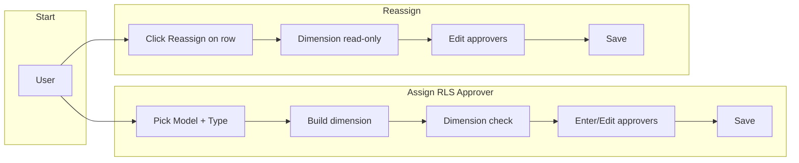
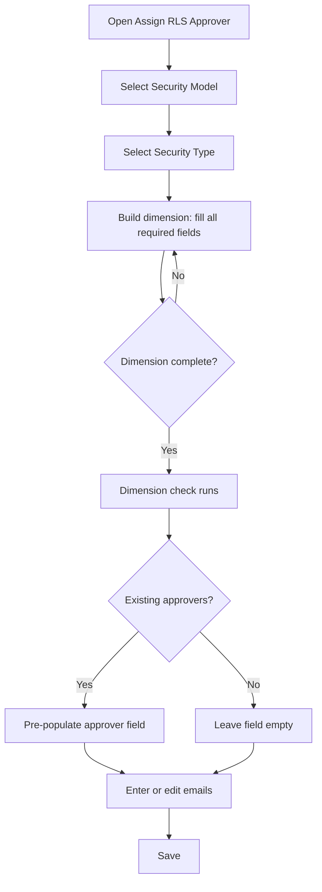
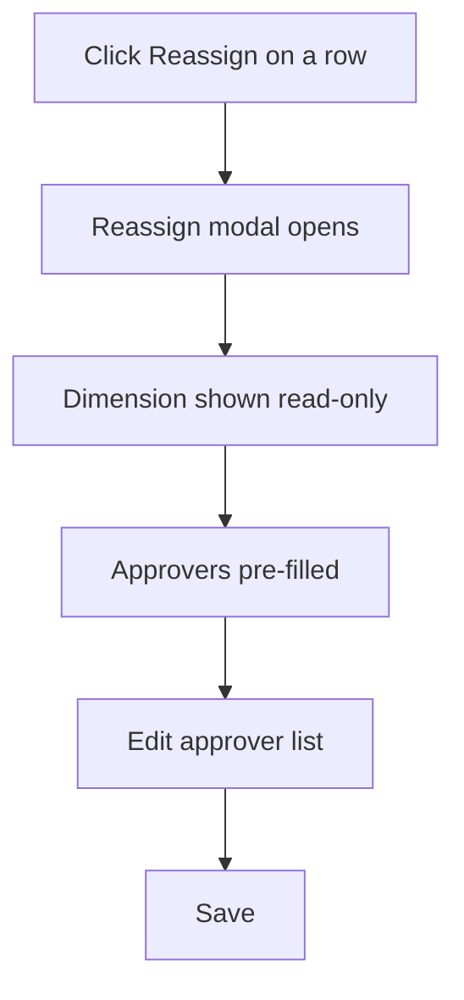
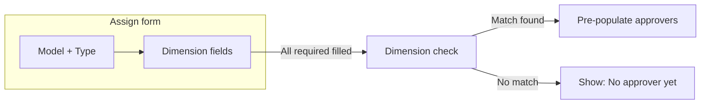

# RLS Approver Assign & Reassign — Quick Guide

Use this doc with the **video**: short definitions and simple Mermaid diagrams so the flow is easy to follow.

---

## Definitions

| Term | Meaning |
|------|--------|
| **RLS** | Row-Level Security. Approvers who can approve permission requests for **one specific dimension combination**. |
| **Dimension** | A set of fields that identify *which* data slice an approver covers (e.g. Region + Service Line + Client). The system matches approvers by **full dimension**. |
| **Dimension combination** | Security Model + Security Type + all required dimension fields (Organization, Service Line, Client, etc.) filled. Must be **complete** before the system can find or save an approver. |
| **Assign** | Add or set RLS approvers for a dimension. You choose the dimension; if it already has approvers, they are **pre-populated** so you can edit (reassign). |
| **Reassign** | Change the approver(s) for a dimension that **already has** approvers. Dimensions are read-only; you only change the email list. |
| **Dimension check** | When the dimension combination is complete, the UI looks up existing approvers for that combination and shows "X existing approver(s) found" or "No approver assigned yet" and pre-fills the field if there is a match. |
| **Workspace type** | CDI, WFI, GI, AMER, EMEA, FUM. Each type has **different required dimensions** (see diagram below). |

---

## Diagram 1: Overall flow (Assign vs Reassign)

**In words:** Assign = build dimension → check → enter approvers → save. Reassign = open row → dimension fixed → edit approvers → save.

---

## Diagram 2: What each workspace needs (dimensions)

```mermaid
flowchart TB
    subgraph CDI["CDI"]
        C1[Organization]
        C2[Service Line]
        C3[Client]
        C1 --> C2 --> C3
    end
    subgraph WFI["WFI"]
        W1[Organization]
        W2[People Aggregator type]
        W3[People Aggregator]
        W1 --> W2 --> W3
    end
    subgraph GI["GI"]
        G1[Organization]
        G2[Service Line]
        G3[Client]
        G4[MSS]
        G1 --> G2 --> G3 --> G4
    end
    subgraph AMER["AMER"]
        A1[Organization]
        A2[Service Line]
        A3[+ depends on type: Client / CC / MSS / PC / PA]
        A1 --> A2 --> A3
    end
```

**In words:** CDI = Org + SL + Client. WFI = Org + People Aggregator (type + value). GI = Org + SL + Client + MSS. AMER = Org + SL + extra by security type.

---

## Diagram 3: Assign flow step-by-step

**In words:** Model → Type → fill dimensions → when complete, check runs → pre-fill if match → enter/edit emails → save.

---

## Diagram 4: Reassign flow

**In words:** Reassign = open modal → dimension fixed → edit approvers → save.

---

## Diagram 5: Dimension check (when does pre-fill happen?)

**In words:** Only when **all** required dimension fields are filled does the system look up existing approvers and pre-fill (or show "no approver yet").

---

## One-page summary

| Action | Where | What you do |
|--------|--------|-------------|
| **Assign (new)** | Assign RLS Approver | Model → Type → build full dimension → dimension check → enter emails → Save. |
| **Assign (edit same dimension)** | Assign RLS Approver | Same as above; if dimension already has approvers, they pre-fill — edit and Save = reassign. |
| **Reassign** | Reassign on row | Dimension read-only, approvers pre-filled → edit list → Save. |

**Workspaces (required dimensions):**

- **CDI:** Organization, Service Line, Client
- **WFI:** Organization, People Aggregator type, People Aggregator
- **GI:** Organization, Service Line, Client, MSS
- **AMER:** Organization, Service Line, + (Client / CC / MSS / PC / PA by security type)

---

*Use with:* `Docs\VIDEO_SCRIPT_RLS_APPROVER_ASSIGN_REASSIGN.md` for the full video script and workspace examples.
