# RLS Approver Assign & Reassign — Quick Guide

Use this doc with the **video**: short definitions and simple Mermaid diagrams so the flow is easy to follow.

---

## Theory: RLS in context (when, what dimension, who is approver, why required)

This section gives the **context** so the assign/reassign steps make sense. It aligns with the **FDD** (Functional Design Document).

### When does RLS come into the picture?

Sakura uses a **three-step approval chain** for every permission request:

1. **Line Manager (LM)** — “Does this employee need this access?” (source: Workday / ref.Employees)
2. **OLS Approver** — “Should this user see this report/audience?” (source: Workspace Reports / Apps / Audiences)
3. **RLS Approver** — “Should this user see **this specific data**?” (source: RLS\*Approvers tables, matched by dimensions)

**RLS is Step 3.** It comes into the picture when a request includes **RLS dimensions** (workspace, security model, security type, and dimension values). After LM and OLS approve, the request goes to **Pending RLS** and must be routed to the right RLS approver(s) for that dimension combination. Assigning RLS approvers in WSO Console is how admins **define who approves what** for each data slice.

*Ref: FDD §04 Approver Role (three types; RLS = third step), FDD §08 Common Functionality.*

### What is a dimension?

**Security dimensions** are the **business attributes** used to define *which* data slice an approver covers (e.g. Market, Cluster, Region, Service Line, Client, People Aggregator, MSS, Cost Center, Country, Profit Center). They are **not created or maintained in Sakura** — they are **imported** from external systems (e.g. via Azure Data Factory) and are subject to historization and versioning.

Each **workspace** has its own set of dimensions and security types (see FDD §02 Workspace Requirements). For example:

- **CDI:** Organization (Market/Cluster/Region), Service Line, Client  
- **WFI:** Organization, People Aggregator (type + value)  
- **GI:** Organization, Service Line, Client, MSS  
- **AMER:** Organization, Service Line, plus Client / CC / MSS / PC / PA depending on security type  

The system matches approvers by **full dimension**: same Security Model, Security Type, and **all** dimension keys. If one key differs, it’s a different dimension combination.

*Ref: FDD §02 (Security Dimensions per workspace), FDD §08 (Data Imports for Security Dimensions).*

### Who is the RLS approver?

The **RLS approver** is a **person (email)** who is **assigned to one specific dimension combination** in the RLS\*Approvers tables (e.g. RLSCDIApprovers, RLSAMERApprovers, RLSWFIApprovers, …).  

Per FDD §04:

- **Source:** Defined **per Security Model** and **based on Security Dimensions**
- **Maintained by:** Workspace Owner, Workspace Technical Owner, or Workspace Approvals Owner (in WSO Console → Approver Assignments)
- **Decision focus:** “Should this user see this specific data?”

When a request is created with RLS dimensions, the system **resolves** the RLS approver by matching that combination (and, if the model uses Entity, by **traversing only the Entity hierarchy** — Market → Cluster → Region → Global — while keeping all other dimensions fixed; see FDD §08). The person(s) returned are the RLS approvers for that request.

*Ref: FDD §04 (RLS Approvers), FDD §08 (Traversing The Approver Tree).*

### Why is the RLS approver required?

- So that **only people with the right authority** for that data slice can approve or reject the request (e.g. regional lead for “Americas + Overall + All Clients”).
- If **no** RLS approver is assigned for a dimension combination (and no match via Entity traversal), the system returns **NOT FOUND** and the request **cannot proceed** — permission creation is blocked until an appropriate approver is defined (FDD §08).
- **Assigning** (and reassigning) RLS approvers is therefore **required** to define who approves what; without it, RLS requests cannot be routed and the approval chain cannot complete.

*Ref: FDD §08 (Traversing — “If no approver is found at any level … request will not proceed”).*

---

## Complete end-to-end picture (how it all links)

The diagrams below show **how the full journey fits together**: when a user asks for something, what happens, and where **RLS** and **assigning RLS approvers** come in.

### Diagram A: User requests access → approval chain → access granted

When a **user (requester)** asks for access, the request goes through three approval steps. **RLS** is step 3; the RLS approver is **resolved from the dimension combination** the user selected (using the RLS*Approvers data that **admins** maintain).

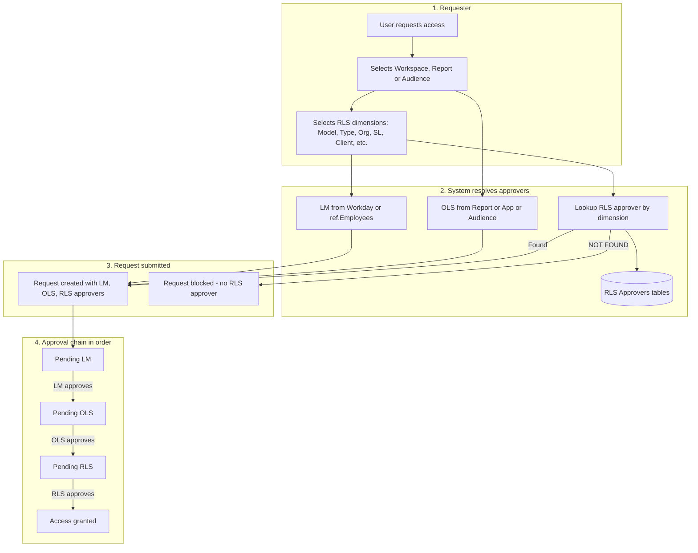

**In words:** User selects workspace, object, and **RLS dimensions** → system finds LM, OLS approver, and **RLS approver (by matching dimensions in RLS*Approvers)** → if RLS approver is **NOT FOUND**, request is blocked → otherwise request is created and moves **Pending LM → Pending OLS → Pending RLS** → when RLS approves, access is granted.

---

### Diagram B: Where Assign RLS Approver fits - admin vs requester

**Admins** assign RLS approvers per dimension **before** any request. That data is what the system uses when a **requester** submits a request with RLS dimensions.

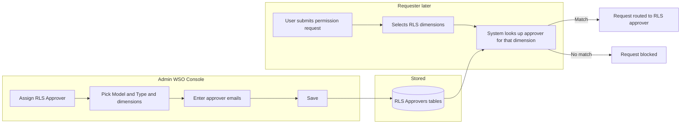

**In words:** Admin **assigns** approvers for each dimension combination → stored in RLS Approvers tables. When a user **requests** access and selects dimensions → system **looks up** that combination → if there is a row, the request is routed to those approvers (Pending RLS); if not, the request cannot proceed.

---

### Diagram C: What happens when user asks for something - RLS part only

Focus on **RLS only**: what the system does with the user's dimension selection and how it links to assigned approvers.

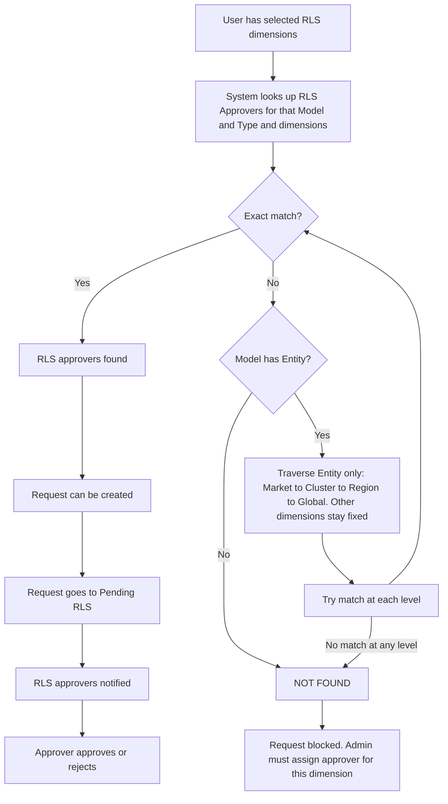

**In words:** User selects dimensions → system looks for an **exact match** in RLS Approvers tables. If none, and the model uses Entity, system **traverses only Entity** (Market → Cluster → Region → Global), other dimensions fixed. If match found → request created, **Pending RLS**, approver notified. If **no match** → **NOT FOUND** → request **blocked** until admin assigns an approver for that dimension.

---

### Diagram D: Full lifecycle in one view - request states

From creation to final outcome, including where RLS sits.

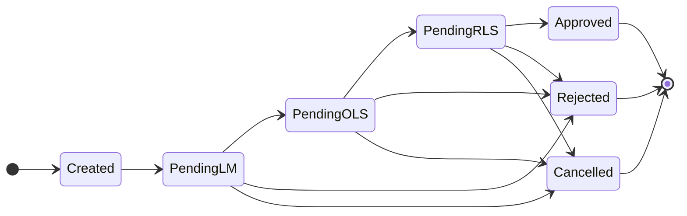

**Transition labels:** Created = User submitted request, LM/OLS/RLS approvers resolved. Pending LM → Pending OLS = LM approves. Pending OLS → Pending RLS = OLS approves. Pending RLS → Approved = RLS approves. **Note:** RLS approver was resolved at create time from RLS Approvers tables by dimension match or Entity traversal.

**In words:** Request is **created** only if LM, OLS, and **RLS approver** can be resolved (RLS from dimension lookup/traversal). Then **Pending LM → Pending OLS → Pending RLS**. The **RLS approver** (person assigned to that dimension in WSO) sees the request in **Pending RLS** and approves or rejects. Without an assigned RLS approver for that dimension, the request never reaches Created.

---

## How it all ties together: Workspace, OLS, Security Model, Type, Dimensions, RLS assignment

This section ties the pieces in context: **workspace**, **report or app or audience** (which drive **OLS approver**), **security model** and **security type** (which drive **dimensions**), and how **RLS approver assignment** fits in.

### Workspace contains: Report / App / Audience → OLS approver

Each **workspace** has catalogue items: **standalone reports**, **apps**, and **audiences**. Who approves *whether the user can see that report or audience* is the **OLS approver**. OLS approvers are assigned per report, per app, or per audience (depending on delivery mode).

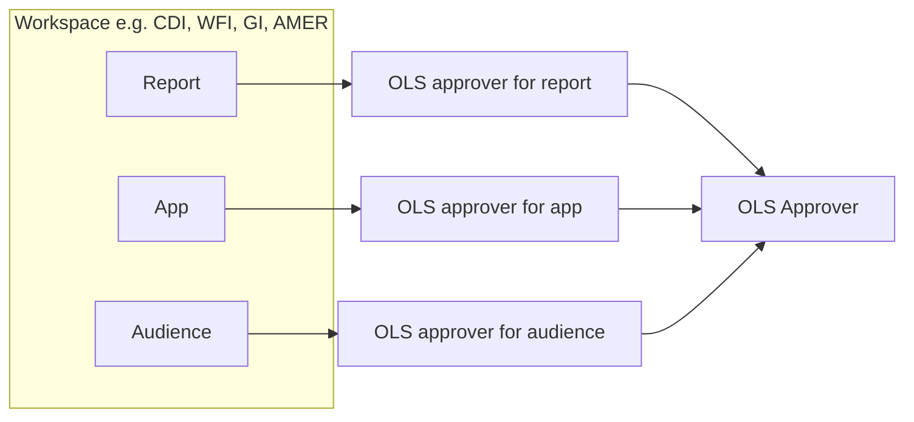

**In words:** Workspace = container. User picks a **report** or **app** or **audience** → system knows **who is the OLS approver** for that object (from Workspace Reports / Workspace Apps / App Audiences). That is **not** RLS; RLS is about **data** (dimensions).

---

### Workspace has Security Model; each model has Security Type; dimensions are tied to the type

For **RLS**, the workspace has one or more **security models** (e.g. CDI-Default, WFI-Default). Each security model has **security types** (e.g. CDI has one type "Client Data Insights"; AMER has Orga, PA, Client, CC, MSS, PC). The **dimensions** you must fill (Organization, Service Line, Client, etc.) are **associated with the security type**: different types need different dimensions.

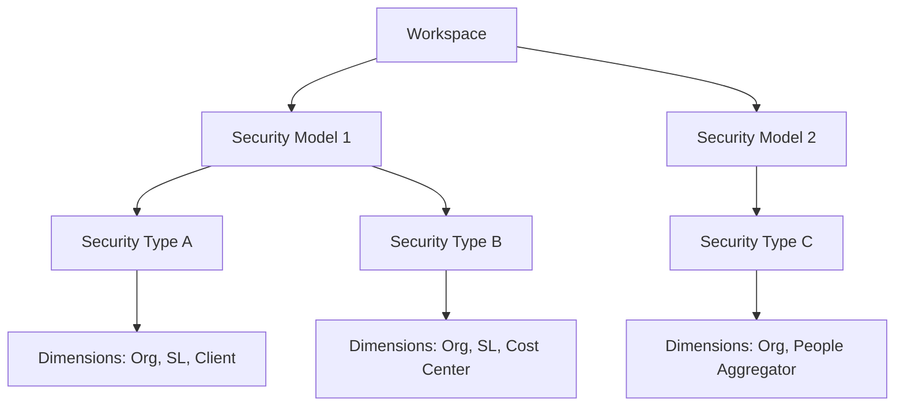

**In words:** **Workspace** → **Security model** (e.g. CDI-Default). **Security model** → **Security type** (e.g. Client Data Insights, Orga, WFI). **Security type** → **which dimensions** are required (e.g. CDI Client Data Insights = Organization + Service Line + Client; WFI = Organization + People Aggregator). So when a user selects a **type**, the system knows **which dimension fields** to show.

---

### RLS approver assignment: you assign approvers per dimension (model + type + dimension values)

**RLS approver assignment** in WSO is: for a given **security model** and **security type**, you build a **dimension combination** (e.g. Region = Americas, Service Line = Overall, Client = All Clients) and **assign one or more approver emails** to that combination. That row is stored in the RLS Approvers tables. When a **requester** later selects the same model, type, and dimension values, the system finds that row and routes the request to those approvers (Pending RLS).

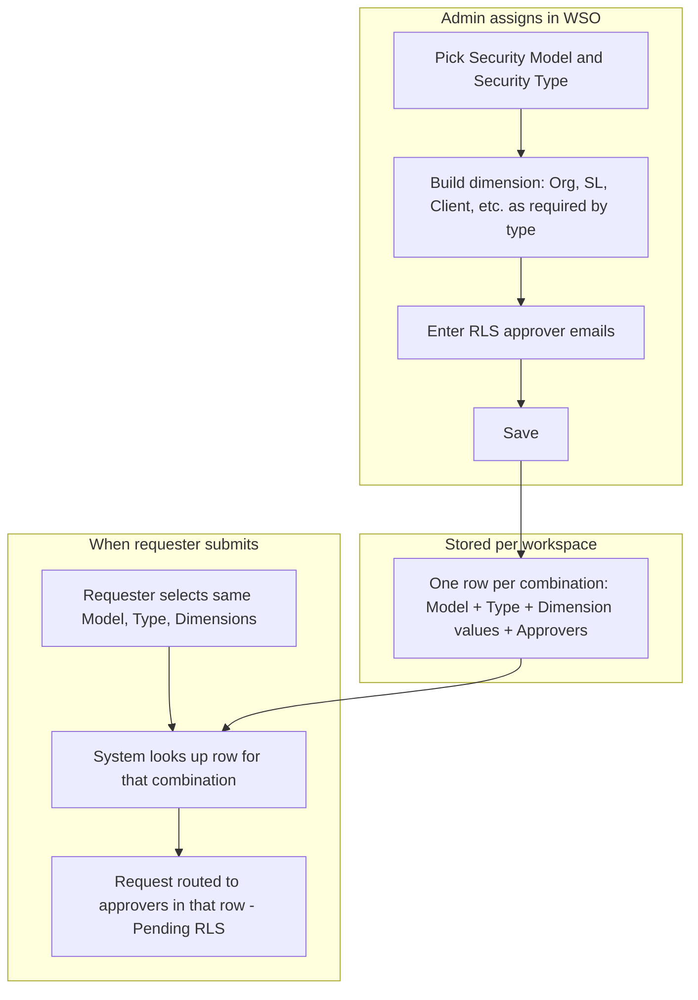

**In words:** **Security model** and **security type** define **which dimensions** exist. Admin **assigns RLS approvers** by choosing model, type, and **filling those dimensions** with values (e.g. Americas, Overall, All Clients) and saving approver emails. That is one **row** in RLS Approvers. When a user **requests** access and selects the same model, type, and dimension values, the system **finds that row** and uses the approvers on it for **Pending RLS**. So RLS approver assignment is **defining who approves which data slice** (which dimension combination).

---

### One diagram: Workspace → OLS vs RLS, and where RLS assignment fits

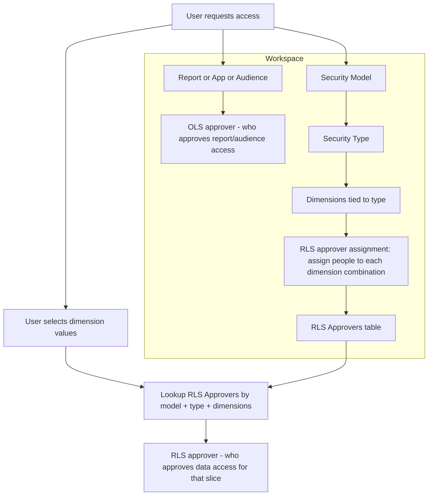

**In words:** **Workspace** has **reports/apps/audiences** → **OLS approver**. Same workspace has **security model** → **security type** → **dimensions** (tied to type). **RLS approver assignment** = filling dimension combinations and assigning approver emails; stored in **RLS Approvers table**. When **user** requests access and selects **dimension values**, system **looks up** that table → gets **RLS approver** for that slice. So: **OLS** = who approves the *object* (report/audience); **RLS** = who approves the *data* (dimension slice), and **RLS assignment** is how you define who that is for each slice.

---

## Definitions

| Term | Meaning |
|------|--------|
| **RLS** | Row-Level Security. Approvers who can approve permission requests for **one specific dimension combination**. |
| **Dimension** | A set of fields that identify *which* data slice an approver covers (e.g. Region + Service Line + Client). The system matches approvers by **full dimension**. |
| **Dimension combination** | Security Model + Security Type + all required dimension fields (Organization, Service Line, Client, etc.) filled. Must be **complete** before the system can find or save an approver. |
| **Assign** | Add or set RLS approvers for a dimension. You choose the dimension; if it already has approvers, they are **pre-populated** so you can edit (reassign). |
| **Reassign** | Change the approver(s) for a dimension that **already has** approvers. Dimensions are read-only; you only change the email list. |
| **Dimension check** | When the dimension combination is complete, the UI looks up existing approvers for that combination and shows "X existing approver(s) found" or "No approver assigned yet" and pre-fills the field if there is a match. |
| **Workspace type** | CDI, WFI, GI, AMER, EMEA, FUM. Each type has **different required dimensions** (see diagram below). |

---

## Diagram 1: Overall flow (Assign vs Reassign)

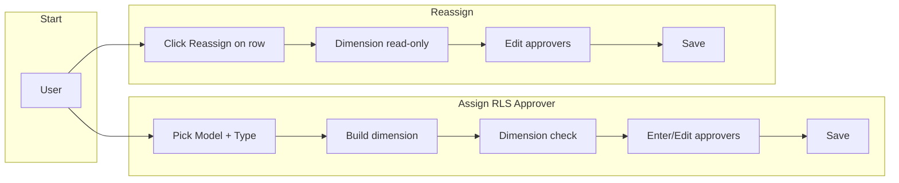

**In words:** Assign = build dimension → check → enter approvers → save. Reassign = open row → dimension fixed → edit approvers → save.

---

## Diagram 2: What each workspace needs (dimensions)

```mermaid
flowchart TB
    subgraph CDI["CDI"]
        C1[Organization]
        C2[Service Line]
        C3[Client]
        C1 --> C2 --> C3
    end
    subgraph WFI["WFI"]
        W1[Organization]
        W2[People Aggregator type]
        W3[People Aggregator]
        W1 --> W2 --> W3
    end
    subgraph GI["GI"]
        G1[Organization]
        G2[Service Line]
        G3[Client]
        G4[MSS]
        G1 --> G2 --> G3 --> G4
    end
    subgraph AMER["AMER"]
        A1[Organization]
        A2[Service Line]
        A3[+ depends on type: Client / CC / MSS / PC / PA]
        A1 --> A2 --> A3
    end
```

**In words:** CDI = Org + SL + Client. WFI = Org + People Aggregator (type + value). GI = Org + SL + Client + MSS. AMER = Org + SL + extra by security type.

---

## Diagram 3: Assign flow step-by-step

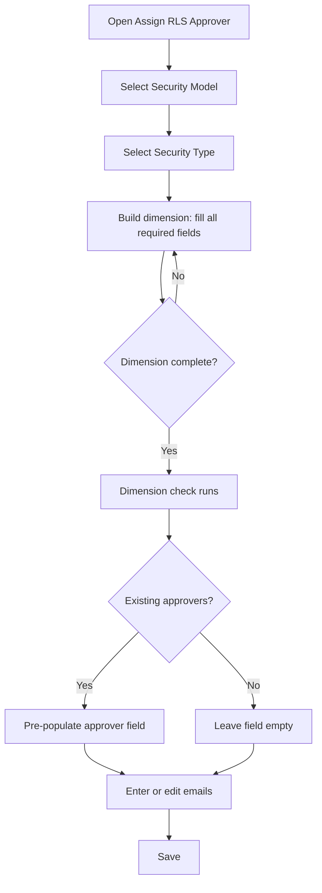

**In words:** Model → Type → fill dimensions → when complete, check runs → pre-fill if match → enter/edit emails → save.

---

## Diagram 4: Reassign flow

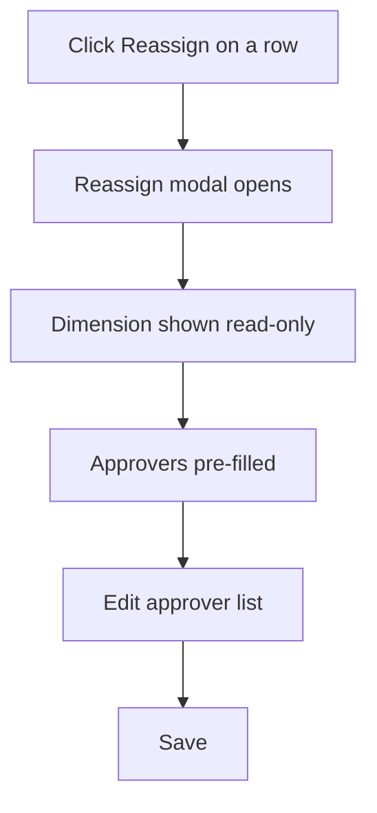

**In words:** Reassign = open modal → dimension fixed → edit approvers → save.

---

## Diagram 5: Dimension check (when does pre-fill happen?)

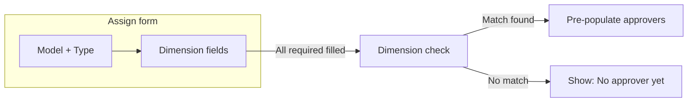

**In words:** Only when **all** required dimension fields are filled does the system look up existing approvers and pre-fill (or show "no approver yet").

---

## One-page summary

| Action | Where | What you do |
|--------|--------|-------------|
| **Assign (new)** | Assign RLS Approver | Model → Type → build full dimension → dimension check → enter emails → Save. |
| **Assign (edit same dimension)** | Assign RLS Approver | Same as above; if dimension already has approvers, they pre-fill — edit and Save = reassign. |
| **Reassign** | Reassign on row | Dimension read-only, approvers pre-filled → edit list → Save. |

**Workspaces (required dimensions):**

- **CDI:** Organization, Service Line, Client
- **WFI:** Organization, People Aggregator type, People Aggregator
- **GI:** Organization, Service Line, Client, MSS
- **AMER:** Organization, Service Line, + (Client / CC / MSS / PC / PA by security type)

---

*Use with:* `Docs\VIDEO_SCRIPT_RLS_APPROVER_ASSIGN_REASSIGN.md` for the full video script and workspace examples.

**FDD references (theory and context):**  
`FDD\04-approver-role.md` (types of approvers, RLS as Step 3), `FDD\08-common-functionality.md` (Traversing The Approver Tree, dimensions, data imports), `FDD\02-workspace-requirements.md` (Security Dimensions per workspace).
