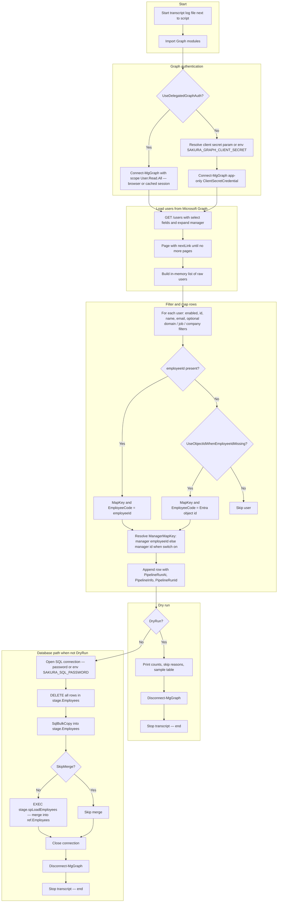

# Sync-EntraEmployeesToSakuraStage.ps1 — flow

Script: [`Sync-EntraEmployeesToSakuraStage.ps1`](./Sync-EntraEmployeesToSakuraStage.ps1)

End-to-end: **Microsoft Entra (Graph)** → **`stage.Employees`** → **`stage.spLoadEmployees`** → **`ref.Employees`** (and **`refv.Employees`**).

## Flowchart

## Notes

- **`spLoadEmployees`** treats the staged set as the full snapshot: anyone in **`ref.Employees`** not present in **`stage.Employees`** after merge can be soft-deleted when stage is non-empty (see procedure logic in `Sakura_DB`).
- Disable the Fabric Employees transfer (**`mgmt.DataTransferSettings`**, `IsActive = 0` for `stage.Employees` / `P_REF_CENTRAL_IMPORT`) if you do not want ADF to overwrite this path.
