# Workspace Admin Guide

This guide is for **Workspace Admins** (WSO): users who manage a workspace’s apps, audiences, reports, security models, mappings, and approvers. You see only workspaces where you are listed as an owner.

---

## In this guide

| Section | What you'll do |
|--------|-----------------|
| [Open WSO and select workspace](#open-the-wso-console-and-select-your-workspace) | Enter the console and pick your workspace |
| [Change workspace properties](#change-workspace-properties) | Edit owner, approver, domain, etc. |
| [Manage Apps](#manage-apps-in-the-workspace) | List, add, edit, activate, deactivate apps |
| [Manage Audiences](#manage-audiences-for-audience-based-apps) | Add audiences for audience-based apps |
| [Associate reports with audience (Report → Audience)](#associate-reports-with-an-audience-report--audience) | Link AUR reports to audiences (Mappings tab) |
| [Manage Reports](#manage-reports-in-the-workspace) | Add/edit reports, set AUR vs SAR and approvers |
| [Manage Security Models](#manage-security-models-in-the-workspace) | List, add, edit, activate/deactivate security models |
| [Link reports to Security Models](#link-reports-to-security-models-report--security-model) | Assign which security models a report uses (Mappings tab) |
| [Map Security Model to Security Type](#map-security-model-to-security-type-security-model--type) | Link security types to models (Mappings tab) |
| [Approver assignments](#approver-assignments) | View and assign OLS and RLS approvers |
| [Permission requests](#permission-requests) | View and manage permission requests (list, details, revoke) |
| [View user's security context](#view-a-users-security-context-in-the-workspace) | Check a user’s access in the workspace |
| [Export to Excel](#export-workspace-data-to-excel) | Export workspace data |

---

## What you can do as a Workspace Admin

- Everything a Requester can do  
- See the list of **workspaces** where you are in the Owner fields  
- **Change workspace properties** (including approvers); you cannot delete a workspace  
- **Define or deactivate Apps**, **Reports**, and **Security Models** in the workspace  
- For each report: **define which Security Models** it uses  
- For each app (if Approval Workflow = Audience Based): **define or deactivate Audiences**  
- For each app: **define Additional Dynamic Questions**  
- For each app audience: **associate or remove Reports** (AUR only)  
- **Manage RLS Approvers** for your workspace’s security models  
- **View** all requests under your workspace and **revoke** access requests  
- **View** request details, history, and chain status; **view** a user’s security context in the workspace  
- **Export** workspace object data to Excel  
- **Deactivate** apps, audiences, reports, security models; **remove** report–audience and report–security model associations  

---

## Open the WSO Console and select your workspace

1. Sign in to Sakura (see [README](README.md#signing-in)).
2. Open **WSO Console** or **Workspace Console** (or the equivalent menu item).
3. You will see a list of **workspaces where you are an owner**. Select the workspace you want to manage.

**Why it matters:** All following steps apply to the workspace you select. The console is the single place to manage apps, reports, audiences, and security.

---

## Select workspace (Predefined by Sakura Administrators)

Workspaces are created and assigned by **Sakura Administrators**. You only see workspaces where you are listed as an owner. After opening the WSO Console, select the workspace you want to manage from the list. The selected workspace determines which apps, reports, audiences, and security models you can configure.

**Why it matters:** Correct owners and approvers ensure the right people can manage the workspace and approve access.

> **Note:** You cannot delete a workspace; only an Administrator can create workspaces. You can deactivate one from the Admin area if your organisation allows it.

---

## Manage Apps in the workspace

This section covers how to list, add, view, edit, activate, and deactivate apps in your workspace.

### List apps

1. In the WSO Console, select your workspace and open the **Apps** tab.

You will see:

- **Tabs** — Apps, Audiences, Reports, and Mappings (with counts). Use these to switch between sections.
- **Search** — Type to filter apps by name, code, or owner.
- **Active only** — Toggle **on** to show only active apps; turn **off** to include inactive apps.
- **Refresh** — Reload the list from the server.
- **Add new app** — Opens the form to add an app (see [Add App](#add-app)).

The **table** shows one row per app with: **App code**, **App name**, **App owner**, **Technical owner**, **Approval workflow**, **OLS mode**, **Audiences** (count), **Status**, **Last modified**, and **Actions** (⋮). In the **Actions** menu you can **View Details**, **Edit App**, or **Deactivate App**. The header shows how many apps are listed (e.g. “Showing 1 of 1 total”).

### Add App

1. In the WSO Console, select your workspace and open the **Apps** tab.
2. Click **Add new app**.

3. Fill in the form:

   | Field | What to enter |
   |-------|----------------|
   | **App code** | Uppercase letters and numbers, max 50 characters (e.g. FIN, MKTG, HR). Cannot be changed after you save. |
   | **App name** | The display name users will see. |
   | **Workspace** | Select the workspace if not already set. |
   | **App owner** | One or two owner email addresses. |
   | **Support contact** | One or two technical owner email addresses. |
   | **OLS Security Mode** | **Unmanaged** — Power BI manages security; **Managed** — Sakura manages security (you must then enter **App Entra Group UID**, the Azure AD/Entra ID group GUID, 36 characters). |
   | **Approval Workflow** | **App Based** — one approval for the whole app (you can set **OLS approver** emails); **Audience Based** — separate approvals per audience (for AUR-style access). |
   | **Additional Dynamic Questions** | Optional. Add custom questions that requesters answer when requesting access. |

4. Click **Add new app**. A success message appears and the app is added to the list.
5. To see the new app in the list, turn **Active only** off if it does not appear.

**Why it matters:** Apps are the containers for audiences and reports. **Approval Workflow** controls whether access is approved once per app (App Based) or per audience (Audience Based). **OLS Security Mode** and **App Entra Group UID** (when Managed) control how Sakura syncs with Power BI and Entra ID.

### View Details

To see full details of an app without editing:

1. In the **Apps** tab, find the app and open the **Actions** menu (⋮).
2. Click **View Details**. A panel or page opens with the app’s details.

### Edit app

1. In the **Apps** tab, find the app and open the **Actions** menu (⋮).
2. Click **Edit App**. The add-app form opens with the current values. **App code** cannot be changed.
3. Update any fields you need (App name, App owner, Support contact, OLS Security Mode, App Entra Group UID, Approval Workflow, or Additional Dynamic Questions). For **App Based** apps you can also change **OLS approver** emails here.
4. Click **Update App**. A success message confirms the update.

**Why it matters:** Keeping app details and approvers correct ensures the right approval flow and contact information for requesters and approvers.

### Activate app

To make a previously deactivated app active again:

1. In the **Apps** tab, turn the **Active only** toggle **off** so that inactive apps appear in the list.
2. Find the app and open the **Actions** menu (⋮). Choose **Activate** (or the equivalent).
3. Confirm if a dialog appears. The app status becomes **Active** and requesters can use it again.

**Why it matters:** Activating an app restores it for new access requests without having to add it again.

### Deactivate app

To stop an app from being used for new requests (existing access may still apply, depending on your organisation):

1. In the **Apps** tab, find the app and open the **Actions** menu (⋮).
2. Click **Deactivate App**.
3. Confirm in the dialog. The app status becomes inactive and it no longer appears for new access requests.

**Why it matters:** Deactivating hides the app from new requests while keeping history and existing access as defined by your organisation.

---

## Manage Audiences (for Audience-based apps)

Audiences are used only for apps whose **Approval Workflow** is **Audience Based**. They define who gets access to **AUR (Audience) reports**. You list, add, view, edit, update approvers, activate/inactivate, or delete audiences from the **Audiences** tab. Linking reports to audiences is done in the **Mappings** tab (see [Associate reports with an audience (AUR)](#associate-reports-with-an-audience-aur-only)).

> **Technical note:** Only **Audience Based** apps have audiences. AUR reports are linked to audiences in Mappings; SAR (single-access) reports use approvers instead.

---

### List audiences

1. In the WSO Console, select your workspace (filter by workspace).
2. Open the **Audiences** tab.

You will see:

- **Search** — Filter audiences by name, code, or app.
- **Active only** — Toggle **on** to show only active audiences; turn **off** to include inactive.
- **Refresh** — Reload the list from the server.
- **Add new audience** — Opens the form to add an audience (see [Add audience](#add-audience)).

The **table** shows one row per audience with: **Audience name**, **Audience code**, **Parent app**, **OLS approvers**, **Status**, **Last modified**, and **Actions** (⋮). In the **Actions** menu you can **View Details**, **Edit Audience Details**, **Update OLS Approvers**, toggle **Active/Inactive**, or **Delete Audience**. The header shows how many audiences are listed (e.g. “Showing X of Y total”).

---

### Add audience

1. In the WSO Console, select your workspace and open the **Audiences** tab.
2. Click **Add new audience**.

3. Fill in the form:

   | Field | What to enter |
   |-------|----------------|
   | **Audience name** | The display name (e.g. Regional Leads, Commercial Finance). The system generates **Audience code** from this (uppercase, spaces → underscores; e.g. “Regional Leads” → REGIONAL_LEADS). Max 255 characters. |
   | **Workspace** | Select the workspace (if not already set by the filter). |
   | **App** | Select an app. Only **Audience Based** apps appear. Cannot be changed after save. |
   | **OLS approver** | One or more approver email addresses (up to 10). Required. These users approve access requests for this audience. |
   | **Entra Group ID** | Optional. Azure AD/Entra ID group UID to link this audience to an Entra security group. |

4. Click **Add new audience**. A success message appears and the audience is added to the list.

**Why it matters:** Each audience represents a group of users who get access to the reports you link to it. **OLS approvers** receive and act on access requests for this audience. **Entra Group ID** lets Sakura sync with your Entra group when configured.

---

### View Details

To see full details of an audience without editing:

1. In the **Audiences** tab, find the audience and open the **Actions** menu (⋮).
2. Click **View Details**. A panel or modal opens with the audience’s details (code, name, app, OLS approvers, status, Entra Group ID, etc.).

---

### Edit audience

1. In the **Audiences** tab, find the audience and open the **Actions** menu (⋮).
2. Click **Edit Audience Details**. The form opens with the current values. **Workspace** and **App** cannot be changed.
3. Update **Audience name**, **OLS approver**, or **Entra Group ID** as needed.
4. Click **Update audience**. A success message confirms the update.

**Why it matters:** Keeping audience name and approvers correct ensures the right people approve requests and users see the right labels.

---

### Update OLS Approvers

To change only the approvers for an audience (without editing other fields):

1. In the **Audiences** tab, find the audience and open the **Actions** menu (⋮).
2. Click **Update OLS Approvers**. A dialog or form opens with the current approver emails.
3. Add, remove, or change email addresses. Save. Approvers receive access requests for this audience.

---

### Activate or deactivate an audience

Audiences have an **Active/Inactive** status. Inactive audiences do not appear for new access requests (existing access may still apply, depending on your organisation).

1. In the **Audiences** tab, find the audience and open the **Actions** menu (⋮).
2. Use the **Active/Inactive** toggle in the menu. When you turn it off, the audience becomes **Inactive**; turn it on to make it **Active** again. Confirm if a dialog appears.

**Why it matters:** Deactivating hides the audience from new requests while keeping history. Activating restores it without recreating it.

---

### Delete audience

Removing an audience is permanent. Ensure no critical report–audience mappings or access depend on it before deleting.

1. In the **Audiences** tab, find the audience and open the **Actions** menu (⋮).
2. Click **Delete Audience**. Confirm in the dialog. The audience is removed from the workspace.

**Why it matters:** Delete only when the audience is no longer needed. Consider deactivating instead if you may need it again.

---

## Associate reports with an audience (Report → Audience)

AUR (Audience) reports are delivered to users who belong to an audience. You link reports to audiences in **Object Management → Mappings** tab under **Report → Audience**. Only reports with **Delivery method = Audience-based (AUR)** should be linked here.

---

### List Report → Audience mappings

1. In the WSO Console, select your workspace and open **Object management** (Apps / Audiences / Reports / Mappings).
2. Open the **Mappings** tab and select **Report → Audience** (first button). You see a **Search** box (by report or audience name), **Add Mapping**, and a table of existing mappings.

The **table** shows: **Report Name**, **Report Code**, **Audience Name**, **App Name**, **Workspace**, **Created By**, **Created At**, and **Actions** (Delete). Use **Search** to filter; use the trash button in **Actions** to remove a mapping.

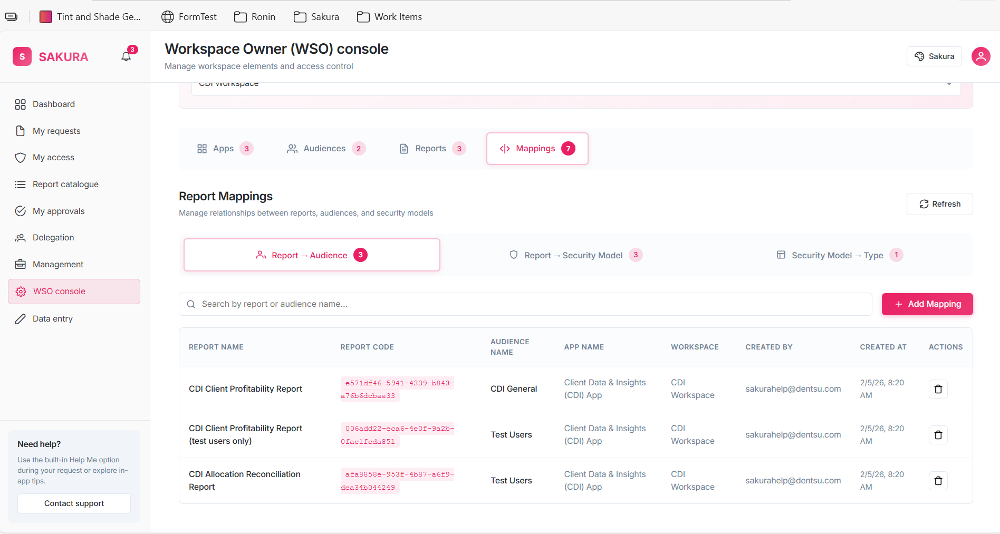

*Screen: Mappings tab with Report → Audience selected — table of report–audience links, Search, and Add Mapping button.*

---

### Add Report → Audience mapping

1. In **Mappings → Report → Audience**, click **Add Mapping**.
2. Select **Application (App)** from the dropdown. Only **Audience Based** apps appear. This filters the next step.
3. Select **Audience**. Only audiences for the chosen app are shown.
4. Select one or more **Reports** to link to that audience. Only **AUR (Audience-based)** reports are listed. You can select multiple reports.
5. Click **Apply** or **Save**. A success message appears and the new mappings show in the table.

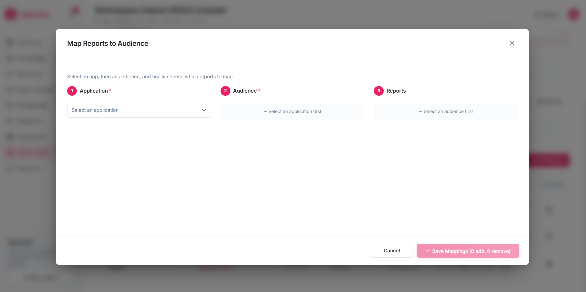

*Screen: Add Mapping modal opened — first step to link reports to an audience.*

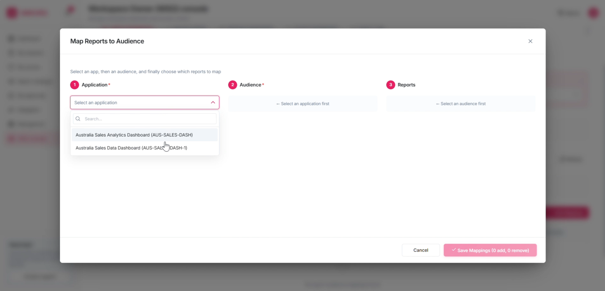

*Screen: Application (App) dropdown — choose the Audience Based app that owns the audience.*

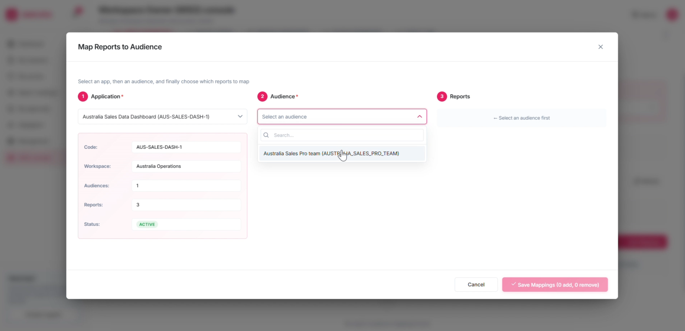

*Screen: Audience dropdown — choose the audience to link reports to (filtered by the app you selected).*

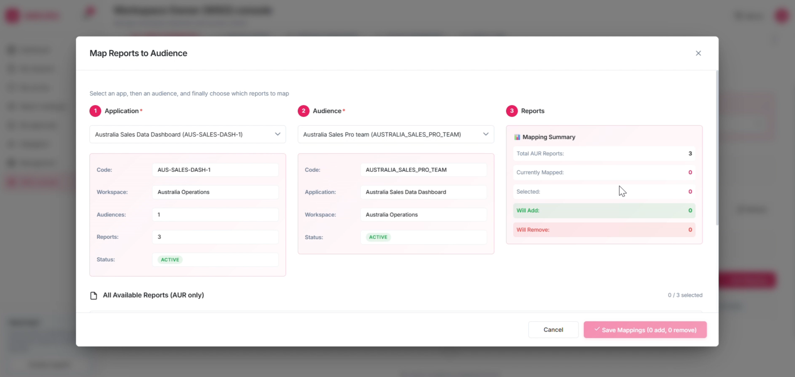

*Screen: List of reports — select one or more AUR reports to link to the chosen audience.*

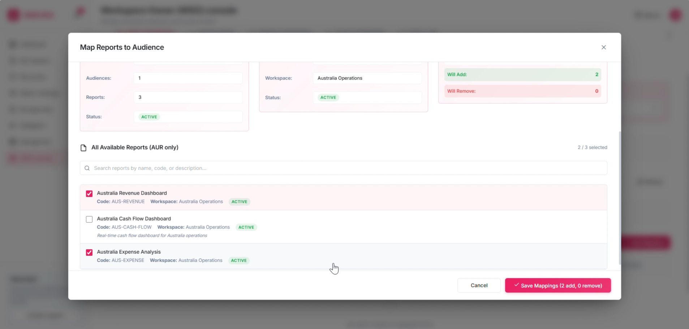

*Screen: Apply or Save control — confirm the mapping after selecting app, audience, and reports.*

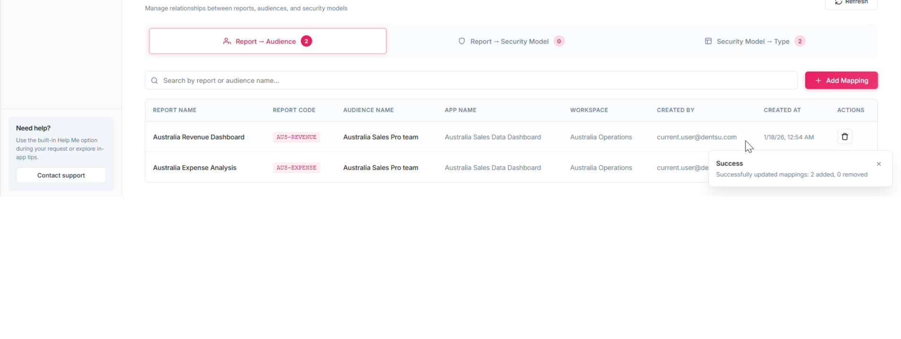

*Screen: Success message after the report–audience mapping is created.*

**Why it matters:** Linking a report to an audience gives everyone in that audience access to the report (AUR). Without a mapping, the report is not available to that audience. SAR (single-access) reports use approvers instead and are not linked to audiences here.

---

### Delete Report → Audience mapping

1. In the **Report → Audience** table, find the row (report + audience) you want to remove.
2. Click the **Delete** (trash) button in the **Actions** column. Confirm in the dialog. A success message confirms the mapping was removed.

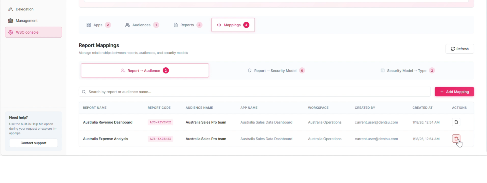

*Screen: Delete (trash) button in the Actions column for a report–audience row.*

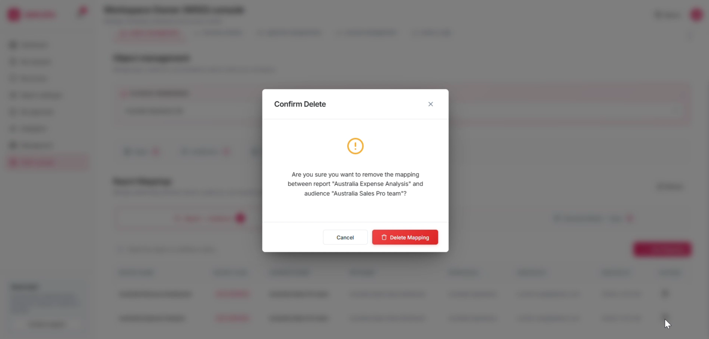

*Screen: Confirmation dialog asking you to confirm removal of the mapping.*

*Screen: Success message after the mapping is deleted.*

---

## Manage Reports in the workspace

Reports are what users request access to. Each report has a **delivery method**: **AUR (Audience-based)** — access via audience membership, linked in the Mappings tab; or **SAR (Single Access)** — user requests access and **Approvers** approve. This section covers how to list, add, view, edit, update approvers (SAR), activate/deactivate, and delete reports.

---

### List reports

1. In the WSO Console, select your workspace (filter by workspace).
2. Open the **Reports** tab (**Workspace Reports**).

You will see:

- **Search** — Filter reports by name, code, tag, or owner.
- **Active only** — Toggle **on** to show only active reports; turn **off** to include inactive.
- **Refresh** — Reload the list from the server.
- **Add new Report** — Opens the form to add a report (see [Add report](#add-report)).

The **table** shows one row per report with: **Report Code**, **Report Name**, **Report Tag**, **Delivery Method** (Single Access or Audience-based), **Owner**, **Status**, and **Actions** (⋮). In the **Actions** menu you can **View Details**, **Edit Report Details**, **Update Approvers** (SAR only), toggle **Active/Inactive**, or **Delete Report**. The header shows how many reports are listed (e.g. “Showing X of Y total”).

---

### Add report

1. In the WSO Console, select your workspace and open the **Reports** tab.
2. Click **Add new Report**.

3. Fill in the form:

   | Field | What to enter |
   |-------|----------------|
   | **Report code** | Unique code (e.g. FIN_MONTHLY). Cannot be changed after creation. |
   | **Report name** | The display name users will see. |
   | **Workspace** | Select the workspace (if not already set by the filter). |
   | **Report tag** | A tag for grouping or filtering reports. |
   | **Report owner** | One or two owner email addresses. |
   | **Delivery method** | **Audience-based (AUR)** — access via audiences; link the report to audiences in the **Mappings** tab. **Single Access (SAR)** — users request access; you must set **Approvers**. |
   | **Approvers** | For **SAR** only. One or more approver emails (up to 10). Required for SAR. |
   | **Entra Group UID** | Optional. Reserved for future use. |
   | **Description** | Optional. Helps users understand what the report provides. |
   | **Keywords** | Optional. Comma-separated, max 10, for search. |

4. For **AUR** reports, leave Approvers empty; fill **Report code**, **Report name**, **Workspace**, **Report tag**, **Report owner**, and **Delivery method = Audience-based**. Then add the report and link it to audiences in the **Mappings** tab.

5. Click **Add Report**. A success message appears and the report is added to the list.

**Why it matters:** **AUR** reports are delivered to users in the audiences you link in Mappings. **SAR** reports require user requests; the **Approvers** you set receive and act on those requests.

---

### View Details

To see full details of a report without editing:

1. In the **Reports** tab, find the report and open the **Actions** menu (⋮), or click the report name.
2. Click **View Details**. A panel or modal opens with the report’s details (code, name, tag, delivery method, owner, approvers if SAR, status, etc.).

---

### Edit report

1. In the **Reports** tab, find the report and open the **Actions** menu (⋮).
2. Click **Edit Report Details**. The form opens with the current values. **Report code** cannot be changed.
3. Update **Report name**, **Report tag**, **Report owner**, **Delivery method**, **Approvers** (for SAR), **Description**, or **Keywords** as needed.
4. Click **Save Changes**. A success message confirms the update.

**Why it matters:** Keeping report details and approvers correct ensures the right people approve SAR requests and users see accurate names and tags.

---

### Update Approvers (SAR only)

For **Single Access (SAR)** reports, you can change approvers without editing other fields:

1. In the **Reports** tab, find the **SAR** report and open the **Actions** menu (⋮).
2. Click **Update Approvers**. A dialog or form opens with the current approver emails.
3. Add, remove, or change email addresses. Save. These approvers receive access requests for this report.

---

### Activate or deactivate a report

Reports have an **Active/Inactive** status. Inactive reports do not appear for new requests (existing access may still apply, depending on your organisation).

1. In the **Reports** tab, find the report and open the **Actions** menu (⋮).
2. Use the **Active/Inactive** toggle in the menu. When you turn it off, the report becomes **Inactive**; turn it on to make it **Active** again. Confirm if a dialog appears.

**Why it matters:** Deactivating hides the report from new requests while keeping history. Activating restores it without recreating it.

---

### Delete report

Removing a report is permanent. Ensure no critical mappings or access depend on it before deleting.

1. In the **Reports** tab, find the report and open the **Actions** menu (⋮).
2. Click **Delete Report**. Confirm in the dialog. The report is removed from the workspace.

**Why it matters:** Delete only when the report is no longer needed. Consider deactivating instead if you may need it again.

---

## Manage Security Models in the workspace

Security models define the row-level security (RLS) dimensions used in your workspace. Each model has a **name**, **code**, and **security types** (mapped to the model). Reports are linked to security models in the **Mappings** tab (Report → Security Model); security types are linked to models when you add a model or in **Mappings** (Security Model → Type). This section covers the **Security Models** area: list, add, view, edit, activate/deactivate, and delete.

---

### List security models

1. In the WSO Console, open **Security Models** (from the main WSO menu or console).
2. Use **Filter by workspace** to restrict to one workspace.
3. You will see **Search** (by name, code, or description), **Active only** / **Show all** toggle, **Refresh**, and **Add security model**.

The **table** shows: **Model name**, **Code**, **Security types** (badges), **Dimensions**, **Status**, **Last modified**, and **Actions** (⋮). In the **Actions** menu you can **View Details**, **Edit Model Details**, toggle **Active/Inactive**, or **Delete Model**.

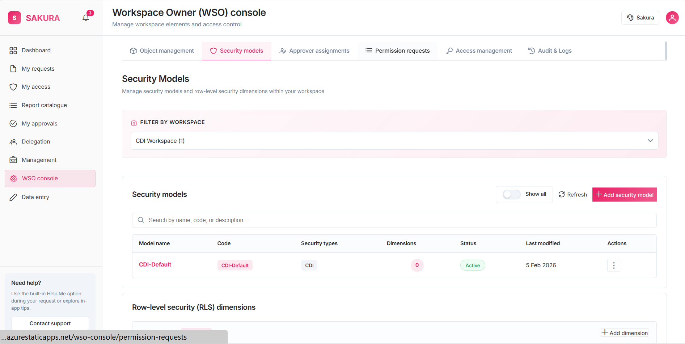

---

### Add security model

1. In **Security Models**, click **Add security model**.
2. Fill in **Model name** and **Workspace** (required). Model name cannot be changed after creation.
3. In **Security type mapping**, select one or more **Security types** (checkboxes; use the search to filter). At least one security type is required. These link the model to the types used for RLS dimensions.
4. Click **Add** or **Save**. A success message appears and the model is listed with its security types.

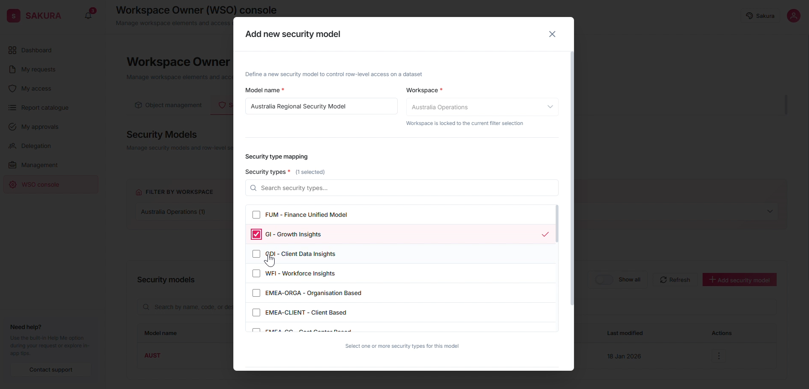

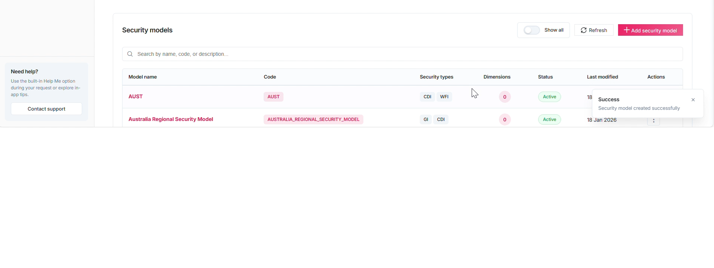

**Why it matters:** Security models group security types that apply to reports. Linking types at creation (or in Mappings) defines which dimensions the model uses for RLS approval routing.

---

### View Details

1. In the **Security Models** table, find the model and open the **Actions** menu (⋮), or click the model name.
2. Click **View Details**. A panel or modal opens with the model’s details (name, code, workspace, security types, dimensions, status).

---

### Edit security model

1. In the **Security Models** table, find the model and open the **Actions** menu (⋮).
2. Click **Edit Model Details**. The form opens; **Model name** and **Workspace** cannot be changed. Update **Security types** (add or remove) as needed.
3. Save. A success message confirms the update.

---

### Activate or deactivate a security model

1. In the **Security Models** table, find the model and open the **Actions** menu (⋮).
2. Use the **Active/Inactive** toggle. When off, the model is **Inactive**; turn it on to make it **Active** again.

**Why it matters:** Inactive models are hidden from new report mappings and RLS flows; activating restores them.

---

### Delete security model

1. In the **Security Models** table, find the model and open the **Actions** menu (⋮).
2. Click **Delete Model**. Confirm in the dialog. The model is removed. Ensure no reports or RLS approvers depend on it before deleting.

---

## Link reports to Security Models (Report → Security Model)

Reports can use one or more **security models** for row-level security (RLS). You link them in **Object Management → Mappings** tab under **Report → Security Model**. This determines which RLS dimensions and approvers apply when users request access to a report.

---

### List Report → Security Model mappings

1. In the WSO Console, select your workspace and open **Object management**.
2. Open the **Mappings** tab and select **Report → Security Model** (second button). You see **Search** (by report or security model name), **Add Mapping**, and a table of existing mappings.

The **table** shows: **Report Name**, **Report Code**, **Security Model Name**, **Security Model Code**, **Workspace**, **Created By**, **Created At**, and **Actions** (Delete). Use the trash button in **Actions** to remove a mapping.

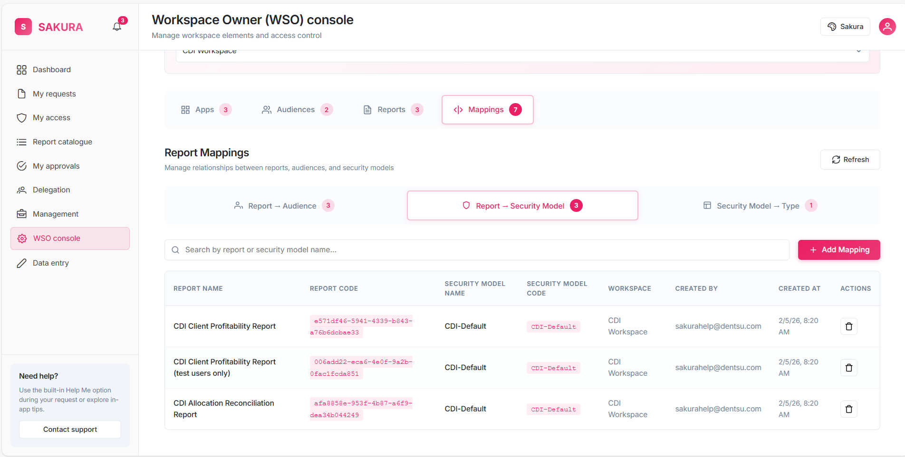

*Screen: Mappings tab with Report → Security Model selected — table of report–security model links, Search, and Add Mapping button.*

---

### Add Report → Security Model mapping

1. In **Mappings → Report → Security Model**, click **Add Mapping**.
2. Select **Security model** from the dropdown. Models for your workspace(s) are listed.
3. After the model is selected, the list of **Reports** is shown (or populated). Select one or more reports to link to that security model.
4. Click **Apply** or **Save**. A success message appears and the new mappings show in the table.

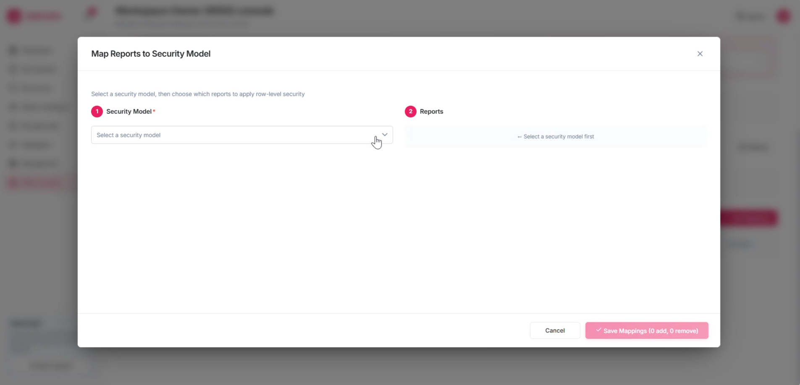

*Screen: Add Mapping modal opened — first step to link reports to a security model.*

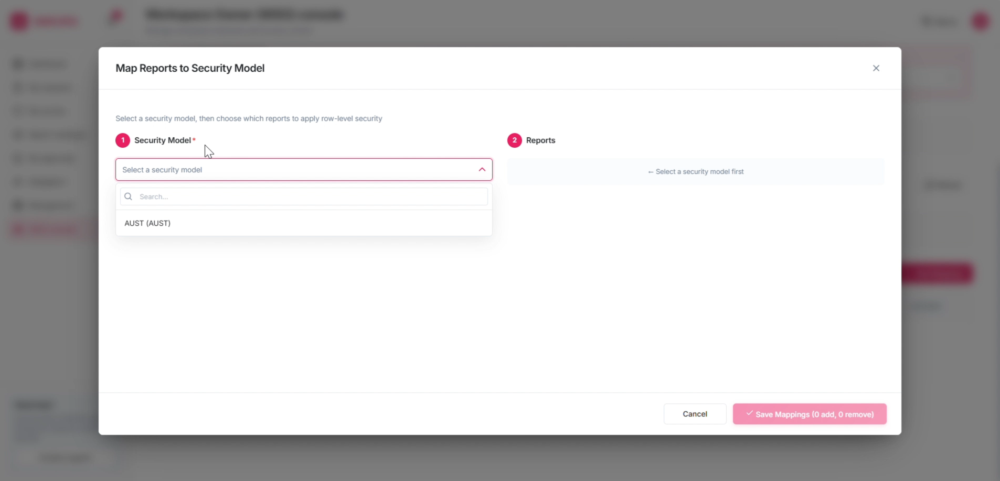

*Screen: Security model dropdown — choose the model to link reports to.*

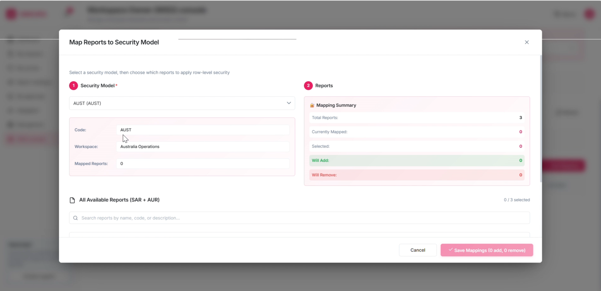

*Screen: List of reports — select one or more reports to link to the chosen security model.*

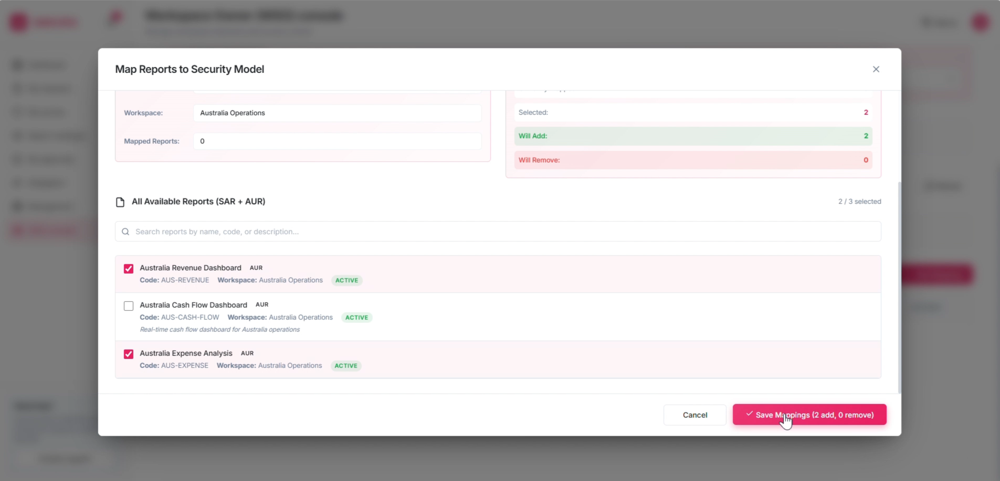

*Screen: Apply or Save control — confirm the report–security model mapping.*

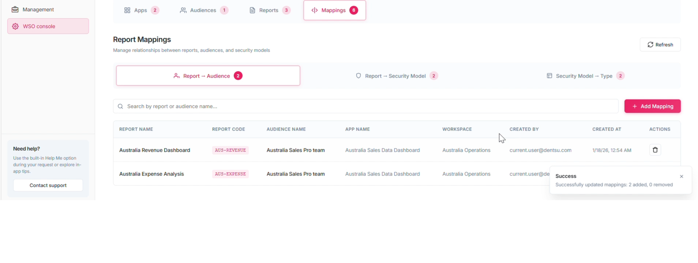

*Screen: Success message after the mapping is created.*

**Why it matters:** Linking a report to a security model tells the system which RLS dimensions and approvers apply when users request access to that report. RLS approvers are assigned per security model/type in the **Approver assignments** area.

---

### Delete Report → Security Model mapping

1. In the **Report → Security Model** table, find the row (report + security model) you want to remove.
2. Click the **Delete** (trash) button in the **Actions** column. Confirm in the dialog. The mapping is removed.

---

## Map Security Model to Security Type (Security Model → Type)

Security types (e.g. Region, Cost Centre) are linked to security models so the model knows which dimensions it uses. You can assign types when **adding a security model** (see [Add security model](#add-security-model)) or later in the **Mappings** tab under **Security Model → Type**.

1. In the WSO Console, select your workspace and open the **Mappings** tab (in Object management).
2. Select the **Security Model → Type** mapping type (third button). You see a table of existing security model–to–security type mappings and an **Add Mapping** button.

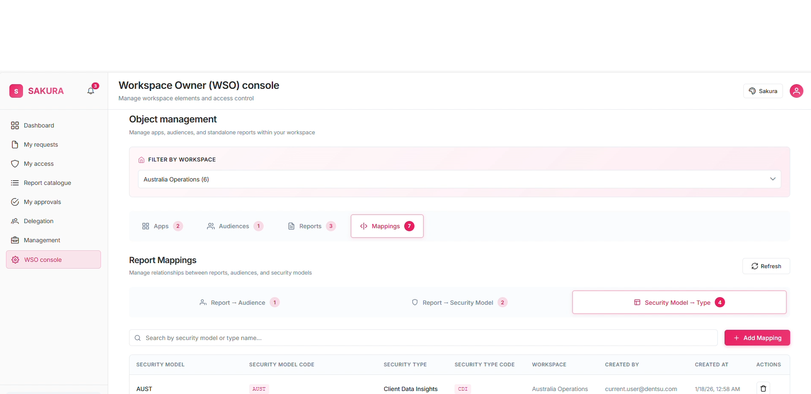

3. **Add a mapping:** Click **Add Mapping**. Select a **Security model** from the dropdown. The available **Security types** for that model (from the List of Values) are shown; select one or more types to link to the model. Click **Apply** or **Save** to create the mapping(s).

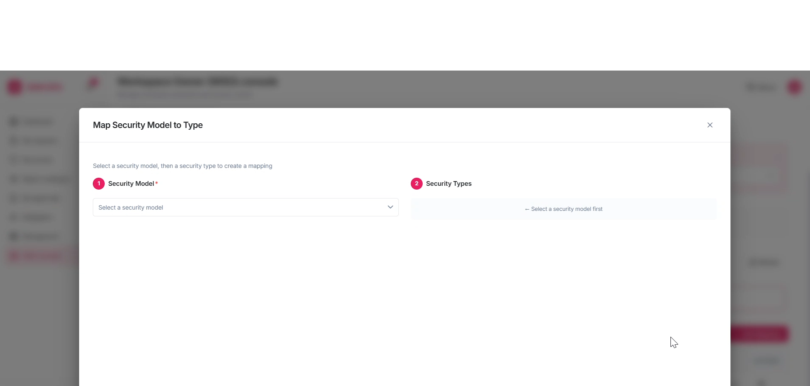

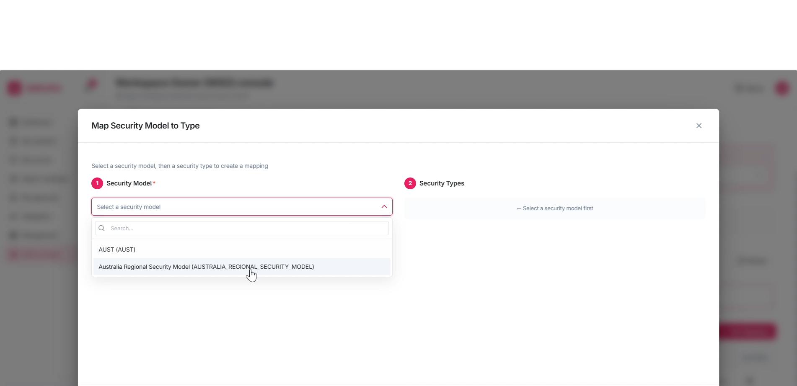

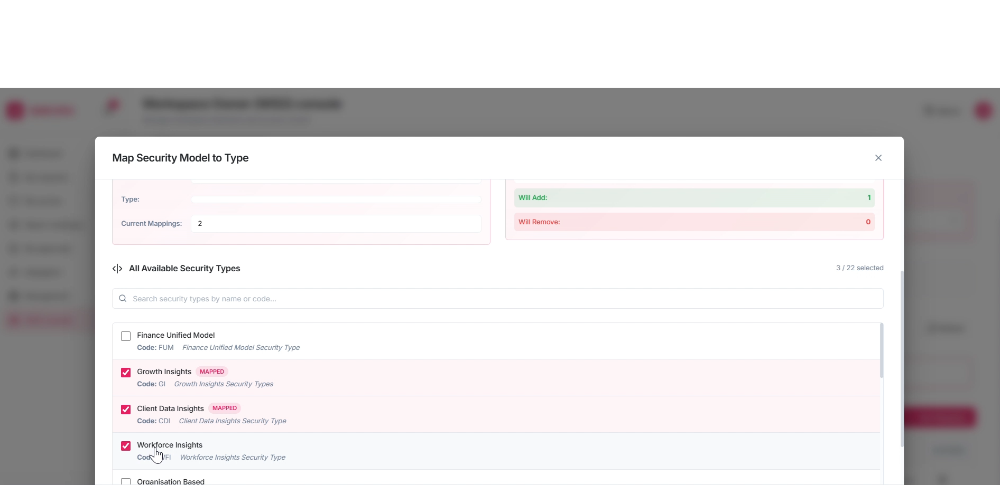

4. **Remove a mapping:** In the table, find the row (Security Model + Security Type) and click the **Delete** (trash) button. Confirm in the dialog. A success message confirms the removal.

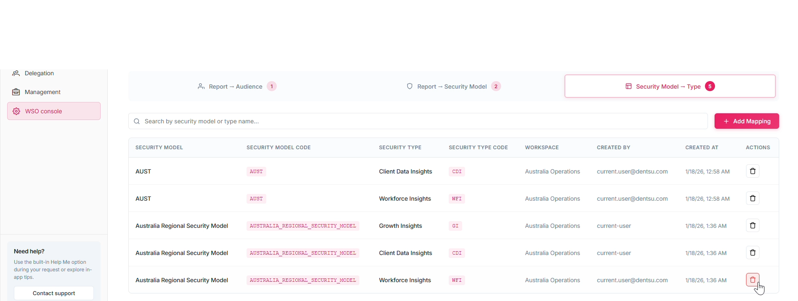

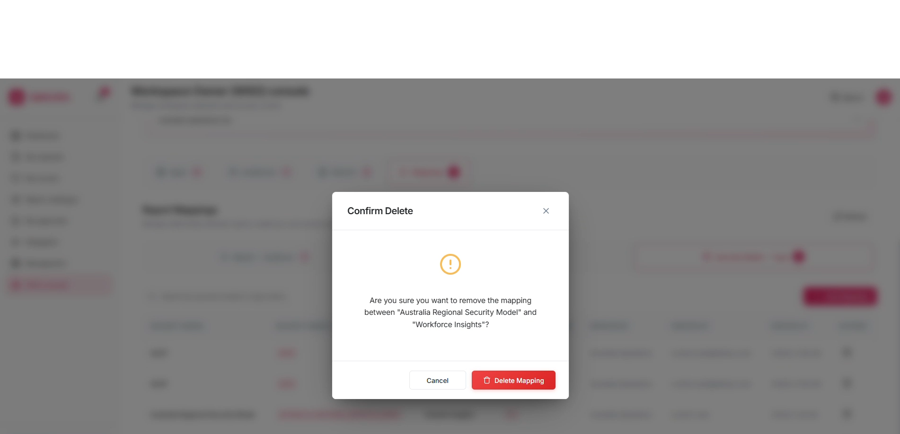

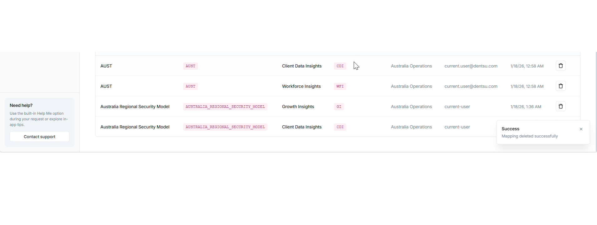

**Why it matters:** Security model → type mappings define which dimensions (e.g. Region, Cost Centre) each model uses. RLS approvers are then assigned per security type/dimension so requests are routed correctly.

---

## Approver assignments

**Approver assignments** is where you view and manage who approves access requests: **OLS** (object-level: apps, audiences, standalone reports) and **RLS** (row-level: security dimensions). Open it from the WSO Console menu (**Approver assignments** or the equivalent).

You’ll see **two tabs**:

- **Object-level security (OLS) approvers** — Who approves access to an entire app, audience, or SAR report. You set OLS approvers when you [add or edit an app](#add-app) (App Based) or [add or edit an audience](#add-audience). Here you **view** them and **Reassign** if needed.
- **Row-level security (RLS) approvers** — Who approves access to a specific **security dimension** (e.g. Region, Cost Centre). You **assign** or **reassign** RLS approvers here so that requests for that dimension are routed to the right person.

Use **Filter by workspace** at the top to limit the list to one workspace.

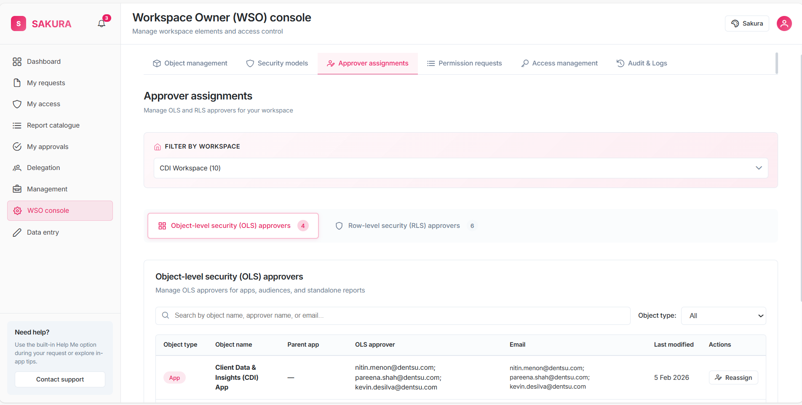

---

### OLS approvers tab

**What you see:** A table of all OLS approvers: **Object type** (App, Audience, or Standalone report), **Object name**, **Parent app**, **OLS approver** (name and email), **Last modified**, and **Actions** (**Reassign**).

**What you can do:**

- **Search** by object name, approver name, or email.
- **Filter** by object type: All, Apps, Audiences, or Standalone reports.
- **Reassign** — Click **Reassign** on a row to change the OLS approver for that app, audience, or report. Enter the new approver email and save.

OLS approvers are first set when you create or edit an **App** (App Based) or an **Audience**; this tab is for viewing and changing them in one place.

---

### RLS approvers tab — list and filters

**What you see:** A table of **security dimensions** and their RLS approvers: **Security model**, **Dimension** (summary), **Approvers** (emails or “No approver assigned”), **Last modified**, and **Actions** (**Assign** or **Reassign**).

**What you can do:**

- Click **Assign RLS Approver** to add an approver to a dimension (see next section).
- **Search** by security model, dimension, or approver.
- **Filter** by: **All**, **With Approver**, or **Without Approver** (to find dimensions that still need an approver).
- **Assign** — For a row with “No approver assigned”, click **Assign** to open the assign flow.
- **Reassign** — For a row that already has an approver, click **Reassign** to change the approver.

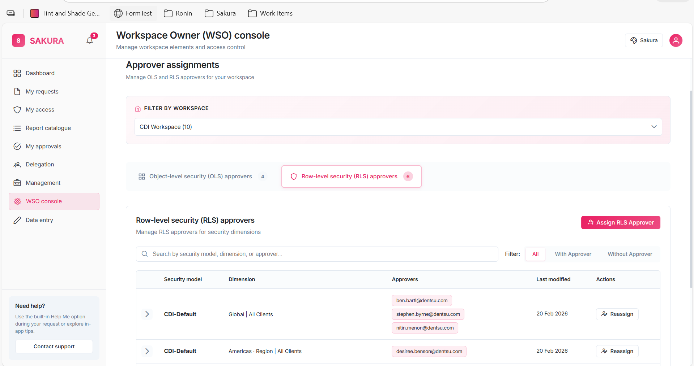

---

### Assign RLS Approver — step-by-step

To assign an RLS approver to a security dimension:

1. **Open the assign form** — In the **RLS approvers** tab, click **Assign RLS Approver**. A modal opens: “Assign a Row-Level Security (RLS) approver to a security dimension”.

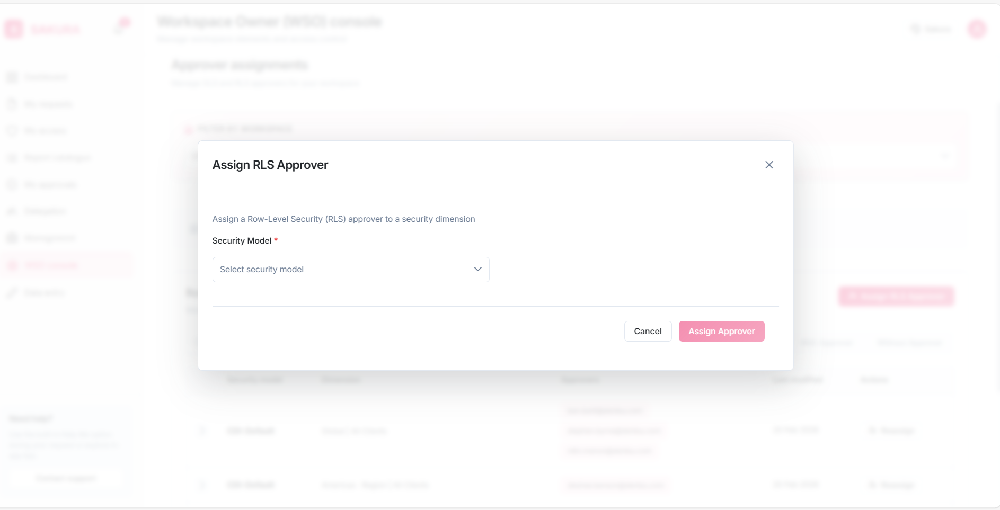

2. **Choose Security Model** — In the dropdown, select the **Security model** (e.g. AMER, CDI). This loads the security types for that model.

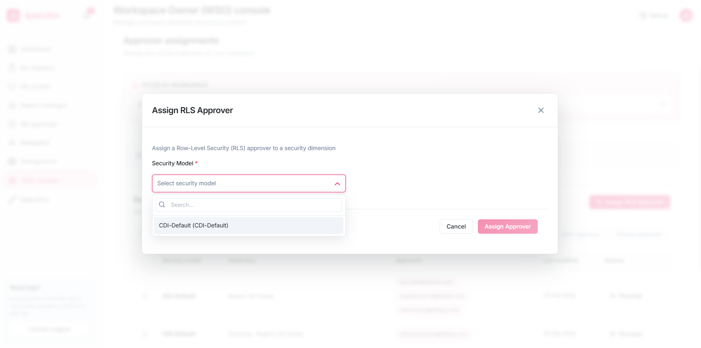

3. **Choose Security Type** — Select the **Security type** (e.g. Region, Cost Centre). This loads the **Dimension combination** options.

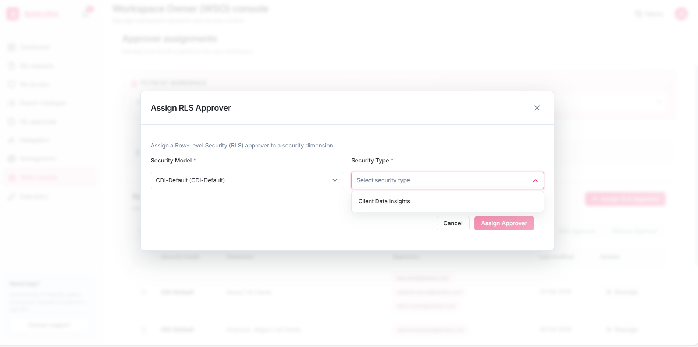

4. **Choose the dimension combination** — You can either:
   - **Simple (no wizard):** Leave **“Use Step-by-Step Wizard”** unchecked and pick the dimension value(s) from the list or dropdowns shown.
   - **Wizard:** Check **“Use Step-by-Step Wizard”** and follow the steps (e.g. Org → Market → Client → Service Line) until the dimension is fully selected.

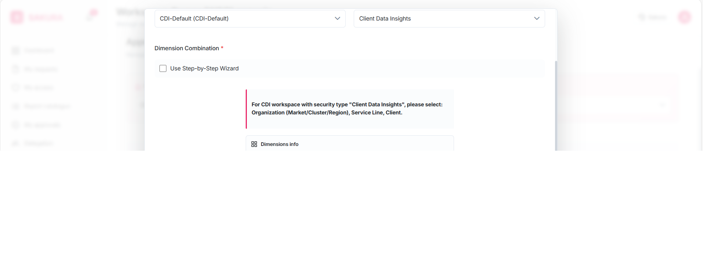

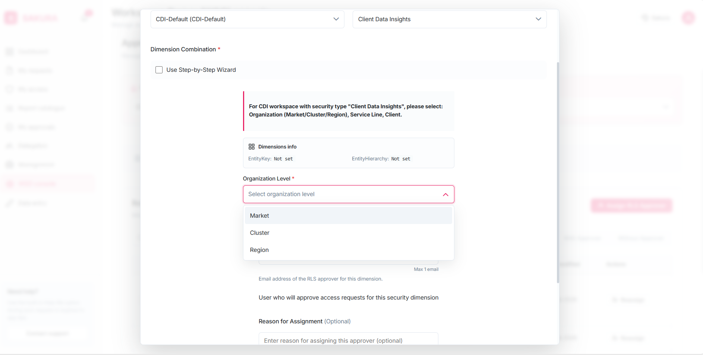

For workspace types that use multiple levels (e.g. Market, Org, Client, Service Line), the wizard guides you step by step:

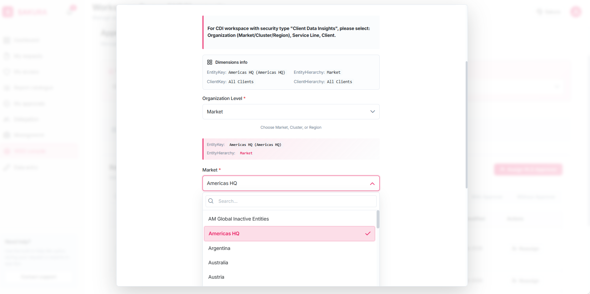

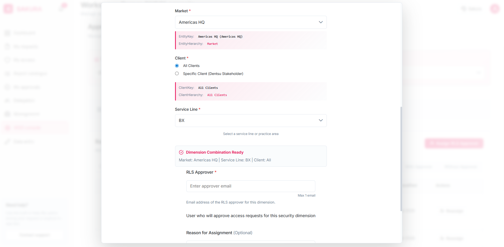

5. **Enter the approver** — In **RLS Approver**, enter the **approver email** (required). Optionally add a **Reason** (e.g. “Region owner for EMEA”). The **Assign Approver** button becomes active when the dimension and approver are valid.

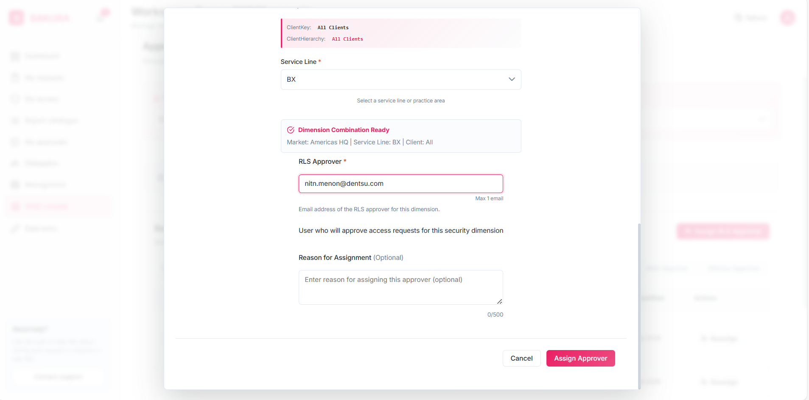

6. **Save** — Click **Assign Approver**. The modal closes and the new approver appears on that dimension in the RLS table. Requests for that dimension will be routed to this approver.

**Why it matters:** RLS requests are approved per **security dimension** (e.g. a specific region or cost centre). Assigning the right RLS approver here ensures each dimension has an owner who can approve or reject access requests.

---

## Permission requests

**Permission requests** are access requests created by users in your workspace. As a workspace admin you can **view** the list, **open a request** to see OLS and RLS details, and **revoke** a request when access should be taken back. Open **Permission requests** from the WSO Console menu.

---

### List permission requests

1. **Filter by workspace** — At the top, select the workspace so only that workspace’s requests are shown.
2. **Search** — Use the search box to filter by **Request ID**, **Requested by**, or **Requested for**.
3. **Filter by status** — Use the dropdowns to filter by **OLS status**, **RLS status**, and **Request status** (e.g. Pending, Approved, Rejected). Choose **All** to clear a filter.
4. **Refresh** — Click **Refresh** to reload the list from the server.

The **table** shows one row per request: **Request ID**, **Requested by**, **Requested for**, **OLS status**, **RLS status**, and **Request status**. Column headers are clickable to **sort**. The count line shows how many requests are listed (e.g. “X of Y total”). Use **Previous** / **Next** or page numbers if the list is paginated.

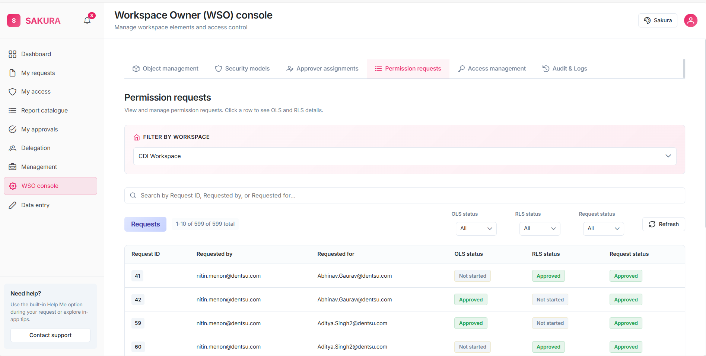

**Why it matters:** You can quickly find requests by ID, requester, or status and see at a glance whether OLS and RLS are pending or approved.

---

### View request details (OLS and RLS)

1. In the **Permission requests** table, **click a row**. A details modal opens for that request.
2. The modal shows **request information**: Request ID, Requested by, Requested for, OLS status, RLS status, Request status.
3. Below that you see **OLS items** (object-level: app, audience, or report access) and **RLS items** (row-level: security model and dimension). Each item shows what was requested and its approval state.
4. If your organisation supports it, you may see **Revoke** or other actions in the modal. Close the modal when done.

**OLS details** — Object-level security items (e.g. access to an app or audience):

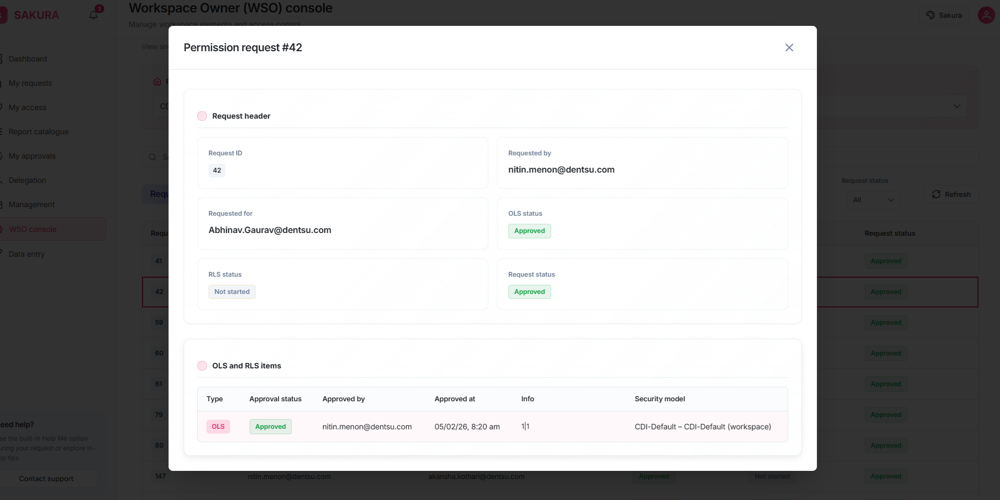

**RLS details** — Row-level security items (e.g. access to a security model/dimension):

**Why it matters:** Seeing OLS and RLS details helps you understand what access was requested and how it was approved (or pending), so you can answer questions or revoke if needed.

---

### Revoke a permission request

When a user should no longer have the access that was granted (e.g. role change or leave), you can **revoke** the request.

1. **Find the request** — In the Permission requests list, use search or filters to find the request (or open it from the list and use **Revoke** in the details view if available).
2. **Open the request** — Click the row to open the details modal.
3. **Revoke** — Click **Revoke** (or the equivalent button in the modal or list). Confirm in the dialog. The request is revoked and access can be removed according to your organisation’s process.

**Why it matters:** Revoking removes or flags the granted access so it can be taken back by your organisation’s process.

---

## View a user’s security context in the workspace

1. In the WSO Console, open **User context** or **User access** (or the equivalent).
2. Select or enter the **user** (e.g. email) and the **workspace**.
3. You will see that user’s **security context** (e.g. OLS/RLS access) within the workspace.

**Why it matters:** This helps you verify what access a user has before approving or revoking.

---

## Export workspace data to Excel

1. In the WSO Console, select your workspace.
2. Find **Export** or **Export to Excel** (may be per section: e.g. export apps, reports, or full workspace).
3. Click to generate and download the Excel file.

**Why it matters:** Exports are useful for auditing, backup, or offline review of workspace configuration.

---

## Need more?

- **Requesters** use the reports and apps you configure: see [Requester guide](Requester.md).  
- **Approvers** act on the requests and approver lists you set: see [Approver guide](Approver.md).  
- **Administrators** create workspaces and manage app-wide settings: see [Administrator guide](Administrator.md).

*Everything you need is in this User Guide; the list in "What you can do as a Workspace Admin" is the full set of workspace capabilities.*

