# Workspace Admin Guide

This guide is for **Workspace Admins** (WSO): users who manage a workspace’s apps, audiences, reports, security models, mappings, and approvers. You see only workspaces where you are listed as an owner.

---

## In this guide

| Section | What you'll do |
|--------|-----------------|
| [Open WSO and select workspace](#open-the-wso-console-and-select-your-workspace) | Enter the console and pick your workspace |
| [Change workspace properties](#change-workspace-properties) | Edit owner, approver, domain, etc. |
| [Manage Apps](#manage-apps-in-the-workspace) | List, add, edit, activate, deactivate apps |
| [Manage Audiences](#manage-audiences-for-audience-based-apps) | Add audiences for audience-based apps |
| [Associate reports with audience (AUR)](#associate-reports-with-an-audience-aur-only) | Link AUR reports to audiences |
| [Manage Reports](#manage-reports-in-the-workspace) | Add/edit reports, set AUR vs SAR and approvers |
| [Manage Security Models](#manage-security-models-in-the-workspace) | Add and maintain security models |
| [Link reports to Security Models](#link-reports-to-security-models) | Assign which models a report uses |
| [Manage RLS Approvers](#manage-rls-approvers-for-your-security-models) | Assign RLS approvers to security models |
| [View and revoke requests](#view-and-revoke-requests-in-your-workspace) | See and revoke workspace requests |
| [View user's security context](#view-a-users-security-context-in-the-workspace) | Check a user’s access in the workspace |
| [Export to Excel](#export-workspace-data-to-excel) | Export workspace data |

---

## What you can do as a Workspace Admin

- Everything a Requester can do  
- See the list of **workspaces** where you are in the Owner fields  
- **Change workspace properties** (including approvers); you cannot delete a workspace  
- **Define or deactivate Apps**, **Reports**, and **Security Models** in the workspace  
- For each report: **define which Security Models** it uses  
- For each app (if Approval Workflow = Audience Based): **define or deactivate Audiences**  
- For each app: **define Additional Dynamic Questions**  
- For each app audience: **associate or remove Reports** (AUR only)  
- **Manage RLS Approvers** for your workspace’s security models  
- **View** all requests under your workspace and **revoke** access requests  
- **View** request details, history, and chain status; **view** a user’s security context in the workspace  
- **Export** workspace object data to Excel  
- **Deactivate** apps, audiences, reports, security models; **remove** report–audience and report–security model associations  

---

## Open the WSO Console and select your workspace

1. Sign in to Sakura (see [README](README.md#signing-in)).
2. Open **WSO Console** or **Workspace Console** (or the equivalent menu item).
3. You will see a list of **workspaces where you are an owner**. Select the workspace you want to manage.

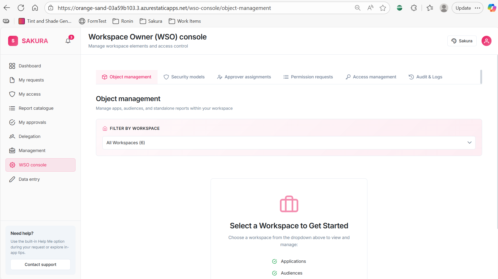

**Why it matters:** All following steps apply to the workspace you select. The console is the single place to manage apps, reports, audiences, and security.

---

## Select workspace (Predefined by Sakura Administrators)

Workspaces are created and assigned by **Sakura Administrators**. You only see workspaces where you are listed as an owner. After opening the WSO Console, select the workspace you want to manage from the list. The selected workspace determines which apps, reports, audiences, and security models you can configure.

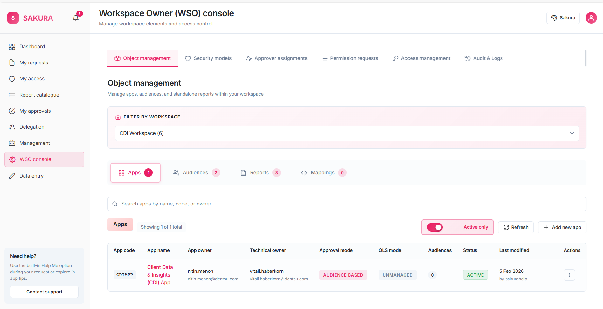

**Why it matters:** Correct owners and approvers ensure the right people can manage the workspace and approve access.

> **Note:** You cannot delete a workspace; only an Administrator can create workspaces. You can deactivate one from the Admin area if your organisation allows it.

---

## Manage Apps in the workspace

This section covers how to list, add, view, edit, activate, and deactivate apps in your workspace.

### List apps

1. In the WSO Console, select your workspace and open the **Apps** tab.

You will see:

- **Tabs** — Apps, Audiences, Reports, and Mappings (with counts). Use these to switch between sections.
- **Search** — Type to filter apps by name, code, or owner.
- **Active only** — Toggle **on** to show only active apps; turn **off** to include inactive apps.
- **Refresh** — Reload the list from the server.
- **Add new app** — Opens the form to add an app (see [Add App](#add-app)).

The **table** shows one row per app with: **App code**, **App name**, **App owner**, **Technical owner**, **Approval workflow**, **OLS mode**, **Audiences** (count), **Status**, **Last modified**, and **Actions** (⋮). In the **Actions** menu you can **View Details**, **Edit App**, or **Deactivate App**. The header shows how many apps are listed (e.g. “Showing 1 of 1 total”).

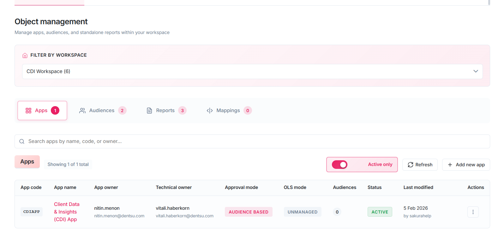

### Add App

1. In the WSO Console, select your workspace and open the **Apps** tab.
2. Click **Add new app**.

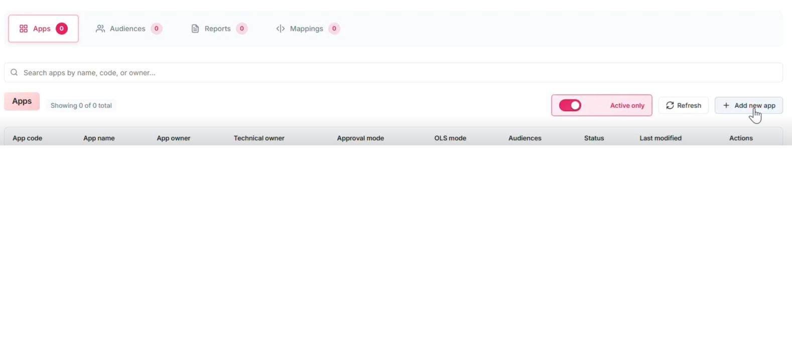

3. Fill in the form:

   | Field | What to enter |
   |-------|----------------|
   | **App code** | Uppercase letters and numbers, max 50 characters (e.g. FIN, MKTG, HR). Cannot be changed after you save. |
   | **App name** | The display name users will see. |
   | **Workspace** | Select the workspace if not already set. |
   | **App owner** | One or two owner email addresses. |
   | **Support contact** | One or two technical owner email addresses. |
   | **OLS Security Mode** | **Unmanaged** — Power BI manages security; **Managed** — Sakura manages security (you must then enter **App Entra Group UID**, the Azure AD/Entra ID group GUID, 36 characters). |
   | **Approval Workflow** | **App Based** — one approval for the whole app (you can set **OLS approver** emails); **Audience Based** — separate approvals per audience (for AUR-style access). |
   | **Additional Dynamic Questions** | Optional. Add custom questions that requesters answer when requesting access. |

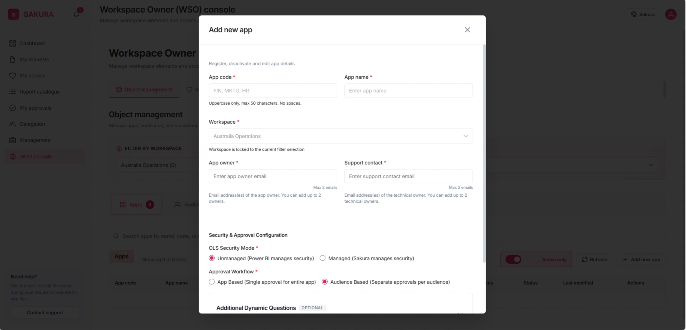

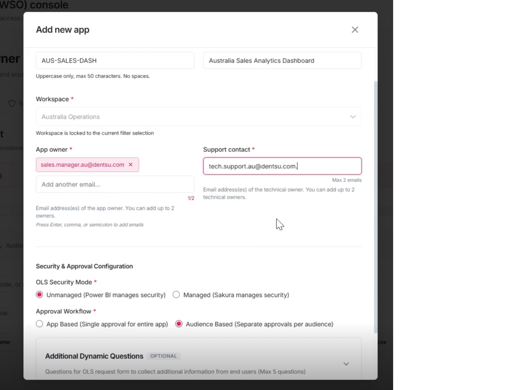

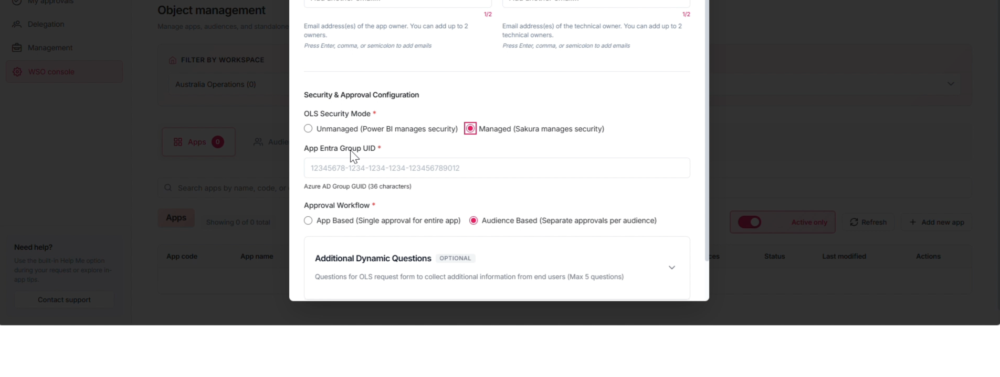

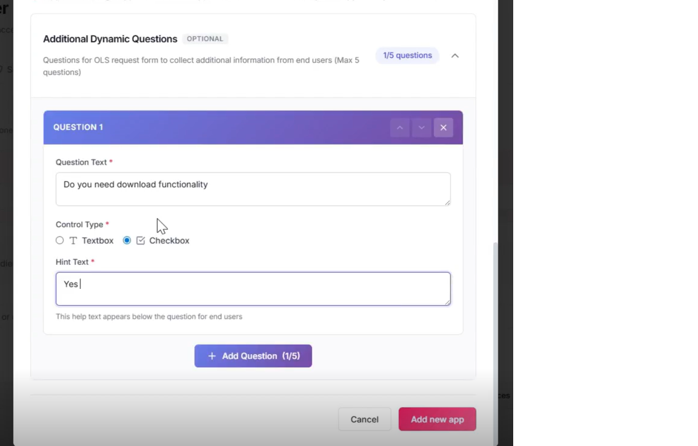

4. Click **Add new app**. A success message appears and the app is added to the list.
5. To see the new app in the list, turn **Active only** off if it does not appear.

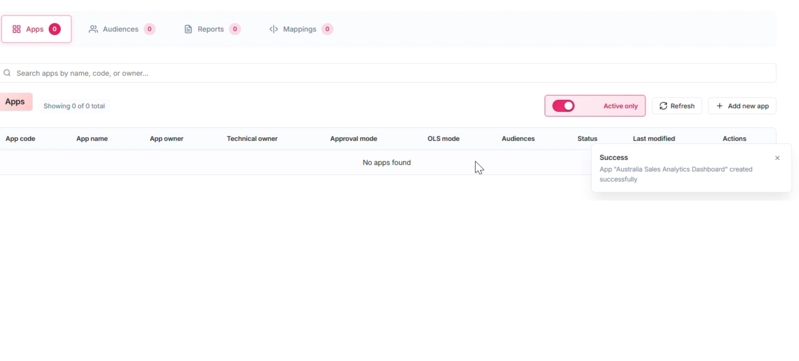

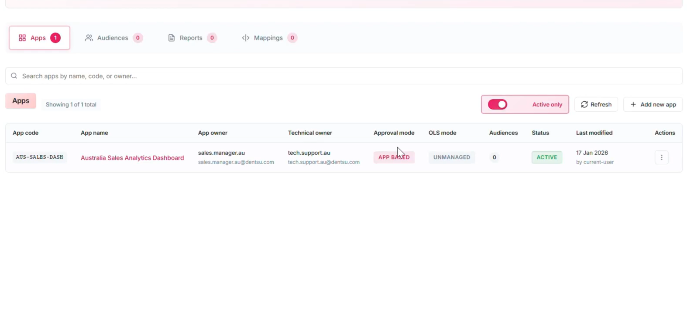

**Why it matters:** Apps are the containers for audiences and reports. **Approval Workflow** controls whether access is approved once per app (App Based) or per audience (Audience Based). **OLS Security Mode** and **App Entra Group UID** (when Managed) control how Sakura syncs with Power BI and Entra ID.

### View Details

To see full details of an app without editing:

1. In the **Apps** tab, find the app and open the **Actions** menu (⋮).
2. Click **View Details**. A panel or page opens with the app’s details.

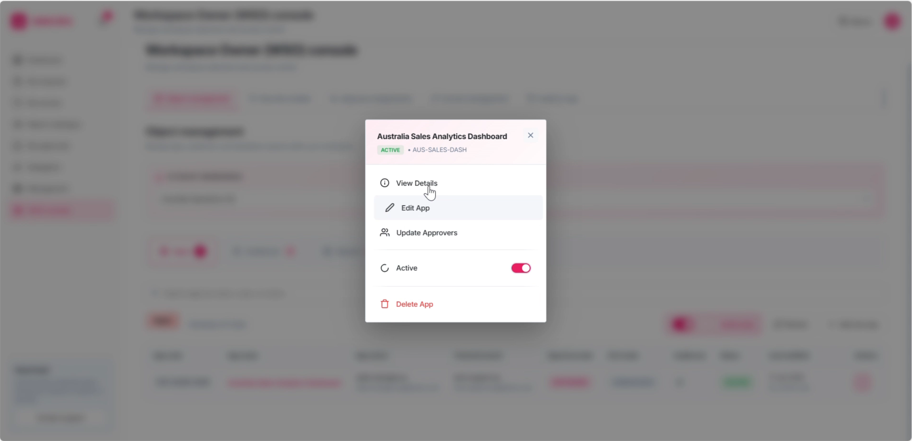

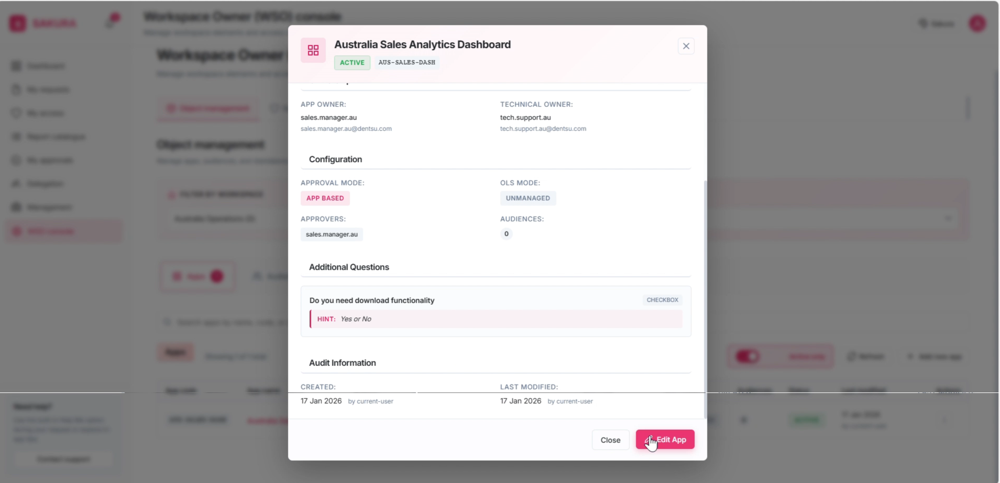

### Edit app

1. In the **Apps** tab, find the app and open the **Actions** menu (⋮).
2. Click **Edit App**. The add-app form opens with the current values. **App code** cannot be changed.
3. Update any fields you need (App name, App owner, Support contact, OLS Security Mode, App Entra Group UID, Approval Workflow, or Additional Dynamic Questions). For **App Based** apps you can also change **OLS approver** emails here.
4. Click **Update App**. A success message confirms the update.

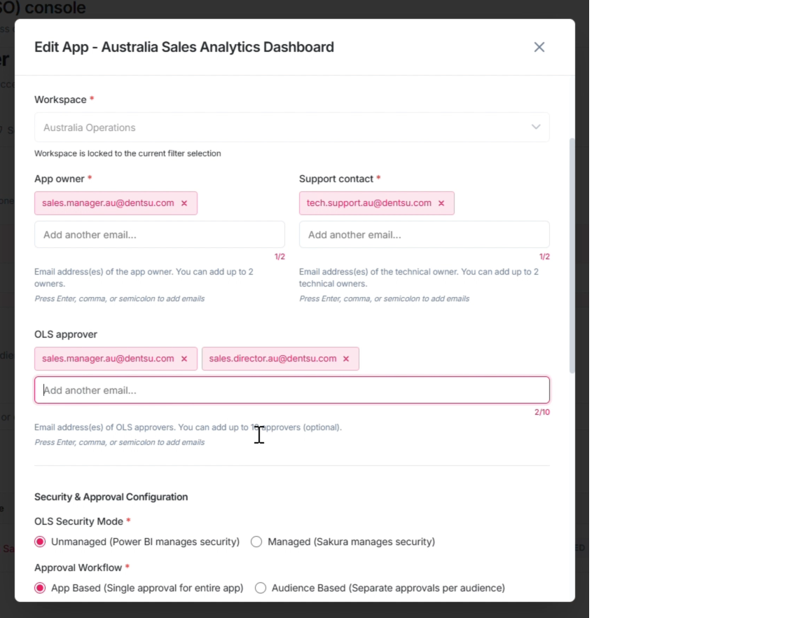

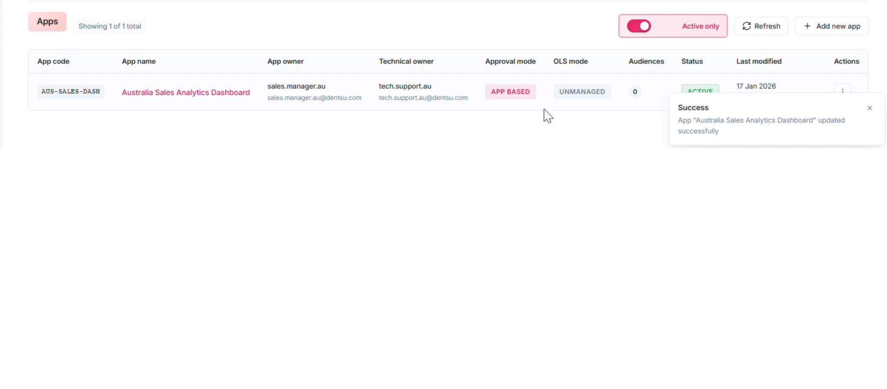

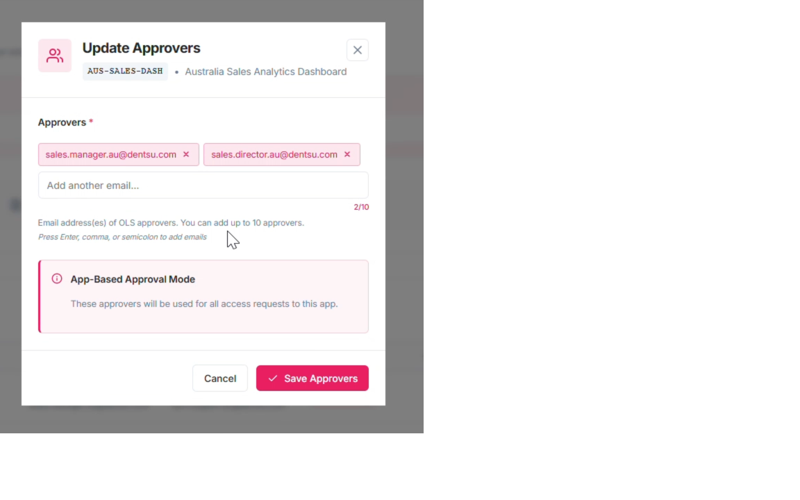

**Why it matters:** Keeping app details and approvers correct ensures the right approval flow and contact information for requesters and approvers.

### Activate app

To make a previously deactivated app active again:

1. In the **Apps** tab, turn the **Active only** toggle **off** so that inactive apps appear in the list.
2. Find the app and open the **Actions** menu (⋮). Choose **Activate** (or the equivalent).
3. Confirm if a dialog appears. The app status becomes **Active** and requesters can use it again.

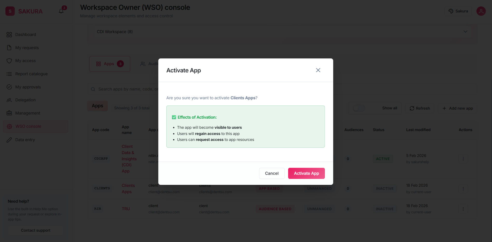

**Why it matters:** Activating an app restores it for new access requests without having to add it again.

### Deactivate app

To stop an app from being used for new requests (existing access may still apply, depending on your organisation):

1. In the **Apps** tab, find the app and open the **Actions** menu (⋮).
2. Click **Deactivate App**.
3. Confirm in the dialog. The app status becomes inactive and it no longer appears for new access requests.

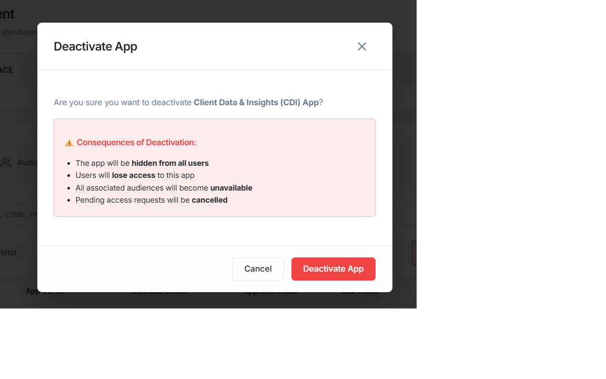

**Why it matters:** Deactivating hides the app from new requests while keeping history and existing access as defined by your organisation.

---

## Manage Audiences (for Audience-based apps)

Audiences are used only for apps whose **Approval Workflow** is **Audience Based**. They define who gets access to **AUR (Audience) reports**. You list, add, view, edit, update approvers, activate/inactivate, or delete audiences from the **Audiences** tab. Linking reports to audiences is done in the **Mappings** tab (see [Associate reports with an audience (AUR)](#associate-reports-with-an-audience-aur-only)).

> **Technical note:** Only **Audience Based** apps have audiences. AUR reports are linked to audiences in Mappings; SAR (single-access) reports use approvers instead.

---

### List audiences

1. In the WSO Console, select your workspace (filter by workspace).
2. Open the **Audiences** tab.

You will see:

- **Search** — Filter audiences by name, code, or app.
- **Active only** — Toggle **on** to show only active audiences; turn **off** to include inactive.
- **Refresh** — Reload the list from the server.
- **Add new audience** — Opens the form to add an audience (see [Add audience](#add-audience)).

The **table** shows one row per audience with: **Audience name**, **Audience code**, **Parent app**, **OLS approvers**, **Status**, **Last modified**, and **Actions** (⋮). In the **Actions** menu you can **View Details**, **Edit Audience Details**, **Update OLS Approvers**, toggle **Active/Inactive**, or **Delete Audience**. The header shows how many audiences are listed (e.g. “Showing X of Y total”).

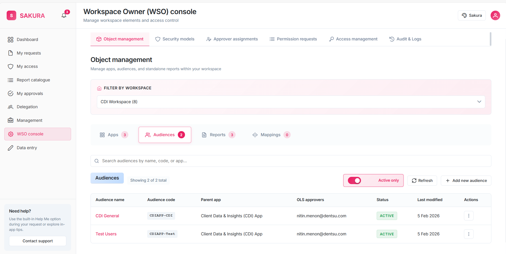

---

### Add audience

1. In the WSO Console, select your workspace and open the **Audiences** tab.
2. Click **Add new audience**.

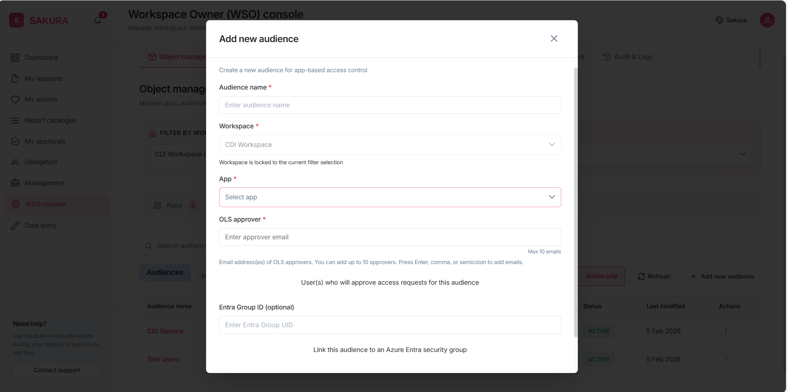

3. Fill in the form:

   | Field | What to enter |
   |-------|----------------|
   | **Audience name** | The display name (e.g. Regional Leads, Commercial Finance). The system generates **Audience code** from this (uppercase, spaces → underscores; e.g. “Regional Leads” → REGIONAL_LEADS). Max 255 characters. |
   | **Workspace** | Select the workspace (if not already set by the filter). |
   | **App** | Select an app. Only **Audience Based** apps appear. Cannot be changed after save. |
   | **OLS approver** | One or more approver email addresses (up to 10). Required. These users approve access requests for this audience. |
   | **Entra Group ID** | Optional. Azure AD/Entra ID group UID to link this audience to an Entra security group. |

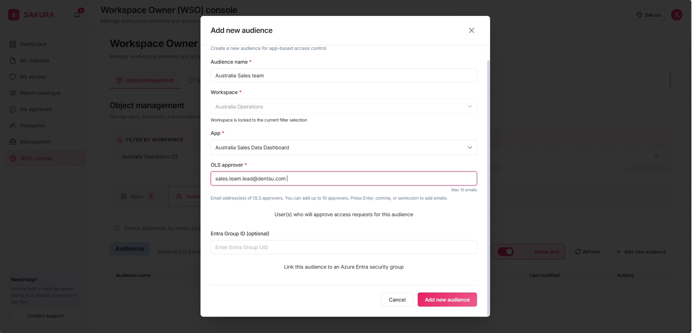

4. Click **Add new audience**. A success message appears and the audience is added to the list.

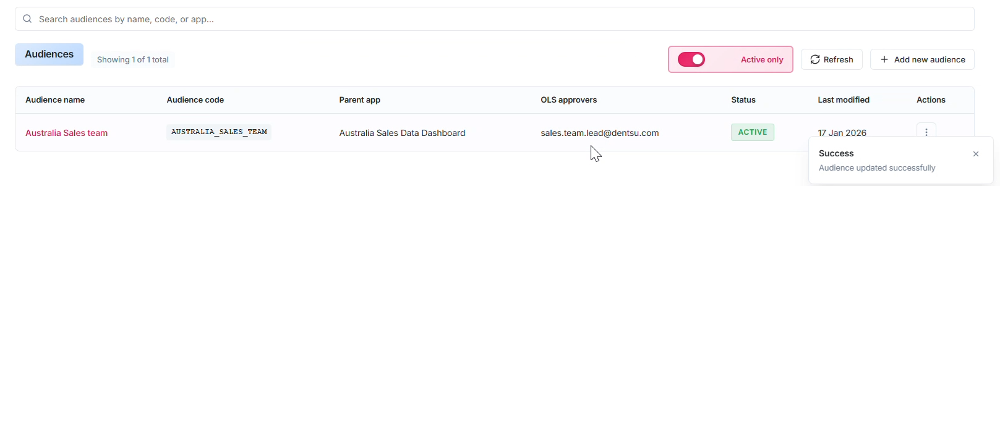

**Why it matters:** Each audience represents a group of users who get access to the reports you link to it. **OLS approvers** receive and act on access requests for this audience. **Entra Group ID** lets Sakura sync with your Entra group when configured.

---

### View Details

To see full details of an audience without editing:

1. In the **Audiences** tab, find the audience and open the **Actions** menu (⋮).
2. Click **View Details**. A panel or modal opens with the audience’s details (code, name, app, OLS approvers, status, Entra Group ID, etc.).

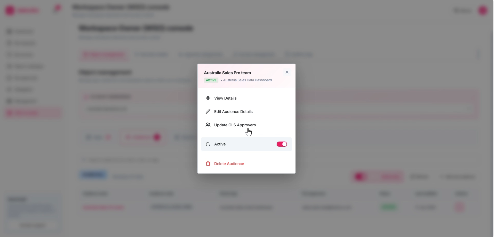

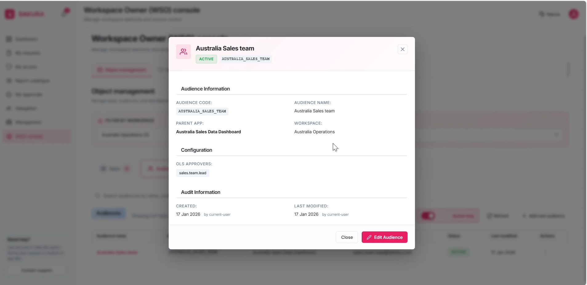

---

### Edit audience

1. In the **Audiences** tab, find the audience and open the **Actions** menu (⋮).
2. Click **Edit Audience Details**. The form opens with the current values. **Workspace** and **App** cannot be changed.
3. Update **Audience name**, **OLS approver**, or **Entra Group ID** as needed.
4. Click **Update audience**. A success message confirms the update.

**Why it matters:** Keeping audience name and approvers correct ensures the right people approve requests and users see the right labels.

---

### Update OLS Approvers

To change only the approvers for an audience (without editing other fields):

1. In the **Audiences** tab, find the audience and open the **Actions** menu (⋮).
2. Click **Update OLS Approvers**. A dialog or form opens with the current approver emails.
3. Add, remove, or change email addresses. Save. Approvers receive access requests for this audience.

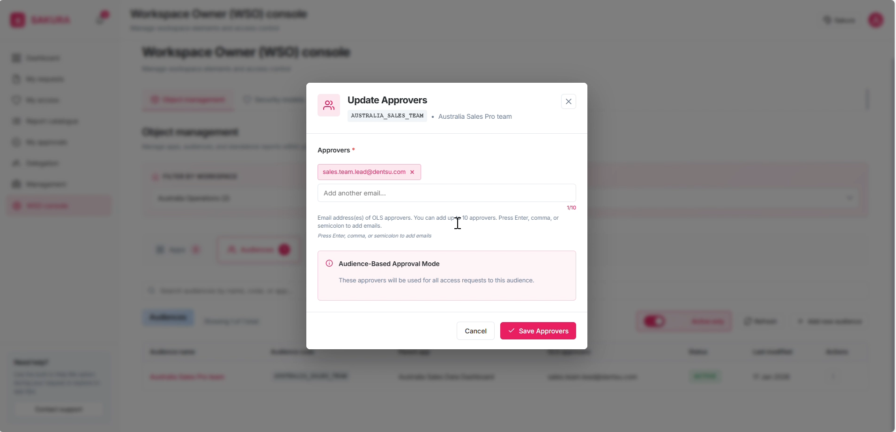

---

### Activate or deactivate an audience

Audiences have an **Active/Inactive** status. Inactive audiences do not appear for new access requests (existing access may still apply, depending on your organisation).

1. In the **Audiences** tab, find the audience and open the **Actions** menu (⋮).
2. Use the **Active/Inactive** toggle in the menu. When you turn it off, the audience becomes **Inactive**; turn it on to make it **Active** again. Confirm if a dialog appears.

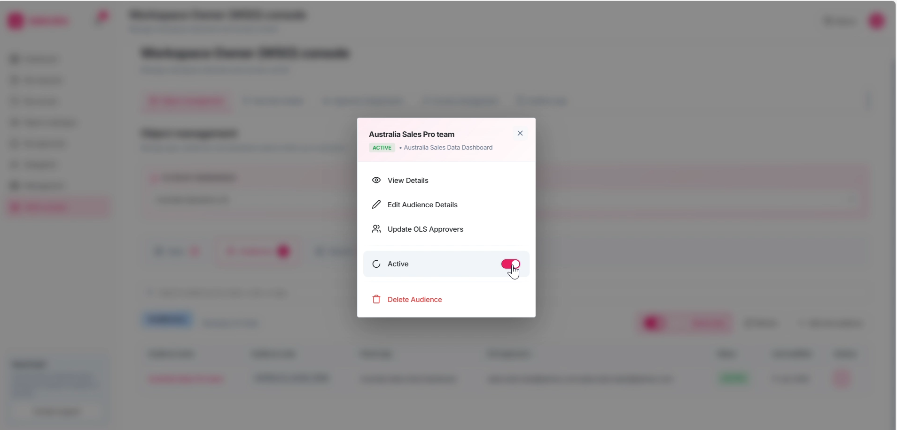

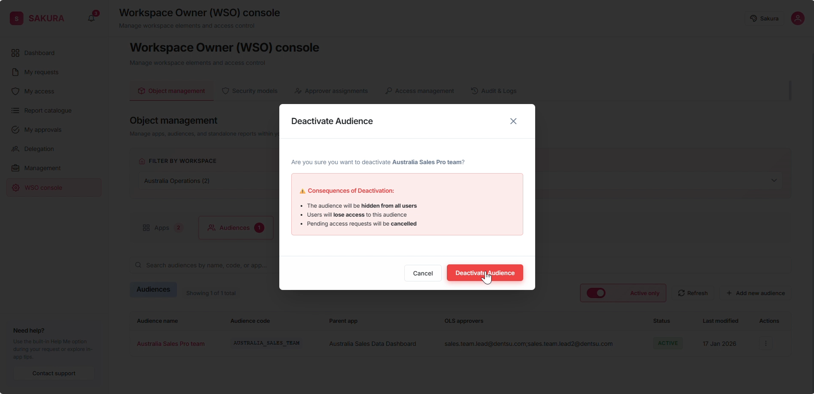

**Why it matters:** Deactivating hides the audience from new requests while keeping history. Activating restores it without recreating it.

---

### Delete audience

Removing an audience is permanent. Ensure no critical report–audience mappings or access depend on it before deleting.

1. In the **Audiences** tab, find the audience and open the **Actions** menu (⋮).
2. Click **Delete Audience**. Confirm in the dialog. The audience is removed from the workspace.

**Why it matters:** Delete only when the audience is no longer needed. Consider deactivating instead if you may need it again.

---

## Associate reports with an audience (AUR only)

AUR (Audience) reports are delivered to users who belong to an audience. You link reports to audiences in the **Mappings** tab under **Report → Audience**.

1. In the WSO Console, select your workspace and open the **Mappings** tab.
2. Select the **Report → Audience** mapping type (first button). You see a table of existing report–audience mappings and an **Add Mapping** button.
3. Click **Add Mapping**. Choose the **App**, then the **Audience** (only audiences for that app are shown). Select one or more **Reports** (AUR reports) to link to that audience. Save or confirm.
4. To remove a link: find the mapping in the table, open **Actions**, and delete the mapping. Confirm.

**Why it matters:** Linking a report to an audience gives everyone in that audience access to the report (AUR). Without a mapping, the report is not available to that audience. SAR (single-access) reports are not linked to audiences; they use report-level approvers instead.

---

## Manage Reports in the workspace

Reports are what users request access to. Each report has a **delivery method**: **AUR (Audience-based)** — access via audience membership, linked in the Mappings tab; or **SAR (Single Access)** — user requests access and **Approvers** approve. This section covers how to list, add, view, edit, update approvers (SAR), activate/deactivate, and delete reports.

---

### List reports

1. In the WSO Console, select your workspace (filter by workspace).
2. Open the **Reports** tab (**Workspace Reports**).

You will see:

- **Search** — Filter reports by name, code, tag, or owner.
- **Active only** — Toggle **on** to show only active reports; turn **off** to include inactive.
- **Refresh** — Reload the list from the server.
- **Add new Report** — Opens the form to add a report (see [Add report](#add-report)).

The **table** shows one row per report with: **Report Code**, **Report Name**, **Report Tag**, **Delivery Method** (Single Access or Audience-based), **Owner**, **Status**, and **Actions** (⋮). In the **Actions** menu you can **View Details**, **Edit Report Details**, **Update Approvers** (SAR only), toggle **Active/Inactive**, or **Delete Report**. The header shows how many reports are listed (e.g. “Showing X of Y total”).

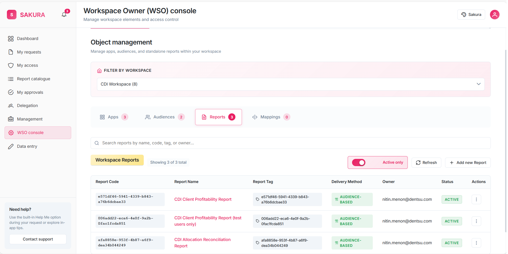

---

### Add report

1. In the WSO Console, select your workspace and open the **Reports** tab.
2. Click **Add new Report**.

3. Fill in the form:

   | Field | What to enter |
   |-------|----------------|
   | **Report code** | Unique code (e.g. FIN_MONTHLY). Cannot be changed after creation. |
   | **Report name** | The display name users will see. |
   | **Workspace** | Select the workspace (if not already set by the filter). |
   | **Report tag** | A tag for grouping or filtering reports. |
   | **Report owner** | One or two owner email addresses. |
   | **Delivery method** | **Audience-based (AUR)** — access via audiences; link the report to audiences in the **Mappings** tab. **Single Access (SAR)** — users request access; you must set **Approvers**. |
   | **Approvers** | For **SAR** only. One or more approver emails (up to 10). Required for SAR. |
   | **Entra Group UID** | Optional. Reserved for future use. |
   | **Description** | Optional. Helps users understand what the report provides. |
   | **Keywords** | Optional. Comma-separated, max 10, for search. |

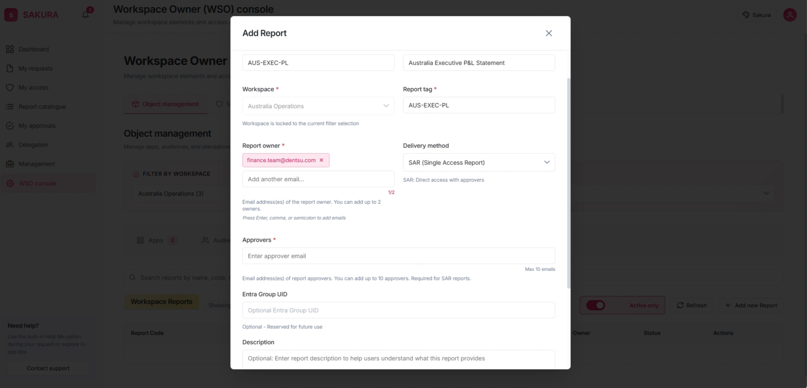

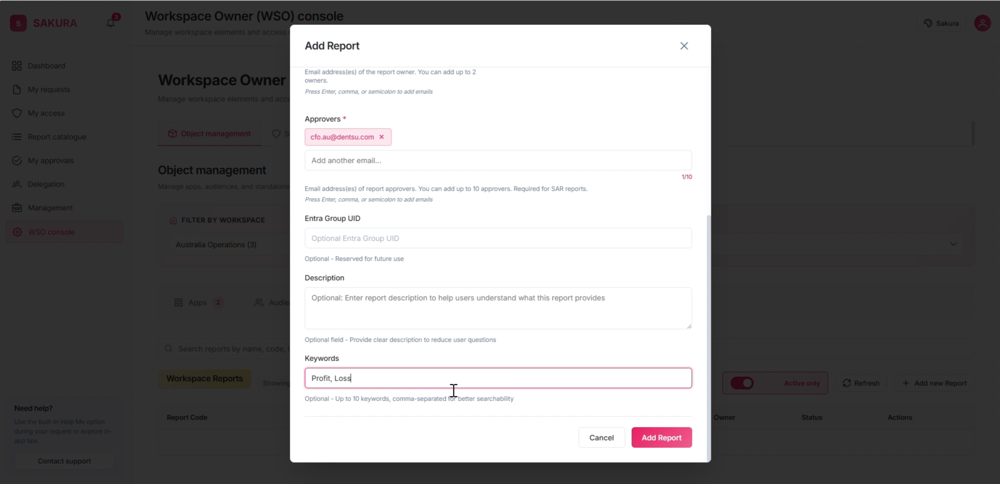

4. For **AUR** reports, leave Approvers empty; fill **Report code**, **Report name**, **Workspace**, **Report tag**, **Report owner**, and **Delivery method = Audience-based**. Then add the report and link it to audiences in the **Mappings** tab.

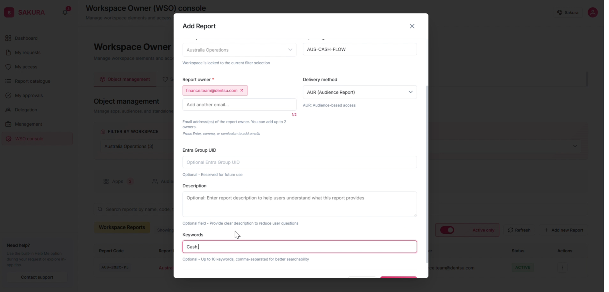

5. Click **Add Report**. A success message appears and the report is added to the list.

**Why it matters:** **AUR** reports are delivered to users in the audiences you link in Mappings. **SAR** reports require user requests; the **Approvers** you set receive and act on those requests.

---

### View Details

To see full details of a report without editing:

1. In the **Reports** tab, find the report and open the **Actions** menu (⋮), or click the report name.
2. Click **View Details**. A panel or modal opens with the report’s details (code, name, tag, delivery method, owner, approvers if SAR, status, etc.).

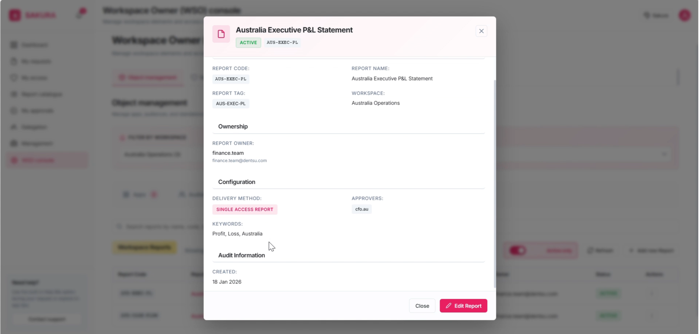

---

### Edit report

1. In the **Reports** tab, find the report and open the **Actions** menu (⋮).
2. Click **Edit Report Details**. The form opens with the current values. **Report code** cannot be changed.
3. Update **Report name**, **Report tag**, **Report owner**, **Delivery method**, **Approvers** (for SAR), **Description**, or **Keywords** as needed.
4. Click **Save Changes**. A success message confirms the update.

**Why it matters:** Keeping report details and approvers correct ensures the right people approve SAR requests and users see accurate names and tags.

---

### Update Approvers (SAR only)

For **Single Access (SAR)** reports, you can change approvers without editing other fields:

1. In the **Reports** tab, find the **SAR** report and open the **Actions** menu (⋮).
2. Click **Update Approvers**. A dialog or form opens with the current approver emails.
3. Add, remove, or change email addresses. Save. These approvers receive access requests for this report.

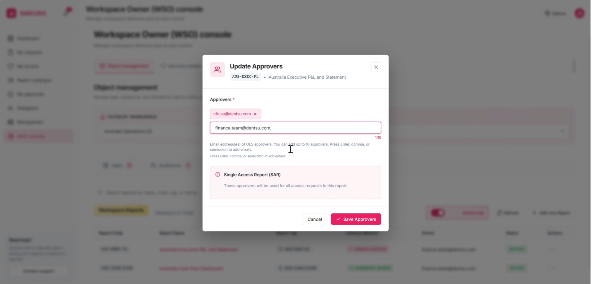

---

### Activate or deactivate a report

Reports have an **Active/Inactive** status. Inactive reports do not appear for new requests (existing access may still apply, depending on your organisation).

1. In the **Reports** tab, find the report and open the **Actions** menu (⋮).
2. Use the **Active/Inactive** toggle in the menu. When you turn it off, the report becomes **Inactive**; turn it on to make it **Active** again. Confirm if a dialog appears.

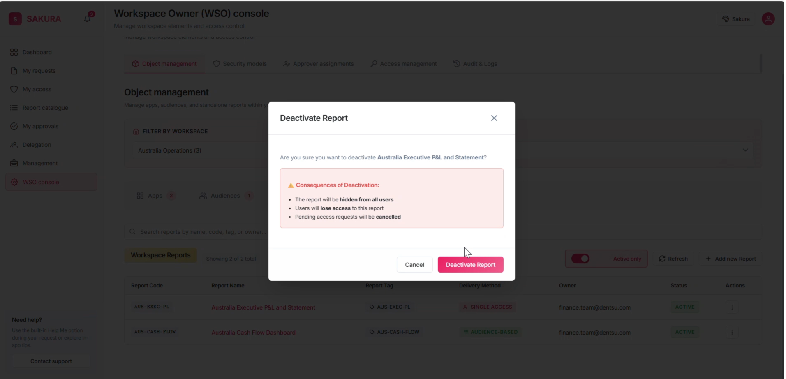

**Why it matters:** Deactivating hides the report from new requests while keeping history. Activating restores it without recreating it.

---

### Delete report

Removing a report is permanent. Ensure no critical mappings or access depend on it before deleting.

1. In the **Reports** tab, find the report and open the **Actions** menu (⋮).
2. Click **Delete Report**. Confirm in the dialog. The report is removed from the workspace.

**Why it matters:** Delete only when the report is no longer needed. Consider deactivating instead if you may need it again.

---

## Manage Security Models in the workspace

1. In the WSO Console, select your workspace and open **Security Models** (or **Security models**).
2. Click **Add security model**. Enter **code**, **name**, and any required fields (e.g. type). Save.
3. To edit or deactivate a security model, use **Edit** or **Deactivate** on that row.

**Why it matters:** Security models define the security dimensions used in the workspace. Reports are linked to security models so the system knows which model applies to each report.

---

## Link reports to Security Models

1. In the WSO Console, go to **Reports** and select a **report** (or open the report’s **Security models** section).
2. Add or remove **Security models** that this report uses. Save.
3. Repeat for other reports as needed.

**Why it matters:** This tells the app which security model applies when users request access to this report (e.g. for RLS approval routing).

---

## Manage RLS Approvers (for your security models)

1. In the WSO Console, open **Security Models** (or **RLS Approvers** / **Approver assignment**).
2. Select a **Security model** and open **RLS Approvers** (or the equivalent).
3. Add, edit, or remove **RLS approvers** according to your workspace’s security types and dimensions. Save.

**Why it matters:** RLS (row-level security) requests need the right approvers per security type/dimension. Defining them here ensures requests are routed correctly.

> **Coming soon:** Some workspaces use dimension-based wizards (e.g. GI, EMEA, AMER). Full step-by-step for those flows will be added when available.

---

## View and revoke requests in your workspace

### View all requests

1. In the WSO Console, select your workspace and open **Requests** (or **Access requests**).
2. You will see all requests created under this workspace. Use filters if available (status, date, requester).
3. Click a request to see **details**, **history**, and **chain status**.

**Why it matters:** As a workspace admin you can monitor and follow up on all access requests in your scope.

### Revoke an access request

1. In **Requests**, find the request you want to revoke.
2. Open the request and click **Revoke** (or use a revoke action from the list). Confirm.
3. The request is revoked and access can be removed according to your organisation’s process.

**Why it matters:** Revoking is used when access should be taken back (e.g. role change or leave).

---

## View a user’s security context in the workspace

1. In the WSO Console, open **User context** or **User access** (or the equivalent).
2. Select or enter the **user** (e.g. email) and the **workspace**.
3. You will see that user’s **security context** (e.g. OLS/RLS access) within the workspace.

**Why it matters:** This helps you verify what access a user has before approving or revoking.

---

## Export workspace data to Excel

1. In the WSO Console, select your workspace.
2. Find **Export** or **Export to Excel** (may be per section: e.g. export apps, reports, or full workspace).
3. Click to generate and download the Excel file.

**Why it matters:** Exports are useful for auditing, backup, or offline review of workspace configuration.

---

## Need more?

- **Requesters** use the reports and apps you configure: see [Requester guide](Requester.md).  
- **Approvers** act on the requests and approver lists you set: see [Approver guide](Approver.md).  
- **Administrators** create workspaces and manage app-wide settings: see [Administrator guide](Administrator.md).

*Everything you need is in this User Guide; the list in "What you can do as a Workspace Admin" is the full set of workspace capabilities.*

