# Request Wizard — End-to-End User Flow Guide

A beginner-friendly walkthrough of every screen in the **Request Wizard**: what appears, why each decision exists, and how paths differ (no access, partial access, full access, single vs multiple report groups).

> **Audience for this doc:** product owners, QA, support, and developers explaining the wizard to end users.  
> **Technical terms** appear in parentheses where helpful: **(OLS)** = report access, **(RLS)** = data access, **(audience)** = report group.

---

## Table of contents

1. [Two kinds of access](#two-kinds-of-access)
2. [Report types](#report-types)
3. [Wizard map (5 dots)](#wizard-map-5-dots)
4. [Step 1 — Who & what](#step-1--who--what)
5. [Step 2 — Pick a report](#step-2--pick-a-report)
6. [Step 2.a — Choose report group (audience)](#step-2a--choose-report-group-audience)
7. [Step 3 — Confirm access](#step-3--confirm-access)
8. [Step 4 — Approvers & submit](#step-4--approvers--submit)
9. [Success screen](#success-screen)
10. [Full path cheat sheet](#full-path-cheat-sheet)
11. [Design principles](#design-principles)

---

## Two kinds of access

Every request can involve up to **two separate things**. Users do not choose these upfront — the wizard works them out from the report and Step 3 choices.

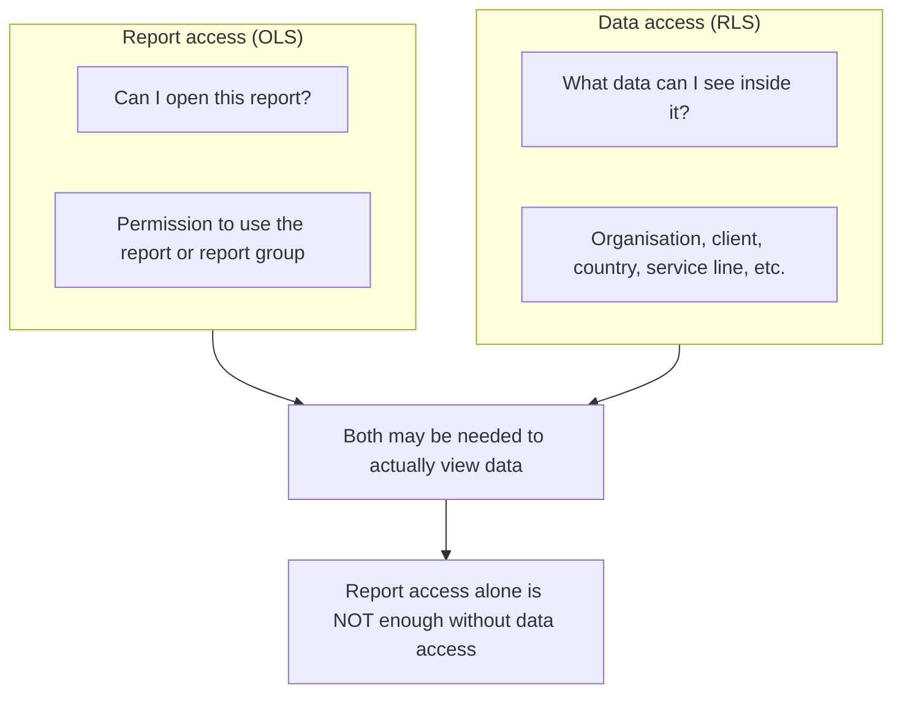

| What users see | Technical term | What it means |
|----------------|----------------|---------------|
| Can I open this report? | Report access **(OLS)** | Permission to use the report or report group |
| What data can I see inside it? | Data access **(RLS)** | Which rows / scope the user can view |

---

## Report types

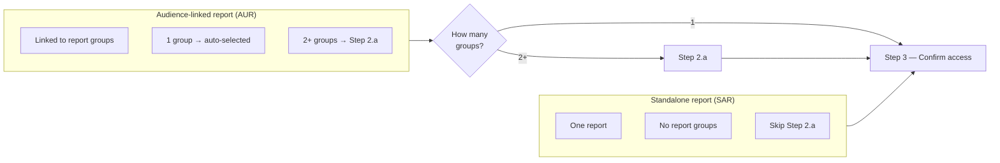

A **report group (audience)** is a **collection of related reports** bundled together — not “rows inside one report.”

---

## Wizard map (5 dots)

The progress dots do **not** map 1:1 to “Step 1, 2, 3, 4” labels. Dot 3 is **Step 2.a** (conditional).

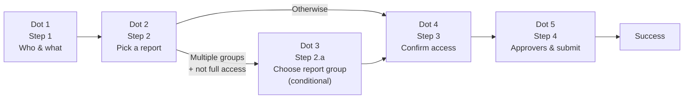

### Macro stepper (final step only)

On Step 4, the top bar shows three phases:

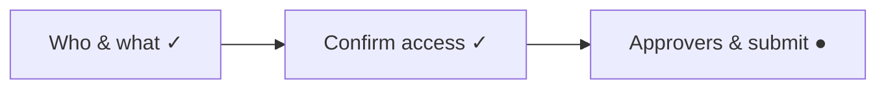

### Auto-advance behaviour

Steps **2** and **2.a** hide the **Next** button and continue automatically ~450ms after a row is selected.

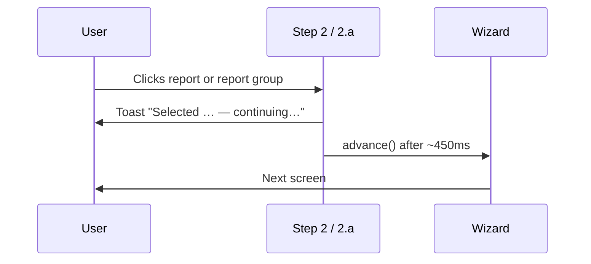

---

## Step 1 — Who & what

**Heading:** *Let's figure out what access is needed*  
**Subheading:** *Tell us who this is for and we'll guide you through the rest. Nothing is submitted until you confirm on the final step.*

### What you do

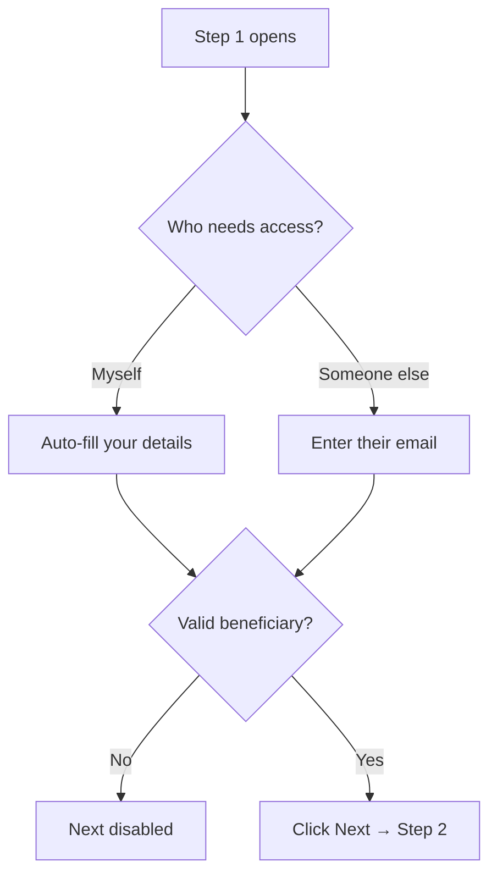

| Element | Purpose |
|---------|---------|
| **Request for myself** | You are the beneficiary; no user search |
| **Request for someone else** | You raise the request on behalf of a teammate / new joiner |
| **Email field** | Identifies who receives access and whose existing permissions are checked |

### Why this helps

- Sets **beneficiary** (who gets access) vs **requester** (who submits).
- All later checks — report badges, existing data table, approvers — use the **beneficiary**, not necessarily you.
- Nothing is submitted yet; Back / Cancel remain available.

### What happens next

Always → **Step 2 (Pick a report)**.

---

## Step 2 — Pick a report

**Heading:** *Pick a report*  
**Subheading:** *No need to choose between access types — we'll work that out from your selection.*

### What you see

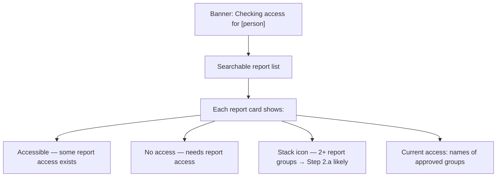

### Routing after report selection

This is the **main branch point** for the rest of the wizard.

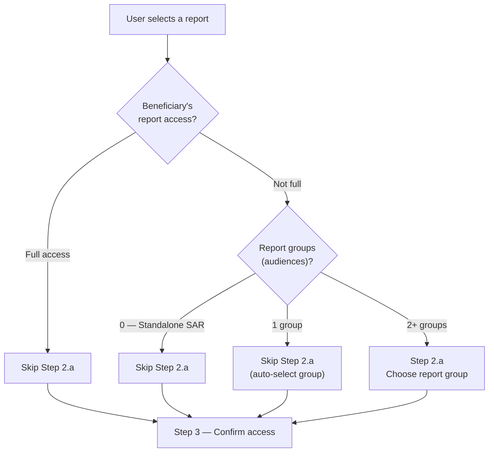

| Their access | Report groups | Next screen | Step 3 default |
|--------------|---------------|-------------|----------------|
| **Full** | Any | Skip 2.a | Define form often **auto-opens** (wider data) |
| **Not full** | 0 (standalone) | Skip 2.a | Depends on existing **data access** |
| **Not full** | 1 | Skip 2.a (auto group) | Depends on existing **data access** |
| **Not full** | 2+ | **Step 2.a** | Depends on group + data access |

### Why this helps

- User picks **what** they need; wizard handles **report vs data access** later.
- Badges reflect **the beneficiary's** access, avoiding duplicate report requests.
- Stack icon signals an extra **report group** step — reduces surprise.

---

## Step 2.a — Choose report group (audience)

**When it appears:** Audience-linked report with **more than one** report group, and beneficiary does **not** have **full** report access.

**Heading:** *Choose report group (audience)*  
**Subheading:** *Linked to more than one group — select one below and we'll continue automatically.*

### Screen layout

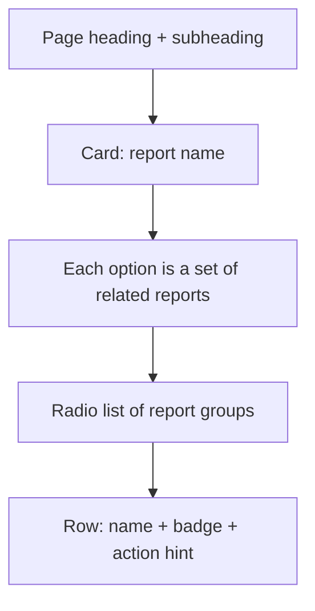

### Row states

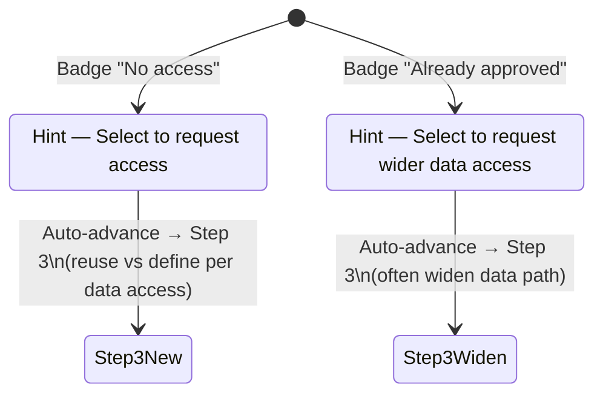

| Badge | Meaning | Typical Step 3 path |
|-------|---------|---------------------|
| **No access** | Needs this report group requested | Reuse existing data **or** define new |
| **Already approved** | Has this group already | Often **widen data access** |

### Why this helps

- One report can gate **different report groups** (different bundles of related reports).
- User must pick **which bundle** this request applies to.
- **(audience)** in the heading satisfies technical users; **report group** is the plain term.

### What happens next

Always → **Step 3**. Selection auto-advances (no Next button).

---

## Step 3 — Confirm access

**Heading:** *Confirm access*  
**Subheading:** *Reuse your existing data access, or define new and click Next when ready.*

This step answers: **“What data should this person be allowed to see?”**

### Decision inputs

Step 3 combines two inputs:

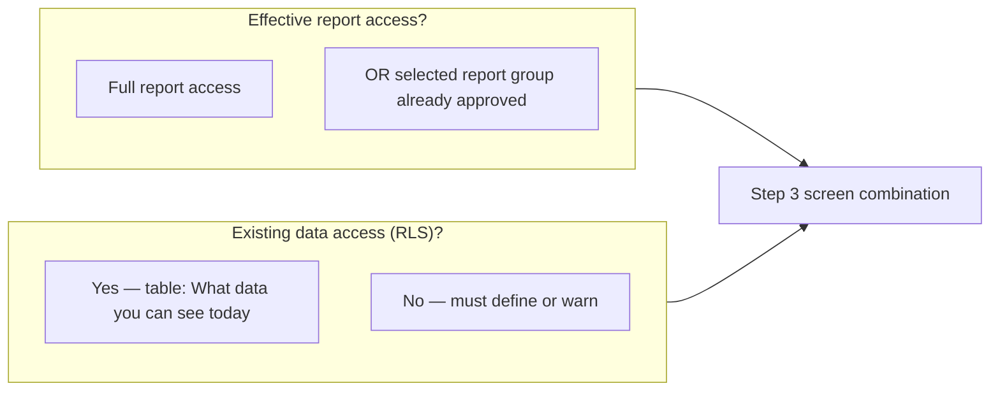

| Input | Plain meaning |
|-------|----------------|
| **Effective report access** | They can already open the report or the chosen report group |
| **Existing data access** | Approved data filters already exist in this **workspace** |

### Default suggestions (on arrival)

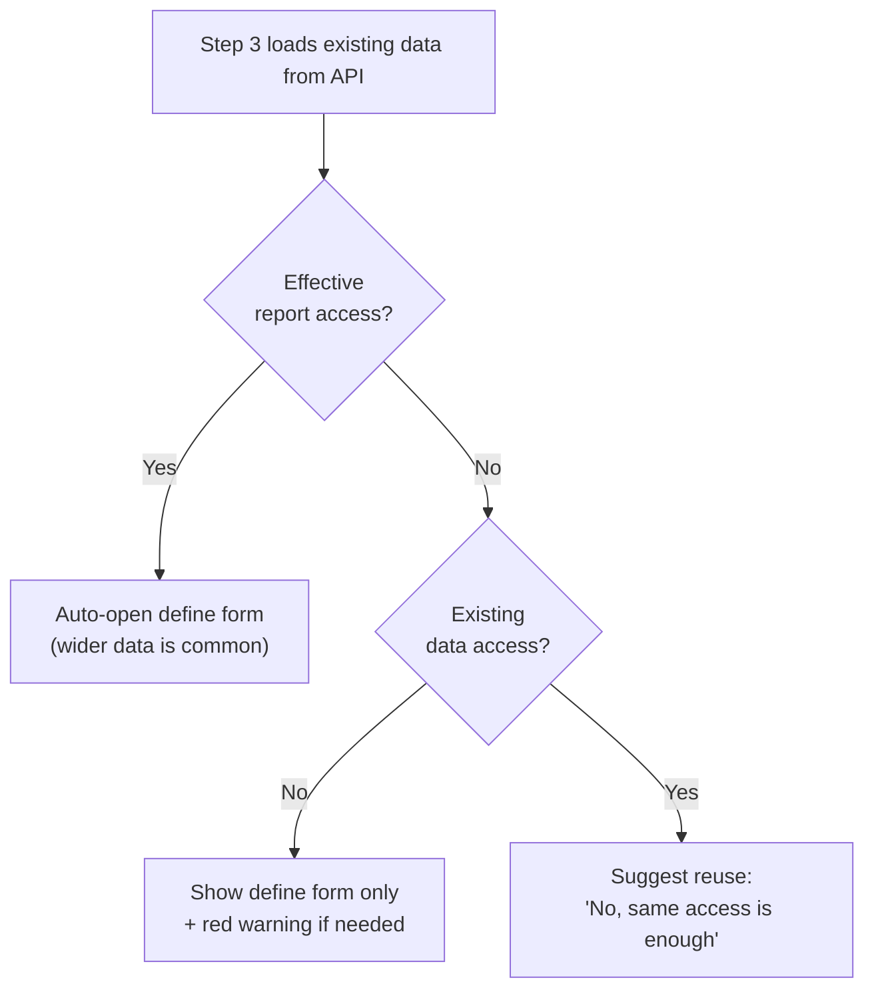

---

### Step 3 — All screen combinations

#### Combo A — Needs report access · no existing data access · form only

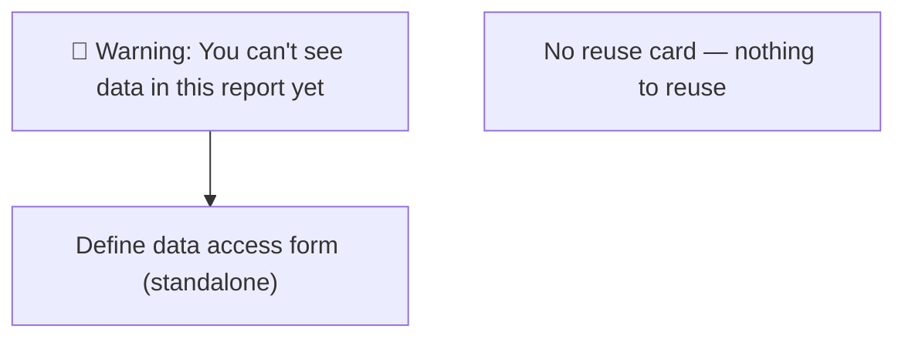

| Block | Shown? |
|-------|--------|
| Red warning banner | ✅ |
| Green “already have report” banner | ❌ |
| Existing data access table | ❌ |
| “Do you need more data?” card | ❌ |
| Define form | ✅ standalone |

**Request type if submitted:** Report + new data access **(OLS + RLS)** once form complete.

---

#### Combo B — Needs report access · has existing data access · reuse suggested

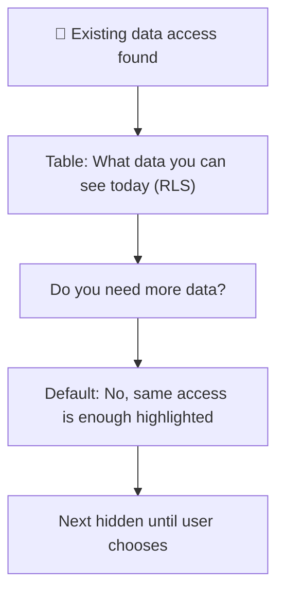

**Why:** Most users only need **new report access** and can **reuse** existing data scope — no second data-approver round.

---

#### Combo C — Combo B + user clicked “Yes, I need more data”

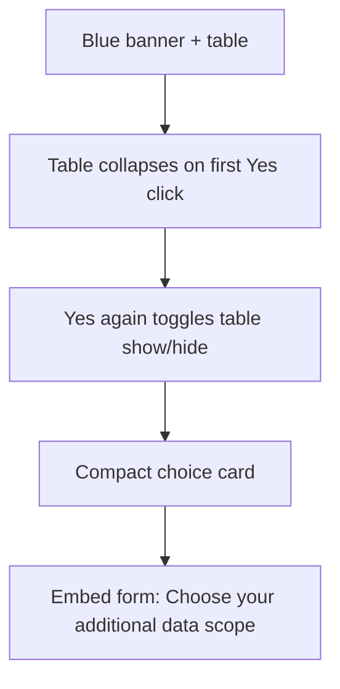

**Why collapse:** Focus on the form; table remains one click away.

---

#### Combo D — Effective report access · no existing data access

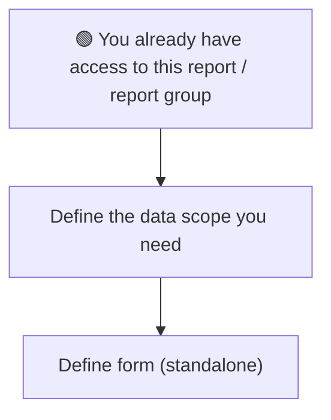

They can open the report but still cannot see data without defining scope.

---

#### Combo E — Effective report access · has existing data access · form open

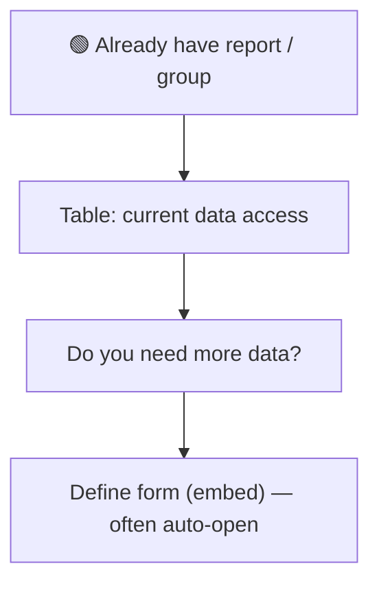

Typical “power user” path: widen data while keeping report access.

---

#### Combo F — Effective report access · has existing data · choice only

User is not on the “Yes, need more data” path (form hidden).

---

#### Combo G — User chose “No, same access is enough”

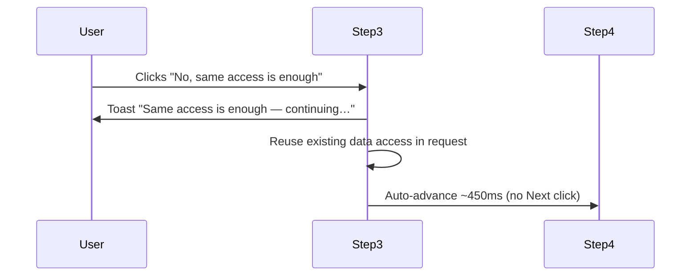

**Request type:** Report access only **(OLS)**, reusing existing data access — **no new data approver**.

---

### Step 3 — The two buttons

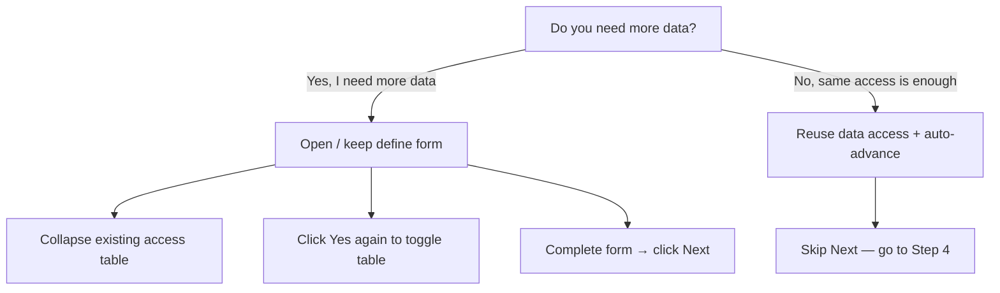

| Button | User intent | Wizard action | UX reason |
|--------|-------------|---------------|-----------|
| **Yes, I need more data** | Need **more** data than today | Opens form; hides table (toggleable) | Focus on defining wider scope |
| **No, same access is enough** | Report access is new; data scope is fine | Reuses filters; auto-advance | Fast path for the common case |

---

### Step 3 — Define form modes

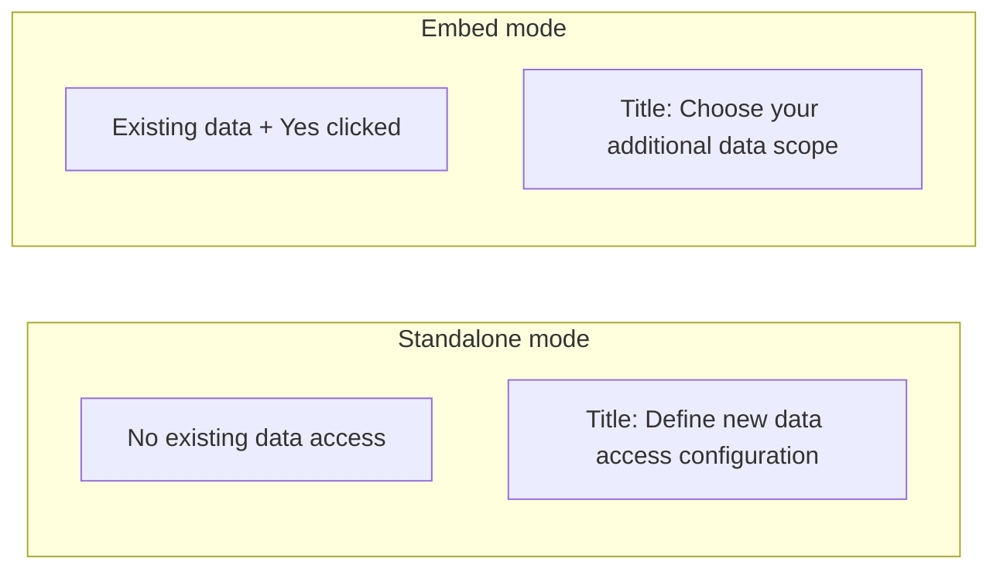

**Next** stays disabled until all required fields (*) validate (`rlsReady`).

---

### Step 3 — What blocks Next

```mermaid
flowchart TD
  Next["Next on Step 3"] --> Form{"Form complete?"}
  Form -->|No| Block1["Disabled"]
  Form -->|Yes| Warn{"OLS-only with\nzero data access?"}
  Warn -->|Yes| Block2["Disabled + danger on Step 4 preview"]
  Warn -->|No| Allow["Next enabled → Step 4"]
```

---

## Step 4 — Approvers & submit

**Heading:** *Approvers & submit*  
**Subheading:** *Review the details of this request before submitting.*

### Page sections

```mermaid
flowchart TB
  S4["Step 4"]
  S4 --> Detail["1. Request details\n(justification required)"]
  S4 --> Summary["2. Access requested for\n(report + data summary)"]
  S4 --> Approvals["3. Approvals & process\n(resolved approvers)"]
  S4 --> Decl["4. Declaration checkbox"]
  S4 --> Submit["Submit request"]
```

### Request types (summary banner)

```mermaid
flowchart TD
  Step3Choices["Step 3 choices"] --> Kind{"Request kind"}

  Kind -->|OLS only| O1["Report access (OLS) only"]
  Kind -->|OLS + RLS| O2["Report + new data access (OLS + RLS)"]
  Kind -->|RLS only| O3["Data access (RLS) only"]

  O1 --> A1["Report approver + Line Manager\nOften NO data approver"]
  O2 --> A2["Report AND data approvers\nBoth must approve to see data"]
  O3 --> A3["Data approver + Line Manager\nReport already held"]
```

| Type | When | Approvers |
|------|------|-----------|
| **Report access (OLS) only** | New report/group; reuse or skip new data | Report approver (+ LM). Often **no** data approver |
| **Report + new data access (OLS + RLS)** | New report/group **and** new form scope | **Both** report and data approvers |
| **Data access (RLS) only** | Already have report; form adds scope | Data approver (+ LM) |

### Approver chain

```mermaid
flowchart LR
  LM["1. Line Manager\n(always)"]
  RA["2. Report Approver\n(if new report/group)"]
  DA["3. Data Approver\n(if new data access)"]

  LM --> RA
  RA --> DA
```

Typical chain label example: `Line manager → Report Approver → Data Approver`

### Danger banner (blocks submit)

Shown when request is **report-only** but beneficiary has **zero** data access in the workspace:

> *You can't see data in this workspace yet (RLS)* — go back to Step 3 and define data access.

```mermaid
flowchart TD
  Submit["Submit request"] --> Valid{"Justification OK?"}
  Valid -->|No| Block1["Blocked"]
  Valid -->|Yes| Decl{"Declaration checked?"}
  Decl -->|No| Block2["Blocked"]
  Decl -->|Yes| RLS{"No-data-access\nwarning?"}
  RLS -->|Yes| Block3["Blocked — back to Step 3"]
  RLS -->|No| Approvers{"Approvers resolved?"}
  Approvers -->|No| Block4["Blocked"]
  Approvers -->|Yes| OK["Submit ✅"]
```

### Why Step 4 helps

- Plain summary before commit — no surprises about scope or approvers.
- Duplicate pending request warning — avoids server rejection.
- Approvers resolved automatically from report + data choices.

---

## Success screen

```mermaid
flowchart TB
  Success["Request successfully submitted"]
  Success --> Ref["Reference number"]
  Success --> Email["Email notifications at each stage"]
  Success --> Steps["What happens next"]

  Steps --> S1["1. Request submitted"]
  Steps --> S2["2. Status updates"]
  Steps --> S3["3. Access granted"]
  Steps --> S4["4. Data access review (RLS)\n— only if new data was requested"]
```

---

## Full path cheat sheet

```mermaid
flowchart TD
  subgraph Paths["Common paths at a glance"]
    P1["Standalone + no access + no data\n→ Red warning + form → OLS+RLS"]
    P2["Standalone + no access + has data\n→ Reuse or Yes → OLS or OLS+RLS"]
    P3["Multi-group + no access\n→ 2.a → pick group → Step 3 matrix"]
    P4["Full report access\n→ Skip 2.a → widen data → often RLS-only"]
    P5["2.a + already-approved group\n→ Green group banner → widen data"]
  end
```

| Path | Step 2 badge | 2.a? | Step 3 typical | Step 4 type |
|------|--------------|------|----------------|-------------|
| Standalone, no access, no data | No access | Skip | Red warning + form | OLS + RLS |
| Standalone, no access, has data | No access | Skip | Blue + reuse vs Yes | OLS reuse or OLS+RLS |
| Multi-group, no access | No access + stack | **Yes** | After group pick | Varies |
| Multi-group, partial | Accessible + stack | **Yes** | Reuse or widen | OLS / OLS+RLS / RLS-only |
| Single group, no access | No access | Skip (auto) | Form or reuse | OLS+RLS or OLS reuse |
| Full report access | Accessible | Skip | Green + widen | Often RLS-only |
| 2.a: approved group | Accessible | Yes | Widen data | Often RLS-only |

---

## Design principles

```mermaid
mindmap
  root((Request Wizard UX))
    Simple first
      Pick report before jargon
      Skip steps when possible
      Auto-advance on pick
    Safe defaults
      Suggest reuse when data exists
      Warn when no data access
      Block submit if data missing
    Clear language
      Report group not audience
      Data access not row-level filters
      OLS RLS in parentheses for experts
    Focus
      Collapse access table on Yes
      One job per banner line
      Next only when ready
```

1. **Pick report first, mechanics second** — users never choose “OLS vs RLS” upfront.  
2. **Skip steps when possible** — single group and full access skip 2.a.  
3. **Suggest the common answer** — reuse existing data access when it already exists.  
4. **Warn before empty reports** — red banners when report access alone shows no data.  
5. **Auto-advance on selection** — Steps 2 and 2.a feel like picking, not form-filling.  
6. **Collapse clutter on Step 3** — hide the access table when defining wider scope (toggle on **Yes**).  
7. **Plain language + (audience)/(RLS)/(OLS)** — friendly terms first, acronyms for experts.

---

## Related docs

- `Docs/request-wizard-e2e-test-cases.csv` — QA test matrix aligned to these flows  
- Wizard implementation: `FE/application/src/app/domains/request/feature/request-wizard/`

---

*Last updated to reflect wizard behaviour including Step 2.a report group copy, Step 3 access table collapse on “Yes, I need more data”, and Step 4 plain-language summaries.*
