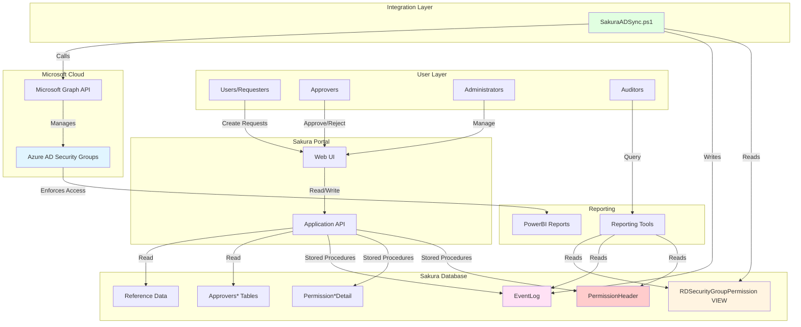
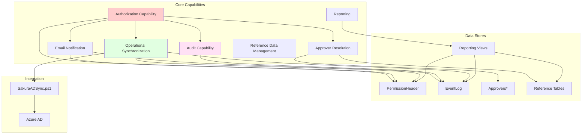
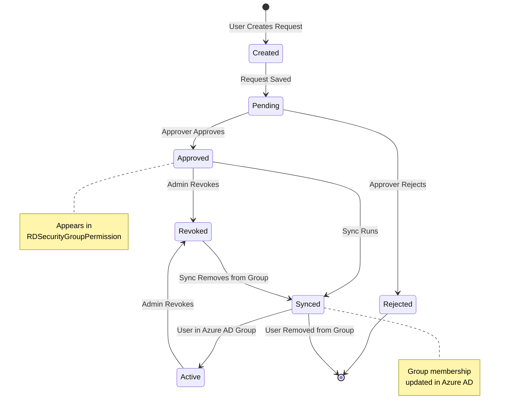
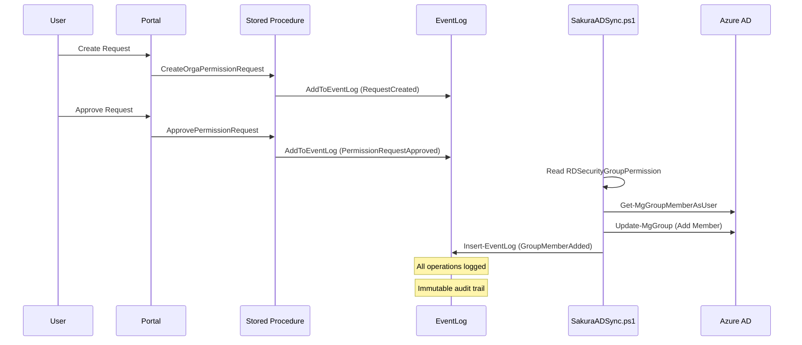
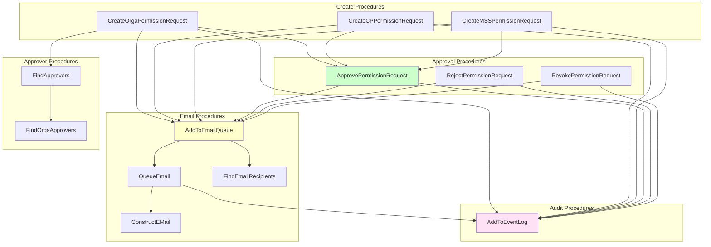

# Sakura Portal: Complete Functional Architecture

**Document Version:** 1.0  
**Generated:** 2025-01-XX  
**Database:** Sakura (azeuw1tsenmastersvrdb01)  
**Purpose:** Comprehensive product understanding document for deep system comprehension, engineer onboarding, knowledge transfer, operational ownership, functional audits, and future redesign discussions

---

## Table of Contents

1. [Executive Summary](#1-executive-summary)
2. [System Identity & Scope](#2-system-identity--scope)
3. [Core Functional Capabilities](#3-core-functional-capabilities)
4. [Core Data Model](#4-core-data-model)
5. [Authorization Capability](#5-authorization-capability)
6. [Audit & Traceability Capability](#6-audit--traceability-capability)
7. [Database Logic Layer as Product Behavior](#7-database-logic-layer-as-product-behavior)
8. [Integration & Synchronization](#8-integration--synchronization)
9. [Reporting & Consumption Model](#9-reporting--consumption-model)
10. [End-to-End Functional Scenarios](#10-end-to-end-functional-scenarios)
11. [System Diagrams](#11-system-diagrams)
12. [Change & Evolution Awareness](#12-change--evolution-awareness)

---

## 1. Executive Summary

### 1.1 What Sakura Is

**Sakura Portal** is an enterprise self-service authorization management platform that orchestrates access control for PowerBI reports through Azure Active Directory (Azure AD) Security Groups. Sakura serves as the **authoritative source of truth** for desired access permissions, managing the complete lifecycle from request creation through approval, enforcement, and audit.

Sakura is not merely a database or a simple authorization tool—it is a **complete operational platform** that:

- **Manages Permission Lifecycles**: Handles the full request-to-access journey with multiple approval workflows
- **Enforces Access Control**: Synchronizes desired permissions to Azure AD Security Groups via scheduled integration
- **Provides Audit Transparency**: Maintains comprehensive, immutable audit trails for compliance and investigation
- **Supports Multiple Authorization Models**: Handles organizational (Orga), client-project (CP), master service set (MSS), security group manager (SGM), reporting deck, cost center (CC), and data subject request (DSR) permission types
- **Operates as a Platform**: Integrates with external systems (Azure AD, PowerBI) while maintaining its own authoritative state

### 1.2 Why Sakura Exists

Sakura addresses critical enterprise needs that extend far beyond simple authorization:

**Business Problems Solved:**

1. **Self-Service Access Management**: Enables users to request PowerBI report access without IT intervention, reducing operational overhead
2. **Governance & Compliance**: Provides auditable, traceable access control with complete visibility into who has access to what and when
3. **Scalable Authorization**: Supports complex organizational hierarchies (Entity → Region → Cluster → Market → ServiceLine → CostCenter) with fine-grained scoping
4. **Operational Synchronization**: Maintains consistency between desired state (Sakura database) and actual state (Azure AD groups) through automated synchronization
5. **Multi-Tenant Application Support**: Manages permissions across multiple PowerBI applications through the `ApplicationLoVId` concept
6. **Approval Workflow Automation**: Automatically routes requests to appropriate approvers based on organizational scope
7. **Bulk Operations**: Supports bulk import and batch processing for large-scale permission management

### 1.3 Enterprise Ecosystem Position

Sakura operates as a **middleware orchestration layer** between:

- **Users/Requesters** (via Portal UI) → **Sakura Database** (desired state)
- **Sakura Database** → **SakuraADSync.ps1** → **Microsoft Graph API** → **Azure AD** (enforcement)
- **Azure AD Security Groups** → **PowerBI Service** (access enforcement)

Sakura's database is **not a passive data store**—it actively expresses product behavior through:
- Stored procedures that implement business workflows
- Views that aggregate and transform data for consumption
- Functions that encapsulate business logic
- Triggers that maintain data consistency and audit trails

### 1.4 Critical Architectural Principles

1. **Database as Source of Truth**: The Sakura SQL database is the authoritative source for desired access permissions. Azure AD groups are synchronized to match this desired state.
2. **Separation of Concerns**: Sakura explicitly excludes ASP.NET Identity tables (`AspNetUsers`, `AspNetRoles`, etc.) from authorization decisions. User identity is managed separately.
3. **Event-Driven Audit**: All significant operations generate immutable audit events in the `EventLog` table.
4. **View-Based Integration**: External systems (like `SakuraADSync.ps1`) consume data through well-defined views (`RDSecurityGroupPermission`), providing stable integration contracts.
5. **Configuration-Driven Behavior**: Application behavior is controlled through the `ApplicationSettings` table, enabling runtime configuration changes.

---

## 2. System Identity & Scope

### 2.1 What Sakura Is Responsible For

Sakura is responsible for:

1. **Permission Request Lifecycle Management**
   - Creation, approval, rejection, and revocation of permission requests
   - Multi-level approval workflows with delegation support
   - Request deduplication and validation

2. **Desired State Management**
   - Maintaining the authoritative desired state of user-to-group mappings
   - Aggregating approved requests into actionable group membership directives
   - Filtering and transforming requests based on business rules

3. **Approver Resolution**
   - Determining appropriate approvers based on request scope (Entity, ServiceLine, CostCenter, Client, etc.)
   - Supporting hierarchical approver matching
   - Managing approver delegation

4. **Audit Trail Generation**
   - Logging all permission lifecycle events
   - Logging synchronization operations
   - Providing queryable audit history

5. **Notification Management**
   - Email queue management
   - Template-based email generation
   - Recipient resolution and delivery tracking

6. **Reference Data Management**
   - Maintaining organizational hierarchies (Entity, ServiceLine, CostCenter, Client, MasterServiceSet)
   - Supporting ETL operations for reference data updates
   - Providing temporal tracking of reference data changes

7. **Integration Interface Provisioning**
   - Exposing desired state through views (`RDSecurityGroupPermission`)
   - Providing stable contracts for external consumers
   - Supporting environment-specific configurations

### 2.2 What Sakura Is Explicitly NOT Responsible For

1. **User Authentication**: Sakura does not authenticate users. This is handled by ASP.NET Identity or other authentication providers.
2. **ASP.NET Identity Management**: All `AspNet*` tables are explicitly excluded from Sakura's authorization model.
3. **Azure AD Group Creation**: Sakura does not create Azure AD groups—it only manages membership of existing groups.
4. **PowerBI Report Management**: Sakura does not create, modify, or delete PowerBI reports—it only manages access to them.
5. **Email Delivery**: Sakura queues emails but does not deliver them. External email services handle delivery.
6. **Direct Azure AD Operations**: Sakura does not directly modify Azure AD. The `SakuraADSync.ps1` script performs these operations.

### 2.3 How Sakura Fits into the Wider Enterprise Architecture

```
┌─────────────────────────────────────────────────────────────────┐
│                    Enterprise Users                              │
│  (Requesters, Approvers, Administrators, Auditors)              │
└──────────────────────┬──────────────────────────────────────────┘
                       │
                       ▼
┌─────────────────────────────────────────────────────────────────┐
│                    Sakura Portal (Web UI)                        │
│  - Request creation/management                                   │
│  - Approval workflows                                            │
│  - Reporting/audit views                                          │
└──────────────────────┬──────────────────────────────────────────┘
                       │
                       ▼
┌─────────────────────────────────────────────────────────────────┐
│              Sakura SQL Database (State Store)                    │
│  - PermissionHeader (requests)                                  │
│  - Permission*Detail (request details)                          │
│  - RDSecurityGroupPermission (VIEW - desired state)             │
│  - EventLog (audit trail)                                        │
│  - Approvers* (approval rules)                                   │
│  - Reference Data (Entity, ServiceLine, etc.)                    │
└──────────────────────┬──────────────────────────────────────────┘
                       │
                       ▼
┌─────────────────────────────────────────────────────────────────┐
│         SakuraADSync.ps1 (Scheduled Integration)                   │
│  - Reads RDSecurityGroupPermission view                         │
│  - Syncs to Azure AD via Microsoft Graph                        │
│  - Logs actions to EventLog                                     │
│  - Sends email notifications                                     │
└──────────────────────┬──────────────────────────────────────────┘
                       │
                       ▼
┌─────────────────────────────────────────────────────────────────┐
│              Microsoft Graph / Azure AD                           │
│  - Security Groups (GUID-based)                                 │
│  - Group membership management                                  │
└──────────────────────┬──────────────────────────────────────────┘
                       │
                       ▼
┌─────────────────────────────────────────────────────────────────┐
│                    PowerBI Service                               │
│  - Report access enforcement via AD groups                       │
└─────────────────────────────────────────────────────────────────┘
```

**Key Integration Points:**

- **Portal UI ↔ Database**: Application layer (not documented here) calls stored procedures to create/manage requests
- **Database ↔ SakuraADSync.ps1**: PowerShell script reads `RDSecurityGroupPermission` view and writes to `EventLog`
- **SakuraADSync.ps1 ↔ Azure AD**: Microsoft Graph API calls to manage group membership
- **Azure AD ↔ PowerBI**: PowerBI reads Azure AD group membership to enforce access

---

## 3. Core Functional Capabilities

Sakura's functionality is organized into distinct capabilities, each serving specific business needs. These capabilities are implemented through combinations of tables, views, stored procedures, functions, and integration scripts.

### 3.1 Identity-to-Entitlement Mapping

**Purpose**: Maps user identities (email addresses/UPNs) to their desired access entitlements (Azure AD Security Groups).

**Business Meaning**: This is the core authorization capability. Users request access, approvers approve, and the system determines which Azure AD groups users should be members of.

**Core Tables:**
- `PermissionHeader`: Central request table with user identity (`RequestedFor`) and approval status
- `PermissionOrgaDetail`, `PermissionCPDetail`, `PermissionMSSDetail`, `PermissionSGMDetail`, `PermissionReportingDeckDetail`: Request-specific scoping details
- `ReportingDeckSecurityGroups`: Maps applications and reporting decks to Azure AD group GUIDs

**Supporting Views:**
- `RDSecurityGroupPermission`: **Critical view** that aggregates approved requests into desired group membership state. This is the sole interface consumed by `SakuraADSync.ps1`.

**Supporting Procedures:**
- `CreateOrgaPermissionRequest`, `CreateCPPermissionRequest`, `CreateMSSPermissionRequest`, `CreateSGMPermissionRequest`, `CreateReportingDeckPermissionRequest`: Create requests
- `ApprovePermissionRequest`: Approves requests, making them eligible for group membership
- `RevokePermissionRequest`: Revokes approved requests, removing them from desired state

**Typical Workflows:**
1. User creates request → `PermissionHeader` + `Permission*Detail` inserted with `ApprovalStatus = 0`
2. Approver approves → `ApprovalStatus = 1`
3. Request appears in `RDSecurityGroupPermission` view (if it matches group mapping criteria)
4. `SakuraADSync.ps1` reads view and syncs to Azure AD

**How It Interacts with Other Capabilities:**
- **Approver Resolution**: Determines who can approve requests
- **Audit**: All operations logged to `EventLog`
- **Email Notification**: Notifications sent on request creation, approval, rejection, revocation
- **Reference Data**: Uses Entity, ServiceLine, CostCenter hierarchies for scoping

### 3.2 Group & Permission Lifecycle Management

**Purpose**: Manages the complete lifecycle of permission requests from creation through approval/rejection/revocation.

**Business Meaning**: Provides state machine for permission requests with transitions: Pending (0) → Approved (1) / Rejected (2) / Revoked (3).

**Core Tables:**
- `PermissionHeader`: Tracks request state via `ApprovalStatus` column
- `Permission*Detail` tables: Store request-specific details that determine group membership

**Supporting Procedures:**
- `Create*PermissionRequest` procedures: Initialize requests in Pending state
- `ApprovePermissionRequest`: Transitions to Approved state
- `RejectPermissionRequest`: Transitions to Rejected state
- `RevokePermissionRequest`: Transitions to Revoked state
- `AppendApproverToPermissionRequest`: Adds approvers to pending requests
- `BatchChangeStatusPermissionRequests`: Batch operations for multiple requests

**State Transitions:**
```
Created → Pending (0)
  ↓
  ├─→ Approved (1) → [Appears in RDSecurityGroupPermission]
  ├─→ Rejected (2) → [End state]
  └─→ Revoked (3) → [Removed from RDSecurityGroupPermission]
```

**Typical Workflows:**
1. **Creation**: Request created with `ApprovalStatus = 0`, approvers determined, emails sent
2. **Approval**: Approver calls `ApprovePermissionRequest`, status changes to 1, request becomes eligible for sync
3. **Rejection**: Approver calls `RejectPermissionRequest`, status changes to 2, request ends
4. **Revocation**: Admin calls `RevokePermissionRequest`, status changes to 3, request removed from desired state

**How It Interacts with Other Capabilities:**
- **Authorization**: Approved requests feed into group membership determination
- **Audit**: All state transitions logged
- **Email**: Notifications sent on each transition
- **Approver Resolution**: Determines approvers at creation time

### 3.3 Access Request State Management

**Purpose**: Maintains the desired state of access permissions, aggregating approved requests into actionable group membership directives.

**Business Meaning**: The database is the source of truth. The `RDSecurityGroupPermission` view represents "what should be" in Azure AD groups.

**Core Views:**
- `RDSecurityGroupPermission`: Aggregates approved Orga/CC/MSS requests into user-to-group mappings

**View Logic (Simplified):**
```sql
SELECT 
    H.RequestedFor,
    g.SecurityGroupName,
    G.SecurityGroupGUID,
    MAX(GREATEST(H.LastChangeDate, t.LastChangeDate, rd.LastChangeDate, g.[LastChangeDate])) AS LastChangeDate
FROM PermissionHeader H
LEFT JOIN PermissionOrgaDetail D ON H.RequestId = D.RequestId
OUTER APPLY (SELECT ServiceLineCode, LastChangeDate FROM ServiceLine WHERE SakuraPath LIKE '%|' + D.ServiceLineCode + '|%') t
LEFT JOIN ReportingDeckSecurityGroups g ON H.ApplicationLoVId = g.ApplicationLoVId
LEFT JOIN ReportingDeck RD ON g.ReportingDeckId = RD.ReportingDeckId
WHERE CHARINDEX(t.ServiceLineCode, SecurityGroupName, 1) > 0
  AND H.RequestType IN (0, 2, 7)  -- Only Orga, CC, MSS
  AND H.ApprovalStatus = 1  -- Approved only
  AND G.SecurityGroupGUID IS NOT NULL
  AND H.RequestReason NOT LIKE 'SALES BULK%'
GROUP BY H.RequestedFor, g.SecurityGroupName, G.SecurityGroupGUID
```

**Key Business Rules:**
- Only approved requests (`ApprovalStatus = 1`) are included
- Only Orga (0), CC (2), and MSS (7) request types are included (CP, SGM, Reporting Deck direct requests are excluded)
- Group name must contain ServiceLine code (string matching)
- Special case: All approved users are added to "EntireOrg" group for app access

**How It Interacts with Other Capabilities:**
- **Authorization**: This is the output of the authorization capability
- **Integration**: `SakuraADSync.ps1` reads this view as its sole input
- **Reference Data**: Uses ServiceLine, ReportingDeck, Entity hierarchies

### 3.4 Audit, Logging, and Traceability

**Purpose**: Provides comprehensive, immutable audit trail of all significant system events.

**Business Meaning**: Enables compliance, troubleshooting, and investigation. Every permission change, approval, rejection, and sync operation is logged.

**Core Tables:**
- `EventLog`: Immutable audit trail with 600K+ records

**Key Columns:**
- `EventLogId`: Unique identifier
- `TableName`: Source table (e.g., 'PermissionHeader', 'RDSecurityGroupPermission')
- `RecordId`: Related record ID (e.g., RequestId, or -1 for system events)
- `EventTimestamp`: When event occurred
- `EventName`: Event type (e.g., 'GroupMemberAdded', 'PermissionRequestApproved')
- `EventDescription`: Detailed description
- `EventTriggeredBy`: Actor (procedure name, script name, user email)

**Supporting Procedures:**
- `AddToEventLog`: Inserts audit events (called by all major procedures)
- `LogPermissionViewEvent`: Logs when users view permission details

**Event Types:**
- **Portal-Generated**: `RequestCreated`, `PermissionRequestApproved`, `PermissionRequestRejected`, `PermissionRequestRevoked`, `ApproverAppended`, `PermissionViewed`, `EmailQueued`, `EmailSent`
- **Sync-Generated**: `GroupMemberAdded`, `GroupMemberRemoved`, `GroupMemberNotAdded`

**Typical Workflows:**
1. Any significant operation calls `AddToEventLog`
2. Event inserted with timestamp, actor, and description
3. Events queryable for audit reports and troubleshooting

**How It Interacts with Other Capabilities:**
- **All Capabilities**: Every capability logs its operations
- **Reporting**: Audit events feed into reporting views
- **Email**: `FindEmailRecipients` uses EventLog to avoid duplicate notifications

### 3.5 Reporting & Read Models

**Purpose**: Provides aggregated, human-readable views for reporting, dashboards, and PowerBI consumption.

**Business Meaning**: Transforms transactional data into reporting-friendly formats with calculated fields, descriptions, and aggregations.

**Core Views:**
- `PermissionHeaderList`: Aggregated view of requests with human-readable descriptions
- `SakuraReportforAllEnviroments`: Comprehensive reporting with approval metrics and timing
- `OrgaPermission`, `CPPermission`, `CCPermission`, `MSSPermission`, `SGMPermission`, `DSRPermission`, `ReportingDeckPermission`: Type-specific permission views
- `EntityCluster`, `EntityClusterRegion`, `EntityClusterRegionMarket`, `EntityMarket`, `EntityRegion`: Entity hierarchy views
- `CostCenterList`, `CostCenterSingle`, `CostCenterBPCRollup`, `CostCenterBusinessUnit`: Cost center hierarchy views
- `ClientList`, `ServiceLineList`, `MasterServiceSetList`, `ReportingDeckList`: Reference data list views

**Supporting Views (External Schema):**
- `share.RCOEPermissionTracker`, `share.SenseiCCPermission`, `share.SenseiCPPermission`, `share.SenseiMSSPermission`, `share.SenseiOrgaPermission`: External reporting views

**Typical Workflows:**
1. Reporting tools query views instead of base tables
2. Views provide stable contracts for reporting
3. Views aggregate and transform data for consumption

**How It Interacts with Other Capabilities:**
- **Authorization**: Views aggregate permission data
- **Reference Data**: Views provide hierarchical representations
- **Audit**: Views can include audit metrics

### 3.6 Operational Synchronization

**Purpose**: Synchronizes desired state (Sakura database) with actual state (Azure AD groups).

**Business Meaning**: Ensures Azure AD group membership matches what Sakura says it should be. This is the enforcement mechanism.

**Core Components:**
- `RDSecurityGroupPermission` view: Source of desired state
- `SakuraADSync.ps1`: PowerShell script that performs synchronization
- `EventLog`: Logs all sync operations

**Synchronization Logic (in SakuraADSync.ps1):**
1. Read desired state from `RDSecurityGroupPermission` view
2. For each unique group:
   - Fetch current Azure AD group members
   - Compare desired vs actual
   - Remove members not in desired state
   - Add members in desired state (batched, 20 per batch)
3. Log all operations to `EventLog`

**Typical Workflows:**
1. Script runs on schedule (assumed daily)
2. Reads view, compares with Azure AD
3. Makes necessary changes via Microsoft Graph API
4. Logs results and sends email notification

**How It Interacts with Other Capabilities:**
- **Authorization**: Consumes output of authorization capability
- **Audit**: Logs all sync operations
- **Email**: Sends notification on completion

### 3.7 Administrative Oversight & Transparency

**Purpose**: Provides administrators and auditors with visibility into system operations, configuration, and access patterns.

**Business Meaning**: Enables governance, compliance, and operational management.

**Core Components:**
- `EventLog`: Complete audit trail
- `ApplicationSettings`: Runtime configuration
- Reporting views: Aggregated data for analysis
- `Emails` table: Email delivery tracking

**Administrative Capabilities:**
- **Configuration Management**: `ApplicationSettings` table controls behavior (e.g., `EnvironmentTag`, `EmailingMode`, `EmailMaxRetrials`)
- **Audit Queries**: Query `EventLog` for compliance and investigation
- **Email Queue Management**: View and manage email queue via `EmailsToSend` view
- **Approver Management**: Manage approver rules in `Approvers*` tables

**Typical Workflows:**
1. Administrators query views for operational insights
2. Auditors query `EventLog` for compliance reports
3. Configuration changes made via `ApplicationSettings` table

**How It Interacts with Other Capabilities:**
- **All Capabilities**: Provides oversight into all operations
- **Configuration**: Controls behavior of other capabilities

### 3.8 Reference / Configuration Data Handling

**Purpose**: Manages organizational hierarchies and configuration data that drive authorization decisions.

**Business Meaning**: Provides the "vocabulary" for scoping permissions (Entity, ServiceLine, CostCenter, Client, MasterServiceSet).

**Core Tables:**
- `Entity`: Organizational hierarchy (1,497 rows)
- `ServiceLine`: Service line hierarchy (21 rows)
- `CostCenter`: Cost center hierarchy (2,908 rows)
- `Client`: Client hierarchy (96,140 rows)
- `MasterServiceSet`: MSS hierarchy (260 rows)
- `ReportingDeck`: Reporting deck definitions (24 rows)
- `LoV`: List of values for configuration (23 rows)
- `ApplicationSettings`: Application configuration (14 rows)

**ETL Operations:**
- `staging.*` tables: Staging area for reference data
- `sp_Load_Client`, `sp_Load_Entity`, `sp_Load_CostCenter`, `sp_Load_ServiceLine`, `sp_Load_MasterServiceSet`: ETL procedures

**Temporal Tracking:**
- `history.*` tables: Historical versions of reference data (maintained via triggers)
- `ValidFrom`/`ValidTo` columns: Temporal tracking

**Typical Workflows:**
1. Reference data loaded into `staging.*` tables
2. ETL procedures validate and load into `dbo.*` tables
3. Triggers maintain `history.*` tables
4. Permission requests reference this data for scoping

**How It Interacts with Other Capabilities:**
- **Authorization**: Reference data determines request scope
- **Approver Resolution**: Approvers matched based on reference data hierarchies
- **Group Mapping**: ServiceLine codes matched against group names

---

## 4. Core Data Model

### 4.1 Domain Entities

The Sakura database represents the following core domain entities:

#### 4.1.1 Permission Request

**Concept**: A request by a user (`RequestedFor`) to gain access to PowerBI reports, scoped by organizational dimensions.

**Physical Representation**: 
- `PermissionHeader`: Request metadata and lifecycle state
- `PermissionOrgaDetail`, `PermissionCPDetail`, `PermissionMSSDetail`, `PermissionSGMDetail`, `PermissionReportingDeckDetail`: Request-specific scoping details

**Key Attributes**:
- `RequestId`: Unique identifier
- `RequestCode`: Human-readable code (e.g., "SPR0000001")
- `RequestBatchCode`: Groups related requests
- `RequestedFor`: User email/UPN requesting access
- `RequestedBy`: User email/UPN who created the request
- `RequestReason`: Business justification
- `RequestType`: Type of permission (0=Orga, 1=CP, 2=CC, 4=Reporting Deck, 5=SGM, 6=DSR, 7=MSS)
- `ApplicationLoVId`: PowerBI application identifier
- `ApprovalStatus`: Lifecycle state (0=Pending, 1=Approved, 2=Rejected, 3=Revoked)
- `Approvers`: Comma-separated list of approver emails

**Business Rules**:
- One `PermissionHeader` can have one `Permission*Detail` record (depending on RequestType)
- Requests are immutable once approved (revocation creates new state, doesn't modify history)
- Duplicate requests (same user, type, scope, application) are prevented for pending/approved requests

#### 4.1.2 Organizational Hierarchy

**Concept**: Multi-dimensional organizational structure used for scoping permissions.

**Physical Representation**:
- `Entity`: Organizational units (Global → Region → Cluster → Market → Entity)
- `ServiceLine`: Service line hierarchy
- `CostCenter`: Cost center hierarchy (Single, BPC Rollup, Business Unit)
- `Client`: Client hierarchy
- `MasterServiceSet`: Master Service Set hierarchy

**Key Attributes**:
- Hierarchical relationships via `*ParentKey` columns
- `SakuraPath`: Denormalized path for efficient hierarchy traversal (e.g., "|Entity1|Entity2|Entity3|")
- `*Code`: Business keys
- `*Desc`: Human-readable descriptions

**Business Rules**:
- Hierarchies are maintained via parent-child relationships
- `SakuraPath` enables efficient hierarchical queries
- Reference data is temporal (ValidFrom/ValidTo) with history tracking

#### 4.1.3 Approver Rules

**Concept**: Rules that determine who can approve permission requests based on organizational scope.

**Physical Representation**:
- `ApproversOrga`: Approver rules for Orga requests
- `ApproversCP`: Approver rules for CP requests
- `ApproversMSS`: Approver rules for MSS requests
- `ApproversSGM`: Approver rules for SGM requests
- `ApproversReportingDeck`: Approver rules for Reporting Deck requests
- `ApproverDelegation`: Time-based delegation rules

**Key Attributes**:
- Scoping columns: `EntityLevel`, `EntityCode`, `ServiceLineCode`, `CostCenterCode`, `ClientCode`, etc.
- `ApproverUserName`: Approver email/UPN
- `DelegateUserName`: Optional delegate approver

**Business Rules**:
- Approvers matched based on exact or hierarchical matches of scope
- Delegation supported via `DelegateUserName` column
- Multiple approvers can be assigned to same scope

#### 4.1.4 Group Mapping

**Concept**: Maps PowerBI applications and reporting decks to Azure AD Security Groups.

**Physical Representation**:
- `ReportingDeck`: Reporting deck definitions
- `ReportingDeckSecurityGroups`: Maps reporting decks to Azure AD groups

**Key Attributes**:
- `SecurityGroupGUID`: Azure AD group object ID (GUID) - **critical for sync**
- `SecurityGroupName`: Azure AD group display name
- `ApplicationLoVId`: PowerBI application identifier
- `ReportingDeckId`: Reporting deck identifier

**Business Rules**:
- Group names must contain ServiceLine codes for matching logic in `RDSecurityGroupPermission` view
- `SecurityGroupGUID` is required for sync operations
- Environment-specific groups supported via `fnAppSettingValue('EnvironmentTag')`

#### 4.1.5 Audit Event

**Concept**: Immutable record of a significant system event.

**Physical Representation**:
- `EventLog`: Audit trail table

**Key Attributes**:
- `EventLogId`: Unique identifier
- `TableName`: Source table
- `RecordId`: Related record ID
- `EventTimestamp`: When event occurred
- `EventName`: Event type identifier
- `EventDescription`: Detailed description
- `EventTriggeredBy`: Actor (procedure, script, user)

**Business Rules**:
- Events are immutable (no updates/deletes)
- All significant operations generate events
- Events link to source records via `TableName` + `RecordId`

### 4.2 Entity Relationships

#### 4.2.1 Permission Request Relationships

```
PermissionHeader (1) ──< (many) PermissionOrgaDetail
PermissionHeader (1) ──< (many) PermissionCPDetail
PermissionHeader (1) ──< (many) PermissionMSSDetail
PermissionHeader (1) ──< (many) PermissionSGMDetail
PermissionHeader (1) ──< (many) PermissionReportingDeckDetail
```

**Relationship Type**: One-to-many (one header, one detail per type)

**Foreign Keys**: All detail tables have `RequestId` FK to `PermissionHeader.RequestId`

#### 4.2.2 Reference Data Relationships

```
Entity ──< (many) PermissionOrgaDetail (via EntityCode matching)
ServiceLine ──< (many) PermissionOrgaDetail (via ServiceLineCode matching)
CostCenter ──< (many) PermissionOrgaDetail (via CostCenterCode matching)
Client ──< (many) PermissionCPDetail (via ClientCode matching)
MasterServiceSet ──< (many) PermissionMSSDetail (via MSSCode matching)
```

**Relationship Type**: Reference (no explicit FKs, matched via code columns)

**Business Rule**: Reference data provides scoping vocabulary for permission requests

#### 4.2.3 Group Mapping Relationships

```
ReportingDeck (1) ──< (many) ReportingDeckSecurityGroups
LoV (Application) (1) ──< (many) ReportingDeckSecurityGroups
ReportingDeckSecurityGroups ──< (many) RDSecurityGroupPermission (via view logic)
```

**Relationship Type**: One-to-many for tables, many-to-many via view aggregation

### 4.3 Data Classification

#### 4.3.1 Authoritative Data

**Definition**: Data that Sakura owns and is the source of truth for.

**Entities**:
- `PermissionHeader` and `Permission*Detail`: Authoritative for desired access permissions
- `Approvers*`: Authoritative for approval rules
- `EventLog`: Authoritative for audit trail
- `ApplicationSettings`: Authoritative for configuration

**Characteristics**:
- Created and modified by Sakura
- External systems consume but do not modify
- Changes propagate to external systems (Azure AD) via sync

#### 4.3.2 Derived Data

**Definition**: Data computed or aggregated from authoritative data.

**Entities**:
- `RDSecurityGroupPermission` (VIEW): Aggregates approved requests into desired group membership
- `PermissionHeaderList` (VIEW): Aggregates requests with human-readable descriptions
- All reporting views: Transformations of base data

**Characteristics**:
- Computed on-demand (views) or cached (materialized views if any)
- Read-only from consumer perspective
- Changes when underlying authoritative data changes

#### 4.3.3 Transactional Data

**Definition**: Data representing business transactions (requests, approvals, etc.).

**Entities**:
- `PermissionHeader`: Request transactions
- `EventLog`: Event transactions
- `Emails`: Email queue transactions

**Characteristics**:
- High write frequency
- Immutable after creation (or append-only)
- Historical preservation important

#### 4.3.4 Reference/Configuration Data

**Definition**: Relatively static data that drives business logic.

**Entities**:
- `Entity`, `ServiceLine`, `CostCenter`, `Client`, `MasterServiceSet`: Organizational hierarchies
- `ReportingDeck`: Reporting deck definitions
- `LoV`: Configuration values
- `ApplicationSettings`: Application configuration
- `EmailTemplates`: Email templates

**Characteristics**:
- Lower write frequency
- Loaded via ETL processes
- Temporal tracking (ValidFrom/ValidTo, history tables)
- Referenced by transactional data

---

## 5. Authorization Capability

### 5.1 Authorization Model Overview

Sakura's authorization model is based on **desired state management**. The database maintains the desired state of user-to-group mappings, which is then enforced in Azure AD through scheduled synchronization.

**Key Principles**:
1. **Database as Source of Truth**: Sakura database is authoritative for desired permissions
2. **Email-Based Identity**: Users identified by email addresses/UPNs (not ASP.NET Identity)
3. **Group-Based Enforcement**: Access enforced via Azure AD Security Groups
4. **Approval-Gated**: Only approved requests become active permissions

### 5.2 User Identity Representation

**Identity Model**: Sakura uses **email addresses** (UPN format) as the primary user identifier.

**Key Columns**:
- `PermissionHeader.RequestedFor`: User requesting access (email/UPN)
- `PermissionHeader.RequestedBy`: User creating request (email/UPN)
- `Approvers*.ApproverUserName`: Approver email/UPN
- `Approvers*.DelegateUserName`: Delegate approver email/UPN

**Important**: Sakura does **NOT** use `AspNetUsers` table for authorization decisions. User identity is managed separately by ASP.NET Identity framework. The `RequestedFor` email is the sole identifier used for group membership.

### 5.3 Azure AD Group Mapping

**Mapping Structure**:
1. **ReportingDeckSecurityGroups Table**: Maps applications and reporting decks to Azure AD groups
   - `SecurityGroupGUID`: Azure AD group object ID (GUID format) - **critical identifier**
   - `SecurityGroupName`: Azure AD group display name
   - `ApplicationLoVId`: PowerBI application identifier
   - `ReportingDeckId`: Reporting deck identifier

2. **RDSecurityGroupPermission View**: Aggregates approved requests into desired group membership
   - Output: `RequestedFor` (user email) → `SecurityGroupGUID` (group GUID)
   - This is the **sole interface** consumed by `SakuraADSync.ps1`

### 5.4 Group Membership Determination Logic

The `RDSecurityGroupPermission` view determines group membership using the following logic:

#### 5.4.1 Base Query Structure

```sql
SELECT 
    H.RequestedFor,
    g.SecurityGroupName,
    G.SecurityGroupGUID,
    MAX(GREATEST(H.LastChangeDate, t.LastChangeDate, rd.LastChangeDate, g.[LastChangeDate])) AS LastChangeDate
FROM PermissionHeader H
LEFT JOIN PermissionOrgaDetail D ON H.RequestId = D.RequestId
OUTER APPLY (SELECT ServiceLineCode, LastChangeDate FROM ServiceLine WHERE SakuraPath LIKE '%|' + D.ServiceLineCode + '|%') t
LEFT JOIN ReportingDeckSecurityGroups g ON H.ApplicationLoVId = g.ApplicationLoVId
LEFT JOIN ReportingDeck RD ON g.ReportingDeckId = RD.ReportingDeckId AND rd.ApplicationLoVId = g.ApplicationLoVId
```

#### 5.4.2 Filtering Criteria

1. **Request Type Filter**: `H.RequestType IN (0, 2, 7)` - Only Orga (0), CC (2), and MSS (7) requests
   - **Rationale**: CP, SGM, and Reporting Deck direct requests are excluded to prevent permission set extension via simple client requests

2. **Approval Status Filter**: `H.ApprovalStatus = 1` - Only approved requests
   - **Rationale**: Pending, rejected, and revoked requests should not grant access

3. **Group Availability Filter**: `G.SecurityGroupGUID IS NOT NULL` - Only groups with valid GUIDs
   - **Rationale**: Groups without GUIDs cannot be synced to Azure AD

4. **Bulk Request Exclusion**: `H.RequestReason NOT LIKE 'SALES BULK%'` - Excludes bulk sales requests
   - **Rationale**: Business rule to exclude certain bulk operations

5. **ServiceLine Matching**: `CHARINDEX(t.ServiceLineCode, SecurityGroupName, 1) > 0` - Group name must contain ServiceLine code
   - **Rationale**: Groups are named with ServiceLine codes embedded (e.g., "#SG-UN-SAKURA-{ServiceLineCode}")
   - This string matching determines which groups a request applies to

#### 5.4.3 Special Cases

**EntireOrg Group**: All approved users are automatically added to the "EntireOrg" group for app access:
```sql
SELECT DISTINCT RequestedFor,
    CASE [dbo].[fnAppSettingValue]('EnvironmentTag') 
        WHEN 'PROD' THEN '#SG-UN-SAKURA-EntireOrg' 
        ELSE '#SG-UN-SAKURA-EntireOrg-UAT' 
    END AS SecurityGroupName,
    CASE [dbo].[fnAppSettingValue]('EnvironmentTag') 
        WHEN 'PROD' THEN '82d513c7-f33d-4b4c-b577-d8497324c556' 
        ELSE 'f2839f12-dc4e-44e1-9cc3-eb96afb01063' 
    END AS SecurityGroupGUID,
    CAST(GETDATE() AS SMALLDATETIME) AS LastChangeDate
FROM PermissionHeader H
WHERE ApprovalStatus = 1
```

**Rationale**: Ensures users can access the PowerBI application itself, even if they only have CP permissions (which don't map to ServiceLine-based groups).

### 5.5 Request Type to Group Mapping

| Request Type | Code | Maps to Groups? | Group Determination Logic |
|-------------|------|----------------|---------------------------|
| Orga | 0 | Yes | ServiceLine code matched against group names |
| CP | 1 | No (direct) | CP requests do not appear in `RDSecurityGroupPermission` |
| CC | 2 | Yes | ServiceLine code matched against group names |
| Reporting Deck | 4 | No (direct) | Reporting Deck direct requests excluded |
| SGM | 5 | No (direct) | SGM requests excluded |
| DSR | 6 | No | DSR requests excluded |
| MSS | 7 | Yes | ServiceLine code matched against group names |

**Note**: CP, SGM, and Reporting Deck requests may have different authorization mechanisms not documented in the sync view.

### 5.6 Approval Workflow

**State Machine**:
```
Created → Pending (0)
  ↓
  ├─→ Approved (1) → [Appears in RDSecurityGroupPermission] → [Synced to Azure AD]
  ├─→ Rejected (2) → [End state, no access granted]
  └─→ Revoked (3) → [Removed from RDSecurityGroupPermission] → [Removed from Azure AD]
```

**Approval Process**:
1. Request created with `ApprovalStatus = 0` (Pending)
2. Approvers determined via `FindApprovers` → `FindOrgaApprovers` / `FindCPApprovers` / etc.
3. Approvers notified via email
4. Approver calls `ApprovePermissionRequest` with `@RequestId` and `@ApprovedBy`
5. `ApprovalStatus` updated to 1 (Approved)
6. Request becomes eligible for `RDSecurityGroupPermission` view
7. Next sync run adds user to appropriate Azure AD groups

**Auto-Approval Rule**: If `RequestedFor` or `RequestedBy` is already in the `Approvers` list, the request is automatically approved during creation.

### 5.7 Approver Resolution

**Approver Matching Logic**:

1. **Dispatcher**: `FindApprovers` routes to type-specific finders based on `@RequestType`

2. **Type-Specific Finders**:
   - `FindOrgaApprovers`: Matches against `ApproversOrga` table
   - `FindCPApprovers`: Matches against `ApproversCP` table
   - `FindMSSApprovers`: Matches against `ApproversMSS` table
   - `FindSGMApprovers`: Matches against `ApproversSGM` table
   - `FindReportingDeckApprovers`: Matches against `ApproversReportingDeck` table

3. **Matching Algorithm** (example for Orga):
   - Uses `fnFindOrgaApproversExact` function
   - Matches on: `EntityLevel`, `EntityCode`, `ServiceLineCode`, `CostCenterLevel`, `CostCenterCode`
   - Supports hierarchical matching (e.g., Global approver matches all entities)
   - Supports delegation via `DelegateUserName` column

**Approver Rule Structure**:
- Scoped by organizational dimensions (Entity, ServiceLine, CostCenter, Client, etc.)
- Multiple approvers per scope (semicolon-separated in `ApproverUserName`)
- Delegation supported via `DelegateUserName`

### 5.8 PowerBI Access Grant Flow

**End-to-End Flow**:

```
1. User requests permission via Portal
   → PermissionHeader created (ApprovalStatus = 0)
   → Permission*Detail inserted with scoping details

2. Approver approves request
   → PermissionHeader.ApprovalStatus = 1
   → EventLog entry: 'PermissionRequestApproved'

3. RDSecurityGroupPermission view includes user
   → User appears in view with SecurityGroupGUID
   → View filters: Approved only, RequestType IN (0,2,7), ServiceLine match

4. SakuraADSync.ps1 runs (scheduled, assumed daily)
   → Reads RDSecurityGroupPermission view
   → For each unique group:
     a. Fetches current Azure AD group members
     b. Compares desired (view) vs actual (Azure AD)
     c. Adds user to group if missing (batched, 20 per batch)
     d. Removes user from group if not in desired state
   → Logs all operations to EventLog

5. Azure AD group membership updated
   → PowerBI reads group membership (via Azure AD integration)
   → User gains access to reports

6. Audit trail complete
   → EventLog contains: RequestCreated → PermissionRequestApproved → GroupMemberAdded
```

**Timing Considerations**:
- Access is not immediate—depends on sync schedule (assumed daily)
- Revocation also requires sync run to remove from Azure AD
- Sync operations are logged for audit

---

## 6. Audit & Traceability Capability

### 6.1 Audit Model Overview

Sakura maintains a comprehensive, immutable audit trail in the `EventLog` table. Every significant system operation generates an audit event, providing complete traceability for compliance, troubleshooting, and investigation.

**Key Principles**:
1. **Immutability**: Events are never updated or deleted
2. **Completeness**: All significant operations generate events
3. **Linkage**: Events link to source records via `TableName` + `RecordId`
4. **Actor Tracking**: Every event records who/what triggered it

### 6.2 EventLog Schema

**Table Structure**:
- `EventLogId` (bigint, PK, identity): Unique event identifier
- `TableName` (nvarchar(100)): Source table (e.g., 'PermissionHeader', 'RDSecurityGroupPermission')
- `RecordId` (int): Related record ID (e.g., RequestId, or -1 for system events)
- `EventTimestamp` (smalldatetime): When event occurred
- `EventName` (nvarchar(100)): Event type identifier
- `EventDescription` (nvarchar(2048)): Detailed description
- `EventTriggeredBy` (nvarchar(510)): Actor (procedure name, script name, user email)

**Indexing Considerations**:
- Primary key on `EventLogId` (clustered)
- **Critical indexes needed**:
  - `EventTimestamp` (for time-range queries)
  - `TableName`, `RecordId` (for record-specific audit trails)
  - `EventName` (for event type filtering)
  - `EventTriggeredBy` (for actor-based queries)

### 6.3 Event Types

#### 6.3.1 Portal-Generated Events

**Permission Request Lifecycle**:
- `RequestCreated`: Permission request created
- `PermissionRequestApproved` / `Approved`: Request approved
- `PermissionRequestRejected` / `Rejected`: Request rejected
- `PermissionRequestRevoked` / `Revoked`: Request revoked
- `ApproverAppended`: Additional approver added to pending request
- `PermissionViewed`: User viewed permission details (for compliance)

**Email Events**:
- `EmailQueued` / `Notification-Created`: Email queued for sending
- `EmailSent`: Email successfully sent (via external email service)

**EventTriggeredBy**: Usually procedure name (e.g., 'ApprovePermissionRequest') or user email

#### 6.3.2 SakuraADSync.ps1 Generated Events

**Group Membership Changes**:
- `GroupMemberAdded`: User successfully added to Azure AD group
  - Description format: "User '{UserId}' to Group '{GroupId}', Success!"
- `GroupMemberRemoved`: User successfully removed from Azure AD group
  - Description format: "User '{UserId}' to Group '{GroupId}', Should not be a member anymore."
- `GroupMemberNotAdded`: User not found in Azure AD (cannot add)
  - Description format: "User '{UserId}' to Group '{GroupId}', Could not find this User in AD."

**EventTriggeredBy**: Always "SakuraADSync.ps1"

**TableName**: "RDSecurityGroupPermission" (even though it's a view, the script logs it as a table)

**RecordId**: -1 (system event, not tied to a specific record)

### 6.4 Audit Completeness

**What is Logged**:
- ✅ All permission request lifecycle events (create, approve, reject, revoke)
- ✅ All Azure AD group membership changes (add, remove, errors)
- ✅ Email queue operations
- ✅ Permission view events (for compliance)
- ✅ Approver changes (via triggers on `Approvers*` tables)

**What is NOT Logged**:
- ❌ Direct database updates (if done outside procedures)
- ❌ Failed sync attempts (if script exits before logging)
- ❌ Azure AD API errors (only successful operations are logged)
- ❌ Script start/end events (no logging of sync run boundaries)
- ❌ Sync summary statistics (total groups processed, total errors)

**Gaps Identified**:
- No logging of `SakuraADSync.ps1` script start/end
- No logging of sync summary (total groups processed, total errors)
- No logging of Azure AD API throttling/retry events
- No logging of view read operations (only writes)

### 6.5 Tracing User/Group Changes End-to-End

**Scenario**: Trace why user `user@example.com` was added to group `#SG-UN-SAKURA-Finance`

**Step 1: Find Permission Request**
```sql
SELECT RequestId, RequestCode, RequestDate, ApprovalStatus, ApprovedDate, RequestType, ApplicationLoVId
FROM PermissionHeader
WHERE RequestedFor = 'user@example.com'
  AND ApprovalStatus = 1
ORDER BY RequestDate DESC
```

**Step 2: Find Approval Event**
```sql
SELECT EventLogId, EventTimestamp, EventName, EventDescription, EventTriggeredBy
FROM EventLog
WHERE TableName = 'PermissionHeader'
  AND RecordId = @RequestId
  AND EventName IN ('Approved', 'PermissionRequestApproved')
ORDER BY EventTimestamp DESC
```

**Step 3: Find Group Membership Event**
```sql
SELECT EventLogId, EventTimestamp, EventName, EventDescription
FROM EventLog
WHERE TableName = 'RDSecurityGroupPermission'
  AND EventDescription LIKE '%user@example.com%'
  AND EventDescription LIKE '%#SG-UN-SAKURA-Finance%'
  AND EventName = 'GroupMemberAdded'
ORDER BY EventTimestamp DESC
```

**Step 4: Verify Current State**
```sql
SELECT RequestedFor, SecurityGroupName, SecurityGroupGUID, LastChangeDate
FROM RDSecurityGroupPermission
WHERE RequestedFor = 'user@example.com'
  AND SecurityGroupGUID = '<group-guid>'
```

**Step 5: Trace Request Details**
```sql
SELECT H.*, D.*
FROM PermissionHeader H
LEFT JOIN PermissionOrgaDetail D ON H.RequestId = D.RequestId
WHERE H.RequestId = @RequestId
```

### 6.6 Audit Retention

**Current State**:
- No automatic purging observed
- 600K+ records in `EventLog` table
- Historical data preserved in `history` schema for core tables

**Recommendations**:
- Implement retention policy (e.g., 7 years for compliance)
- Consider partitioning `EventLog` by `EventTimestamp` for performance
- Archive old events to separate table/database
- Document retention periods for compliance

---

## 7. Database Logic Layer as Product Behavior

### 7.1 Philosophy: Database as Application Logic

Sakura's database is not a passive data store—it actively implements product behavior through stored procedures, views, functions, and triggers. These database objects are **first-class application components** that express business logic, workflows, and rules.

**Key Principle**: The database layer implements significant business logic, making it a critical part of the application architecture, not just a persistence mechanism.

### 7.2 Capability Clustering

Database logic is organized into functional capabilities:

1. **Permission Request Management**: Create, approve, reject, revoke requests
2. **Approver Resolution**: Find approvers based on request scope
3. **Email Notification**: Queue and send emails
4. **Audit Logging**: Event log management
5. **Lookup/Configuration**: LoV and application settings
6. **Data Loading**: Staging to production ETL
7. **Reporting Views**: Aggregated views for reporting

### 7.3 Permission Request Management Procedures

#### 7.3.1 Create Procedures

**CreateOrgaPermissionRequest**:
- **Purpose**: Creates an Organizational (Orga) permission request
- **Key Logic**:
  - Validates input parameters (approvers, requested for, reason, scope)
  - Generates `RequestBatchCode` via sequence
  - Loops through `@RequestedFor` list (supports multiple users)
  - Checks for duplicate requests (same user, type, scope, application, pending/approved)
  - Inserts `PermissionHeader` (ApprovalStatus = 0)
  - Inserts `PermissionOrgaDetail` with scoping details
  - Validates CostCenter against Entity/ServiceLine via `fnGetCostCenterListWithContextFilter`
  - Calls `AddToEventLog` (RequestCreated)
  - Calls `AddToEmailQueue` (notify requester)
  - Auto-approves if requester/requested-for is in approvers list
  - Otherwise calls `AddToEmailQueue` (notify approvers)

**CreateCPPermissionRequest**:
- **Purpose**: Creates a Client-Project (CP) permission request
- **Similar Logic**: To CreateOrgaPermissionRequest, but with Client/Project scoping instead of CostCenter

**CreateMSSPermissionRequest**:
- **Purpose**: Creates a Master Service Set (MSS) permission request
- **Similar Logic**: To CreateOrgaPermissionRequest, but with MSS scoping

**CreateSGMPermissionRequest**:
- **Purpose**: Creates a Security Group Manager (SGM) permission request
- **Similar Logic**: To CreateOrgaPermissionRequest, but with SecurityGroupCode scoping

**CreateReportingDeckPermissionRequest**:
- **Purpose**: Creates a Reporting Deck permission request
- **Simpler Logic**: No auto-approval, no email to approvers

#### 7.3.2 Approval Procedures

**ApprovePermissionRequest**:
- **Purpose**: Approves a permission request
- **Key Logic**:
  - Validates request exists and is in Pending status
  - Validates approver is in approvers list
  - Updates `PermissionHeader`: `ApprovalStatus = 1`, `ApprovedBy`, `ApprovedDate`
  - Calls `AddToEventLog` (PermissionRequestApproved)
  - Calls `AddToEmailQueue` (notify requester of approval)

**RejectPermissionRequest**:
- **Purpose**: Rejects a permission request
- **Key Logic**: Similar to ApprovePermissionRequest, but sets `ApprovalStatus = 2` and includes `RejectReason`

**RevokePermissionRequest**:
- **Purpose**: Revokes an approved permission request
- **Key Logic**:
  - Validates request is Approved or Pending
  - Updates `PermissionHeader`: `ApprovalStatus = 3`
  - Calls `AddToEventLog` (PermissionRequestRevoked)
  - Conditionally calls `AddToEmailQueue` (if `CreatePermissionRevokedEmails` setting is '1')

**AppendApproverToPermissionRequest**:
- **Purpose**: Adds an approver to a pending request
- **Key Logic**:
  - Validates request is Pending
  - Checks approver not already in list
  - Appends to `Approvers` column (semicolon-separated)
  - Calls `AddToEventLog` (ApproverAppended)
  - Calls `AddToEmailQueue` (notify new approver)

**BatchChangeStatusPermissionRequests**:
- **Purpose**: Batch approve/reject/revoke multiple requests
- **Key Logic**: Loops through request IDs and calls appropriate status change procedure

### 7.4 Approver Resolution Procedures

**FindApprovers**:
- **Purpose**: Dispatcher that routes to type-specific approver finders
- **Key Logic**: Routes based on `@RequestType` to:
  - `FindOrgaApprovers` (RequestType = 0, 2)
  - `FindCPApprovers` (RequestType = 1)
  - `FindMSSApprovers` (RequestType = 7)
  - `FindSGMApprovers` (RequestType = 5)
  - `FindReportingDeckApprovers` (RequestType = 4)

**FindOrgaApprovers**:
- **Purpose**: Finds approvers for Orga requests
- **Key Logic**:
  - Uses `fnFindOrgaApproversExact` function
  - Matches against `ApproversOrga` table
  - Supports hierarchical matching (Entity, ServiceLine, CostCenter)
  - Returns approver emails (semicolon-separated)

**FindCPApprovers**, **FindMSSApprovers**, etc.:
- **Similar Logic**: Type-specific matching against respective `Approvers*` tables

### 7.5 Email Notification Procedures

**AddToEmailQueue**:
- **Purpose**: High-level email queueing procedure
- **Key Logic**:
  - Calls `FindEmailRecipients` to determine To/CC/BCC
  - Calls `QueueEmail` to create email record

**QueueEmail**:
- **Purpose**: Creates email record in `Emails` table
- **Key Logic**:
  - Calls `ConstructEMail` to build email body/subject from template
  - Determines queue name via `fnFindAppEmailQueue` or `fnFindContextApp`
  - Checks `EmailingMode` setting (if '0', marks as skipped)
  - Inserts into `Emails` table (Status = 0, unsent)
  - Calls `AddToEventLog` (EmailQueued)

**ConstructEMail**:
- **Purpose**: Builds email body and subject from template with context substitution
- **Key Logic**:
  - Reads `EmailTemplates` table
  - Reads context entity (e.g., `PermissionHeader` + `Permission*Detail`)
  - Substitutes template variables with context data:
    - Request details (RequestCode, RequestedFor, etc.)
    - Approver lists
    - Reference data descriptions (Entity, ServiceLine, Client, etc.)
    - Status/type descriptions from LoV
  - Returns formatted email body/subject

**FindEmailRecipients**:
- **Purpose**: Determines email recipients for permission request notifications
- **Key Logic**:
  - Reads approvers from `PermissionHeader.Approvers` column
  - Checks `EventLog` to avoid duplicate notifications
  - Returns list of email addresses

**MarkEmailAsSent**, **MarkEmailAsUnsent**:
- **Purpose**: Updates email status
- **Key Logic**: Updates `Emails.Status` and `DateSent`

### 7.6 Audit Logging Procedures

**AddToEventLog**:
- **Purpose**: Inserts an event into the audit trail
- **Key Logic**: Simple INSERT into `EventLog` table with current timestamp
- **Usage**: Called by all permission request procedures and `SakuraADSync.ps1`

**LogPermissionViewEvent**:
- **Purpose**: Logs when a user views permission details
- **Key Logic**: Calls `AddToEventLog` with event name 'PermissionViewed'

### 7.7 Lookup/Configuration Functions

**fnAppSettingValue**:
- **Purpose**: Retrieves application setting value by key
- **Returns**: Setting value (nvarchar) from `ApplicationSettings` table
- **Usage**: Used throughout system for configuration (e.g., 'EnvironmentTag', 'EmailMaxRetrials', 'EmailRetryAfterMins', 'EmailingMode', 'ActiveEmailQueues')

**fnLoVValues**:
- **Purpose**: Returns list of values for a given LoV type
- **Returns**: Table with `Id`, `LoVValue`, `LoVName`, `LoVDescription`
- **Usage**: Used by views and procedures for dropdown population and lookups

**fnLoVName**, **fnLoVDesc**, **fnLoVValue**:
- **Purpose**: Retrieve specific LoV attributes
- **Usage**: Used for human-readable descriptions in emails and reports

**fnFindAppEmailQueue**:
- **Purpose**: Determines email queue name for an application
- **Returns**: Queue name from `LoV.ParentLoVValue` for given `ApplicationLoVId`

**fnFindContextApp**:
- **Purpose**: Determines application ID from context entity
- **Returns**: `ApplicationLoVId` from `PermissionHeader` for given `RequestId`

### 7.8 Data Loading Procedures

**sp_Load_Client**, **sp_Load_Entity**, **sp_Load_CostCenter**, **sp_Load_ServiceLine**, **sp_Load_MasterServiceSet**:
- **Purpose**: ETL procedures that load reference data from `staging` schema to `dbo` schema
- **Key Logic**:
  - Validates staging data
  - Inserts/updates `dbo` tables
  - Maintains `history` schema via triggers
  - Updates `ValidFrom`/`ValidTo` for temporal tracking

### 7.9 Reporting Views

**PermissionHeaderList**:
- **Purpose**: Aggregated view of permission requests with human-readable descriptions
- **Key Logic**: Joins `PermissionHeader` with `Permission*Detail` tables and reference data to provide concatenated info strings

**SakuraReportforAllEnviroments**:
- **Purpose**: Comprehensive reporting view with approval metrics and timing
- **Key Logic**: Calculates `DaysTakenToApprove`, `DaysTakenToReject`, `TicketLifeInDays`

**Type-Specific Permission Views**:
- `OrgaPermission`, `CPPermission`, `CCPermission`, `MSSPermission`, `SGMPermission`, `DSRPermission`, `ReportingDeckPermission`
- **Purpose**: Filtered views showing only approved permissions of specific types
- **Key Logic**: Join `PermissionHeader` with appropriate detail table, filter `ApprovalStatus = 1`

### 7.10 Call Graph Patterns

**Common Patterns**:

1. **Create Request Pattern**:
   ```
   Create*PermissionRequest
     → AddToEventLog (RequestCreated)
     → AddToEmailQueue (notify requester)
     → [If auto-approve] ApprovePermissionRequest
     → [Else] AddToEmailQueue (notify approvers)
   ```

2. **Approve Pattern**:
   ```
   ApprovePermissionRequest
     → AddToEventLog (PermissionRequestApproved)
     → AddToEmailQueue (notify requester)
   ```

3. **Email Pattern**:
   ```
   AddToEmailQueue
     → FindEmailRecipients
     → QueueEmail
       → ConstructEMail
       → AddToEventLog (EmailQueued)
   ```

4. **Approver Resolution Pattern**:
   ```
   FindApprovers
     → FindOrgaApprovers / FindCPApprovers / etc.
       → fnFindOrgaApproversExact / fnFindCPApproversExact / etc.
         → ApproversOrga / ApproversCP / etc. (table lookup)
   ```

### 7.11 Trigger-Based Behavior

**Approver Table Triggers**:
- `TrgApproversOrgaBL`, `TrgApproversCPBL`, `TrgApproversMSSBL`, `TrgApproversSGMBL`, `TrgApproversReportingDeckBL`
- **Purpose**: Automatically notify new approvers when added to approver rules
- **Key Logic**:
  - Detects new approvers (INSERT or UPDATE that adds approvers)
  - Checks `SendAddedAsNewApproverEmails` setting
  - Calls `QueueEmail` to notify new approvers
  - Logs errors to `EventLog` if notification fails

**History Table Triggers** (inferred):
- Triggers on core tables maintain `history.*` tables for temporal tracking
- Preserve historical versions of data for audit

---

## 8. Integration & Synchronization

### 8.1 SakuraADSync.ps1 as a System Component

`SakuraADSync.ps1` is not an external script—it is a **core functional subsystem** of Sakura. It implements the enforcement mechanism that synchronizes desired state (database) to actual state (Azure AD).

**Architectural Role**: The script is the **bridge** between Sakura's authoritative database and Azure AD's enforcement layer. It reads desired state and enforces it.

### 8.2 Integration Lifecycle

#### 8.2.1 Inputs

**Primary Input**: `RDSecurityGroupPermission` view
- **Query**: `SELECT [RequestedFor],[SecurityGroupName],[SecurityGroupGUID],[LastChangeDate] FROM [dbo].[RDSecurityGroupPermission]`
- **Format**: PowerShell classes `RDSecurityGroupPermission` and `RDSecurityGroup`
- **Volume**: All approved requests that match group mapping criteria

**Configuration Inputs**:
- Database connection string (hardcoded in script)
- Microsoft Graph authentication (interactive)
- SMTP server configuration (hardcoded)

#### 8.2.2 Processing Logic

**Phase 1: Data Collection**
1. Connect to SQL Server
2. Execute query against `RDSecurityGroupPermission` view
3. Build collections:
   - `PermissionsFromSakura`: All permission records
   - `DistinctUsersFromSakura`: Unique users
   - `GroupsFromSakura`: Unique groups

**Phase 2: User Lookup**
1. For each unique user:
   - Call `Get-MgUser` with filter: `userPrincipalName eq '$RequestedFor' or mail eq '$RequestedFor'`
   - Build hashtable: `$hashLookupDistinctUsers[RequestedFor] = ADUserId`
   - Log warnings for users not found in Azure AD

**Phase 3: Group Processing**
For each unique group:
1. **Fetch Group**: `Get-MgGroup -GroupId $SecurityGroupGUID`
   - Validates group exists
   - Logs error if group not found

2. **Fetch Current Members**: `Get-MgGroupMemberAsUser -GroupId $SecurityGroupGUID -ConsistencyLevel eventual -All`
   - Gets current Azure AD group membership
   - Uses `ConsistencyLevel eventual` for performance (may have slight delay)

3. **Build Comparison Hashtables**:
   - `$hashSakuraGroupMembers`: Desired members (from view, mapped to AD user IDs)
   - `$hashCurrentADGroupMembers`: Actual members (from Azure AD)

4. **Determine Members to Remove**:
   - Members in Azure AD but not in desired state
   - Removed via `Remove-MgGroupMemberByRef` (individual API calls)

5. **Determine Members to Add**:
   - Members in desired state but not in Azure AD
   - Added via `Update-MgGroup` with batch binding (20 users per batch)

6. **Handle Users Not Found**:
   - Users in desired state but not found in Azure AD
   - Logged as `GroupMemberNotAdded` events

#### 8.2.3 Comparison Logic

**Desired State** (from `RDSecurityGroupPermission` view):
- User email → Group GUID mapping
- Filtered to approved requests only
- Aggregated by user and group

**Actual State** (from Azure AD):
- Group GUID → List of user object IDs
- Retrieved via Microsoft Graph API

**Comparison Algorithm**:
1. Map desired state users to Azure AD user IDs (via lookup hashtable)
2. For each group:
   - Build hashtable of desired members (by AD user ID)
   - Build hashtable of actual members (by AD user ID)
   - Compare: desired - actual = to add, actual - desired = to remove

#### 8.2.4 Enforcement Actions

**Add Members**:
- **Method**: `Update-MgGroup` with `members@odata.bind` parameter
- **Batching**: 20 users per batch to optimize API calls
- **Error Handling**: Try-catch around each batch, continues on error
- **Logging**: Each successful addition logged as `GroupMemberAdded` event

**Remove Members**:
- **Method**: `Remove-MgGroupMemberByRef` per user
- **Batching**: Individual API calls (not batched)
- **Error Handling**: Try-catch around each removal, continues on error
- **Logging**: Each successful removal logged as `GroupMemberRemoved` event

**Error Handling**:
- Errors logged to transcript and `EventLog`
- Script continues processing other groups on error
- Error count tracked and included in email notification

#### 8.2.5 Logging and Notification

**Event Logging**:
- All operations logged to `EventLog` via `Insert-EventLog` function
- Events: `GroupMemberAdded`, `GroupMemberRemoved`, `GroupMemberNotAdded`
- `TableName`: "RDSecurityGroupPermission"
- `RecordId`: -1 (system events)
- `EventTriggeredBy`: "SakuraADSync.ps1"

**Email Notification**:
- Sent at end of script execution
- **Recipient**: Hardcoded to `onur.ozturk@dentsu.com` (should be configurable)
- **Subject**: `[Sakura AD Sync - TEST]: Success` or `[Sakura AD Sync - TEST]: Failure`
- **Body**: `Err Count: {errcount} - Operations Count: {opcount}`
- **Attachment**: Log file (`output_{timestamp}.log`)

**SMTP Configuration**:
- Server: `internalsmtprelay.media.global.loc`
- Port: 25
- From: `sakurahelp@dentsu.com`
- SSL: Disabled

### 8.3 Microsoft Graph API Integration

#### 8.3.1 Required Modules

- `Microsoft.Graph.Users`: User lookup operations
- `Microsoft.Graph.Groups`: Group membership management

#### 8.3.2 Authentication

**Current Implementation**: `Connect-MgGraph` (interactive authentication)

**Limitations**:
- Requires interactive login (cannot run unattended)
- No app-only authentication observed
- User account credentials must be stored/managed

**Required Scopes/Permissions** (inferred):
- `Group.ReadWrite.All`: Read and write group membership
- `User.Read.All`: Read user profiles for lookup
- `Directory.Read.All`: Read directory objects (for group lookups)

#### 8.3.3 API Calls Made

1. **User Lookup**: `Get-MgUser -Filter "userPrincipalName eq '$RequestedFor' or mail eq '$RequestedFor'"`
   - Frequency: Once per unique user
   - Throttling: Subject to Graph API rate limits

2. **Group Retrieval**: `Get-MgGroup -GroupId $SecurityGroupGUID`
   - Frequency: Once per unique group
   - Purpose: Verify group exists

3. **Group Members Retrieval**: `Get-MgGroupMemberAsUser -GroupId $SecurityGroupGUID -ConsistencyLevel eventual -All`
   - Frequency: Once per unique group
   - Uses `ConsistencyLevel eventual` for performance

4. **Remove Group Member**: `Remove-MgGroupMemberByRef -GroupId $SecurityGroupGUID -DirectoryObjectId $MemberId`
   - Frequency: Per user that should be removed
   - Not batched (individual API calls)

5. **Add Group Members (Batch)**: `Update-MgGroup -GroupId $SecurityGroupGUID -BodyParameter @{"members@odata.bind" = @(...)}`
   - Frequency: Per batch (20 users per batch)
   - Batched to reduce API calls

#### 8.3.4 Error Handling

**Current Implementation**:
- Try-catch blocks around each API call
- Errors logged to transcript and `EventLog`
- Script continues processing other groups on error
- Error count tracked and included in email notification

**Limitations**:
- No retry logic for transient errors (throttling, network issues)
- No exponential backoff
- No idempotency checks (may retry same operation if script rerun)

#### 8.3.5 Throttling Considerations

**Graph API Limits**:
- 10,000 requests per 10 minutes per app (default)
- Batch operations count as single request
- Script batches additions (20 users per batch) but not removals

**Risk**:
- Large number of groups/users may hit throttling limits
- Script may fail mid-execution if throttled
- No automatic retry on throttling errors

### 8.4 Consistency Between Sakura and Azure AD

**Synchronization Model**: **Desired State → Actual State**

- **Source of Truth**: Sakura database (`RDSecurityGroupPermission` view)
- **Target**: Azure AD Security Groups
- **Direction**: One-way (Sakura → Azure AD)
- **Frequency**: Scheduled (assumed daily)

**Consistency Guarantees**:
- **Eventual Consistency**: Azure AD will match desired state after sync runs
- **No Real-Time Sync**: Changes in Sakura are not immediately reflected in Azure AD
- **Idempotency**: Re-running sync is safe (adds/removes are idempotent at API level)

**Drift Scenarios**:
- **Manual Azure AD Changes**: Will be corrected on next sync (removed if not in desired state)
- **Sync Failures**: Partial sync may leave some groups out of sync
- **User Not Found**: Users in desired state but not in Azure AD remain unsynced

---

## 9. Reporting & Consumption Model

### 9.1 Read-Facing Views

Sakura provides numerous views optimized for reporting, dashboards, and PowerBI consumption. These views provide stable contracts that abstract away underlying table structures.

#### 9.1.1 Permission Reporting Views

**PermissionHeaderList**:
- **Purpose**: Aggregated view of all permission requests with human-readable descriptions
- **Key Features**:
  - Joins `PermissionHeader` with all `Permission*Detail` tables
  - Includes reference data descriptions (Entity, ServiceLine, Client, CostCenter, etc.)
  - Concatenates scoping information into readable strings
  - Includes LoV descriptions for status/type

**SakuraReportforAllEnviroments**:
- **Purpose**: Comprehensive reporting view with approval metrics
- **Key Features**:
  - Calculates `DaysTakenToApprove`, `DaysTakenToReject`, `TicketLifeInDays`
  - Includes all request details
  - Suitable for executive dashboards

**Type-Specific Permission Views**:
- `OrgaPermission`, `CPPermission`, `CCPermission`, `MSSPermission`, `SGMPermission`, `DSRPermission`, `ReportingDeckPermission`
- **Purpose**: Filtered views showing only approved permissions of specific types
- **Key Features**: Pre-filtered to `ApprovalStatus = 1`, includes application names

#### 9.1.2 Reference Data List Views

**Entity Hierarchy Views**:
- `EntityCluster`, `EntityClusterRegion`, `EntityClusterRegionMarket`, `EntityMarket`, `EntityRegion`
- **Purpose**: Provide hierarchical representations of Entity structure
- **Usage**: Dropdown population, tree views

**CostCenter Views**:
- `CostCenterList`: All cost center types (Single, BPC Rollup, Business Unit)
- `CostCenterSingle`: Single cost centers only
- `CostCenterBPCRollup`: BPC rollups only
- `CostCenterBusinessUnit`: Business units only
- **Purpose**: Provide cost center options for UI dropdowns

**Other List Views**:
- `ClientList`, `ServiceLineList`, `MasterServiceSetList`, `ReportingDeckList`
- **Purpose**: Provide reference data options for UI

#### 9.1.3 External Reporting Views (share schema)

**share.RCOEPermissionTracker**, **share.SenseiCCPermission**, **share.SenseiCPPermission**, **share.SenseiMSSPermission**, **share.SenseiOrgaPermission**:
- **Purpose**: External reporting views (likely for PowerBI or other reporting tools)
- **Note**: These views are in the `share` schema, indicating they may be consumed by external systems

### 9.2 Admin Dashboards

**Query Patterns for Admin Dashboards**:

1. **Request Status Overview**:
```sql
SELECT ApprovalStatus, COUNT(*) AS RequestCount
FROM PermissionHeader
GROUP BY ApprovalStatus
```

2. **Approval Metrics**:
```sql
SELECT 
    RequestType,
    COUNT(*) AS TotalRequests,
    SUM(CASE WHEN ApprovalStatus = 1 THEN 1 ELSE 0 END) AS Approved,
    AVG(DATEDIFF(day, RequestDate, ApprovedDate)) AS AvgDaysToApprove
FROM PermissionHeader
WHERE ApprovedDate IS NOT NULL
GROUP BY RequestType
```

3. **Recent Activity**:
```sql
SELECT TOP 100 *
FROM PermissionHeaderList
ORDER BY RequestDate DESC
```

### 9.3 Audit Reports

**Query Patterns for Audit Reports**:

1. **User Access History**:
```sql
SELECT 
    H.RequestedFor,
    H.RequestCode,
    H.RequestType,
    H.ApprovalStatus,
    H.ApprovedDate,
    EL.EventTimestamp,
    EL.EventName,
    EL.EventDescription
FROM PermissionHeader H
LEFT JOIN EventLog EL ON EL.TableName = 'PermissionHeader' AND EL.RecordId = H.RequestId
WHERE H.RequestedFor = 'user@example.com'
ORDER BY EL.EventTimestamp DESC
```

2. **Group Membership Changes**:
```sql
SELECT 
    EventTimestamp,
    EventName,
    EventDescription
FROM EventLog
WHERE TableName = 'RDSecurityGroupPermission'
  AND EventTriggeredBy = 'SakuraADSync.ps1'
  AND EventTimestamp >= DATEADD(day, -7, GETDATE())
ORDER BY EventTimestamp DESC
```

3. **Approval Activity**:
```sql
SELECT 
    ApprovedBy,
    COUNT(*) AS ApprovalCount,
    MIN(ApprovedDate) AS FirstApproval,
    MAX(ApprovedDate) AS LastApproval
FROM PermissionHeader
WHERE ApprovalStatus = 1
  AND ApprovedDate >= DATEADD(month, -1, GETDATE())
GROUP BY ApprovedBy
ORDER BY ApprovalCount DESC
```

### 9.4 PowerBI Consumption

**Recommended Views for PowerBI**:
- `PermissionHeaderList`: For request analysis
- `SakuraReportforAllEnviroments`: For executive dashboards
- `OrgaPermission`, `CPPermission`, etc.: For type-specific analysis
- `RDSecurityGroupPermission`: For current access state (read-only, not for modification)

**Data Refresh Considerations**:
- Views are computed on-demand
- PowerBI should refresh on schedule (e.g., daily)
- Large views may require incremental refresh strategies

### 9.5 View Stability

**Why Views Exist**:
1. **Stable Contracts**: Views provide stable interfaces that don't change when underlying tables are refactored
2. **Abstraction**: Hide complexity of joins and transformations
3. **Performance**: Views can be optimized with indexes on underlying tables
4. **Security**: Views can provide row-level security (if implemented)

**View Maintenance**:
- Views should be versioned if breaking changes are needed
- Changes to views may break external consumers (PowerBI, reporting tools)
- Coordinate view changes with consumers

---

## 10. End-to-End Functional Scenarios

### 10.1 Scenario 1: New User Requests Access to a Report

**Actor**: User (Requester)

**Preconditions**:
- User has access to Sakura Portal
- User knows which PowerBI application and organizational scope they need

**Steps**:

1. **User Creates Request**:
   - User navigates to Portal and selects "Request Permission"
   - User fills in:
     - Requested For: `user@example.com`
     - Application: PowerBI Application X (ApplicationLoVId = 9)
     - Request Type: Orga (0)
     - Entity: "DACH - Germany, Austria, Switzerland"
     - ServiceLine: "CXM"
     - CostCenter: "CXM Solutions"
     - Request Reason: "Need access for project work"
   - User submits request

2. **System Creates Request**:
   - Portal calls `CreateOrgaPermissionRequest`
   - Procedure validates inputs
   - Procedure calls `FindOrgaApprovers` to determine approvers
   - Procedure generates `RequestBatchCode` (e.g., "BPR0000123")
   - Procedure inserts `PermissionHeader`:
     - `RequestId`: 1234 (auto-generated)
     - `RequestCode`: "SPR0001234"
     - `RequestBatchCode`: "BPR0000123"
     - `RequestedFor`: "user@example.com"
     - `RequestedBy`: "user@example.com"
     - `ApprovalStatus`: 0 (Pending)
     - `Approvers`: "approver1@example.com;approver2@example.com;"
   - Procedure inserts `PermissionOrgaDetail`:
     - `RequestId`: 1234
     - `EntityCode`: "DACH"
     - `ServiceLineCode`: "CXM"
     - `CostCenterCode`: "CXM Solutions"
   - Procedure calls `AddToEventLog`:
     - `EventName`: "RequestCreated"
     - `EventDescription`: "The permission request is created."
   - Procedure calls `AddToEmailQueue`:
     - Template: "APP-RYRC-Orga" (request received)
     - Recipients: "user@example.com"
   - Procedure calls `AddToEmailQueue`:
     - Template: "APP-AWP-Orga" (awaiting approval)
     - Recipients: "approver1@example.com;approver2@example.com;"

3. **Approver Reviews Request**:
   - Approver receives email notification
   - Approver navigates to Portal and views request
   - Approver reviews details and decides to approve

4. **Approver Approves Request**:
   - Approver clicks "Approve" in Portal
   - Portal calls `ApprovePermissionRequest` with `@RequestId = 1234`, `@ApprovedBy = "approver1@example.com"`
   - Procedure validates request is Pending and approver is in approvers list
   - Procedure updates `PermissionHeader`:
     - `ApprovalStatus`: 1 (Approved)
     - `ApprovedBy`: "approver1@example.com"
     - `ApprovedDate`: Current timestamp
   - Procedure calls `AddToEventLog`:
     - `EventName`: "PermissionRequestApproved"
     - `EventDescription`: "The permission request is approved via: Portal"
   - Procedure calls `AddToEmailQueue`:
     - Template: "APP-APRVED"
     - Recipients: "user@example.com"

5. **Request Appears in Desired State**:
   - Request now has `ApprovalStatus = 1`
   - Request matches criteria for `RDSecurityGroupPermission` view:
     - `RequestType IN (0, 2, 7)` ✓ (Orga = 0)
     - `ApprovalStatus = 1` ✓
     - ServiceLine code "CXM" matches group name containing "CXM" ✓
   - User appears in `RDSecurityGroupPermission` view with appropriate `SecurityGroupGUID`

6. **Synchronization Runs**:
   - `SakuraADSync.ps1` runs on schedule (assumed daily)
   - Script reads `RDSecurityGroupPermission` view
   - Script finds user "user@example.com" should be in group with GUID "xxx-xxx-xxx"
   - Script looks up user in Azure AD: `Get-MgUser -Filter "userPrincipalName eq 'user@example.com'"`
   - Script fetches current group members: `Get-MgGroupMemberAsUser -GroupId "xxx-xxx-xxx"`
   - Script determines user is not in group
   - Script adds user to group: `Update-MgGroup` (batched with other additions)
   - Script logs event: `GroupMemberAdded` with description "User 'user@example.com' to Group 'xxx-xxx-xxx', Success!"

7. **User Gains Access**:
   - Azure AD group membership updated
   - PowerBI reads group membership (via Azure AD integration)
   - User can now access PowerBI reports assigned to that group

**Postconditions**:
- Request is in Approved state
- User is member of appropriate Azure AD group
- All operations logged in `EventLog`
- User received email notifications

### 10.2 Scenario 2: An Entitlement is Modified or Revoked

**Actor**: Administrator

**Preconditions**:
- Request exists and is Approved
- User currently has access via Azure AD group membership

**Steps**:

1. **Administrator Revokes Request**:
   - Administrator navigates to Portal and views approved request
   - Administrator clicks "Revoke"
   - Portal calls `RevokePermissionRequest` with `@RequestId = 1234`, `@RevokedBy = "admin@example.com"`
   - Procedure validates request is Approved
   - Procedure updates `PermissionHeader`:
     - `ApprovalStatus`: 3 (Revoked)
     - `LastChangedBy`: "admin@example.com"
   - Procedure calls `AddToEventLog`:
     - `EventName`: "PermissionRequestRevoked"
     - `EventDescription`: "The permission request is revoked via: Portal"
   - Procedure calls `AddToEmailQueue` (if `CreatePermissionRevokedEmails` = '1'):
     - Template: "APP-REVKED"
     - Recipients: "user@example.com"

2. **Request Removed from Desired State**:
   - Request now has `ApprovalStatus = 3`
   - Request no longer matches criteria for `RDSecurityGroupPermission` view (requires `ApprovalStatus = 1`)
   - User no longer appears in `RDSecurityGroupPermission` view for that group

3. **Synchronization Runs**:
   - `SakuraADSync.ps1` runs on schedule
   - Script reads `RDSecurityGroupPermission` view
   - Script finds user "user@example.com" should NOT be in group (not in desired state)
   - Script fetches current group members
   - Script determines user IS in group (but shouldn't be)
   - Script removes user from group: `Remove-MgGroupMemberByRef`
   - Script logs event: `GroupMemberRemoved` with description "User 'user@example.com' to Group 'xxx-xxx-xxx', Should not be a member anymore."

4. **User Loses Access**:
   - Azure AD group membership updated
   - PowerBI reads group membership
   - User can no longer access PowerBI reports assigned to that group

**Postconditions**:
- Request is in Revoked state
- User is no longer member of Azure AD group
- All operations logged in `EventLog`
- User received email notification (if enabled)

### 10.3 Scenario 3: A Scheduled Sync Enforces Changes

**Actor**: System (SakuraADSync.ps1)

**Preconditions**:
- Multiple approved requests exist
- Some users may be in Azure AD groups, some may not
- Some users may be in groups but shouldn't be (drift)

**Steps**:

1. **Script Starts**:
   - `SakuraADSync.ps1` runs on schedule (e.g., daily at 2 AM)
   - Script starts transcript logging to `output_{timestamp}.log`
   - Script imports Microsoft Graph modules
   - Script connects to Microsoft Graph (interactive authentication)

2. **Script Reads Desired State**:
   - Script connects to SQL Server
   - Script executes: `SELECT [RequestedFor],[SecurityGroupName],[SecurityGroupGUID],[LastChangeDate] FROM [dbo].[RDSecurityGroupPermission]`
   - Script reads all rows into `$PermissionsFromSakura` collection
   - Script identifies unique users and groups

3. **Script Looks Up Users**:
   - For each unique user:
     - Script calls `Get-MgUser` to find Azure AD user ID
     - Script builds `$hashLookupDistinctUsers` hashtable
     - Script logs warnings for users not found

4. **Script Processes Each Group**:
   For each unique group (e.g., 50 groups):
   
   a. **Fetch Group**:
      - Script calls `Get-MgGroup -GroupId $SecurityGroupGUID`
      - Validates group exists
      - Logs error if group not found, continues to next group
   
   b. **Fetch Current Members**:
      - Script calls `Get-MgGroupMemberAsUser -GroupId $SecurityGroupGUID -ConsistencyLevel eventual -All`
      - Gets list of current Azure AD group members
      - Example: 25 current members
   
   c. **Build Desired Members**:
      - Script filters `$PermissionsFromSakura` for this group
      - Script maps user emails to Azure AD user IDs via `$hashLookupDistinctUsers`
      - Example: 30 desired members (5 new, 25 existing, 0 to remove)
   
   d. **Compare and Determine Actions**:
      - Members to add: 5 (in desired, not in actual)
      - Members to remove: 0 (in actual, not in desired)
      - Users not found: 0 (in desired, but not found in Azure AD)
   
   e. **Remove Members** (if any):
      - For each member to remove:
        - Script calls `Remove-MgGroupMemberByRef`
        - Script logs `GroupMemberRemoved` event
        - Script continues on error
   
   f. **Add Members** (if any):
      - Script batches additions (20 per batch)
      - For each batch:
        - Script calls `Update-MgGroup` with `members@odata.bind`
        - Script logs `GroupMemberAdded` event for each user
        - Script continues on error
   
   g. **Handle Users Not Found**:
      - For each user not found in Azure AD:
        - Script logs `GroupMemberNotAdded` event
        - Script continues processing

5. **Script Completes**:
   - Script closes database connection
   - Script stops transcript
   - Script sends email notification:
     - Subject: `[Sakura AD Sync - TEST]: Success` (if errcount = 0)
     - Body: `Err Count: 2 - Operations Count: 50`
     - Attachment: Log file

**Postconditions**:
- All groups synchronized to desired state (or errors logged)
- All operations logged to `EventLog`
- Email notification sent with summary
- Log file available for troubleshooting

### 10.4 Scenario 4: An Auditor Investigates Access History

**Actor**: Auditor

**Preconditions**:
- User has access to database or reporting tools
- Need to investigate who has access to what and when

**Steps**:

1. **Auditor Queries Current Access State**:
   ```sql
   SELECT RequestedFor, SecurityGroupName, SecurityGroupGUID, LastChangeDate
   FROM RDSecurityGroupPermission
   WHERE RequestedFor = 'user@example.com'
   ORDER BY LastChangeDate DESC
   ```
   - Result: User is member of 3 groups

2. **Auditor Traces Permission Requests**:
   ```sql
   SELECT H.*, D.*
   FROM PermissionHeader H
   LEFT JOIN PermissionOrgaDetail D ON H.RequestId = D.RequestId
   WHERE H.RequestedFor = 'user@example.com'
     AND H.ApprovalStatus = 1
   ORDER BY H.ApprovedDate DESC
   ```
   - Result: 3 approved Orga requests

3. **Auditor Reviews Approval History**:
   ```sql
   SELECT EventLogId, EventTimestamp, EventName, EventDescription, EventTriggeredBy
   FROM EventLog
   WHERE TableName = 'PermissionHeader'
     AND RecordId IN (SELECT RequestId FROM PermissionHeader WHERE RequestedFor = 'user@example.com')
   ORDER BY EventTimestamp DESC
   ```
   - Result: RequestCreated → PermissionRequestApproved events for each request

4. **Auditor Reviews Group Membership Changes**:
   ```sql
   SELECT EventLogId, EventTimestamp, EventName, EventDescription
   FROM EventLog
   WHERE TableName = 'RDSecurityGroupPermission'
     AND EventDescription LIKE '%user@example.com%'
     AND EventTriggeredBy = 'SakuraADSync.ps1'
   ORDER BY EventTimestamp DESC
   ```
   - Result: GroupMemberAdded events showing when user was added to each group

5. **Auditor Generates Compliance Report**:
   ```sql
   SELECT 
       H.RequestedFor,
       H.RequestCode,
       H.RequestType,
       H.RequestReason,
       H.ApprovedBy,
       H.ApprovedDate,
       D.EntityCode,
       D.ServiceLineCode,
       EL.EventTimestamp AS LastActivity
   FROM PermissionHeader H
   LEFT JOIN PermissionOrgaDetail D ON H.RequestId = D.RequestId
   LEFT JOIN (
       SELECT RecordId, MAX(EventTimestamp) AS EventTimestamp
       FROM EventLog
       WHERE TableName = 'PermissionHeader'
       GROUP BY RecordId
   ) EL ON EL.RecordId = H.RequestId
   WHERE H.ApprovalStatus = 1
     AND H.ApprovedDate >= DATEADD(month, -6, GETDATE())
   ORDER BY H.ApprovedDate DESC
   ```
   - Result: All approved requests in last 6 months with activity timestamps

**Postconditions**:
- Auditor has complete trace of user access
- All events documented in `EventLog`
- Compliance report generated

---

## 11. System Diagrams

### 11.1 Overall System Context



### 11.2 Functional Capability Map



### 11.3 Authorization Lifecycle



### 11.4 Audit Lifecycle



### 11.5 Database Logic Interaction Graph



---

## 12. Change & Evolution Awareness

### 12.1 How Changes Propagate Through the System

#### 12.1.1 Request Creation Flow

**Change**: New permission request created

**Propagation**:
1. `PermissionHeader` + `Permission*Detail` inserted
2. `EventLog` entry created (RequestCreated)
3. Email queued (notify requester and approvers)
4. If auto-approve: Request immediately approved → appears in `RDSecurityGroupPermission` view
5. Next sync run: User added to Azure AD groups

**Impact Time**: 
- Immediate: Database updated, emails queued
- Next sync: Azure AD updated (assumed daily)

#### 12.1.2 Approval Flow

**Change**: Request approved

**Propagation**:
1. `PermissionHeader.ApprovalStatus` updated to 1
2. `EventLog` entry created (PermissionRequestApproved)
3. Email queued (notify requester)
4. Request appears in `RDSecurityGroupPermission` view (if matches criteria)
5. Next sync run: User added to Azure AD groups

**Impact Time**:
- Immediate: Database updated, view updated
- Next sync: Azure AD updated

#### 12.1.3 Revocation Flow

**Change**: Request revoked

**Propagation**:
1. `PermissionHeader.ApprovalStatus` updated to 3
2. `EventLog` entry created (PermissionRequestRevoked)
3. Email queued (if enabled)
4. Request removed from `RDSecurityGroupPermission` view
5. Next sync run: User removed from Azure AD groups

**Impact Time**:
- Immediate: Database updated, view updated
- Next sync: Azure AD updated

#### 12.1.4 Reference Data Update Flow

**Change**: Reference data updated (e.g., Entity hierarchy)

**Propagation**:
1. Data loaded into `staging.*` tables
2. ETL procedure (`sp_Load_Entity`) validates and loads into `dbo.Entity`
3. Trigger maintains `history.Entity` table
4. Existing requests reference old data (no automatic update)
5. New requests use new data
6. `RDSecurityGroupPermission` view uses current reference data for matching

**Impact Time**:
- Immediate: Reference data updated
- New requests: Use new data immediately
- Existing requests: Continue using data as of request creation time

### 12.2 Functional Impact of Modifying Database Objects

#### 12.2.1 Modifying Tables

**PermissionHeader Changes**:
- **Column Add**: Low risk (add nullable columns, update procedures)
- **Column Remove**: High risk (breaks dependent procedures, views, application code)
- **Column Rename**: High risk (breaks all references)
- **Data Type Change**: High risk (may break application code, procedures)

**Impact Analysis**:
- Identify all dependent objects using `sys.sql_expression_dependencies`
- Update all references in single transaction
- Test all permission request workflows
- Test `RDSecurityGroupPermission` view
- Test reporting views

**Permission*Detail Changes**:
- **Similar Risks**: As PermissionHeader
- **Additional Risk**: Breaks `RDSecurityGroupPermission` view logic if scoping columns change

#### 12.2.2 Modifying Views

**RDSecurityGroupPermission View Changes**:
- **CRITICAL RISK**: This view is the sole interface for `SakuraADSync.ps1`
- **Column Rename**: Will break PowerShell script
- **Column Remove**: Will break PowerShell script
- **Column Add**: Low risk (if script ignores unknown columns)
- **View Definition Change**: Must coordinate with script update

**Migration Strategy**:
1. **Never change view without coordinating with `SakuraADSync.ps1`**
2. If changing view:
   - Update view definition
   - Update PowerShell script simultaneously
   - Test in non-production first
   - Deploy view and script together
3. Consider versioning view (e.g., `RDSecurityGroupPermission_v2`)

**Reporting View Changes**:
- **Medium Risk**: May break PowerBI reports, dashboards
- **Coordination**: Notify reporting consumers before changes
- **Versioning**: Consider creating new views instead of modifying existing

#### 12.2.3 Modifying Stored Procedures

**High-Impact Procedures**:
- `AddToEventLog`: Called by 15+ procedures
- `AddToEmailQueue`: Called by 10+ procedures
- `ApprovePermissionRequest`: Called by all create procedures
- `Create*PermissionRequest`: Entry points for request creation

**Safe Change Patterns**:
- Add optional parameters (with defaults)
- Preserve existing behavior
- Add new procedures instead of modifying existing (if possible)

**Breaking Change Patterns**:
- Remove parameters
- Change parameter data types
- Change return values
- Change behavior significantly

#### 12.2.4 Modifying Functions

**Configuration Functions**:
- `fnAppSettingValue`: Used throughout system
- Changes may break multiple procedures

**Lookup Functions**:
- `fnLoVValues`, `fnLoVName`, etc.: Used by views and procedures
- Changes may break views and email generation

**Safe Change Patterns**:
- Add new functions instead of modifying existing
- Preserve return value structure

### 12.3 How Sakura's Design Supports Controlled Evolution

#### 12.3.1 View-Based Integration

**Stable Contracts**: Views provide stable interfaces that abstract away underlying table structures.

**Example**: `RDSecurityGroupPermission` view can be refactored internally (change underlying tables) without breaking `SakuraADSync.ps1` as long as the view's output columns remain the same.

#### 12.3.2 Procedure-Based Workflows

**Encapsulation**: Business logic encapsulated in stored procedures, making it easier to modify behavior without changing application code.

**Example**: Approval workflow can be modified in `ApprovePermissionRequest` without changing Portal UI code.

#### 12.3.3 Configuration-Driven Behavior

**Runtime Configuration**: `ApplicationSettings` table enables behavior changes without code deployment.

**Examples**:
- `EmailingMode`: Can disable emails without code change
- `EnvironmentTag`: Can switch between PROD/UAT groups
- `EmailMaxRetrials`: Can adjust retry behavior

#### 12.3.4 Temporal Tracking

**History Tables**: `history.*` tables preserve historical versions of data, enabling audit and rollback.

**Example**: If reference data is incorrectly updated, historical versions are available in `history.*` tables.

#### 12.3.5 Event-Driven Architecture

**Audit Trail**: All changes logged to `EventLog`, enabling reconstruction of system state at any point in time.

**Example**: Can trace exactly when and why a user was added to a group by querying `EventLog`.

### 12.4 Migration Strategies

#### 12.4.1 Schema Changes

**Additive Changes** (Low Risk):
1. Add new nullable columns
2. Add new tables
3. Add new views
4. Add new procedures/functions

**Breaking Changes** (High Risk):
1. Remove columns
2. Rename columns
3. Change data types
4. Remove tables/views/procedures

**Migration Approach for Breaking Changes**:
1. Create new columns alongside old columns
2. Update all code to use new columns
3. Migrate data
4. Drop old columns (after validation period)

#### 12.4.2 Procedure Changes

**Versioning Approach**:
- Create new procedures with version suffix (e.g., `ApprovePermissionRequest_v2`)
- Update application code to use new procedures
- Deprecate old procedures
- Remove old procedures after validation period

**Backward Compatibility**:
- Preserve old procedure signatures
- Add new parameters as optional
- Maintain existing behavior for old callers

#### 12.4.3 View Changes

**Versioning Approach**:
- Create new views with version suffix (e.g., `RDSecurityGroupPermission_v2`)
- Update consumers to use new views
- Deprecate old views
- Remove old views after validation period

**Coordination**:
- Always coordinate view changes with external consumers (PowerShell script, PowerBI)
- Test integration points thoroughly
- Deploy view and consumer updates together

### 12.5 Testing Considerations

**Test Coverage for Changes**:
1. **Unit Tests**: Test stored procedures with various inputs
2. **Integration Tests**: Test end-to-end workflows (create → approve → sync)
3. **View Tests**: Verify view output matches expectations
4. **Sync Tests**: Test `SakuraADSync.ps1` with test data
5. **Regression Tests**: Verify existing functionality still works

**Test Data**:
- Use test environment with representative data
- Test with various request types
- Test with edge cases (users not found, groups not found, etc.)

---

## Document Maintenance

This documentation should be updated when:

- Database schema changes (tables, columns, indexes)
- Stored procedures are added/modified/removed
- Views are created/modified (especially `RDSecurityGroupPermission`)
- `SakuraADSync.ps1` script is modified
- External integrations change (Graph API, SMTP)
- New functional capabilities are added
- Business rules change

**Last Updated**: 2025-01-XX  
**Next Review**: 2025-04-XX (quarterly)

---

**End of Document**

