# Sakura — Onboarding Visual Guide

**Who this is for:** Anyone new to the Sakura system — support engineers, developers, business analysts, or managers who need to understand how the whole system works from day one.

**How to read this:** Go section by section. Each section has a diagram followed by a plain-English explanation. By the end you will have a complete picture of every moving part.

---

## PART 1 — The Helicopter View: What is Sakura?

Before diving into details, understand the one-sentence purpose:

> **Sakura controls who can access Power BI reports by managing Azure Active Directory group membership — with full request, approval, and audit workflow.**

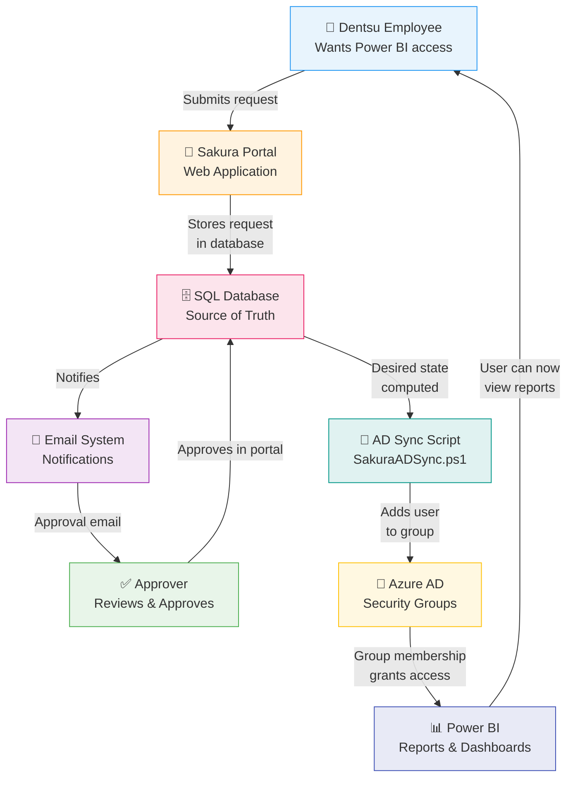

**What this diagram tells you:**
- The loop starts with a user wanting access and ends with them having it
- Sakura is the orchestration layer — it does not grant access directly
- Access is ultimately enforced by Azure AD group membership, which Power BI reads
- The database is the single source of truth throughout the entire flow

---

## PART 2 — The People Involved: Roles

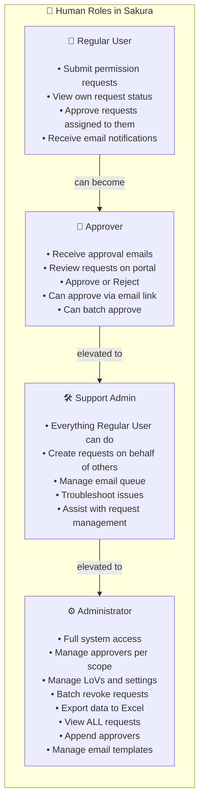

**Key point:** A single person can wear multiple hats. A user who is also listed as an approver for their own scope gets **auto-approved** the moment they submit — no waiting required.

---

## PART 3 — The System Components: What Runs Where

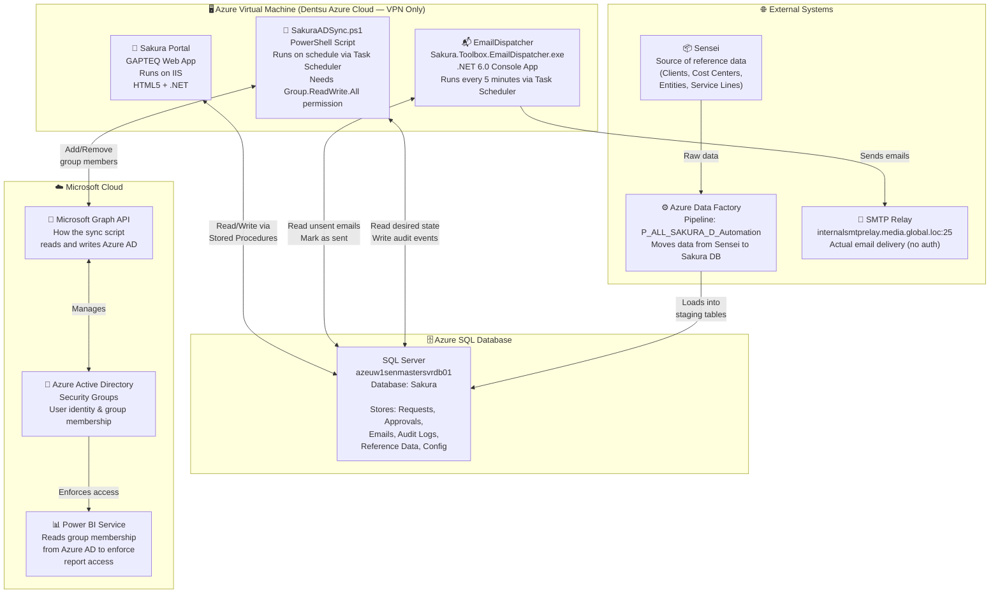

**What to remember:**
- Everything lives on one VM behind the VPN — portal, EmailDispatcher, and sync script all co-exist
- The database is the hub — every component reads from or writes to it
- The sync script is the **only** thing that touches Azure AD — nothing else does

---

## PART 4 — The Data Model: Key Tables and How They Connect

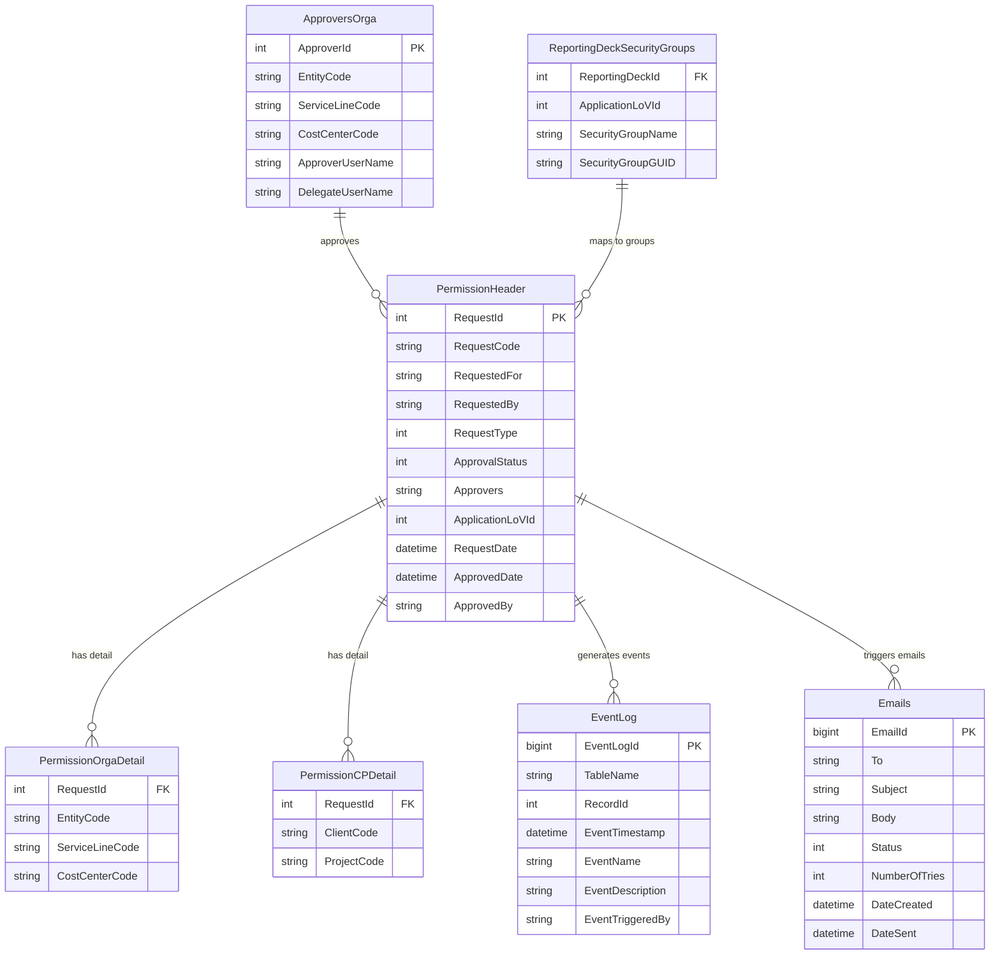

**What to remember:**
- `PermissionHeader` is the master record — one row per request
- Detail tables (OrgaDetail, CPDetail) hold the "what scope" information
- `ReportingDeckSecurityGroups` is the bridge from a request to an actual Azure AD group GUID
- `EventLog` and `Emails` are generated as side effects of every action

---

## PART 5 — Permission Types: What Can Users Request?

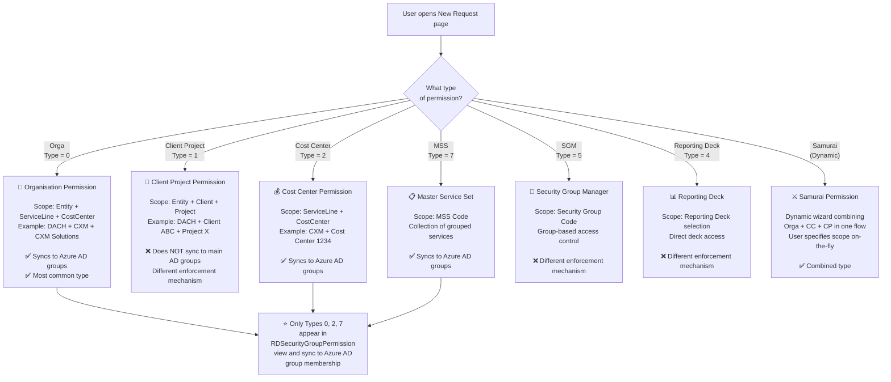

**Critical insight:** Only Orga (0), Cost Center (2), and MSS (7) feed into Azure AD group sync. If a user has a CP or SGM request approved, they will be added to the `EntireOrg` group (app-level access) but their specific group assignment works differently.

---

## PART 6 — The Full Request Lifecycle (State Machine)

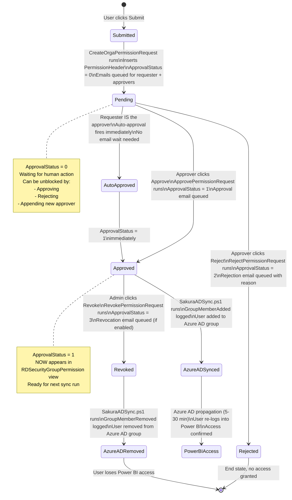

**What to remember:** Approval changes the database instantly. But Power BI access is NOT instant — it still needs the sync script to run, plus Azure AD propagation time.

---

## PART 7 — How Approvers Are Found (The Algorithm)

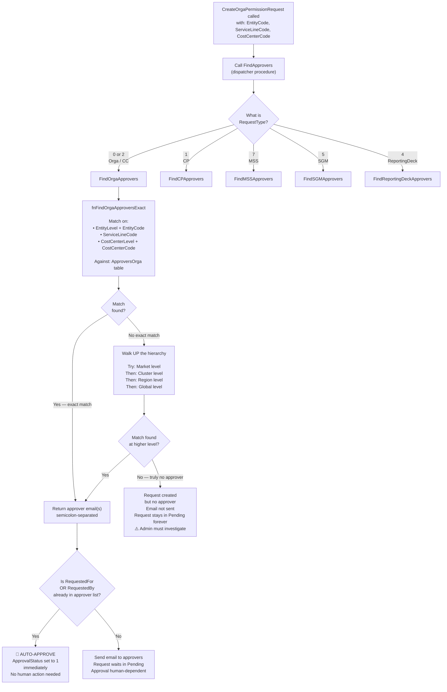

**What to remember:** If a request stays in Pending forever, the first thing to check is the `ApproversOrga` (or CP/MSS/SGM) table — there may be no approver configured for that scope combination.

---

## PART 8 — The Email Pipeline: How Notifications Reach Users

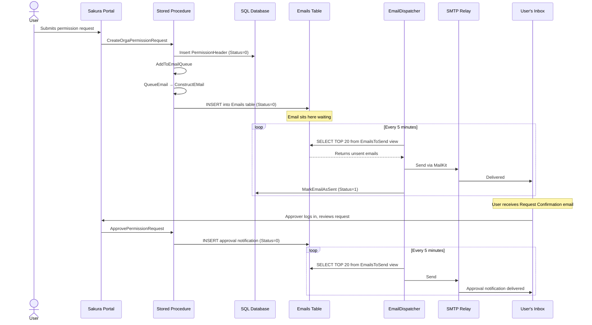

**What to remember:**
- Emails are **never sent directly** by stored procedures — they are always queued first
- The EmailDispatcher is the only component that actually sends emails
- If EmailDispatcher stops running, emails pile up in the `Emails` table (Status=0) and users see nothing
- `EmailingMode = '0'` in ApplicationSettings disables all email sending

---

## PART 9 — The AD Sync: How Access Gets Enforced in Azure AD

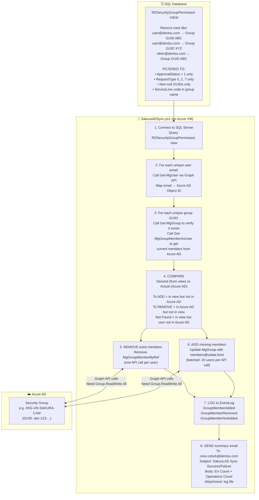

**Critical point about permissions:**

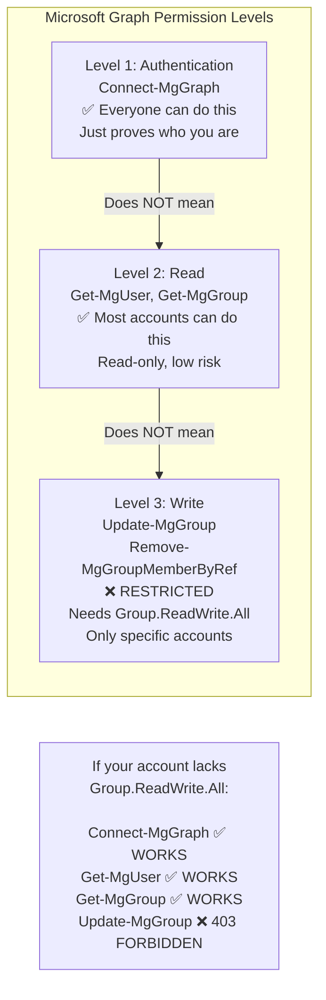

---

## PART 10 — The Group Matching Logic: How a Request Maps to an Azure AD Group

This is one of the trickiest parts. Understanding this prevents a lot of confusion.

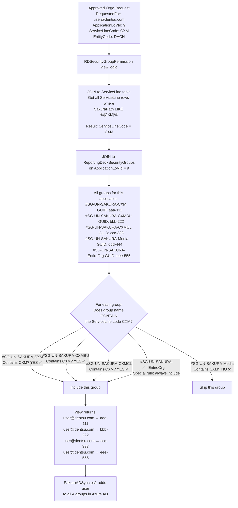

**Why this matters for troubleshooting:** If a user is approved but not being added to a specific group, check whether that group's name in `ReportingDeckSecurityGroups` actually contains the ServiceLine code of the user's approved request.

---

## PART 11 — Power BI Access: The Last Mile

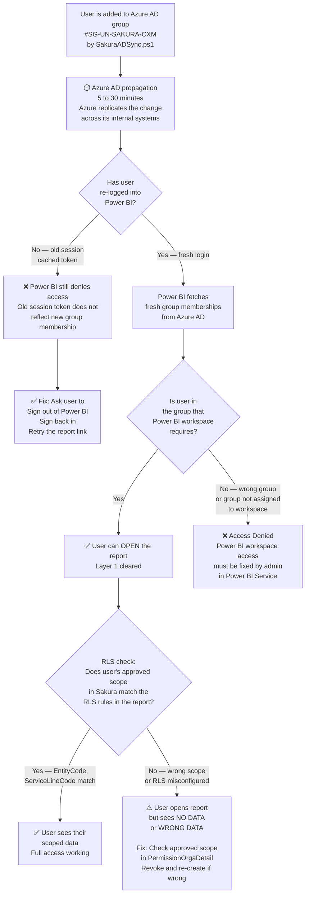

**The two layers explained simply:**
- **Layer 1 (Can they enter?)** — Azure AD group membership → managed by Sakura sync
- **Layer 2 (What can they see?)** — RLS rules in Power BI → driven by Sakura's approved scope data

---

## PART 12 — Where Reference Data Comes From (The Data Pipeline)

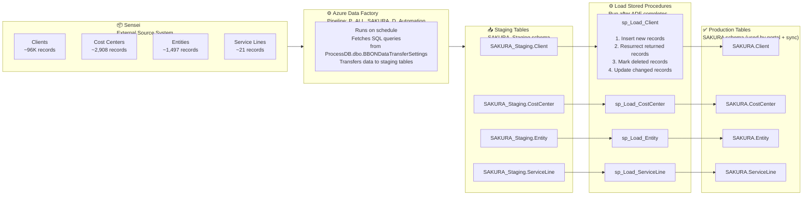

**What to remember:** If a new entity, cost center, or client appears in Sensei but is missing from Sakura's dropdowns, the ADF pipeline may not have run — or the `sp_Load_*` stored procedures may not have been executed after staging was populated.

---

## PART 13 — The Audit Trail: How to Investigate Anything

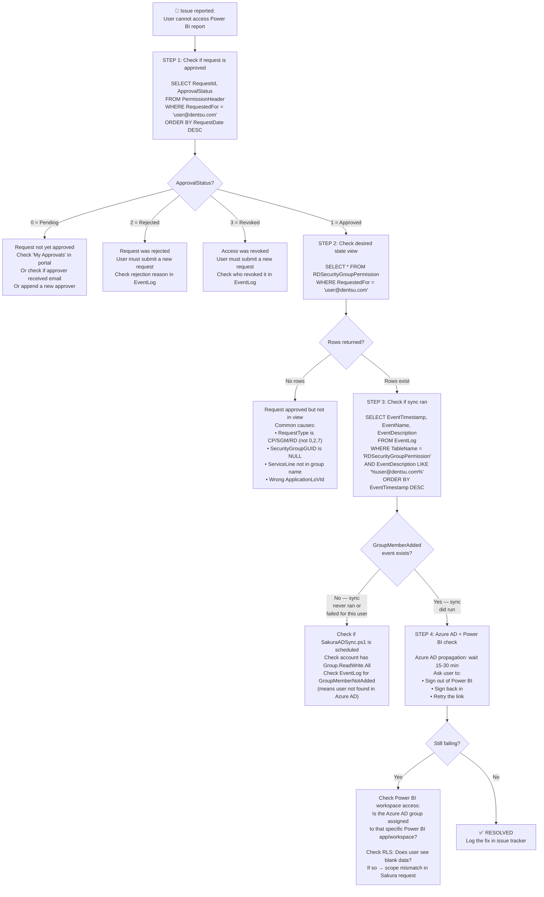

---

## PART 14 — Complete End-to-End Timeline (All Stages Together)

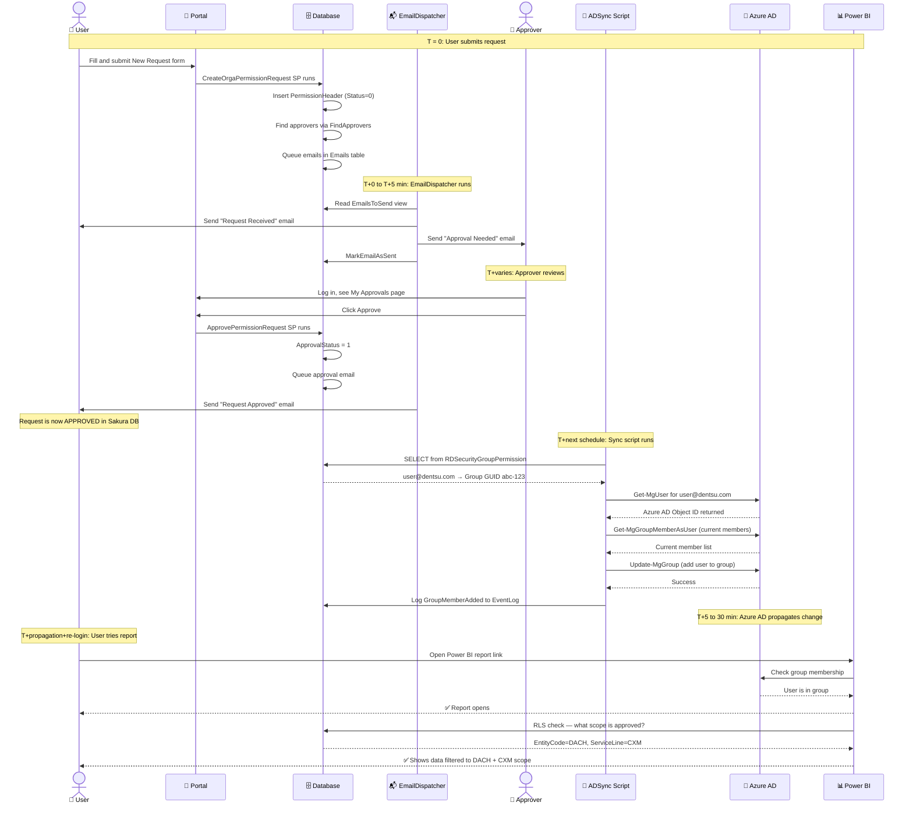

---

## PART 15 — Common Issues at a Glance

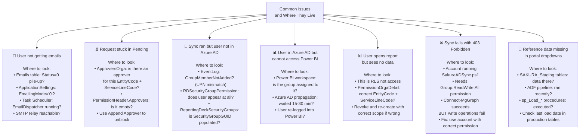

---

## PART 16 — Component Dependency: If X Breaks, What Else Breaks?

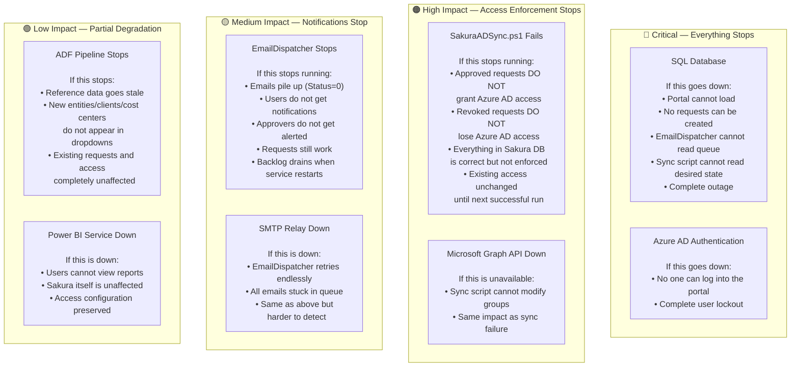

---

## PART 17 — Quick Reference Card (Print-Friendly Summary)

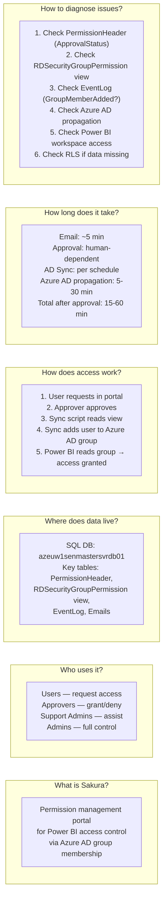

---

## Glossary

| Term | Plain English Meaning |
|---|---|
| **Sakura** | The permission management portal for Power BI access control |
| **GAPTEQ** | The Low-Code web platform Sakura's portal UI is built on |
| **PermissionHeader** | The master database record for one permission request |
| **ApprovalStatus** | 0=Pending, 1=Approved, 2=Rejected, 3=Revoked |
| **RDSecurityGroupPermission** | The SQL view that computes "desired state" — who should be in which Azure AD group |
| **ReportingDeckSecurityGroups** | Maps Power BI apps + reporting decks to Azure AD group GUIDs |
| **SakuraADSync.ps1** | PowerShell script that syncs Sakura's desired state into Azure AD groups |
| **EmailDispatcher** | .NET app that reads the email queue and sends notifications via SMTP |
| **ApplicationLoVId** | A foreign key identifying which Power BI application a request is for |
| **ServiceLineCode** | Short code for a service line (e.g., "CXM") — embedded in Azure AD group names |
| **EventLog** | Immutable audit table — your first stop for all investigations |
| **Group.ReadWrite.All** | The Azure AD permission required to add/remove Azure AD group members |
| **Orga permission** | Organisation-scoped request (most common) — syncs to Azure AD groups |
| **CP permission** | Client Project-scoped request — does NOT sync via main view |
| **EntireOrg group** | `#SG-UN-SAKURA-EntireOrg` — every approved user is added here for app-level access |
| **RLS** | Row-Level Security — Power BI feature that filters data per user based on their approved scope |
| **Sensei** | External source system that feeds reference data (clients, entities, service lines) into Sakura |
| **ADF** | Azure Data Factory — the pipeline that moves data from Sensei to Sakura's staging tables |
| **LoV** | List of Values — predefined dropdown options stored in the LoV table |
| **Auto-approval** | When the requester is also the approver, the request approves itself immediately |
| **RequestBatchCode** | Groups multiple requests created together (e.g., bulk creation for a team) |

---

*This onboarding guide is designed to be read end-to-end on first encounter, and used as a reference afterwards. For detailed SQL queries and troubleshooting steps, see `Sakura_End_to_End_Complete_Guide.md`.*
