# Complete Stack Analysis: A vs B vs C (React + .NET)

*Comprehensive Technical Decision Document with Architecture Diagrams*

---

## 📋 Table of Contents

1. [Architecture Overview](#architecture-overview)
2. [Option A: Angular + .NET Deep Dive](#option-a-deep-dive)
3. [Option B: React + NestJS Deep Dive](#option-b-deep-dive)
4. [Option C: React + .NET Deep Dive](#option-c-deep-dive)
5. [Requirements Satisfaction Matrix](#requirements-satisfaction-matrix)
6. [Decision Framework](#decision-framework)

---

## Architecture Overview

### High-Level System Context


---

## Option A Deep Dive

### Option A: Angular 17 + .NET 8 Architecture


### Option A: Request Flow Detail

```mermaid
sequenceDiagram
    actor Admin
    participant Angular as Angular SPA
    participant Entra as MS Entra ID
    participant API as .NET API
    participant Policy as Casbin Engine
    participant Cache as Redis
    participant DB as Azure SQL
    participant Audit as Audit Store
    
    Admin->>Angular: Navigate to Approvals
    Angular->>Entra: Check token validity
    alt Token expired
        Entra-->>Angular: Refresh token
    end
    
    Angular->>API: GET /api/approvals<br/>(Authorization: Bearer token)
    API->>API: JWT Middleware validates
    API->>Policy: Check permissions<br/>(user, "read", "approvals")
    Policy->>Cache: Load policy rules
    Cache-->>Policy: Rules cached
    Policy-->>API: ✅ Authorized
    
    API->>DB: Query approvals<br/>(filtered by user scope)
    DB-->>API: Approval records
    
    API->>Audit: Log access<br/>(user, action, timestamp, IP)
    Audit-->>API: Event stored
    
    API-->>Angular: JSON response
    Angular->>Angular: Render AG-Grid
    Angular-->>Admin: Display data grid
    
    Note over Admin,Audit: All actions logged with hash chain
```



---

## Option B Deep Dive

### Option B: React + Vite + NestJS Architecture


### Option B: Request Flow Detail

```mermaid
sequenceDiagram
    actor Admin
    participant React as React + Vite
    participant Okta as Okta/Entra
    participant Nest as NestJS API
    participant Policy as Casbin/OPA
    participant Cache as Redis
    participant DB as Postgres/SQL
    participant Queue as BullMQ
    participant Audit as Audit Store
    
    Admin->>React: Click "Export Approvals"
    React->>Okta: Verify session
    Okta-->>React: Valid token
    
    React->>Nest: POST /api/exports<br/>(Authorization: Bearer token)
    Nest->>Nest: AuthGuard validates JWT
    Nest->>Policy: Check permission<br/>(user, "create", "export")
    Policy->>Cache: Get cached policies
    Cache-->>Policy: Policy rules
    Policy-->>Nest: ✅ Authorized (with scope)
    
    Nest->>Nest: Generate job ID
    Nest->>Queue: Enqueue export job<br/>(userId, filters, watermark)
    Queue-->>Nest: Job queued
    
    Nest->>Audit: Log export request<br/>(user, job ID, timestamp)
    Audit-->>Nest: Logged
    
    Nest-->>React: 202 Accepted<br/>{jobId, estimatedTime}
    React-->>Admin: "Export in progress..."
    
    Note over Queue,DB: Background worker processes
    Queue->>DB: Stream query results
    DB-->>Queue: Data chunks
    Queue->>Queue: Apply watermark<br/>(userId, timestamp)
    Queue->>Queue: Generate XLSX
    Queue->>Audit: Log completion
    Queue->>Admin: Email download link<br/>(signed, expiring)
    
    Note over Admin,Audit: Async job prevents API timeout
```



### Option B: TypeScript End-to-End Type Safety


---

## Option C Deep Dive

### Option C: React + .NET 8 Architecture (Best of Both Worlds)


### Option C: Development Workflow


---

## Requirements Satisfaction Matrix

### How Each Option Meets Your Hard Requirements

```mermaid
graph TD
    subgraph "Requirements"
        R1[SSO: MS Entra/Okta]
        R2[RBAC/ABAC Policy Engine]
        R3[Complete Audit Trail]
        R4[Watermarked Exports]
        R5[Private Networking]
        R6[OWASP ASVS L2]
    end
    
    subgraph "Option A: Angular + .NET"
        A1[✅ MS Identity built-in]
        A2[✅ Casbin.NET + Policies]
        A3[✅ Middleware + Event Store]
        A4[✅ ClosedXML + Watermarks]
        A5[✅ Azure Private Endpoints]
        A6[✅ Security Headers + CSP]
    end
    
    subgraph "Option B: React + NestJS"
        B1[✅ Passport.js OIDC]
        B2[✅ node-casbin/OPA]
        B3[✅ Interceptors + Audit DB]
        B4[✅ ExcelJS + Streaming]
        B5[✅ Azure Private Endpoints]
        B6[✅ Helmet + CSP Middleware]
    end
    
    subgraph "Option C: React + .NET"
        C1[✅ MS Identity + MSAL]
        C2[✅ Casbin.NET + Policies]
        C3[✅ Middleware + Event Store]
        C4[✅ ClosedXML + Watermarks]
        C5[✅ Azure Private Endpoints]
        C6[✅ Security Headers + CSP]
    end
    
    R1 --> A1
    R1 --> B1
    R1 --> C1
    
    R2 --> A2
    R2 --> B2
    R2 --> C2
    
    R3 --> A3
    R3 --> B3
    R3 --> C3
    
    R4 --> A4
    R4 --> B4
    R4 --> C4
    
    R5 --> A5
    R5 --> B5
    R5 --> C5
    
    R6 --> A6
    R6 --> B6
    R6 --> C6
    
    style A1 fill:#c8e6c9
    style B1 fill:#c8e6c9
    style C1 fill:#c8e6c9
    style A2 fill:#c8e6c9
    style B2 fill:#c8e6c9
    style C2 fill:#c8e6c9
    style A3 fill:#c8e6c9
    style B3 fill:#c8e6c9
    style C3 fill:#c8e6c9
    style A4 fill:#c8e6c9
    style B4 fill:#c8e6c9
    style C4 fill:#c8e6c9
    style A5 fill:#c8e6c9
    style B5 fill:#c8e6c9
    style C5 fill:#c8e6c9
    style A6 fill:#c8e6c9
    style B6 fill:#c8e6c9
    style C6 fill:#c8e6c9
```



**Verdict:** All three options fully satisfy the hard requirements. The difference is in implementation approach and developer experience.

---

## Detailed Pros & Cons Analysis

### Option A: Angular 17 + .NET 8 — Extremely Detailed

#### ✅ PROS (In-Depth)

##### 1. **Enterprise Structure & Guardrails** ⭐⭐⭐⭐⭐

* **Angular's Opinionated Architecture:** 
  - Enforced module boundaries with NgModules or standalone components
  - Dependency Injection (DI) system prevents tight coupling
  - Clear separation: Components → Services → Repositories
  - **Example:** New junior dev can't accidentally bypass auth because guards are enforced at route level
  - **Real Impact:** Reduces "creative" solutions that lead to tech debt

* **.NET Conventions:**
  - Controllers, Services, Repositories pattern is standardized
  - Middleware pipeline is explicit and ordered
  - Built-in analyzers catch security issues (e.g., SQL injection via EF Core)
  - **Example:** .NET SDK warns if you're using deprecated crypto algorithms
  - **Real Impact:** Fewer security vulnerabilities from developer mistakes

##### 2. **Security & Identity Integration** ⭐⭐⭐⭐⭐

* **Microsoft Entra ID (Azure AD) Native Support:**
  - `Microsoft.Identity.Web` package handles token validation automatically
  - Built-in token caching with distributed cache
  - Automatic token renewal with minimal config
  - **Code Example:**
    ```csharp
    builder.Services.AddAuthentication(JwtBearerDefaults.AuthenticationScheme)
        .AddMicrosoftIdentityWebApi(builder.Configuration.GetSection("AzureAd"));
    ```
  - **Real Impact:** 15 lines of code vs 100+ lines for manual OIDC setup

* **Policy-Based Authorization:**
  - Built-in authorization policies
  - Attribute-based access control (ABAC) via `[Authorize(Policy = "MarketAdmin")]`
  - **Example:** Can check user claims, roles, AND custom policies in one place
  - **Real Impact:** Centralized authorization logic, no scattered if/else checks

##### 3. **API Performance & Throughput** ⭐⭐⭐⭐⭐

* **.NET 8 Minimal APIs:**
  - **Benchmarks:** ~7M requests/sec for simple endpoints (TechEmpower)
  - Low memory overhead: ~50MB base memory vs ~150MB for Node
  - Native async/await with thread pool optimization
  - **Example Scenario:** Heavy approval batch processing (1000s of records)
    - .NET: ~200ms for batch processing
    - Node: ~500ms for same workload
  - **Real Impact:** Can handle 3-4x more concurrent users on same hardware

* **Database Performance:**
  - EF Core query compilation caching
  - Dapper for raw SQL with zero-overhead mapping
  - Built-in connection pooling
  - **Real Impact:** Audit log writes are 40% faster than Node equivalents

##### 4. **Tooling & Developer Productivity** ⭐⭐⭐⭐

* **Visual Studio / Rider IDE:**
  - Best-in-class refactoring (rename symbol across solution)
  - Real-time code analysis with fix suggestions
  - Integrated Azure deployment
  - **Example:** Rename a DTO property → automatically updates all API endpoints, services, and database migrations
  - **Real Impact:** 50% less time on refactoring tasks

* **Strong Typing End-to-End:**
  - C# DTOs → NSwag → TypeScript types
  - Database schema → EF Core models → C# types
  - Compile-time safety on backend
  - **Real Impact:** Catch breaking changes before deployment

##### 5. **Long-Term Maintainability** ⭐⭐⭐⭐⭐

* **Clear Layering:**
  - Presentation (Controllers) → Business (Services) → Data (Repositories)
  - Each layer has single responsibility
  - Easy to enforce via code reviews and analyzers
  - **Real Impact:** New features don't create spaghetti code

* **Mature Ecosystem:**
  - .NET has 20+ years of enterprise patterns
  - Azure SDKs are first-class
  - Long-term support (LTS) for .NET versions (3 years)
  - **Real Impact:** Less risk of framework abandonment

#### ❌ CONS (In-Depth)

##### 1. **Frontend Iteration Speed** ⭐⭐

* **Angular Build Process:**
  - Full build: 30-60 seconds vs Vite's <5 seconds
  - HMR (Hot Module Replacement) is slower than Vite
  - **Example:** Change a button color in Angular → 5-10 sec to see change; in Vite → instant
  - **Real Impact:** Developers get frustrated, lose flow state

* **Development Server:**
  - `ng serve` uses webpack (even with esbuild, slower than Vite)
  - Memory usage: 500MB-1GB for dev server
  - **Real Impact:** Slower iteration on UI/UX changes

##### 2. **Learning Curve for New Frontend Developers** ⭐⭐

* **Angular Complexity:**
  - Must learn: Components, Modules, Services, RxJS, Dependency Injection, Change Detection
  - **Example:** Simple form with validation requires understanding FormControl, FormGroup, Validators, async validators, and change detection
  - **Typical Learning Time:** 2-3 months to be productive vs 2-4 weeks for React
  - **Real Impact:** Slower onboarding, harder to hire junior FE devs

* **RxJS Overhead:**
  - Observables everywhere (async pipe, subscriptions, operators)
  - Common mistake: forgetting to unsubscribe → memory leaks
  - **Example:** Even fetching data requires understanding `switchMap`, `catchError`, `finalize`
  - **Real Impact:** More code reviews needed, more bugs in production

##### 3. **Frontend Ecosystem Flexibility** ⭐⭐⭐

* **Component Library Lock-In:**
  - Angular Material is the default, but customization is harder than headless React components
  - Fewer choices compared to React ecosystem
  - **Example:** Need a complex data grid? AG-Grid works, but fewer alternatives than React
  - **Real Impact:** Less flexibility to choose best-fit libraries

* **Smaller Community:**
  - React has 3-4x more npm packages and tutorials
  - Fewer Angular experts to hire
  - **Real Impact:** Slower to find solutions to unique problems

##### 4. **Two-Language Stack (TypeScript + C#)** ⭐⭐⭐

* **Context Switching:**
  - FE devs work in TypeScript, BE devs in C#
  - Different idioms (camelCase vs PascalCase, async patterns)
  - **Example:** FE dev can't easily jump into BE to fix a bug
  - **Real Impact:** Team silos, slower cross-functional features

---

### Option B: React + NestJS — Extremely Detailed

#### ✅ PROS (In-Depth)

##### 1. **TypeScript End-to-End** ⭐⭐⭐⭐⭐

* **Single Language Across Stack:**
  - Same syntax, idioms, and patterns on FE and BE
  - **Example:** DTO defined once, used in React form AND NestJS controller
    ```typescript
    // shared/dtos/approval.dto.ts
    export interface CreateApprovalDto {
      title: string;
      description: string;
      priority: 'low' | 'medium' | 'high';
    }
    
    // Frontend
    const form = useForm<CreateApprovalDto>();
    
    // Backend
    @Post()
    async create(@Body() dto: CreateApprovalDto) { ... }
    ```
  - **Real Impact:** Zero type drift between FE and BE

* **Shared Code & Libraries:**
  - Can create `@shared` packages for DTOs, validators, utilities
  - Zod schemas work on both FE (form validation) and BE (request validation)
  - **Real Impact:** 30-40% less code duplication

* **Full-Stack Developers:**
  - One dev can own a feature end-to-end
  - No waiting for "backend team" or "frontend team"
  - **Real Impact:** 50% faster feature delivery

##### 2. **Frontend Velocity & Ecosystem** ⭐⭐⭐⭐⭐

* **Vite Development Experience:**
  - **Hot Module Replacement:** Instant updates (<100ms)
  - Cold start: <2 seconds vs 30+ seconds for Angular
  - **Example:** Change component → see result instantly → stay in flow
  - **Real Impact:** Developers are happier and more productive

* **React Ecosystem:**
  - **Data Grids:** TanStack Table (headless), AG-Grid, react-data-grid
  - **Forms:** React Hook Form + Zod (best-in-class validation)
  - **Headless UI:** Radix, Headless UI, shadcn (fully customizable)
  - **Example:** Build a complex wizard with multi-step validation in hours, not days
  - **Real Impact:** Faster UI iteration based on ops team feedback

* **Component Flexibility:**
  - Headless components = full control over styling
  - No framework lock-in for UI
  - **Real Impact:** Can match corporate brand guidelines perfectly

##### 3. **NestJS Modularity & Structure** ⭐⭐⭐⭐

* **Opinionated Architecture:**
  - Modules, Controllers, Services, Providers pattern
  - Dependency Injection like Angular
  - **Example:**
    ```typescript
    @Module({
      imports: [AuditModule, PolicyModule],
      controllers: [ApprovalController],
      providers: [ApprovalService],
    })
    export class ApprovalModule {}
    ```
  - **Real Impact:** Prevents spaghetti code common in Express apps

* **Decorators & Guards:**
  - `@UseGuards(JwtAuthGuard, RBACGuard)` on endpoints
  - Authorization logic is declarative
  - **Example:**
    ```typescript
    @Get()
    @RequirePermission('approval:read')
    async findAll() { ... }
    ```
  - **Real Impact:** Security is enforced at compile-time

* **Built-In Features:**
  - Validation pipes (class-validator)
  - Exception filters
  - Interceptors for logging/audit
  - **Real Impact:** Less boilerplate code

##### 4. **Rapid Prototyping & Iteration** ⭐⭐⭐⭐⭐

* **Fast POC Development:**
  - NestJS CLI generates modules, services, controllers instantly
  - React scaffolding with create-vite is <1 minute
  - **Example:** Scaffold entire CRUD API + React UI in 30 minutes
  - **Real Impact:** Can show working prototype to ops team in Week 1

* **Developer Ergonomics:**
  - Hot reload on both FE and BE
  - TypeScript errors show immediately
  - **Real Impact:** Tight feedback loop = fewer bugs

##### 5. **Hiring & Talent Pool** ⭐⭐⭐⭐⭐

* **Largest Developer Community:**
  - React: 220k+ GitHub stars
  - Node/TypeScript: Most popular backend language for new projects
  - **Hiring Stats:**
    - React developers: ~2M globally
    - Angular developers: ~500k globally
    - .NET developers: ~800k globally
  - **Real Impact:** 3-4x easier to find qualified candidates

* **Lower Salary Costs:**
  - React/Node devs typically 10-20% less expensive than .NET specialists in most markets
  - **Real Impact:** Budget flexibility

#### ❌ CONS (In-Depth)

##### 1. **Lower Raw API Throughput** ⭐⭐⭐

* **Node.js Performance Characteristics:**
  - **Single-threaded event loop:** Great for I/O, poor for CPU-heavy tasks
  - **Benchmarks:** ~1.5M requests/sec vs .NET's 7M req/sec
  - **Real Scenario:** 
    - Batch processing 10,000 approval records with complex business logic
    - Node: ~800ms
    - .NET: ~300ms
  - **Real Impact:** Noticeable under heavy load, but most admin tools are I/O-bound

* **When This Matters:**
  - If your ops console has <1000 concurrent users → doesn't matter
  - If you're processing ML/data science workloads → matters a lot
  - **Mitigation:** Offload CPU work to worker threads or separate microservice

##### 2. **Policy Engine & Typing Discipline Required** ⭐⭐⭐

* **Authorization Complexity:**
  - node-casbin requires manual setup vs .NET's built-in policies
  - OPA requires learning Rego language
  - **Example:** .NET has `[Authorize(Policy = "MarketAdmin")]` built-in; NestJS needs custom decorator
  - **Real Impact:** 2-3 days extra setup time

* **Runtime vs Compile-Time Safety:**
  - TypeScript compiles to JavaScript (no runtime type checks)
  - Must use Zod/TypeBox for runtime validation
  - **Example:** Forgot to validate input? Runtime error instead of compile error
  - **Real Impact:** Need strong testing discipline

##### 3. **Long-Running Tasks & Memory Management** ⭐⭐

* **Export/Report Generation:**
  - Large exports can block event loop
  - **Example:** Exporting 100k records → can freeze API for 30 seconds
  - **Mitigation:** Use BullMQ to offload to worker process
  - **Real Impact:** Extra complexity in architecture

* **Memory Leaks:**
  - Easier to create memory leaks in Node than .NET (GC differences)
  - **Example:** Forgot to clear interval → memory grows over time
  - **Real Impact:** Need monitoring and alerting

##### 4. **Less Mature Azure Integration** ⭐⭐⭐

* **Azure SDK Quality:**
  - .NET Azure SDKs are first-class (Microsoft-built)
  - Node Azure SDKs are good but sometimes lag behind
  - **Example:** New Azure feature available in .NET immediately, Node in 2-3 months
  - **Real Impact:** Rarely blocks critical features, but occasionally frustrating

---

### Option C: React + .NET 8 — Extremely Detailed

#### ✅ PROS (In-Depth)

##### 1. **Best of Both Worlds** ⭐⭐⭐⭐⭐

* **React Frontend Velocity:**
  - All the React ecosystem benefits from Option B
  - Vite HMR, TanStack, shadcn, React Hook Form
  - **Real Impact:** Fastest UI iteration

* **.NET Backend Performance:**
  - All the .NET throughput and security benefits from Option A
  - Azure-native identity, high-performance APIs
  - **Real Impact:** Best API performance

* **Balanced Approach:**
  - FE team works in React/TS
  - BE team works in .NET/C#
  - Each team uses best-in-class tools
  - **Real Impact:** No compromise on either side

##### 2. **Strong Typing with OpenAPI Bridge** ⭐⭐⭐⭐

* **NSwag/Swashbuckle Code Generation:**
  - .NET API generates OpenAPI spec automatically
  - NSwag generates TypeScript client
  - **Example:**
    ```bash
    # After building .NET API
    nswag run nswag.json
    # Generates api-client.ts with full types
    ```
  - **Workflow:**
    1. Change C# DTO
    2. Build .NET project
    3. Regenerate TS client
    4. TypeScript compiler catches breaking changes in React
  - **Real Impact:** Type safety across language boundaries

##### 3. **Azure-Native Identity & Security** ⭐⭐⭐⭐⭐

* **Microsoft Identity Platform:**
  - MSAL React for frontend (Microsoft-supported)
  - Microsoft.Identity.Web for backend
  - Seamless token flow
  - **Real Impact:** Enterprise SSO just works

* **Security Defaults:**
  - .NET middleware handles CSRF, clickjacking, CSP automatically
  - Azure Key Vault integration is one-liner
  - **Real Impact:** Fewer security vulnerabilities

##### 4. **Team Specialization** ⭐⭐⭐⭐

* **Clear Separation of Concerns:**
  - Frontend specialists focus on React
  - Backend specialists focus on .NET
  - No need for "full-stack" developers
  - **Real Impact:** Can hire specialists in each area

* **Parallel Development:**
  - FE and BE teams can work independently once API contract is defined
  - **Example:** Define OpenAPI spec in Week 1 → both teams work in parallel
  - **Real Impact:** Faster delivery

##### 5. **Enterprise-Grade Reliability** ⭐⭐⭐⭐⭐

* **Production Battle-Tested:**
  - React is used by Facebook, Netflix, Airbnb
  - .NET is used by Microsoft, Stack Overflow, Bing
  - **Real Impact:** Proven at massive scale

##### 6. **Broad Hiring Pool** ⭐⭐⭐⭐⭐

* **Best of Both Talent Markets:**
  - Can hire React specialists (largest FE pool)
  - Can hire .NET specialists (enterprise expertise)
  - **Real Impact:** Flexibility in hiring strategy

#### ❌ CONS (In-Depth)

##### 1. **Two-Language Context Switching** ⭐⭐⭐

* **Different Ecosystems:**
  - npm for frontend, NuGet for backend
  - Different build tools (Vite vs MSBuild)
  - Different testing frameworks (Jest vs xUnit)
  - **Example:** Junior dev needs to learn two ecosystems
  - **Real Impact:** Steeper learning curve for new hires

* **Code Duplication:**
  - Can't share validation logic between FE and BE
  - DTOs defined twice (C# and TypeScript)
  - **Example:** Add new field → update C# DTO, regenerate TS client, update React form
  - **Real Impact:** Extra step in development workflow

##### 2. **Type Generation Workflow** ⭐⭐

* **Manual Generation Step:**
  - After changing .NET API, must regenerate TypeScript client
  - Not automatic (unless you set up CI/CD)
  - **Example:** Dev forgets to regenerate → runtime errors in frontend
  - **Mitigation:** Add pre-commit hook to check if client is up-to-date
  - **Real Impact:** Occasional friction in development

* **Generated Code Quality:**
  - NSwag-generated code can be verbose
  - Sometimes need to write wrapper functions
  - **Real Impact:** Extra layer of abstraction

##### 3. **Less "One-Stack" Cohesion** ⭐⭐⭐

* **Two Separate Projects:**
  - Frontend repo + Backend repo (or monorepo with two separate builds)
  - Different dependency management
  - **Example:** Upgrading TypeScript version only affects FE, not BE
  - **Real Impact:** More build configuration complexity

* **Not Truly Full-Stack:**
  - Developers typically specialize in one side
  - Harder to own feature end-to-end
  - **Real Impact:** More coordination needed between teams

##### 4. **OpenAPI Generation Quirks** ⭐⭐

* **Edge Cases:**
  - Complex C# generics don't always map cleanly to TypeScript
  - Nullable reference types can cause confusion
  - **Example:** `List<Dictionary<string, object?>>` generates messy TS type
  - **Mitigation:** Simplify DTOs, avoid overly complex types
  - **Real Impact:** Occasional manual fixes to generated code

---

## Decision Framework

### Decision Tree: Which Stack Is Right For You?

```mermaid
graph TD
    Start[Choose Your Stack] --> Q1{What's your team's<br/>primary strength?}
    
    Q1 -->|C#/.NET experts| NetPath[.NET Backend Path]
    Q1 -->|TypeScript/Node experts| NodePath[Node Backend Path]
    Q1 -->|Mixed or unclear| MixedPath[Evaluate other factors]
    
    NetPath --> Q2{Frontend preference?}
    Q2 -->|Angular experience| ChoiceA[✅ OPTION A<br/>Angular + .NET]
    Q2 -->|React preference| ChoiceC[✅ OPTION C<br/>React + .NET]
    Q2 -->|No preference| Q2A{Want fastest FE iteration?}
    Q2A -->|Yes| ChoiceC
    Q2A -->|No, want consistency| ChoiceA
    
    NodePath --> Q3{Need maximum<br/>API throughput?}
    Q3 -->|Yes, CPU-heavy| ReconsiderNet[⚠️ Consider .NET instead<br/>or hybrid approach]
    Q3 -->|No, I/O-bound| ChoiceB[✅ OPTION B<br/>React + NestJS]
    
    MixedPath --> Q4{What matters most?}
    Q4 -->|Speed to market<br/>Rapid prototyping| ChoiceB
    Q4 -->|Enterprise guardrails<br/>Azure-native| ChoiceA
    Q4 -->|Best of both worlds<br/>Flexibility| ChoiceC
    
    style ChoiceA fill:#c8e6c9,stroke:#4caf50,stroke-width:3px
    style ChoiceB fill:#bbdefb,stroke:#2196f3,stroke-width:3px
    style ChoiceC fill:#fff9c4,stroke:#ffc107,stroke-width:3px
    style ReconsiderNet fill:#ffcdd2,stroke:#f44336,stroke-width:2px
```



---

### Scenario-Based Recommendations

```mermaid
graph TB
    subgraph "Scenario 1: Startup/Fast Prototype"
        S1[Need: Quick POC<br/>Small team<br/>Fast iteration]
        S1 --> R1[✅ Choose OPTION B<br/>React + NestJS]
        R1 --> W1[Why: Fastest time-to-value<br/>One language<br/>Easy hiring]
    end
    
    subgraph "Scenario 2: Enterprise/Compliance-Heavy"
        S2[Need: Strong security<br/>Audit requirements<br/>Azure-native]
        S2 --> R2[✅ Choose OPTION A or C<br/>.NET Backend]
        R2 --> W2[Why: MS Entra built-in<br/>Enterprise patterns<br/>Best Azure integration]
    end
    
    subgraph "Scenario 3: Large Team/Specialists"
        S3[Have: FE specialists<br/>BE specialists<br/>Parallel teams]
        S3 --> R3[✅ Choose OPTION C<br/>React + .NET]
        R3 --> W3[Why: Teams use best tools<br/>Clear separation<br/>Parallel development]
    end
    
    subgraph "Scenario 4: High Performance Needs"
        S4[Need: High throughput<br/>CPU-heavy processing<br/>Low latency]
        S4 --> R4[✅ Choose OPTION A or C<br/>.NET Backend]
        R4 --> W4[Why: 3-4x better throughput<br/>Optimized async<br/>Lower memory]
    end
    
    style R1 fill:#bbdefb
    style R2 fill:#c8e6c9
    style R3 fill:#fff9c4
    style R4 fill:#c8e6c9
```



---

### Side-by-Side Comparison Table

| **Factor** | **Option A: Angular + .NET** | **Option B: React + NestJS** | **Option C: React + .NET** |
|------------|------------------------------|------------------------------|----------------------------|
| **Frontend Speed** | ⭐⭐ (30s builds) | ⭐⭐⭐⭐⭐ (<2s Vite) | ⭐⭐⭐⭐⭐ (<2s Vite) |
| **Backend Performance** | ⭐⭐⭐⭐⭐ (7M req/s) | ⭐⭐⭐ (1.5M req/s) | ⭐⭐⭐⭐⭐ (7M req/s) |
| **Type Safety** | ⭐⭐⭐⭐ (NSwag bridge) | ⭐⭐⭐⭐⭐ (Native TS) | ⭐⭐⭐⭐ (NSwag bridge) |
| **Learning Curve** | ⭐⭐ (Angular complex) | ⭐⭐⭐⭐ (React + TS) | ⭐⭐⭐ (Two languages) |
| **Hiring Pool** | ⭐⭐⭐ (Angular scarce) | ⭐⭐⭐⭐⭐ (Largest) | ⭐⭐⭐⭐⭐ (Two pools) |
| **Azure Integration** | ⭐⭐⭐⭐⭐ (Native) | ⭐⭐⭐⭐ (Good SDKs) | ⭐⭐⭐⭐⭐ (Native) |
| **Time to Market** | ⭐⭐⭐⭐ | ⭐⭐⭐⭐⭐ | ⭐⭐⭐⭐ |
| **Full-Stack Dev** | ⭐⭐ (Two languages) | ⭐⭐⭐⭐⭐ (One language) | ⭐⭐ (Two languages) |
| **Security Defaults** | ⭐⭐⭐⭐⭐ | ⭐⭐⭐⭐ | ⭐⭐⭐⭐⭐ |
| **Long-Term Maintenance** | ⭐⭐⭐⭐⭐ | ⭐⭐⭐⭐ | ⭐⭐⭐⭐⭐ |

---

### Implementation Complexity Comparison


**Key Insights:**
- **Option A:** Slightly slower FE development (Angular learning curve)
- **Option B:** Faster prototyping, but policy engine takes longer to set up
- **Option C:** Balanced approach with fast React UI + mature .NET backend

---

### Cost Analysis


**Cost Winner:** Option B (React + NestJS) — slightly lower infrastructure costs + broader hiring pool

---

## Final Recommendation Summary

### 🏆 Option B: React + NestJS (Recommended for Most Teams)

**Choose if:**
- ✅ You want **fastest time-to-value** and iteration speed
- ✅ You prefer **single-language** (TypeScript) across the stack
- ✅ Your workload is **I/O-bound** (typical for admin consoles)
- ✅ You want the **largest hiring pool** and lower salary costs
- ✅ You value **full-stack developers** owning features end-to-end

**Avoid if:**
- ❌ You need maximum API throughput (CPU-heavy)
- ❌ Your team is already expert in C#/.NET with no TypeScript experience
- ❌ You have strict policy requiring Microsoft-native tooling only

---

### 🥈 Option C: React + .NET (Best Hybrid)

**Choose if:**
- ✅ You have **strong .NET backend team** already
- ✅ You want **React's UI velocity** with **.NET's API performance**
- ✅ You have **separate FE and BE teams** (specialists)
- ✅ You need **Azure-native** security and identity
- ✅ You want **best of both worlds**

**Avoid if:**
- ❌ You want true full-stack developers
- ❌ You dislike code generation workflows (NSwag)
- ❌ Your team is small (<5 devs) and needs everyone to contribute everywhere

---

### 🥉 Option A: Angular + .NET (Enterprise Standard)

**Choose if:**
- ✅ Your team is **already expert in Angular**
- ✅ You want **maximum enterprise guardrails** on frontend too
- ✅ You value **consistency** (DI everywhere, opinionated structure)
- ✅ You need **Microsoft-native end-to-end**
- ✅ Backend performance is critical AND you want typed FE

**Avoid if:**
- ❌ You need fast UI prototyping and iteration
- ❌ Your FE team is junior (Angular has steep learning curve)
- ❌ You want maximum flexibility in UI component choices

---

## Migration Path (If You Change Your Mind Later)


**Key Insight:** Starting with **Option C (React + .NET)** gives you most flexibility:
- Easy to switch BE to NestJS (keep React)
- Easy to switch FE to Angular (keep .NET)

---

## Action Items: Next Steps

### Week 1: Decision & Setup
1. **Stakeholder alignment** on chosen stack
2. Set up **project repository** (mono-repo vs multi-repo)
3. Configure **CI/CD pipelines** (GitHub Actions / Azure DevOps)
4. Provision **Azure infrastructure** (Key Vault, SQL, Redis, App Service)

### Week 2-4: Foundation (4-Week Pilot)
1. **SSO integration** (MS Entra/Okta)
2. **Policy engine** setup (Casbin/OPA)
3. **Audit trail** implementation (append-only store)
4. **Sample data grid** with CRUD operations

### Week 5-6: Advanced Features
1. **Email approve/reject** links (signed tokens)
2. **Export functionality** with watermarks
3. **Observability** (traces, logs, metrics)
4. **Security hardening** (CSP, headers, ASVS L2 checklist)

### Week 7-8: Production Readiness
1. **Load testing** (approval flows, exports)
2. **Security audit** (pen test, code review)
3. **Documentation** (runbooks, architecture diagrams)
4. **Training** for ops team

---

## Appendix: Technology Stack Details

### Option A: Detailed Stack

**Frontend:**
- Angular 17 (standalone components)
- Tailwind CSS / Angular Material
- AG-Grid Angular
- RxJS for state management
- Jasmine/Karma for testing

**Backend:**
- .NET 8 (C#)
- ASP.NET Core Minimal APIs
- Entity Framework Core / Dapper
- Casbin.NET for RBAC/ABAC
- xUnit for testing

**Infrastructure:**
- Azure App Service (or AKS)
- Azure SQL Database
- Azure Redis Cache
- Azure Key Vault
- Application Insights

---

### Option B: Detailed Stack

**Frontend:**
- React 18
- Vite (build tool)
- TypeScript
- TanStack Query (data fetching)
- TanStack Table / AG-Grid
- React Hook Form + Zod
- Radix UI / shadcn
- Vitest + Testing Library

**Backend:**
- NestJS (TypeScript)
- Prisma ORM / TypeORM
- node-casbin / OPA
- BullMQ (job queue)
- Passport.js (auth)
- Jest for testing

**Infrastructure:**
- Azure App Service (or AKS)
- Azure SQL / PostgreSQL
- Azure Redis Cache
- Azure Key Vault
- Azure Monitor (OpenTelemetry)

---

### Option C: Detailed Stack

**Frontend:**
- React 18
- Vite (build tool)
- TypeScript
- MSAL React (MS auth)
- TanStack Query
- TanStack Table / AG-Grid
- React Hook Form + Zod
- Radix UI / shadcn
- Vitest + Testing Library

**Backend:**
- .NET 8 (C#)
- ASP.NET Core Minimal APIs
- Entity Framework Core / Dapper
- Casbin.NET for RBAC/ABAC
- NSwag (TS client generation)
- xUnit for testing

**Infrastructure:**
- Azure App Service (or AKS)
- Azure SQL Database
- Azure Redis Cache
- Azure Key Vault
- Application Insights

---

## Conclusion

All three options are **production-ready and enterprise-grade**. The choice comes down to:

1. **Team Skills** — Use what your team knows best
2. **Speed vs. Performance** — Option B for speed, A/C for raw performance
3. **Hiring Strategy** — Option B has largest talent pool
4. **Azure Integration** — Options A & C have native Microsoft tooling

**Default Recommendation:** Start with **Option B (React + NestJS)** for fastest time-to-value, then optimize if needed.

**Enterprise Preference:** Choose **Option C (React + .NET)** for balanced approach with strong Azure integration.

**Maximum Safety:** Pick **Option A (Angular + .NET)** if you want Microsoft end-to-end with opinionated structure.

---

*Document Version: 1.0*  
*Last Updated: 2025-10-09*  
*Contributors: Engineering Team*
